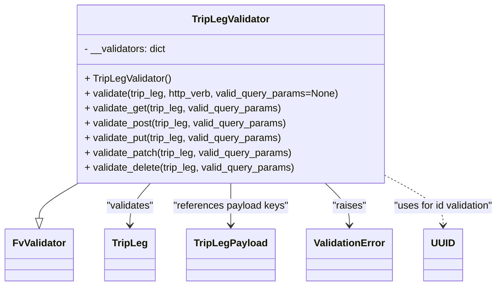
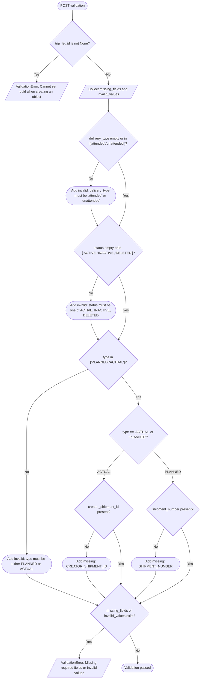

# Diagram: container_tracking_core/container_tracking_service/container_tracking_service/api/trip_leg/handlers/validate/TripLegValidator.py

> Auto-generated by Obscura crawlers

## Diagram 1

### SVG

<svg id="container" width="783.03125" xmlns="http://www.w3.org/2000/svg" class="classDiagram" height="462" viewBox="0 0 783.03125 462" role="graphics-document document" aria-roledescription="class"><g><defs><marker id="container_class-aggregationStart" class="marker aggregation class" refX="18" refY="7" markerWidth="190" markerHeight="240" orient="auto"><path d="M 18,7 L9,13 L1,7 L9,1 Z"></path></marker></defs><defs><marker id="container_class-aggregationEnd" class="marker aggregation class" refX="1" refY="7" markerWidth="20" markerHeight="28" orient="auto"><path d="M 18,7 L9,13 L1,7 L9,1 Z"></path></marker></defs><defs><marker id="container_class-extensionStart" class="marker extension class" refX="18" refY="7" markerWidth="190" markerHeight="240" orient="auto"><path d="M 1,7 L18,13 V 1 Z"></path></marker></defs><defs><marker id="container_class-extensionEnd" class="marker extension class" refX="1" refY="7" markerWidth="20" markerHeight="28" orient="auto"><path d="M 1,1 V 13 L18,7 Z"></path></marker></defs><defs><marker id="container_class-compositionStart" class="marker composition class" refX="18" refY="7" markerWidth="190" markerHeight="240" orient="auto"><path d="M 18,7 L9,13 L1,7 L9,1 Z"></path></marker></defs><defs><marker id="container_class-compositionEnd" class="marker composition class" refX="1" refY="7" markerWidth="20" markerHeight="28" orient="auto"><path d="M 18,7 L9,13 L1,7 L9,1 Z"></path></marker></defs><defs><marker id="container_class-dependencyStart" class="marker dependency class" refX="6" refY="7" markerWidth="190" markerHeight="240" orient="auto"><path d="M 5,7 L9,13 L1,7 L9,1 Z"></path></marker></defs><defs><marker id="container_class-dependencyEnd" class="marker dependency class" refX="13" refY="7" markerWidth="20" markerHeight="28" orient="auto"><path d="M 18,7 L9,13 L14,7 L9,1 Z"></path></marker></defs><defs><marker id="container_class-lollipopStart" class="marker lollipop class" refX="13" refY="7" markerWidth="190" markerHeight="240" orient="auto"><circle stroke="black" fill="transparent" cx="7" cy="7" r="6"></circle></marker></defs><defs><marker id="container_class-lollipopEnd" class="marker lollipop class" refX="1" refY="7" markerWidth="190" markerHeight="240" orient="auto"><circle stroke="black" fill="transparent" cx="7" cy="7" r="6"></circle></marker></defs><g class="root"><g class="clusters"></g><g class="edgePaths"><path d="M122.021,296L111.836,302.167C101.65,308.333,81.278,320.667,71.092,330.125C60.906,339.583,60.906,346.167,60.906,349.458L60.906,352.75" id="id_TripLegValidator_FvValidator_1" class="edge-thickness-normal edge-pattern-solid relation" style=";;;" data-edge="true" data-et="edge" data-id="id_TripLegValidator_FvValidator_1" data-points="W3sieCI6MTIyLjAyMTQwODgzOTc3OTAxLCJ5IjoyOTZ9LHsieCI6NjAuOTA2MjUsInkiOjMzM30seyJ4Ijo2MC45MDYyNSwieSI6MzcwfV0=" marker-end="url(#container_class-extensionEnd)"></path><path d="M234.963,296L229.613,302.167C224.264,308.333,213.566,320.667,208.216,332C202.867,343.333,202.867,353.667,202.867,358.833L202.867,364" id="id_TripLegValidator_TripLeg_2" class="edge-thickness-normal edge-pattern-solid relation" style=";;;" data-edge="true" data-et="edge" data-id="id_TripLegValidator_TripLeg_2" data-points="W3sieCI6MjM0Ljk2MjcwNzE4MjMyMDQ2LCJ5IjoyOTZ9LHsieCI6MjAyLjg2NzE4NzUsInkiOjMzM30seyJ4IjoyMDIuODY3MTg3NSwieSI6MzcwfV0=" marker-end="url(#container_class-dependencyEnd)"></path><path d="M359.875,296L359.875,302.167C359.875,308.333,359.875,320.667,359.875,332C359.875,343.333,359.875,353.667,359.875,358.833L359.875,364" id="id_TripLegValidator_TripLegPayload_3" class="edge-thickness-normal edge-pattern-solid relation" style=";;;" data-edge="true" data-et="edge" data-id="id_TripLegValidator_TripLegPayload_3" data-points="W3sieCI6MzU5Ljg3NSwieSI6Mjk2fSx7IngiOjM1OS44NzUsInkiOjMzM30seyJ4IjozNTkuODc1LCJ5IjozNzB9XQ==" marker-end="url(#container_class-dependencyEnd)"></path><path d="M507.163,296L513.47,302.167C519.778,308.333,532.393,320.667,538.7,332C545.008,343.333,545.008,353.667,545.008,358.833L545.008,364" id="id_TripLegValidator_ValidationError_4" class="edge-thickness-normal edge-pattern-solid relation" style=";;;" data-edge="true" data-et="edge" data-id="id_TripLegValidator_ValidationError_4" data-points="W3sieCI6NTA3LjE2Mjk4MzQyNTQxNDQsInkiOjI5Nn0seyJ4Ijo1NDUuMDA3ODEyNSwieSI6MzMzfSx7IngiOjU0NS4wMDc4MTI1LCJ5IjozNzB9XQ==" marker-end="url(#container_class-dependencyEnd)"></path><path d="M609.211,287.818L623.035,295.348C636.859,302.879,664.508,317.939,678.332,330.636C692.156,343.333,692.156,353.667,692.156,358.833L692.156,364" id="id_TripLegValidator_UUID_5" class="edge-thickness-normal edge-pattern-dashed relation" style=";;;" data-edge="true" data-et="edge" data-id="id_TripLegValidator_UUID_5" data-points="W3sieCI6NjA5LjIxMDkzNzUsInkiOjI4Ny44MTgwODk5MDg3NzQ2fSx7IngiOjY5Mi4xNTYyNSwieSI6MzMzfSx7IngiOjY5Mi4xNTYyNSwieSI6MzcwfV0=" marker-end="url(#container_class-dependencyEnd)"></path></g><g class="edgeLabels"><g class="edgeLabel"><g class="label" data-id="id_TripLegValidator_FvValidator_1" transform="translate(0, 0)"><foreignObject width="0" height="0">

</foreignObject></g></g><g class="edgeLabel" transform="translate(202.8671875, 333)"><g class="label" data-id="id_TripLegValidator_TripLeg_2" transform="translate(-38.9453125, -12)"><foreignObject width="77.890625" height="24">

"validates"

</foreignObject></g></g><g class="edgeLabel" transform="translate(359.875, 333)"><g class="label" data-id="id_TripLegValidator_TripLegPayload_3" transform="translate(-93.171875, -12)"><foreignObject width="186.34375" height="24">

"references payload keys"

</foreignObject></g></g><g class="edgeLabel" transform="translate(545.0078125, 333)"><g class="label" data-id="id_TripLegValidator_ValidationError_4" transform="translate(-27.515625, -12)"><foreignObject width="55.03125" height="24">

"raises"

</foreignObject></g></g><g class="edgeLabel" transform="translate(692.15625, 333)"><g class="label" data-id="id_TripLegValidator_UUID_5" transform="translate(-82.875, -12)"><foreignObject width="165.75" height="24">

"uses for id validation"

</foreignObject></g></g></g><g class="nodes"><g class="node default" id="classId-TripLegValidator-0" transform="translate(359.875, 152)"><g class="basic label-container"><path d="M-249.3359375 -144 L249.3359375 -144 L249.3359375 144 L-249.3359375 144" stroke="none" stroke-width="0" fill="#ECECFF" style=""></path><path d="M-249.3359375 -144 C-87.74372873337461 -144, 73.84848003325078 -144, 249.3359375 -144 M-249.3359375 -144 C-106.52334618210043 -144, 36.28924513579915 -144, 249.3359375 -144 M249.3359375 -144 C249.3359375 -44.98583555902297, 249.3359375 54.02832888195405, 249.3359375 144 M249.3359375 -144 C249.3359375 -81.39823159570132, 249.3359375 -18.796463191402637, 249.3359375 144 M249.3359375 144 C137.176432554683 144, 25.016927609366007 144, -249.3359375 144 M249.3359375 144 C127.93802970741389 144, 6.540121914827779 144, -249.3359375 144 M-249.3359375 144 C-249.3359375 72.97975599039366, -249.3359375 1.9595119807873118, -249.3359375 -144 M-249.3359375 144 C-249.3359375 76.7208382365979, -249.3359375 9.441676473195798, -249.3359375 -144" stroke="#9370DB" stroke-width="1.3" fill="none" stroke-dasharray="0 0" style=""></path></g><g class="annotation-group text" transform="translate(0, -120)"></g><g class="label-group text" transform="translate(-60.234375, -120)"><g class="label" style="font-weight: bolder" transform="translate(0,-12)"><foreignObject width="120.46875" height="24">

TripLegValidator

</foreignObject></g></g><g class="members-group text" transform="translate(-237.3359375, -72)"><g class="label" style="" transform="translate(0,-12)"><foreignObject width="134.203125" height="24">

- __validators: dict

</foreignObject></g></g><g class="methods-group text" transform="translate(-237.3359375, -24)"><g class="label" style="" transform="translate(0,-12)"><foreignObject width="140.515625" height="24">

+ TripLegValidator()

</foreignObject></g><g class="label" style="" transform="translate(0,12)"><foreignObject width="414.4375" height="24">

+ validate(trip_leg, http_verb, valid_query_params=None)

</foreignObject></g><g class="label" style="" transform="translate(0,36)"><foreignObject width="320.703125" height="24">

+ validate_get(trip_leg, valid_query_params)

</foreignObject></g><g class="label" style="" transform="translate(0,60)"><foreignObject width="330.09375" height="24">

+ validate_post(trip_leg, valid_query_params)

</foreignObject></g><g class="label" style="" transform="translate(0,84)"><foreignObject width="322.578125" height="24">

+ validate_put(trip_leg, valid_query_params)

</foreignObject></g><g class="label" style="" transform="translate(0,108)"><foreignObject width="338.59375" height="24">

+ validate_patch(trip_leg, valid_query_params)

</foreignObject></g><g class="label" style="" transform="translate(0,132)"><foreignObject width="343.546875" height="24">

+ validate_delete(trip_leg, valid_query_params)

</foreignObject></g></g><g class="divider" style=""><path d="M-249.3359375 -96 C-75.48671058674762 -96, 98.36251632650476 -96, 249.3359375 -96 M-249.3359375 -96 C-54.73322138590501 -96, 139.86949472818998 -96, 249.3359375 -96" stroke="#9370DB" stroke-width="1.3" fill="none" stroke-dasharray="0 0" style=""></path></g><g class="divider" style=""><path d="M-249.3359375 -48 C-115.18210710436259 -48, 18.971723291274827 -48, 249.3359375 -48 M-249.3359375 -48 C-60.31728892476883 -48, 128.70135965046234 -48, 249.3359375 -48" stroke="#9370DB" stroke-width="1.3" fill="none" stroke-dasharray="0 0" style=""></path></g></g><g class="node default" id="classId-FvValidator-1" transform="translate(60.90625, 412)"><g class="basic label-container"><path d="M-52.90625 -42 L52.90625 -42 L52.90625 42 L-52.90625 42" stroke="none" stroke-width="0" fill="#ECECFF" style=""></path><path d="M-52.90625 -42 C-26.422745959037744 -42, 0.06075808192451149 -42, 52.90625 -42 M-52.90625 -42 C-10.924075993399128 -42, 31.058098013201743 -42, 52.90625 -42 M52.90625 -42 C52.90625 -11.311061480384112, 52.90625 19.377877039231777, 52.90625 42 M52.90625 -42 C52.90625 -22.54463801175713, 52.90625 -3.089276023514259, 52.90625 42 M52.90625 42 C20.496587931625733 42, -11.913074136748534 42, -52.90625 42 M52.90625 42 C13.705519364815302 42, -25.495211270369396 42, -52.90625 42 M-52.90625 42 C-52.90625 19.873902812370755, -52.90625 -2.2521943752584903, -52.90625 -42 M-52.90625 42 C-52.90625 10.563488067010528, -52.90625 -20.873023865978944, -52.90625 -42" stroke="#9370DB" stroke-width="1.3" fill="none" stroke-dasharray="0 0" style=""></path></g><g class="annotation-group text" transform="translate(0, -18)"></g><g class="label-group text" transform="translate(-40.90625, -18)"><g class="label" style="font-weight: bolder" transform="translate(0,-12)"><foreignObject width="81.8125" height="24">

FvValidator

</foreignObject></g></g><g class="members-group text" transform="translate(-40.90625, 30)"></g><g class="methods-group text" transform="translate(-40.90625, 60)"></g><g class="divider" style=""><path d="M-52.90625 6 C-12.840966145502534 6, 27.22431770899493 6, 52.90625 6 M-52.90625 6 C-27.302974312367244 6, -1.6996986247344879 6, 52.90625 6" stroke="#9370DB" stroke-width="1.3" fill="none" stroke-dasharray="0 0" style=""></path></g><g class="divider" style=""><path d="M-52.90625 24 C-30.720341035991613 24, -8.534432071983225 24, 52.90625 24 M-52.90625 24 C-23.773633822813174 24, 5.3589823543736514 24, 52.90625 24" stroke="#9370DB" stroke-width="1.3" fill="none" stroke-dasharray="0 0" style=""></path></g></g><g class="node default" id="classId-TripLeg-2" transform="translate(202.8671875, 412)"><g class="basic label-container"><path d="M-39.0546875 -42 L39.0546875 -42 L39.0546875 42 L-39.0546875 42" stroke="none" stroke-width="0" fill="#ECECFF" style=""></path><path d="M-39.0546875 -42 C-8.367143487083112 -42, 22.320400525833776 -42, 39.0546875 -42 M-39.0546875 -42 C-11.827302366117497 -42, 15.400082767765007 -42, 39.0546875 -42 M39.0546875 -42 C39.0546875 -15.272719157180315, 39.0546875 11.45456168563937, 39.0546875 42 M39.0546875 -42 C39.0546875 -24.34549336945797, 39.0546875 -6.690986738915939, 39.0546875 42 M39.0546875 42 C8.917948182022268 42, -21.218791135955463 42, -39.0546875 42 M39.0546875 42 C10.717823474245119 42, -17.619040551509762 42, -39.0546875 42 M-39.0546875 42 C-39.0546875 10.54933068332421, -39.0546875 -20.90133863335158, -39.0546875 -42 M-39.0546875 42 C-39.0546875 18.485130966659895, -39.0546875 -5.02973806668021, -39.0546875 -42" stroke="#9370DB" stroke-width="1.3" fill="none" stroke-dasharray="0 0" style=""></path></g><g class="annotation-group text" transform="translate(0, -18)"></g><g class="label-group text" transform="translate(-27.0546875, -18)"><g class="label" style="font-weight: bolder" transform="translate(0,-12)"><foreignObject width="54.109375" height="24">

TripLeg

</foreignObject></g></g><g class="members-group text" transform="translate(-27.0546875, 30)"></g><g class="methods-group text" transform="translate(-27.0546875, 60)"></g><g class="divider" style=""><path d="M-39.0546875 6 C-19.848000224150198 6, -0.6413129483003956 6, 39.0546875 6 M-39.0546875 6 C-9.42294461523672 6, 20.20879826952656 6, 39.0546875 6" stroke="#9370DB" stroke-width="1.3" fill="none" stroke-dasharray="0 0" style=""></path></g><g class="divider" style=""><path d="M-39.0546875 24 C-19.5529578627859 24, -0.051228225571797736 24, 39.0546875 24 M-39.0546875 24 C-18.512324399985037 24, 2.0300387000299267 24, 39.0546875 24" stroke="#9370DB" stroke-width="1.3" fill="none" stroke-dasharray="0 0" style=""></path></g></g><g class="node default" id="classId-TripLegPayload-3" transform="translate(359.875, 412)"><g class="basic label-container"><path d="M-67.953125 -42 L67.953125 -42 L67.953125 42 L-67.953125 42" stroke="none" stroke-width="0" fill="#ECECFF" style=""></path><path d="M-67.953125 -42 C-30.64880143558222 -42, 6.655522128835557 -42, 67.953125 -42 M-67.953125 -42 C-17.362772924735566 -42, 33.22757915052887 -42, 67.953125 -42 M67.953125 -42 C67.953125 -10.36494921638283, 67.953125 21.27010156723434, 67.953125 42 M67.953125 -42 C67.953125 -24.8110256142134, 67.953125 -7.622051228426798, 67.953125 42 M67.953125 42 C20.390066510517393 42, -27.172991978965214 42, -67.953125 42 M67.953125 42 C36.89150254213382 42, 5.829880084267643 42, -67.953125 42 M-67.953125 42 C-67.953125 11.808212137621183, -67.953125 -18.383575724757634, -67.953125 -42 M-67.953125 42 C-67.953125 24.720743516948335, -67.953125 7.441487033896671, -67.953125 -42" stroke="#9370DB" stroke-width="1.3" fill="none" stroke-dasharray="0 0" style=""></path></g><g class="annotation-group text" transform="translate(0, -18)"></g><g class="label-group text" transform="translate(-55.953125, -18)"><g class="label" style="font-weight: bolder" transform="translate(0,-12)"><foreignObject width="111.90625" height="24">

TripLegPayload

</foreignObject></g></g><g class="members-group text" transform="translate(-55.953125, 30)"></g><g class="methods-group text" transform="translate(-55.953125, 60)"></g><g class="divider" style=""><path d="M-67.953125 6 C-39.82793521419502 6, -11.702745428390052 6, 67.953125 6 M-67.953125 6 C-37.45009071608673 6, -6.947056432173454 6, 67.953125 6" stroke="#9370DB" stroke-width="1.3" fill="none" stroke-dasharray="0 0" style=""></path></g><g class="divider" style=""><path d="M-67.953125 24 C-14.005712012617948 24, 39.9417009747641 24, 67.953125 24 M-67.953125 24 C-40.497722463834435 24, -13.042319927668878 24, 67.953125 24" stroke="#9370DB" stroke-width="1.3" fill="none" stroke-dasharray="0 0" style=""></path></g></g><g class="node default" id="classId-ValidationError-4" transform="translate(545.0078125, 412)"><g class="basic label-container"><path d="M-67.1796875 -42 L67.1796875 -42 L67.1796875 42 L-67.1796875 42" stroke="none" stroke-width="0" fill="#ECECFF" style=""></path><path d="M-67.1796875 -42 C-33.850472335574395 -42, -0.5212571711487897 -42, 67.1796875 -42 M-67.1796875 -42 C-20.826526469069584 -42, 25.52663456186083 -42, 67.1796875 -42 M67.1796875 -42 C67.1796875 -18.94915302282785, 67.1796875 4.101693954344299, 67.1796875 42 M67.1796875 -42 C67.1796875 -19.038904846979264, 67.1796875 3.922190306041472, 67.1796875 42 M67.1796875 42 C32.196141759149974 42, -2.787403981700052 42, -67.1796875 42 M67.1796875 42 C16.425062665469284 42, -34.32956216906143 42, -67.1796875 42 M-67.1796875 42 C-67.1796875 23.9689115793153, -67.1796875 5.9378231586306, -67.1796875 -42 M-67.1796875 42 C-67.1796875 17.143263978387715, -67.1796875 -7.71347204322457, -67.1796875 -42" stroke="#9370DB" stroke-width="1.3" fill="none" stroke-dasharray="0 0" style=""></path></g><g class="annotation-group text" transform="translate(0, -18)"></g><g class="label-group text" transform="translate(-55.1796875, -18)"><g class="label" style="font-weight: bolder" transform="translate(0,-12)"><foreignObject width="110.359375" height="24">

ValidationError

</foreignObject></g></g><g class="members-group text" transform="translate(-55.1796875, 30)"></g><g class="methods-group text" transform="translate(-55.1796875, 60)"></g><g class="divider" style=""><path d="M-67.1796875 6 C-37.38735639881941 6, -7.595025297638827 6, 67.1796875 6 M-67.1796875 6 C-20.716664792901767 6, 25.746357914196466 6, 67.1796875 6" stroke="#9370DB" stroke-width="1.3" fill="none" stroke-dasharray="0 0" style=""></path></g><g class="divider" style=""><path d="M-67.1796875 24 C-36.3272671633145 24, -5.474846826629005 24, 67.1796875 24 M-67.1796875 24 C-33.97557097092728 24, -0.7714544418545586 24, 67.1796875 24" stroke="#9370DB" stroke-width="1.3" fill="none" stroke-dasharray="0 0" style=""></path></g></g><g class="node default" id="classId-UUID-5" transform="translate(692.15625, 412)"><g class="basic label-container"><path d="M-29.96875 -42 L29.96875 -42 L29.96875 42 L-29.96875 42" stroke="none" stroke-width="0" fill="#ECECFF" style=""></path><path d="M-29.96875 -42 C-15.424203587837797 -42, -0.8796571756755931 -42, 29.96875 -42 M-29.96875 -42 C-16.656140467626 -42, -3.343530935251998 -42, 29.96875 -42 M29.96875 -42 C29.96875 -24.167155924227195, 29.96875 -6.334311848454391, 29.96875 42 M29.96875 -42 C29.96875 -19.083823283949524, 29.96875 3.832353432100952, 29.96875 42 M29.96875 42 C9.930114449847874 42, -10.108521100304252 42, -29.96875 42 M29.96875 42 C16.302636055872057 42, 2.63652211174411 42, -29.96875 42 M-29.96875 42 C-29.96875 13.546002023401773, -29.96875 -14.907995953196455, -29.96875 -42 M-29.96875 42 C-29.96875 11.642743978389976, -29.96875 -18.714512043220047, -29.96875 -42" stroke="#9370DB" stroke-width="1.3" fill="none" stroke-dasharray="0 0" style=""></path></g><g class="annotation-group text" transform="translate(0, -18)"></g><g class="label-group text" transform="translate(-17.96875, -18)"><g class="label" style="font-weight: bolder" transform="translate(0,-12)"><foreignObject width="35.9375" height="24">

UUID

</foreignObject></g></g><g class="members-group text" transform="translate(-17.96875, 30)"></g><g class="methods-group text" transform="translate(-17.96875, 60)"></g><g class="divider" style=""><path d="M-29.96875 6 C-15.626208105611148 6, -1.2836662112222967 6, 29.96875 6 M-29.96875 6 C-13.74288547146081 6, 2.4829790570783814 6, 29.96875 6" stroke="#9370DB" stroke-width="1.3" fill="none" stroke-dasharray="0 0" style=""></path></g><g class="divider" style=""><path d="M-29.96875 24 C-16.853762853657827 24, -3.738775707315657 24, 29.96875 24 M-29.96875 24 C-13.478588398072233 24, 3.0115732038555336 24, 29.96875 24" stroke="#9370DB" stroke-width="1.3" fill="none" stroke-dasharray="0 0" style=""></path></g></g></g></g></g></svg>

## Diagram 2

### SVG

<svg id="container" width="945.5203857421875" xmlns="http://www.w3.org/2000/svg" class="flowchart" height="3138.140625" viewBox="0 0 945.5203857421875 3138.140625" role="graphics-document document" aria-roledescription="flowchart-v2"><g><marker id="container_flowchart-v2-pointEnd" class="marker flowchart-v2" viewBox="0 0 10 10" refX="5" refY="5" markerUnits="userSpaceOnUse" markerWidth="8" markerHeight="8" orient="auto"><path d="M 0 0 L 10 5 L 0 10 z" class="arrowMarkerPath" style="stroke-width: 1; stroke-dasharray: 1, 0;"></path></marker><marker id="container_flowchart-v2-pointStart" class="marker flowchart-v2" viewBox="0 0 10 10" refX="4.5" refY="5" markerUnits="userSpaceOnUse" markerWidth="8" markerHeight="8" orient="auto"><path d="M 0 5 L 10 10 L 10 0 z" class="arrowMarkerPath" style="stroke-width: 1; stroke-dasharray: 1, 0;"></path></marker><marker id="container_flowchart-v2-circleEnd" class="marker flowchart-v2" viewBox="0 0 10 10" refX="11" refY="5" markerUnits="userSpaceOnUse" markerWidth="11" markerHeight="11" orient="auto"><circle cx="5" cy="5" r="5" class="arrowMarkerPath" style="stroke-width: 1; stroke-dasharray: 1, 0;"></circle></marker><marker id="container_flowchart-v2-circleStart" class="marker flowchart-v2" viewBox="0 0 10 10" refX="-1" refY="5" markerUnits="userSpaceOnUse" markerWidth="11" markerHeight="11" orient="auto"><circle cx="5" cy="5" r="5" class="arrowMarkerPath" style="stroke-width: 1; stroke-dasharray: 1, 0;"></circle></marker><marker id="container_flowchart-v2-crossEnd" class="marker cross flowchart-v2" viewBox="0 0 11 11" refX="12" refY="5.2" markerUnits="userSpaceOnUse" markerWidth="11" markerHeight="11" orient="auto"><path d="M 1,1 l 9,9 M 10,1 l -9,9" class="arrowMarkerPath" style="stroke-width: 2; stroke-dasharray: 1, 0;"></path></marker><marker id="container_flowchart-v2-crossStart" class="marker cross flowchart-v2" viewBox="0 0 11 11" refX="-1" refY="5.2" markerUnits="userSpaceOnUse" markerWidth="11" markerHeight="11" orient="auto"><path d="M 1,1 l 9,9 M 10,1 l -9,9" class="arrowMarkerPath" style="stroke-width: 2; stroke-dasharray: 1, 0;"></path></marker><g class="root"><g class="clusters"></g><g class="edgePaths"><path d="M337.803,47.5L337.719,51.583C337.636,55.667,337.469,63.833,337.386,71.417C337.303,79,337.303,86,337.303,89.5L337.303,93" id="L_Start_CheckId_0" class="edge-thickness-normal edge-pattern-solid edge-thickness-normal edge-pattern-solid flowchart-link" style=";" data-edge="true" data-et="edge" data-id="L_Start_CheckId_0" data-points="W3sieCI6MzM3LjgwMjczODE4OTY5NzI3LCJ5Ijo0Ny40OTk5OTk5OTk5OTk5OH0seyJ4IjozMzcuMzAyNzM4MTg5Njk3MjcsInkiOjcyfSx7IngiOjMzNy4zMDI3MzgxODk2OTcyNywieSI6OTd9XQ==" marker-end="url(#container_flowchart-v2-pointEnd)"></path><path d="M278.023,259.376L259.57,275.423C241.116,291.47,204.209,323.563,185.831,345.193C167.452,366.823,167.601,377.99,167.675,383.573L167.749,389.157" id="L_CheckId_ErrSetUuid_0" class="edge-thickness-normal edge-pattern-solid edge-thickness-normal edge-pattern-solid flowchart-link" style=";" data-edge="true" data-et="edge" data-id="L_CheckId_ErrSetUuid_0" data-points="W3sieCI6Mjc4LjAyMjk1ODQzNDUyMjkzLCJ5IjoyNTkuMzc2NDcwMjQ0ODI1N30seyJ4IjoxNjcuMzAyNzM4MTg5Njk3MjcsInkiOjM1NS42NTYyNX0seyJ4IjoxNjcuODAyNzM4MTg5Njk3MjcsInkiOjM5My4xNTYyNX1d" marker-end="url(#container_flowchart-v2-pointEnd)"></path><path d="M396.583,259.376L415.036,275.423C433.489,291.47,470.396,323.563,488.926,347.193C507.456,370.823,507.609,385.99,507.686,393.573L507.762,401.156" id="L_CheckId_RequiredChecks_0" class="edge-thickness-normal edge-pattern-solid edge-thickness-normal edge-pattern-solid flowchart-link" style=";" data-edge="true" data-et="edge" data-id="L_CheckId_RequiredChecks_0" data-points="W3sieCI6Mzk2LjU4MjUxNzk0NDg3MTU0LCJ5IjoyNTkuMzc2NDcwMjQ0ODI1N30seyJ4Ijo1MDcuMzAyNzM4MTg5Njk3MjcsInkiOjM1NS42NTYyNX0seyJ4Ijo1MDcuODAyNzM4MTg5Njk3MjcsInkiOjQwNS4xNTYyNX1d" marker-end="url(#container_flowchart-v2-pointEnd)"></path><path d="M507.803,468.156L507.719,474.24C507.636,480.323,507.469,492.49,507.386,502.073C507.303,511.656,507.303,518.656,507.303,522.156L507.303,525.656" id="L_RequiredChecks_CheckDelivery_0" class="edge-thickness-normal edge-pattern-solid edge-thickness-normal edge-pattern-solid flowchart-link" style=";" data-edge="true" data-et="edge" data-id="L_RequiredChecks_CheckDelivery_0" data-points="W3sieCI6NTA3LjgwMjczODE4OTY5NzI3LCJ5Ijo0NjguMTU2MjV9LHsieCI6NTA3LjMwMjczODE4OTY5NzI3LCJ5Ijo1MDQuNjU2MjV9LHsieCI6NTA3LjMwMjczODE4OTY5NzI3LCJ5Ijo1MjkuNjU2MjV9XQ==" marker-end="url(#container_flowchart-v2-pointEnd)"></path><path d="M462.871,763.224L456.494,776.796C450.117,790.368,437.364,817.512,431.062,836.668C424.76,855.823,424.909,866.99,424.983,872.573L425.057,878.157" id="L_CheckDelivery_AddInvalidDelivery_0" class="edge-thickness-normal edge-pattern-solid edge-thickness-normal edge-pattern-solid flowchart-link" style=";" data-edge="true" data-et="edge" data-id="L_CheckDelivery_AddInvalidDelivery_0" data-points="W3sieCI6NDYyLjg3MDgxMzU5NDk5Nzg2LCJ5Ijo3NjMuMjI0MzI1NDA1MzAwNn0seyJ4Ijo0MjQuNjEwNzg2NDM3OTg4MywieSI6ODQ0LjY1NjI1fSx7IngiOjQyNS4xMTA3ODY0Mzc5ODgzLCJ5Ijo4ODIuMTU2MjV9XQ==" marker-end="url(#container_flowchart-v2-pointEnd)"></path><path d="M551.735,763.224L558.111,776.796C564.488,790.368,577.241,817.512,583.618,844.501C589.995,871.49,589.995,898.323,589.995,923.156C589.995,947.99,589.995,970.823,584.44,993.743C578.885,1016.663,567.775,1039.67,562.22,1051.174L556.665,1062.677" id="L_CheckDelivery_CheckStatus_0" class="edge-thickness-normal edge-pattern-solid edge-thickness-normal edge-pattern-solid flowchart-link" style=";" data-edge="true" data-et="edge" data-id="L_CheckDelivery_CheckStatus_0" data-points="W3sieCI6NTUxLjczNDY2Mjc4NDM5NjcsInkiOjc2My4yMjQzMjU0MDUzMDA2fSx7IngiOjU4OS45OTQ2ODk5NDE0MDYyLCJ5Ijo4NDQuNjU2MjV9LHsieCI6NTg5Ljk5NDY4OTk0MTQwNjIsInkiOjkyNS4xNTYyNX0seyJ4Ijo1ODkuOTk0Njg5OTQxNDA2MiwieSI6OTkzLjY1NjI1fSx7IngiOjU1NC45MjU1MjcxMDgzMTI0LCJ5IjoxMDY2LjI3OTAzODkxODYxNTJ9XQ==" marker-end="url(#container_flowchart-v2-pointEnd)"></path><path d="M425.111,969.156L425.027,973.24C424.944,977.323,424.777,985.49,430.249,1001.076C435.721,1016.663,446.831,1039.67,452.386,1051.174L457.941,1062.677" id="L_AddInvalidDelivery_CheckStatus_0" class="edge-thickness-normal edge-pattern-solid edge-thickness-normal edge-pattern-solid flowchart-link" style=";" data-edge="true" data-et="edge" data-id="L_AddInvalidDelivery_CheckStatus_0" data-points="W3sieCI6NDI1LjExMDc4NjQzNzk4ODMsInkiOjk2OS4xNTYyNX0seyJ4Ijo0MjQuNjEwNzg2NDM3OTg4MywieSI6OTkzLjY1NjI1fSx7IngiOjQ1OS42Nzk5NDkyNzEwODIxLCJ5IjoxMDY2LjI3OTAzODkxODYxNTJ9XQ==" marker-end="url(#container_flowchart-v2-pointEnd)"></path><path d="M461.829,1265.667L455.626,1279.412C449.423,1293.158,437.017,1320.649,430.888,1339.978C424.76,1359.307,424.909,1370.474,424.983,1376.058L425.057,1381.641" id="L_CheckStatus_AddInvalidStatus_0" class="edge-thickness-normal edge-pattern-solid edge-thickness-normal edge-pattern-solid flowchart-link" style=";" data-edge="true" data-et="edge" data-id="L_CheckStatus_AddInvalidStatus_0" data-points="W3sieCI6NDYxLjgyODg3NzgzMTQ4MiwieSI6MTI2NS42NjY3NjQ2NDE3ODQ4fSx7IngiOjQyNC42MTA3ODY0Mzc5ODgzLCJ5IjoxMzQ4LjE0MDYyNX0seyJ4Ijo0MjUuMTEwNzg2NDM3OTg4MywieSI6MTM4NS42NDA2MjUwMDAwMDA1fV0=" marker-end="url(#container_flowchart-v2-pointEnd)"></path><path d="M552.777,1265.667L558.98,1279.412C565.183,1293.158,577.589,1320.649,583.792,1347.812C589.995,1374.974,589.995,1401.807,589.995,1426.641C589.995,1451.474,589.995,1474.307,584.278,1497.061C578.562,1519.814,567.129,1542.488,561.413,1553.825L555.697,1565.162" id="L_CheckStatus_CheckType_0" class="edge-thickness-normal edge-pattern-solid edge-thickness-normal edge-pattern-solid flowchart-link" style=";" data-edge="true" data-et="edge" data-id="L_CheckStatus_CheckType_0" data-points="W3sieCI6NTUyLjc3NjU5ODU0NzkxMjUsInkiOjEyNjUuNjY2NzY0NjQxNzg0OH0seyJ4Ijo1ODkuOTk0Njg5OTQxNDA2MiwieSI6MTM0OC4xNDA2MjV9LHsieCI6NTg5Ljk5NDY4OTk0MTQwNjIsInkiOjE0MjguNjQwNjI1fSx7IngiOjU4OS45OTQ2ODk5NDE0MDYyLCJ5IjoxNDk3LjE0MDYyNX0seyJ4Ijo1NTMuODk1OTk0MzIwOTU2MiwieSI6MTU2OC43MzM4ODExMzEyNTg4fV0=" marker-end="url(#container_flowchart-v2-pointEnd)"></path><path d="M425.111,1472.641L425.027,1476.724C424.944,1480.807,424.777,1488.974,430.41,1504.394C436.043,1519.814,447.476,1542.488,453.192,1553.825L458.909,1565.162" id="L_AddInvalidStatus_CheckType_0" class="edge-thickness-normal edge-pattern-solid edge-thickness-normal edge-pattern-solid flowchart-link" style=";" data-edge="true" data-et="edge" data-id="L_AddInvalidStatus_CheckType_0" data-points="W3sieCI6NDI1LjExMDc4NjQzNzk4ODMsInkiOjE0NzIuNjQwNjI1MDAwMDAwNX0seyJ4Ijo0MjQuNjEwNzg2NDM3OTg4MywieSI6MTQ5Ny4xNDA2MjV9LHsieCI6NDYwLjcwOTQ4MjA1ODQzODM3LCJ5IjoxNTY4LjczMzg4MTEzMTI1ODh9XQ==" marker-end="url(#container_flowchart-v2-pointEnd)"></path><path d="M411.993,1704.831L363.887,1726.882C315.781,1748.934,219.57,1793.037,171.464,1844.422C123.359,1895.807,123.359,1954.474,123.359,2013.141C123.359,2071.807,123.359,2130.474,123.359,2189.141C123.359,2247.807,123.359,2306.474,123.359,2365.141C123.359,2423.807,123.359,2482.474,123.433,2517.391C123.508,2552.307,123.657,2563.474,123.731,2569.058L123.805,2574.641" id="L_CheckType_AddInvalidType_0" class="edge-thickness-normal edge-pattern-solid edge-thickness-normal edge-pattern-solid flowchart-link" style=";" data-edge="true" data-et="edge" data-id="L_CheckType_AddInvalidType_0" data-points="W3sieCI6NDExLjk5MjgyNzcxNTIzNDE3LCJ5IjoxNzA0LjgzMDcxNDUyNTUzN30seyJ4IjoxMjMuMzU4ODE4MDU0MTk5MjIsInkiOjE4MzcuMTQwNjI1fSx7IngiOjEyMy4zNTg4MTgwNTQxOTkyMiwieSI6MjAxMy4xNDA2MjV9LHsieCI6MTIzLjM1ODgxODA1NDE5OTIyLCJ5IjoyMTg5LjE0MDYyNX0seyJ4IjoxMjMuMzU4ODE4MDU0MTk5MjIsInkiOjIzNjUuMTQwNjI1fSx7IngiOjEyMy4zNTg4MTgwNTQxOTkyMiwieSI6MjU0MS4xNDA2MjV9LHsieCI6MTIzLjg1ODgxODA1NDE5OTIyLCJ5IjoyNTc4LjY0MDYyNX1d" marker-end="url(#container_flowchart-v2-pointEnd)"></path><path d="M568.973,1738.471L582.088,1754.916C595.202,1771.361,621.432,1804.251,634.547,1826.196C647.662,1848.141,647.662,1859.141,647.662,1864.641L647.662,1870.141" id="L_CheckType_TypeBranch_0" class="edge-thickness-normal edge-pattern-solid edge-thickness-normal edge-pattern-solid flowchart-link" style=";" data-edge="true" data-et="edge" data-id="L_CheckType_TypeBranch_0" data-points="W3sieCI6NTY4Ljk3MjgyNDgwMDYyNjUsInkiOjE3MzguNDcwNTM4Mzg5MDcwN30seyJ4Ijo2NDcuNjYxNTU2MjQzODk2NSwieSI6MTgzNy4xNDA2MjV9LHsieCI6NjQ3LjY2MTU1NjI0Mzg5NjUsInkiOjE4NzQuMTQwNjI1fV0=" marker-end="url(#container_flowchart-v2-pointEnd)"></path><path d="M580.957,2085.436L565.009,2102.72C549.062,2120.004,517.167,2154.572,501.219,2177.357C485.271,2200.141,485.271,2211.141,485.271,2216.641L485.271,2222.141" id="L_TypeBranch_CheckCreatorShipment_0" class="edge-thickness-normal edge-pattern-solid edge-thickness-normal edge-pattern-solid flowchart-link" style=";" data-edge="true" data-et="edge" data-id="L_TypeBranch_CheckCreatorShipment_0" data-points="W3sieCI6NTgwLjk1NjgyMjI5Nzg2ODQsInkiOjIwODUuNDM1ODkxMDUzOTcyfSx7IngiOjQ4NS4yNzE0ODgxODk2OTcyNywieSI6MjE4OS4xNDA2MjV9LHsieCI6NDg1LjI3MTQ4ODE4OTY5NzI3LCJ5IjoyMjI2LjE0MDYyNX1d" marker-end="url(#container_flowchart-v2-pointEnd)"></path><path d="M714.366,2085.436L730.314,2102.72C746.261,2120.004,778.157,2154.572,794.104,2179.362C810.052,2204.151,810.052,2219.161,810.052,2226.667L810.052,2234.172" id="L_TypeBranch_CheckShipmentNumber_0" class="edge-thickness-normal edge-pattern-solid edge-thickness-normal edge-pattern-solid flowchart-link" style=";" data-edge="true" data-et="edge" data-id="L_TypeBranch_CheckShipmentNumber_0" data-points="W3sieCI6NzE0LjM2NjI5MDE4OTkyNDUsInkiOjIwODUuNDM1ODkxMDUzOTcyfSx7IngiOjgxMC4wNTE2MjQyOTgwOTU3LCJ5IjoyMTg5LjE0MDYyNX0seyJ4Ijo4MTAuMDUxNjI0Mjk4MDk1NywieSI6MjIzOC4xNzE4NzV9XQ==" marker-end="url(#container_flowchart-v2-pointEnd)"></path><path d="M441.39,2460.259L435.171,2473.739C428.952,2487.22,416.514,2514.18,410.37,2533.244C404.225,2552.307,404.374,2563.474,404.449,2569.058L404.523,2574.641" id="L_CheckCreatorShipment_AddMissingCreator_0" class="edge-thickness-normal edge-pattern-solid edge-thickness-normal edge-pattern-solid flowchart-link" style=";" data-edge="true" data-et="edge" data-id="L_CheckCreatorShipment_AddMissingCreator_0" data-points="W3sieCI6NDQxLjM4OTk2NTQ2NzIyNjMsInkiOjI0NjAuMjU5MTAyMjc3NTI5fSx7IngiOjQwNC4wNzY0NTQxNjI1OTc2NiwieSI6MjU0MS4xNDA2MjV9LHsieCI6NDA0LjU3NjQ1NDE2MjU5NzY2LCJ5IjoyNTc4LjY0MDYyNTAwMDAwMDV9XQ==" marker-end="url(#container_flowchart-v2-pointEnd)"></path><path d="M529.153,2460.259L535.372,2473.739C541.591,2487.22,554.029,2514.18,560.248,2539.077C566.467,2563.974,566.467,2586.807,566.467,2607.641C566.467,2628.474,566.467,2647.307,566.256,2661.252C566.046,2675.197,565.626,2684.253,565.416,2688.781L565.206,2693.309" id="L_CheckCreatorShipment_EvaluateErrors_0" class="edge-thickness-normal edge-pattern-solid edge-thickness-normal edge-pattern-solid flowchart-link" style=";" data-edge="true" data-et="edge" data-id="L_CheckCreatorShipment_EvaluateErrors_0" data-points="W3sieCI6NTI5LjE1MzAxMDkxMjE2ODIsInkiOjI0NjAuMjU5MTAyMjc3NTI5fSx7IngiOjU2Ni40NjY1MjIyMTY3OTY5LCJ5IjoyNTQxLjE0MDYyNX0seyJ4Ijo1NjYuNDY2NTIyMjE2Nzk2OSwieSI6MjYwOS42NDA2MjV9LHsieCI6NTY2LjQ2NjUyMjIxNjc5NjksInkiOjI2NjYuMTQwNjI1fSx7IngiOjU2NS4wMjA0NTU3Nzk2NjgzLCJ5IjoyNjk3LjMwNDQ5MDUwODY3Mn1d" marker-end="url(#container_flowchart-v2-pointEnd)"></path><path d="M769.968,2452.026L763.116,2466.878C756.264,2481.731,742.56,2511.436,735.783,2531.872C729.005,2552.307,729.154,2563.474,729.229,2569.058L729.303,2574.641" id="L_CheckShipmentNumber_AddMissingShipment_0" class="edge-thickness-normal edge-pattern-solid edge-thickness-normal edge-pattern-solid flowchart-link" style=";" data-edge="true" data-et="edge" data-id="L_CheckShipmentNumber_AddMissingShipment_0" data-points="W3sieCI6NzY5Ljk2ODI5OTkyMjc4MTEsInkiOjI0NTIuMDI2MDUwNjI0Njg1NX0seyJ4Ijo3MjguODU2NTkwMjcwOTk2MSwieSI6MjU0MS4xNDA2MjV9LHsieCI6NzI5LjM1NjU5MDI3MDk5NjEsInkiOjI1NzguNjQwNjI1fV0=" marker-end="url(#container_flowchart-v2-pointEnd)"></path><path d="M850.135,2452.026L856.987,2466.878C863.839,2481.731,877.543,2511.436,884.395,2537.705C891.247,2563.974,891.247,2586.807,891.247,2607.641C891.247,2628.474,891.247,2647.307,851.959,2676.108C812.671,2704.909,734.096,2743.678,694.808,2763.063L655.52,2782.447" id="L_CheckShipmentNumber_EvaluateErrors_0" class="edge-thickness-normal edge-pattern-solid edge-thickness-normal edge-pattern-solid flowchart-link" style=";" data-edge="true" data-et="edge" data-id="L_CheckShipmentNumber_EvaluateErrors_0" data-points="W3sieCI6ODUwLjEzNDk0ODY3MzQxMDUsInkiOjI0NTIuMDI2MDUwNjI0Njg1NX0seyJ4Ijo4OTEuMjQ2NjU4MzI1MTk1MywieSI6MjU0MS4xNDA2MjV9LHsieCI6ODkxLjI0NjY1ODMyNTE5NTMsInkiOjI2MDkuNjQwNjI1fSx7IngiOjg5MS4yNDY2NTgzMjUxOTUzLCJ5IjoyNjY2LjE0MDYyNX0seyJ4Ijo2NTEuOTMzMDI4NDA0OTA1MywieSI6Mjc4NC4yMTcwNjMxMzM5MDk1fV0=" marker-end="url(#container_flowchart-v2-pointEnd)"></path><path d="M404.576,2641.641L404.493,2645.724C404.41,2649.807,404.243,2657.974,418.251,2676.987C432.258,2696.001,460.44,2725.861,474.53,2740.791L488.621,2755.722" id="L_AddMissingCreator_EvaluateErrors_0" class="edge-thickness-normal edge-pattern-solid edge-thickness-normal edge-pattern-solid flowchart-link" style=";" data-edge="true" data-et="edge" data-id="L_AddMissingCreator_EvaluateErrors_0" data-points="W3sieCI6NDA0LjU3NjQ1NDE2MjU5NzY2LCJ5IjoyNjQxLjY0MDYyNTAwMDAwMX0seyJ4Ijo0MDQuMDc2NDU0MTYyNTk3NjYsInkiOjI2NjYuMTQwNjI1fSx7IngiOjQ5MS4zNjY2OTIxMTgyNzE5NCwieSI6Mjc1OC42MzA1MjMxNTI3MjQ0fV0=" marker-end="url(#container_flowchart-v2-pointEnd)"></path><path d="M729.357,2641.641L729.273,2645.724C729.19,2649.807,729.023,2657.974,712.878,2677.553C696.732,2697.131,664.608,2728.122,648.546,2743.617L632.484,2759.112" id="L_AddMissingShipment_EvaluateErrors_0" class="edge-thickness-normal edge-pattern-solid edge-thickness-normal edge-pattern-solid flowchart-link" style=";" data-edge="true" data-et="edge" data-id="L_AddMissingShipment_EvaluateErrors_0" data-points="W3sieCI6NzI5LjM1NjU5MDI3MDk5NjEsInkiOjI2NDEuNjQwNjI1fSx7IngiOjcyOC44NTY1OTAyNzA5OTYxLCJ5IjoyNjY2LjE0MDYyNX0seyJ4Ijo2MjkuNjA1MDkzMjY1MDA4MSwieSI6Mjc2MS44ODkxMjc5OTQwMTJ9XQ==" marker-end="url(#container_flowchart-v2-pointEnd)"></path><path d="M123.859,2641.641L123.775,2645.724C123.692,2649.807,123.525,2657.974,178.572,2682.818C233.619,2707.662,343.879,2749.184,399.008,2769.945L454.138,2790.706" id="L_AddInvalidType_EvaluateErrors_0" class="edge-thickness-normal edge-pattern-solid edge-thickness-normal edge-pattern-solid flowchart-link" style=";" data-edge="true" data-et="edge" data-id="L_AddInvalidType_EvaluateErrors_0" data-points="W3sieCI6MTIzLjg1ODgxODA1NDE5OTIyLCJ5IjoyNjQxLjY0MDYyNX0seyJ4IjoxMjMuMzU4ODE4MDU0MTk5MjIsInkiOjI2NjYuMTQwNjI1fSx7IngiOjQ1Ny44ODE3NTI0MjU4MjExLCJ5IjoyNzkyLjExNTQ2Mjg0NTE3NX1d" marker-end="url(#container_flowchart-v2-pointEnd)"></path><path d="M486.633,2896.917L466.944,2915.121C447.255,2933.325,407.877,2969.733,388.263,2993.52C368.648,3017.307,368.797,3028.474,368.871,3034.058L368.946,3039.641" id="L_EvaluateErrors_RaiseErrors_0" class="edge-thickness-normal edge-pattern-solid edge-thickness-normal edge-pattern-solid flowchart-link" style=";" data-edge="true" data-et="edge" data-id="L_EvaluateErrors_RaiseErrors_0" data-points="W3sieCI6NDg2LjYzMjkwNjI5NTU3MzA0LCJ5IjoyODk2LjkxNjk0MTAyNDU3N30seyJ4IjozNjguNDk5MTUzMTM3MjA3MDMsInkiOjMwMDYuMTQwNjI1fSx7IngiOjM2OC45OTkxNTMxMzcyMDcwMywieSI6MzA0My42NDA2MjV9XQ==" marker-end="url(#container_flowchart-v2-pointEnd)"></path><path d="M604.926,2923.071L611.789,2936.916C618.653,2950.761,632.379,2978.451,639.321,3001.879C646.262,3025.307,646.418,3044.474,646.496,3054.057L646.574,3063.641" id="L_EvaluateErrors_Success_0" class="edge-thickness-normal edge-pattern-solid edge-thickness-normal edge-pattern-solid flowchart-link" style=";" data-edge="true" data-et="edge" data-id="L_EvaluateErrors_Success_0" data-points="W3sieCI6NjA0LjkyNTgyMTc0MjI1LCJ5IjoyOTIzLjA3MTM5MzUyODc0NjN9LHsieCI6NjQ2LjEwNjMyMzI0MjE4NzUsInkiOjMwMDYuMTQwNjI1fSx7IngiOjY0Ni42MDYzMjMyNDIxODc1LCJ5IjozMDY3LjY0MDYyNDk5OTk5OH1d" marker-end="url(#container_flowchart-v2-pointEnd)"></path></g><g class="edgeLabels"><g class="edgeLabel"><g class="label" data-id="L_Start_CheckId_0" transform="translate(0, 0)"><foreignObject width="0" height="0">

</foreignObject></g></g><g class="edgeLabel" transform="translate(167.30273818969727, 355.65625)"><g class="label" data-id="L_CheckId_ErrSetUuid_0" transform="translate(-12.03125, -12)"><foreignObject width="24.0625" height="24">

Yes

</foreignObject></g></g><g class="edgeLabel" transform="translate(507.30273818969727, 355.65625)"><g class="label" data-id="L_CheckId_RequiredChecks_0" transform="translate(-10.140625, -12)"><foreignObject width="20.28125" height="24">

No

</foreignObject></g></g><g class="edgeLabel"><g class="label" data-id="L_RequiredChecks_CheckDelivery_0" transform="translate(0, 0)"><foreignObject width="0" height="0">

</foreignObject></g></g><g class="edgeLabel" transform="translate(424.6107864379883, 844.65625)"><g class="label" data-id="L_CheckDelivery_AddInvalidDelivery_0" transform="translate(-10.140625, -12)"><foreignObject width="20.28125" height="24">

No

</foreignObject></g></g><g class="edgeLabel" transform="translate(589.9946899414062, 925.15625)"><g class="label" data-id="L_CheckDelivery_CheckStatus_0" transform="translate(-12.03125, -12)"><foreignObject width="24.0625" height="24">

Yes

</foreignObject></g></g><g class="edgeLabel"><g class="label" data-id="L_AddInvalidDelivery_CheckStatus_0" transform="translate(0, 0)"><foreignObject width="0" height="0">

</foreignObject></g></g><g class="edgeLabel" transform="translate(424.6107864379883, 1348.140625)"><g class="label" data-id="L_CheckStatus_AddInvalidStatus_0" transform="translate(-10.140625, -12)"><foreignObject width="20.28125" height="24">

No

</foreignObject></g></g><g class="edgeLabel" transform="translate(589.9946899414062, 1428.640625)"><g class="label" data-id="L_CheckStatus_CheckType_0" transform="translate(-12.03125, -12)"><foreignObject width="24.0625" height="24">

Yes

</foreignObject></g></g><g class="edgeLabel"><g class="label" data-id="L_AddInvalidStatus_CheckType_0" transform="translate(0, 0)"><foreignObject width="0" height="0">

</foreignObject></g></g><g class="edgeLabel" transform="translate(123.35881805419922, 2189.140625)"><g class="label" data-id="L_CheckType_AddInvalidType_0" transform="translate(-10.140625, -12)"><foreignObject width="20.28125" height="24">

No

</foreignObject></g></g><g class="edgeLabel" transform="translate(647.6615562438965, 1837.140625)"><g class="label" data-id="L_CheckType_TypeBranch_0" transform="translate(-12.03125, -12)"><foreignObject width="24.0625" height="24">

Yes

</foreignObject></g></g><g class="edgeLabel" transform="translate(485.27148818969727, 2189.140625)"><g class="label" data-id="L_TypeBranch_CheckCreatorShipment_0" transform="translate(-26.828125, -12)"><foreignObject width="53.65625" height="24">

ACTUAL

</foreignObject></g></g><g class="edgeLabel" transform="translate(810.0516242980957, 2189.140625)"><g class="label" data-id="L_TypeBranch_CheckShipmentNumber_0" transform="translate(-33.578125, -12)"><foreignObject width="67.15625" height="24">

PLANNED

</foreignObject></g></g><g class="edgeLabel" transform="translate(404.07645416259766, 2541.140625)"><g class="label" data-id="L_CheckCreatorShipment_AddMissingCreator_0" transform="translate(-10.140625, -12)"><foreignObject width="20.28125" height="24">

No

</foreignObject></g></g><g class="edgeLabel" transform="translate(566.4665222167969, 2609.640625)"><g class="label" data-id="L_CheckCreatorShipment_EvaluateErrors_0" transform="translate(-12.03125, -12)"><foreignObject width="24.0625" height="24">

Yes

</foreignObject></g></g><g class="edgeLabel" transform="translate(728.8565902709961, 2541.140625)"><g class="label" data-id="L_CheckShipmentNumber_AddMissingShipment_0" transform="translate(-10.140625, -12)"><foreignObject width="20.28125" height="24">

No

</foreignObject></g></g><g class="edgeLabel" transform="translate(891.2466583251953, 2609.640625)"><g class="label" data-id="L_CheckShipmentNumber_EvaluateErrors_0" transform="translate(-12.03125, -12)"><foreignObject width="24.0625" height="24">

Yes

</foreignObject></g></g><g class="edgeLabel"><g class="label" data-id="L_AddMissingCreator_EvaluateErrors_0" transform="translate(0, 0)"><foreignObject width="0" height="0">

</foreignObject></g></g><g class="edgeLabel"><g class="label" data-id="L_AddMissingShipment_EvaluateErrors_0" transform="translate(0, 0)"><foreignObject width="0" height="0">

</foreignObject></g></g><g class="edgeLabel"><g class="label" data-id="L_AddInvalidType_EvaluateErrors_0" transform="translate(0, 0)"><foreignObject width="0" height="0">

</foreignObject></g></g><g class="edgeLabel" transform="translate(413.79754, 2964.25881)"><g class="label" data-id="L_EvaluateErrors_RaiseErrors_0" transform="translate(-12.03125, -12)"><foreignObject width="24.0625" height="24">

Yes

</foreignObject></g></g><g class="edgeLabel" transform="translate(646.1063232421875, 3006.140625)"><g class="label" data-id="L_EvaluateErrors_Success_0" transform="translate(-10.140625, -12)"><foreignObject width="20.28125" height="24">

No

</foreignObject></g></g></g><g class="nodes"><g class="node default" id="flowchart-Start-0" transform="translate(337.30273818969727, 27.5)"><g class="basic label-container outer-path"><path d="M-49.8203125 -19.5 C-27.669590439753385 -19.5, -5.51886837950677 -19.5, 49.8203125 -19.5 C49.8203125 -19.5, 49.8203125 -19.5, 49.8203125 -19.5 C50.22757010784711 -19.48694004119519, 50.63482771569421 -19.473880082390377, 51.0696817896239 -19.45993515863156 C51.52969476881633 -19.415558259775416, 51.98970774800875 -19.371181360919273, 52.313917152847864 -19.3399052695533 C52.58963341926498 -19.29532960181056, 52.86534968568209 -19.250753934067824, 53.54790575967676 -19.140403561325776 C53.871375906602836 -19.066573611129876, 54.19484605352892 -18.992743660933975, 54.76657688623539 -18.862249829261074 C55.23606351756877 -18.722908661466942, 55.70555014890216 -18.583567493672813, 55.964922751460605 -18.50658706670804 C56.422763156528106 -18.338097565412887, 56.880603561595606 -18.16960806411774, 57.1380190951478 -18.074876768247425 C57.422026721161586 -17.949155016998013, 57.706034347175375 -17.8234332657486, 58.28104541279238 -17.568892924097174 C58.65511038664048 -17.373743466840672, 59.02917536048857 -17.178594009584174, 59.38930476407678 -16.990714730406097 C59.67189714721719 -16.819405567049206, 59.9544895303576 -16.64809640369231, 60.4582430736057 -16.342718045390892 C60.71747007913421 -16.16189250809041, 60.97669708466272 -15.981066970789932, 61.48346784457871 -15.627565626425154 C61.72884845238963 -15.431881121548157, 61.97422906020054 -15.236196616671162, 62.460766208501866 -14.848196188198123 C62.78052197195062 -14.55780246410786, 63.100277735399374 -14.267408740017595, 63.38612223676799 -14.007812326905688 C63.65866200363583 -13.726392641683645, 63.93120177050367 -13.444972956461603, 64.25573344296865 -13.10986736009568 C64.45758862696034 -12.872756775093684, 64.65944381095204 -12.635646190091688, 65.06602640812658 -12.158051136245305 C65.36276417404173 -11.760449563285608, 65.65950193995688 -11.36284799032591, 65.81367146464063 -11.156274872382312 C65.95332312875576 -10.941732414578935, 66.09297479287088 -10.727189956775556, 66.49559637860425 -10.108655082055241 C66.73286050778712 -9.687368595092732, 66.97012463696998 -9.266082108130222, 67.1089989742735 -9.019496659696287 C67.21880889514276 -8.791474009455355, 67.32861881601202 -8.563451359214422, 67.65135864880834 -7.893275190886684 C67.76661362905685 -7.6085931613694076, 67.88186860930537 -7.323911131852131, 68.12044672997033 -6.734618561215508 C68.21712411311952 -6.443441686619292, 68.31380149626872 -6.152264812023075, 68.51433563421489 -5.548287939305138 C68.63911120638443 -5.07246460454759, 68.76388677855398 -4.596641269790042, 68.83140678754556 -4.339158212148133 C68.9128684349223 -3.9208698697938273, 68.99433008229904 -3.5025815274395216, 69.07035727658177 -3.1121979531509023 C69.12690676575113 -2.6736112821130673, 69.18345625492049 -2.235024611075232, 69.23020520250937 -1.872449005199798 C69.26066658025186 -1.3979884588789302, 69.29112795799435 -0.9235279125580623, 69.31029371591342 -0.6250057626472757 C69.31029371591342 -0.31966375233506267, 69.31029371591342 -0.014321742022849637, 69.31029371591342 0.625005762647271 C69.29074304718553 0.9295232090997922, 69.27119237845766 1.2340406555523136, 69.23020520250937 1.8724490051997846 C69.1965672149699 2.133338593983929, 69.16292922743042 2.3942281827680736, 69.07035727658177 3.1121979531508885 C69.00950592165071 3.4246567997834436, 68.94865456671967 3.737115646415999, 68.83140678754556 4.339158212148129 C68.73715518084325 4.6985804374088005, 68.64290357414093 5.058002662669472, 68.51433563421489 5.548287939305125 C68.37484243455255 5.968419231464963, 68.23534923489021 6.388550523624801, 68.12044672997033 6.734618561215495 C67.99088470337703 7.054639271812304, 67.86132267678374 7.3746599824091135, 67.65135864880834 7.893275190886679 C67.5001171046171 8.207331493450422, 67.34887556042587 8.521387796014166, 67.1089989742735 9.019496659696284 C66.96149820129968 9.281399218184193, 66.81399742832585 9.543301776672102, 66.49559637860425 10.108655082055236 C66.26075894672924 10.469428440095314, 66.02592151485423 10.830201798135393, 65.81367146464065 11.156274872382301 C65.51620400770163 11.554854164837764, 65.21873655076261 11.953433457293228, 65.06602640812659 12.158051136245302 C64.76129116799846 12.516010489226181, 64.45655592787033 12.873969842207062, 64.25573344296866 13.10986736009567 C63.99790026949921 13.376101280200098, 63.74006709602976 13.642335200304524, 63.38612223676799 14.007812326905684 C63.037943218824736 14.32401929868975, 62.689764200881484 14.640226270473816, 62.46076620850189 14.848196188198111 C62.2257526841423 15.03561321990235, 61.990739159782706 15.223030251606591, 61.48346784457871 15.627565626425152 C61.08449142415395 15.90587430590259, 60.6855150037292 16.184182985380026, 60.45824307360571 16.34271804539089 C60.13927275137098 16.536079729207255, 59.82030242913626 16.72944141302362, 59.38930476407678 16.990714730406093 C59.10218165007571 17.14050667506932, 58.81505853607464 17.290298619732553, 58.28104541279239 17.56889292409717 C57.90566590515058 17.73506229689274, 57.530286397508775 17.90123166968831, 57.138019095147804 18.07487676824742 C56.77458990658362 18.20862206914163, 56.411160718019445 18.34236737003584, 55.96492275146062 18.506587066708033 C55.67404817338968 18.592917114647673, 55.38317359531873 18.679247162587313, 54.76657688623541 18.86224982926107 C54.35813080729021 18.955474981420558, 53.949684728345005 19.04870013358004, 53.547905759676766 19.140403561325773 C53.1944982357919 19.197539749071197, 52.84109071190702 19.254675936816625, 52.31391715284788 19.3399052695533 C51.863512475400086 19.383355267095812, 51.413107797952286 19.426805264638322, 51.0696817896239 19.45993515863156 C50.58628813449835 19.475436652282763, 50.1028944793728 19.49093814593397, 49.82031250000001 19.5 C49.82031250000001 19.5, 49.8203125 19.5, 49.8203125 19.5 C29.645466445391477 19.5, 9.470620390782955 19.5, -49.82031249999999 19.5 C-50.07444774156388 19.491850377447285, -50.32858298312777 19.48370075489457, -51.06968178962389 19.45993515863156 C-51.39486725316264 19.428564908056714, -51.720052716701375 19.397194657481872, -52.31391715284787 19.3399052695533 C-52.62772524247933 19.289171211239765, -52.94153333211079 19.23843715292623, -53.54790575967676 19.140403561325773 C-53.855087282218165 19.070291383352465, -54.16226880475956 19.000179205379162, -54.766576886235384 18.862249829261074 C-55.03216637543396 18.783424262974616, -55.297755864632535 18.704598696688155, -55.96492275146059 18.506587066708043 C-56.24659986773959 18.40292728412265, -56.52827698401859 18.299267501537262, -57.1380190951478 18.074876768247425 C-57.413893815473244 17.952755213092164, -57.68976853579869 17.830633657936907, -58.28104541279238 17.568892924097174 C-58.58191798343672 17.411927896710104, -58.88279055408105 17.254962869323034, -59.38930476407678 16.990714730406097 C-59.715740386558466 16.792827537709048, -60.04217600904015 16.594940345012002, -60.458243073605686 16.3427180453909 C-60.733396656989804 16.15078281682879, -61.00855024037392 15.958847588266682, -61.48346784457871 15.627565626425156 C-61.84604782968769 15.338417736959366, -62.20862781479667 15.049269847493576, -62.460766208501866 14.848196188198125 C-62.75562293139716 14.580415113945998, -63.05047965429246 14.31263403969387, -63.386122236767974 14.007812326905697 C-63.733453929018786 13.649163838194465, -64.0807856212696 13.290515349483233, -64.25573344296865 13.109867360095677 C-64.45673052922804 12.873764745517194, -64.65772761548743 12.637662130938711, -65.06602640812658 12.158051136245307 C-65.26102670467301 11.896768503765548, -65.45602700121947 11.63548587128579, -65.81367146464063 11.156274872382316 C-65.97485702425159 10.90865056843674, -66.13604258386256 10.661026264491163, -66.49559637860425 10.108655082055249 C-66.73479065114255 9.683941430116958, -66.97398492368086 9.259227778178667, -67.1089989742735 9.019496659696289 C-67.238791728335 8.74997922876753, -67.3685844823965 8.480461797838771, -67.65135864880834 7.893275190886686 C-67.78156170274816 7.5716711303505395, -67.91176475668797 7.250067069814393, -68.12044672997033 6.73461856121551 C-68.27263574213254 6.27624950460907, -68.42482475429475 5.817880448002631, -68.51433563421489 5.5482879393051325 C-68.64091425627326 5.065588793874697, -68.76749287833165 4.582889648444262, -68.83140678754556 4.339158212148136 C-68.88483361060557 4.0648227674980735, -68.93826043366556 3.790487322848012, -69.07035727658177 3.112197953150904 C-69.12258048412599 2.70716506807669, -69.17480369167022 2.3021321830024752, -69.23020520250937 1.872449005199809 C-69.25163714651102 1.538629177820266, -69.27306909051266 1.2048093504407231, -69.31029371591342 0.6250057626472781 C-69.31029371591342 0.31570266369750666, -69.31029371591342 0.006399564747735176, -69.31029371591342 -0.6250057626472687 C-69.27977403187651 -1.1003744765675403, -69.24925434783961 -1.5757431904878119, -69.23020520250937 -1.8724490051997822 C-69.1706963156116 -2.333988180619974, -69.11118742871383 -2.7955273560401652, -69.07035727658177 -3.112197953150895 C-69.0191415374274 -3.375179949258287, -68.96792579827303 -3.6381619453656784, -68.83140678754556 -4.339158212148126 C-68.73258809409309 -4.715996718575056, -68.63376940064062 -5.092835225001986, -68.51433563421489 -5.548287939305123 C-68.43538836013147 -5.78606455030446, -68.35644108604804 -6.023841161303798, -68.12044672997033 -6.734618561215485 C-67.94229129811224 -7.174665922305913, -67.76413586625415 -7.61471328339634, -67.65135864880834 -7.893275190886676 C-67.4587712940777 -8.2931869536941, -67.26618393934709 -8.693098716501524, -67.1089989742735 -9.019496659696282 C-66.97886143141557 -9.250569044895727, -66.84872388855763 -9.481641430095172, -66.49559637860425 -10.108655082055243 C-66.3004398567286 -10.40846790652002, -66.10528333485294 -10.708280730984795, -65.81367146464063 -11.156274872382308 C-65.65201239320187 -11.37288330066588, -65.4903533217631 -11.58949172894945, -65.06602640812659 -12.158051136245302 C-64.77598241800278 -12.498753311015298, -64.48593842787898 -12.839455485785294, -64.25573344296866 -13.10986736009567 C-63.97662122500897 -13.39807364067832, -63.69750900704927 -13.686279921260969, -63.386122236767996 -14.007812326905677 C-63.066936378913574 -14.297688477814047, -62.74775052105915 -14.587564628722417, -62.46076620850189 -14.848196188198107 C-62.16361924003949 -15.085162988133952, -61.86647227157709 -15.322129788069795, -61.48346784457872 -15.627565626425149 C-61.107575558340955 -15.889771813189803, -60.73168327210319 -16.151977999954457, -60.458243073605715 -16.342718045390885 C-60.09164734143046 -16.564950532591176, -59.7250516092552 -16.787183019791467, -59.38930476407679 -16.99071473040609 C-59.05315597423854 -17.166083338751125, -58.7170071844003 -17.341451947096164, -58.28104541279239 -17.56889292409717 C-57.84019204747804 -17.76404563147139, -57.3993386821637 -17.959198338845614, -57.138019095147804 -18.07487676824742 C-56.864649542832574 -18.175479290499865, -56.59127999051734 -18.276081812752313, -55.96492275146062 -18.506587066708033 C-55.55549724355885 -18.628102408334932, -55.14607173565707 -18.749617749961836, -54.76657688623541 -18.862249829261067 C-54.382683199189785 -18.94987105818881, -53.99878951214416 -19.037492287116546, -53.547905759676766 -19.140403561325773 C-53.238166382525506 -19.190479821758846, -52.928427005374246 -19.240556082191915, -52.31391715284788 -19.3399052695533 C-52.00441389398283 -19.369762676703882, -51.69491063511778 -19.399620083854465, -51.0696817896239 -19.45993515863156 C-50.64352300415508 -19.47360124141379, -50.21736421868626 -19.48726732419602, -49.82031250000001 -19.5 C-49.82031250000001 -19.5, -49.8203125 -19.5, -49.8203125 -19.5" stroke="none" stroke-width="0" fill="#ECECFF" style=""></path><path d="M-49.8203125 -19.5 C-26.609914881682347 -19.5, -3.399517263364693 -19.5, 49.8203125 -19.5 M-49.8203125 -19.5 C-23.69117809817293 -19.5, 2.43795630365414 -19.5, 49.8203125 -19.5 M49.8203125 -19.5 C49.8203125 -19.5, 49.8203125 -19.5, 49.8203125 -19.5 M49.8203125 -19.5 C49.8203125 -19.5, 49.8203125 -19.5, 49.8203125 -19.5 M49.8203125 -19.5 C50.275549678107744 -19.4854014297635, 50.73078685621549 -19.470802859526994, 51.0696817896239 -19.45993515863156 M49.8203125 -19.5 C50.15089610452332 -19.489398827244887, 50.48147970904664 -19.478797654489778, 51.0696817896239 -19.45993515863156 M51.0696817896239 -19.45993515863156 C51.56173899989524 -19.412466991342058, 52.05379621016658 -19.36499882405256, 52.313917152847864 -19.3399052695533 M51.0696817896239 -19.45993515863156 C51.51533405643467 -19.416943620427592, 51.960986323245436 -19.37395208222362, 52.313917152847864 -19.3399052695533 M52.313917152847864 -19.3399052695533 C52.69577569963746 -19.278169341065617, 53.07763424642705 -19.216433412577935, 53.54790575967676 -19.140403561325776 M52.313917152847864 -19.3399052695533 C52.58427390291927 -19.296196086849665, 52.85463065299067 -19.252486904146032, 53.54790575967676 -19.140403561325776 M53.54790575967676 -19.140403561325776 C53.86967390405382 -19.066962082105086, 54.19144204843087 -18.993520602884395, 54.76657688623539 -18.862249829261074 M53.54790575967676 -19.140403561325776 C53.869657487255246 -19.06696582913223, 54.19140921483374 -18.99352809693868, 54.76657688623539 -18.862249829261074 M54.76657688623539 -18.862249829261074 C55.01009383132561 -18.789975278204828, 55.253610776415826 -18.71770072714858, 55.964922751460605 -18.50658706670804 M54.76657688623539 -18.862249829261074 C55.128090970344346 -18.754954346723686, 55.48960505445331 -18.6476588641863, 55.964922751460605 -18.50658706670804 M55.964922751460605 -18.50658706670804 C56.22468390005761 -18.410992562818606, 56.48444504865462 -18.315398058929173, 57.1380190951478 -18.074876768247425 M55.964922751460605 -18.50658706670804 C56.20805106054798 -18.417113601510433, 56.45117936963536 -18.327640136312827, 57.1380190951478 -18.074876768247425 M57.1380190951478 -18.074876768247425 C57.41054730198042 -17.95423661534464, 57.683075508813054 -17.833596462441857, 58.28104541279238 -17.568892924097174 M57.1380190951478 -18.074876768247425 C57.51432370187182 -17.90829788153025, 57.89062830859584 -17.74171899481307, 58.28104541279238 -17.568892924097174 M58.28104541279238 -17.568892924097174 C58.69200119141304 -17.354497557620515, 59.10295697003371 -17.140102191143853, 59.38930476407678 -16.990714730406097 M58.28104541279238 -17.568892924097174 C58.61863927440399 -17.392770422733587, 58.9562331360156 -17.216647921369997, 59.38930476407678 -16.990714730406097 M59.38930476407678 -16.990714730406097 C59.647847926658784 -16.83398434588062, 59.90639108924078 -16.67725396135514, 60.4582430736057 -16.342718045390892 M59.38930476407678 -16.990714730406097 C59.63987578216935 -16.838817106719635, 59.89044680026191 -16.686919483033172, 60.4582430736057 -16.342718045390892 M60.4582430736057 -16.342718045390892 C60.81578632785554 -16.093311349024223, 61.17332958210538 -15.843904652657551, 61.48346784457871 -15.627565626425154 M60.4582430736057 -16.342718045390892 C60.86512217393156 -16.058896798515942, 61.27200127425743 -15.775075551640995, 61.48346784457871 -15.627565626425154 M61.48346784457871 -15.627565626425154 C61.791640910664334 -15.381805807051572, 62.09981397674995 -15.13604598767799, 62.460766208501866 -14.848196188198123 M61.48346784457871 -15.627565626425154 C61.77124755073118 -15.39806896890816, 62.05902725688365 -15.168572311391163, 62.460766208501866 -14.848196188198123 M62.460766208501866 -14.848196188198123 C62.6647115941829 -14.662978385021821, 62.86865697986393 -14.477760581845521, 63.38612223676799 -14.007812326905688 M62.460766208501866 -14.848196188198123 C62.67885053691519 -14.650137771328279, 62.89693486532851 -14.452079354458434, 63.38612223676799 -14.007812326905688 M63.38612223676799 -14.007812326905688 C63.602548085834094 -13.784334868852264, 63.81897393490021 -13.560857410798842, 64.25573344296865 -13.10986736009568 M63.38612223676799 -14.007812326905688 C63.5788501989944 -13.80880488264694, 63.77157816122082 -13.609797438388194, 64.25573344296865 -13.10986736009568 M64.25573344296865 -13.10986736009568 C64.56108416469117 -12.75118502741214, 64.86643488641367 -12.392502694728599, 65.06602640812658 -12.158051136245305 M64.25573344296865 -13.10986736009568 C64.47384418000073 -12.853662077525282, 64.6919549170328 -12.597456794954883, 65.06602640812658 -12.158051136245305 M65.06602640812658 -12.158051136245305 C65.25675465440675 -11.90249266193057, 65.44748290068691 -11.646934187615834, 65.81367146464063 -11.156274872382312 M65.06602640812658 -12.158051136245305 C65.23716161759776 -11.928745546292234, 65.40829682706894 -11.699439956339162, 65.81367146464063 -11.156274872382312 M65.81367146464063 -11.156274872382312 C66.00555829981887 -10.861485164718584, 66.1974451349971 -10.566695457054855, 66.49559637860425 -10.108655082055241 M65.81367146464063 -11.156274872382312 C65.96710771949955 -10.920555581515563, 66.12054397435847 -10.684836290648814, 66.49559637860425 -10.108655082055241 M66.49559637860425 -10.108655082055241 C66.65181292048823 -9.83127679330005, 66.80802946237222 -9.553898504544858, 67.1089989742735 -9.019496659696287 M66.49559637860425 -10.108655082055241 C66.73439020241426 -9.684652467383858, 66.97318402622427 -9.260649852712472, 67.1089989742735 -9.019496659696287 M67.1089989742735 -9.019496659696287 C67.26818406663061 -8.688945409401413, 67.42736915898772 -8.358394159106538, 67.65135864880834 -7.893275190886684 M67.1089989742735 -9.019496659696287 C67.29819399217784 -8.626629156893031, 67.48738901008218 -8.233761654089776, 67.65135864880834 -7.893275190886684 M67.65135864880834 -7.893275190886684 C67.78984423702225 -7.551213110561616, 67.92832982523616 -7.209151030236546, 68.12044672997033 -6.734618561215508 M67.65135864880834 -7.893275190886684 C67.83806281898028 -7.432112280882441, 68.02476698915221 -6.970949370878197, 68.12044672997033 -6.734618561215508 M68.12044672997033 -6.734618561215508 C68.25103778448549 -6.341299111874764, 68.38162883900064 -5.947979662534021, 68.51433563421489 -5.548287939305138 M68.12044672997033 -6.734618561215508 C68.19940746354858 -6.496801412362191, 68.27836819712685 -6.258984263508875, 68.51433563421489 -5.548287939305138 M68.51433563421489 -5.548287939305138 C68.58842519009195 -5.2657523521292555, 68.662514745969 -4.983216764953373, 68.83140678754556 -4.339158212148133 M68.51433563421489 -5.548287939305138 C68.59573862178542 -5.237863067420713, 68.67714160935594 -4.927438195536289, 68.83140678754556 -4.339158212148133 M68.83140678754556 -4.339158212148133 C68.8876755572908 -4.05022997191498, 68.94394432703605 -3.7613017316818267, 69.07035727658177 -3.1121979531509023 M68.83140678754556 -4.339158212148133 C68.92179583005019 -3.8750295826177803, 69.01218487255481 -3.4109009530874275, 69.07035727658177 -3.1121979531509023 M69.07035727658177 -3.1121979531509023 C69.10405662686323 -2.8508324470574222, 69.13775597714466 -2.5894669409639417, 69.23020520250937 -1.872449005199798 M69.07035727658177 -3.1121979531509023 C69.12036002428705 -2.7243865161081975, 69.17036277199232 -2.336575079065492, 69.23020520250937 -1.872449005199798 M69.23020520250937 -1.872449005199798 C69.26177971319665 -1.3806505147592176, 69.29335422388391 -0.8888520243186375, 69.31029371591342 -0.6250057626472757 M69.23020520250937 -1.872449005199798 C69.24919861393259 -1.5766112910772412, 69.26819202535583 -1.2807735769546846, 69.31029371591342 -0.6250057626472757 M69.31029371591342 -0.6250057626472757 C69.31029371591342 -0.1954005178201157, 69.31029371591342 0.2342047270070443, 69.31029371591342 0.625005762647271 M69.31029371591342 -0.6250057626472757 C69.31029371591342 -0.12614922792275785, 69.31029371591342 0.37270730680176, 69.31029371591342 0.625005762647271 M69.31029371591342 0.625005762647271 C69.28097090750553 1.0817321725450821, 69.25164809909764 1.5384585824428934, 69.23020520250937 1.8724490051997846 M69.31029371591342 0.625005762647271 C69.28636530971319 0.9977100038776092, 69.26243690351296 1.3704142451079475, 69.23020520250937 1.8724490051997846 M69.23020520250937 1.8724490051997846 C69.19252018270188 2.1647265770776962, 69.15483516289441 2.4570041489556074, 69.07035727658177 3.1121979531508885 M69.23020520250937 1.8724490051997846 C69.1970484091529 2.129606546923073, 69.16389161579644 2.3867640886463617, 69.07035727658177 3.1121979531508885 M69.07035727658177 3.1121979531508885 C68.97873945909146 3.5826360825311094, 68.88712164160113 4.05307421191133, 68.83140678754556 4.339158212148129 M69.07035727658177 3.1121979531508885 C69.00121299416001 3.4672392297373555, 68.93206871173825 3.8222805063238225, 68.83140678754556 4.339158212148129 M68.83140678754556 4.339158212148129 C68.76281664462402 4.600722154263937, 68.69422650170249 4.862286096379745, 68.51433563421489 5.548287939305125 M68.83140678754556 4.339158212148129 C68.73923512213773 4.6906487198006745, 68.6470634567299 5.04213922745322, 68.51433563421489 5.548287939305125 M68.51433563421489 5.548287939305125 C68.3708335800766 5.980493262422286, 68.22733152593833 6.412698585539446, 68.12044672997033 6.734618561215495 M68.51433563421489 5.548287939305125 C68.35780271000019 6.019740166905269, 68.20126978578548 6.491192394505411, 68.12044672997033 6.734618561215495 M68.12044672997033 6.734618561215495 C67.97444702626291 7.095240652085052, 67.8284473225555 7.45586274295461, 67.65135864880834 7.893275190886679 M68.12044672997033 6.734618561215495 C67.93710461250376 7.187477136036606, 67.7537624950372 7.640335710857718, 67.65135864880834 7.893275190886679 M67.65135864880834 7.893275190886679 C67.45215296724967 8.306930050962018, 67.25294728569102 8.720584911037358, 67.1089989742735 9.019496659696284 M67.65135864880834 7.893275190886679 C67.51866449839596 8.168817433417969, 67.38597034798359 8.44435967594926, 67.1089989742735 9.019496659696284 M67.1089989742735 9.019496659696284 C66.88414098685551 9.418754785697175, 66.65928299943752 9.818012911698066, 66.49559637860425 10.108655082055236 M67.1089989742735 9.019496659696284 C66.8792843741806 9.427378193286847, 66.6495697740877 9.83525972687741, 66.49559637860425 10.108655082055236 M66.49559637860425 10.108655082055236 C66.31565375650743 10.38509527095561, 66.13571113441061 10.661535459855982, 65.81367146464065 11.156274872382301 M66.49559637860425 10.108655082055236 C66.26378624261558 10.464777700671137, 66.0319761066269 10.820900319287038, 65.81367146464065 11.156274872382301 M65.81367146464065 11.156274872382301 C65.56669042999012 11.487206958378875, 65.31970939533959 11.818139044375451, 65.06602640812659 12.158051136245302 M65.81367146464065 11.156274872382301 C65.61846882596741 11.417828624878213, 65.42326618729419 11.679382377374127, 65.06602640812659 12.158051136245302 M65.06602640812659 12.158051136245302 C64.81095720453285 12.457669936635337, 64.55588800093913 12.757288737025373, 64.25573344296866 13.10986736009567 M65.06602640812659 12.158051136245302 C64.84930185812073 12.412628124658427, 64.63257730811488 12.667205113071553, 64.25573344296866 13.10986736009567 M64.25573344296866 13.10986736009567 C63.938053960458156 13.437897507758343, 63.62037447794764 13.765927655421015, 63.38612223676799 14.007812326905684 M64.25573344296866 13.10986736009567 C63.91471064178032 13.462001400815314, 63.57368784059197 13.814135441534958, 63.38612223676799 14.007812326905684 M63.38612223676799 14.007812326905684 C63.19955386549749 14.177248785364949, 63.012985494226996 14.346685243824211, 62.46076620850189 14.848196188198111 M63.38612223676799 14.007812326905684 C63.15841182341703 14.214612899423637, 62.930701410066085 14.42141347194159, 62.46076620850189 14.848196188198111 M62.46076620850189 14.848196188198111 C62.07297385885712 15.157450267451996, 61.68518150921235 15.46670434670588, 61.48346784457871 15.627565626425152 M62.46076620850189 14.848196188198111 C62.23677936171545 15.026819737969975, 62.01279251492901 15.205443287741838, 61.48346784457871 15.627565626425152 M61.48346784457871 15.627565626425152 C61.27661607770625 15.771856464526717, 61.06976431083378 15.91614730262828, 60.45824307360571 16.34271804539089 M61.48346784457871 15.627565626425152 C61.119584717264345 15.881394743792958, 60.75570158994997 16.135223861160764, 60.45824307360571 16.34271804539089 M60.45824307360571 16.34271804539089 C60.2440722458745 16.472549659769033, 60.02990141814329 16.602381274147177, 59.38930476407678 16.990714730406093 M60.45824307360571 16.34271804539089 C60.16602054202248 16.51986506132685, 59.87379801043926 16.697012077262812, 59.38930476407678 16.990714730406093 M59.38930476407678 16.990714730406093 C59.09277065306477 17.1454163861819, 58.79623654205275 17.300118041957703, 58.28104541279239 17.56889292409717 M59.38930476407678 16.990714730406093 C59.153531930013635 17.113717266917128, 58.917759095950494 17.236719803428166, 58.28104541279239 17.56889292409717 M58.28104541279239 17.56889292409717 C57.99538376050123 17.69534686371463, 57.70972210821006 17.82180080333209, 57.138019095147804 18.07487676824742 M58.28104541279239 17.56889292409717 C58.037356441109715 17.676766803084583, 57.79366746942705 17.784640682071995, 57.138019095147804 18.07487676824742 M57.138019095147804 18.07487676824742 C56.843976768853096 18.183087062421343, 56.54993444255838 18.291297356595265, 55.96492275146062 18.506587066708033 M57.138019095147804 18.07487676824742 C56.88672971607849 18.167353582638484, 56.63544033700918 18.259830397029546, 55.96492275146062 18.506587066708033 M55.96492275146062 18.506587066708033 C55.68059331487658 18.590974551010508, 55.396263878292544 18.675362035312983, 54.76657688623541 18.86224982926107 M55.96492275146062 18.506587066708033 C55.55115769391674 18.62939036388995, 55.137392636372866 18.752193661071864, 54.76657688623541 18.86224982926107 M54.76657688623541 18.86224982926107 C54.51465227493789 18.919749977828005, 54.26272766364037 18.97725012639494, 53.547905759676766 19.140403561325773 M54.76657688623541 18.86224982926107 C54.49268966385639 18.924762800487926, 54.218802441477365 18.98727577171478, 53.547905759676766 19.140403561325773 M53.547905759676766 19.140403561325773 C53.21710308822317 19.193885171833358, 52.886300416769565 19.247366782340947, 52.31391715284788 19.3399052695533 M53.547905759676766 19.140403561325773 C53.24637064522472 19.189153420190642, 52.944835530772686 19.237903279055512, 52.31391715284788 19.3399052695533 M52.31391715284788 19.3399052695533 C51.91652455374861 19.37824125565388, 51.51913195464934 19.416577241754464, 51.0696817896239 19.45993515863156 M52.31391715284788 19.3399052695533 C51.9694097200157 19.373139487267814, 51.624902287183524 19.406373704982325, 51.0696817896239 19.45993515863156 M51.0696817896239 19.45993515863156 C50.60090204144071 19.474968012731367, 50.132122293257524 19.490000866831174, 49.82031250000001 19.5 M51.0696817896239 19.45993515863156 C50.60031983229264 19.474986683045543, 50.13095787496138 19.49003820745953, 49.82031250000001 19.5 M49.82031250000001 19.5 C49.82031250000001 19.5, 49.8203125 19.5, 49.8203125 19.5 M49.82031250000001 19.5 C49.82031250000001 19.5, 49.82031250000001 19.5, 49.8203125 19.5 M49.8203125 19.5 C11.622616124005262 19.5, -26.575080251989476 19.5, -49.82031249999999 19.5 M49.8203125 19.5 C29.372478963026772 19.5, 8.924645426053544 19.5, -49.82031249999999 19.5 M-49.82031249999999 19.5 C-50.28043047189786 19.485244912206536, -50.74054844379572 19.470489824413075, -51.06968178962389 19.45993515863156 M-49.82031249999999 19.5 C-50.22838789654275 19.48691381630345, -50.63646329308551 19.473827632606895, -51.06968178962389 19.45993515863156 M-51.06968178962389 19.45993515863156 C-51.56307887261757 19.41233773543197, -52.05647595561125 19.364740312232378, -52.31391715284787 19.3399052695533 M-51.06968178962389 19.45993515863156 C-51.36255627137759 19.43168190960988, -51.6554307531313 19.403428660588194, -52.31391715284787 19.3399052695533 M-52.31391715284787 19.3399052695533 C-52.68496581567031 19.279916999273524, -53.05601447849275 19.219928728993747, -53.54790575967676 19.140403561325773 M-52.31391715284787 19.3399052695533 C-52.654334777276965 19.284869188013708, -52.99475240170606 19.229833106474118, -53.54790575967676 19.140403561325773 M-53.54790575967676 19.140403561325773 C-53.96291986516146 19.045679299969024, -54.37793397064616 18.950955038612275, -54.766576886235384 18.862249829261074 M-53.54790575967676 19.140403561325773 C-53.84157071526227 19.073376451556307, -54.13523567084779 19.006349341786837, -54.766576886235384 18.862249829261074 M-54.766576886235384 18.862249829261074 C-55.127454329570114 18.755143298363684, -55.488331772904836 18.648036767466294, -55.96492275146059 18.506587066708043 M-54.766576886235384 18.862249829261074 C-55.07734579047428 18.770015249742237, -55.38811469471319 18.677780670223395, -55.96492275146059 18.506587066708043 M-55.96492275146059 18.506587066708043 C-56.3611694702182 18.360764611340727, -56.75741618897582 18.21494215597341, -57.1380190951478 18.074876768247425 M-55.96492275146059 18.506587066708043 C-56.349981668517586 18.36488182578546, -56.73504058557458 18.223176584862873, -57.1380190951478 18.074876768247425 M-57.1380190951478 18.074876768247425 C-57.414822972582336 17.952343902802436, -57.69162685001688 17.829811037357448, -58.28104541279238 17.568892924097174 M-57.1380190951478 18.074876768247425 C-57.41520028587289 17.95217687740131, -57.69238147659799 17.829476986555196, -58.28104541279238 17.568892924097174 M-58.28104541279238 17.568892924097174 C-58.70362354141153 17.348434185070772, -59.12620167003068 17.127975446044374, -59.38930476407678 16.990714730406097 M-58.28104541279238 17.568892924097174 C-58.65821503088431 17.372123775927285, -59.03538464897623 17.1753546277574, -59.38930476407678 16.990714730406097 M-59.38930476407678 16.990714730406097 C-59.607615338714716 16.858373577125242, -59.82592591335265 16.726032423844387, -60.458243073605686 16.3427180453909 M-59.38930476407678 16.990714730406097 C-59.61081452212675 16.856434213340375, -59.83232428017672 16.722153696274656, -60.458243073605686 16.3427180453909 M-60.458243073605686 16.3427180453909 C-60.68399336298542 16.185244416092118, -60.90974365236516 16.027770786793337, -61.48346784457871 15.627565626425156 M-60.458243073605686 16.3427180453909 C-60.78236186690495 16.11662680606176, -61.106480660204205 15.890535566732622, -61.48346784457871 15.627565626425156 M-61.48346784457871 15.627565626425156 C-61.74248827921248 15.421003722627969, -62.00150871384625 15.214441818830782, -62.460766208501866 14.848196188198125 M-61.48346784457871 15.627565626425156 C-61.81664727067199 15.361863900392652, -62.149826696765274 15.096162174360149, -62.460766208501866 14.848196188198125 M-62.460766208501866 14.848196188198125 C-62.731412827281034 14.602402089940012, -63.0020594460602 14.3566079916819, -63.386122236767974 14.007812326905697 M-62.460766208501866 14.848196188198125 C-62.72192802135903 14.611015939724163, -62.983089834216194 14.373835691250202, -63.386122236767974 14.007812326905697 M-63.386122236767974 14.007812326905697 C-63.70460142021946 13.678956422364791, -64.02308060367095 13.350100517823886, -64.25573344296865 13.109867360095677 M-63.386122236767974 14.007812326905697 C-63.713176758327094 13.670101681720311, -64.04023127988621 13.332391036534926, -64.25573344296865 13.109867360095677 M-64.25573344296865 13.109867360095677 C-64.44290425124747 12.890005878370676, -64.63007505952629 12.670144396645673, -65.06602640812658 12.158051136245307 M-64.25573344296865 13.109867360095677 C-64.52837905209458 12.789602313641705, -64.80102466122051 12.469337267187734, -65.06602640812658 12.158051136245307 M-65.06602640812658 12.158051136245307 C-65.35749630418461 11.767508028981336, -65.64896620024264 11.376964921717363, -65.81367146464063 11.156274872382316 M-65.06602640812658 12.158051136245307 C-65.22441626546448 11.945823157025352, -65.3828061228024 11.733595177805395, -65.81367146464063 11.156274872382316 M-65.81367146464063 11.156274872382316 C-65.9512595579427 10.944902613494135, -66.08884765124478 10.733530354605955, -66.49559637860425 10.108655082055249 M-65.81367146464063 11.156274872382316 C-65.99187568662718 10.882505332877107, -66.17007990861373 10.608735793371899, -66.49559637860425 10.108655082055249 M-66.49559637860425 10.108655082055249 C-66.6301443071349 9.869751610493918, -66.76469223566556 9.630848138932587, -67.1089989742735 9.019496659696289 M-66.49559637860425 10.108655082055249 C-66.66192635787908 9.81331936111601, -66.82825633715392 9.517983640176773, -67.1089989742735 9.019496659696289 M-67.1089989742735 9.019496659696289 C-67.26392361075494 8.697792337186394, -67.41884824723638 8.3760880146765, -67.65135864880834 7.893275190886686 M-67.1089989742735 9.019496659696289 C-67.24678355404993 8.733384031672811, -67.38456813382636 8.447271403649333, -67.65135864880834 7.893275190886686 M-67.65135864880834 7.893275190886686 C-67.83423370633055 7.441570263158103, -68.01710876385278 6.989865335429519, -68.12044672997033 6.73461856121551 M-67.65135864880834 7.893275190886686 C-67.75289662863754 7.642474417605271, -67.85443460846675 7.391673644323857, -68.12044672997033 6.73461856121551 M-68.12044672997033 6.73461856121551 C-68.2585932471138 6.318543262237776, -68.39673976425728 5.902467963260042, -68.51433563421489 5.5482879393051325 M-68.12044672997033 6.73461856121551 C-68.21409578366661 6.452562532432692, -68.3077448373629 6.170506503649875, -68.51433563421489 5.5482879393051325 M-68.51433563421489 5.5482879393051325 C-68.60098783237744 5.2178455524110445, -68.68764003054001 4.887403165516956, -68.83140678754556 4.339158212148136 M-68.51433563421489 5.5482879393051325 C-68.59276783149444 5.2491919783488505, -68.671200028774 4.9500960173925685, -68.83140678754556 4.339158212148136 M-68.83140678754556 4.339158212148136 C-68.88121894786211 4.083383296726476, -68.93103110817866 3.827608381304816, -69.07035727658177 3.112197953150904 M-68.83140678754556 4.339158212148136 C-68.89775908785971 3.9984531735986044, -68.96411138817386 3.657748135049073, -69.07035727658177 3.112197953150904 M-69.07035727658177 3.112197953150904 C-69.11160028294508 2.7923253401499233, -69.15284328930838 2.472452727148942, -69.23020520250937 1.872449005199809 M-69.07035727658177 3.112197953150904 C-69.10563256060466 2.8386098161620943, -69.14090784462756 2.5650216791732845, -69.23020520250937 1.872449005199809 M-69.23020520250937 1.872449005199809 C-69.26144394786245 1.3858803308641092, -69.29268269321554 0.8993116565284095, -69.31029371591342 0.6250057626472781 M-69.23020520250937 1.872449005199809 C-69.25642689571987 1.4640249676765538, -69.28264858893036 1.0556009301532985, -69.31029371591342 0.6250057626472781 M-69.31029371591342 0.6250057626472781 C-69.31029371591342 0.2527209066467512, -69.31029371591342 -0.11956394935377579, -69.31029371591342 -0.6250057626472687 M-69.31029371591342 0.6250057626472781 C-69.31029371591342 0.15763599730727407, -69.31029371591342 -0.30973376803273, -69.31029371591342 -0.6250057626472687 M-69.31029371591342 -0.6250057626472687 C-69.28683952543564 -0.9903237112204515, -69.26338533495786 -1.3556416597936343, -69.23020520250937 -1.8724490051997822 M-69.31029371591342 -0.6250057626472687 C-69.29050149517467 -0.9332855766462989, -69.27070927443592 -1.241565390645329, -69.23020520250937 -1.8724490051997822 M-69.23020520250937 -1.8724490051997822 C-69.18143328116446 -2.2507143960456215, -69.13266135981956 -2.6289797868914606, -69.07035727658177 -3.112197953150895 M-69.23020520250937 -1.8724490051997822 C-69.17201151074268 -2.3237877868980106, -69.11381781897599 -2.7751265685962387, -69.07035727658177 -3.112197953150895 M-69.07035727658177 -3.112197953150895 C-68.99532017003206 -3.497497636185577, -68.92028306348236 -3.8827973192202587, -68.83140678754556 -4.339158212148126 M-69.07035727658177 -3.112197953150895 C-68.97506247111713 -3.601516638647624, -68.87976766565247 -4.0908353241443525, -68.83140678754556 -4.339158212148126 M-68.83140678754556 -4.339158212148126 C-68.76614695265145 -4.588022246390741, -68.70088711775733 -4.836886280633356, -68.51433563421489 -5.548287939305123 M-68.83140678754556 -4.339158212148126 C-68.74792785394233 -4.657499565975927, -68.6644489203391 -4.975840919803728, -68.51433563421489 -5.548287939305123 M-68.51433563421489 -5.548287939305123 C-68.38920185323552 -5.925170950254503, -68.26406807225617 -6.3020539612038835, -68.12044672997033 -6.734618561215485 M-68.51433563421489 -5.548287939305123 C-68.40703482649005 -5.871460876110329, -68.2997340187652 -6.194633812915535, -68.12044672997033 -6.734618561215485 M-68.12044672997033 -6.734618561215485 C-67.94211304297073 -7.175106215951753, -67.76377935597115 -7.615593870688021, -67.65135864880834 -7.893275190886676 M-68.12044672997033 -6.734618561215485 C-67.9725437109972 -7.099941877589459, -67.82464069202406 -7.465265193963433, -67.65135864880834 -7.893275190886676 M-67.65135864880834 -7.893275190886676 C-67.46963671533555 -8.270624673969415, -67.28791478186277 -8.647974157052156, -67.1089989742735 -9.019496659696282 M-67.65135864880834 -7.893275190886676 C-67.44264939045848 -8.32666443151289, -67.23394013210864 -8.760053672139104, -67.1089989742735 -9.019496659696282 M-67.1089989742735 -9.019496659696282 C-66.89584975996293 -9.39796467340311, -66.68270054565235 -9.776432687109937, -66.49559637860425 -10.108655082055243 M-67.1089989742735 -9.019496659696282 C-66.97056126973222 -9.26530682244702, -66.83212356519093 -9.511116985197756, -66.49559637860425 -10.108655082055243 M-66.49559637860425 -10.108655082055243 C-66.3096481238176 -10.394321535505371, -66.12369986903096 -10.6799879889555, -65.81367146464063 -11.156274872382308 M-66.49559637860425 -10.108655082055243 C-66.35013594232143 -10.332121373781941, -66.2046755060386 -10.555587665508638, -65.81367146464063 -11.156274872382308 M-65.81367146464063 -11.156274872382308 C-65.54387893199774 -11.517772287518437, -65.27408639935484 -11.879269702654565, -65.06602640812659 -12.158051136245302 M-65.81367146464063 -11.156274872382308 C-65.60491283914082 -11.435992412250032, -65.39615421364101 -11.715709952117754, -65.06602640812659 -12.158051136245302 M-65.06602640812659 -12.158051136245302 C-64.78463794382499 -12.488586037871157, -64.5032494795234 -12.819120939497012, -64.25573344296866 -13.10986736009567 M-65.06602640812659 -12.158051136245302 C-64.85220769813839 -12.40921475962671, -64.63838898815018 -12.66037838300812, -64.25573344296866 -13.10986736009567 M-64.25573344296866 -13.10986736009567 C-64.0164249142664 -13.356973063576364, -63.77711638556413 -13.604078767057057, -63.386122236767996 -14.007812326905677 M-64.25573344296866 -13.10986736009567 C-63.9164146990059 -13.460241821824201, -63.577095955043134 -13.810616283552735, -63.386122236767996 -14.007812326905677 M-63.386122236767996 -14.007812326905677 C-63.15619942484091 -14.216622141273612, -62.92627661291383 -14.425431955641546, -62.46076620850189 -14.848196188198107 M-63.386122236767996 -14.007812326905677 C-63.03255480493421 -14.328912913615511, -62.67898737310041 -14.650013500325347, -62.46076620850189 -14.848196188198107 M-62.46076620850189 -14.848196188198107 C-62.07750280210242 -15.153838555734104, -61.69423939570296 -15.4594809232701, -61.48346784457872 -15.627565626425149 M-62.46076620850189 -14.848196188198107 C-62.11507696400725 -15.123874161505444, -61.769387719512615 -15.399552134812781, -61.48346784457872 -15.627565626425149 M-61.48346784457872 -15.627565626425149 C-61.22182471273406 -15.810076548851352, -60.960181580889405 -15.992587471277558, -60.458243073605715 -16.342718045390885 M-61.48346784457872 -15.627565626425149 C-61.21029127907638 -15.818121772896657, -60.93711471357404 -16.008677919368164, -60.458243073605715 -16.342718045390885 M-60.458243073605715 -16.342718045390885 C-60.05980588870843 -16.584253008352412, -59.661368703811156 -16.825787971313943, -59.38930476407679 -16.99071473040609 M-60.458243073605715 -16.342718045390885 C-60.212842508773925 -16.49148130992571, -59.967441943942134 -16.64024457446053, -59.38930476407679 -16.99071473040609 M-59.38930476407679 -16.99071473040609 C-59.02094678712389 -17.18288685103787, -58.652588810171 -17.375058971669656, -58.28104541279239 -17.56889292409717 M-59.38930476407679 -16.99071473040609 C-59.05025623971152 -17.167596128396504, -58.711207715346255 -17.34447752638692, -58.28104541279239 -17.56889292409717 M-58.28104541279239 -17.56889292409717 C-58.01094362787837 -17.688458971993835, -57.74084184296434 -17.8080250198905, -57.138019095147804 -18.07487676824742 M-58.28104541279239 -17.56889292409717 C-57.89678228974029 -17.738994809911787, -57.512519166688186 -17.909096695726404, -57.138019095147804 -18.07487676824742 M-57.138019095147804 -18.07487676824742 C-56.73414117088316 -18.223507577783415, -56.33026324661852 -18.37213838731941, -55.96492275146062 -18.506587066708033 M-57.138019095147804 -18.07487676824742 C-56.675634716814216 -18.24503849370852, -56.21325033848063 -18.41520021916962, -55.96492275146062 -18.506587066708033 M-55.96492275146062 -18.506587066708033 C-55.58908740743511 -18.618133024014828, -55.2132520634096 -18.72967898132162, -54.76657688623541 -18.862249829261067 M-55.96492275146062 -18.506587066708033 C-55.52953628723278 -18.635807483900667, -55.09414982300495 -18.7650279010933, -54.76657688623541 -18.862249829261067 M-54.76657688623541 -18.862249829261067 C-54.51649475829086 -18.919329443026015, -54.2664126303463 -18.976409056790963, -53.547905759676766 -19.140403561325773 M-54.76657688623541 -18.862249829261067 C-54.4172753632957 -18.941975622466597, -54.06797384035599 -19.02170141567213, -53.547905759676766 -19.140403561325773 M-53.547905759676766 -19.140403561325773 C-53.29733319928349 -19.18091418967093, -53.04676063889023 -19.221424818016086, -52.31391715284788 -19.3399052695533 M-53.547905759676766 -19.140403561325773 C-53.0852492301646 -19.21520228106233, -52.62259270065243 -19.29000100079888, -52.31391715284788 -19.3399052695533 M-52.31391715284788 -19.3399052695533 C-51.97189451273003 -19.37289978230306, -51.629871872612185 -19.405894295052825, -51.0696817896239 -19.45993515863156 M-52.31391715284788 -19.3399052695533 C-52.052232915201465 -19.365149633237706, -51.79054867755505 -19.390393996922114, -51.0696817896239 -19.45993515863156 M-51.0696817896239 -19.45993515863156 C-50.65277674913558 -19.473304491823587, -50.23587170864727 -19.486673825015615, -49.82031250000001 -19.5 M-51.0696817896239 -19.45993515863156 C-50.68662215497708 -19.472219135534335, -50.30356252033025 -19.48450311243711, -49.82031250000001 -19.5 M-49.82031250000001 -19.5 C-49.82031250000001 -19.5, -49.8203125 -19.5, -49.8203125 -19.5 M-49.82031250000001 -19.5 C-49.82031250000001 -19.5, -49.8203125 -19.5, -49.8203125 -19.5" stroke="#9370DB" stroke-width="1.3" fill="none" stroke-dasharray="0 0" style=""></path></g><g class="label" style="" transform="translate(-56.9453125, -12)"><rect></rect><foreignObject width="113.890625" height="24">

POST validation

</foreignObject></g></g><g class="node default" id="flowchart-CheckId-1" transform="translate(337.30273818969727, 207.828125)"><polygon points="110.828125,0 221.65625,-110.828125 110.828125,-221.65625 0,-110.828125" class="label-container" transform="translate(-110.328125, 110.828125)"></polygon><g class="label" style="" transform="translate(-83.828125, -12)"><rect></rect><foreignObject width="167.65625" height="24">

trip_leg.id is not None?

</foreignObject></g></g><g class="node default" id="flowchart-ErrSetUuid-3" transform="translate(167.30273818969727, 436.15625)"><polygon points="-43.5,0 215,0 258.5,-87 0,-87" class="label-container" transform="translate(-107.5,43.5)"></polygon><g class="label" style="" transform="translate(-100, -36)"><rect></rect><foreignObject width="200" height="72">

ValidationError: Cannot set uuid when creating an object

</foreignObject></g></g><g class="node default" id="flowchart-RequiredChecks-5" transform="translate(507.30273818969727, 436.15625)"><polygon points="-31.5,0 215,0 246.5,-63 0,-63" class="label-container" transform="translate(-107.5,31.5)"></polygon><g class="label" style="" transform="translate(-100, -24)"><rect></rect><foreignObject width="200" height="48">

Collect missing_fields and invalid_values

</foreignObject></g></g><g class="node default" id="flowchart-CheckDelivery-7" transform="translate(507.30273818969727, 668.65625)"><polygon points="139,0 278,-139 139,-278 0,-139" class="label-container" transform="translate(-138.5, 139)"></polygon><g class="label" style="" transform="translate(-100, -24)"><rect></rect><foreignObject width="200" height="48">

delivery_type empty or in ['attended','unattended']?

</foreignObject></g></g><g class="node default" id="flowchart-AddInvalidDelivery-9" transform="translate(424.6107864379883, 925.15625)"><g class="basic label-container outer-path"><path d="M-74.875 -43.5 C-25.32780315574805 -43.5, 24.2193936885039 -43.5, 74.875 -43.5 C74.875 -43.5, 74.875 -43.5, 74.875 -43.5 C75.56344419261727 -43.477922934718094, 76.25188838523454 -43.45584586943619, 77.66205456916101 -43.41062458463963 C78.27884391243894 -43.35112365849132, 78.89563325571687 -43.291622732343015, 80.43765653327601 -43.14286560131121 C81.11251483632688 -43.033759744478246, 81.78737313937775 -42.924653887645285, 83.19040034850968 -42.697823329111344 C83.8815228117203 -42.54007913687907, 84.5726452749309 -42.38233494464681, 85.90897440006356 -42.07732654219778 C86.72818027686651 -41.83419053806206, 87.54738615366945 -41.591054533926346, 88.58220748402749 -41.28392499496409 C89.21323552929923 -41.05170084114478, 89.84426357457097 -40.819476687325476, 91.19911471225277 -40.32087894455194 C91.98024440734723 -39.97509599992275, 92.76137410244168 -39.629313055293565, 93.74894265161377 -39.192145753755234 C94.71146640696556 -38.6899977271141, 95.67399016231734 -38.18784970047296, 96.22121351217129 -37.90236362936744 C96.90570420596318 -37.48742134827699, 97.59019489975506 -37.07247906718654, 98.60576820265887 -36.45683256279507 C99.4465037149592 -35.8703718642681, 100.28723922725955 -35.283911165741124, 100.8928080763679 -34.86149255125611 C101.403800748365 -34.4539894934245, 101.91479342036212 -34.0464864355929, 103.07293519588879 -33.12289918905735 C103.80110608928075 -32.46159365002485, 104.5292769826727 -31.80028811099235, 105.13719095125165 -31.248196729251152 C105.85535713761442 -30.50663117929115, 106.57352332397717 -29.765065629331147, 107.07709287277622 -29.24508872636729 C107.72417813275032 -28.484985559807352, 108.37126339272442 -27.724882393247412, 108.8846694873593 -27.12180638085491 C109.35557624008817 -26.49083423268594, 109.82648299281705 -25.859862084516973, 110.55249307496757 -24.88707471531439 C110.91189818153232 -24.334931957846614, 111.27130328809709 -23.782789200378836, 112.07371019073256 -22.550076721507846 C112.40306908579505 -21.96526665211978, 112.73242798085755 -21.380456582731714, 113.44206982722551 -20.120415625476333 C113.70420227032356 -19.57609199864744, 113.96633471342162 -19.031768371818544, 114.65194910118784 -17.60807542582414 C115.01253439159399 -16.717422787078632, 115.37311968200012 -15.826770148333125, 115.69837635916457 -15.023379867326902 C115.98375897089356 -14.163852910343474, 116.26914158262257 -13.304325953360046, 116.57705160709475 -12.376950018449923 C116.73670904331235 -11.768107018181645, 116.89636647952993 -11.159264017913365, 117.28436417990932 -9.67966062709968 C117.48897814684899 -8.629011152041711, 117.69359211378867 -7.578361676983742, 117.81740757852859 -6.942595433952013 C117.9199946763481 -6.146950161377734, 118.02258177416759 -5.351304888803455, 118.17399141329012 -4.177001626984165 C118.22013284635074 -3.4583115623707665, 118.26627427941135 -2.7396214977573683, 118.35265040472993 -1.3942436243669998 C118.35265040472993 -0.5166573453420015, 118.35265040472993 0.36092893368299683, 118.35265040472993 1.3942436243669891 C118.30970397293225 2.06316896535147, 118.2667575411346 2.732094306335951, 118.17399141329012 4.177001626984135 C118.0755281438265 4.940663301172242, 117.97706487436287 5.704324975360348, 117.81740757852859 6.942595433951983 C117.67949006172718 7.650772733849681, 117.54157254492577 8.35895003374738, 117.28436417990932 9.679660627099672 C117.0385139368939 10.617194155886766, 116.79266369387851 11.554727684673859, 116.57705160709475 12.376950018449895 C116.3930920498677 12.931006894842644, 116.20913249264068 13.485063771235394, 115.69837635916457 15.023379867326874 C115.35317711880676 15.876028664983963, 115.00797787844895 16.728677462641052, 114.65194910118785 17.60807542582413 C114.37096765757863 18.191539405518466, 114.0899862139694 18.775003385212806, 113.44206982722551 20.120415625476323 C112.95356687491865 20.987802083585, 112.4650639226118 21.855188541693675, 112.07371019073256 22.550076721507835 C111.479145981543 23.46348700966809, 110.88458177235343 24.376897297828343, 110.5524930749676 24.887074715314366 C110.00530678638226 25.620254492322324, 109.45812049779693 26.35343426933028, 108.8846694873593 27.121806380854903 C108.29051464847447 27.81973446297711, 107.69635980958962 28.51766254509932, 107.07709287277623 29.245088726367264 C106.33942086986333 30.00679563337262, 105.60174886695042 30.768502540377973, 105.13719095125167 31.24819672925114 C104.45373451469308 31.868893781667264, 103.77027807813451 32.48959083408339, 103.07293519588882 33.12289918905732 C102.31509892829536 33.72725344559307, 101.55726266070191 34.33160770212882, 100.89280807636791 34.861492551256106 C100.40677855389323 35.20052570625552, 99.92074903141855 35.53955886125493, 98.60576820265888 36.45683256279506 C98.12539288516243 36.748038903260124, 97.64501756766596 37.0392452437252, 96.22121351217129 37.90236362936744 C95.40045104276354 38.33055488393401, 94.57968857335578 38.758746138500584, 93.74894265161379 39.19214575375523 C92.78510914819091 39.6188062546155, 91.82127564476805 40.045466755475765, 91.1991147122528 40.32087894455194 C90.16786595038286 40.70038802167913, 89.13661718851291 41.07989709880632, 88.58220748402752 41.283924994964075 C87.98775512722317 41.46035533411951, 87.39330277041883 41.63678567327495, 85.90897440006361 42.077326542197774 C85.27824633698829 42.22128610670946, 84.64751827391298 42.36524567122113, 83.19040034850971 42.697823329111344 C82.60444564818197 42.792555940913765, 82.01849094785422 42.887288552716186, 80.43765653327604 43.1428656013112 C79.50374623197412 43.23295880488633, 78.5698359306722 43.32305200846146, 77.66205456916101 43.41062458463963 C76.91548148498993 43.43456573033264, 76.16890840081885 43.45850687602566, 74.87500000000001 43.5 C74.87500000000001 43.5, 74.875 43.5, 74.875 43.5 C30.575768987541956 43.5, -13.723462024916088 43.5, -74.87499999999999 43.5 C-75.78279107577528 43.47088890710802, -76.69058215155056 43.441777814216046, -77.66205456916099 43.41062458463963 C-78.44887513419685 43.33472095102079, -79.23569569923274 43.25881731740196, -80.43765653327603 43.1428656013112 C-81.11772022919881 43.03291817692713, -81.7977839251216 42.922970752543065, -83.1904003485097 42.697823329111344 C-84.0693165137413 42.49721644986121, -84.9482326789729 42.29660957061109, -85.90897440006356 42.07732654219778 C-86.57346415793229 41.88010947004025, -87.23795391580104 41.68289239788273, -88.58220748402748 41.283924994964096 C-89.45471617380959 40.962833731742364, -90.3272248635917 40.64174246852063, -91.19911471225278 40.32087894455194 C-92.19279720109171 39.88100518328668, -93.18647968993062 39.44113142202142, -93.74894265161377 39.192145753755234 C-94.60432183498372 38.74589498168765, -95.45970101835367 38.29964420962006, -96.22121351217127 37.90236362936745 C-96.81414872976282 37.54292281598935, -97.40708394735437 37.18348200261124, -98.60576820265884 36.456832562795086 C-99.39375468891532 35.90716730136778, -100.1817411751718 35.35750203994047, -100.89280807636788 34.86149255125612 C-101.54341848620095 34.34264806288438, -102.194028896034 33.823803574512645, -103.07293519588879 33.12289918905736 C-103.74290619620355 32.51444925303279, -104.4128771965183 31.905999317008213, -105.13719095125164 31.24819672925117 C-105.74413159659368 30.62148068218181, -106.35107224193571 29.99476463511245, -107.07709287277623 29.245088726367282 C-107.48013525819036 28.771652206698437, -107.88317764360448 28.29821568702959, -108.88466948735929 27.121806380854917 C-109.3882023882018 26.44711816651691, -109.89173528904432 25.772429952178904, -110.55249307496757 24.887074715314395 C-110.8935060068401 24.363187277164315, -111.23451893871261 23.839299839014235, -112.07371019073254 22.550076721507864 C-112.55315966990877 21.698765621706187, -113.03260914908499 20.84745452190451, -113.44206982722551 20.120415625476337 C-113.70365635696112 19.577225599425244, -113.96524288669671 19.03403557337415, -114.65194910118784 17.608075425824147 C-114.88060800521133 17.043283512066964, -115.10926690923482 16.47849159830978, -115.69837635916457 15.023379867326907 C-115.94488493260951 14.280935319918154, -116.19139350605447 13.5384907725094, -116.57705160709475 12.37695001844991 C-116.85639577613424 11.311689633373584, -117.13573994517374 10.246429248297257, -117.28436417990932 9.679660627099686 C-117.43899426756514 8.885667808067712, -117.59362435522094 8.091674989035738, -117.81740757852859 6.942595433952017 C-117.94050669534485 5.987862992595174, -118.0636058121611 5.033130551238331, -118.17399141329011 4.17700162698419 C-118.21791306085117 3.492886513304918, -118.26183470841224 2.808771399625647, -118.35265040472993 1.394243624367005 C-118.35265040472993 0.5733345769232457, -118.35265040472993 -0.24757447052051362, -118.35265040472993 -1.394243624366984 C-118.30679402083616 -2.1084938181192054, -118.2609376369424 -2.8227440118714267, -118.17399141329012 -4.177001626984129 C-118.07223320370836 -4.966218206068973, -117.9704749941266 -5.755434785153817, -117.81740757852859 -6.942595433951997 C-117.63055181882319 -7.902060268060346, -117.44369605911781 -8.861525102168695, -117.28436417990932 -9.679660627099667 C-117.13416084330822 -10.252451048097502, -116.98395750670714 -10.825241469095339, -116.57705160709475 -12.37695001844989 C-116.29539077548482 -13.225267566699822, -116.0137299438749 -14.073585114949756, -115.6983763591646 -15.023379867326852 C-115.28181678049708 -16.052290080267184, -114.86525720182956 -17.081200293207512, -114.65194910118785 -17.608075425824126 C-114.2129970621664 -18.51956872692123, -113.77404502314494 -19.43106202801833, -113.44206982722551 -20.12041562547632 C-113.09658765925242 -20.733854198575578, -112.75110549127932 -21.347292771674834, -112.07371019073256 -22.55007672150785 C-111.71490861117714 -23.1012922994196, -111.3561070316217 -23.652507877331352, -110.55249307496757 -24.88707471531438 C-110.16408615190947 -25.407504607613607, -109.77567922885139 -25.927934499912833, -108.8846694873593 -27.121806380854903 C-108.27731998825621 -27.835233661666905, -107.66997048915313 -28.548660942478904, -107.07709287277623 -29.245088726367264 C-106.5291142523127 -29.8109216418773, -105.98113563184917 -30.376754557387336, -105.13719095125168 -31.248196729251127 C-104.70040903910298 -31.64487050524847, -104.26362712695428 -32.04154428124581, -103.07293519588883 -33.12289918905732 C-102.51017214026712 -33.57168775016179, -101.94740908464539 -34.020476311266265, -100.89280807636791 -34.861492551256106 C-100.11590176937922 -35.403428759279436, -99.33899546239053 -35.945364967302766, -98.6057682026589 -36.45683256279505 C-98.02686388355234 -36.807767763056845, -97.44795956444577 -37.15870296331864, -96.2212135121713 -37.902363629367436 C-95.41934109648565 -38.320699955006845, -94.6174686808 -38.73903628064625, -93.74894265161379 -39.19214575375523 C-93.23456001196725 -39.419847689707886, -92.7201773723207 -39.64754962566054, -91.1991147122528 -40.320878944551936 C-90.3403923813688 -40.636896700259456, -89.48167005048481 -40.952914455966976, -88.58220748402753 -41.283924994964075 C-87.7533512653493 -41.5299251699127, -86.92449504667105 -41.77592534486133, -85.90897440006361 -42.07732654219777 C-84.96398122491297 -42.293015067769126, -84.01898804976234 -42.50870359334049, -83.19040034850971 -42.69782332911134 C-82.396912406864 -42.82610830592572, -81.6034244652183 -42.954393282740114, -80.43765653327604 -43.1428656013112 C-79.46709559091664 -43.2364944481503, -78.49653464855724 -43.3301232949894, -77.66205456916101 -43.41062458463963 C-77.08875474460694 -43.42900919415266, -76.51545492005287 -43.4473938036657, -74.87500000000001 -43.5 C-74.87500000000001 -43.5, -74.875 -43.5, -74.875 -43.5" stroke="none" stroke-width="0" fill="#ECECFF" style=""></path><path d="M-74.875 -43.5 C-15.23828897645457 -43.5, 44.39842204709086 -43.5, 74.875 -43.5 M-74.875 -43.5 C-33.420478931101364 -43.5, 8.034042137797272 -43.5, 74.875 -43.5 M74.875 -43.5 C74.875 -43.5, 74.875 -43.5, 74.875 -43.5 M74.875 -43.5 C74.875 -43.5, 74.875 -43.5, 74.875 -43.5 M74.875 -43.5 C75.95558871890445 -43.46534762302308, 77.0361774378089 -43.430695246046156, 77.66205456916101 -43.41062458463963 M74.875 -43.5 C75.57929315099257 -43.477414689471125, 76.28358630198514 -43.45482937894224, 77.66205456916101 -43.41062458463963 M77.66205456916101 -43.41062458463963 C78.48495413989494 -43.33124045273246, 79.30785371062885 -43.25185632082528, 80.43765653327601 -43.14286560131121 M77.66205456916101 -43.41062458463963 C78.53425753413414 -43.326484213586205, 79.40646049910725 -43.24234384253279, 80.43765653327601 -43.14286560131121 M80.43765653327601 -43.14286560131121 C81.19850077236045 -43.01985820517123, 81.9593450114449 -42.89685080903126, 83.19040034850968 -42.697823329111344 M80.43765653327601 -43.14286560131121 C81.22855135873371 -43.014999859412185, 82.0194461841914 -42.887134117513156, 83.19040034850968 -42.697823329111344 M83.19040034850968 -42.697823329111344 C83.99393822375858 -42.51442105266046, 84.79747609900747 -42.33101877620957, 85.90897440006356 -42.07732654219778 M83.19040034850968 -42.697823329111344 C84.19243798907031 -42.469114776560076, 85.19447562963094 -42.240406224008815, 85.90897440006356 -42.07732654219778 M85.90897440006356 -42.07732654219778 C86.68067435191085 -41.84829004722521, 87.45237430375815 -41.619253552252644, 88.58220748402749 -41.28392499496409 M85.90897440006356 -42.07732654219778 C86.48792398079993 -41.905497345603585, 87.06687356153631 -41.7336681490094, 88.58220748402749 -41.28392499496409 M88.58220748402749 -41.28392499496409 C89.41696965733446 -40.97672479873018, 90.25173183064143 -40.669524602496274, 91.19911471225277 -40.32087894455194 M88.58220748402749 -41.28392499496409 C89.3838337557977 -40.98891911680062, 90.1854600275679 -40.693913238637165, 91.19911471225277 -40.32087894455194 M91.19911471225277 -40.32087894455194 C91.73737266239695 -40.0826081168779, 92.27563061254114 -39.84433728920386, 93.74894265161377 -39.192145753755234 M91.19911471225277 -40.32087894455194 C91.98888293176451 -39.971271981415946, 92.77865115127625 -39.62166501827994, 93.74894265161377 -39.192145753755234 M93.74894265161377 -39.192145753755234 C94.58317662691958 -38.75692642319056, 95.41741060222537 -38.32170709262589, 96.22121351217129 -37.90236362936744 M93.74894265161377 -39.192145753755234 C94.37277685364539 -38.86669185014022, 94.99661105567701 -38.5412379465252, 96.22121351217129 -37.90236362936744 M96.22121351217129 -37.90236362936744 C96.93948330035997 -37.46694426274567, 97.65775308854863 -37.03152489612389, 98.60576820265887 -36.45683256279507 M96.22121351217129 -37.90236362936744 C96.9009410976951 -37.490308772500235, 97.5806686832189 -37.07825391563303, 98.60576820265887 -36.45683256279507 M98.60576820265887 -36.45683256279507 C99.40716118251561 -35.89781551178997, 100.20855416237237 -35.338798460784865, 100.8928080763679 -34.86149255125611 M98.60576820265887 -36.45683256279507 C99.44789501039693 -35.869401356798946, 100.29002181813502 -35.28197015080282, 100.8928080763679 -34.86149255125611 M100.8928080763679 -34.86149255125611 C101.58640165719787 -34.308370127844555, 102.27999523802784 -33.755247704432996, 103.07293519588879 -33.12289918905735 M100.8928080763679 -34.86149255125611 C101.64876323467827 -34.2586384293152, 102.40471839298866 -33.65578430737428, 103.07293519588879 -33.12289918905735 M103.07293519588879 -33.12289918905735 C103.82600827825453 -32.43897814087467, 104.57908136062028 -31.75505709269199, 105.13719095125165 -31.248196729251152 M103.07293519588879 -33.12289918905735 C103.89783512106638 -32.37374690266707, 104.72273504624397 -31.6245946162768, 105.13719095125165 -31.248196729251152 M105.13719095125165 -31.248196729251152 C105.686307858704 -30.68118843897007, 106.23542476615634 -30.11418014868899, 107.07709287277622 -29.24508872636729 M105.13719095125165 -31.248196729251152 C105.67349722632937 -30.69441646866935, 106.2098035014071 -30.14063620808755, 107.07709287277622 -29.24508872636729 M107.07709287277622 -29.24508872636729 C107.57672422935832 -28.65819330509639, 108.07635558594042 -28.07129788382549, 108.8846694873593 -27.12180638085491 M107.07709287277622 -29.24508872636729 C107.65837873111882 -28.56227728105573, 108.23966458946141 -27.879465835744174, 108.8846694873593 -27.12180638085491 M108.8846694873593 -27.12180638085491 C109.26087140972766 -26.61773007758151, 109.637073332096 -26.11365377430811, 110.55249307496757 -24.88707471531439 M108.8846694873593 -27.12180638085491 C109.46381821720412 -26.345799844397543, 110.04296694704894 -25.569793307940177, 110.55249307496757 -24.88707471531439 M110.55249307496757 -24.88707471531439 C111.1226859272131 -24.01110537604587, 111.69287877945862 -23.135136036777347, 112.07371019073256 -22.550076721507846 M110.55249307496757 -24.88707471531439 C111.04882424672503 -24.12457675191386, 111.54515541848248 -23.36207878851333, 112.07371019073256 -22.550076721507846 M112.07371019073256 -22.550076721507846 C112.52636891084451 -21.746335327283298, 112.97902763095647 -20.94259393305875, 113.44206982722551 -20.120415625476333 M112.07371019073256 -22.550076721507846 C112.40170123424666 -21.967695411053953, 112.72969227776075 -21.385314100600056, 113.44206982722551 -20.120415625476333 M113.44206982722551 -20.120415625476333 C113.76113106849377 -19.45787813116585, 114.08019230976204 -18.795340636855364, 114.65194910118784 -17.60807542582414 M113.44206982722551 -20.120415625476333 C113.92557161201825 -19.116413824073287, 114.409073396811 -18.112412022670238, 114.65194910118784 -17.60807542582414 M114.65194910118784 -17.60807542582414 C114.89010571901927 -17.01982397533553, 115.12826233685071 -16.43157252484692, 115.69837635916457 -15.023379867326902 M114.65194910118784 -17.60807542582414 C114.89064885166323 -17.018482427204187, 115.12934860213863 -16.428889428584235, 115.69837635916457 -15.023379867326902 M115.69837635916457 -15.023379867326902 C116.0196912529075 -14.055630601949153, 116.34100614665044 -13.087881336571403, 116.57705160709475 -12.376950018449923 M115.69837635916457 -15.023379867326902 C116.01459840646353 -14.070969444003499, 116.3308204537625 -13.118559020680095, 116.57705160709475 -12.376950018449923 M116.57705160709475 -12.376950018449923 C116.75007534962207 -11.717135499228853, 116.92309909214939 -11.05732098000778, 117.28436417990932 -9.67966062709968 M116.57705160709475 -12.376950018449923 C116.71913263227661 -11.835133491125596, 116.86121365745849 -11.293316963801267, 117.28436417990932 -9.67966062709968 M117.28436417990932 -9.67966062709968 C117.43301211528178 -8.91638489571434, 117.58166005065426 -8.153109164328999, 117.81740757852859 -6.942595433952013 M117.28436417990932 -9.67966062709968 C117.39366890867662 -9.118403946442214, 117.50297363744392 -8.557147265784746, 117.81740757852859 -6.942595433952013 M117.81740757852859 -6.942595433952013 C117.89131164275928 -6.369410105787002, 117.96521570698995 -5.796224777621991, 118.17399141329012 -4.177001626984165 M117.81740757852859 -6.942595433952013 C117.93322488159689 -6.044339302067647, 118.04904218466518 -5.146083170183281, 118.17399141329012 -4.177001626984165 M118.17399141329012 -4.177001626984165 C118.23998179562686 -3.149148155611713, 118.30597217796358 -2.1212946842392615, 118.35265040472993 -1.3942436243669998 M118.17399141329012 -4.177001626984165 C118.21394986155498 -3.554616541380166, 118.25390830981983 -2.932231455776167, 118.35265040472993 -1.3942436243669998 M118.35265040472993 -1.3942436243669998 C118.35265040472993 -0.7168695426883596, 118.35265040472993 -0.039495461009719346, 118.35265040472993 1.3942436243669891 M118.35265040472993 -1.3942436243669998 C118.35265040472993 -0.5979807488649361, 118.35265040472993 0.19828212663712752, 118.35265040472993 1.3942436243669891 M118.35265040472993 1.3942436243669891 C118.28735740009434 2.4112348751310813, 118.22206439545874 3.4282261258951734, 118.17399141329012 4.177001626984135 M118.35265040472993 1.3942436243669891 C118.30186796659837 2.1852210891123467, 118.2510855284668 2.976198553857704, 118.17399141329012 4.177001626984135 M118.17399141329012 4.177001626984135 C118.05580886919806 5.093602101179188, 117.937626325106 6.010202575374241, 117.81740757852859 6.942595433951983 M118.17399141329012 4.177001626984135 C118.06185923369641 5.046676668909652, 117.94972705410268 5.916351710835169, 117.81740757852859 6.942595433951983 M117.81740757852859 6.942595433951983 C117.63972051736171 7.854980938870203, 117.46203345619483 8.767366443788424, 117.28436417990932 9.679660627099672 M117.81740757852859 6.942595433951983 C117.61992090076835 7.956647785426629, 117.42243422300812 8.970700136901275, 117.28436417990932 9.679660627099672 M117.28436417990932 9.679660627099672 C117.00599639743626 10.74119762702956, 116.7276286149632 11.802734626959449, 116.57705160709475 12.376950018449895 M117.28436417990932 9.679660627099672 C117.0902731902974 10.419813690056968, 116.89618220068547 11.159966753014263, 116.57705160709475 12.376950018449895 M116.57705160709475 12.376950018449895 C116.27179947155216 13.296320815381177, 115.96654733600955 14.21569161231246, 115.69837635916457 15.023379867326874 M116.57705160709475 12.376950018449895 C116.24808155584513 13.36775539855405, 115.91911150459552 14.358560778658205, 115.69837635916457 15.023379867326874 M115.69837635916457 15.023379867326874 C115.44032729001027 15.660766057177343, 115.18227822085598 16.29815224702781, 114.65194910118785 17.60807542582413 M115.69837635916457 15.023379867326874 C115.3294166292789 15.934717533495617, 114.96045689939321 16.84605519966436, 114.65194910118785 17.60807542582413 M114.65194910118785 17.60807542582413 C114.40640170738881 18.11795984292041, 114.16085431358977 18.627844260016694, 113.44206982722551 20.120415625476323 M114.65194910118785 17.60807542582413 C114.32085147228575 18.295606736593708, 113.98975384338365 18.983138047363287, 113.44206982722551 20.120415625476323 M113.44206982722551 20.120415625476323 C112.93452732275344 21.02160873641805, 112.42698481828138 21.92280184735977, 112.07371019073256 22.550076721507835 M113.44206982722551 20.120415625476323 C113.06012520572845 20.798596977031167, 112.67818058423138 21.47677832858601, 112.07371019073256 22.550076721507835 M112.07371019073256 22.550076721507835 C111.75657584280701 23.03728024241777, 111.43944149488146 23.5244837633277, 110.5524930749676 24.887074715314366 M112.07371019073256 22.550076721507835 C111.61021704148729 23.262126664085944, 111.14672389224201 23.97417660666405, 110.5524930749676 24.887074715314366 M110.5524930749676 24.887074715314366 C109.94776173748963 25.69735961537665, 109.34303040001166 26.507644515438937, 108.8846694873593 27.121806380854903 M110.5524930749676 24.887074715314366 C110.01848540423028 25.60259634500276, 109.48447773349297 26.31811797469115, 108.8846694873593 27.121806380854903 M108.8846694873593 27.121806380854903 C108.31109156630174 27.795563644437408, 107.73751364524416 28.46932090801991, 107.07709287277623 29.245088726367264 M108.8846694873593 27.121806380854903 C108.47440064990728 27.603731502284234, 108.06413181245526 28.085656623713568, 107.07709287277623 29.245088726367264 M107.07709287277623 29.245088726367264 C106.64341192768791 29.69289990803873, 106.2097309825996 30.140711089710194, 105.13719095125167 31.24819672925114 M107.07709287277623 29.245088726367264 C106.38037851702825 29.964503499989476, 105.68366416128025 30.683918273611688, 105.13719095125167 31.24819672925114 M105.13719095125167 31.24819672925114 C104.4396805788449 31.881657194357814, 103.74217020643815 32.515117659464494, 103.07293519588882 33.12289918905732 M105.13719095125167 31.24819672925114 C104.38973017558857 31.92702082897998, 103.64226939992545 32.60584492870882, 103.07293519588882 33.12289918905732 M103.07293519588882 33.12289918905732 C102.29945647688682 33.739727884328275, 101.5259777578848 34.35655657959923, 100.89280807636791 34.861492551256106 M103.07293519588882 33.12289918905732 C102.26255474053501 33.76915603707239, 101.45217428518121 34.415412885087456, 100.89280807636791 34.861492551256106 M100.89280807636791 34.861492551256106 C100.00416391424152 35.4813722499697, 99.11551975211512 36.101251948683306, 98.60576820265888 36.45683256279506 M100.89280807636791 34.861492551256106 C100.36192992119418 35.231810170960365, 99.83105176602042 35.60212779066462, 98.60576820265888 36.45683256279506 M98.60576820265888 36.45683256279506 C98.09409382736266 36.76701257603202, 97.58241945206642 37.077192589268996, 96.22121351217129 37.90236362936744 M98.60576820265888 36.45683256279506 C98.00546269069778 36.82074129193264, 97.40515717873669 37.18465002107022, 96.22121351217129 37.90236362936744 M96.22121351217129 37.90236362936744 C95.4776128978793 38.290299593544646, 94.7340122835873 38.678235557721855, 93.74894265161379 39.19214575375523 M96.22121351217129 37.90236362936744 C95.60990665676802 38.2212820242706, 94.99859980136473 38.540200419173765, 93.74894265161379 39.19214575375523 M93.74894265161379 39.19214575375523 C93.20400411871792 39.433373877240996, 92.65906558582205 39.674602000726765, 91.1991147122528 40.32087894455194 M93.74894265161379 39.19214575375523 C92.89179925403874 39.5715777096062, 92.0346558564637 39.951009665457185, 91.1991147122528 40.32087894455194 M91.1991147122528 40.32087894455194 C90.60484297333933 40.53957643785983, 90.01057123442587 40.75827393116772, 88.58220748402752 41.283924994964075 M91.1991147122528 40.32087894455194 C90.36847291170656 40.62656280552159, 89.53783111116033 40.93224666649123, 88.58220748402752 41.283924994964075 M88.58220748402752 41.283924994964075 C88.0395696648684 41.44497705132647, 87.49693184570927 41.60602910768886, 85.90897440006361 42.077326542197774 M88.58220748402752 41.283924994964075 C87.66998362170925 41.55466824893938, 86.75775975939098 41.825411502914676, 85.90897440006361 42.077326542197774 M85.90897440006361 42.077326542197774 C85.29298750337063 42.21792153167779, 84.67700060667762 42.3585165211578, 83.19040034850971 42.697823329111344 M85.90897440006361 42.077326542197774 C85.0645303727676 42.270065380915824, 84.2200863454716 42.46280421963388, 83.19040034850971 42.697823329111344 M83.19040034850971 42.697823329111344 C82.62271767566858 42.789601861211416, 82.05503500282745 42.881380393311495, 80.43765653327604 43.1428656013112 M83.19040034850971 42.697823329111344 C82.61782492528936 42.79039288314889, 82.045249502069 42.88296243718643, 80.43765653327604 43.1428656013112 M80.43765653327604 43.1428656013112 C79.75909582624149 43.20832553663018, 79.08053511920694 43.273785471949154, 77.66205456916101 43.41062458463963 M80.43765653327604 43.1428656013112 C79.58704059751035 43.22492349761918, 78.73642466174466 43.30698139392716, 77.66205456916101 43.41062458463963 M77.66205456916101 43.41062458463963 C76.91883219594635 43.434458279554036, 76.17560982273167 43.45829197446844, 74.87500000000001 43.5 M77.66205456916101 43.41062458463963 C76.91163280556339 43.43468914999085, 76.16121104196577 43.45875371534208, 74.87500000000001 43.5 M74.87500000000001 43.5 C74.87500000000001 43.5, 74.875 43.5, 74.875 43.5 M74.87500000000001 43.5 C74.87500000000001 43.5, 74.87500000000001 43.5, 74.875 43.5 M74.875 43.5 C37.786601357270534 43.5, 0.6982027145410683 43.5, -74.87499999999999 43.5 M74.875 43.5 C24.68941133290143 43.5, -25.496177334197142 43.5, -74.87499999999999 43.5 M-74.87499999999999 43.5 C-75.77848219040787 43.47102708467502, -76.68196438081576 43.44205416935004, -77.66205456916099 43.41062458463963 M-74.87499999999999 43.5 C-75.47025701510951 43.48091126612293, -76.06551403021905 43.461822532245854, -77.66205456916099 43.41062458463963 M-77.66205456916099 43.41062458463963 C-78.2624824640523 43.35270202773965, -78.86291035894362 43.294779470839686, -80.43765653327603 43.1428656013112 M-77.66205456916099 43.41062458463963 C-78.2774611144834 43.351257055347034, -78.89286765980582 43.29188952605443, -80.43765653327603 43.1428656013112 M-80.43765653327603 43.1428656013112 C-81.0259611573354 43.04775307206378, -81.61426578139479 42.95264054281636, -83.1904003485097 42.697823329111344 M-80.43765653327603 43.1428656013112 C-81.19855821067057 43.01984891899069, -81.95945988806511 42.89683223667018, -83.1904003485097 42.697823329111344 M-83.1904003485097 42.697823329111344 C-83.78539130417973 42.5620205261585, -84.38038225984974 42.42621772320566, -85.90897440006356 42.07732654219778 M-83.1904003485097 42.697823329111344 C-83.91322938567345 42.532842318279, -84.6360584228372 42.36786130744666, -85.90897440006356 42.07732654219778 M-85.90897440006356 42.07732654219778 C-86.60786460538147 41.869899597808974, -87.30675481069937 41.662472653420174, -88.58220748402748 41.283924994964096 M-85.90897440006356 42.07732654219778 C-86.78580801873187 41.817086926770614, -87.66264163740018 41.55684731134345, -88.58220748402748 41.283924994964096 M-88.58220748402748 41.283924994964096 C-89.31584013835865 41.013941396544304, -90.04947279268984 40.74395779812451, -91.19911471225278 40.32087894455194 M-88.58220748402748 41.283924994964096 C-89.57599930105354 40.91820041978765, -90.56979111807959 40.55247584461121, -91.19911471225278 40.32087894455194 M-91.19911471225278 40.32087894455194 C-91.9115908474538 40.00548689435208, -92.62406698265481 39.69009484415223, -93.74894265161377 39.192145753755234 M-91.19911471225278 40.32087894455194 C-92.08111072880888 39.9304454715048, -92.96310674536498 39.54001199845766, -93.74894265161377 39.192145753755234 M-93.74894265161377 39.192145753755234 C-94.48101022074704 38.81022657185007, -95.21307778988029 38.428307389944905, -96.22121351217127 37.90236362936745 M-93.74894265161377 39.192145753755234 C-94.55325639695224 38.7725357879997, -95.3575701422907 38.35292582224417, -96.22121351217127 37.90236362936745 M-96.22121351217127 37.90236362936745 C-97.15778953124095 37.3346057426758, -98.09436555031063 36.76684785598414, -98.60576820265884 36.456832562795086 M-96.22121351217127 37.90236362936745 C-96.78155132407397 37.562683554881545, -97.34188913597667 37.22300348039564, -98.60576820265884 36.456832562795086 M-98.60576820265884 36.456832562795086 C-99.14567573065654 36.08021644348408, -99.68558325865423 35.70360032417308, -100.89280807636788 34.86149255125612 M-98.60576820265884 36.456832562795086 C-99.3455921905675 35.94076337529427, -100.08541617847615 35.42469418779345, -100.89280807636788 34.86149255125612 M-100.89280807636788 34.86149255125612 C-101.74584346862449 34.181219526156625, -102.59887886088107 33.50094650105713, -103.07293519588879 33.12289918905736 M-100.89280807636788 34.86149255125612 C-101.59070232432258 34.30494046025815, -102.28859657227729 33.748388369260184, -103.07293519588879 33.12289918905736 M-103.07293519588879 33.12289918905736 C-103.82955419650679 32.43575783173784, -104.5861731971248 31.748616474418316, -105.13719095125164 31.24819672925117 M-103.07293519588879 33.12289918905736 C-103.65438644053313 32.59484055302827, -104.23583768517746 32.066781916999176, -105.13719095125164 31.24819672925117 M-105.13719095125164 31.24819672925117 C-105.72421170528267 30.64204960541392, -106.3112324593137 30.035902481576667, -107.07709287277623 29.245088726367282 M-105.13719095125164 31.24819672925117 C-105.71001932641751 30.65670440180817, -106.28284770158338 30.06521207436517, -107.07709287277623 29.245088726367282 M-107.07709287277623 29.245088726367282 C-107.47240538417198 28.78073215656272, -107.86771789556771 28.316375586758163, -108.88466948735929 27.121806380854917 M-107.07709287277623 29.245088726367282 C-107.69281291364587 28.52182893089897, -108.3085329545155 27.798569135430654, -108.88466948735929 27.121806380854917 M-108.88466948735929 27.121806380854917 C-109.49624501444602 26.302350890235406, -110.10782054153273 25.4828953996159, -110.55249307496757 24.887074715314395 M-108.88466948735929 27.121806380854917 C-109.27515760261277 26.598587880614396, -109.66564571786623 26.075369380373875, -110.55249307496757 24.887074715314395 M-110.55249307496757 24.887074715314395 C-111.1373028155766 23.98864991033541, -111.72211255618564 23.09022510535643, -112.07371019073254 22.550076721507864 M-110.55249307496757 24.887074715314395 C-110.91225927179997 24.334377226229208, -111.27202546863236 23.78167973714402, -112.07371019073254 22.550076721507864 M-112.07371019073254 22.550076721507864 C-112.49850963840906 21.79580228654969, -112.92330908608557 21.041527851591518, -113.44206982722551 20.120415625476337 M-112.07371019073254 22.550076721507864 C-112.37424777224636 22.016441812799947, -112.67478535376017 21.48280690409203, -113.44206982722551 20.120415625476337 M-113.44206982722551 20.120415625476337 C-113.7983551409328 19.380581548278673, -114.15464045464007 18.64074747108101, -114.65194910118784 17.608075425824147 M-113.44206982722551 20.120415625476337 C-113.82759518627199 19.31986396849508, -114.21312054531847 18.519312311513826, -114.65194910118784 17.608075425824147 M-114.65194910118784 17.608075425824147 C-114.90760607069528 16.9765977683495, -115.16326304020274 16.345120110874852, -115.69837635916457 15.023379867326907 M-114.65194910118784 17.608075425824147 C-115.06991023170161 16.575703352726396, -115.48787136221539 15.543331279628648, -115.69837635916457 15.023379867326907 M-115.69837635916457 15.023379867326907 C-116.01324476785318 14.075046387824889, -116.32811317654178 13.12671290832287, -116.57705160709475 12.37695001844991 M-115.69837635916457 15.023379867326907 C-116.04831535282244 13.969419373636331, -116.39825434648031 12.915458879945756, -116.57705160709475 12.37695001844991 M-116.57705160709475 12.37695001844991 C-116.78684070814124 11.576933252988065, -116.99662980918774 10.776916487526218, -117.28436417990932 9.679660627099686 M-116.57705160709475 12.37695001844991 C-116.79484832053518 11.546396756408791, -117.01264503397562 10.715843494367673, -117.28436417990932 9.679660627099686 M-117.28436417990932 9.679660627099686 C-117.4422669986894 8.868863025436552, -117.60016981746948 8.058065423773419, -117.81740757852859 6.942595433952017 M-117.28436417990932 9.679660627099686 C-117.44384578769814 8.860756277553858, -117.60332739548696 8.041851928008029, -117.81740757852859 6.942595433952017 M-117.81740757852859 6.942595433952017 C-117.9551564937054 5.874242049440573, -118.09290540888222 4.80588866492913, -118.17399141329011 4.17700162698419 M-117.81740757852859 6.942595433952017 C-117.93045617874826 6.065812814619332, -118.04350477896793 5.189030195286648, -118.17399141329011 4.17700162698419 M-118.17399141329011 4.17700162698419 C-118.22579842616085 3.3700655836543634, -118.27760543903159 2.563129540324537, -118.35265040472993 1.394243624367005 M-118.17399141329011 4.17700162698419 C-118.21775360499281 3.4953701670094803, -118.26151579669549 2.8137387070347706, -118.35265040472993 1.394243624367005 M-118.35265040472993 1.394243624367005 C-118.35265040472993 0.8239673473476037, -118.35265040472993 0.25369107032820226, -118.35265040472993 -1.394243624366984 M-118.35265040472993 1.394243624367005 C-118.35265040472993 0.2846123737838673, -118.35265040472993 -0.8250188767992706, -118.35265040472993 -1.394243624366984 M-118.35265040472993 -1.394243624366984 C-118.295755217162 -2.280432095706242, -118.23886002959408 -3.1666205670455, -118.17399141329012 -4.177001626984129 M-118.35265040472993 -1.394243624366984 C-118.31035072774715 -2.0530952370584887, -118.26805105076437 -2.7119468497499932, -118.17399141329012 -4.177001626984129 M-118.17399141329012 -4.177001626984129 C-118.09500372700688 -4.789614523914082, -118.01601604072364 -5.402227420844035, -117.81740757852859 -6.942595433951997 M-118.17399141329012 -4.177001626984129 C-118.06217165948442 -5.044253556193279, -117.9503519056787 -5.911505485402429, -117.81740757852859 -6.942595433951997 M-117.81740757852859 -6.942595433951997 C-117.69876722961672 -7.551788550967817, -117.58012688070484 -8.160981667983638, -117.28436417990932 -9.679660627099667 M-117.81740757852859 -6.942595433951997 C-117.6268342973254 -7.921148955253113, -117.4362610161222 -8.899702476554229, -117.28436417990932 -9.679660627099667 M-117.28436417990932 -9.679660627099667 C-117.13391648618784 -10.25338288770261, -116.98346879246635 -10.827105148305552, -116.57705160709475 -12.37695001844989 M-117.28436417990932 -9.679660627099667 C-117.01006152289226 -10.725695541829323, -116.73575886587518 -11.771730456558979, -116.57705160709475 -12.37695001844989 M-116.57705160709475 -12.37695001844989 C-116.29183465276604 -13.235978041737601, -116.00661769843732 -14.095006065025311, -115.6983763591646 -15.023379867326852 M-116.57705160709475 -12.37695001844989 C-116.2769609518117 -13.280775259209632, -115.97687029652866 -14.184600499969372, -115.6983763591646 -15.023379867326852 M-115.6983763591646 -15.023379867326852 C-115.38251884726223 -15.803554028415247, -115.06666133535987 -16.583728189503642, -114.65194910118785 -17.608075425824126 M-115.6983763591646 -15.023379867326852 C-115.43406538307393 -15.676233088375898, -115.16975440698326 -16.329086309424945, -114.65194910118785 -17.608075425824126 M-114.65194910118785 -17.608075425824126 C-114.31630558869173 -18.305046361143006, -113.98066207619561 -19.002017296461883, -113.44206982722551 -20.12041562547632 M-114.65194910118785 -17.608075425824126 C-114.28836158385761 -18.363072685086994, -113.92477406652736 -19.118069944349866, -113.44206982722551 -20.12041562547632 M-113.44206982722551 -20.12041562547632 C-112.93522042834844 -21.02037805724957, -112.42837102947139 -21.92034048902282, -112.07371019073256 -22.55007672150785 M-113.44206982722551 -20.12041562547632 C-113.13838115685415 -20.65964561153315, -112.8346924864828 -21.19887559758998, -112.07371019073256 -22.55007672150785 M-112.07371019073256 -22.55007672150785 C-111.75398842602071 -23.041255209420214, -111.43426666130888 -23.532433697332575, -110.55249307496757 -24.88707471531438 M-112.07371019073256 -22.55007672150785 C-111.48377215942658 -23.456379958136203, -110.89383412812059 -24.362683194764557, -110.55249307496757 -24.88707471531438 M-110.55249307496757 -24.88707471531438 C-110.03090326418744 -25.585957543950464, -109.50931345340732 -26.284840372586544, -108.8846694873593 -27.121806380854903 M-110.55249307496757 -24.88707471531438 C-110.05050647804148 -25.559691023275576, -109.54851988111538 -26.23230733123677, -108.8846694873593 -27.121806380854903 M-108.8846694873593 -27.121806380854903 C-108.45367874099307 -27.62807263560489, -108.02268799462682 -28.13433889035488, -107.07709287277623 -29.245088726367264 M-108.8846694873593 -27.121806380854903 C-108.3491590703469 -27.750847388083614, -107.8136486533345 -28.37988839531232, -107.07709287277623 -29.245088726367264 M-107.07709287277623 -29.245088726367264 C-106.52933350349572 -29.81069524702998, -105.98157413421521 -30.376301767692695, -105.13719095125168 -31.248196729251127 M-107.07709287277623 -29.245088726367264 C-106.41298073175646 -29.930839036590978, -105.74886859073669 -30.616589346814692, -105.13719095125168 -31.248196729251127 M-105.13719095125168 -31.248196729251127 C-104.34627090029376 -31.966489392933315, -103.55535084933582 -32.684782056615504, -103.07293519588883 -33.12289918905732 M-105.13719095125168 -31.248196729251127 C-104.54671283127769 -31.784453334616583, -103.9562347113037 -32.32070993998204, -103.07293519588883 -33.12289918905732 M-103.07293519588883 -33.12289918905732 C-102.40799339714465 -33.653172578711406, -101.74305159840047 -34.1834459683655, -100.89280807636791 -34.861492551256106 M-103.07293519588883 -33.12289918905732 C-102.3843756161751 -33.67200713053907, -101.69581603646138 -34.22111507202083, -100.89280807636791 -34.861492551256106 M-100.89280807636791 -34.861492551256106 C-100.39531028600726 -35.20852547347946, -99.89781249564659 -35.55555839570282, -98.6057682026589 -36.45683256279505 M-100.89280807636791 -34.861492551256106 C-100.07470549440788 -35.43216549734144, -99.25660291244786 -36.00283844342677, -98.6057682026589 -36.45683256279505 M-98.6057682026589 -36.45683256279505 C-97.87458814399609 -36.90007821124742, -97.14340808533328 -37.34332385969978, -96.2212135121713 -37.902363629367436 M-98.6057682026589 -36.45683256279505 C-97.97474774960716 -36.83936086972281, -97.34372729655541 -37.22188917665057, -96.2212135121713 -37.902363629367436 M-96.2212135121713 -37.902363629367436 C-95.34098804235154 -38.36157669316108, -94.46076257253178 -38.82078975695473, -93.74894265161379 -39.19214575375523 M-96.2212135121713 -37.902363629367436 C-95.43048962750538 -38.31488377351482, -94.63976574283947 -38.727403917662215, -93.74894265161379 -39.19214575375523 M-93.74894265161379 -39.19214575375523 C-92.90525943742134 -39.565619285704884, -92.0615762232289 -39.93909281765454, -91.1991147122528 -40.320878944551936 M-93.74894265161379 -39.19214575375523 C-92.93490230239736 -39.55249726870434, -92.12086195318093 -39.91284878365346, -91.1991147122528 -40.320878944551936 M-91.1991147122528 -40.320878944551936 C-90.29449764023802 -40.65378638924192, -89.38988056822325 -40.9866938339319, -88.58220748402753 -41.283924994964075 M-91.1991147122528 -40.320878944551936 C-90.36192399395436 -40.62897286779193, -89.52473327565592 -40.93706679103192, -88.58220748402753 -41.283924994964075 M-88.58220748402753 -41.283924994964075 C-87.95927950077665 -41.46880675057723, -87.33635151752574 -41.65368850619039, -85.90897440006361 -42.07732654219777 M-88.58220748402753 -41.283924994964075 C-87.76137716614723 -41.52754312468469, -86.94054684826692 -41.7711612544053, -85.90897440006361 -42.07732654219777 M-85.90897440006361 -42.07732654219777 C-85.25757991595661 -42.226003082448926, -84.60618543184962 -42.374679622700086, -83.19040034850971 -42.69782332911134 M-85.90897440006361 -42.07732654219777 C-85.36416936486205 -42.20167473629742, -84.81936432966047 -42.32602293039707, -83.19040034850971 -42.69782332911134 M-83.19040034850971 -42.69782332911134 C-82.46688137819909 -42.81479626525775, -81.74336240788845 -42.93176920140415, -80.43765653327604 -43.1428656013112 M-83.19040034850971 -42.69782332911134 C-82.58010910462959 -42.796490484542595, -81.96981786074946 -42.89515763997385, -80.43765653327604 -43.1428656013112 M-80.43765653327604 -43.1428656013112 C-79.74357812884651 -43.20982251023511, -79.04949972441696 -43.27677941915902, -77.66205456916101 -43.41062458463963 M-80.43765653327604 -43.1428656013112 C-79.5091180375676 -43.232440593261266, -78.58057954185918 -43.32201558521134, -77.66205456916101 -43.41062458463963 M-77.66205456916101 -43.41062458463963 C-76.90203903921174 -43.434996803404616, -76.14202350926247 -43.459369022169604, -74.87500000000001 -43.5 M-77.66205456916101 -43.41062458463963 C-76.60854347729064 -43.44440863482097, -75.55503238542028 -43.47819268500231, -74.87500000000001 -43.5 M-74.87500000000001 -43.5 C-74.87500000000001 -43.5, -74.875 -43.5, -74.875 -43.5 M-74.87500000000001 -43.5 C-74.87500000000001 -43.5, -74.875 -43.5, -74.875 -43.5" stroke="#9370DB" stroke-width="1.3" fill="none" stroke-dasharray="0 0" style=""></path></g><g class="label" style="" transform="translate(-100, -36)"><rect></rect><foreignObject width="200" height="72">

Add invalid: delivery_type must be 'attended' or 'unattended'

</foreignObject></g></g><g class="node default" id="flowchart-CheckStatus-11" transform="translate(507.30273818969727, 1164.8984375)"><polygon points="146.2421875,0 292.484375,-146.2421875 146.2421875,-292.484375 0,-146.2421875" class="label-container" transform="translate(-145.7421875, 146.2421875)"></polygon><g class="label" style="" transform="translate(-107.2421875, -24)"><rect></rect><foreignObject width="214.484375" height="48">

status empty or in ['ACTIVE','INACTIVE','DELETED']?

</foreignObject></g></g><g class="node default" id="flowchart-AddInvalidStatus-15" transform="translate(424.6107864379883, 1428.640625)"><g class="basic label-container outer-path"><path d="M-74.875 -43.5 C-19.18919427987683 -43.5, 36.49661144024634 -43.5, 74.875 -43.5 C74.875 -43.5, 74.875 -43.5, 74.875 -43.5 C75.86836833889079 -43.46814461084595, 76.86173667778158 -43.436289221691894, 77.66205456916101 -43.41062458463963 C78.56260697045741 -43.32374937755929, 79.4631593717538 -43.23687417047895, 80.43765653327601 -43.14286560131121 C81.02295856386189 -43.048238508091124, 81.60826059444777 -42.953611414871034, 83.19040034850968 -42.697823329111344 C84.18137042462291 -42.47164087592259, 85.17234050073614 -42.24545842273383, 85.90897440006356 -42.07732654219778 C86.80016409247351 -41.812826119440665, 87.69135378488346 -41.54832569668355, 88.58220748402749 -41.28392499496409 C89.24249867844514 -41.040931731753496, 89.90278987286281 -40.7979384685429, 91.19911471225277 -40.32087894455194 C92.11657183121305 -39.914747893386696, 93.03402895017335 -39.50861684222145, 93.74894265161377 -39.192145753755234 C94.68205287089349 -38.705342750042625, 95.61516309017321 -38.218539746330016, 96.22121351217129 -37.90236362936744 C96.7773842893091 -37.56520963584423, 97.3335550664469 -37.22805564232102, 98.60576820265887 -36.45683256279507 C99.28458246202139 -35.98332112085945, 99.96339672138392 -35.50980967892383, 100.8928080763679 -34.86149255125611 C101.49290856599241 -34.382928380125264, 102.09300905561692 -33.904364208994416, 103.07293519588879 -33.12289918905735 C103.87312435978534 -32.396188562251595, 104.6733135236819 -31.669477935445844, 105.13719095125165 -31.248196729251152 C105.69741916638188 -30.66971510153734, 106.2576473815121 -30.09123347382352, 107.07709287277622 -29.24508872636729 C107.56492955360392 -28.67204800237357, 108.05276623443162 -28.099007278379855, 108.8846694873593 -27.12180638085491 C109.37832607355023 -26.460351528399265, 109.87198265974114 -25.79889667594362, 110.55249307496757 -24.88707471531439 C110.91384692949333 -24.331938157666414, 111.27520078401909 -23.776801600018437, 112.07371019073256 -22.550076721507846 C112.58067925799675 -21.649901806395505, 113.08764832526094 -20.749726891283164, 113.44206982722551 -20.120415625476333 C113.77448913819151 -19.43013981362158, 114.10690844915753 -18.73986400176683, 114.65194910118784 -17.60807542582414 C114.97931776418282 -16.799468498984012, 115.3066864271778 -15.990861572143881, 115.69837635916457 -15.023379867326902 C116.00324477173092 -14.105164782862115, 116.30811318429727 -13.186949698397328, 116.57705160709475 -12.376950018449923 C116.79282914524721 -11.554096746897917, 117.00860668339969 -10.731243475345913, 117.28436417990932 -9.67966062709968 C117.39781667054675 -9.09710606586893, 117.51126916118416 -8.51455150463818, 117.81740757852859 -6.942595433952013 C117.92104490257735 -6.138804814134269, 118.0246822266261 -5.335014194316526, 118.17399141329012 -4.177001626984165 C118.23111995414591 -3.2871784898271565, 118.2882484950017 -2.397355352670148, 118.35265040472993 -1.3942436243669998 C118.35265040472993 -0.7893947341042693, 118.35265040472993 -0.18454584384153883, 118.35265040472993 1.3942436243669891 C118.30051609635649 2.2062775593394783, 118.24838178798306 3.018311494311968, 118.17399141329012 4.177001626984135 C118.0783820214125 4.918529190177121, 117.98277262953486 5.660056753370107, 117.81740757852859 6.942595433951983 C117.6771799059296 7.662634895618628, 117.53695223333062 8.382674357285273, 117.28436417990932 9.679660627099672 C117.09830197157322 10.389196467356426, 116.91223976323712 11.09873230761318, 116.57705160709475 12.376950018449895 C116.30302592819902 13.202271703221028, 116.0290002493033 14.02759338799216, 115.69837635916457 15.023379867326874 C115.44948434376977 15.638147957351809, 115.20059232837497 16.252916047376743, 114.65194910118785 17.60807542582413 C114.31386927852154 18.310105411340118, 113.97578945585522 19.012135396856102, 113.44206982722551 20.120415625476323 C113.006159497768 20.89441855613545, 112.57024916831048 21.66842148679457, 112.07371019073256 22.550076721507835 C111.62213906225482 23.24381123867619, 111.17056793377706 23.937545755844546, 110.5524930749676 24.887074715314366 C110.13651904307412 25.444442022037737, 109.72054501118062 26.001809328761105, 108.8846694873593 27.121806380854903 C108.46984759478468 27.609079779907415, 108.05502570221006 28.096353178959923, 107.07709287277623 29.245088726367264 C106.67670097890692 29.658526229573162, 106.27630908503762 30.071963732779057, 105.13719095125167 31.24819672925114 C104.58892278104855 31.746119375048757, 104.04065461084542 32.24404202084637, 103.07293519588882 33.12289918905732 C102.20117658977581 33.81810347896167, 101.3294179836628 34.51330776886602, 100.89280807636791 34.861492551256106 C100.2859830859645 35.28478739553107, 99.6791580955611 35.708082239806025, 98.60576820265888 36.45683256279506 C98.11053806184584 36.757043984451265, 97.61530792103281 37.05725540610748, 96.22121351217129 37.90236362936744 C95.63165516933435 38.20993583919533, 95.04209682649743 38.51750804902321, 93.74894265161379 39.19214575375523 C93.12030308594206 39.47042584154795, 92.49166352027032 39.74870592934067, 91.1991147122528 40.32087894455194 C90.5564315714672 40.55739228125887, 89.91374843068161 40.79390561796579, 88.58220748402752 41.283924994964075 C87.51809613905098 41.59974765651869, 86.45398479407444 41.91557031807329, 85.90897440006361 42.077326542197774 C85.11286456931511 42.25903341596397, 84.31675473856662 42.44074028973016, 83.19040034850971 42.697823329111344 C82.25785329979244 42.84859030393758, 81.32530625107519 42.99935727876381, 80.43765653327604 43.1428656013112 C79.54966602392533 43.22852897778343, 78.6616755145746 43.31419235425566, 77.66205456916101 43.41062458463963 C76.81001101643622 43.43794796297335, 75.95796746371143 43.465271341307066, 74.87500000000001 43.5 C74.87500000000001 43.5, 74.875 43.5, 74.875 43.5 C15.616371380131135 43.5, -43.64225723973773 43.5, -74.87499999999999 43.5 C-75.97223433217307 43.46481383060427, -77.06946866434618 43.42962766120855, -77.66205456916099 43.41062458463963 C-78.75202561297152 43.30547638892519, -79.84199665678204 43.200328193210765, -80.43765653327603 43.1428656013112 C-81.27573439272675 43.00737167238608, -82.11381225217747 42.871877743460956, -83.1904003485097 42.697823329111344 C-83.86185234889075 42.54456879165816, -84.5333043492718 42.391314254204964, -85.90897440006356 42.07732654219778 C-86.6837563875402 41.84737531522836, -87.45853837501683 41.617424088258936, -88.58220748402748 41.283924994964096 C-89.19056745725466 41.06004290119855, -89.79892743048183 40.836160807433004, -91.19911471225278 40.32087894455194 C-92.20190911511526 39.87697160924378, -93.20470351797772 39.43306427393562, -93.74894265161377 39.192145753755234 C-94.69901908664193 38.69649148615405, -95.64909552167008 38.20083721855286, -96.22121351217127 37.90236362936745 C-96.89295865392202 37.49514777682552, -97.56470379567276 37.08793192428359, -98.60576820265884 36.456832562795086 C-99.18495001930813 36.052820399877284, -99.76413183595743 35.64880823695949, -100.89280807636788 34.86149255125612 C-101.73462961398884 34.190162276815336, -102.57645115160982 33.51883200237455, -103.07293519588879 33.12289918905736 C-103.6943657361849 32.55853241451151, -104.31579627648104 31.99416563996567, -105.13719095125164 31.24819672925117 C-105.55832500367808 30.81334124437215, -105.97945905610452 30.378485759493135, -107.07709287277623 29.245088726367282 C-107.44498881710189 28.812937216290102, -107.81288476142754 28.380785706212922, -108.88466948735929 27.121806380854917 C-109.4216971687979 26.402238211955414, -109.95872485023654 25.682670043055907, -110.55249307496757 24.887074715314395 C-111.13319369317011 23.994962625805655, -111.71389431137264 23.102850536296916, -112.07371019073254 22.550076721507864 C-112.52370202009183 21.751070661866642, -112.97369384945114 20.952064602225423, -113.44206982722551 20.120415625476337 C-113.86355958905001 19.245183116611564, -114.28504935087453 18.369950607746787, -114.65194910118784 17.608075425824147 C-114.98561671371263 16.783909971863487, -115.31928432623742 15.959744517902823, -115.69837635916457 15.023379867326907 C-115.89161980488846 14.441361397968356, -116.08486325061237 13.859342928609804, -116.57705160709475 12.37695001844991 C-116.77769371361721 11.611814707440715, -116.97833582013966 10.846679396431517, -117.28436417990932 9.679660627099686 C-117.4521994623798 8.817861923613336, -117.62003474485027 7.956063220126987, -117.81740757852859 6.942595433952017 C-117.94813759925428 5.928679208766059, -118.07886761997996 4.9147629835801006, -118.17399141329011 4.17700162698419 C-118.23183523002396 3.2760374906659653, -118.28967904675783 2.375073354347741, -118.35265040472993 1.394243624367005 C-118.35265040472993 0.6278339828211587, -118.35265040472993 -0.1385756587246878, -118.35265040472993 -1.394243624366984 C-118.30364669102504 -2.1575160204065114, -118.25464297732013 -2.9207884164460385, -118.17399141329012 -4.177001626984129 C-118.06470163701047 -5.024631550101759, -117.95541186073082 -5.872261473219388, -117.81740757852859 -6.942595433951997 C-117.66399503908151 -7.730336400261038, -117.51058249963442 -8.518077366570079, -117.28436417990932 -9.679660627099667 C-117.08154885492456 -10.453083361984406, -116.87873352993982 -11.226506096869146, -116.57705160709475 -12.37695001844989 C-116.39715849248144 -12.918759417589765, -116.21726537786812 -13.46056881672964, -115.6983763591646 -15.023379867326852 C-115.42349309561352 -15.702346842804362, -115.14860983206245 -16.38131381828187, -114.65194910118785 -17.608075425824126 C-114.31936991655787 -18.298683218762857, -113.9867907319279 -18.989291011701592, -113.44206982722551 -20.12041562547632 C-113.14008873001575 -20.656613642474206, -112.83810763280599 -21.19281165947209, -112.07371019073256 -22.55007672150785 C-111.65806002271829 -23.188626997275815, -111.24240985470404 -23.827177273043777, -110.55249307496757 -24.88707471531438 C-109.94090073348687 -25.70655273569, -109.32930839200618 -26.52603075606562, -108.8846694873593 -27.121806380854903 C-108.45889093440377 -27.621950096642465, -108.03311238144823 -28.12209381243003, -107.07709287277623 -29.245088726367264 C-106.31227205537644 -30.03482901328946, -105.54745123797663 -30.824569300211657, -105.13719095125168 -31.248196729251127 C-104.42394931202233 -31.895943914659572, -103.71070767279298 -32.54369110006802, -103.07293519588883 -33.12289918905732 C-102.34607800695925 -33.70254845474654, -101.61922081802966 -34.282197720435754, -100.89280807636791 -34.861492551256106 C-100.22600073093469 -35.32662848980557, -99.55919338550146 -35.79176442835504, -98.6057682026589 -36.45683256279505 C-97.76712510703409 -36.96522293577669, -96.92848201140927 -37.473613308758324, -96.2212135121713 -37.902363629367436 C-95.39739430106623 -38.33214958411957, -94.57357508996114 -38.7619355388717, -93.74894265161379 -39.19214575375523 C-92.99944143552742 -39.52392770895304, -92.24994021944103 -39.855709664150844, -91.1991147122528 -40.320878944551936 C-90.59667728600112 -40.54258148628307, -89.99423985974946 -40.76428402801421, -88.58220748402753 -41.283924994964075 C-87.7581773769525 -41.52849280532165, -86.93414726987747 -41.77306061567921, -85.90897440006361 -42.07732654219777 C-85.2635160506857 -42.22464819843391, -84.61805770130779 -42.37196985467006, -83.19040034850971 -42.69782332911134 C-82.47159848898144 -42.8140336393682, -81.75279662945316 -42.93024394962505, -80.43765653327604 -43.1428656013112 C-79.42307721234664 -43.2407408481911, -78.40849789141723 -43.33861609507101, -77.66205456916101 -43.41062458463963 C-76.92777312175339 -43.43417156146586, -76.19349167434576 -43.457718538292085, -74.87500000000001 -43.5 C-74.87500000000001 -43.5, -74.875 -43.5, -74.875 -43.5" stroke="none" stroke-width="0" fill="#ECECFF" style=""></path><path d="M-74.875 -43.5 C-37.464648185187194 -43.5, -0.05429637037438795 -43.5, 74.875 -43.5 M-74.875 -43.5 C-32.092546728531445 -43.5, 10.68990654293711 -43.5, 74.875 -43.5 M74.875 -43.5 C74.875 -43.5, 74.875 -43.5, 74.875 -43.5 M74.875 -43.5 C74.875 -43.5, 74.875 -43.5, 74.875 -43.5 M74.875 -43.5 C75.60416982475863 -43.476616942962956, 76.33333964951726 -43.453233885925904, 77.66205456916101 -43.41062458463963 M74.875 -43.5 C75.9760276106069 -43.46469218754807, 77.07705522121383 -43.42938437509614, 77.66205456916101 -43.41062458463963 M77.66205456916101 -43.41062458463963 C78.59620334957009 -43.32050837527184, 79.53035212997916 -43.230392165904064, 80.43765653327601 -43.14286560131121 M77.66205456916101 -43.41062458463963 C78.5789865066378 -43.32216926340324, 79.4959184441146 -43.23371394216685, 80.43765653327601 -43.14286560131121 M80.43765653327601 -43.14286560131121 C81.1773619967952 -43.023275758470966, 81.91706746031439 -42.90368591563073, 83.19040034850968 -42.697823329111344 M80.43765653327601 -43.14286560131121 C81.21986259742273 -43.016404590958594, 82.00206866156945 -42.88994358060597, 83.19040034850968 -42.697823329111344 M83.19040034850968 -42.697823329111344 C83.8393865135587 -42.54969647196942, 84.48837267860769 -42.401569614827494, 85.90897440006356 -42.07732654219778 M83.19040034850968 -42.697823329111344 C83.8795412714498 -42.54053141051506, 84.56868219438991 -42.38323949191877, 85.90897440006356 -42.07732654219778 M85.90897440006356 -42.07732654219778 C86.5424179385754 -41.88932382498045, 87.17586147708722 -41.70132110776313, 88.58220748402749 -41.28392499496409 M85.90897440006356 -42.07732654219778 C86.4865460068672 -41.90590632103369, 87.06411761367086 -41.7344860998696, 88.58220748402749 -41.28392499496409 M88.58220748402749 -41.28392499496409 C89.55788983579227 -40.924864870405855, 90.53357218755706 -40.56580474584762, 91.19911471225277 -40.32087894455194 M88.58220748402749 -41.28392499496409 C89.26140121321025 -41.033975424226824, 89.940594942393 -40.78402585348956, 91.19911471225277 -40.32087894455194 M91.19911471225277 -40.32087894455194 C91.98067357176731 -39.97490602156469, 92.76223243128184 -39.62893309857744, 93.74894265161377 -39.192145753755234 M91.19911471225277 -40.32087894455194 C91.89011368413284 -40.01499419745685, 92.58111265601292 -39.70910945036176, 93.74894265161377 -39.192145753755234 M93.74894265161377 -39.192145753755234 C94.6066643054544 -38.74467291634352, 95.46438595929502 -38.29720007893181, 96.22121351217129 -37.90236362936744 M93.74894265161377 -39.192145753755234 C94.5507283041632 -38.77385469238842, 95.35251395671263 -38.3555636310216, 96.22121351217129 -37.90236362936744 M96.22121351217129 -37.90236362936744 C97.00178786430317 -37.429174869941036, 97.78236221643505 -36.95598611051463, 98.60576820265887 -36.45683256279507 M96.22121351217129 -37.90236362936744 C96.95549930429904 -37.45723526703731, 97.68978509642679 -37.01210690470718, 98.60576820265887 -36.45683256279507 M98.60576820265887 -36.45683256279507 C99.42093728389442 -35.888205899825934, 100.23610636512996 -35.3195792368568, 100.8928080763679 -34.86149255125611 M98.60576820265887 -36.45683256279507 C99.06452419017111 -36.13682424513315, 99.52328017768336 -35.816815927471225, 100.8928080763679 -34.86149255125611 M100.8928080763679 -34.86149255125611 C101.72479413295615 -34.198005811205775, 102.5567801895444 -33.53451907115544, 103.07293519588879 -33.12289918905735 M100.8928080763679 -34.86149255125611 C101.37484830310987 -34.47707829805855, 101.85688852985183 -34.092664044860996, 103.07293519588879 -33.12289918905735 M103.07293519588879 -33.12289918905735 C103.87983172185315 -32.39009711348869, 104.68672824781751 -31.65729503792003, 105.13719095125165 -31.248196729251152 M103.07293519588879 -33.12289918905735 C103.82094081453364 -32.44358027734825, 104.5689464331785 -31.76426136563914, 105.13719095125165 -31.248196729251152 M105.13719095125165 -31.248196729251152 C105.57063988049823 -30.800625122985135, 106.00408880974483 -30.35305351671912, 107.07709287277622 -29.24508872636729 M105.13719095125165 -31.248196729251152 C105.69925654411628 -30.667817858175045, 106.26132213698091 -30.08743898709894, 107.07709287277622 -29.24508872636729 M107.07709287277622 -29.24508872636729 C107.51270414944551 -28.733394933807705, 107.94831542611482 -28.221701141248126, 108.8846694873593 -27.12180638085491 M107.07709287277622 -29.24508872636729 C107.47049935014441 -28.782971092587907, 107.8639058275126 -28.32085345880852, 108.8846694873593 -27.12180638085491 M108.8846694873593 -27.12180638085491 C109.5122727607709 -26.2808751703178, 110.13987603418248 -25.439943959780692, 110.55249307496757 -24.88707471531439 M108.8846694873593 -27.12180638085491 C109.51416779588727 -26.278335995903095, 110.14366610441526 -25.434865610951277, 110.55249307496757 -24.88707471531439 M110.55249307496757 -24.88707471531439 C110.96330989720738 -24.255949756591054, 111.37412671944719 -23.624824797867717, 112.07371019073256 -22.550076721507846 M110.55249307496757 -24.88707471531439 C111.0601831528439 -24.10712642182189, 111.56787323072024 -23.327178128329386, 112.07371019073256 -22.550076721507846 M112.07371019073256 -22.550076721507846 C112.54423423136743 -21.714613641634987, 113.01475827200231 -20.879150561762124, 113.44206982722551 -20.120415625476333 M112.07371019073256 -22.550076721507846 C112.52051800407907 -21.756724204713894, 112.96732581742559 -20.963371687919945, 113.44206982722551 -20.120415625476333 M113.44206982722551 -20.120415625476333 C113.88946016854482 -19.191400009106992, 114.33685050986412 -18.26238439273765, 114.65194910118784 -17.60807542582414 M113.44206982722551 -20.120415625476333 C113.90256035628259 -19.164197188970384, 114.36305088533967 -18.20797875246443, 114.65194910118784 -17.60807542582414 M114.65194910118784 -17.60807542582414 C114.88390701986167 -17.035134882098497, 115.11586493853551 -16.462194338372854, 115.69837635916457 -15.023379867326902 M114.65194910118784 -17.60807542582414 C114.97554092536404 -16.808797363886583, 115.29913274954026 -16.00951930194903, 115.69837635916457 -15.023379867326902 M115.69837635916457 -15.023379867326902 C116.03080304687478 -14.022163648943655, 116.36322973458499 -13.020947430560408, 116.57705160709475 -12.376950018449923 M115.69837635916457 -15.023379867326902 C116.0193314137612 -14.05671438012525, 116.34028646835783 -13.090048892923598, 116.57705160709475 -12.376950018449923 M116.57705160709475 -12.376950018449923 C116.81347129799353 -11.475379272110658, 117.0498909888923 -10.57380852577139, 117.28436417990932 -9.67966062709968 M116.57705160709475 -12.376950018449923 C116.75777508030558 -11.687773089048235, 116.93849855351641 -10.99859615964655, 117.28436417990932 -9.67966062709968 M117.28436417990932 -9.67966062709968 C117.48827693709852 -8.632611715909668, 117.69218969428772 -7.585562804719656, 117.81740757852859 -6.942595433952013 M117.28436417990932 -9.67966062709968 C117.4852180609575 -8.648318398400132, 117.68607194200567 -7.6169761697005836, 117.81740757852859 -6.942595433952013 M117.81740757852859 -6.942595433952013 C117.91097773872481 -6.216883748988198, 118.00454789892103 -5.491172064024382, 118.17399141329012 -4.177001626984165 M117.81740757852859 -6.942595433952013 C117.94836015333313 -5.926953123278792, 118.07931272813767 -4.911310812605571, 118.17399141329012 -4.177001626984165 M118.17399141329012 -4.177001626984165 C118.23759623867075 -3.186305130789928, 118.30120106405138 -2.1956086345956916, 118.35265040472993 -1.3942436243669998 M118.17399141329012 -4.177001626984165 C118.22815468189435 -3.333364998669853, 118.28231795049858 -2.4897283703555413, 118.35265040472993 -1.3942436243669998 M118.35265040472993 -1.3942436243669998 C118.35265040472993 -0.5746628746962582, 118.35265040472993 0.24491787497448336, 118.35265040472993 1.3942436243669891 M118.35265040472993 -1.3942436243669998 C118.35265040472993 -0.6032682737395807, 118.35265040472993 0.1877070768878384, 118.35265040472993 1.3942436243669891 M118.35265040472993 1.3942436243669891 C118.31252395848979 2.019245414041511, 118.27239751224965 2.6442472037160325, 118.17399141329012 4.177001626984135 M118.35265040472993 1.3942436243669891 C118.29826985882242 2.241264522062908, 118.24388931291493 3.0882854197588276, 118.17399141329012 4.177001626984135 M118.17399141329012 4.177001626984135 C118.06050250675541 5.0571991751478915, 117.94701360022071 5.937396723311649, 117.81740757852859 6.942595433951983 M118.17399141329012 4.177001626984135 C118.04930556234223 5.144040464929828, 117.92461971139433 6.111079302875522, 117.81740757852859 6.942595433951983 M117.81740757852859 6.942595433951983 C117.65979802912848 7.751887159331414, 117.50218847972839 8.561178884710845, 117.28436417990932 9.679660627099672 M117.81740757852859 6.942595433951983 C117.68942661700747 7.5997506225770906, 117.56144565548637 8.256905811202198, 117.28436417990932 9.679660627099672 M117.28436417990932 9.679660627099672 C117.08522246431089 10.439074297241989, 116.88608074871246 11.198487967384308, 116.57705160709475 12.376950018449895 M117.28436417990932 9.679660627099672 C117.02178990894049 10.680970122712752, 116.75921563797165 11.682279618325833, 116.57705160709475 12.376950018449895 M116.57705160709475 12.376950018449895 C116.31212492735507 13.174866967491639, 116.0471982476154 13.972783916533382, 115.69837635916457 15.023379867326874 M116.57705160709475 12.376950018449895 C116.28105918286398 13.268432040244575, 115.98506675863322 14.159914062039253, 115.69837635916457 15.023379867326874 M115.69837635916457 15.023379867326874 C115.4023569951969 15.754553419472103, 115.10633763122922 16.485726971617332, 114.65194910118785 17.60807542582413 M115.69837635916457 15.023379867326874 C115.36014745993631 15.858811787631607, 115.02191856070804 16.69424370793634, 114.65194910118785 17.60807542582413 M114.65194910118785 17.60807542582413 C114.34506042790983 18.245336322251653, 114.03817175463179 18.88259721867918, 113.44206982722551 20.120415625476323 M114.65194910118785 17.60807542582413 C114.22347205128209 18.497817187893638, 113.79499500137632 19.387558949963147, 113.44206982722551 20.120415625476323 M113.44206982722551 20.120415625476323 C113.01304890245173 20.882185720491616, 112.58402797767793 21.64395581550691, 112.07371019073256 22.550076721507835 M113.44206982722551 20.120415625476323 C112.90006190400058 21.082805577415854, 112.35805398077565 22.04519552935539, 112.07371019073256 22.550076721507835 M112.07371019073256 22.550076721507835 C111.74823617643167 23.05009220948426, 111.42276216213081 23.550107697460682, 110.5524930749676 24.887074715314366 M112.07371019073256 22.550076721507835 C111.49709433274379 23.435913522416534, 110.92047847475501 24.321750323325233, 110.5524930749676 24.887074715314366 M110.5524930749676 24.887074715314366 C109.99294369109879 25.63681991370102, 109.43339430722997 26.38656511208768, 108.8846694873593 27.121806380854903 M110.5524930749676 24.887074715314366 C109.89569338901572 25.767126458807564, 109.23889370306382 26.64717820230076, 108.8846694873593 27.121806380854903 M108.8846694873593 27.121806380854903 C108.47785500198259 27.59967382377837, 108.07104051660588 28.07754126670184, 107.07709287277623 29.245088726367264 M108.8846694873593 27.121806380854903 C108.3960366322686 27.69578233644154, 107.9074037771779 28.26975829202818, 107.07709287277623 29.245088726367264 M107.07709287277623 29.245088726367264 C106.43809131149517 29.904910301393823, 105.79908975021411 30.564731876420378, 105.13719095125167 31.24819672925114 M107.07709287277623 29.245088726367264 C106.33207725488741 30.014378518757255, 105.58706163699858 30.783668311147245, 105.13719095125167 31.24819672925114 M105.13719095125167 31.24819672925114 C104.48630529867327 31.839313857432185, 103.83541964609486 32.43043098561323, 103.07293519588882 33.12289918905732 M105.13719095125167 31.24819672925114 C104.31898856552408 31.99126648752011, 103.50078617979648 32.73433624578908, 103.07293519588882 33.12289918905732 M103.07293519588882 33.12289918905732 C102.39572922446855 33.662952930057244, 101.71852325304829 34.20300667105717, 100.89280807636791 34.861492551256106 M103.07293519588882 33.12289918905732 C102.25421184949988 33.77580927065926, 101.43548850311093 34.42871935226119, 100.89280807636791 34.861492551256106 M100.89280807636791 34.861492551256106 C100.27292821168584 35.29389391069147, 99.65304834700376 35.72629527012683, 98.60576820265888 36.45683256279506 M100.89280807636791 34.861492551256106 C100.06964730038898 35.43569387452334, 99.24648652441005 36.00989519779057, 98.60576820265888 36.45683256279506 M98.60576820265888 36.45683256279506 C97.95919928903935 36.84878643789192, 97.3126303754198 37.24074031298877, 96.22121351217129 37.90236362936744 M98.60576820265888 36.45683256279506 C97.70839671971174 37.0008244292978, 96.8110252367646 37.54481629580055, 96.22121351217129 37.90236362936744 M96.22121351217129 37.90236362936744 C95.56697483538906 38.24367952798486, 94.91273615860682 38.58499542660228, 93.74894265161379 39.19214575375523 M96.22121351217129 37.90236362936744 C95.51352808446163 38.271562663709425, 94.80584265675196 38.640761698051406, 93.74894265161379 39.19214575375523 M93.74894265161379 39.19214575375523 C93.0806649145874 39.48797248418208, 92.41238717756102 39.78379921460893, 91.1991147122528 40.32087894455194 M93.74894265161379 39.19214575375523 C92.92292759338825 39.55779811716556, 92.09691253516272 39.92345048057589, 91.1991147122528 40.32087894455194 M91.1991147122528 40.32087894455194 C90.598117302281 40.54205154698072, 89.99711989230919 40.7632241494095, 88.58220748402752 41.283924994964075 M91.1991147122528 40.32087894455194 C90.43363981204723 40.60258078379999, 89.66816491184167 40.88428262304805, 88.58220748402752 41.283924994964075 M88.58220748402752 41.283924994964075 C87.81359383834126 41.5120454904684, 87.04498019265499 41.74016598597274, 85.90897440006361 42.077326542197774 M88.58220748402752 41.283924994964075 C87.76113273271753 41.52761567124357, 86.94005798140752 41.77130634752306, 85.90897440006361 42.077326542197774 M85.90897440006361 42.077326542197774 C85.25193014146737 42.22729260660788, 84.59488588287111 42.37725867101799, 83.19040034850971 42.697823329111344 M85.90897440006361 42.077326542197774 C85.210820112932 42.236675702353075, 84.51266582580037 42.396024862508376, 83.19040034850971 42.697823329111344 M83.19040034850971 42.697823329111344 C82.51201428318919 42.807499527189854, 81.83362821786868 42.917175725268365, 80.43765653327604 43.1428656013112 M83.19040034850971 42.697823329111344 C82.38904456844128 42.82738031702592, 81.58768878837283 42.95693730494049, 80.43765653327604 43.1428656013112 M80.43765653327604 43.1428656013112 C79.67806789575286 43.21614220363407, 78.91847925822968 43.28941880595694, 77.66205456916101 43.41062458463963 M80.43765653327604 43.1428656013112 C79.84761627373724 43.19978607552167, 79.25757601419845 43.25670654973215, 77.66205456916101 43.41062458463963 M77.66205456916101 43.41062458463963 C76.88567311589404 43.43552162671108, 76.10929166262706 43.46041866878252, 74.87500000000001 43.5 M77.66205456916101 43.41062458463963 C77.01118951557896 43.431496560076035, 76.36032446199691 43.452368535512434, 74.87500000000001 43.5 M74.87500000000001 43.5 C74.87500000000001 43.5, 74.875 43.5, 74.875 43.5 M74.87500000000001 43.5 C74.87500000000001 43.5, 74.875 43.5, 74.875 43.5 M74.875 43.5 C35.31701931908127 43.5, -4.2409613618374635 43.5, -74.87499999999999 43.5 M74.875 43.5 C39.120205867913036 43.5, 3.365411735826072 43.5, -74.87499999999999 43.5 M-74.87499999999999 43.5 C-75.88896109334253 43.46748424129204, -76.90292218668506 43.43496848258409, -77.66205456916099 43.41062458463963 M-74.87499999999999 43.5 C-75.46603589963418 43.48104662908032, -76.05707179926837 43.46209325816064, -77.66205456916099 43.41062458463963 M-77.66205456916099 43.41062458463963 C-78.36531821355553 43.342781586663165, -79.06858185795006 43.2749385886867, -80.43765653327603 43.1428656013112 M-77.66205456916099 43.41062458463963 C-78.30555638158455 43.348546738719286, -78.94905819400812 43.28646889279894, -80.43765653327603 43.1428656013112 M-80.43765653327603 43.1428656013112 C-81.18322973922612 43.02232710737976, -81.92880294517622 42.90178861344831, -83.1904003485097 42.697823329111344 M-80.43765653327603 43.1428656013112 C-81.47989606176466 42.97436439703342, -82.52213559025331 42.80586319275564, -83.1904003485097 42.697823329111344 M-83.1904003485097 42.697823329111344 C-84.07823685748374 42.49518043961268, -84.96607336645779 42.29253755011403, -85.90897440006356 42.07732654219778 M-83.1904003485097 42.697823329111344 C-83.92241895070883 42.53074486002719, -84.65443755290796 42.36366639094304, -85.90897440006356 42.07732654219778 M-85.90897440006356 42.07732654219778 C-86.84225506743748 41.80033373901139, -87.7755357348114 41.52334093582501, -88.58220748402748 41.283924994964096 M-85.90897440006356 42.07732654219778 C-86.46098939881844 41.91349138815319, -87.01300439757331 41.7496562341086, -88.58220748402748 41.283924994964096 M-88.58220748402748 41.283924994964096 C-89.25122876354497 41.037718979736745, -89.92025004306247 40.791512964509394, -91.19911471225278 40.32087894455194 M-88.58220748402748 41.283924994964096 C-89.46877746576708 40.95765904632085, -90.35534744750667 40.63139309767761, -91.19911471225278 40.32087894455194 M-91.19911471225278 40.32087894455194 C-91.76100744313982 40.0721457005439, -92.32290017402687 39.82341245653585, -93.74894265161377 39.192145753755234 M-91.19911471225278 40.32087894455194 C-91.8202861592669 40.04590477135508, -92.441457606281 39.770930598158216, -93.74894265161377 39.192145753755234 M-93.74894265161377 39.192145753755234 C-94.52505947020265 38.78724610662396, -95.30117628879154 38.382346459492695, -96.22121351217127 37.90236362936745 M-93.74894265161377 39.192145753755234 C-94.36936672444865 38.868470912357864, -94.98979079728353 38.544796070960494, -96.22121351217127 37.90236362936745 M-96.22121351217127 37.90236362936745 C-96.98400277529716 37.43995629541327, -97.74679203842302 36.977548961459085, -98.60576820265884 36.456832562795086 M-96.22121351217127 37.90236362936745 C-96.94796120279217 37.461804908469574, -97.67470889341308 37.02124618757169, -98.60576820265884 36.456832562795086 M-98.60576820265884 36.456832562795086 C-99.26534627362635 35.996739453162654, -99.92492434459386 35.53664634353023, -100.89280807636788 34.86149255125612 M-98.60576820265884 36.456832562795086 C-99.17865401246819 36.05721222169909, -99.75153982227752 35.6575918806031, -100.89280807636788 34.86149255125612 M-100.89280807636788 34.86149255125612 C-101.46773867215524 34.40300070066141, -102.04266926794257 33.9445088500667, -103.07293519588879 33.12289918905736 M-100.89280807636788 34.86149255125612 C-101.37751003875734 34.47495563471145, -101.8622120011468 34.08841871816678, -103.07293519588879 33.12289918905736 M-103.07293519588879 33.12289918905736 C-103.65891926957147 32.59072395762773, -104.24490334325414 32.058548726198104, -105.13719095125164 31.24819672925117 M-103.07293519588879 33.12289918905736 C-103.57014410645739 32.67134721190583, -104.067353017026 32.2197952347543, -105.13719095125164 31.24819672925117 M-105.13719095125164 31.24819672925117 C-105.89807361657383 30.46252290767741, -106.65895628189602 29.67684908610365, -107.07709287277623 29.245088726367282 M-105.13719095125164 31.24819672925117 C-105.79511306492485 30.568838130473484, -106.45303517859806 29.889479531695798, -107.07709287277623 29.245088726367282 M-107.07709287277623 29.245088726367282 C-107.62958380437463 28.596101440487196, -108.18207473597305 27.94711415460711, -108.88466948735929 27.121806380854917 M-107.07709287277623 29.245088726367282 C-107.74014765539992 28.466226849811555, -108.4032024380236 27.687364973255825, -108.88466948735929 27.121806380854917 M-108.88466948735929 27.121806380854917 C-109.32669348163526 26.529534497739416, -109.76871747591122 25.93726261462392, -110.55249307496757 24.887074715314395 M-108.88466948735929 27.121806380854917 C-109.37911967275 26.459288177769935, -109.8735698581407 25.79676997468495, -110.55249307496757 24.887074715314395 M-110.55249307496757 24.887074715314395 C-110.86499616505183 24.406986050115542, -111.17749925513608 23.926897384916685, -112.07371019073254 22.550076721507864 M-110.55249307496757 24.887074715314395 C-110.98795142073347 24.21809375927942, -111.42340976649938 23.549112803244444, -112.07371019073254 22.550076721507864 M-112.07371019073254 22.550076721507864 C-112.38927848341743 21.989753263091167, -112.70484677610231 21.42942980467447, -113.44206982722551 20.120415625476337 M-112.07371019073254 22.550076721507864 C-112.49324452778343 21.805151023615757, -112.91277886483431 21.060225325723653, -113.44206982722551 20.120415625476337 M-113.44206982722551 20.120415625476337 C-113.76844806539665 19.442684230538376, -114.09482630356779 18.76495283560042, -114.65194910118784 17.608075425824147 M-113.44206982722551 20.120415625476337 C-113.70443376052658 19.57561130428777, -113.96679769382767 19.0308069830992, -114.65194910118784 17.608075425824147 M-114.65194910118784 17.608075425824147 C-115.0553097533018 16.611766816654963, -115.45867040541577 15.615458207485782, -115.69837635916457 15.023379867326907 M-114.65194910118784 17.608075425824147 C-114.96178044991075 16.84278600429693, -115.27161179863367 16.07749658276971, -115.69837635916457 15.023379867326907 M-115.69837635916457 15.023379867326907 C-115.91617355676814 14.367409409415856, -116.13397075437172 13.711438951504807, -116.57705160709475 12.37695001844991 M-115.69837635916457 15.023379867326907 C-115.96336280540763 14.225282911099486, -116.22834925165067 13.427185954872062, -116.57705160709475 12.37695001844991 M-116.57705160709475 12.37695001844991 C-116.8574342999925 11.307729291802918, -117.13781699289028 10.238508565155927, -117.28436417990932 9.679660627099686 M-116.57705160709475 12.37695001844991 C-116.83565125211982 11.390797494174194, -117.09425089714487 10.404644969898476, -117.28436417990932 9.679660627099686 M-117.28436417990932 9.679660627099686 C-117.48372776888077 8.655970733240746, -117.68309135785223 7.632280839381805, -117.81740757852859 6.942595433952017 M-117.28436417990932 9.679660627099686 C-117.42519789891065 8.956509245244906, -117.56603161791199 8.233357863390127, -117.81740757852859 6.942595433952017 M-117.81740757852859 6.942595433952017 C-117.9000518155637 6.301623051458123, -117.98269605259883 5.660650668964228, -118.17399141329011 4.17700162698419 M-117.81740757852859 6.942595433952017 C-117.94675572403068 5.93939676011816, -118.07610386953277 4.936198086284303, -118.17399141329011 4.17700162698419 M-118.17399141329011 4.17700162698419 C-118.24215339330777 3.1153237688492457, -118.31031537332542 2.0536459107143012, -118.35265040472993 1.394243624367005 M-118.17399141329011 4.17700162698419 C-118.2346670556591 3.231929520590223, -118.2953426980281 2.2868574141962563, -118.35265040472993 1.394243624367005 M-118.35265040472993 1.394243624367005 C-118.35265040472993 0.5462932923270298, -118.35265040472993 -0.30165703971294544, -118.35265040472993 -1.394243624366984 M-118.35265040472993 1.394243624367005 C-118.35265040472993 0.7944639963269835, -118.35265040472993 0.1946843682869619, -118.35265040472993 -1.394243624366984 M-118.35265040472993 -1.394243624366984 C-118.29636435618531 -2.270944263729964, -118.2400783076407 -3.147644903092945, -118.17399141329012 -4.177001626984129 M-118.35265040472993 -1.394243624366984 C-118.28887609399995 -2.3875799916835114, -118.22510178326996 -3.3809163590000386, -118.17399141329012 -4.177001626984129 M-118.17399141329012 -4.177001626984129 C-118.07599621299165 -4.937033049158033, -117.97800101269318 -5.697064471331935, -117.81740757852859 -6.942595433951997 M-118.17399141329012 -4.177001626984129 C-118.06987882785528 -4.984478280261378, -117.96576624242044 -5.7919549335386264, -117.81740757852859 -6.942595433951997 M-117.81740757852859 -6.942595433951997 C-117.66066240741716 -7.7474487595054775, -117.50391723630574 -8.552302085058958, -117.28436417990932 -9.679660627099667 M-117.81740757852859 -6.942595433951997 C-117.70394833561576 -7.525184666689832, -117.59048909270295 -8.107773899427666, -117.28436417990932 -9.679660627099667 M-117.28436417990932 -9.679660627099667 C-117.06477926819022 -10.517033064187357, -116.84519435647111 -11.354405501275046, -116.57705160709475 -12.37695001844989 M-117.28436417990932 -9.679660627099667 C-117.01503565900659 -10.706727005021156, -116.74570713810385 -11.733793382942645, -116.57705160709475 -12.37695001844989 M-116.57705160709475 -12.37695001844989 C-116.37942939644215 -12.972156630112256, -116.18180718578954 -13.567363241774622, -115.6983763591646 -15.023379867326852 M-116.57705160709475 -12.37695001844989 C-116.27352580012156 -13.291121388783237, -115.96999999314838 -14.205292759116587, -115.6983763591646 -15.023379867326852 M-115.6983763591646 -15.023379867326852 C-115.28065502179447 -16.05515964672371, -114.86293368442435 -17.086939426120566, -114.65194910118785 -17.608075425824126 M-115.6983763591646 -15.023379867326852 C-115.41937202956247 -15.712525955625855, -115.14036769996035 -16.401672043924858, -114.65194910118785 -17.608075425824126 M-114.65194910118785 -17.608075425824126 C-114.27777896299243 -18.385047723745352, -113.903608824797 -19.162020021666574, -113.44206982722551 -20.12041562547632 M-114.65194910118785 -17.608075425824126 C-114.39368742073549 -18.144361331198187, -114.13542574028313 -18.680647236572245, -113.44206982722551 -20.12041562547632 M-113.44206982722551 -20.12041562547632 C-113.11107627232379 -20.708128198936187, -112.78008271742208 -21.29584077239605, -112.07371019073256 -22.55007672150785 M-113.44206982722551 -20.12041562547632 C-113.08247998927378 -20.758903795179133, -112.72289015132206 -21.397391964881944, -112.07371019073256 -22.55007672150785 M-112.07371019073256 -22.55007672150785 C-111.69491162907487 -23.132013033870233, -111.31611306741718 -23.713949346232614, -110.55249307496757 -24.88707471531438 M-112.07371019073256 -22.55007672150785 C-111.49961422318736 -23.43204229400987, -110.92551825564217 -24.31400786651189, -110.55249307496757 -24.88707471531438 M-110.55249307496757 -24.88707471531438 C-110.11682316765986 -25.47083270076166, -109.68115326035213 -26.054590686208943, -108.8846694873593 -27.121806380854903 M-110.55249307496757 -24.88707471531438 C-109.90832983599128 -25.75019477106429, -109.26416659701499 -26.613314826814197, -108.8846694873593 -27.121806380854903 M-108.8846694873593 -27.121806380854903 C-108.47315115093016 -27.605199234881255, -108.06163281450104 -28.088592088907603, -107.07709287277623 -29.245088726367264 M-108.8846694873593 -27.121806380854903 C-108.51072598229526 -27.561061699891354, -108.13678247723121 -28.000317018927802, -107.07709287277623 -29.245088726367264 M-107.07709287277623 -29.245088726367264 C-106.40130511681407 -29.942895067604812, -105.72551736085191 -30.640701408842357, -105.13719095125168 -31.248196729251127 M-107.07709287277623 -29.245088726367264 C-106.4864628626413 -29.85496270345723, -105.89583285250639 -30.464836680547194, -105.13719095125168 -31.248196729251127 M-105.13719095125168 -31.248196729251127 C-104.40621279352862 -31.912051751472998, -103.67523463580555 -32.57590677369487, -103.07293519588883 -33.12289918905732 M-105.13719095125168 -31.248196729251127 C-104.40329073284438 -31.91470548967293, -103.66939051443708 -32.58121425009473, -103.07293519588883 -33.12289918905732 M-103.07293519588883 -33.12289918905732 C-102.45467350007759 -33.6159464388321, -101.83641180426633 -34.10899368860688, -100.89280807636791 -34.861492551256106 M-103.07293519588883 -33.12289918905732 C-102.27412621205853 -33.75992809646218, -101.47531722822823 -34.396957003867044, -100.89280807636791 -34.861492551256106 M-100.89280807636791 -34.861492551256106 C-100.40017605871792 -35.205131321072415, -99.90754404106791 -35.548770090888716, -98.6057682026589 -36.45683256279505 M-100.89280807636791 -34.861492551256106 C-100.0431257472996 -35.45419416185896, -99.19344341823128 -36.046895772461816, -98.6057682026589 -36.45683256279505 M-98.6057682026589 -36.45683256279505 C-97.9106487148311 -36.8782180812918, -97.2155292270033 -37.29960359978854, -96.2212135121713 -37.902363629367436 M-98.6057682026589 -36.45683256279505 C-97.69704776978071 -37.007704229439824, -96.78832733690253 -37.558575896084605, -96.2212135121713 -37.902363629367436 M-96.2212135121713 -37.902363629367436 C-95.71773380010696 -38.16502867265726, -95.21425408804261 -38.427693715947086, -93.74894265161379 -39.19214575375523 M-96.2212135121713 -37.902363629367436 C-95.45678401816316 -38.301166006751025, -94.69235452415502 -38.69996838413461, -93.74894265161379 -39.19214575375523 M-93.74894265161379 -39.19214575375523 C-92.76689777757333 -39.626867888166785, -91.78485290353288 -40.06159002257834, -91.1991147122528 -40.320878944551936 M-93.74894265161379 -39.19214575375523 C-92.9887953208108 -39.528640428132306, -92.2286479900078 -39.86513510250939, -91.1991147122528 -40.320878944551936 M-91.1991147122528 -40.320878944551936 C-90.15637012196142 -40.70461859280449, -89.11362553167002 -41.08835824105705, -88.58220748402753 -41.283924994964075 M-91.1991147122528 -40.320878944551936 C-90.60595966910172 -40.539165483496646, -90.01280462595065 -40.75745202244135, -88.58220748402753 -41.283924994964075 M-88.58220748402753 -41.283924994964075 C-87.90137539327938 -41.48599238573755, -87.22054330253124 -41.68805977651103, -85.90897440006361 -42.07732654219777 M-88.58220748402753 -41.283924994964075 C-87.70327543135774 -41.54478741458798, -86.82434337868794 -41.805649834211884, -85.90897440006361 -42.07732654219777 M-85.90897440006361 -42.07732654219777 C-85.04824609966118 -42.27378215998755, -84.18751779925877 -42.47023777777732, -83.19040034850971 -42.69782332911134 M-85.90897440006361 -42.07732654219777 C-84.88407864500238 -42.31125231022066, -83.85918288994115 -42.54517807824355, -83.19040034850971 -42.69782332911134 M-83.19040034850971 -42.69782332911134 C-82.2062692464351 -42.85693001364408, -81.22213814436049 -43.01603669817682, -80.43765653327604 -43.1428656013112 M-83.19040034850971 -42.69782332911134 C-82.54262771114931 -42.80255018556794, -81.8948550737889 -42.90727704202454, -80.43765653327604 -43.1428656013112 M-80.43765653327604 -43.1428656013112 C-79.75567109420422 -43.20865591641097, -79.0736856551324 -43.27444623151074, -77.66205456916101 -43.41062458463963 M-80.43765653327604 -43.1428656013112 C-79.76234327763517 -43.208012258899856, -79.08703002199428 -43.27315891648852, -77.66205456916101 -43.41062458463963 M-77.66205456916101 -43.41062458463963 C-77.07069813534628 -43.42958823446659, -76.47934170153152 -43.448551884293565, -74.87500000000001 -43.5 M-77.66205456916101 -43.41062458463963 C-76.82581563781243 -43.43744113952764, -75.98957670646382 -43.46425769441566, -74.87500000000001 -43.5 M-74.87500000000001 -43.5 C-74.87500000000001 -43.5, -74.87500000000001 -43.5, -74.875 -43.5 M-74.87500000000001 -43.5 C-74.87500000000001 -43.5, -74.87500000000001 -43.5, -74.875 -43.5" stroke="#9370DB" stroke-width="1.3" fill="none" stroke-dasharray="0 0" style=""></path></g><g class="label" style="" transform="translate(-100, -36)"><rect></rect><foreignObject width="200" height="72">

Add invalid: status must be one of ACTIVE, INACTIVE, DELETED

</foreignObject></g></g><g class="node default" id="flowchart-CheckType-17" transform="translate(507.30273818969727, 1661.140625)"><polygon points="139,0 278,-139 139,-278 0,-139" class="label-container" transform="translate(-138.5, 139)"></polygon><g class="label" style="" transform="translate(-100, -24)"><rect></rect><foreignObject width="200" height="48">

type in ['PLANNED','ACTUAL']?

</foreignObject></g></g><g class="node default" id="flowchart-AddInvalidType-21" transform="translate(123.35881805419922, 2609.640625)"><g class="basic label-container outer-path"><path d="M-83.875 -31.5 C-27.017564711269586 -31.5, 29.83987057746083 -31.5, 83.875 -31.5 C83.875 -31.5, 83.875 -31.5, 83.875 -31.5 C84.32707032234009 -31.485502984664056, 84.77914064468018 -31.47100596932811, 85.89321192939245 -31.435279871635593 C86.6463078407958 -31.36262961479286, 87.39940375219915 -31.289979357950124, 87.90313059306193 -31.241385435432253 C88.6064314687597 -31.12768120402919, 89.30973234445744 -31.013976972626125, 89.89649680409322 -30.91911344521856 C90.61281334503182 -30.7556188691516, 91.32912988597042 -30.592124293084638, 91.86511939314947 -30.469788185729428 C92.28280178431919 -30.34582224448987, 92.7004841754889 -30.22185630325031, 93.80090886774406 -29.895256030836062 C94.22118405654446 -29.74059087637626, 94.64145924534485 -29.585925721916453, 95.69591065370028 -29.197877856399685 C96.25631913094726 -28.949801647449277, 96.81672760819424 -28.70172543849887, 97.54233778220308 -28.380519338926202 C98.05423180323609 -28.113464556037048, 98.56612582426911 -27.846409773147894, 99.33260288812403 -27.44653917988677 C100.00123549405485 -27.041210164850163, 100.66986809998568 -26.635881149813557, 101.05934938813228 -26.399775304092984 C101.48531816321605 -26.102637926485613, 101.91128693829984 -25.805500548878243, 102.7154817104733 -25.244529088840633 C103.20137488126697 -24.857042215292985, 103.68726805206065 -24.469555341745334, 104.29419445219533 -23.985547688627737 C104.64859530762543 -23.66369020865891, 105.00299616305554 -23.341832728690086, 105.78900034400982 -22.62800452807842 C106.23460887941359 -22.16787713013288, 106.68021741481736 -21.70774973218734, 107.19375690787243 -21.177478043231485 C107.53831052208297 -20.772745762323733, 107.8828641362935 -20.368013481415982, 108.50269169774293 -19.63992875855011 C108.82224189255804 -19.211760609119487, 109.14179208737316 -18.78359245968887, 109.7104260198041 -18.02167479384835 C109.97059763690199 -17.62198132412466, 110.23076925399988 -17.222287854400967, 110.8119970346684 -16.329365901781543 C111.06392798617023 -15.882036986614917, 111.31585893767205 -15.434708071448291, 111.8028781507495 -14.56995614258631 C112.02749319268503 -14.103538202015194, 112.25210823462056 -13.637120261444077, 112.67899762499809 -12.750675308355413 C112.88240287359048 -12.248260411759254, 113.08580812218287 -11.745845515163094, 113.43675529456745 -10.878999214271206 C113.63436034673006 -10.28384428124684, 113.83196539889269 -9.688689348222473, 114.07303737065482 -8.962618978877531 C114.18782677399382 -8.524877233903803, 114.30261617733282 -8.087135488930075, 114.58522923372745 -7.009409419623907 C114.70359319624947 -6.4016354883056295, 114.8219571587715 -5.793861556987351, 114.97122617755518 -5.027396693551458 C115.0470783252128 -4.439102415019738, 115.12293047287041 -3.850808136488017, 115.22944205789975 -3.024725316091981 C115.26848760432904 -2.4165594134579207, 115.30753315075833 -1.8083935108238598, 115.35881581032167 -1.0096246935071378 C115.35881581032167 -0.27169134122383554, 115.35881581032167 0.4662420110594667, 115.35881581032167 1.00962469350713 C115.32509119450752 1.5349128068325353, 115.29136657869336 2.06020092015794, 115.22944205789975 3.02472531609196 C115.17178766812194 3.4718813780616067, 115.11413327834414 3.9190374400312535, 114.97122617755518 5.027396693551435 C114.83958941802284 5.703323632311037, 114.7079526584905 6.379250571070637, 114.58522923372745 7.0094094196239 C114.4469063419607 7.536894555451016, 114.30858345019395 8.064379691278132, 114.07303737065482 8.96261897887751 C113.90391944672643 9.471975220467874, 113.73480152279805 9.981331462058238, 113.43675529456746 10.878999214271184 C113.24098992226881 11.362543468714831, 113.04522454997017 11.846087723158476, 112.67899762499809 12.750675308355405 C112.4540407359891 13.217803101688935, 112.2290838469801 13.684930895022466, 111.8028781507495 14.569956142586303 C111.5508006739191 15.017545228311125, 111.29872319708869 15.465134314035947, 110.81199703466841 16.329365901781536 C110.43006565974551 16.91611505659745, 110.0481342848226 17.502864211413364, 109.71042601980412 18.021674793848334 C109.37027391806053 18.477447621690782, 109.03012181631694 18.93322044953323, 108.50269169774295 19.639928758550102 C108.08475887556907 20.130856432526816, 107.66682605339518 20.62178410650353, 107.19375690787246 21.177478043231467 C106.90536155844137 21.475269919217595, 106.61696620901029 21.77306179520372, 105.78900034400982 22.628004528078414 C105.29743090461719 23.074434886720162, 104.80586146522454 23.520865245361914, 104.29419445219536 23.985547688627715 C103.6892569587068 24.46796924162206, 103.08431946521824 24.95039079461641, 102.71548171047331 25.24452908884063 C102.25545090884356 25.56542666164511, 101.7954201072138 25.886324234449585, 101.05934938813229 26.399775304092973 C100.51882995679826 26.727441359812424, 99.97831052546422 27.05510741553187, 99.33260288812404 27.446539179886766 C98.87206784776588 27.68680001545485, 98.41153280740771 27.92706085102293, 97.54233778220309 28.3805193389262 C96.98058279581824 28.629191607529172, 96.41882780943338 28.877863876132142, 95.6959106537003 29.197877856399682 C94.96873525835106 29.465485123823868, 94.24155986300183 29.733092391248054, 93.80090886774407 29.895256030836055 C93.36889193029134 30.023476390168845, 92.93687499283861 30.15169674950164, 91.86511939314951 30.46978818572942 C91.46078495421497 30.562074882887433, 91.05645051528042 30.654361580045446, 89.89649680409323 30.919113445218557 C89.48329624477738 30.98591650723055, 89.07009568546152 31.05271956924254, 87.90313059306196 31.24138543543225 C87.28811996788961 31.300714770784133, 86.67310934271727 31.360044106136016, 85.89321192939245 31.435279871635593 C85.29768304210195 31.45437732392434, 84.70215415481144 31.473474776213088, 83.875 31.5 C83.875 31.5, 83.875 31.5, 83.875 31.5 C42.82183286167374 31.5, 1.7686657233474818 31.5, -83.875 31.5 C-84.36236006842276 31.484371311194508, -84.84972013684552 31.468742622389016, -85.89321192939244 31.435279871635593 C-86.45510104858027 31.38107510407808, -87.01699016776811 31.32687033652056, -87.90313059306195 31.24138543543225 C-88.46318684184021 31.150839884430855, -89.02324309061848 31.060294333429464, -89.89649680409323 30.919113445218557 C-90.39529437981409 30.80526615351864, -90.89409195553496 30.69141886181873, -91.86511939314947 30.469788185729428 C-92.32047078077328 30.334642284070892, -92.77582216839708 30.199496382412352, -93.80090886774403 29.89525603083607 C-94.51378336898463 29.632911624639878, -95.22665787022524 29.370567218443682, -95.69591065370028 29.197877856399685 C-96.30477662204497 28.928350953580722, -96.91364259038967 28.658824050761755, -97.54233778220308 28.380519338926206 C-98.22419874692838 28.024792910381812, -98.90605971165367 27.669066481837415, -99.33260288812403 27.446539179886773 C-100.01515778647699 27.032770389367393, -100.69771268482997 26.619001598848012, -101.05934938813226 26.399775304092994 C-101.48168366305724 26.105173196461426, -101.90401793798222 25.810571088829857, -102.7154817104733 25.244529088840636 C-103.07823502907195 24.955242970529437, -103.44098834767058 24.665956852218237, -104.29419445219533 23.98554768862774 C-104.72201274031869 23.597014438805722, -105.14983102844205 23.2084811889837, -105.7890003440098 22.628004528078435 C-106.14328774608484 22.2621736978993, -106.49757514815987 21.89634286772017, -107.19375690787244 21.177478043231478 C-107.48350320961846 20.837125550168977, -107.77324951136448 20.496773057106473, -108.50269169774293 19.639928758550113 C-108.85249177346331 19.171228524527276, -109.2022918491837 18.70252829050444, -109.7104260198041 18.021674793848355 C-110.10501460602083 17.415480763548004, -110.49960319223756 16.809286733247653, -110.8119970346684 16.329365901781557 C-111.05683006063606 15.89464007214373, -111.30166308660372 15.459914242505903, -111.8028781507495 14.569956142586314 C-111.9886697079271 14.184155998804538, -112.1744612651047 13.798355855022761, -112.67899762499809 12.750675308355417 C-112.87818599879306 12.258676174036616, -113.07737437258803 11.766677039717814, -113.43675529456745 10.878999214271209 C-113.5923336748225 10.410421920991627, -113.74791205507753 9.941844627712047, -114.07303737065482 8.962618978877522 C-114.2427565137287 8.315406329594916, -114.41247565680257 7.668193680312309, -114.58522923372743 7.009409419623911 C-114.71871828125596 6.323971373485136, -114.85220732878449 5.638533327346362, -114.97122617755518 5.027396693551461 C-115.04261918022392 4.47368666299564, -115.11401218289268 3.9199766324398206, -115.22944205789975 3.024725316091999 C-115.27923240411825 2.249200483694801, -115.32902275033675 1.4736756512976033, -115.35881581032167 1.0096246935071416 C-115.35881581032167 0.5921432027445445, -115.35881581032167 0.17466171198194735, -115.35881581032167 -1.0096246935071262 C-115.32269517590096 -1.5722327306609916, -115.28657454148025 -2.1348407678148567, -115.22944205789975 -3.024725316091956 C-115.15771732351422 -3.5810081923352604, -115.0859925891287 -4.137291068578565, -114.97122617755518 -5.027396693551446 C-114.8361967546873 -5.7207442414994185, -114.7011673318194 -6.41409178944739, -114.58522923372745 -7.009409419623896 C-114.45200149909715 -7.517464513034642, -114.31877376446687 -8.025519606445387, -114.07303737065482 -8.962618978877506 C-113.9365808080531 -9.373604404033186, -113.80012424545137 -9.784589829188864, -113.43675529456746 -10.878999214271168 C-113.17554960619792 -11.524182314612355, -112.91434391782839 -12.169365414953543, -112.67899762499809 -12.750675308355401 C-112.42659351068292 -13.274797852313744, -112.17418939636775 -13.798920396272086, -111.8028781507495 -14.5699561425863 C-111.52078440474818 -15.07084215370092, -111.23869065874686 -15.571728164815537, -110.8119970346684 -16.329365901781546 C-110.4676577225432 -16.85836355325791, -110.12331841041801 -17.38736120473427, -109.71042601980412 -18.021674793848344 C-109.35233529931939 -18.50148373656213, -108.99424457883467 -18.98129267927591, -108.50269169774295 -19.639928758550102 C-108.00933640103919 -20.219451962769984, -107.51598110433542 -20.79897516698987, -107.19375690787246 -21.177478043231467 C-106.69185607170974 -21.695731863394464, -106.18995523554702 -22.213985683557464, -105.78900034400984 -22.628004528078403 C-105.27297972113624 -23.096640804614694, -104.75695909826264 -23.565277081150988, -104.29419445219536 -23.98554768862771 C-103.90081063356043 -24.299260815606015, -103.50742681492548 -24.612973942584322, -102.71548171047331 -25.244529088840626 C-102.25708404764092 -25.564287454717512, -101.7986863848085 -25.884045820594398, -101.0593493881323 -26.39977530409297 C-100.41595468396069 -26.78980495476877, -99.77255997978908 -27.17983460544457, -99.33260288812404 -27.446539179886763 C-98.75667795059245 -27.746998850899466, -98.18075301306087 -28.04745852191217, -97.54233778220309 -28.3805193389262 C-96.82531784709585 -28.69792279455751, -96.1082979119886 -29.01532625018882, -95.6959106537003 -29.19787785639968 C-95.22293888762961 -29.371935838416768, -94.74996712155892 -29.54599382043386, -93.80090886774407 -29.895256030836055 C-93.07697934573756 -30.110114512983987, -92.35304982373103 -30.324972995131915, -91.86511939314951 -30.469788185729417 C-91.43151672073736 -30.56875516618562, -90.9979140483252 -30.667722146641825, -89.89649680409325 -30.919113445218553 C-89.33334188759645 -31.01015996478615, -88.77018697109966 -31.10120648435375, -87.90313059306196 -31.24138543543225 C-87.27954989915506 -31.30154151500794, -86.65596920524816 -31.36169759458363, -85.89321192939246 -31.435279871635593 C-85.09973055272664 -31.460725274967462, -84.3062491760608 -31.48617067829933, -83.87500000000001 -31.5 C-83.87500000000001 -31.5, -83.87500000000001 -31.5, -83.875 -31.5" stroke="none" stroke-width="0" fill="#ECECFF" style=""></path><path d="M-83.875 -31.5 C-44.97528086982451 -31.5, -6.075561739649018 -31.5, 83.875 -31.5 M-83.875 -31.5 C-38.88258205406328 -31.5, 6.109835891873445 -31.5, 83.875 -31.5 M83.875 -31.5 C83.875 -31.5, 83.875 -31.5, 83.875 -31.5 M83.875 -31.5 C83.875 -31.5, 83.875 -31.5, 83.875 -31.5 M83.875 -31.5 C84.45843983110399 -31.481290220213232, 85.04187966220798 -31.462580440426468, 85.89321192939245 -31.435279871635593 M83.875 -31.5 C84.3025862213792 -31.486288142126458, 84.7301724427584 -31.47257628425292, 85.89321192939245 -31.435279871635593 M85.89321192939245 -31.435279871635593 C86.33809095824849 -31.392362926767163, 86.78296998710452 -31.349445981898736, 87.90313059306193 -31.241385435432253 M85.89321192939245 -31.435279871635593 C86.42817934367567 -31.38367220857214, 86.96314675795888 -31.332064545508686, 87.90313059306193 -31.241385435432253 M87.90313059306193 -31.241385435432253 C88.59435833007043 -31.12963309546388, 89.28558606707894 -31.017880755495504, 89.89649680409322 -30.91911344521856 M87.90313059306193 -31.241385435432253 C88.68054414201418 -31.115699241769768, 89.45795769096642 -30.990013048107283, 89.89649680409322 -30.91911344521856 M89.89649680409322 -30.91911344521856 C90.42174422173792 -30.799229149700878, 90.94699163938263 -30.679344854183196, 91.86511939314947 -30.469788185729428 M89.89649680409322 -30.91911344521856 C90.42270843244383 -30.799009074899317, 90.94892006079445 -30.678904704580074, 91.86511939314947 -30.469788185729428 M91.86511939314947 -30.469788185729428 C92.46169877636702 -30.292726556299545, 93.05827815958457 -30.115664926869663, 93.80090886774406 -29.895256030836062 M91.86511939314947 -30.469788185729428 C92.36681041493196 -30.320888923894298, 92.86850143671445 -30.17198966205917, 93.80090886774406 -29.895256030836062 M93.80090886774406 -29.895256030836062 C94.50033142950407 -29.637862062717087, 95.1997539912641 -29.38046809459811, 95.69591065370028 -29.197877856399685 M93.80090886774406 -29.895256030836062 C94.4210076983077 -29.667053929057886, 95.04110652887135 -29.43885182727971, 95.69591065370028 -29.197877856399685 M95.69591065370028 -29.197877856399685 C96.11781441870562 -29.01111357496234, 96.53971818371096 -28.824349293524993, 97.54233778220308 -28.380519338926202 M95.69591065370028 -29.197877856399685 C96.38058614316866 -28.89479232738881, 97.06526163263702 -28.59170679837794, 97.54233778220308 -28.380519338926202 M97.54233778220308 -28.380519338926202 C98.12684834180308 -28.075580554379762, 98.71135890140309 -27.770641769833325, 99.33260288812403 -27.44653917988677 M97.54233778220308 -28.380519338926202 C97.91566780254993 -28.185753306440542, 98.28899782289677 -27.99098727395488, 99.33260288812403 -27.44653917988677 M99.33260288812403 -27.44653917988677 C99.7701291583939 -27.18130818365941, 100.20765542866377 -26.91607718743205, 101.05934938813228 -26.399775304092984 M99.33260288812403 -27.44653917988677 C100.01584816143304 -27.032351880011937, 100.69909343474207 -26.618164580137105, 101.05934938813228 -26.399775304092984 M101.05934938813228 -26.399775304092984 C101.57466544010113 -26.040313133911866, 102.08998149206997 -25.68085096373075, 102.7154817104733 -25.244529088840633 M101.05934938813228 -26.399775304092984 C101.53753772812702 -26.06621181855225, 102.01572606812178 -25.73264833301152, 102.7154817104733 -25.244529088840633 M102.7154817104733 -25.244529088840633 C103.04213175850163 -24.984034368060886, 103.36878180652995 -24.723539647281136, 104.29419445219533 -23.985547688627737 M102.7154817104733 -25.244529088840633 C103.18937914009682 -24.866608499656103, 103.66327656972034 -24.48868791047157, 104.29419445219533 -23.985547688627737 M104.29419445219533 -23.985547688627737 C104.75224286631115 -23.569560238224668, 105.21029128042697 -23.153572787821595, 105.78900034400982 -22.62800452807842 M104.29419445219533 -23.985547688627737 C104.85927679208677 -23.47235485879773, 105.42435913197824 -22.959162028967725, 105.78900034400982 -22.62800452807842 M105.78900034400982 -22.62800452807842 C106.31988150205565 -22.079826146242432, 106.85076266010148 -21.531647764406443, 107.19375690787243 -21.177478043231485 M105.78900034400982 -22.62800452807842 C106.10428844407231 -22.30244367912947, 106.41957654413481 -21.976882830180525, 107.19375690787243 -21.177478043231485 M107.19375690787243 -21.177478043231485 C107.51721934004291 -20.797520664870234, 107.8406817722134 -20.417563286508987, 108.50269169774293 -19.63992875855011 M107.19375690787243 -21.177478043231485 C107.65604364546857 -20.6344497363905, 108.11833038306472 -20.09142142954952, 108.50269169774293 -19.63992875855011 M108.50269169774293 -19.63992875855011 C108.9339381454507 -19.062097805981313, 109.36518459315846 -18.484266853412514, 109.7104260198041 -18.02167479384835 M108.50269169774293 -19.63992875855011 C108.9569482168094 -19.031266406621274, 109.41120473587587 -18.42260405469244, 109.7104260198041 -18.02167479384835 M109.7104260198041 -18.02167479384835 C110.09128397860404 -17.436574694449902, 110.47214193740398 -16.851474595051457, 110.8119970346684 -16.329365901781543 M109.7104260198041 -18.02167479384835 C110.11288338905548 -17.40339219974267, 110.51534075830686 -16.78510960563699, 110.8119970346684 -16.329365901781543 M110.8119970346684 -16.329365901781543 C111.20407319985775 -15.633194968471003, 111.59614936504708 -14.937024035160462, 111.8028781507495 -14.56995614258631 M110.8119970346684 -16.329365901781543 C111.1005183116236 -15.817067158600228, 111.3890395885788 -15.304768415418911, 111.8028781507495 -14.56995614258631 M111.8028781507495 -14.56995614258631 C111.98235767372246 -14.197263072886381, 112.1618371966954 -13.824570003186452, 112.67899762499809 -12.750675308355413 M111.8028781507495 -14.56995614258631 C112.11075422621671 -13.930644884385934, 112.41863030168392 -13.291333626185557, 112.67899762499809 -12.750675308355413 M112.67899762499809 -12.750675308355413 C112.95690623007863 -12.06423568080913, 113.23481483515917 -11.377796053262845, 113.43675529456745 -10.878999214271206 M112.67899762499809 -12.750675308355413 C112.8840874453114 -12.244099487039605, 113.08917726562471 -11.737523665723797, 113.43675529456745 -10.878999214271206 M113.43675529456745 -10.878999214271206 C113.66678696705273 -10.186180467315326, 113.896818639538 -9.493361720359445, 114.07303737065482 -8.962618978877531 M113.43675529456745 -10.878999214271206 C113.65982674772786 -10.207143538961464, 113.88289820088828 -9.535287863651723, 114.07303737065482 -8.962618978877531 M114.07303737065482 -8.962618978877531 C114.2467495880233 -8.300179006700196, 114.42046180539181 -7.637739034522862, 114.58522923372745 -7.009409419623907 M114.07303737065482 -8.962618978877531 C114.22103483600971 -8.398240500972083, 114.3690323013646 -7.8338620230666365, 114.58522923372745 -7.009409419623907 M114.58522923372745 -7.009409419623907 C114.72666040543947 -6.283190244371367, 114.8680915771515 -5.556971069118828, 114.97122617755518 -5.027396693551458 M114.58522923372745 -7.009409419623907 C114.694190483418 -6.4499164314312125, 114.80315173310855 -5.890423443238518, 114.97122617755518 -5.027396693551458 M114.97122617755518 -5.027396693551458 C115.06877562556095 -4.27082243813612, 115.1663250735667 -3.514248182720782, 115.22944205789975 -3.024725316091981 M114.97122617755518 -5.027396693551458 C115.05253431632578 -4.396786825354799, 115.13384245509637 -3.7661769571581405, 115.22944205789975 -3.024725316091981 M115.22944205789975 -3.024725316091981 C115.25636163315751 -2.605431202362274, 115.28328120841527 -2.1861370886325666, 115.35881581032167 -1.0096246935071378 M115.22944205789975 -3.024725316091981 C115.26336043410487 -2.4964192282766198, 115.29727881031 -1.9681131404612584, 115.35881581032167 -1.0096246935071378 M115.35881581032167 -1.0096246935071378 C115.35881581032167 -0.351885285689682, 115.35881581032167 0.30585412212777374, 115.35881581032167 1.00962469350713 M115.35881581032167 -1.0096246935071378 C115.35881581032167 -0.3121266170277902, 115.35881581032167 0.3853714594515574, 115.35881581032167 1.00962469350713 M115.35881581032167 1.00962469350713 C115.32127571632766 1.5943419592823183, 115.28373562233365 2.1790592250575065, 115.22944205789975 3.02472531609196 M115.35881581032167 1.00962469350713 C115.32635393217087 1.515244648462141, 115.29389205402009 2.0208646034171522, 115.22944205789975 3.02472531609196 M115.22944205789975 3.02472531609196 C115.14250206590286 3.6990147257764945, 115.05556207390599 4.373304135461029, 114.97122617755518 5.027396693551435 M115.22944205789975 3.02472531609196 C115.15811596216523 3.577916429678135, 115.08678986643072 4.13110754326431, 114.97122617755518 5.027396693551435 M114.97122617755518 5.027396693551435 C114.83694466580494 5.716903875981393, 114.70266315405469 6.406411058411349, 114.58522923372745 7.0094094196239 M114.97122617755518 5.027396693551435 C114.88622416852097 5.463864044761157, 114.80122215948676 5.900331395970877, 114.58522923372745 7.0094094196239 M114.58522923372745 7.0094094196239 C114.41366887494321 7.663643422398046, 114.24210851615896 8.317877425172192, 114.07303737065482 8.96261897887751 M114.58522923372745 7.0094094196239 C114.40550539122569 7.6947743238891615, 114.22578154872393 8.380139228154423, 114.07303737065482 8.96261897887751 M114.07303737065482 8.96261897887751 C113.88995863525555 9.514022960264937, 113.70687989985628 10.065426941652364, 113.43675529456746 10.878999214271184 M114.07303737065482 8.96261897887751 C113.91584919660409 9.436044714583907, 113.75866102255334 9.909470450290305, 113.43675529456746 10.878999214271184 M113.43675529456746 10.878999214271184 C113.28507913897482 11.253642251043976, 113.13340298338218 11.628285287816768, 112.67899762499809 12.750675308355405 M113.43675529456746 10.878999214271184 C113.23650786628286 11.373614233654786, 113.03626043799827 11.86822925303839, 112.67899762499809 12.750675308355405 M112.67899762499809 12.750675308355405 C112.46963436461243 13.185422598202384, 112.26027110422676 13.620169888049364, 111.8028781507495 14.569956142586303 M112.67899762499809 12.750675308355405 C112.41569823599248 13.297422123329993, 112.15239884698686 13.84416893830458, 111.8028781507495 14.569956142586303 M111.8028781507495 14.569956142586303 C111.46707182486008 15.166214278280757, 111.13126549897065 15.762472413975212, 110.81199703466841 16.329365901781536 M111.8028781507495 14.569956142586303 C111.56035024108722 15.000589004805585, 111.31782233142495 15.431221867024865, 110.81199703466841 16.329365901781536 M110.81199703466841 16.329365901781536 C110.39146793236763 16.97541153079088, 109.97093883006687 17.621457159800222, 109.71042601980412 18.021674793848334 M110.81199703466841 16.329365901781536 C110.4407167166927 16.8997521729173, 110.06943639871699 17.470138444053063, 109.71042601980412 18.021674793848334 M109.71042601980412 18.021674793848334 C109.28964700153789 18.585480344567923, 108.86886798327166 19.149285895287512, 108.50269169774295 19.639928758550102 M109.71042601980412 18.021674793848334 C109.3611522979503 18.4896697616418, 109.01187857609649 18.957664729435262, 108.50269169774295 19.639928758550102 M108.50269169774295 19.639928758550102 C108.00779007073241 20.221268370337018, 107.51288844372186 20.802607982123934, 107.19375690787246 21.177478043231467 M108.50269169774295 19.639928758550102 C108.17142596968522 20.029052332280628, 107.84016024162747 20.418175906011154, 107.19375690787246 21.177478043231467 M107.19375690787246 21.177478043231467 C106.71864562625393 21.66806944886425, 106.2435343446354 22.158660854497032, 105.78900034400982 22.628004528078414 M107.19375690787246 21.177478043231467 C106.64682597441758 21.74222913588836, 106.09989504096269 22.306980228545253, 105.78900034400982 22.628004528078414 M105.78900034400982 22.628004528078414 C105.30933302511954 23.06362569579277, 104.82966570622926 23.49924686350712, 104.29419445219536 23.985547688627715 M105.78900034400982 22.628004528078414 C105.22092046733515 23.143919641504464, 104.65284059066049 23.65983475493051, 104.29419445219536 23.985547688627715 M104.29419445219536 23.985547688627715 C103.8653778710107 24.32751750083402, 103.43656128982602 24.669487313040324, 102.71548171047331 25.24452908884063 M104.29419445219536 23.985547688627715 C103.66346495945271 24.48853767467327, 103.03273546671006 24.99152766071883, 102.71548171047331 25.24452908884063 M102.71548171047331 25.24452908884063 C102.07660866446942 25.69017926936452, 101.43773561846554 26.135829449888412, 101.05934938813229 26.399775304092973 M102.71548171047331 25.24452908884063 C102.05942802132193 25.702163742286157, 101.40337433217056 26.159798395731684, 101.05934938813229 26.399775304092973 M101.05934938813229 26.399775304092973 C100.62563603108804 26.662694889915795, 100.1919226740438 26.925614475738616, 99.33260288812404 27.446539179886766 M101.05934938813229 26.399775304092973 C100.38091486142616 26.81104630110605, 99.70248033472004 27.22231729811913, 99.33260288812404 27.446539179886766 M99.33260288812404 27.446539179886766 C98.95007855731438 27.646101878251635, 98.56755422650474 27.845664576616503, 97.54233778220309 28.3805193389262 M99.33260288812404 27.446539179886766 C98.65246569311014 27.801366318876855, 97.97232849809623 28.15619345786694, 97.54233778220309 28.3805193389262 M97.54233778220309 28.3805193389262 C97.11055609461846 28.57165628367123, 96.67877440703384 28.762793228416268, 95.6959106537003 29.197877856399682 M97.54233778220309 28.3805193389262 C96.96774875870649 28.634872855050354, 96.3931597352099 28.88922637117451, 95.6959106537003 29.197877856399682 M95.6959106537003 29.197877856399682 C94.99136453509304 29.45715734080008, 94.28681841648579 29.716436825200475, 93.80090886774407 29.895256030836055 M95.6959106537003 29.197877856399682 C94.9504443353097 29.472216352582528, 94.2049780169191 29.746554848765378, 93.80090886774407 29.895256030836055 M93.80090886774407 29.895256030836055 C93.04712400522317 30.118975421334778, 92.29333914270225 30.3426948118335, 91.86511939314951 30.46978818572942 M93.80090886774407 29.895256030836055 C93.11306805364273 30.099403573911225, 92.42522723954139 30.303551116986394, 91.86511939314951 30.46978818572942 M91.86511939314951 30.46978818572942 C91.267279329691 30.60624127894282, 90.66943926623247 30.74269437215622, 89.89649680409323 30.919113445218557 M91.86511939314951 30.46978818572942 C91.3489384976471 30.58760310673271, 90.83275760214467 30.705418027736002, 89.89649680409323 30.919113445218557 M89.89649680409323 30.919113445218557 C89.44182279785187 30.99262161249808, 88.98714879161052 31.0661297797776, 87.90313059306196 31.24138543543225 M89.89649680409323 30.919113445218557 C89.23537982542749 31.025997711290493, 88.57426284676174 31.132881977362427, 87.90313059306196 31.24138543543225 M87.90313059306196 31.24138543543225 C87.35766605730252 31.29400574317988, 86.81220152154309 31.346626050927508, 85.89321192939245 31.435279871635593 M87.90313059306196 31.24138543543225 C87.43421390031632 31.28662126482659, 86.96529720757069 31.33185709422093, 85.89321192939245 31.435279871635593 M85.89321192939245 31.435279871635593 C85.37106950763503 31.452023962812785, 84.8489270858776 31.468768053989976, 83.875 31.5 M85.89321192939245 31.435279871635593 C85.4477177822334 31.44956600183323, 85.00222363507433 31.46385213203087, 83.875 31.5 M83.875 31.5 C83.875 31.5, 83.875 31.5, 83.875 31.5 M83.875 31.5 C83.875 31.5, 83.875 31.5, 83.875 31.5 M83.875 31.5 C19.10448470205 31.5, -45.6660305959 31.5, -83.875 31.5 M83.875 31.5 C24.92089219709883 31.5, -34.03321560580234 31.5, -83.875 31.5 M-83.875 31.5 C-84.41439730407902 31.482702578331345, -84.95379460815802 31.46540515666269, -85.89321192939244 31.435279871635593 M-83.875 31.5 C-84.56657308472346 31.477822597238266, -85.25814616944692 31.455645194476535, -85.89321192939244 31.435279871635593 M-85.89321192939244 31.435279871635593 C-86.38870603315526 31.38748015136444, -86.88420013691808 31.339680431093285, -87.90313059306195 31.24138543543225 M-85.89321192939244 31.435279871635593 C-86.6558880846229 31.361705420192784, -87.41856423985338 31.288130968749975, -87.90313059306195 31.24138543543225 M-87.90313059306195 31.24138543543225 C-88.44009217829564 31.154573650530953, -88.97705376352933 31.067761865629656, -89.89649680409323 30.919113445218557 M-87.90313059306195 31.24138543543225 C-88.39565594549454 31.161757756042103, -88.88818129792713 31.082130076651953, -89.89649680409323 30.919113445218557 M-89.89649680409323 30.919113445218557 C-90.55487747436416 30.768842353564605, -91.21325814463508 30.618571261910652, -91.86511939314947 30.469788185729428 M-89.89649680409323 30.919113445218557 C-90.66462681402201 30.743792782969074, -91.43275682395078 30.568472120719587, -91.86511939314947 30.469788185729428 M-91.86511939314947 30.469788185729428 C-92.63885293147939 30.24014813296333, -93.4125864698093 30.010508080197233, -93.80090886774403 29.89525603083607 M-91.86511939314947 30.469788185729428 C-92.58336763031618 30.256615879100284, -93.30161586748287 30.04344357247114, -93.80090886774403 29.89525603083607 M-93.80090886774403 29.89525603083607 C-94.4439786826444 29.65860039448053, -95.08704849754476 29.42194475812499, -95.69591065370028 29.197877856399685 M-93.80090886774403 29.89525603083607 C-94.40910217286579 29.67143527247398, -95.01729547798756 29.447614514111887, -95.69591065370028 29.197877856399685 M-95.69591065370028 29.197877856399685 C-96.40977265233789 28.88187232556662, -97.12363465097552 28.565866794733555, -97.54233778220308 28.380519338926206 M-95.69591065370028 29.197877856399685 C-96.08877825028996 29.023967025392622, -96.48164584687964 28.85005619438556, -97.54233778220308 28.380519338926206 M-97.54233778220308 28.380519338926206 C-98.10802338517765 28.085401522193294, -98.67370898815223 27.790283705460382, -99.33260288812403 27.446539179886773 M-97.54233778220308 28.380519338926206 C-98.02255546570808 28.12999008103575, -98.50277314921308 27.879460823145294, -99.33260288812403 27.446539179886773 M-99.33260288812403 27.446539179886773 C-99.76338352219585 27.18539742796443, -100.19416415626769 26.92425567604208, -101.05934938813226 26.399775304092994 M-99.33260288812403 27.446539179886773 C-99.86795689779436 27.12200443313525, -100.40331090746469 26.797469686383725, -101.05934938813226 26.399775304092994 M-101.05934938813226 26.399775304092994 C-101.57991074036849 26.036654239510742, -102.10047209260472 25.673533174928494, -102.7154817104733 25.244529088840636 M-101.05934938813226 26.399775304092994 C-101.54056374473537 26.064101000360417, -102.02177810133848 25.728426696627842, -102.7154817104733 25.244529088840636 M-102.7154817104733 25.244529088840636 C-103.09155337766033 24.944621941946334, -103.46762504484737 24.64471479505203, -104.29419445219533 23.98554768862774 M-102.7154817104733 25.244529088840636 C-103.14447929767964 24.902414929148822, -103.57347688488598 24.560300769457005, -104.29419445219533 23.98554768862774 M-104.29419445219533 23.98554768862774 C-104.60916197013258 23.699502522420996, -104.92412948806981 23.41345735621425, -105.7890003440098 22.628004528078435 M-104.29419445219533 23.98554768862774 C-104.75009594887942 23.571510011831847, -105.20599744556351 23.15747233503595, -105.7890003440098 22.628004528078435 M-105.7890003440098 22.628004528078435 C-106.31794185328141 22.08182899284996, -106.84688336255302 21.53565345762149, -107.19375690787244 21.177478043231478 M-105.7890003440098 22.628004528078435 C-106.18281716851398 22.221356323815275, -106.57663399301815 21.814708119552115, -107.19375690787244 21.177478043231478 M-107.19375690787244 21.177478043231478 C-107.56700567375508 20.739038804369304, -107.9402544396377 20.300599565507127, -108.50269169774293 19.639928758550113 M-107.19375690787244 21.177478043231478 C-107.66963653002588 20.61848276073245, -108.14551615217933 20.05948747823342, -108.50269169774293 19.639928758550113 M-108.50269169774293 19.639928758550113 C-108.76429055901784 19.289410116588268, -109.02588942029276 18.938891474626423, -109.7104260198041 18.021674793848355 M-108.50269169774293 19.639928758550113 C-108.88669432150937 19.1254002260618, -109.27069694527579 18.610871693573483, -109.7104260198041 18.021674793848355 M-109.7104260198041 18.021674793848355 C-110.10200790006091 17.42009987131604, -110.49358978031772 16.818524948783725, -110.8119970346684 16.329365901781557 M-109.7104260198041 18.021674793848355 C-110.07226113972244 17.46579888331952, -110.43409625964078 16.90992297279068, -110.8119970346684 16.329365901781557 M-110.8119970346684 16.329365901781557 C-111.12332041292966 15.776579718768186, -111.43464379119094 15.223793535754817, -111.8028781507495 14.569956142586314 M-110.8119970346684 16.329365901781557 C-111.07770143096496 15.857580840669335, -111.34340582726155 15.385795779557116, -111.8028781507495 14.569956142586314 M-111.8028781507495 14.569956142586314 C-112.10995486062755 13.932304784135496, -112.41703157050561 13.29465342568468, -112.67899762499809 12.750675308355417 M-111.8028781507495 14.569956142586314 C-111.99963125883853 14.161394103797347, -112.19638436692755 13.75283206500838, -112.67899762499809 12.750675308355417 M-112.67899762499809 12.750675308355417 C-112.85719722642649 12.310518847572343, -113.0353968278549 11.870362386789267, -113.43675529456745 10.878999214271209 M-112.67899762499809 12.750675308355417 C-112.88582231318604 12.239814329847862, -113.09264700137399 11.728953351340307, -113.43675529456745 10.878999214271209 M-113.43675529456745 10.878999214271209 C-113.57473480895263 10.46342690099317, -113.7127143233378 10.047854587715129, -114.07303737065482 8.962618978877522 M-113.43675529456745 10.878999214271209 C-113.62859933260502 10.301195537898518, -113.82044337064261 9.723391861525828, -114.07303737065482 8.962618978877522 M-114.07303737065482 8.962618978877522 C-114.25810212281984 8.256886871301313, -114.44316687498485 7.551154763725106, -114.58522923372743 7.009409419623911 M-114.07303737065482 8.962618978877522 C-114.2049056063141 8.459748244253774, -114.3367738419734 7.956877509630027, -114.58522923372743 7.009409419623911 M-114.58522923372743 7.009409419623911 C-114.73152827202733 6.258194778266637, -114.87782731032723 5.5069801369093625, -114.97122617755518 5.027396693551461 M-114.58522923372743 7.009409419623911 C-114.68901829280935 6.476474537063665, -114.79280735189127 5.943539654503418, -114.97122617755518 5.027396693551461 M-114.97122617755518 5.027396693551461 C-115.02918106902483 4.577909999800617, -115.08713596049448 4.128423306049774, -115.22944205789975 3.024725316091999 M-114.97122617755518 5.027396693551461 C-115.04891584475219 4.424850976331548, -115.12660551194918 3.8223052591116353, -115.22944205789975 3.024725316091999 M-115.22944205789975 3.024725316091999 C-115.27396741009332 2.3312070154596833, -115.3184927622869 1.637688714827368, -115.35881581032167 1.0096246935071416 M-115.22944205789975 3.024725316091999 C-115.27701373160755 2.2837580989289537, -115.32458540531537 1.5427908817659088, -115.35881581032167 1.0096246935071416 M-115.35881581032167 1.0096246935071416 C-115.35881581032167 0.42274945439533973, -115.35881581032167 -0.1641257847164621, -115.35881581032167 -1.0096246935071262 M-115.35881581032167 1.0096246935071416 C-115.35881581032167 0.3217065192654933, -115.35881581032167 -0.36621165497615493, -115.35881581032167 -1.0096246935071262 M-115.35881581032167 -1.0096246935071262 C-115.3273559223613 -1.499637842454296, -115.29589603440094 -1.989650991401466, -115.22944205789975 -3.024725316091956 M-115.35881581032167 -1.0096246935071262 C-115.31065446240895 -1.759776562388017, -115.26249311449624 -2.509928431268908, -115.22944205789975 -3.024725316091956 M-115.22944205789975 -3.024725316091956 C-115.16707056585837 -3.5084662917206533, -115.104699073817 -3.9922072673493507, -114.97122617755518 -5.027396693551446 M-115.22944205789975 -3.024725316091956 C-115.14595222355895 -3.6722559843065654, -115.06246238921815 -4.319786652521175, -114.97122617755518 -5.027396693551446 M-114.97122617755518 -5.027396693551446 C-114.86775627364483 -5.55869278175914, -114.76428636973449 -6.0899888699668345, -114.58522923372745 -7.009409419623896 M-114.97122617755518 -5.027396693551446 C-114.83985225184868 -5.701974036165301, -114.70847832614218 -6.376551378779156, -114.58522923372745 -7.009409419623896 M-114.58522923372745 -7.009409419623896 C-114.40200408807092 -7.708126310292656, -114.2187789424144 -8.406843200961415, -114.07303737065482 -8.962618978877506 M-114.58522923372745 -7.009409419623896 C-114.42197496488852 -7.631968701554417, -114.2587206960496 -8.254527983484937, -114.07303737065482 -8.962618978877506 M-114.07303737065482 -8.962618978877506 C-113.90638747709086 -9.464541906237423, -113.73973758352692 -9.966464833597342, -113.43675529456746 -10.878999214271168 M-114.07303737065482 -8.962618978877506 C-113.84974362657381 -9.635144159022824, -113.6264498824928 -10.30766933916814, -113.43675529456746 -10.878999214271168 M-113.43675529456746 -10.878999214271168 C-113.26128529035547 -11.312413517156518, -113.08581528614349 -11.745827820041868, -112.67899762499809 -12.750675308355401 M-113.43675529456746 -10.878999214271168 C-113.13899679622152 -11.614468461954594, -112.84123829787556 -12.34993770963802, -112.67899762499809 -12.750675308355401 M-112.67899762499809 -12.750675308355401 C-112.3607201640901 -13.41158526597756, -112.04244270318212 -14.072495223599718, -111.8028781507495 -14.5699561425863 M-112.67899762499809 -12.750675308355401 C-112.43876023859437 -13.24953338147935, -112.19852285219065 -13.748391454603299, -111.8028781507495 -14.5699561425863 M-111.8028781507495 -14.5699561425863 C-111.41721369532802 -15.254742435948007, -111.03154923990652 -15.939528729309712, -110.8119970346684 -16.329365901781546 M-111.8028781507495 -14.5699561425863 C-111.47613178443196 -15.150127402640498, -111.1493854181144 -15.730298662694695, -110.8119970346684 -16.329365901781546 M-110.8119970346684 -16.329365901781546 C-110.45247437796381 -16.88168924783075, -110.09295172125921 -17.434012593879952, -109.71042601980412 -18.021674793848344 M-110.8119970346684 -16.329365901781546 C-110.5397974064859 -16.7475376265044, -110.26759777830343 -17.165709351227253, -109.71042601980412 -18.021674793848344 M-109.71042601980412 -18.021674793848344 C-109.46152601340864 -18.355178127161217, -109.21262600701317 -18.68868146047409, -108.50269169774295 -19.639928758550102 M-109.71042601980412 -18.021674793848344 C-109.32981046456514 -18.531664963078157, -108.94919490932617 -19.041655132307973, -108.50269169774295 -19.639928758550102 M-108.50269169774295 -19.639928758550102 C-108.08416617041098 -20.131552657731373, -107.66564064307903 -20.623176556912643, -107.19375690787246 -21.177478043231467 M-108.50269169774295 -19.639928758550102 C-108.10715802046059 -20.104545122389776, -107.71162434317823 -20.56916148622945, -107.19375690787246 -21.177478043231467 M-107.19375690787246 -21.177478043231467 C-106.88183578722631 -21.499562209498887, -106.56991466658016 -21.821646375766306, -105.78900034400984 -22.628004528078403 M-107.19375690787246 -21.177478043231467 C-106.81333801604525 -21.570291782014923, -106.43291912421806 -21.96310552079838, -105.78900034400984 -22.628004528078403 M-105.78900034400984 -22.628004528078403 C-105.38254483257182 -22.997136669342886, -104.97608932113381 -23.366268810607373, -104.29419445219536 -23.98554768862771 M-105.78900034400984 -22.628004528078403 C-105.27929833532086 -23.090902406393592, -104.76959632663188 -23.55380028470878, -104.29419445219536 -23.98554768862771 M-104.29419445219536 -23.98554768862771 C-103.82344322025587 -24.360959268883065, -103.35269198831637 -24.73637084913842, -102.71548171047331 -25.244529088840626 M-104.29419445219536 -23.98554768862771 C-103.88220426345234 -24.31409890063091, -103.47021407470932 -24.642650112634104, -102.71548171047331 -25.244529088840626 M-102.71548171047331 -25.244529088840626 C-102.1325552478924 -25.651153354657218, -101.54962878531148 -26.05777762047381, -101.0593493881323 -26.39977530409297 M-102.71548171047331 -25.244529088840626 C-102.18740018456963 -25.612895901030228, -101.65931865866592 -25.981262713219834, -101.0593493881323 -26.39977530409297 M-101.0593493881323 -26.39977530409297 C-100.61768563927468 -26.66751446415475, -100.17602189041705 -26.935253624216525, -99.33260288812404 -27.446539179886763 M-101.0593493881323 -26.39977530409297 C-100.37689814994653 -26.81348125520982, -99.69444691176076 -27.227187206326672, -99.33260288812404 -27.446539179886763 M-99.33260288812404 -27.446539179886763 C-98.65868519868535 -27.79812160680205, -97.98476750924665 -28.149704033717335, -97.54233778220309 -28.3805193389262 M-99.33260288812404 -27.446539179886763 C-98.63389421815712 -27.811055045464244, -97.9351855481902 -28.17557091104172, -97.54233778220309 -28.3805193389262 M-97.54233778220309 -28.3805193389262 C-96.90187922878354 -28.664031341997067, -96.26142067536398 -28.94754334506793, -95.6959106537003 -29.19787785639968 M-97.54233778220309 -28.3805193389262 C-96.94482336659956 -28.645021246078496, -96.34730895099604 -28.909523153230793, -95.6959106537003 -29.19787785639968 M-95.6959106537003 -29.19787785639968 C-95.10462024342034 -29.41547819321134, -94.51332983314039 -29.633078530023, -93.80090886774407 -29.895256030836055 M-95.6959106537003 -29.19787785639968 C-95.11101291725589 -29.413125630146627, -94.52611518081147 -29.62837340389358, -93.80090886774407 -29.895256030836055 M-93.80090886774407 -29.895256030836055 C-93.32444892847887 -30.03666683982071, -92.84798898921368 -30.178077648805363, -91.86511939314951 -30.469788185729417 M-93.80090886774407 -29.895256030836055 C-93.34091652870664 -30.031779342513307, -92.8809241896692 -30.16830265419056, -91.86511939314951 -30.469788185729417 M-91.86511939314951 -30.469788185729417 C-91.13583303246787 -30.636243038516742, -90.40654667178623 -30.80269789130407, -89.89649680409325 -30.919113445218553 M-91.86511939314951 -30.469788185729417 C-91.24163432526964 -30.6120945838527, -90.61814925738977 -30.75440098197598, -89.89649680409325 -30.919113445218553 M-89.89649680409325 -30.919113445218553 C-89.34274121802362 -31.008640353935583, -88.78898563195399 -31.098167262652613, -87.90313059306196 -31.24138543543225 M-89.89649680409325 -30.919113445218553 C-89.38973531048995 -31.001042713510255, -88.88297381688666 -31.082971981801958, -87.90313059306196 -31.24138543543225 M-87.90313059306196 -31.24138543543225 C-87.31481136152912 -31.298139884140827, -86.72649212999629 -31.354894332849405, -85.89321192939246 -31.435279871635593 M-87.90313059306196 -31.24138543543225 C-87.47992028786615 -31.28221202458963, -87.05670998267036 -31.32303861374701, -85.89321192939246 -31.435279871635593 M-85.89321192939246 -31.435279871635593 C-85.31322878213294 -31.453878802299496, -84.73324563487341 -31.472477732963398, -83.87500000000001 -31.5 M-85.89321192939246 -31.435279871635593 C-85.36437235925207 -31.45223872732622, -84.83553278911168 -31.469197583016843, -83.87500000000001 -31.5 M-83.87500000000001 -31.5 C-83.87500000000001 -31.5, -83.875 -31.5, -83.875 -31.5 M-83.87500000000001 -31.5 C-83.87500000000001 -31.5, -83.87500000000001 -31.5, -83.875 -31.5" stroke="#9370DB" stroke-width="1.3" fill="none" stroke-dasharray="0 0" style=""></path></g><g class="label" style="" transform="translate(-100, -24)"><rect></rect><foreignObject width="200" height="48">

Add invalid: type must be either PLANNED or ACTUAL

</foreignObject></g></g><g class="node default" id="flowchart-TypeBranch-23" transform="translate(647.6615562438965, 2013.140625)"><polygon points="139,0 278,-139 139,-278 0,-139" class="label-container" transform="translate(-138.5, 139)"></polygon><g class="label" style="" transform="translate(-100, -24)"><rect></rect><foreignObject width="200" height="48">

type == 'ACTUAL' or 'PLANNED'?

</foreignObject></g></g><g class="node default" id="flowchart-CheckCreatorShipment-25" transform="translate(485.27148818969727, 2365.140625)"><polygon points="139,0 278,-139 139,-278 0,-139" class="label-container" transform="translate(-138.5, 139)"></polygon><g class="label" style="" transform="translate(-100, -24)"><rect></rect><foreignObject width="200" height="48">

creator_shipment_id present?

</foreignObject></g></g><g class="node default" id="flowchart-CheckShipmentNumber-27" transform="translate(810.0516242980957, 2365.140625)"><polygon points="126.96875,0 253.9375,-126.96875 126.96875,-253.9375 0,-126.96875" class="label-container" transform="translate(-126.46875, 126.96875)"></polygon><g class="label" style="" transform="translate(-99.96875, -12)"><rect></rect><foreignObject width="199.9375" height="24">

shipment_number present?

</foreignObject></g></g><g class="node default" id="flowchart-AddMissingCreator-29" transform="translate(404.07645416259766, 2609.640625)"><g class="basic label-container outer-path"><path d="M-83.875 -31.5 C-23.038943821660546 -31.5, 37.79711235667891 -31.5, 83.875 -31.5 C83.875 -31.5, 83.875 -31.5, 83.875 -31.5 C84.66667569248997 -31.4746125014451, 85.45835138497995 -31.449225002890202, 85.89321192939245 -31.435279871635593 C86.61419254393799 -31.365727738856435, 87.33517315848353 -31.29617560607728, 87.90313059306193 -31.241385435432253 C88.60682890047177 -31.12761695035211, 89.3105272078816 -31.013848465271966, 89.89649680409322 -30.91911344521856 C90.45659115501215 -30.791275564578527, 91.01668550593106 -30.663437683938497, 91.86511939314947 -30.469788185729428 C92.37884998693764 -30.317315642120015, 92.8925805807258 -30.1648430985106, 93.80090886774406 -29.895256030836062 C94.53512767466914 -29.62505672284338, 95.26934648159423 -29.3548574148507, 95.69591065370028 -29.197877856399685 C96.20727446534148 -28.971512266054642, 96.71863827698267 -28.7451466757096, 97.54233778220308 -28.380519338926202 C98.07397681934026 -28.103163593782792, 98.60561585647743 -27.825807848639382, 99.33260288812403 -27.44653917988677 C99.82870168222867 -27.145801175500416, 100.32480047633332 -26.84506317111406, 101.05934938813228 -26.399775304092984 C101.44265243127857 -26.13239969411543, 101.82595547442487 -25.865024084137882, 102.7154817104733 -25.244529088840633 C103.21388840369603 -24.847063014154628, 103.71229509691877 -24.449596939468623, 104.29419445219533 -23.985547688627737 C104.83756887398135 -23.492069415661035, 105.3809432957674 -22.998591142694334, 105.78900034400982 -22.62800452807842 C106.22646280581775 -22.176288619925675, 106.66392526762566 -21.72457271177293, 107.19375690787243 -21.177478043231485 C107.68373031968669 -20.601927393437503, 108.17370373150095 -20.026376743643524, 108.50269169774293 -19.63992875855011 C108.93898768508535 -19.05533188289339, 109.37528367242778 -18.47073500723667, 109.7104260198041 -18.02167479384835 C109.93734252949068 -17.673070099355122, 110.16425903917727 -17.324465404861897, 110.8119970346684 -16.329365901781543 C111.18680210699418 -15.663861542738044, 111.56160717931998 -14.998357183694543, 111.8028781507495 -14.56995614258631 C112.13490345734057 -13.880498489246461, 112.46692876393165 -13.191040835906612, 112.67899762499809 -12.750675308355413 C112.90737380920577 -12.186581718009304, 113.13574999341344 -11.622488127663193, 113.43675529456745 -10.878999214271206 C113.58177622224068 -10.442219286066404, 113.72679714991392 -10.005439357861603, 114.07303737065482 -8.962618978877531 C114.22942341547552 -8.366251211835602, 114.38580946029623 -7.76988344479367, 114.58522923372745 -7.009409419623907 C114.71288701309373 -6.353913703059249, 114.84054479246002 -5.698417986494592, 114.97122617755518 -5.027396693551458 C115.02407460223108 -4.617514747867012, 115.07692302690698 -4.207632802182566, 115.22944205789975 -3.024725316091981 C115.25590607217055 -2.6125269324564, 115.28237008644135 -2.2003285488208193, 115.35881581032167 -1.0096246935071378 C115.35881581032167 -0.6011728189165573, 115.35881581032167 -0.19272094432597664, 115.35881581032167 1.00962469350713 C115.31771777724042 1.6497597324829179, 115.27661974415916 2.2898947714587052, 115.22944205789975 3.02472531609196 C115.14340989347953 3.6919737943627453, 115.05737772905931 4.359222272633531, 114.97122617755518 5.027396693551435 C114.82851098569472 5.760209040888458, 114.68579579383425 6.493021388225481, 114.58522923372745 7.0094094196239 C114.42988332332651 7.601810703326118, 114.27453741292558 8.194211987028336, 114.07303737065482 8.96261897887751 C113.85062623488308 9.632485883419845, 113.62821509911136 10.30235278796218, 113.43675529456746 10.878999214271184 C113.26881687650264 11.293810353759735, 113.1008784584378 11.708621493248287, 112.67899762499809 12.750675308355405 C112.40965396012596 13.30997319149358, 112.14031029525384 13.869271074631756, 111.8028781507495 14.569956142586303 C111.48114476238135 15.141226352672296, 111.15941137401319 15.71249656275829, 110.81199703466841 16.329365901781536 C110.4355221974005 16.907732349473847, 110.0590473601326 17.486098797166157, 109.71042601980412 18.021674793848334 C109.46735830224993 18.347363391446333, 109.22429058469574 18.673051989044335, 108.50269169774295 19.639928758550102 C108.1012942029818 20.11143309606102, 107.69989670822068 20.58293743357194, 107.19375690787246 21.177478043231467 C106.73141676780921 21.65488219667821, 106.26907662774596 22.132286350124946, 105.78900034400982 22.628004528078414 C105.22577895912134 23.1395072878129, 104.66255757423285 23.651010047547384, 104.29419445219536 23.985547688627715 C103.76581679505358 24.406914809478312, 103.2374391379118 24.828281930328906, 102.71548171047331 25.24452908884063 C102.15128967801331 25.63808502720527, 101.58709764555333 26.031640965569913, 101.05934938813229 26.399775304092973 C100.5459413335457 26.711006283903988, 100.03253327895912 27.022237263715002, 99.33260288812404 27.446539179886766 C98.76104806732113 27.744718963801315, 98.18949324651821 28.04289874771586, 97.54233778220309 28.3805193389262 C96.99297144967454 28.623707517963343, 96.443605117146 28.866895697000487, 95.6959106537003 29.197877856399682 C95.13238651836659 29.405259947362488, 94.56886238303288 29.612642038325298, 93.80090886774407 29.895256030836055 C93.38688678708249 30.018135611130162, 92.97286470642092 30.14101519142427, 91.86511939314951 30.46978818572942 C91.1918449978311 30.623458672934824, 90.51857060251268 30.777129160140227, 89.89649680409323 30.919113445218557 C89.23122768139756 31.026668997736895, 88.56595855870188 31.13422455025523, 87.90313059306196 31.24138543543225 C87.47528021087521 31.282659647236436, 87.04742982868846 31.323933859040622, 85.89321192939245 31.435279871635593 C85.25173750982167 31.455850707717016, 84.6102630902509 31.476421543798438, 83.875 31.5 C83.875 31.5, 83.875 31.5, 83.875 31.5 C36.196658097730555 31.5, -11.48168380453889 31.5, -83.875 31.5 C-84.44250986034791 31.481801063369574, -85.01001972069584 31.463602126739147, -85.89321192939244 31.435279871635593 C-86.31940237361992 31.394165792049968, -86.74559281784741 31.353051712464342, -87.90313059306195 31.24138543543225 C-88.4840161895669 31.14747235702441, -89.06490178607184 31.05355927861657, -89.89649680409323 30.919113445218557 C-90.44820904886703 30.793188725607795, -90.99992129364084 30.667264005997033, -91.86511939314947 30.469788185729428 C-92.42135396171959 30.30470068551265, -92.97758853028971 30.139613185295868, -93.80090886774403 29.89525603083607 C-94.2033450920663 29.747155780205794, -94.60578131638859 29.59905552957552, -95.69591065370028 29.197877856399685 C-96.28107030790359 28.938845035628287, -96.86622996210691 28.679812214856884, -97.54233778220308 28.380519338926206 C-98.16794859536314 28.054138578423448, -98.79355940852321 27.727757817920693, -99.33260288812403 27.446539179886773 C-99.9525712235647 27.070710731604294, -100.57253955900538 26.694882283321817, -101.05934938813226 26.399775304092994 C-101.63423907246727 25.998757146874233, -102.20912875680226 25.59773898965547, -102.7154817104733 25.244529088840636 C-103.24184311364108 24.82476987687953, -103.76820451680886 24.40501066491842, -104.29419445219533 23.98554768862774 C-104.79068292216763 23.534649996563957, -105.28717139213994 23.083752304500173, -105.7890003440098 22.628004528078435 C-106.2080767625986 22.195273719071672, -106.62715318118737 21.76254291006491, -107.19375690787244 21.177478043231478 C-107.57899974738547 20.72494988300092, -107.96424258689848 20.272421722770364, -108.50269169774293 19.639928758550113 C-108.76972583482015 19.282127342176988, -109.03675997189737 18.924325925803863, -109.7104260198041 18.021674793848355 C-110.00135183016788 17.574734624611043, -110.29227764053167 17.127794455373728, -110.8119970346684 16.329365901781557 C-111.02198758810754 15.95650641030105, -111.23197814154668 15.583646918820543, -111.8028781507495 14.569956142586314 C-112.00206766135256 14.156334861846318, -112.20125717195559 13.742713581106324, -112.67899762499809 12.750675308355417 C-112.92086597763519 12.153255801135312, -113.16273433027229 11.555836293915208, -113.43675529456745 10.878999214271209 C-113.57180985496808 10.472236396366487, -113.70686441536873 10.065473578461765, -114.07303737065482 8.962618978877522 C-114.2161463099099 8.41688256969127, -114.35925524916497 7.871146160505017, -114.58522923372743 7.009409419623911 C-114.71387691004406 6.348830791434043, -114.8425245863607 5.688252163244176, -114.97122617755518 5.027396693551461 C-115.04349584756267 4.466887404233928, -115.11576551757015 3.9063781149163943, -115.22944205789975 3.024725316091999 C-115.26909889076593 2.407038133781768, -115.30875572363212 1.7893509514715373, -115.35881581032167 1.0096246935071416 C-115.35881581032167 0.3022575202142712, -115.35881581032167 -0.40510965307859914, -115.35881581032167 -1.0096246935071262 C-115.32615565853736 -1.5183329203477376, -115.29349550675306 -2.027041147188349, -115.22944205789975 -3.024725316091956 C-115.14501285415955 -3.6795415478688684, -115.06058365041936 -4.3343577796457815, -114.97122617755518 -5.027396693551446 C-114.84447813450937 -5.67822110638332, -114.71773009146355 -6.329045519215194, -114.58522923372745 -7.009409419623896 C-114.46231038938161 -7.478152246478701, -114.33939154503578 -7.946895073333507, -114.07303737065482 -8.962618978877506 C-113.84984180701431 -9.634848455178957, -113.62664624337381 -10.307077931480407, -113.43675529456746 -10.878999214271168 C-113.21235992293526 -11.43326012059207, -112.98796455130307 -11.987521026912972, -112.67899762499809 -12.750675308355401 C-112.45797613653924 -13.20963115824247, -112.23695464808038 -13.668587008129538, -111.8028781507495 -14.5699561425863 C-111.51063260220644 -15.088867707095256, -111.21838705366338 -15.607779271604214, -110.8119970346684 -16.329365901781546 C-110.50443368041329 -16.801865806242034, -110.19687032615818 -17.27436571070252, -109.71042601980412 -18.021674793848344 C-109.34678993886024 -18.508914014384654, -108.98315385791636 -18.996153234920964, -108.50269169774295 -19.639928758550102 C-108.0778816869344 -20.13893476962021, -107.65307167612585 -20.637940780690318, -107.19375690787246 -21.177478043231467 C-106.63250239262177 -21.757019410080467, -106.07124787737109 -22.336560776929467, -105.78900034400984 -22.628004528078403 C-105.35913729646389 -23.01839477430665, -104.92927424891793 -23.408785020534896, -104.29419445219536 -23.98554768862771 C-103.7542719645323 -24.416121504598195, -103.21434947686923 -24.846695320568678, -102.71548171047331 -25.244529088840626 C-102.14659145216845 -25.641362306171732, -101.57770119386359 -26.03819552350284, -101.0593493881323 -26.39977530409297 C-100.6248265026905 -26.663185630787705, -100.19030361724869 -26.92659595748244, -99.33260288812404 -27.446539179886763 C-98.72269132715999 -27.764729650574708, -98.11277976619596 -28.082920121262653, -97.54233778220309 -28.3805193389262 C-96.86212764910502 -28.681628187132034, -96.18191751600693 -28.982737035337866, -95.6959106537003 -29.19787785639968 C-95.23139223387018 -29.368824928858363, -94.76687381404007 -29.53977200131705, -93.80090886774407 -29.895256030836055 C-93.24105057101971 -30.06141903454768, -92.68119227429534 -30.2275820382593, -91.86511939314951 -30.469788185729417 C-91.46456766826522 -30.561211503089975, -91.06401594338092 -30.652634820450537, -89.89649680409325 -30.919113445218553 C-89.30895288723158 -31.01410298922562, -88.72140897036992 -31.109092533232687, -87.90313059306196 -31.24138543543225 C-87.12754779679577 -31.316204975013267, -86.35196500052957 -31.391024514594285, -85.89321192939246 -31.435279871635593 C-85.23329462168827 -31.45644213524255, -84.57337731398407 -31.477604398849508, -83.87500000000001 -31.5 C-83.87500000000001 -31.5, -83.875 -31.5, -83.875 -31.5" stroke="none" stroke-width="0" fill="#ECECFF" style=""></path><path d="M-83.875 -31.5 C-23.32054162342599 -31.5, 37.23391675314802 -31.5, 83.875 -31.5 M-83.875 -31.5 C-33.770416606534404 -31.5, 16.334166786931192 -31.5, 83.875 -31.5 M83.875 -31.5 C83.875 -31.5, 83.875 -31.5, 83.875 -31.5 M83.875 -31.5 C83.875 -31.5, 83.875 -31.5, 83.875 -31.5 M83.875 -31.5 C84.4850371902991 -31.480437294672466, 85.09507438059819 -31.460874589344932, 85.89321192939245 -31.435279871635593 M83.875 -31.5 C84.4910506269325 -31.480244455464078, 85.10710125386501 -31.460488910928152, 85.89321192939245 -31.435279871635593 M85.89321192939245 -31.435279871635593 C86.48275332110205 -31.378407522604626, 87.07229471281165 -31.321535173573658, 87.90313059306193 -31.241385435432253 M85.89321192939245 -31.435279871635593 C86.49074562471027 -31.377636514687694, 87.0882793200281 -31.31999315773979, 87.90313059306193 -31.241385435432253 M87.90313059306193 -31.241385435432253 C88.58814614427725 -31.1306374334867, 89.27316169549256 -31.019889431541152, 89.89649680409322 -30.91911344521856 M87.90313059306193 -31.241385435432253 C88.49538948972827 -31.14563361005558, 89.08764838639462 -31.049881784678906, 89.89649680409322 -30.91911344521856 M89.89649680409322 -30.91911344521856 C90.57217334135727 -30.764894684789507, 91.24784987862132 -30.610675924360454, 91.86511939314947 -30.469788185729428 M89.89649680409322 -30.91911344521856 C90.3664011954751 -30.81186083429837, 90.83630558685701 -30.704608223378177, 91.86511939314947 -30.469788185729428 M91.86511939314947 -30.469788185729428 C92.5940871638891 -30.25343437780382, 93.32305493462871 -30.037080569878214, 93.80090886774406 -29.895256030836062 M91.86511939314947 -30.469788185729428 C92.5013847217946 -30.28094797601242, 93.1376500504397 -30.092107766295413, 93.80090886774406 -29.895256030836062 M93.80090886774406 -29.895256030836062 C94.44391154890685 -29.658625100316524, 95.08691423006965 -29.421994169796985, 95.69591065370028 -29.197877856399685 M93.80090886774406 -29.895256030836062 C94.46653399526669 -29.650299830936504, 95.13215912278932 -29.40534363103695, 95.69591065370028 -29.197877856399685 M95.69591065370028 -29.197877856399685 C96.27205108673813 -28.942837577292543, 96.848191519776 -28.6877972981854, 97.54233778220308 -28.380519338926202 M95.69591065370028 -29.197877856399685 C96.10927150808574 -29.014895268077325, 96.52263236247119 -28.83191267975496, 97.54233778220308 -28.380519338926202 M97.54233778220308 -28.380519338926202 C98.1597322451791 -28.058425043051635, 98.77712670815514 -27.73633074717707, 99.33260288812403 -27.44653917988677 M97.54233778220308 -28.380519338926202 C98.1361309411832 -28.070737828228943, 98.72992410016332 -27.760956317531686, 99.33260288812403 -27.44653917988677 M99.33260288812403 -27.44653917988677 C99.8171425259618 -27.152808403958534, 100.30168216379957 -26.859077628030303, 101.05934938813228 -26.399775304092984 M99.33260288812403 -27.44653917988677 C99.74588754530093 -27.196003591975906, 100.15917220247782 -26.945468004065038, 101.05934938813228 -26.399775304092984 M101.05934938813228 -26.399775304092984 C101.64067900175452 -25.994264930983483, 102.22200861537677 -25.588754557873987, 102.7154817104733 -25.244529088840633 M101.05934938813228 -26.399775304092984 C101.44573863000521 -26.130246895483126, 101.83212787187813 -25.860718486873264, 102.7154817104733 -25.244529088840633 M102.7154817104733 -25.244529088840633 C103.0389599366014 -24.986563811620588, 103.3624381627295 -24.72859853440054, 104.29419445219533 -23.985547688627737 M102.7154817104733 -25.244529088840633 C103.32123851035925 -24.761454160797026, 103.92699531024519 -24.27837923275342, 104.29419445219533 -23.985547688627737 M104.29419445219533 -23.985547688627737 C104.75632543271394 -23.565852559436443, 105.21845641323254 -23.14615743024515, 105.78900034400982 -22.62800452807842 M104.29419445219533 -23.985547688627737 C104.64214963060624 -23.669544001984473, 104.99010480901715 -23.35354031534121, 105.78900034400982 -22.62800452807842 M105.78900034400982 -22.62800452807842 C106.32506655536608 -22.07447215299862, 106.86113276672233 -21.52093977791882, 107.19375690787243 -21.177478043231485 M105.78900034400982 -22.62800452807842 C106.23955242628362 -22.162772512116817, 106.69010450855744 -21.697540496155213, 107.19375690787243 -21.177478043231485 M107.19375690787243 -21.177478043231485 C107.67466701767255 -20.612573663699813, 108.15557712747267 -20.047669284168144, 108.50269169774293 -19.63992875855011 M107.19375690787243 -21.177478043231485 C107.69697705915335 -20.58636701949914, 108.20019721043427 -19.995255995766794, 108.50269169774293 -19.63992875855011 M108.50269169774293 -19.63992875855011 C108.88051126640558 -19.133684956612953, 109.25833083506824 -18.627441154675797, 109.7104260198041 -18.02167479384835 M108.50269169774293 -19.63992875855011 C108.79069310253755 -19.254033113593064, 109.07869450733216 -18.868137468636014, 109.7104260198041 -18.02167479384835 M109.7104260198041 -18.02167479384835 C110.1466210057942 -17.351562160613398, 110.58281599178432 -16.68144952737844, 110.8119970346684 -16.329365901781543 M109.7104260198041 -18.02167479384835 C110.01609318301105 -17.552087948036437, 110.321760346218 -17.082501102224526, 110.8119970346684 -16.329365901781543 M110.8119970346684 -16.329365901781543 C111.177524972403 -15.680334034616425, 111.54305291013762 -15.031302167451306, 111.8028781507495 -14.56995614258631 M110.8119970346684 -16.329365901781543 C111.08391572766652 -15.846546727609937, 111.35583442066465 -15.363727553438329, 111.8028781507495 -14.56995614258631 M111.8028781507495 -14.56995614258631 C112.01110534602674 -14.137567916244889, 112.21933254130397 -13.705179689903465, 112.67899762499809 -12.750675308355413 M111.8028781507495 -14.56995614258631 C112.01244098553715 -14.134794432223396, 112.22200382032482 -13.699632721860484, 112.67899762499809 -12.750675308355413 M112.67899762499809 -12.750675308355413 C112.95244934084481 -12.075244283384746, 113.22590105669153 -11.39981325841408, 113.43675529456745 -10.878999214271206 M112.67899762499809 -12.750675308355413 C112.88563643846395 -12.240273444005085, 113.09227525192979 -11.729871579654757, 113.43675529456745 -10.878999214271206 M113.43675529456745 -10.878999214271206 C113.66248740277865 -10.19913006986629, 113.88821951098986 -9.519260925461376, 114.07303737065482 -8.962618978877531 M113.43675529456745 -10.878999214271206 C113.62890712860606 -10.300268505384054, 113.82105896264466 -9.721537796496902, 114.07303737065482 -8.962618978877531 M114.07303737065482 -8.962618978877531 C114.24595672044815 -8.303202554395261, 114.4188760702415 -7.643786129912991, 114.58522923372745 -7.009409419623907 M114.07303737065482 -8.962618978877531 C114.25449034675984 -8.270660138771753, 114.43594332286487 -7.578701298665974, 114.58522923372745 -7.009409419623907 M114.58522923372745 -7.009409419623907 C114.7285398724548 -6.273539578473151, 114.87185051118216 -5.5376697373223935, 114.97122617755518 -5.027396693551458 M114.58522923372745 -7.009409419623907 C114.6717162973805 -6.565316626812873, 114.75820336103355 -6.12122383400184, 114.97122617755518 -5.027396693551458 M114.97122617755518 -5.027396693551458 C115.05893550404774 -4.347140477440718, 115.1466448305403 -3.6668842613299777, 115.22944205789975 -3.024725316091981 M114.97122617755518 -5.027396693551458 C115.05273181897307 -4.395255033823622, 115.13423746039098 -3.7631133740957865, 115.22944205789975 -3.024725316091981 M115.22944205789975 -3.024725316091981 C115.2586928123492 -2.5691212047577663, 115.28794356679865 -2.113517093423552, 115.35881581032167 -1.0096246935071378 M115.22944205789975 -3.024725316091981 C115.2626679639439 -2.5072050099857495, 115.29589386998803 -1.9896847038795176, 115.35881581032167 -1.0096246935071378 M115.35881581032167 -1.0096246935071378 C115.35881581032167 -0.543307733921883, 115.35881581032167 -0.07699077433662838, 115.35881581032167 1.00962469350713 M115.35881581032167 -1.0096246935071378 C115.35881581032167 -0.28686227766529937, 115.35881581032167 0.43590013817653905, 115.35881581032167 1.00962469350713 M115.35881581032167 1.00962469350713 C115.32333120416357 1.5623260770781728, 115.28784659800546 2.115027460649216, 115.22944205789975 3.02472531609196 M115.35881581032167 1.00962469350713 C115.31022345533361 1.766489845489073, 115.26163110034555 2.5233549974710154, 115.22944205789975 3.02472531609196 M115.22944205789975 3.02472531609196 C115.15205628620218 3.624914079829237, 115.0746705145046 4.225102843566514, 114.97122617755518 5.027396693551435 M115.22944205789975 3.02472531609196 C115.14806950963599 3.6558347315985293, 115.06669696137223 4.286944147105099, 114.97122617755518 5.027396693551435 M114.97122617755518 5.027396693551435 C114.85791597588464 5.609220631010073, 114.7446057742141 6.191044568468711, 114.58522923372745 7.0094094196239 M114.97122617755518 5.027396693551435 C114.85631546240498 5.617438929459491, 114.74140474725478 6.207481165367547, 114.58522923372745 7.0094094196239 M114.58522923372745 7.0094094196239 C114.40491376275557 7.697030459659155, 114.22459829178368 8.38465149969441, 114.07303737065482 8.96261897887751 M114.58522923372745 7.0094094196239 C114.42173838006897 7.632870902007858, 114.2582475264105 8.256332384391817, 114.07303737065482 8.96261897887751 M114.07303737065482 8.96261897887751 C113.8432681067486 9.654647393002437, 113.61349884284236 10.346675807127362, 113.43675529456746 10.878999214271184 M114.07303737065482 8.96261897887751 C113.94355596497527 9.35259634272391, 113.81407455929573 9.74257370657031, 113.43675529456746 10.878999214271184 M113.43675529456746 10.878999214271184 C113.21883832597433 11.417258339834172, 113.0009213573812 11.955517465397158, 112.67899762499809 12.750675308355405 M113.43675529456746 10.878999214271184 C113.1549283560168 11.575117201244497, 112.87310141746613 12.27123518821781, 112.67899762499809 12.750675308355405 M112.67899762499809 12.750675308355405 C112.37314213208207 13.385790783654702, 112.06728663916606 14.020906258954, 111.8028781507495 14.569956142586303 M112.67899762499809 12.750675308355405 C112.41072518584514 13.307748768367173, 112.14245274669217 13.86482222837894, 111.8028781507495 14.569956142586303 M111.8028781507495 14.569956142586303 C111.58758584066824 14.952229439845972, 111.37229353058697 15.334502737105641, 110.81199703466841 16.329365901781536 M111.8028781507495 14.569956142586303 C111.41971010602063 15.250309805974267, 111.03654206129177 15.93066346936223, 110.81199703466841 16.329365901781536 M110.81199703466841 16.329365901781536 C110.5256242300508 16.769311431539496, 110.2392514254332 17.209256961297456, 109.71042601980412 18.021674793848334 M110.81199703466841 16.329365901781536 C110.46852545539723 16.85703048257523, 110.12505387612605 17.384695063368923, 109.71042601980412 18.021674793848334 M109.71042601980412 18.021674793848334 C109.27365228636019 18.606911805757512, 108.83687855291625 19.192148817666695, 108.50269169774295 19.639928758550102 M109.71042601980412 18.021674793848334 C109.448518973793 18.372606375280494, 109.18661192778187 18.723537956712658, 108.50269169774295 19.639928758550102 M108.50269169774295 19.639928758550102 C108.05326485447635 20.167851101762874, 107.60383801120977 20.695773444975647, 107.19375690787246 21.177478043231467 M108.50269169774295 19.639928758550102 C108.23664793332284 19.952438902557002, 107.97060416890274 20.2649490465639, 107.19375690787246 21.177478043231467 M107.19375690787246 21.177478043231467 C106.85868558848969 21.523466690361108, 106.52361426910691 21.869455337490745, 105.78900034400982 22.628004528078414 M107.19375690787246 21.177478043231467 C106.90393857696007 21.47673926442598, 106.61412024604769 21.776000485620497, 105.78900034400982 22.628004528078414 M105.78900034400982 22.628004528078414 C105.2477892506751 23.119518123384175, 104.70657815734037 23.611031718689937, 104.29419445219536 23.985547688627715 M105.78900034400982 22.628004528078414 C105.23456911638739 23.131524299558684, 104.68013788876496 23.635044071038955, 104.29419445219536 23.985547688627715 M104.29419445219536 23.985547688627715 C103.93926615300524 24.268593562193132, 103.58433785381511 24.55163943575855, 102.71548171047331 25.24452908884063 M104.29419445219536 23.985547688627715 C103.90176888490863 24.29849663565596, 103.5093433176219 24.61144558268421, 102.71548171047331 25.24452908884063 M102.71548171047331 25.24452908884063 C102.09264200575228 25.678995104557757, 101.46980230103125 26.113461120274888, 101.05934938813229 26.399775304092973 M102.71548171047331 25.24452908884063 C102.20516979603579 25.600500589305508, 101.69485788159828 25.95647208977039, 101.05934938813229 26.399775304092973 M101.05934938813229 26.399775304092973 C100.63985720746732 26.654073929221774, 100.22036502680233 26.90837255435057, 99.33260288812404 27.446539179886766 M101.05934938813229 26.399775304092973 C100.46167046056536 26.762091782335297, 99.86399153299841 27.12440826057762, 99.33260288812404 27.446539179886766 M99.33260288812404 27.446539179886766 C98.9217807491809 27.660864826629265, 98.51095861023776 27.875190473371763, 97.54233778220309 28.3805193389262 M99.33260288812404 27.446539179886766 C98.70042439323774 27.7763462957393, 98.06824589835142 28.10615341159184, 97.54233778220309 28.3805193389262 M97.54233778220309 28.3805193389262 C96.89731595354823 28.66605136857899, 96.25229412489335 28.95158339823178, 95.6959106537003 29.197877856399682 M97.54233778220309 28.3805193389262 C97.12954895541004 28.563248707601993, 96.71676012861701 28.74597807627779, 95.6959106537003 29.197877856399682 M95.6959106537003 29.197877856399682 C95.14639765945381 29.40010371792482, 94.59688466520733 29.602329579449965, 93.80090886774407 29.895256030836055 M95.6959106537003 29.197877856399682 C94.94520930504794 29.474142892110944, 94.1945079563956 29.750407927822206, 93.80090886774407 29.895256030836055 M93.80090886774407 29.895256030836055 C93.09372297294654 30.105145092317454, 92.38653707814899 30.31503415379885, 91.86511939314951 30.46978818572942 M93.80090886774407 29.895256030836055 C93.1594013420501 30.085652097120306, 92.51789381635615 30.27604816340456, 91.86511939314951 30.46978818572942 M91.86511939314951 30.46978818572942 C91.3516597601701 30.586981996319736, 90.83820012719066 30.70417580691005, 89.89649680409323 30.919113445218557 M91.86511939314951 30.46978818572942 C91.10085381735716 30.644226816105054, 90.33658824156481 30.81866544648069, 89.89649680409323 30.919113445218557 M89.89649680409323 30.919113445218557 C89.19628912710489 31.032317592242396, 88.49608145011655 31.145521739266236, 87.90313059306196 31.24138543543225 M89.89649680409323 30.919113445218557 C89.43731065701178 30.993351100436932, 88.97812450993032 31.067588755655304, 87.90313059306196 31.24138543543225 M87.90313059306196 31.24138543543225 C87.42936830242638 31.287088713827348, 86.95560601179079 31.332791992222447, 85.89321192939245 31.435279871635593 M87.90313059306196 31.24138543543225 C87.49095389034845 31.281147626228012, 87.07877718763493 31.320909817023775, 85.89321192939245 31.435279871635593 M85.89321192939245 31.435279871635593 C85.31351868276815 31.45386950575038, 84.73382543614386 31.47245913986517, 83.875 31.5 M85.89321192939245 31.435279871635593 C85.28914225598896 31.454651210311354, 84.68507258258548 31.47402254898711, 83.875 31.5 M83.875 31.5 C83.875 31.5, 83.875 31.5, 83.875 31.5 M83.875 31.5 C83.875 31.5, 83.875 31.5, 83.875 31.5 M83.875 31.5 C23.936171239447148 31.5, -36.002657521105704 31.5, -83.875 31.5 M83.875 31.5 C36.99901908502621 31.5, -9.876961829947575 31.5, -83.875 31.5 M-83.875 31.5 C-84.52400257311528 31.479187750687068, -85.17300514623057 31.458375501374135, -85.89321192939244 31.435279871635593 M-83.875 31.5 C-84.61573657292514 31.476246019862565, -85.3564731458503 31.452492039725126, -85.89321192939244 31.435279871635593 M-85.89321192939244 31.435279871635593 C-86.39418798039232 31.38695131450749, -86.8951640313922 31.33862275737938, -87.90313059306195 31.24138543543225 M-85.89321192939244 31.435279871635593 C-86.35065839384157 31.39115056137005, -86.80810485829072 31.347021251104508, -87.90313059306195 31.24138543543225 M-87.90313059306195 31.24138543543225 C-88.38091456031796 31.1641410288763, -88.85869852757398 31.086896622320353, -89.89649680409323 30.919113445218557 M-87.90313059306195 31.24138543543225 C-88.5411073756077 31.13824229681409, -89.17908415815346 31.035099158195937, -89.89649680409323 30.919113445218557 M-89.89649680409323 30.919113445218557 C-90.44051862559876 30.794944014534078, -90.9845404471043 30.670774583849596, -91.86511939314947 30.469788185729428 M-89.89649680409323 30.919113445218557 C-90.63374534064671 30.750841277746535, -91.3709938772002 30.582569110274516, -91.86511939314947 30.469788185729428 M-91.86511939314947 30.469788185729428 C-92.49400597434669 30.28313794952312, -93.12289255554393 30.09648771331681, -93.80090886774403 29.89525603083607 M-91.86511939314947 30.469788185729428 C-92.56170728057167 30.263044557206957, -93.25829516799385 30.056300928684486, -93.80090886774403 29.89525603083607 M-93.80090886774403 29.89525603083607 C-94.31349950146709 29.70661793929011, -94.82609013519016 29.517979847744144, -95.69591065370028 29.197877856399685 M-93.80090886774403 29.89525603083607 C-94.51717024590324 29.631665222625877, -95.23343162406248 29.368074414415684, -95.69591065370028 29.197877856399685 M-95.69591065370028 29.197877856399685 C-96.2372788827941 28.95823020049779, -96.7786471118879 28.718582544595893, -97.54233778220308 28.380519338926206 M-95.69591065370028 29.197877856399685 C-96.22503730695878 28.963649182986636, -96.75416396021728 28.72942050957359, -97.54233778220308 28.380519338926206 M-97.54233778220308 28.380519338926206 C-98.01338020097721 28.13477681076881, -98.48442261975136 27.88903428261141, -99.33260288812403 27.446539179886773 M-97.54233778220308 28.380519338926206 C-98.16703157457974 28.054616987578772, -98.7917253669564 27.72871463623134, -99.33260288812403 27.446539179886773 M-99.33260288812403 27.446539179886773 C-99.81309578428285 27.15526156254561, -100.29358868044169 26.863983945204446, -101.05934938813226 26.399775304092994 M-99.33260288812403 27.446539179886773 C-99.76619866590609 27.183690871303664, -100.19979444368815 26.92084256272056, -101.05934938813226 26.399775304092994 M-101.05934938813226 26.399775304092994 C-101.64764637059959 25.9894047960897, -102.23594335306693 25.579034288086405, -102.7154817104733 25.244529088840636 M-101.05934938813226 26.399775304092994 C-101.43950883579079 26.13459253024366, -101.81966828344932 25.86940975639432, -102.7154817104733 25.244529088840636 M-102.7154817104733 25.244529088840636 C-103.17295269332513 24.879708153830418, -103.63042367617697 24.5148872188202, -104.29419445219533 23.98554768862774 M-102.7154817104733 25.244529088840636 C-103.22510399824013 24.838118875965222, -103.73472628600695 24.431708663089807, -104.29419445219533 23.98554768862774 M-104.29419445219533 23.98554768862774 C-104.73623219889691 23.584100702751236, -105.1782699455985 23.18265371687473, -105.7890003440098 22.628004528078435 M-104.29419445219533 23.98554768862774 C-104.71842616401435 23.600271672509713, -105.14265787583338 23.214995656391682, -105.7890003440098 22.628004528078435 M-105.7890003440098 22.628004528078435 C-106.29485468896748 22.105668385495537, -106.80070903392516 21.58333224291264, -107.19375690787244 21.177478043231478 M-105.7890003440098 22.628004528078435 C-106.13719211986306 22.268467932433513, -106.4853838957163 21.90893133678859, -107.19375690787244 21.177478043231478 M-107.19375690787244 21.177478043231478 C-107.46309129182616 20.861102550278844, -107.73242567577987 20.544727057326206, -108.50269169774293 19.639928758550113 M-107.19375690787244 21.177478043231478 C-107.71158340441129 20.56920957523458, -108.22940990095015 19.960941107237684, -108.50269169774293 19.639928758550113 M-108.50269169774293 19.639928758550113 C-108.86428333939942 19.155428900406644, -109.22587498105592 18.67092904226317, -109.7104260198041 18.021674793848355 M-108.50269169774293 19.639928758550113 C-108.90447183391048 19.101579979009, -109.30625197007802 18.563231199467882, -109.7104260198041 18.021674793848355 M-109.7104260198041 18.021674793848355 C-110.02522543730193 17.538058353092026, -110.34002485479974 17.054441912335694, -110.8119970346684 16.329365901781557 M-109.7104260198041 18.021674793848355 C-109.93243447399195 17.680610190598625, -110.15444292817979 17.339545587348898, -110.8119970346684 16.329365901781557 M-110.8119970346684 16.329365901781557 C-111.20808076844779 15.62607912462907, -111.60416450222716 14.922792347476584, -111.8028781507495 14.569956142586314 M-110.8119970346684 16.329365901781557 C-111.19318755252294 15.652523537605253, -111.5743780703775 14.975681173428951, -111.8028781507495 14.569956142586314 M-111.8028781507495 14.569956142586314 C-112.1067523603052 13.938954844577433, -112.41062656986087 13.30795354656855, -112.67899762499809 12.750675308355417 M-111.8028781507495 14.569956142586314 C-111.98646492645564 14.188734274704794, -112.17005170216179 13.807512406823275, -112.67899762499809 12.750675308355417 M-112.67899762499809 12.750675308355417 C-112.89157923288931 12.225594626878303, -113.10416084078054 11.700513945401191, -113.43675529456745 10.878999214271209 M-112.67899762499809 12.750675308355417 C-112.9328862589174 12.123565473971887, -113.18677489283674 11.496455639588357, -113.43675529456745 10.878999214271209 M-113.43675529456745 10.878999214271209 C-113.57083689720245 10.475166790136802, -113.70491849983746 10.071334366002397, -114.07303737065482 8.962618978877522 M-113.43675529456745 10.878999214271209 C-113.56451019898161 10.494221797155518, -113.69226510339577 10.109444380039827, -114.07303737065482 8.962618978877522 M-114.07303737065482 8.962618978877522 C-114.27124005918039 8.206786225940885, -114.46944274770597 7.4509534730042475, -114.58522923372743 7.009409419623911 M-114.07303737065482 8.962618978877522 C-114.2264830073335 8.37746426246208, -114.37992864401218 7.7923095460466385, -114.58522923372743 7.009409419623911 M-114.58522923372743 7.009409419623911 C-114.70529424324447 6.3929009715027165, -114.8253592527615 5.776392523381521, -114.97122617755518 5.027396693551461 M-114.58522923372743 7.009409419623911 C-114.66402468916816 6.604811409361179, -114.7428201446089 6.200213399098448, -114.97122617755518 5.027396693551461 M-114.97122617755518 5.027396693551461 C-115.0719794332538 4.2459743383336885, -115.17273268895242 3.464551983115917, -115.22944205789975 3.024725316091999 M-114.97122617755518 5.027396693551461 C-115.03230834042927 4.5536555003374035, -115.09339050330335 4.079914307123346, -115.22944205789975 3.024725316091999 M-115.22944205789975 3.024725316091999 C-115.25924755321732 2.5604806679580454, -115.28905304853488 2.096236019824092, -115.35881581032167 1.0096246935071416 M-115.22944205789975 3.024725316091999 C-115.27640711988505 2.293206566155268, -115.32337218187034 1.5616878162185375, -115.35881581032167 1.0096246935071416 M-115.35881581032167 1.0096246935071416 C-115.35881581032167 0.2964418769731101, -115.35881581032167 -0.4167409395609214, -115.35881581032167 -1.0096246935071262 M-115.35881581032167 1.0096246935071416 C-115.35881581032167 0.2909686740333305, -115.35881581032167 -0.4276873454404806, -115.35881581032167 -1.0096246935071262 M-115.35881581032167 -1.0096246935071262 C-115.31110086343361 -1.752823506100665, -115.26338591654554 -2.4960223186942034, -115.22944205789975 -3.024725316091956 M-115.35881581032167 -1.0096246935071262 C-115.32037376831892 -1.6083905275578063, -115.28193172631616 -2.2071563616084866, -115.22944205789975 -3.024725316091956 M-115.22944205789975 -3.024725316091956 C-115.16197939164864 -3.547952433525253, -115.09451672539754 -4.071179550958551, -114.97122617755518 -5.027396693551446 M-115.22944205789975 -3.024725316091956 C-115.14560417748712 -3.6749553609102623, -115.06176629707448 -4.325185405728569, -114.97122617755518 -5.027396693551446 M-114.97122617755518 -5.027396693551446 C-114.84358655831797 -5.682799161691488, -114.71594693908074 -6.338201629831531, -114.58522923372745 -7.009409419623896 M-114.97122617755518 -5.027396693551446 C-114.83339977098986 -5.7351061616430075, -114.69557336442455 -6.442815629734569, -114.58522923372745 -7.009409419623896 M-114.58522923372745 -7.009409419623896 C-114.4176995765469 -7.648272610266054, -114.25016991936634 -8.287135800908212, -114.07303737065482 -8.962618978877506 M-114.58522923372745 -7.009409419623896 C-114.4455326661284 -7.542132976754435, -114.30583609852935 -8.074856533884974, -114.07303737065482 -8.962618978877506 M-114.07303737065482 -8.962618978877506 C-113.85467505632586 -9.620291478326289, -113.6363127419969 -10.277963977775073, -113.43675529456746 -10.878999214271168 M-114.07303737065482 -8.962618978877506 C-113.81925015126717 -9.726985648170936, -113.56546293187952 -10.491352317464369, -113.43675529456746 -10.878999214271168 M-113.43675529456746 -10.878999214271168 C-113.25012161830495 -11.339988002956238, -113.06348794204243 -11.800976791641308, -112.67899762499809 -12.750675308355401 M-113.43675529456746 -10.878999214271168 C-113.24294539770592 -11.357713406578597, -113.0491355008444 -11.836427598886026, -112.67899762499809 -12.750675308355401 M-112.67899762499809 -12.750675308355401 C-112.41287525864178 -13.30328409620075, -112.14675289228546 -13.855892884046098, -111.8028781507495 -14.5699561425863 M-112.67899762499809 -12.750675308355401 C-112.40111028870469 -13.32771430800516, -112.12322295241127 -13.90475330765492, -111.8028781507495 -14.5699561425863 M-111.8028781507495 -14.5699561425863 C-111.52491170876121 -15.063513707490936, -111.24694526677293 -15.557071272395572, -110.8119970346684 -16.329365901781546 M-111.8028781507495 -14.5699561425863 C-111.41809841314695 -15.253171529873082, -111.03331867554441 -15.936386917159865, -110.8119970346684 -16.329365901781546 M-110.8119970346684 -16.329365901781546 C-110.51001320024184 -16.793294165474517, -110.20802936581528 -17.25722242916749, -109.71042601980412 -18.021674793848344 M-110.8119970346684 -16.329365901781546 C-110.44627424102968 -16.891214323131447, -110.08055144739097 -17.453062744481347, -109.71042601980412 -18.021674793848344 M-109.71042601980412 -18.021674793848344 C-109.42803219650352 -18.400056790464593, -109.14563837320293 -18.77843878708084, -108.50269169774295 -19.639928758550102 M-109.71042601980412 -18.021674793848344 C-109.29025877678153 -18.584660621475326, -108.87009153375894 -19.147646449102304, -108.50269169774295 -19.639928758550102 M-108.50269169774295 -19.639928758550102 C-108.11548507400954 -20.094763691468412, -107.72827845027614 -20.549598624386718, -107.19375690787246 -21.177478043231467 M-108.50269169774295 -19.639928758550102 C-108.02270381731059 -20.203749834990063, -107.54271593687824 -20.767570911430024, -107.19375690787246 -21.177478043231467 M-107.19375690787246 -21.177478043231467 C-106.79653040579342 -21.58764701953041, -106.39930390371438 -21.997815995829356, -105.78900034400984 -22.628004528078403 M-107.19375690787246 -21.177478043231467 C-106.66046328078586 -21.728147497419435, -106.12716965369926 -22.278816951607403, -105.78900034400984 -22.628004528078403 M-105.78900034400984 -22.628004528078403 C-105.3303829508482 -23.04450871019652, -104.87176555768656 -23.46101289231464, -104.29419445219536 -23.98554768862771 M-105.78900034400984 -22.628004528078403 C-105.48944291147126 -22.900054662454597, -105.18988547893268 -23.172104796830787, -104.29419445219536 -23.98554768862771 M-104.29419445219536 -23.98554768862771 C-103.8053540711562 -24.37538488391757, -103.31651369011705 -24.76522207920743, -102.71548171047331 -25.244529088840626 M-104.29419445219536 -23.98554768862771 C-103.78157414664513 -24.394348740904785, -103.2689538410949 -24.80314979318186, -102.71548171047331 -25.244529088840626 M-102.71548171047331 -25.244529088840626 C-102.14567007083211 -25.642005021906005, -101.57585843119091 -26.03948095497139, -101.0593493881323 -26.39977530409297 M-102.71548171047331 -25.244529088840626 C-102.15464669549708 -25.635743317131542, -101.59381168052086 -26.02695754542246, -101.0593493881323 -26.39977530409297 M-101.0593493881323 -26.39977530409297 C-100.51536973274553 -26.729538967967727, -99.97139007735875 -27.059302631842485, -99.33260288812404 -27.446539179886763 M-101.0593493881323 -26.39977530409297 C-100.5969161747309 -26.680105035616105, -100.1344829613295 -26.960434767139244, -99.33260288812404 -27.446539179886763 M-99.33260288812404 -27.446539179886763 C-98.9050469814541 -27.66959482253384, -98.47749107478418 -27.892650465180914, -97.54233778220309 -28.3805193389262 M-99.33260288812404 -27.446539179886763 C-98.76230782761178 -27.744061747664595, -98.19201276709951 -28.041584315442424, -97.54233778220309 -28.3805193389262 M-97.54233778220309 -28.3805193389262 C-96.83297459711444 -28.6945333784537, -96.1236114120258 -29.008547417981195, -95.6959106537003 -29.19787785639968 M-97.54233778220309 -28.3805193389262 C-97.05424551436833 -28.59658330715395, -96.56615324653357 -28.8126472753817, -95.6959106537003 -29.19787785639968 M-95.6959106537003 -29.19787785639968 C-95.09493503211732 -29.41904244049996, -94.49395941053434 -29.640207024600244, -93.80090886774407 -29.895256030836055 M-95.6959106537003 -29.19787785639968 C-95.16191181646101 -29.39439436473487, -94.62791297922175 -29.590910873070065, -93.80090886774407 -29.895256030836055 M-93.80090886774407 -29.895256030836055 C-93.36556599664499 -30.024463509816904, -92.9302231255459 -30.15367098879775, -91.86511939314951 -30.469788185729417 M-93.80090886774407 -29.895256030836055 C-93.1071235072921 -30.101167884064527, -92.41333814684015 -30.307079737292998, -91.86511939314951 -30.469788185729417 M-91.86511939314951 -30.469788185729417 C-91.32756142037486 -30.59248228512163, -90.79000344760021 -30.715176384513843, -89.89649680409325 -30.919113445218553 M-91.86511939314951 -30.469788185729417 C-91.25992359755179 -30.607920176802953, -90.65472780195405 -30.746052167876492, -89.89649680409325 -30.919113445218553 M-89.89649680409325 -30.919113445218553 C-89.3501850942913 -31.007436885748746, -88.80387338448938 -31.09576032627894, -87.90313059306196 -31.24138543543225 M-89.89649680409325 -30.919113445218553 C-89.36543049189048 -31.004972128094735, -88.83436417968771 -31.090830810970917, -87.90313059306196 -31.24138543543225 M-87.90313059306196 -31.24138543543225 C-87.36816594150845 -31.29299283197849, -86.83320128995496 -31.344600228524733, -85.89321192939246 -31.435279871635593 M-87.90313059306196 -31.24138543543225 C-87.41359632190131 -31.28861021782002, -86.92406205074067 -31.335835000207787, -85.89321192939246 -31.435279871635593 M-85.89321192939246 -31.435279871635593 C-85.2813911904423 -31.4548997718969, -84.66957045149215 -31.47451967215821, -83.87500000000001 -31.5 M-85.89321192939246 -31.435279871635593 C-85.35021745963124 -31.452692647406217, -84.80722298987001 -31.470105423176843, -83.87500000000001 -31.5 M-83.87500000000001 -31.5 C-83.87500000000001 -31.5, -83.875 -31.5, -83.875 -31.5 M-83.87500000000001 -31.5 C-83.87500000000001 -31.5, -83.875 -31.5, -83.875 -31.5" stroke="#9370DB" stroke-width="1.3" fill="none" stroke-dasharray="0 0" style=""></path></g><g class="label" style="" transform="translate(-100, -24)"><rect></rect><foreignObject width="200" height="48">

Add missing: CREATOR_SHIPMENT_ID

</foreignObject></g></g><g class="node default" id="flowchart-EvaluateErrors-31" transform="translate(558.8565902709961, 2830.140625)"><polygon points="139,0 278,-139 139,-278 0,-139" class="label-container" transform="translate(-138.5, 139)"></polygon><g class="label" style="" transform="translate(-100, -24)"><rect></rect><foreignObject width="200" height="48">

missing_fields or invalid_values exist?

</foreignObject></g></g><g class="node default" id="flowchart-AddMissingShipment-33" transform="translate(728.8565902709961, 2609.640625)"><g class="basic label-container outer-path"><path d="M-83.875 -31.5 C-47.82841056619315 -31.5, -11.781821132386298 -31.5, 83.875 -31.5 C83.875 -31.5, 83.875 -31.5, 83.875 -31.5 C84.66091703361342 -31.474797170426722, 85.44683406722683 -31.449594340853444, 85.89321192939245 -31.435279871635593 C86.63379554295409 -31.363836661117407, 87.37437915651574 -31.292393450599224, 87.90313059306193 -31.241385435432253 C88.52977276656215 -31.140074788503373, 89.15641494006238 -31.038764141574493, 89.89649680409322 -30.91911344521856 C90.6369244790477 -30.750115660152325, 91.37735215400221 -30.58111787508609, 91.86511939314947 -30.469788185729428 C92.45096779925719 -30.2959114539777, 93.03681620536489 -30.122034722225965, 93.80090886774406 -29.895256030836062 C94.28903587103588 -29.715620781428115, 94.77716287432771 -29.535985532020167, 95.69591065370028 -29.197877856399685 C96.41828308239893 -28.878105010631536, 97.14065551109758 -28.55833216486339, 97.54233778220308 -28.380519338926202 C97.90524897172382 -28.191188803808938, 98.26816016124457 -28.001858268691677, 99.33260288812403 -27.44653917988677 C99.97000492983216 -27.060142316413135, 100.60740697154027 -26.673745452939496, 101.05934938813228 -26.399775304092984 C101.54601405311998 -26.06029910117136, 102.03267871810769 -25.720822898249736, 102.7154817104733 -25.244529088840633 C103.07817551615737 -24.955290430495104, 103.44086932184143 -24.666051772149576, 104.29419445219533 -23.985547688627737 C104.8151748151918 -23.512407107339385, 105.33615517818828 -23.03926652605103, 105.78900034400982 -22.62800452807842 C106.34611503947487 -22.052737865043607, 106.90322973493993 -21.477471202008797, 107.19375690787243 -21.177478043231485 C107.66896037564119 -20.619277010146977, 108.14416384340994 -20.061075977062472, 108.50269169774293 -19.63992875855011 C108.93643357846668 -19.058754153078514, 109.37017545919043 -18.477579547606915, 109.7104260198041 -18.02167479384835 C110.04346196234472 -17.51004215343364, 110.37649790488533 -16.998409513018935, 110.8119970346684 -16.329365901781543 C111.01044971090897 -15.97699307960386, 111.20890238714954 -15.624620257426177, 111.8028781507495 -14.56995614258631 C112.09811951106444 -13.956881140739217, 112.39336087137939 -13.343806138892123, 112.67899762499809 -12.750675308355413 C112.85857103141304 -12.307125522694886, 113.03814443782797 -11.863575737034356, 113.43675529456745 -10.878999214271206 C113.67839410609899 -10.151221613854446, 113.92003291763052 -9.423444013437685, 114.07303737065482 -8.962618978877531 C114.25865530211036 -8.254777358917202, 114.44427323356588 -7.546935738956874, 114.58522923372745 -7.009409419623907 C114.69036089443642 -6.469580561467671, 114.7954925551454 -5.929751703311436, 114.97122617755518 -5.027396693551458 C115.06323593897247 -4.313787153381451, 115.15524570038976 -3.6001776132114456, 115.22944205789975 -3.024725316091981 C115.27796891099725 -2.2688804089275534, 115.32649576409476 -1.513035501763126, 115.35881581032167 -1.0096246935071378 C115.35881581032167 -0.4740454662746517, 115.35881581032167 0.06153376095783436, 115.35881581032167 1.00962469350713 C115.3270717222558 1.5040644884999432, 115.2953276341899 1.9985042834927564, 115.22944205789975 3.02472531609196 C115.17156569691757 3.473602942889577, 115.11368933593539 3.9224805696871945, 114.97122617755518 5.027396693551435 C114.82043282532617 5.801688687061164, 114.66963947309715 6.575980680570892, 114.58522923372745 7.0094094196239 C114.44290988254238 7.552134787289543, 114.30059053135732 8.094860154955185, 114.07303737065482 8.96261897887751 C113.93341727928684 9.383132448637268, 113.79379718791888 9.803645918397025, 113.43675529456746 10.878999214271184 C113.24159981210198 11.361037029035481, 113.0464443296365 11.843074843799776, 112.67899762499809 12.750675308355405 C112.50009624054248 13.122167861053903, 112.32119485608686 13.4936604137524, 111.8028781507495 14.569956142586303 C111.41061164521005 15.266465044462512, 111.01834513967061 15.962973946338721, 110.81199703466841 16.329365901781536 C110.43263146674552 16.912173288029777, 110.05326589882263 17.49498067427802, 109.71042601980412 18.021674793848334 C109.25784435955502 18.628092987544665, 108.80526269930594 19.234511181240997, 108.50269169774295 19.639928758550102 C108.20721587418123 19.98701147395635, 107.91174005061951 20.3340941893626, 107.19375690787246 21.177478043231467 C106.66336118290793 21.7251551755562, 106.13296545794341 22.272832307880936, 105.78900034400982 22.628004528078414 C105.413435979483 22.969082147053115, 105.03787161495617 23.310159766027812, 104.29419445219536 23.985547688627715 C103.95149274558351 24.25884317997525, 103.60879103897166 24.532138671322787, 102.71548171047331 25.24452908884063 C102.08937070985385 25.681277018964387, 101.46325970923438 26.118024949088145, 101.05934938813229 26.399775304092973 C100.71087329110762 26.611023561982186, 100.36239719408296 26.822271819871396, 99.33260288812404 27.446539179886766 C98.7347872825596 27.75841919839057, 98.13697167699515 28.070299216894373, 97.54233778220309 28.3805193389262 C96.87364832063567 28.676528327593992, 96.20495885906824 28.972537316261786, 95.6959106537003 29.197877856399682 C95.11994084327611 29.409840070842343, 94.54397103285193 29.621802285285003, 93.80090886774407 29.895256030836055 C93.36379883769959 30.02498799331589, 92.9266888076551 30.154719955795727, 91.86511939314951 30.46978818572942 C91.14751365372062 30.633577012938982, 90.42990791429173 30.797365840148544, 89.89649680409323 30.919113445218557 C89.29485356472301 31.01638245834693, 88.69321032535278 31.1136514714753, 87.90313059306196 31.24138543543225 C87.36655854266748 31.2931478958115, 86.82998649227298 31.344910356190752, 85.89321192939245 31.435279871635593 C85.27234958636234 31.45518971854133, 84.65148724333223 31.475099565447067, 83.875 31.5 C83.875 31.5, 83.875 31.5, 83.875 31.5 C39.69173929000717 31.5, -4.491521419985659 31.5, -83.875 31.5 C-84.50680040770605 31.47973939064976, -85.13860081541212 31.459478781299513, -85.89321192939244 31.435279871635593 C-86.33879728313606 31.392294788454738, -86.78438263687968 31.349309705273882, -87.90313059306195 31.24138543543225 C-88.56545703697738 31.134305632398288, -89.22778348089282 31.027225829364326, -89.89649680409323 30.919113445218557 C-90.3660309843393 30.81194533257426, -90.83556516458539 30.704777219929966, -91.86511939314947 30.469788185729428 C-92.5758338241384 30.258851873228092, -93.28654825512733 30.047915560726754, -93.80090886774403 29.89525603083607 C-94.54411138857101 29.621750633082947, -95.287313909398 29.348245235329827, -95.69591065370028 29.197877856399685 C-96.19047399686225 28.97894933508221, -96.68503734002422 28.76002081376473, -97.54233778220308 28.380519338926206 C-98.19418209043032 28.040452580850257, -98.84602639865757 27.70038582277431, -99.33260288812403 27.446539179886773 C-99.87499599259284 27.117737292502092, -100.41738909706166 26.788935405117414, -101.05934938813226 26.399775304092994 C-101.51052541514109 26.085054438747054, -101.96170144214993 25.770333573401114, -102.7154817104733 25.244529088840636 C-103.06339930210623 24.967074067989312, -103.41131689373918 24.689619047137985, -104.29419445219533 23.98554768862774 C-104.77119107392893 23.552351977408303, -105.24818769566254 23.119156266188867, -105.7890003440098 22.628004528078435 C-106.22187073458518 22.18103031048935, -106.65474112516056 21.734056092900268, -107.19375690787244 21.177478043231478 C-107.64229639603461 20.650598037816287, -108.09083588419679 20.123718032401097, -108.50269169774293 19.639928758550113 C-108.90444950745206 19.101609894429306, -109.30620731716118 18.563291030308502, -109.7104260198041 18.021674793848355 C-110.14387731873435 17.35577720072047, -110.5773286176646 16.68987960759259, -110.8119970346684 16.329365901781557 C-111.05682929242137 15.894641436186715, -111.30166155017433 15.459916970591872, -111.8028781507495 14.569956142586314 C-112.09039739421178 13.972916281610605, -112.37791663767406 13.375876420634897, -112.67899762499809 12.750675308355417 C-112.96491557859929 12.044452435112893, -113.25083353220047 11.33822956187037, -113.43675529456745 10.878999214271209 C-113.65339278603909 10.226521606455442, -113.87003027751075 9.574043998639675, -114.07303737065482 8.962618978877522 C-114.25011201314751 8.287356622417319, -114.42718665564021 7.612094265957116, -114.58522923372743 7.009409419623911 C-114.67806203798236 6.532732589995033, -114.77089484223728 6.056055760366154, -114.97122617755518 5.027396693551461 C-115.02414160462583 4.616995090524468, -115.07705703169648 4.206593487497476, -115.22944205789975 3.024725316091999 C-115.27394370731152 2.3315762054187066, -115.3184453567233 1.6384270947454143, -115.35881581032167 1.0096246935071416 C-115.35881581032167 0.4514604629203617, -115.35881581032167 -0.1067037676664182, -115.35881581032167 -1.0096246935071262 C-115.32278992293362 -1.5707569691488437, -115.28676403554557 -2.131889244790561, -115.22944205789975 -3.024725316091956 C-115.1450852897809 -3.6789797514937144, -115.06072852166206 -4.3332341868954725, -114.97122617755518 -5.027396693551446 C-114.84440652482797 -5.678588806962536, -114.71758687210078 -6.329780920373626, -114.58522923372745 -7.009409419623896 C-114.44543731410201 -7.542496595356932, -114.30564539447656 -8.075583771089967, -114.07303737065482 -8.962618978877506 C-113.88481210483704 -9.529523489897205, -113.69658683901928 -10.096428000916903, -113.43675529456746 -10.878999214271168 C-113.24156833840313 -11.361114769680153, -113.04638138223879 -11.84323032508914, -112.67899762499809 -12.750675308355401 C-112.48494050013983 -13.153639080280895, -112.29088337528157 -13.556602852206389, -111.8028781507495 -14.5699561425863 C-111.4732769615466 -15.155196429755593, -111.14367577234371 -15.740436716924886, -110.8119970346684 -16.329365901781546 C-110.53001695694779 -16.762563023413392, -110.24803687922717 -17.195760145045234, -109.71042601980412 -18.021674793848344 C-109.29761197929326 -18.574808000000118, -108.88479793878241 -19.127941206151892, -108.50269169774295 -19.639928758550102 C-108.1008293866402 -20.11197909578467, -107.69896707553747 -20.584029433019232, -107.19375690787246 -21.177478043231467 C-106.7310655210933 -21.655244887750268, -106.26837413431416 -22.13301173226907, -105.78900034400984 -22.628004528078403 C-105.24205992302522 -23.124721347166084, -104.69511950204063 -23.621438166253764, -104.29419445219536 -23.98554768862771 C-103.89374057515425 -24.30489899904278, -103.49328669811314 -24.624250309457853, -102.71548171047331 -25.244529088840626 C-102.17952379945933 -25.61839012631995, -101.64356588844535 -25.992251163799278, -101.0593493881323 -26.39977530409297 C-100.38348906027922 -26.80948580663366, -99.70762873242613 -27.219196309174354, -99.33260288812404 -27.446539179886763 C-98.74237216553911 -27.754462169798504, -98.15214144295417 -28.062385159710242, -97.54233778220309 -28.3805193389262 C-96.80480693393199 -28.70700236738053, -96.0672760856609 -29.03348539583486, -95.6959106537003 -29.19787785639968 C-95.25396421335255 -29.360518231755762, -94.81201777300478 -29.52315860711185, -93.80090886774407 -29.895256030836055 C-93.17270067664444 -30.081704924422343, -92.5444924855448 -30.268153818008628, -91.86511939314951 -30.469788185729417 C-91.27494631101477 -30.604491340487392, -90.68477322888003 -30.73919449524537, -89.89649680409325 -30.919113445218553 C-89.32900224241077 -31.01086156496532, -88.76150768072829 -31.102609684712093, -87.90313059306196 -31.24138543543225 C-87.23749302621032 -31.30559869096013, -86.57185545935867 -31.36981194648801, -85.89321192939246 -31.435279871635593 C-85.4234935701233 -31.450342825166032, -84.95377521085413 -31.465405778696475, -83.87500000000001 -31.5 C-83.87500000000001 -31.5, -83.875 -31.5, -83.875 -31.5" stroke="none" stroke-width="0" fill="#ECECFF" style=""></path><path d="M-83.875 -31.5 C-49.81268587233718 -31.5, -15.750371744674354 -31.5, 83.875 -31.5 M-83.875 -31.5 C-42.14739988670787 -31.5, -0.4197997734157468 -31.5, 83.875 -31.5 M83.875 -31.5 C83.875 -31.5, 83.875 -31.5, 83.875 -31.5 M83.875 -31.5 C83.875 -31.5, 83.875 -31.5, 83.875 -31.5 M83.875 -31.5 C84.5417911631075 -31.478617305229406, 85.208582326215 -31.457234610458812, 85.89321192939245 -31.435279871635593 M83.875 -31.5 C84.65073003884956 -31.475123847521015, 85.42646007769913 -31.450247695042034, 85.89321192939245 -31.435279871635593 M85.89321192939245 -31.435279871635593 C86.52285141405804 -31.374539307802173, 87.15249089872361 -31.313798743968757, 87.90313059306193 -31.241385435432253 M85.89321192939245 -31.435279871635593 C86.51279146442677 -31.375509779044243, 87.13237099946109 -31.315739686452893, 87.90313059306193 -31.241385435432253 M87.90313059306193 -31.241385435432253 C88.65166787866097 -31.12036773208995, 89.40020516426 -30.999350028747646, 89.89649680409322 -30.91911344521856 M87.90313059306193 -31.241385435432253 C88.662701862868 -31.11858384309318, 89.42227313267409 -30.995782250754107, 89.89649680409322 -30.91911344521856 M89.89649680409322 -30.91911344521856 C90.5707097916952 -30.765228730449323, 91.24492277929717 -30.611344015680082, 91.86511939314947 -30.469788185729428 M89.89649680409322 -30.91911344521856 C90.57998482553276 -30.76311176450115, 91.2634728469723 -30.607110083783738, 91.86511939314947 -30.469788185729428 M91.86511939314947 -30.469788185729428 C92.25514777181525 -30.354029810242164, 92.64517615048102 -30.2382714347549, 93.80090886774406 -29.895256030836062 M91.86511939314947 -30.469788185729428 C92.48401890552358 -30.286102059126627, 93.1029184178977 -30.102415932523822, 93.80090886774406 -29.895256030836062 M93.80090886774406 -29.895256030836062 C94.49360147743157 -29.640338747290766, 95.18629408711908 -29.38542146374547, 95.69591065370028 -29.197877856399685 M93.80090886774406 -29.895256030836062 C94.44434447157683 -29.658465780772083, 95.08778007540958 -29.421675530708104, 95.69591065370028 -29.197877856399685 M95.69591065370028 -29.197877856399685 C96.41162426795985 -28.88105267025701, 97.12733788221941 -28.564227484114333, 97.54233778220308 -28.380519338926202 M95.69591065370028 -29.197877856399685 C96.23116793982854 -28.960935333673955, 96.76642522595681 -28.723992810948225, 97.54233778220308 -28.380519338926202 M97.54233778220308 -28.380519338926202 C97.90861639726407 -28.18943202006153, 98.27489501232508 -27.998344701196856, 99.33260288812403 -27.44653917988677 M97.54233778220308 -28.380519338926202 C98.23022324038276 -28.021649936005524, 98.91810869856245 -27.66278053308485, 99.33260288812403 -27.44653917988677 M99.33260288812403 -27.44653917988677 C99.81066722797219 -27.156733767652913, 100.28873156782035 -26.866928355419056, 101.05934938813228 -26.399775304092984 M99.33260288812403 -27.44653917988677 C99.80658127835314 -27.15921069432369, 100.28055966858223 -26.871882208760614, 101.05934938813228 -26.399775304092984 M101.05934938813228 -26.399775304092984 C101.65636616864163 -25.983322242449546, 102.25338294915099 -25.56686918080611, 102.7154817104733 -25.244529088840633 M101.05934938813228 -26.399775304092984 C101.58677352646944 -26.031867057011937, 102.11419766480661 -25.66395880993089, 102.7154817104733 -25.244529088840633 M102.7154817104733 -25.244529088840633 C103.19778824977496 -24.859902458463598, 103.6800947890766 -24.475275828086563, 104.29419445219533 -23.985547688627737 M102.7154817104733 -25.244529088840633 C103.29329300728682 -24.78373995583622, 103.87110430410034 -24.322950822831807, 104.29419445219533 -23.985547688627737 M104.29419445219533 -23.985547688627737 C104.68904448555298 -23.626955335491708, 105.08389451891064 -23.26836298235568, 105.78900034400982 -22.62800452807842 M104.29419445219533 -23.985547688627737 C104.6609091333538 -23.652507117938388, 105.02762381451227 -23.319466547249036, 105.78900034400982 -22.62800452807842 M105.78900034400982 -22.62800452807842 C106.20068519837187 -22.20290611599447, 106.61237005273392 -21.777807703910515, 107.19375690787243 -21.177478043231485 M105.78900034400982 -22.62800452807842 C106.20429221905678 -22.199181570995393, 106.61958409410374 -21.77035861391236, 107.19375690787243 -21.177478043231485 M107.19375690787243 -21.177478043231485 C107.5228763337129 -20.790875638213418, 107.85199575955336 -20.40427323319535, 108.50269169774293 -19.63992875855011 M107.19375690787243 -21.177478043231485 C107.66583598626634 -20.622947095689465, 108.13791506466026 -20.068416148147442, 108.50269169774293 -19.63992875855011 M108.50269169774293 -19.63992875855011 C108.98478567623383 -18.99396674703727, 109.46687965472472 -18.34800473552443, 109.7104260198041 -18.02167479384835 M108.50269169774293 -19.63992875855011 C108.96154830471619 -19.025102707902803, 109.42040491168945 -18.410276657255498, 109.7104260198041 -18.02167479384835 M109.7104260198041 -18.02167479384835 C109.94471987002996 -17.661736523193472, 110.17901372025582 -17.301798252538596, 110.8119970346684 -16.329365901781543 M109.7104260198041 -18.02167479384835 C110.06816283503646 -17.472094979866075, 110.42589965026882 -16.922515165883798, 110.8119970346684 -16.329365901781543 M110.8119970346684 -16.329365901781543 C111.18152002585218 -15.673240412674394, 111.55104301703595 -15.017114923567243, 111.8028781507495 -14.56995614258631 M110.8119970346684 -16.329365901781543 C111.01287103727465 -15.972693769455718, 111.21374503988089 -15.616021637129895, 111.8028781507495 -14.56995614258631 M111.8028781507495 -14.56995614258631 C112.04308532902859 -14.071160797279541, 112.28329250730766 -13.572365451972772, 112.67899762499809 -12.750675308355413 M111.8028781507495 -14.56995614258631 C112.06072159351629 -14.034538716715216, 112.31856503628306 -13.499121290844121, 112.67899762499809 -12.750675308355413 M112.67899762499809 -12.750675308355413 C112.9212766725598 -12.152241376731258, 113.16355572012152 -11.5538074451071, 113.43675529456745 -10.878999214271206 M112.67899762499809 -12.750675308355413 C112.89561356836204 -12.215629740262102, 113.11222951172599 -11.680584172168789, 113.43675529456745 -10.878999214271206 M113.43675529456745 -10.878999214271206 C113.58455802439639 -10.433840941193413, 113.73236075422533 -9.98868266811562, 114.07303737065482 -8.962618978877531 M113.43675529456745 -10.878999214271206 C113.59461998652573 -10.403535914415803, 113.752484678484 -9.9280726145604, 114.07303737065482 -8.962618978877531 M114.07303737065482 -8.962618978877531 C114.21888881249453 -8.406424218727981, 114.36474025433422 -7.850229458578431, 114.58522923372745 -7.009409419623907 M114.07303737065482 -8.962618978877531 C114.27713157234875 -8.184319332832017, 114.48122577404267 -7.406019686786502, 114.58522923372745 -7.009409419623907 M114.58522923372745 -7.009409419623907 C114.7244224080339 -6.294681888048069, 114.86361558234036 -5.57995435647223, 114.97122617755518 -5.027396693551458 M114.58522923372745 -7.009409419623907 C114.67263489904504 -6.560599801411961, 114.76004056436264 -6.111790183200015, 114.97122617755518 -5.027396693551458 M114.97122617755518 -5.027396693551458 C115.06912048341657 -4.268147788707781, 115.16701478927794 -3.508898883864104, 115.22944205789975 -3.024725316091981 M114.97122617755518 -5.027396693551458 C115.05548974545906 -4.373865100612588, 115.13975331336292 -3.720333507673718, 115.22944205789975 -3.024725316091981 M115.22944205789975 -3.024725316091981 C115.27157924274746 -2.368404649565276, 115.3137164275952 -1.712083983038571, 115.35881581032167 -1.0096246935071378 M115.22944205789975 -3.024725316091981 C115.2723820912765 -2.355899635678078, 115.31532212465324 -1.6870739552641751, 115.35881581032167 -1.0096246935071378 M115.35881581032167 -1.0096246935071378 C115.35881581032167 -0.2023621860393392, 115.35881581032167 0.6049003214284594, 115.35881581032167 1.00962469350713 M115.35881581032167 -1.0096246935071378 C115.35881581032167 -0.5129879121193066, 115.35881581032167 -0.016351130731475427, 115.35881581032167 1.00962469350713 M115.35881581032167 1.00962469350713 C115.32313839683388 1.56532920686938, 115.28746098334608 2.1210337202316296, 115.22944205789975 3.02472531609196 M115.35881581032167 1.00962469350713 C115.33087596232153 1.444810378748845, 115.30293611432137 1.8799960639905602, 115.22944205789975 3.02472531609196 M115.22944205789975 3.02472531609196 C115.13471393498904 3.7594179312037737, 115.03998581207831 4.4941105463155875, 114.97122617755518 5.027396693551435 M115.22944205789975 3.02472531609196 C115.14267723037442 3.6976561847253224, 115.05591240284907 4.370587053358685, 114.97122617755518 5.027396693551435 M114.97122617755518 5.027396693551435 C114.83156244053833 5.744540465191672, 114.69189870352149 6.461684236831908, 114.58522923372745 7.0094094196239 M114.97122617755518 5.027396693551435 C114.83194309321898 5.742585894127496, 114.6926600088828 6.457775094703556, 114.58522923372745 7.0094094196239 M114.58522923372745 7.0094094196239 C114.38284208115745 7.781199347520077, 114.18045492858745 8.552989275416254, 114.07303737065482 8.96261897887751 M114.58522923372745 7.0094094196239 C114.38636499806867 7.767764938495725, 114.18750076240991 8.52612045736755, 114.07303737065482 8.96261897887751 M114.07303737065482 8.96261897887751 C113.93815400126643 9.368866196728918, 113.80327063187805 9.775113414580328, 113.43675529456746 10.878999214271184 M114.07303737065482 8.96261897887751 C113.82387390931332 9.713059625631736, 113.57471044797182 10.463500272385964, 113.43675529456746 10.878999214271184 M113.43675529456746 10.878999214271184 C113.13496713242445 11.624421809441591, 112.83317897028145 12.369844404611998, 112.67899762499809 12.750675308355405 M113.43675529456746 10.878999214271184 C113.1386383579081 11.615353811518657, 112.84052142124875 12.351708408766132, 112.67899762499809 12.750675308355405 M112.67899762499809 12.750675308355405 C112.46956604041556 13.18556447485909, 112.26013445583303 13.620453641362777, 111.8028781507495 14.569956142586303 M112.67899762499809 12.750675308355405 C112.4004496098355 13.329086221813268, 112.12190159467292 13.907497135271132, 111.8028781507495 14.569956142586303 M111.8028781507495 14.569956142586303 C111.48773387641117 15.129526713492195, 111.17258960207283 15.689097284398086, 110.81199703466841 16.329365901781536 M111.8028781507495 14.569956142586303 C111.5426370711904 15.032040531610358, 111.28239599163128 15.494124920634414, 110.81199703466841 16.329365901781536 M110.81199703466841 16.329365901781536 C110.49377509021807 16.81824026301412, 110.17555314576771 17.307114624246704, 109.71042601980412 18.021674793848334 M110.81199703466841 16.329365901781536 C110.58101256055595 16.68422008203431, 110.35002808644349 17.039074262287087, 109.71042601980412 18.021674793848334 M109.71042601980412 18.021674793848334 C109.25996833107365 18.625247059207503, 108.80951064234317 19.228819324566675, 108.50269169774295 19.639928758550102 M109.71042601980412 18.021674793848334 C109.25252356294668 18.635222370265318, 108.79462110608922 19.2487699466823, 108.50269169774295 19.639928758550102 M108.50269169774295 19.639928758550102 C107.9908390231539 20.241180035364664, 107.47898634856485 20.84243131217923, 107.19375690787246 21.177478043231467 M108.50269169774295 19.639928758550102 C108.05065149431243 20.170920903315825, 107.59861129088192 20.701913048081547, 107.19375690787246 21.177478043231467 M107.19375690787246 21.177478043231467 C106.74222601597118 21.643720760495192, 106.2906951240699 22.109963477758917, 105.78900034400982 22.628004528078414 M107.19375690787246 21.177478043231467 C106.88327216145925 21.49807903517486, 106.57278741504602 21.81868002711826, 105.78900034400982 22.628004528078414 M105.78900034400982 22.628004528078414 C105.30436195130035 23.068140293507952, 104.8197235585909 23.50827605893749, 104.29419445219536 23.985547688627715 M105.78900034400982 22.628004528078414 C105.26255207573843 23.10611091626461, 104.73610380746703 23.584217304450803, 104.29419445219536 23.985547688627715 M104.29419445219536 23.985547688627715 C103.67425102470735 24.479936074661953, 103.05430759721933 24.97432446069619, 102.71548171047331 25.24452908884063 M104.29419445219536 23.985547688627715 C103.72931968709621 24.436020281845487, 103.16444492199706 24.88649287506326, 102.71548171047331 25.24452908884063 M102.71548171047331 25.24452908884063 C102.15507102790785 25.63544732121084, 101.5946603453424 26.02636555358105, 101.05934938813229 26.399775304092973 M102.71548171047331 25.24452908884063 C102.06847952310008 25.695849806478915, 101.42147733572686 26.1471705241172, 101.05934938813229 26.399775304092973 M101.05934938813229 26.399775304092973 C100.44551580099643 26.771884831901293, 99.83168221386057 27.143994359709612, 99.33260288812404 27.446539179886766 M101.05934938813229 26.399775304092973 C100.63594326891575 26.656446581772585, 100.21253714969922 26.913117859452196, 99.33260288812404 27.446539179886766 M99.33260288812404 27.446539179886766 C98.82058846919185 27.713656774282803, 98.30857405025965 27.980774368678844, 97.54233778220309 28.3805193389262 M99.33260288812404 27.446539179886766 C98.94463094957536 27.648943891719732, 98.55665901102667 27.851348603552697, 97.54233778220309 28.3805193389262 M97.54233778220309 28.3805193389262 C97.13595714724663 28.5604119911682, 96.72957651229017 28.740304643410195, 95.6959106537003 29.197877856399682 M97.54233778220309 28.3805193389262 C97.16251751404452 28.548654504672058, 96.78269724588594 28.71678967041792, 95.6959106537003 29.197877856399682 M95.6959106537003 29.197877856399682 C95.22400020453372 29.37154526398535, 94.75208975536717 29.54521267157102, 93.80090886774407 29.895256030836055 M95.6959106537003 29.197877856399682 C94.94967116546569 29.472500886232226, 94.20343167723108 29.747123916064773, 93.80090886774407 29.895256030836055 M93.80090886774407 29.895256030836055 C93.25996482322223 30.055805383776903, 92.71902077870041 30.21635473671775, 91.86511939314951 30.46978818572942 M93.80090886774407 29.895256030836055 C93.20384300919186 30.072462043591706, 92.60677715063964 30.24966805634736, 91.86511939314951 30.46978818572942 M91.86511939314951 30.46978818572942 C91.37452077882898 30.581764117992932, 90.88392216450843 30.693740050256444, 89.89649680409323 30.919113445218557 M91.86511939314951 30.46978818572942 C91.41377744916466 30.572804039162527, 90.9624355051798 30.675819892595637, 89.89649680409323 30.919113445218557 M89.89649680409323 30.919113445218557 C89.43066116656473 30.99442613848484, 88.96482552903623 31.069738831751124, 87.90313059306196 31.24138543543225 M89.89649680409323 30.919113445218557 C89.26546114887863 31.02113439619906, 88.63442549366403 31.123155347179562, 87.90313059306196 31.24138543543225 M87.90313059306196 31.24138543543225 C87.47942182658946 31.282260110549505, 87.05571306011696 31.32313478566676, 85.89321192939245 31.435279871635593 M87.90313059306196 31.24138543543225 C87.39100014539518 31.290790043791688, 86.87886969772839 31.340194652151126, 85.89321192939245 31.435279871635593 M85.89321192939245 31.435279871635593 C85.18421415971949 31.458016050128567, 84.47521639004651 31.480752228621537, 83.875 31.5 M85.89321192939245 31.435279871635593 C85.3636520648389 31.45226182576608, 84.83409220028535 31.469243779896566, 83.875 31.5 M83.875 31.5 C83.875 31.5, 83.875 31.5, 83.875 31.5 M83.875 31.5 C83.875 31.5, 83.875 31.5, 83.875 31.5 M83.875 31.5 C45.095577929389314 31.5, 6.316155858778629 31.5, -83.875 31.5 M83.875 31.5 C42.81805751513899 31.5, 1.7611150302779777 31.5, -83.875 31.5 M-83.875 31.5 C-84.57893406896804 31.47742620453274, -85.28286813793606 31.454852409065477, -85.89321192939244 31.435279871635593 M-83.875 31.5 C-84.61003973361063 31.476428706411156, -85.34507946722128 31.452857412822308, -85.89321192939244 31.435279871635593 M-85.89321192939244 31.435279871635593 C-86.55049172286566 31.371872880453836, -87.20777151633888 31.30846588927208, -87.90313059306195 31.24138543543225 M-85.89321192939244 31.435279871635593 C-86.38813969864135 31.38753478497388, -86.88306746789027 31.339789698312163, -87.90313059306195 31.24138543543225 M-87.90313059306195 31.24138543543225 C-88.59518081977882 31.12950012170633, -89.2872310464957 31.017614807980408, -89.89649680409323 30.919113445218557 M-87.90313059306195 31.24138543543225 C-88.61678747245108 31.12600692566437, -89.33044435184021 31.010628415896495, -89.89649680409323 30.919113445218557 M-89.89649680409323 30.919113445218557 C-90.59904479343547 30.75876145120527, -91.3015927827777 30.598409457191984, -91.86511939314947 30.469788185729428 M-89.89649680409323 30.919113445218557 C-90.58229007401968 30.76258560657716, -91.26808334394612 30.60605776793577, -91.86511939314947 30.469788185729428 M-91.86511939314947 30.469788185729428 C-92.46584224305845 30.29149679713503, -93.06656509296744 30.11320540854063, -93.80090886774403 29.89525603083607 M-91.86511939314947 30.469788185729428 C-92.36209768615751 30.322287637056938, -92.85907597916554 30.174787088384445, -93.80090886774403 29.89525603083607 M-93.80090886774403 29.89525603083607 C-94.44879185648941 29.656829102013074, -95.09667484523479 29.418402173190078, -95.69591065370028 29.197877856399685 M-93.80090886774403 29.89525603083607 C-94.35716343921875 29.690549206572477, -94.91341801069348 29.48584238230889, -95.69591065370028 29.197877856399685 M-95.69591065370028 29.197877856399685 C-96.1316009509264 29.00501068611115, -96.56729124815251 28.812143515822616, -97.54233778220308 28.380519338926206 M-95.69591065370028 29.197877856399685 C-96.09156249308634 29.02273452369829, -96.4872143324724 28.847591190996898, -97.54233778220308 28.380519338926206 M-97.54233778220308 28.380519338926206 C-98.02870373559499 28.126782532573905, -98.5150696889869 27.87304572622161, -99.33260288812403 27.446539179886773 M-97.54233778220308 28.380519338926206 C-98.13172120345934 28.07303838557491, -98.72110462471561 27.765557432223616, -99.33260288812403 27.446539179886773 M-99.33260288812403 27.446539179886773 C-100.00129242563669 27.04117565259069, -100.66998196314934 26.63581212529461, -101.05934938813226 26.399775304092994 M-99.33260288812403 27.446539179886773 C-99.7731445957263 27.17948020782784, -100.21368630332856 26.91242123576891, -101.05934938813226 26.399775304092994 M-101.05934938813226 26.399775304092994 C-101.44717546107098 26.129244624331054, -101.8350015340097 25.858713944569114, -102.7154817104733 25.244529088840636 M-101.05934938813226 26.399775304092994 C-101.57961095934785 26.036863353773438, -102.09987253056342 25.673951403453877, -102.7154817104733 25.244529088840636 M-102.7154817104733 25.244529088840636 C-103.19668108660592 24.860785391628056, -103.67788046273854 24.477041694415473, -104.29419445219533 23.98554768862774 M-102.7154817104733 25.244529088840636 C-103.20028538771622 24.857911057407076, -103.68508906495913 24.471293025973516, -104.29419445219533 23.98554768862774 M-104.29419445219533 23.98554768862774 C-104.72611649274698 23.593287519429687, -105.15803853329862 23.201027350231634, -105.7890003440098 22.628004528078435 M-104.29419445219533 23.98554768862774 C-104.76449692754171 23.558431424039764, -105.2347994028881 23.131315159451788, -105.7890003440098 22.628004528078435 M-105.7890003440098 22.628004528078435 C-106.31412749226672 22.085767633762497, -106.83925464052362 21.54353073944656, -107.19375690787244 21.177478043231478 M-105.7890003440098 22.628004528078435 C-106.09521287103868 22.311814953405094, -106.40142539806757 21.995625378731752, -107.19375690787244 21.177478043231478 M-107.19375690787244 21.177478043231478 C-107.54853709398132 20.7607330490635, -107.9033172800902 20.343988054895526, -108.50269169774293 19.639928758550113 M-107.19375690787244 21.177478043231478 C-107.4731501972552 20.849286787593957, -107.75254348663795 20.52109553195644, -108.50269169774293 19.639928758550113 M-108.50269169774293 19.639928758550113 C-108.78433835488559 19.262547896517262, -109.06598501202825 18.88516703448441, -109.7104260198041 18.021674793848355 M-108.50269169774293 19.639928758550113 C-108.87812112827037 19.136887523968085, -109.2535505587978 18.63384628938606, -109.7104260198041 18.021674793848355 M-109.7104260198041 18.021674793848355 C-109.95873554460628 17.640204683308646, -110.20704506940848 17.258734572768937, -110.8119970346684 16.329365901781557 M-109.7104260198041 18.021674793848355 C-110.0559781623851 17.490813909101316, -110.40153030496609 16.959953024354277, -110.8119970346684 16.329365901781557 M-110.8119970346684 16.329365901781557 C-111.13094046230388 15.76304954949058, -111.44988388993939 15.196733197199602, -111.8028781507495 14.569956142586314 M-110.8119970346684 16.329365901781557 C-111.15544712953185 15.719535480258193, -111.4988972243953 15.109705058734828, -111.8028781507495 14.569956142586314 M-111.8028781507495 14.569956142586314 C-112.0860331949924 13.981978634668558, -112.36918823923529 13.394001126750801, -112.67899762499809 12.750675308355417 M-111.8028781507495 14.569956142586314 C-112.04945033308286 14.057943730171571, -112.29602251541621 13.545931317756827, -112.67899762499809 12.750675308355417 M-112.67899762499809 12.750675308355417 C-112.83570886212961 12.363595522834904, -112.99242009926114 11.97651573731439, -113.43675529456745 10.878999214271209 M-112.67899762499809 12.750675308355417 C-112.97532391018807 12.018743654857186, -113.27165019537806 11.286812001358953, -113.43675529456745 10.878999214271209 M-113.43675529456745 10.878999214271209 C-113.6626835400184 10.198539335750386, -113.88861178546937 9.518079457229561, -114.07303737065482 8.962618978877522 M-113.43675529456745 10.878999214271209 C-113.59747283894608 10.394943577466016, -113.75819038332469 9.910887940660825, -114.07303737065482 8.962618978877522 M-114.07303737065482 8.962618978877522 C-114.24968501610158 8.288984947215178, -114.42633266154833 7.6153509155528365, -114.58522923372743 7.009409419623911 M-114.07303737065482 8.962618978877522 C-114.25538493904203 8.267248670680976, -114.43773250742926 7.571878362484431, -114.58522923372743 7.009409419623911 M-114.58522923372743 7.009409419623911 C-114.69467723270229 6.4474170767308046, -114.80412523167715 5.885424733837699, -114.97122617755518 5.027396693551461 M-114.58522923372743 7.009409419623911 C-114.67956236140911 6.525028746292136, -114.77389548909078 6.04064807296036, -114.97122617755518 5.027396693551461 M-114.97122617755518 5.027396693551461 C-115.02905435574107 4.5788927630071745, -115.08688253392694 4.130388832462887, -115.22944205789975 3.024725316091999 M-114.97122617755518 5.027396693551461 C-115.05379899716169 4.38697821053089, -115.1363718167682 3.746559727510318, -115.22944205789975 3.024725316091999 M-115.22944205789975 3.024725316091999 C-115.26005425628554 2.547915616511429, -115.29066645467134 2.07110591693086, -115.35881581032167 1.0096246935071416 M-115.22944205789975 3.024725316091999 C-115.27050526405542 2.3851327345939897, -115.31156847021109 1.7455401530959809, -115.35881581032167 1.0096246935071416 M-115.35881581032167 1.0096246935071416 C-115.35881581032167 0.36476625106244753, -115.35881581032167 -0.2800921913822465, -115.35881581032167 -1.0096246935071262 M-115.35881581032167 1.0096246935071416 C-115.35881581032167 0.2570427416181683, -115.35881581032167 -0.49553921027080494, -115.35881581032167 -1.0096246935071262 M-115.35881581032167 -1.0096246935071262 C-115.32458026447094 -1.542870954567607, -115.29034471862019 -2.076117215628088, -115.22944205789975 -3.024725316091956 M-115.35881581032167 -1.0096246935071262 C-115.30755837725559 -1.8080005877666507, -115.2563009441895 -2.6063764820261754, -115.22944205789975 -3.024725316091956 M-115.22944205789975 -3.024725316091956 C-115.16924801634296 -3.4915784157484406, -115.10905397478616 -3.958431515404925, -114.97122617755518 -5.027396693551446 M-115.22944205789975 -3.024725316091956 C-115.17772294684386 -3.4258485283477453, -115.12600383578798 -3.8269717406035353, -114.97122617755518 -5.027396693551446 M-114.97122617755518 -5.027396693551446 C-114.84422891623682 -5.6795007895406036, -114.71723165491844 -6.33160488552976, -114.58522923372745 -7.009409419623896 M-114.97122617755518 -5.027396693551446 C-114.87565522887854 -5.518133316078826, -114.7800842802019 -6.008869938606206, -114.58522923372745 -7.009409419623896 M-114.58522923372745 -7.009409419623896 C-114.44557554563424 -7.541969458614567, -114.30592185754104 -8.074529497605237, -114.07303737065482 -8.962618978877506 M-114.58522923372745 -7.009409419623896 C-114.44856194214996 -7.5305810343876765, -114.31189465057248 -8.051752649151457, -114.07303737065482 -8.962618978877506 M-114.07303737065482 -8.962618978877506 C-113.91089781169667 -9.450957497028964, -113.74875825273853 -9.939296015180421, -113.43675529456746 -10.878999214271168 M-114.07303737065482 -8.962618978877506 C-113.82570235375708 -9.707552642290203, -113.57836733685933 -10.4524863057029, -113.43675529456746 -10.878999214271168 M-113.43675529456746 -10.878999214271168 C-113.22820669998016 -11.394118274914584, -113.01965810539285 -11.909237335558, -112.67899762499809 -12.750675308355401 M-113.43675529456746 -10.878999214271168 C-113.27696180878888 -11.27369221354114, -113.1171683230103 -11.668385212811112, -112.67899762499809 -12.750675308355401 M-112.67899762499809 -12.750675308355401 C-112.395946036958 -13.338437987254427, -112.11289444891791 -13.926200666153452, -111.8028781507495 -14.5699561425863 M-112.67899762499809 -12.750675308355401 C-112.44982440047043 -13.22655841260855, -112.22065117594278 -13.702441516861702, -111.8028781507495 -14.5699561425863 M-111.8028781507495 -14.5699561425863 C-111.4803686047538 -15.142604499134471, -111.1578590587581 -15.715252855682644, -110.8119970346684 -16.329365901781546 M-111.8028781507495 -14.5699561425863 C-111.43423469815858 -15.224519921858917, -111.06559124556763 -15.879083701131536, -110.8119970346684 -16.329365901781546 M-110.8119970346684 -16.329365901781546 C-110.50389761327646 -16.802689349318374, -110.19579819188453 -17.2760127968552, -109.71042601980412 -18.021674793848344 M-110.8119970346684 -16.329365901781546 C-110.45941390736299 -16.871028267149043, -110.10683078005758 -17.412690632516544, -109.71042601980412 -18.021674793848344 M-109.71042601980412 -18.021674793848344 C-109.29021075918529 -18.58472496067979, -108.86999549856645 -19.147775127511235, -108.50269169774295 -19.639928758550102 M-109.71042601980412 -18.021674793848344 C-109.23605672297211 -18.65728643567126, -108.7616874261401 -19.292898077494176, -108.50269169774295 -19.639928758550102 M-108.50269169774295 -19.639928758550102 C-108.03099696090443 -20.194008236631504, -107.5593022240659 -20.748087714712906, -107.19375690787246 -21.177478043231467 M-108.50269169774295 -19.639928758550102 C-108.18190659940778 -20.016741188243763, -107.86112150107263 -20.393553617937428, -107.19375690787246 -21.177478043231467 M-107.19375690787246 -21.177478043231467 C-106.84107426973276 -21.541651822893797, -106.48839163159306 -21.90582560255613, -105.78900034400984 -22.628004528078403 M-107.19375690787246 -21.177478043231467 C-106.66971677535481 -21.718592504550955, -106.14567664283717 -22.259706965870443, -105.78900034400984 -22.628004528078403 M-105.78900034400984 -22.628004528078403 C-105.36902314728535 -23.009416706155875, -104.94904595056086 -23.39082888423335, -104.29419445219536 -23.98554768862771 M-105.78900034400984 -22.628004528078403 C-105.2169742321338 -23.147503507902677, -104.64494812025775 -23.667002487726954, -104.29419445219536 -23.98554768862771 M-104.29419445219536 -23.98554768862771 C-103.70070536664119 -24.458839440949316, -103.10721628108702 -24.932131193270916, -102.71548171047331 -25.244529088840626 M-104.29419445219536 -23.98554768862771 C-103.84679232421534 -24.34233897982113, -103.39939019623534 -24.699130271014546, -102.71548171047331 -25.244529088840626 M-102.71548171047331 -25.244529088840626 C-102.14238586040032 -25.644295944932047, -101.56929001032732 -26.04406280102347, -101.0593493881323 -26.39977530409297 M-102.71548171047331 -25.244529088840626 C-102.27869693474118 -25.54921124028317, -101.84191215900903 -25.85389339172572, -101.0593493881323 -26.39977530409297 M-101.0593493881323 -26.39977530409297 C-100.48726899389281 -26.74657380099851, -99.91518859965332 -27.093372297904054, -99.33260288812404 -27.446539179886763 M-101.0593493881323 -26.39977530409297 C-100.55078738803991 -26.708068577191025, -100.04222538794752 -27.016361850289076, -99.33260288812404 -27.446539179886763 M-99.33260288812404 -27.446539179886763 C-98.78634943382346 -27.73151925710334, -98.24009597952288 -28.01649933431992, -97.54233778220309 -28.3805193389262 M-99.33260288812404 -27.446539179886763 C-98.72577883460147 -27.76311889992013, -98.11895478107891 -28.079698619953497, -97.54233778220309 -28.3805193389262 M-97.54233778220309 -28.3805193389262 C-96.86134245755325 -28.68197576814012, -96.18034713290339 -28.983432197354045, -95.6959106537003 -29.19787785639968 M-97.54233778220309 -28.3805193389262 C-96.86829513009165 -28.678898026251073, -96.19425247798021 -28.977276713575943, -95.6959106537003 -29.19787785639968 M-95.6959106537003 -29.19787785639968 C-95.28850614689512 -29.34780648090996, -94.88110164008995 -29.497735105420244, -93.80090886774407 -29.895256030836055 M-95.6959106537003 -29.19787785639968 C-95.24567514920133 -29.363568683986678, -94.79543964470236 -29.52925951157368, -93.80090886774407 -29.895256030836055 M-93.80090886774407 -29.895256030836055 C-93.19936236389024 -30.073791875597838, -92.59781586003642 -30.25232772035962, -91.86511939314951 -30.469788185729417 M-93.80090886774407 -29.895256030836055 C-93.28564824544519 -30.048182678876167, -92.77038762314629 -30.201109326916278, -91.86511939314951 -30.469788185729417 M-91.86511939314951 -30.469788185729417 C-91.16650557428682 -30.62924223100361, -90.46789175542412 -30.788696276277804, -89.89649680409325 -30.919113445218553 M-91.86511939314951 -30.469788185729417 C-91.30839328508942 -30.59685728691676, -90.75166717702932 -30.7239263881041, -89.89649680409325 -30.919113445218553 M-89.89649680409325 -30.919113445218553 C-89.41709845856448 -30.99661885193395, -88.93770011303572 -31.074124258649345, -87.90313059306196 -31.24138543543225 M-89.89649680409325 -30.919113445218553 C-89.12285099716928 -31.044190499569183, -88.34920519024531 -31.169267553919813, -87.90313059306196 -31.24138543543225 M-87.90313059306196 -31.24138543543225 C-87.44650779585623 -31.285435287509426, -86.98988499865052 -31.329485139586602, -85.89321192939246 -31.435279871635593 M-87.90313059306196 -31.24138543543225 C-87.25873654548792 -31.30354935420449, -86.61434249791388 -31.36571327297673, -85.89321192939246 -31.435279871635593 M-85.89321192939246 -31.435279871635593 C-85.27193982346273 -31.455202858839964, -84.65066771753301 -31.47512584604434, -83.87500000000001 -31.5 M-85.89321192939246 -31.435279871635593 C-85.39711344851474 -31.451188784320227, -84.90101496763702 -31.467097697004863, -83.87500000000001 -31.5 M-83.87500000000001 -31.5 C-83.87500000000001 -31.5, -83.875 -31.5, -83.875 -31.5 M-83.87500000000001 -31.5 C-83.87500000000001 -31.5, -83.87500000000001 -31.5, -83.875 -31.5" stroke="#9370DB" stroke-width="1.3" fill="none" stroke-dasharray="0 0" style=""></path></g><g class="label" style="" transform="translate(-100, -24)"><rect></rect><foreignObject width="200" height="48">

Add missing: SHIPMENT_NUMBER

</foreignObject></g></g><g class="node default" id="flowchart-RaiseErrors-43" transform="translate(368.49915313720703, 3086.640625)"><polygon points="-43.5,0 215,0 258.5,-87 0,-87" class="label-container" transform="translate(-107.5,43.5)"></polygon><g class="label" style="" transform="translate(-100, -36)"><rect></rect><foreignObject width="200" height="72">

ValidationError: Missing required fields or Invalid values

</foreignObject></g></g><g class="node default" id="flowchart-Success-45" transform="translate(646.1063232421875, 3086.640625)"><g class="basic label-container outer-path"><path d="M-57.1171875 -19.5 C-13.5075280621461 -19.5, 30.1021313757078 -19.5, 57.1171875 -19.5 C57.1171875 -19.5, 57.1171875 -19.5, 57.1171875 -19.5 C57.58109661510707 -19.48512333762283, 58.04500573021414 -19.47024667524566, 58.3665567896239 -19.45993515863156 C58.80968528325959 -19.41718708579051, 59.25281377689528 -19.37443901294946, 59.610792152847864 -19.3399052695533 C59.914962162413886 -19.290729421280318, 60.219132171979915 -19.241553573007337, 60.84478075967676 -19.140403561325776 C61.226916700648566 -19.05318352646902, 61.60905264162038 -18.965963491612264, 62.06345188623539 -18.862249829261074 C62.52538359643236 -18.725150922403643, 62.98731530662933 -18.588052015546207, 63.261797751460605 -18.50658706670804 C63.70642242573902 -18.34296107650815, 64.15104710001744 -18.179335086308257, 64.4348940951478 -18.074876768247425 C64.86016273571437 -17.886622956214612, 65.28543137628093 -17.6983691441818, 65.57792041279238 -17.568892924097174 C65.82822632519819 -17.438308489923653, 66.078532237604 -17.307724055750132, 66.68617976407678 -16.990714730406097 C67.03056519522929 -16.781946258208013, 67.37495062638179 -16.57317778600993, 67.7551180736057 -16.342718045390892 C67.98525137113398 -16.182187019345047, 68.21538466866227 -16.021655993299202, 68.78034284457871 -15.627565626425154 C68.99913390961002 -15.453085574337445, 69.21792497464133 -15.278605522249736, 69.75764120850187 -14.848196188198123 C70.1001130683262 -14.537172306414533, 70.44258492815054 -14.22614842463094, 70.68299723676799 -14.007812326905688 C70.9985490874011 -13.681979133838245, 71.31410093803422 -13.356145940770805, 71.55260844296865 -13.10986736009568 C71.74133660883506 -12.888176517532141, 71.93006477470146 -12.666485674968603, 72.36290140812658 -12.158051136245305 C72.66004249270684 -11.759909153017453, 72.95718357728708 -11.361767169789601, 73.11054646464063 -11.156274872382312 C73.30033563697829 -10.864707738143059, 73.49012480931594 -10.573140603903807, 73.79247137860425 -10.108655082055241 C74.00366232971062 -9.73366416296311, 74.21485328081701 -9.35867324387098, 74.4058739742735 -9.019496659696287 C74.52045211332906 -8.781572702367981, 74.63503025238462 -8.543648745039677, 74.94823364880834 -7.893275190886684 C75.10968381313064 -7.494490163584017, 75.27113397745295 -7.09570513628135, 75.41732172997033 -6.734618561215508 C75.5502467519651 -6.334269573693352, 75.6831717739599 -5.933920586171197, 75.81121063421489 -5.548287939305138 C75.92837858680565 -5.101475755164687, 76.04554653939641 -4.654663571024237, 76.12828178754556 -4.339158212148133 C76.20592787373259 -3.9404619700838768, 76.28357395991961 -3.5417657280196204, 76.36723227658177 -3.1121979531509023 C76.40708362226286 -2.8031187855866753, 76.44693496794396 -2.4940396180224482, 76.52708020250937 -1.872449005199798 C76.54628328620564 -1.5733454761801453, 76.56548636990192 -1.2742419471604927, 76.60716871591342 -0.6250057626472757 C76.60716871591342 -0.3064940158666478, 76.60716871591342 0.012017730913980063, 76.60716871591342 0.625005762647271 C76.5859308712839 0.955802335631612, 76.56469302665438 1.2865989086159528, 76.52708020250937 1.8724490051997846 C76.49269242559393 2.1391538123212475, 76.4583046486785 2.4058586194427107, 76.36723227658177 3.1121979531508885 C76.31843917903299 3.3627401966390345, 76.26964608148423 3.6132824401271804, 76.12828178754556 4.339158212148129 C76.01803658695688 4.75957094256493, 75.90779138636822 5.179983672981731, 75.81121063421489 5.548287939305125 C75.70061840426446 5.881374115436863, 75.59002617431403 6.2144602915686, 75.41732172997033 6.734618561215495 C75.25627015310371 7.132419069796429, 75.09521857623712 7.530219578377362, 74.94823364880834 7.893275190886679 C74.82058158839868 8.158347425643885, 74.69292952798902 8.423419660401093, 74.4058739742735 9.019496659696284 C74.27608985098088 9.249941512669901, 74.14630572768824 9.480386365643518, 73.79247137860425 10.108655082055236 C73.56632715086079 10.456073344097097, 73.34018292311733 10.803491606138959, 73.11054646464065 11.156274872382301 C72.94758758101212 11.374624930584835, 72.78462869738358 11.592974988787367, 72.36290140812659 12.158051136245302 C72.11273006999724 12.451916625164436, 71.86255873186789 12.745782114083571, 71.55260844296866 13.10986736009567 C71.2500280537881 13.422306454236557, 70.94744766460754 13.734745548377443, 70.68299723676799 14.007812326905684 C70.42627537358314 14.24096033056189, 70.16955351039827 14.474108334218098, 69.7576412085019 14.848196188198111 C69.52005970909383 15.037661111666825, 69.28247820968575 15.22712603513554, 68.78034284457871 15.627565626425152 C68.49805317255668 15.824478681504768, 68.21576350053466 16.021391736584384, 67.7551180736057 16.34271804539089 C67.41936669026902 16.54625250706373, 67.08361530693232 16.749786968736572, 66.68617976407678 16.990714730406093 C66.4418753304445 17.1181681969476, 66.19757089681221 17.245621663489104, 65.57792041279238 17.56889292409717 C65.23023001931895 17.72280514741879, 64.88253962584552 17.87671737074041, 64.4348940951478 18.07487676824742 C64.02141493824806 18.22704092014595, 63.60793578134833 18.37920507204448, 63.26179775146062 18.506587066708033 C62.79540029231716 18.645011384411593, 62.3290028331737 18.783435702115153, 62.06345188623541 18.86224982926107 C61.65668644788767 18.955091386171393, 61.249921009539925 19.04793294308171, 60.844780759676766 19.140403561325773 C60.53509232699323 19.190471585452382, 60.22540389430969 19.240539609578992, 59.61079215284788 19.3399052695533 C59.24020003597197 19.37565584536609, 58.869607919096055 19.411406421178878, 58.3665567896239 19.45993515863156 C58.01062000935633 19.471349358385826, 57.65468322908876 19.482763558140093, 57.11718750000001 19.5 C57.11718750000001 19.5, 57.1171875 19.5, 57.1171875 19.5 C26.473044209401618 19.5, -4.171099081196765 19.5, -57.11718749999999 19.5 C-57.40124254293698 19.49089090765261, -57.68529758587396 19.481781815305222, -58.36655678962389 19.45993515863156 C-58.73012765126504 19.42486191486697, -59.0936985129062 19.389788671102384, -59.61079215284787 19.3399052695533 C-59.91642734613627 19.290492541738754, -60.222062539424655 19.24107981392421, -60.84478075967676 19.140403561325773 C-61.3303303595954 19.029580033651595, -61.815879959514035 18.918756505977417, -62.063451886235384 18.862249829261074 C-62.438372163526985 18.750975458957623, -62.81329244081858 18.639701088654174, -63.26179775146059 18.506587066708043 C-63.67590828288867 18.35419056314672, -64.09001881431675 18.201794059585396, -64.4348940951478 18.074876768247425 C-64.8335546755938 17.898401555129926, -65.2322152560398 17.721926342012427, -65.57792041279238 17.568892924097174 C-65.91712242505226 17.391931451570454, -66.25632443731214 17.214969979043733, -66.68617976407678 16.990714730406097 C-67.08875247548652 16.74667278696967, -67.49132518689623 16.50263084353324, -67.75511807360569 16.3427180453909 C-68.10549177865892 16.098312516179, -68.45586548371216 15.8539069869671, -68.78034284457871 15.627565626425156 C-69.03993599796671 15.420546994662157, -69.29952915135472 15.213528362899158, -69.75764120850187 14.848196188198125 C-70.00177366513408 14.626481550475589, -70.2459061217663 14.40476691275305, -70.68299723676797 14.007812326905697 C-70.93111990029476 13.751605305564759, -71.17924256382155 13.49539828422382, -71.55260844296865 13.109867360095677 C-71.87401753576145 12.732321951005774, -72.19542662855426 12.354776541915871, -72.36290140812658 12.158051136245307 C-72.60605469496217 11.832247883605756, -72.84920798179775 11.506444630966207, -73.11054646464063 11.156274872382316 C-73.33524737156505 10.811073938704434, -73.55994827848944 10.465873005026552, -73.79247137860425 10.108655082055249 C-73.92020950937959 9.881843095975285, -74.04794764015492 9.655031109895322, -74.4058739742735 9.019496659696289 C-74.53935163735012 8.742327436353207, -74.67282930042676 8.465158213010124, -74.94823364880834 7.893275190886686 C-75.08940032773619 7.544590764662829, -75.23056700666405 7.195906338438973, -75.41732172997033 6.73461856121551 C-75.55648634523618 6.315476912905056, -75.69565096050204 5.896335264594601, -75.81121063421489 5.5482879393051325 C-75.87967929226357 5.2871872716613995, -75.94814795031225 5.026086604017666, -76.12828178754556 4.339158212148136 C-76.19555739614029 3.9937121807191143, -76.26283300473501 3.6482661492900927, -76.36723227658177 3.112197953150904 C-76.41527117995585 2.73961770493606, -76.46331008332992 2.3670374567212162, -76.52708020250937 1.872449005199809 C-76.54786900859364 1.5486465700150764, -76.5686578146779 1.2248441348303438, -76.60716871591342 0.6250057626472781 C-76.60716871591342 0.12988270710004474, -76.60716871591342 -0.36524034844718867, -76.60716871591342 -0.6250057626472687 C-76.57877675188499 -1.0672335199709366, -76.55038478785656 -1.5094612772946046, -76.52708020250937 -1.8724490051997822 C-76.46954260254566 -2.318699268434006, -76.41200500258196 -2.76494953166823, -76.36723227658177 -3.112197953150895 C-76.27910439830983 -3.5647159822436763, -76.19097652003788 -4.017234011336457, -76.12828178754556 -4.339158212148126 C-76.0427774732544 -4.665223220344535, -75.95727315896325 -4.991288228540943, -75.81121063421489 -5.548287939305123 C-75.69825724315976 -5.888485556484314, -75.58530385210462 -6.228683173663505, -75.41732172997033 -6.734618561215485 C-75.27097293649447 -7.096102910562267, -75.12462414301864 -7.457587259909049, -74.94823364880834 -7.893275190886676 C-74.83853059895019 -8.121075921186371, -74.72882754909205 -8.348876651486064, -74.4058739742735 -9.019496659696282 C-74.27970609585256 -9.243520503715732, -74.15353821743162 -9.467544347735183, -73.79247137860425 -10.108655082055243 C-73.52245709365808 -10.523469532720274, -73.25244280871192 -10.938283983385306, -73.11054646464063 -11.156274872382308 C-72.89984346580074 -11.438597695389683, -72.68914046696085 -11.72092051839706, -72.36290140812659 -12.158051136245302 C-72.07374231863152 -12.49771385638452, -71.78458322913643 -12.837376576523738, -71.55260844296866 -13.10986736009567 C-71.2863915475183 -13.384758161461757, -71.02017465206795 -13.659648962827845, -70.68299723676799 -14.007812326905677 C-70.37529479513115 -14.287259543039777, -70.06759235349433 -14.566706759173876, -69.7576412085019 -14.848196188198107 C-69.53933479523384 -15.022289743401743, -69.32102838196579 -15.196383298605378, -68.78034284457871 -15.627565626425149 C-68.54175387182906 -15.793994965465142, -68.3031648990794 -15.960424304505135, -67.75511807360571 -16.342718045390885 C-67.45769822512062 -16.523015705375585, -67.16027837663553 -16.70331336536028, -66.68617976407678 -16.99071473040609 C-66.32538404892968 -17.178941623897657, -65.96458833378256 -17.36716851738922, -65.5779204127924 -17.56889292409717 C-65.33061048722178 -17.678369691958995, -65.08330056165116 -17.787846459820823, -64.43489409514781 -18.07487676824742 C-64.11397655167922 -18.192977390773116, -63.79305900821062 -18.31107801329881, -63.26179775146062 -18.506587066708033 C-62.82606211762124 -18.635911115608543, -62.39032648378186 -18.765235164509054, -62.06345188623541 -18.862249829261067 C-61.80276349037686 -18.921750254465017, -61.54207509451831 -18.981250679668968, -60.844780759676766 -19.140403561325773 C-60.504014673299686 -19.19549597949075, -60.163248586922606 -19.25058839765573, -59.61079215284788 -19.3399052695533 C-59.232367100914274 -19.376411479190622, -58.85394204898067 -19.412917688827946, -58.3665567896239 -19.45993515863156 C-58.04712473281174 -19.470178722956746, -57.727692675999585 -19.480422287281932, -57.11718750000001 -19.5 C-57.11718750000001 -19.5, -57.1171875 -19.5, -57.1171875 -19.5" stroke="none" stroke-width="0" fill="#ECECFF" style=""></path><path d="M-57.1171875 -19.5 C-14.811937301823768 -19.5, 27.493312896352464 -19.5, 57.1171875 -19.5 M-57.1171875 -19.5 C-24.55734850608571 -19.5, 8.002490487828581 -19.5, 57.1171875 -19.5 M57.1171875 -19.5 C57.1171875 -19.5, 57.1171875 -19.5, 57.1171875 -19.5 M57.1171875 -19.5 C57.1171875 -19.5, 57.1171875 -19.5, 57.1171875 -19.5 M57.1171875 -19.5 C57.419130492385165 -19.49031727593059, 57.72107348477032 -19.48063455186118, 58.3665567896239 -19.45993515863156 M57.1171875 -19.5 C57.4090271094416 -19.490641271756548, 57.7008667188832 -19.481282543513096, 58.3665567896239 -19.45993515863156 M58.3665567896239 -19.45993515863156 C58.75065115184856 -19.4228820374488, 59.13474551407322 -19.385828916266043, 59.610792152847864 -19.3399052695533 M58.3665567896239 -19.45993515863156 C58.85090990574506 -19.4132101960392, 59.33526302186623 -19.366485233446834, 59.610792152847864 -19.3399052695533 M59.610792152847864 -19.3399052695533 C59.890816127580926 -19.294633164936815, 60.170840102313996 -19.249361060320332, 60.84478075967676 -19.140403561325776 M59.610792152847864 -19.3399052695533 C59.90864068307098 -19.291751429036676, 60.20648921329409 -19.243597588520053, 60.84478075967676 -19.140403561325776 M60.84478075967676 -19.140403561325776 C61.108184154598604 -19.080283455302652, 61.37158754952045 -19.020163349279528, 62.06345188623539 -18.862249829261074 M60.84478075967676 -19.140403561325776 C61.26596374758252 -19.04427129281214, 61.68714673548828 -18.948139024298506, 62.06345188623539 -18.862249829261074 M62.06345188623539 -18.862249829261074 C62.371409167896154 -18.77084972456492, 62.67936644955692 -18.679449619868763, 63.261797751460605 -18.50658706670804 M62.06345188623539 -18.862249829261074 C62.40380258101256 -18.761235529588465, 62.744153275789735 -18.66022122991585, 63.261797751460605 -18.50658706670804 M63.261797751460605 -18.50658706670804 C63.58867919142592 -18.386291675141898, 63.91556063139123 -18.265996283575756, 64.4348940951478 -18.074876768247425 M63.261797751460605 -18.50658706670804 C63.56575411118219 -18.394728316588708, 63.86971047090377 -18.28286956646938, 64.4348940951478 -18.074876768247425 M64.4348940951478 -18.074876768247425 C64.81734389342068 -17.9055775875222, 65.19979369169356 -17.73627840679697, 65.57792041279238 -17.568892924097174 M64.4348940951478 -18.074876768247425 C64.81034599619903 -17.908675349036976, 65.18579789725027 -17.742473929826524, 65.57792041279238 -17.568892924097174 M65.57792041279238 -17.568892924097174 C65.8961857500568 -17.402854101505003, 66.21445108732124 -17.23681527891283, 66.68617976407678 -16.990714730406097 M65.57792041279238 -17.568892924097174 C65.81443201399404 -17.445504973243178, 66.0509436151957 -17.322117022389182, 66.68617976407678 -16.990714730406097 M66.68617976407678 -16.990714730406097 C66.94611170083576 -16.833142462813193, 67.20604363759473 -16.67557019522029, 67.7551180736057 -16.342718045390892 M66.68617976407678 -16.990714730406097 C67.06883469624182 -16.75874706179766, 67.45148962840688 -16.526779393189226, 67.7551180736057 -16.342718045390892 M67.7551180736057 -16.342718045390892 C68.06031530355614 -16.129825669552613, 68.36551253350659 -15.916933293714333, 68.78034284457871 -15.627565626425154 M67.7551180736057 -16.342718045390892 C68.05260148799677 -16.135206493361135, 68.35008490238785 -15.927694941331376, 68.78034284457871 -15.627565626425154 M68.78034284457871 -15.627565626425154 C69.03917487067605 -15.421153973422015, 69.29800689677337 -15.214742320418877, 69.75764120850187 -14.848196188198123 M68.78034284457871 -15.627565626425154 C69.07381950154362 -15.393525802237463, 69.36729615850855 -15.159485978049771, 69.75764120850187 -14.848196188198123 M69.75764120850187 -14.848196188198123 C70.11606801590548 -14.522682445167813, 70.47449482330909 -14.197168702137501, 70.68299723676799 -14.007812326905688 M69.75764120850187 -14.848196188198123 C70.05995459225056 -14.573643171851375, 70.36226797599926 -14.299090155504626, 70.68299723676799 -14.007812326905688 M70.68299723676799 -14.007812326905688 C70.98980611810377 -13.691006967448875, 71.29661499943956 -13.374201607992061, 71.55260844296865 -13.10986736009568 M70.68299723676799 -14.007812326905688 C70.89790264333202 -13.78590485056632, 71.11280804989603 -13.563997374226952, 71.55260844296865 -13.10986736009568 M71.55260844296865 -13.10986736009568 C71.84370818289813 -12.767925041530072, 72.1348079228276 -12.425982722964463, 72.36290140812658 -12.158051136245305 M71.55260844296865 -13.10986736009568 C71.7837096398875 -12.838402744164155, 72.01481083680638 -12.566938128232627, 72.36290140812658 -12.158051136245305 M72.36290140812658 -12.158051136245305 C72.61659586726698 -11.818123673037853, 72.87029032640739 -11.478196209830399, 73.11054646464063 -11.156274872382312 M72.36290140812658 -12.158051136245305 C72.5598767560117 -11.89412211490258, 72.75685210389685 -11.630193093559852, 73.11054646464063 -11.156274872382312 M73.11054646464063 -11.156274872382312 C73.34755777245985 -10.792161857124508, 73.58456908027907 -10.428048841866707, 73.79247137860425 -10.108655082055241 M73.11054646464063 -11.156274872382312 C73.30494652612353 -10.857624174218873, 73.49934658760641 -10.558973476055435, 73.79247137860425 -10.108655082055241 M73.79247137860425 -10.108655082055241 C74.03109690608154 -9.684951294564463, 74.26972243355883 -9.261247507073687, 74.4058739742735 -9.019496659696287 M73.79247137860425 -10.108655082055241 C73.99510972291634 -9.748850182371708, 74.19774806722845 -9.389045282688173, 74.4058739742735 -9.019496659696287 M74.4058739742735 -9.019496659696287 C74.52024465740442 -8.78200348903436, 74.63461534053532 -8.544510318372433, 74.94823364880834 -7.893275190886684 M74.4058739742735 -9.019496659696287 C74.5492723994717 -8.721726761537447, 74.6926708246699 -8.423956863378606, 74.94823364880834 -7.893275190886684 M74.94823364880834 -7.893275190886684 C75.13035585636061 -7.443429817139228, 75.31247806391289 -6.993584443391773, 75.41732172997033 -6.734618561215508 M74.94823364880834 -7.893275190886684 C75.07979171960417 -7.568324212518716, 75.2113497904 -7.243373234150748, 75.41732172997033 -6.734618561215508 M75.41732172997033 -6.734618561215508 C75.54054740959343 -6.3634824475365255, 75.66377308921652 -5.992346333857544, 75.81121063421489 -5.548287939305138 M75.41732172997033 -6.734618561215508 C75.55915265365094 -6.3074464167783555, 75.70098357733156 -5.880274272341203, 75.81121063421489 -5.548287939305138 M75.81121063421489 -5.548287939305138 C75.9105355543942 -5.169518970968685, 76.00986047457351 -4.790750002632233, 76.12828178754556 -4.339158212148133 M75.81121063421489 -5.548287939305138 C75.88656885128798 -5.260914397147549, 75.96192706836108 -4.97354085498996, 76.12828178754556 -4.339158212148133 M76.12828178754556 -4.339158212148133 C76.20015055597867 -3.9701272757137125, 76.27201932441177 -3.601096339279292, 76.36723227658177 -3.1121979531509023 M76.12828178754556 -4.339158212148133 C76.19290467019925 -4.007333367772508, 76.25752755285295 -3.6755085233968825, 76.36723227658177 -3.1121979531509023 M76.36723227658177 -3.1121979531509023 C76.40940684502047 -2.7851003286508638, 76.45158141345918 -2.458002704150825, 76.52708020250937 -1.872449005199798 M76.36723227658177 -3.1121979531509023 C76.43032769382623 -2.6228423566022996, 76.4934231110707 -2.1334867600536964, 76.52708020250937 -1.872449005199798 M76.52708020250937 -1.872449005199798 C76.55564014805361 -1.4276048001750306, 76.58420009359786 -0.9827605951502633, 76.60716871591342 -0.6250057626472757 M76.52708020250937 -1.872449005199798 C76.5477934359352 -1.5498236751713985, 76.56850666936103 -1.227198345142999, 76.60716871591342 -0.6250057626472757 M76.60716871591342 -0.6250057626472757 C76.60716871591342 -0.14818514748646877, 76.60716871591342 0.32863546767433816, 76.60716871591342 0.625005762647271 M76.60716871591342 -0.6250057626472757 C76.60716871591342 -0.20466667361683388, 76.60716871591342 0.21567241541360793, 76.60716871591342 0.625005762647271 M76.60716871591342 0.625005762647271 C76.57990772836905 1.0496176483238102, 76.55264674082468 1.474229534000349, 76.52708020250937 1.8724490051997846 M76.60716871591342 0.625005762647271 C76.5753768671615 1.1201894688769503, 76.54358501840956 1.6153731751066294, 76.52708020250937 1.8724490051997846 M76.52708020250937 1.8724490051997846 C76.47793234338856 2.2536300951981985, 76.42878448426777 2.6348111851966123, 76.36723227658177 3.1121979531508885 M76.52708020250937 1.8724490051997846 C76.48581182182825 2.1925184163989555, 76.44454344114715 2.5125878275981264, 76.36723227658177 3.1121979531508885 M76.36723227658177 3.1121979531508885 C76.29969093725475 3.459008455728023, 76.23214959792773 3.8058189583051574, 76.12828178754556 4.339158212148129 M76.36723227658177 3.1121979531508885 C76.29120866610418 3.5025631253575376, 76.2151850556266 3.8929282975641866, 76.12828178754556 4.339158212148129 M76.12828178754556 4.339158212148129 C76.02569361711248 4.730371368003812, 75.92310544667939 5.121584523859496, 75.81121063421489 5.548287939305125 M76.12828178754556 4.339158212148129 C76.0352095405216 4.694083027817479, 75.94213729349767 5.049007843486828, 75.81121063421489 5.548287939305125 M75.81121063421489 5.548287939305125 C75.71472343780414 5.838892001747277, 75.61823624139338 6.12949606418943, 75.41732172997033 6.734618561215495 M75.81121063421489 5.548287939305125 C75.66810681553585 5.9792938406692615, 75.5250029968568 6.4102997420333985, 75.41732172997033 6.734618561215495 M75.41732172997033 6.734618561215495 C75.2533782263448 7.1395621848025606, 75.08943472271928 7.544505808389626, 74.94823364880834 7.893275190886679 M75.41732172997033 6.734618561215495 C75.27440974126958 7.087613936321664, 75.13149775256885 7.440609311427834, 74.94823364880834 7.893275190886679 M74.94823364880834 7.893275190886679 C74.82925628255015 8.140334237629629, 74.71027891629197 8.38739328437258, 74.4058739742735 9.019496659696284 M74.94823364880834 7.893275190886679 C74.77380946809531 8.255470734216887, 74.59938528738228 8.617666277547094, 74.4058739742735 9.019496659696284 M74.4058739742735 9.019496659696284 C74.2003887898648 9.38435641224515, 73.9949036054561 9.749216164794019, 73.79247137860425 10.108655082055236 M74.4058739742735 9.019496659696284 C74.16774030457314 9.442327103898114, 73.9296066348728 9.865157548099942, 73.79247137860425 10.108655082055236 M73.79247137860425 10.108655082055236 C73.64515297382664 10.334975712324324, 73.49783456904903 10.561296342593414, 73.11054646464065 11.156274872382301 M73.79247137860425 10.108655082055236 C73.56811550526706 10.45332595148866, 73.34375963192988 10.797996820922082, 73.11054646464065 11.156274872382301 M73.11054646464065 11.156274872382301 C72.92343222517988 11.406990906801832, 72.73631798571913 11.657706941221363, 72.36290140812659 12.158051136245302 M73.11054646464065 11.156274872382301 C72.88603575226512 11.457098773618855, 72.66152503988958 11.75792267485541, 72.36290140812659 12.158051136245302 M72.36290140812659 12.158051136245302 C72.13918966490452 12.42083567939274, 71.91547792168247 12.683620222540176, 71.55260844296866 13.10986736009567 M72.36290140812659 12.158051136245302 C72.14379562609852 12.41542525528765, 71.92468984407046 12.672799374329998, 71.55260844296866 13.10986736009567 M71.55260844296866 13.10986736009567 C71.27229144452205 13.399317675445367, 70.99197444607546 13.688767990795066, 70.68299723676799 14.007812326905684 M71.55260844296866 13.10986736009567 C71.3088149646647 13.361604142261323, 71.06502148636073 13.613340924426975, 70.68299723676799 14.007812326905684 M70.68299723676799 14.007812326905684 C70.43546507911518 14.232614483143967, 70.18793292146238 14.45741663938225, 69.7576412085019 14.848196188198111 M70.68299723676799 14.007812326905684 C70.3899668238062 14.273934794797716, 70.0969364108444 14.54005726268975, 69.7576412085019 14.848196188198111 M69.7576412085019 14.848196188198111 C69.42371857566111 15.114490601834175, 69.08979594282034 15.380785015470241, 68.78034284457871 15.627565626425152 M69.7576412085019 14.848196188198111 C69.46540798742464 15.081244405354605, 69.17317476634739 15.314292622511099, 68.78034284457871 15.627565626425152 M68.78034284457871 15.627565626425152 C68.55655673401958 15.783669129606608, 68.33277062346046 15.939772632788063, 67.7551180736057 16.34271804539089 M68.78034284457871 15.627565626425152 C68.48855762247325 15.831102366187237, 68.19677240036779 16.03463910594932, 67.7551180736057 16.34271804539089 M67.7551180736057 16.34271804539089 C67.39631279261542 16.56022791530108, 67.03750751162512 16.777737785211276, 66.68617976407678 16.990714730406093 M67.7551180736057 16.34271804539089 C67.40583933318486 16.55445287042372, 67.056560592764 16.76618769545655, 66.68617976407678 16.990714730406093 M66.68617976407678 16.990714730406093 C66.40388800001368 17.13798616290131, 66.12159623595058 17.285257595396526, 65.57792041279238 17.56889292409717 M66.68617976407678 16.990714730406093 C66.41517145902824 17.13209958956081, 66.14416315397972 17.273484448715525, 65.57792041279238 17.56889292409717 M65.57792041279238 17.56889292409717 C65.12334308945162 17.77012082058293, 64.66876576611088 17.971348717068693, 64.4348940951478 18.07487676824742 M65.57792041279238 17.56889292409717 C65.26633164137361 17.70682403025176, 64.95474286995484 17.844755136406345, 64.4348940951478 18.07487676824742 M64.4348940951478 18.07487676824742 C64.09880569932908 18.19856040467578, 63.76271730351037 18.322244041104145, 63.26179775146062 18.506587066708033 M64.4348940951478 18.07487676824742 C64.06224656937037 18.21201450244948, 63.68959904359294 18.34915223665154, 63.26179775146062 18.506587066708033 M63.26179775146062 18.506587066708033 C62.942983624437964 18.601209426118853, 62.624169497415316 18.695831785529677, 62.06345188623541 18.86224982926107 M63.26179775146062 18.506587066708033 C62.879987557025935 18.61990632825364, 62.49817736259124 18.73322558979925, 62.06345188623541 18.86224982926107 M62.06345188623541 18.86224982926107 C61.61357489232572 18.964931317399213, 61.16369789841603 19.067612805537358, 60.844780759676766 19.140403561325773 M62.06345188623541 18.86224982926107 C61.702090073443784 18.944728304924556, 61.34072826065215 19.02720678058804, 60.844780759676766 19.140403561325773 M60.844780759676766 19.140403561325773 C60.44970522288382 19.20427631025791, 60.05462968609088 19.268149059190048, 59.61079215284788 19.3399052695533 M60.844780759676766 19.140403561325773 C60.41112796473362 19.210513182184528, 59.97747516979047 19.280622803043286, 59.61079215284788 19.3399052695533 M59.61079215284788 19.3399052695533 C59.196333010143306 19.379887644589964, 58.78187386743873 19.419870019626625, 58.3665567896239 19.45993515863156 M59.61079215284788 19.3399052695533 C59.181075743131395 19.381359494789052, 58.75135933341491 19.42281372002481, 58.3665567896239 19.45993515863156 M58.3665567896239 19.45993515863156 C57.96987838670495 19.4726558629255, 57.573199983786 19.485376567219436, 57.11718750000001 19.5 M58.3665567896239 19.45993515863156 C58.11089860619337 19.46813361896571, 57.85524042276284 19.476332079299862, 57.11718750000001 19.5 M57.11718750000001 19.5 C57.11718750000001 19.5, 57.1171875 19.5, 57.1171875 19.5 M57.11718750000001 19.5 C57.11718750000001 19.5, 57.1171875 19.5, 57.1171875 19.5 M57.1171875 19.5 C32.750022766428444 19.5, 8.382858032856888 19.5, -57.11718749999999 19.5 M57.1171875 19.5 C20.356431005559806 19.5, -16.40432548888039 19.5, -57.11718749999999 19.5 M-57.11718749999999 19.5 C-57.41401786605072 19.49048122790601, -57.71084823210145 19.480962455812023, -58.36655678962389 19.45993515863156 M-57.11718749999999 19.5 C-57.52550620966272 19.48690601372527, -57.93382491932545 19.473812027450542, -58.36655678962389 19.45993515863156 M-58.36655678962389 19.45993515863156 C-58.739199541737 19.423986760503688, -59.1118422938501 19.388038362375813, -59.61079215284787 19.3399052695533 M-58.36655678962389 19.45993515863156 C-58.65280695057808 19.432320949870494, -58.93905711153227 19.40470674110943, -59.61079215284787 19.3399052695533 M-59.61079215284787 19.3399052695533 C-60.019071857582254 19.273897773148242, -60.42735156231663 19.207890276743186, -60.84478075967676 19.140403561325773 M-59.61079215284787 19.3399052695533 C-59.973540749276275 19.281258889640135, -60.33628934570468 19.222612509726968, -60.84478075967676 19.140403561325773 M-60.84478075967676 19.140403561325773 C-61.12704867426106 19.075977751792188, -61.40931658884537 19.011551942258606, -62.063451886235384 18.862249829261074 M-60.84478075967676 19.140403561325773 C-61.08912445613937 19.084633707099815, -61.33346815260198 19.028863852873855, -62.063451886235384 18.862249829261074 M-62.063451886235384 18.862249829261074 C-62.46792631030567 18.742203943326594, -62.87240073437595 18.62215805739211, -63.26179775146059 18.506587066708043 M-62.063451886235384 18.862249829261074 C-62.48188157733393 18.738062093325297, -62.900311268432475 18.613874357389516, -63.26179775146059 18.506587066708043 M-63.26179775146059 18.506587066708043 C-63.67679297809188 18.353864987133907, -64.09178820472317 18.20114290755977, -64.4348940951478 18.074876768247425 M-63.26179775146059 18.506587066708043 C-63.56345519405162 18.395574339343714, -63.86511263664265 18.28456161197938, -64.4348940951478 18.074876768247425 M-64.4348940951478 18.074876768247425 C-64.81999457695065 17.904404208553217, -65.20509505875349 17.733931648859006, -65.57792041279238 17.568892924097174 M-64.4348940951478 18.074876768247425 C-64.8804245592632 17.87765364797518, -65.32595502337861 17.68043052770293, -65.57792041279238 17.568892924097174 M-65.57792041279238 17.568892924097174 C-65.89986138680142 17.40093652416969, -66.22180236081047 17.23298012424221, -66.68617976407678 16.990714730406097 M-65.57792041279238 17.568892924097174 C-65.89682559850185 17.402520292981063, -66.21573078421132 17.236147661864955, -66.68617976407678 16.990714730406097 M-66.68617976407678 16.990714730406097 C-67.07542333826244 16.754752988285603, -67.46466691244811 16.51879124616511, -67.75511807360569 16.3427180453909 M-66.68617976407678 16.990714730406097 C-66.93838551779385 16.83782612037729, -67.19059127151091 16.68493751034848, -67.75511807360569 16.3427180453909 M-67.75511807360569 16.3427180453909 C-68.14503960965632 16.070725661273226, -68.53496114570694 15.798733277155556, -68.78034284457871 15.627565626425156 M-67.75511807360569 16.3427180453909 C-67.97326184049231 16.190550396902257, -68.19140560737894 16.038382748413618, -68.78034284457871 15.627565626425156 M-68.78034284457871 15.627565626425156 C-69.03230479707615 15.426632674297592, -69.2842667495736 15.225699722170027, -69.75764120850187 14.848196188198125 M-68.78034284457871 15.627565626425156 C-68.9851844223327 15.46420991922967, -69.19002600008668 15.300854212034187, -69.75764120850187 14.848196188198125 M-69.75764120850187 14.848196188198125 C-70.02412061670712 14.606186640324886, -70.29060002491238 14.364177092451648, -70.68299723676797 14.007812326905697 M-69.75764120850187 14.848196188198125 C-69.94324795932926 14.679633047982213, -70.12885471015663 14.5110699077663, -70.68299723676797 14.007812326905697 M-70.68299723676797 14.007812326905697 C-70.90586686437612 13.777681138463556, -71.12873649198428 13.547549950021416, -71.55260844296865 13.109867360095677 M-70.68299723676797 14.007812326905697 C-70.94209159908323 13.74027612577245, -71.20118596139847 13.472739924639203, -71.55260844296865 13.109867360095677 M-71.55260844296865 13.109867360095677 C-71.82204197130645 12.793375406508023, -72.09147549964425 12.476883452920369, -72.36290140812658 12.158051136245307 M-71.55260844296865 13.109867360095677 C-71.76538056933514 12.859933113388633, -71.97815269570162 12.609998866681591, -72.36290140812658 12.158051136245307 M-72.36290140812658 12.158051136245307 C-72.52153895596601 11.945491274318384, -72.68017650380544 11.73293141239146, -73.11054646464063 11.156274872382316 M-72.36290140812658 12.158051136245307 C-72.62802013003635 11.802816201698644, -72.89313885194613 11.44758126715198, -73.11054646464063 11.156274872382316 M-73.11054646464063 11.156274872382316 C-73.35342963265096 10.783141103055739, -73.59631280066127 10.410007333729164, -73.79247137860425 10.108655082055249 M-73.11054646464063 11.156274872382316 C-73.26252489720311 10.922795188042997, -73.4145033297656 10.689315503703678, -73.79247137860425 10.108655082055249 M-73.79247137860425 10.108655082055249 C-74.02687401399677 9.692449467075155, -74.2612766493893 9.276243852095064, -74.4058739742735 9.019496659696289 M-73.79247137860425 10.108655082055249 C-73.95142944143302 9.826408945253487, -74.1103875042618 9.544162808451727, -74.4058739742735 9.019496659696289 M-74.4058739742735 9.019496659696289 C-74.55942925364856 8.700635836517355, -74.7129845330236 8.381775013338423, -74.94823364880834 7.893275190886686 M-74.4058739742735 9.019496659696289 C-74.61686655021938 8.581366061226756, -74.82785912616527 8.143235462757223, -74.94823364880834 7.893275190886686 M-74.94823364880834 7.893275190886686 C-75.04416830792151 7.656314728106718, -75.14010296703466 7.419354265326751, -75.41732172997033 6.73461856121551 M-74.94823364880834 7.893275190886686 C-75.06174928422872 7.6128893767228165, -75.17526491964912 7.332503562558946, -75.41732172997033 6.73461856121551 M-75.41732172997033 6.73461856121551 C-75.51962581120969 6.426494968464294, -75.62192989244907 6.118371375713076, -75.81121063421489 5.5482879393051325 M-75.41732172997033 6.73461856121551 C-75.55101775247775 6.331947442991527, -75.68471377498517 5.929276324767542, -75.81121063421489 5.5482879393051325 M-75.81121063421489 5.5482879393051325 C-75.88454284347358 5.2686404430211855, -75.95787505273228 4.988992946737238, -76.12828178754556 4.339158212148136 M-75.81121063421489 5.5482879393051325 C-75.8853267017241 5.265651251785658, -75.9594427692333 4.983014564266184, -76.12828178754556 4.339158212148136 M-76.12828178754556 4.339158212148136 C-76.21881093841584 3.874310155772069, -76.30934008928611 3.409462099396002, -76.36723227658177 3.112197953150904 M-76.12828178754556 4.339158212148136 C-76.19467040130243 3.998266711745049, -76.26105901505932 3.657375211341963, -76.36723227658177 3.112197953150904 M-76.36723227658177 3.112197953150904 C-76.41402438241442 2.7492876204592873, -76.46081648824708 2.3863772877676706, -76.52708020250937 1.872449005199809 M-76.36723227658177 3.112197953150904 C-76.39923010530693 2.8640291122446433, -76.43122793403207 2.615860271338383, -76.52708020250937 1.872449005199809 M-76.52708020250937 1.872449005199809 C-76.55791384928156 1.392190068251198, -76.58874749605376 0.911931131302587, -76.60716871591342 0.6250057626472781 M-76.52708020250937 1.872449005199809 C-76.55733628592137 1.4011860837869836, -76.58759236933336 0.929923162374158, -76.60716871591342 0.6250057626472781 M-76.60716871591342 0.6250057626472781 C-76.60716871591342 0.2856244345735756, -76.60716871591342 -0.05375689350012691, -76.60716871591342 -0.6250057626472687 M-76.60716871591342 0.6250057626472781 C-76.60716871591342 0.14740389410742194, -76.60716871591342 -0.33019797443243426, -76.60716871591342 -0.6250057626472687 M-76.60716871591342 -0.6250057626472687 C-76.58557584315841 -0.9613321852597585, -76.56398297040339 -1.2976586078722483, -76.52708020250937 -1.8724490051997822 M-76.60716871591342 -0.6250057626472687 C-76.58384320088952 -0.9883194871613317, -76.56051768586562 -1.3516332116753946, -76.52708020250937 -1.8724490051997822 M-76.52708020250937 -1.8724490051997822 C-76.46542798383915 -2.350611438598399, -76.40377576516892 -2.828773871997016, -76.36723227658177 -3.112197953150895 M-76.52708020250937 -1.8724490051997822 C-76.48862090811204 -2.1707316978987676, -76.45016161371471 -2.4690143905977533, -76.36723227658177 -3.112197953150895 M-76.36723227658177 -3.112197953150895 C-76.3117999953665 -3.396831001574526, -76.25636771415124 -3.6814640499981564, -76.12828178754556 -4.339158212148126 M-76.36723227658177 -3.112197953150895 C-76.29170109611691 -3.500034601317328, -76.21616991565205 -3.887871249483761, -76.12828178754556 -4.339158212148126 M-76.12828178754556 -4.339158212148126 C-76.029928967948 -4.714220139655277, -75.93157614835044 -5.089282067162428, -75.81121063421489 -5.548287939305123 M-76.12828178754556 -4.339158212148126 C-76.03084062283965 -4.710743604439676, -75.93339945813375 -5.082328996731226, -75.81121063421489 -5.548287939305123 M-75.81121063421489 -5.548287939305123 C-75.69036078225149 -5.912268438609797, -75.5695109302881 -6.2762489379144695, -75.41732172997033 -6.734618561215485 M-75.81121063421489 -5.548287939305123 C-75.72632124493244 -5.803961254536458, -75.64143185564998 -6.059634569767794, -75.41732172997033 -6.734618561215485 M-75.41732172997033 -6.734618561215485 C-75.24764396577147 -7.153725919283038, -75.07796620157264 -7.57283327735059, -74.94823364880834 -7.893275190886676 M-75.41732172997033 -6.734618561215485 C-75.23920648220938 -7.174566666809057, -75.06109123444844 -7.61451477240263, -74.94823364880834 -7.893275190886676 M-74.94823364880834 -7.893275190886676 C-74.81577182221957 -8.168335008027302, -74.68330999563081 -8.443394825167928, -74.4058739742735 -9.019496659696282 M-74.94823364880834 -7.893275190886676 C-74.75870640400726 -8.28683256994953, -74.56917915920617 -8.680389949012383, -74.4058739742735 -9.019496659696282 M-74.4058739742735 -9.019496659696282 C-74.22976471668602 -9.332196479538927, -74.05365545909855 -9.644896299381575, -73.79247137860425 -10.108655082055243 M-74.4058739742735 -9.019496659696282 C-74.22019816165479 -9.349182866715628, -74.03452234903607 -9.678869073734974, -73.79247137860425 -10.108655082055243 M-73.79247137860425 -10.108655082055243 C-73.58121874135452 -10.433195862146771, -73.36996610410479 -10.757736642238301, -73.11054646464063 -11.156274872382308 M-73.79247137860425 -10.108655082055243 C-73.62005625500241 -10.373531011850964, -73.44764113140056 -10.638406941646686, -73.11054646464063 -11.156274872382308 M-73.11054646464063 -11.156274872382308 C-72.83381943461731 -11.52706388226251, -72.55709240459397 -11.897852892142714, -72.36290140812659 -12.158051136245302 M-73.11054646464063 -11.156274872382308 C-72.83763972526802 -11.52194504082619, -72.56473298589542 -11.887615209270072, -72.36290140812659 -12.158051136245302 M-72.36290140812659 -12.158051136245302 C-72.19085832759856 -12.360142728162124, -72.01881524707055 -12.562234320078947, -71.55260844296866 -13.10986736009567 M-72.36290140812659 -12.158051136245302 C-72.13636718232576 -12.424151128033571, -71.90983295652492 -12.69025111982184, -71.55260844296866 -13.10986736009567 M-71.55260844296866 -13.10986736009567 C-71.2723503300834 -13.399256871268692, -70.99209221719813 -13.688646382441714, -70.68299723676799 -14.007812326905677 M-71.55260844296866 -13.10986736009567 C-71.25942659538744 -13.412601688400619, -70.96624474780621 -13.715336016705567, -70.68299723676799 -14.007812326905677 M-70.68299723676799 -14.007812326905677 C-70.37070940295041 -14.291423874895507, -70.05842156913283 -14.575035422885335, -69.7576412085019 -14.848196188198107 M-70.68299723676799 -14.007812326905677 C-70.41853632489742 -14.247988729814242, -70.15407541302685 -14.488165132722807, -69.7576412085019 -14.848196188198107 M-69.7576412085019 -14.848196188198107 C-69.55860401278449 -15.006923055180524, -69.35956681706706 -15.16564992216294, -68.78034284457871 -15.627565626425149 M-69.7576412085019 -14.848196188198107 C-69.44585586850991 -15.09683669988537, -69.13407052851791 -15.345477211572632, -68.78034284457871 -15.627565626425149 M-68.78034284457871 -15.627565626425149 C-68.48738140174375 -15.831922846850357, -68.1944199589088 -16.036280067275566, -67.75511807360571 -16.342718045390885 M-68.78034284457871 -15.627565626425149 C-68.46808100008427 -15.845385971547092, -68.15581915558982 -16.063206316669035, -67.75511807360571 -16.342718045390885 M-67.75511807360571 -16.342718045390885 C-67.44859262010345 -16.528535576647464, -67.1420671666012 -16.714353107904042, -66.68617976407678 -16.99071473040609 M-67.75511807360571 -16.342718045390885 C-67.42341864055813 -16.54379619098657, -67.09171920751054 -16.744874336582253, -66.68617976407678 -16.99071473040609 M-66.68617976407678 -16.99071473040609 C-66.32135404782831 -17.181044072890902, -65.95652833157982 -17.37137341537571, -65.5779204127924 -17.56889292409717 M-66.68617976407678 -16.99071473040609 C-66.36674694797128 -17.15736262596185, -66.04731413186579 -17.324010521517607, -65.5779204127924 -17.56889292409717 M-65.5779204127924 -17.56889292409717 C-65.27202745024331 -17.704302664625313, -64.96613448769423 -17.839712405153456, -64.43489409514781 -18.07487676824742 M-65.5779204127924 -17.56889292409717 C-65.13513774623891 -17.764899675899272, -64.69235507968541 -17.960906427701374, -64.43489409514781 -18.07487676824742 M-64.43489409514781 -18.07487676824742 C-64.13376887878316 -18.1856936314406, -63.832643662418505 -18.296510494633775, -63.26179775146062 -18.506587066708033 M-64.43489409514781 -18.07487676824742 C-64.18539269308324 -18.16669559057286, -63.93589129101866 -18.2585144128983, -63.26179775146062 -18.506587066708033 M-63.26179775146062 -18.506587066708033 C-62.83436884297531 -18.63344572312635, -62.40693993449 -18.760304379544664, -62.06345188623541 -18.862249829261067 M-63.26179775146062 -18.506587066708033 C-62.82267129544699 -18.636917493831074, -62.38354483943335 -18.767247920954116, -62.06345188623541 -18.862249829261067 M-62.06345188623541 -18.862249829261067 C-61.63415007033399 -18.96023516728441, -61.20484825443256 -19.05822050530775, -60.844780759676766 -19.140403561325773 M-62.06345188623541 -18.862249829261067 C-61.65594266732273 -18.955261149231713, -61.24843344841005 -19.048272469202363, -60.844780759676766 -19.140403561325773 M-60.844780759676766 -19.140403561325773 C-60.41513793209278 -19.20986488175966, -59.98549510450879 -19.279326202193552, -59.61079215284788 -19.3399052695533 M-60.844780759676766 -19.140403561325773 C-60.58759956371684 -19.181982622618612, -60.33041836775692 -19.22356168391145, -59.61079215284788 -19.3399052695533 M-59.61079215284788 -19.3399052695533 C-59.36075202870037 -19.364026339612565, -59.11071190455286 -19.388147409671827, -58.3665567896239 -19.45993515863156 M-59.61079215284788 -19.3399052695533 C-59.34079596981153 -19.365951476612896, -59.07079978677518 -19.391997683672496, -58.3665567896239 -19.45993515863156 M-58.3665567896239 -19.45993515863156 C-58.036240700282136 -19.470527752695485, -57.705924610940365 -19.48112034675941, -57.11718750000001 -19.5 M-58.3665567896239 -19.45993515863156 C-58.106767155132516 -19.46826610655985, -57.84697752064114 -19.476597054488142, -57.11718750000001 -19.5 M-57.11718750000001 -19.5 C-57.11718750000001 -19.5, -57.1171875 -19.5, -57.1171875 -19.5 M-57.11718750000001 -19.5 C-57.11718750000001 -19.5, -57.1171875 -19.5, -57.1171875 -19.5" stroke="#9370DB" stroke-width="1.3" fill="none" stroke-dasharray="0 0" style=""></path></g><g class="label" style="" transform="translate(-64.2421875, -12)"><rect></rect><foreignObject width="128.484375" height="24">

Validation passed

</foreignObject></g></g></g></g></g></svg>
