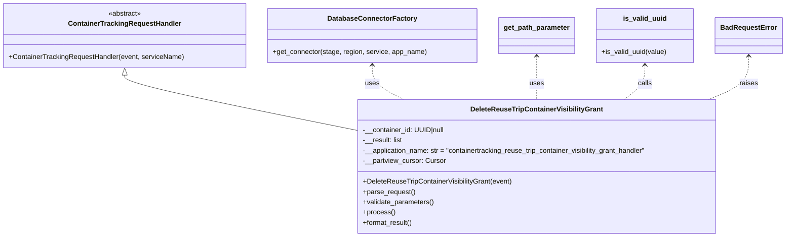
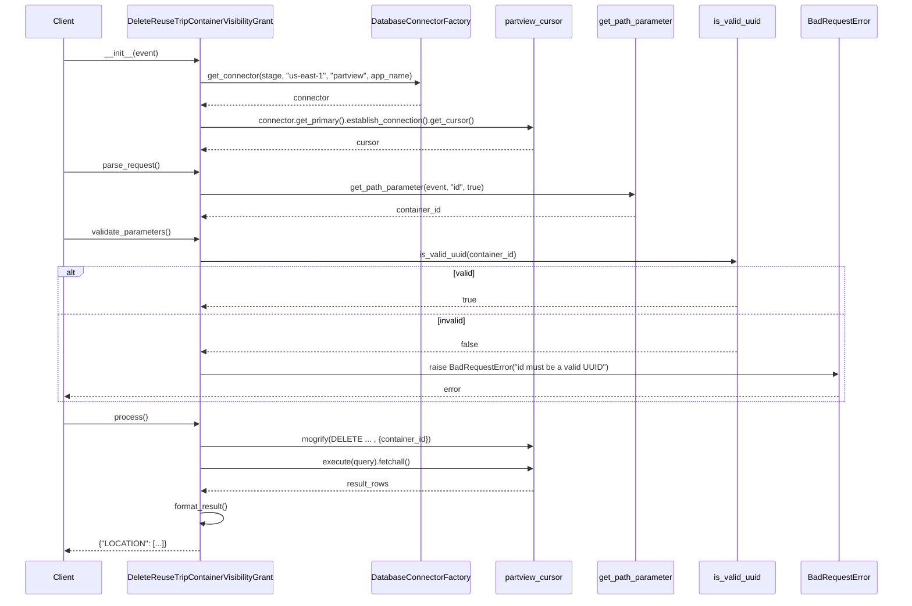

# Diagram: container_tracking_core/container_tracking_service/container_tracking_service/api/visibility_grants/handlers/delete_visibility_grant.py

> Auto-generated by Obscura crawlers

## Diagram 1

### SVG

<svg id="container" width="1798.984375" xmlns="http://www.w3.org/2000/svg" class="classDiagram" height="552" viewBox="0 0 1798.984375 552" role="graphics-document document" aria-roledescription="class"><g><defs><marker id="container_class-aggregationStart" class="marker aggregation class" refX="18" refY="7" markerWidth="190" markerHeight="240" orient="auto"><path d="M 18,7 L9,13 L1,7 L9,1 Z"></path></marker></defs><defs><marker id="container_class-aggregationEnd" class="marker aggregation class" refX="1" refY="7" markerWidth="20" markerHeight="28" orient="auto"><path d="M 18,7 L9,13 L1,7 L9,1 Z"></path></marker></defs><defs><marker id="container_class-extensionStart" class="marker extension class" refX="18" refY="7" markerWidth="190" markerHeight="240" orient="auto"><path d="M 1,7 L18,13 V 1 Z"></path></marker></defs><defs><marker id="container_class-extensionEnd" class="marker extension class" refX="1" refY="7" markerWidth="20" markerHeight="28" orient="auto"><path d="M 1,1 V 13 L18,7 Z"></path></marker></defs><defs><marker id="container_class-compositionStart" class="marker composition class" refX="18" refY="7" markerWidth="190" markerHeight="240" orient="auto"><path d="M 18,7 L9,13 L1,7 L9,1 Z"></path></marker></defs><defs><marker id="container_class-compositionEnd" class="marker composition class" refX="1" refY="7" markerWidth="20" markerHeight="28" orient="auto"><path d="M 18,7 L9,13 L1,7 L9,1 Z"></path></marker></defs><defs><marker id="container_class-dependencyStart" class="marker dependency class" refX="6" refY="7" markerWidth="190" markerHeight="240" orient="auto"><path d="M 5,7 L9,13 L1,7 L9,1 Z"></path></marker></defs><defs><marker id="container_class-dependencyEnd" class="marker dependency class" refX="13" refY="7" markerWidth="20" markerHeight="28" orient="auto"><path d="M 18,7 L9,13 L14,7 L9,1 Z"></path></marker></defs><defs><marker id="container_class-lollipopStart" class="marker lollipop class" refX="13" refY="7" markerWidth="190" markerHeight="240" orient="auto"><circle stroke="black" fill="transparent" cx="7" cy="7" r="6"></circle></marker></defs><defs><marker id="container_class-lollipopEnd" class="marker lollipop class" refX="1" refY="7" markerWidth="190" markerHeight="240" orient="auto"><circle stroke="black" fill="transparent" cx="7" cy="7" r="6"></circle></marker></defs><g class="root"><g class="clusters"></g><g class="edgePaths"><path d="M286.504,175.25L286.504,178.542C286.504,181.833,286.504,188.417,373.541,209.488C460.578,230.559,634.652,266.118,721.689,283.897L808.727,301.677" id="id_ContainerTrackingRequestHandler_DeleteReuseTripContainerVisibilityGrant_1" class="edge-thickness-normal edge-pattern-solid relation" style=";;;" data-edge="true" data-et="edge" data-id="id_ContainerTrackingRequestHandler_DeleteReuseTripContainerVisibilityGrant_1" data-points="W3sieCI6Mjg2LjUwMzkwNjI1LCJ5IjoxNTh9LHsieCI6Mjg2LjUwMzkwNjI1LCJ5IjoxOTV9LHsieCI6ODA4LjcyNjU2MjUsInkiOjMwMS42NzY2MDQ0NzA5NzgzfV0=" marker-start="url(#container_class-extensionStart)"></path><path d="M854.672,152L854.672,159.167C854.672,166.333,854.672,180.667,866.706,194C878.74,207.333,902.809,219.667,914.843,225.833L926.878,232" id="id_DatabaseConnectorFactory_DeleteReuseTripContainerVisibilityGrant_2" class="edge-thickness-normal edge-pattern-dashed relation" style=";;;" data-edge="true" data-et="edge" data-id="id_DatabaseConnectorFactory_DeleteReuseTripContainerVisibilityGrant_2" data-points="W3sieCI6ODU0LjY3MTg3NSwieSI6MTQ2fSx7IngiOjg1NC42NzE4NzUsInkiOjE5NX0seyJ4Ijo5MjYuODc3NTkwNjczNTc1MSwieSI6MjMyfV0=" marker-start="url(#container_class-dependencyStart)"></path><path d="M1231.313,131L1231.313,141.667C1231.313,152.333,1231.313,173.667,1231.313,190.5C1231.313,207.333,1231.313,219.667,1231.313,225.833L1231.313,232" id="id_get_path_parameter_DeleteReuseTripContainerVisibilityGrant_3" class="edge-thickness-normal edge-pattern-dashed relation" style=";;;" data-edge="true" data-et="edge" data-id="id_get_path_parameter_DeleteReuseTripContainerVisibilityGrant_3" data-points="W3sieCI6MTIzMS4zMTI1LCJ5IjoxMjV9LHsieCI6MTIzMS4zMTI1LCJ5IjoxOTV9LHsieCI6MTIzMS4zMTI1LCJ5IjoyMzJ9XQ==" marker-start="url(#container_class-dependencyStart)"></path><path d="M1480.355,152L1480.355,159.167C1480.355,166.333,1480.355,180.667,1472.398,194C1464.441,207.333,1448.526,219.667,1440.569,225.833L1432.611,232" id="id_is_valid_uuid_DeleteReuseTripContainerVisibilityGrant_4" class="edge-thickness-normal edge-pattern-dashed relation" style=";;;" data-edge="true" data-et="edge" data-id="id_is_valid_uuid_DeleteReuseTripContainerVisibilityGrant_4" data-points="W3sieCI6MTQ4MC4zNTU0Njg3NSwieSI6MTQ2fSx7IngiOjE0ODAuMzU1NDY4NzUsInkiOjE5NX0seyJ4IjoxNDMyLjYxMTQ3OTkyMjI3OTgsInkiOjIzMn1d" marker-start="url(#container_class-dependencyStart)"></path><path d="M1716.703,131L1716.703,141.667C1716.703,152.333,1716.703,173.667,1701.194,190.5C1685.685,207.333,1654.667,219.667,1639.158,225.833L1623.649,232" id="id_BadRequestError_DeleteReuseTripContainerVisibilityGrant_5" class="edge-thickness-normal edge-pattern-dashed relation" style=";;;" data-edge="true" data-et="edge" data-id="id_BadRequestError_DeleteReuseTripContainerVisibilityGrant_5" data-points="W3sieCI6MTcxNi43MDMxMjUsInkiOjEyNX0seyJ4IjoxNzE2LjcwMzEyNSwieSI6MTk1fSx7IngiOjE2MjMuNjQ4OTYzNzMwNTcsInkiOjIzMn1d" marker-start="url(#container_class-dependencyStart)"></path></g><g class="edgeLabels"><g class="edgeLabel"><g class="label" data-id="id_ContainerTrackingRequestHandler_DeleteReuseTripContainerVisibilityGrant_1" transform="translate(0, 0)"><foreignObject width="0" height="0">

</foreignObject></g></g><g class="edgeLabel" transform="translate(854.671875, 195)"><g class="label" data-id="id_DatabaseConnectorFactory_DeleteReuseTripContainerVisibilityGrant_2" transform="translate(-16.4921875, -12)"><foreignObject width="32.984375" height="24">

uses

</foreignObject></g></g><g class="edgeLabel" transform="translate(1231.3125, 195)"><g class="label" data-id="id_get_path_parameter_DeleteReuseTripContainerVisibilityGrant_3" transform="translate(-16.4921875, -12)"><foreignObject width="32.984375" height="24">

uses

</foreignObject></g></g><g class="edgeLabel" transform="translate(1480.35546875, 195)"><g class="label" data-id="id_is_valid_uuid_DeleteReuseTripContainerVisibilityGrant_4" transform="translate(-16.4453125, -12)"><foreignObject width="32.890625" height="24">

calls

</foreignObject></g></g><g class="edgeLabel" transform="translate(1716.703125, 195)"><g class="label" data-id="id_BadRequestError_DeleteReuseTripContainerVisibilityGrant_5" transform="translate(-21.25, -12)"><foreignObject width="42.5" height="24">

raises

</foreignObject></g></g></g><g class="nodes"><g class="node default" id="classId-ContainerTrackingRequestHandler-0" transform="translate(286.50390625, 83)"><g class="basic label-container"><path d="M-278.50390625 -75 L278.50390625 -75 L278.50390625 75 L-278.50390625 75" stroke="none" stroke-width="0" fill="#ECECFF" style=""></path><path d="M-278.50390625 -75 C-73.7943920022189 -75, 130.9151222455622 -75, 278.50390625 -75 M-278.50390625 -75 C-112.11371388525788 -75, 54.27647847948424 -75, 278.50390625 -75 M278.50390625 -75 C278.50390625 -17.29456024790756, 278.50390625 40.41087950418488, 278.50390625 75 M278.50390625 -75 C278.50390625 -30.24538309740231, 278.50390625 14.509233805195379, 278.50390625 75 M278.50390625 75 C68.19628680841313 75, -142.11133263317373 75, -278.50390625 75 M278.50390625 75 C154.13372408458372 75, 29.763541919167437 75, -278.50390625 75 M-278.50390625 75 C-278.50390625 15.115788726829301, -278.50390625 -44.7684225463414, -278.50390625 -75 M-278.50390625 75 C-278.50390625 31.270811092334597, -278.50390625 -12.458377815330806, -278.50390625 -75" stroke="#9370DB" stroke-width="1.3" fill="none" stroke-dasharray="0 0" style=""></path></g><g class="annotation-group text" transform="translate(-38.609375, -51)"><g class="label" style="" transform="translate(0,-12)"><foreignObject width="77.21875" height="24">

«abstract»

</foreignObject></g></g><g class="label-group text" transform="translate(-125.5859375, -27)"><g class="label" style="font-weight: bolder" transform="translate(0,-12)"><foreignObject width="251.171875" height="24">

ContainerTrackingRequestHandler

</foreignObject></g></g><g class="members-group text" transform="translate(-266.50390625, 21)"></g><g class="methods-group text" transform="translate(-266.50390625, 51)"><g class="label" style="" transform="translate(0,-12)"><foreignObject width="407.421875" height="24">

+ContainerTrackingRequestHandler(event, serviceName)

</foreignObject></g></g><g class="divider" style=""><path d="M-278.50390625 -3 C-82.78562878896469 -3, 112.93264867207063 -3, 278.50390625 -3 M-278.50390625 -3 C-110.44407222752872 -3, 57.61576179494256 -3, 278.50390625 -3" stroke="#9370DB" stroke-width="1.3" fill="none" stroke-dasharray="0 0" style=""></path></g><g class="divider" style=""><path d="M-278.50390625 21 C-157.26368451392705 21, -36.02346277785412 21, 278.50390625 21 M-278.50390625 21 C-164.5324114575145 21, -50.560916665029 21, 278.50390625 21" stroke="#9370DB" stroke-width="1.3" fill="none" stroke-dasharray="0 0" style=""></path></g></g><g class="node default" id="classId-DeleteReuseTripContainerVisibilityGrant-1" transform="translate(1231.3125, 388)"><g class="basic label-container"><path d="M-422.5859375 -156 L422.5859375 -156 L422.5859375 156 L-422.5859375 156" stroke="none" stroke-width="0" fill="#ECECFF" style=""></path><path d="M-422.5859375 -156 C-188.71790968080973 -156, 45.15011813838055 -156, 422.5859375 -156 M-422.5859375 -156 C-90.42697456014594 -156, 241.73198837970813 -156, 422.5859375 -156 M422.5859375 -156 C422.5859375 -59.2729016233763, 422.5859375 37.4541967532474, 422.5859375 156 M422.5859375 -156 C422.5859375 -84.27677771768477, 422.5859375 -12.553555435369532, 422.5859375 156 M422.5859375 156 C193.60481923929694 156, -35.37629902140611 156, -422.5859375 156 M422.5859375 156 C183.34279984545825 156, -55.90033780908351 156, -422.5859375 156 M-422.5859375 156 C-422.5859375 40.53235501740615, -422.5859375 -74.9352899651877, -422.5859375 -156 M-422.5859375 156 C-422.5859375 40.67336989061904, -422.5859375 -74.65326021876191, -422.5859375 -156" stroke="#9370DB" stroke-width="1.3" fill="none" stroke-dasharray="0 0" style=""></path></g><g class="annotation-group text" transform="translate(0, -132)"></g><g class="label-group text" transform="translate(-147.71875, -132)"><g class="label" style="font-weight: bolder" transform="translate(0,-12)"><foreignObject width="295.4375" height="24">

DeleteReuseTripContainerVisibilityGrant

</foreignObject></g></g><g class="members-group text" transform="translate(-410.5859375, -84)"><g class="label" style="" transform="translate(0,-12)"><foreignObject width="190.453125" height="24">

-__container_id: UUID|null

</foreignObject></g><g class="label" style="" transform="translate(0,12)"><foreignObject width="93.90625" height="24">

-__result: list

</foreignObject></g><g class="label" style="" transform="translate(0,36)"><foreignObject width="673.453125" height="24">

-__application_name: str = "containertracking_reuse_trip_container_visibility_grant_handler"

</foreignObject></g><g class="label" style="" transform="translate(0,60)"><foreignObject width="192.734375" height="24">

-__partview_cursor: Cursor

</foreignObject></g></g><g class="methods-group text" transform="translate(-410.5859375, 36)"><g class="label" style="" transform="translate(0,-12)"><foreignObject width="349.203125" height="24">

+DeleteReuseTripContainerVisibilityGrant(event)

</foreignObject></g><g class="label" style="" transform="translate(0,12)"><foreignObject width="121.796875" height="24">

+parse_request()

</foreignObject></g><g class="label" style="" transform="translate(0,36)"><foreignObject width="166.546875" height="24">

+validate_parameters()

</foreignObject></g><g class="label" style="" transform="translate(0,60)"><foreignObject width="73.734375" height="24">

+process()

</foreignObject></g><g class="label" style="" transform="translate(0,84)"><foreignObject width="117.015625" height="24">

+format_result()

</foreignObject></g></g><g class="divider" style=""><path d="M-422.5859375 -108 C-138.7170395961586 -108, 145.1518583076828 -108, 422.5859375 -108 M-422.5859375 -108 C-183.94865759956127 -108, 54.688622300877455 -108, 422.5859375 -108" stroke="#9370DB" stroke-width="1.3" fill="none" stroke-dasharray="0 0" style=""></path></g><g class="divider" style=""><path d="M-422.5859375 12 C-222.80173707807543 12, -23.017536656150867 12, 422.5859375 12 M-422.5859375 12 C-123.0166731082947 12, 176.5525912834106 12, 422.5859375 12" stroke="#9370DB" stroke-width="1.3" fill="none" stroke-dasharray="0 0" style=""></path></g></g><g class="node default" id="classId-DatabaseConnectorFactory-2" transform="translate(854.671875, 83)"><g class="basic label-container"><path d="M-239.6640625 -63 L239.6640625 -63 L239.6640625 63 L-239.6640625 63" stroke="none" stroke-width="0" fill="#ECECFF" style=""></path><path d="M-239.6640625 -63 C-55.81861178762301 -63, 128.02683892475397 -63, 239.6640625 -63 M-239.6640625 -63 C-77.29585420241088 -63, 85.07235409517824 -63, 239.6640625 -63 M239.6640625 -63 C239.6640625 -19.055573780737, 239.6640625 24.888852438526, 239.6640625 63 M239.6640625 -63 C239.6640625 -30.309368857369577, 239.6640625 2.3812622852608456, 239.6640625 63 M239.6640625 63 C75.5624083244222 63, -88.53924585115561 63, -239.6640625 63 M239.6640625 63 C58.89231642488107 63, -121.87942965023785 63, -239.6640625 63 M-239.6640625 63 C-239.6640625 17.394289796401146, -239.6640625 -28.211420407197707, -239.6640625 -63 M-239.6640625 63 C-239.6640625 24.54128415908324, -239.6640625 -13.91743168183352, -239.6640625 -63" stroke="#9370DB" stroke-width="1.3" fill="none" stroke-dasharray="0 0" style=""></path></g><g class="annotation-group text" transform="translate(0, -39)"></g><g class="label-group text" transform="translate(-98.1875, -39)"><g class="label" style="font-weight: bolder" transform="translate(0,-12)"><foreignObject width="196.375" height="24">

DatabaseConnectorFactory

</foreignObject></g></g><g class="members-group text" transform="translate(-227.6640625, 9)"></g><g class="methods-group text" transform="translate(-227.6640625, 39)"><g class="label" style="" transform="translate(0,-12)"><foreignObject width="357.140625" height="24">

+get_connector(stage, region, service, app_name)

</foreignObject></g></g><g class="divider" style=""><path d="M-239.6640625 -15 C-66.24335557667143 -15, 107.17735134665713 -15, 239.6640625 -15 M-239.6640625 -15 C-106.2521077799465 -15, 27.159846940107002 -15, 239.6640625 -15" stroke="#9370DB" stroke-width="1.3" fill="none" stroke-dasharray="0 0" style=""></path></g><g class="divider" style=""><path d="M-239.6640625 9 C-49.28072866698773 9, 141.10260516602455 9, 239.6640625 9 M-239.6640625 9 C-75.90059929742273 9, 87.86286390515454 9, 239.6640625 9" stroke="#9370DB" stroke-width="1.3" fill="none" stroke-dasharray="0 0" style=""></path></g></g><g class="node default" id="classId-BadRequestError-3" transform="translate(1716.703125, 83)"><g class="basic label-container"><path d="M-74.28125 -42 L74.28125 -42 L74.28125 42 L-74.28125 42" stroke="none" stroke-width="0" fill="#ECECFF" style=""></path><path d="M-74.28125 -42 C-18.69264730739387 -42, 36.89595538521226 -42, 74.28125 -42 M-74.28125 -42 C-31.434670616717852 -42, 11.411908766564295 -42, 74.28125 -42 M74.28125 -42 C74.28125 -23.935319360645448, 74.28125 -5.870638721290895, 74.28125 42 M74.28125 -42 C74.28125 -12.66421405169001, 74.28125 16.67157189661998, 74.28125 42 M74.28125 42 C41.94205249954778 42, 9.602854999095555 42, -74.28125 42 M74.28125 42 C32.66125148631062 42, -8.958747027378763 42, -74.28125 42 M-74.28125 42 C-74.28125 11.996770463811483, -74.28125 -18.006459072377034, -74.28125 -42 M-74.28125 42 C-74.28125 16.414351394256823, -74.28125 -9.171297211486355, -74.28125 -42" stroke="#9370DB" stroke-width="1.3" fill="none" stroke-dasharray="0 0" style=""></path></g><g class="annotation-group text" transform="translate(0, -18)"></g><g class="label-group text" transform="translate(-62.28125, -18)"><g class="label" style="font-weight: bolder" transform="translate(0,-12)"><foreignObject width="124.5625" height="24">

BadRequestError

</foreignObject></g></g><g class="members-group text" transform="translate(-62.28125, 30)"></g><g class="methods-group text" transform="translate(-62.28125, 60)"></g><g class="divider" style=""><path d="M-74.28125 6 C-38.81749850459074 6, -3.3537470091814754 6, 74.28125 6 M-74.28125 6 C-43.12504602740883 6, -11.968842054817664 6, 74.28125 6" stroke="#9370DB" stroke-width="1.3" fill="none" stroke-dasharray="0 0" style=""></path></g><g class="divider" style=""><path d="M-74.28125 24 C-43.35174975151063 24, -12.422249503021263 24, 74.28125 24 M-74.28125 24 C-15.268116076379208 24, 43.745017847241584 24, 74.28125 24" stroke="#9370DB" stroke-width="1.3" fill="none" stroke-dasharray="0 0" style=""></path></g></g><g class="node default" id="classId-get_path_parameter-4" transform="translate(1231.3125, 83)"><g class="basic label-container"><path d="M-86.9765625 -42 L86.9765625 -42 L86.9765625 42 L-86.9765625 42" stroke="none" stroke-width="0" fill="#ECECFF" style=""></path><path d="M-86.9765625 -42 C-25.98895892662997 -42, 34.99864464674006 -42, 86.9765625 -42 M-86.9765625 -42 C-51.85854366941319 -42, -16.740524838826374 -42, 86.9765625 -42 M86.9765625 -42 C86.9765625 -22.498922865791172, 86.9765625 -2.997845731582345, 86.9765625 42 M86.9765625 -42 C86.9765625 -18.98696931105642, 86.9765625 4.02606137788716, 86.9765625 42 M86.9765625 42 C35.09169086029709 42, -16.793180779405816 42, -86.9765625 42 M86.9765625 42 C22.061928646848415 42, -42.85270520630317 42, -86.9765625 42 M-86.9765625 42 C-86.9765625 13.22985368948278, -86.9765625 -15.540292621034439, -86.9765625 -42 M-86.9765625 42 C-86.9765625 9.481048562309212, -86.9765625 -23.037902875381576, -86.9765625 -42" stroke="#9370DB" stroke-width="1.3" fill="none" stroke-dasharray="0 0" style=""></path></g><g class="annotation-group text" transform="translate(0, -18)"></g><g class="label-group text" transform="translate(-74.9765625, -18)"><g class="label" style="font-weight: bolder" transform="translate(0,-12)"><foreignObject width="149.953125" height="24">

get_path_parameter

</foreignObject></g></g><g class="members-group text" transform="translate(-74.9765625, 30)"></g><g class="methods-group text" transform="translate(-74.9765625, 60)"></g><g class="divider" style=""><path d="M-86.9765625 6 C-32.898625213608454 6, 21.17931207278309 6, 86.9765625 6 M-86.9765625 6 C-25.399714455387993 6, 36.17713358922401 6, 86.9765625 6" stroke="#9370DB" stroke-width="1.3" fill="none" stroke-dasharray="0 0" style=""></path></g><g class="divider" style=""><path d="M-86.9765625 24 C-41.1089510421699 24, 4.758660415660202 24, 86.9765625 24 M-86.9765625 24 C-31.57057312569009 24, 23.835416248619822 24, 86.9765625 24" stroke="#9370DB" stroke-width="1.3" fill="none" stroke-dasharray="0 0" style=""></path></g></g><g class="node default" id="classId-is_valid_uuid-5" transform="translate(1480.35546875, 83)"><g class="basic label-container"><path d="M-112.06640625 -63 L112.06640625 -63 L112.06640625 63 L-112.06640625 63" stroke="none" stroke-width="0" fill="#ECECFF" style=""></path><path d="M-112.06640625 -63 C-60.46807162317609 -63, -8.869736996352174 -63, 112.06640625 -63 M-112.06640625 -63 C-53.242597383308535 -63, 5.58121148338293 -63, 112.06640625 -63 M112.06640625 -63 C112.06640625 -28.768813003354055, 112.06640625 5.462373993291891, 112.06640625 63 M112.06640625 -63 C112.06640625 -21.1881331650917, 112.06640625 20.623733669816602, 112.06640625 63 M112.06640625 63 C40.28504808899095 63, -31.496310072018105 63, -112.06640625 63 M112.06640625 63 C28.719183318862306 63, -54.62803961227539 63, -112.06640625 63 M-112.06640625 63 C-112.06640625 23.30561159737062, -112.06640625 -16.388776805258757, -112.06640625 -63 M-112.06640625 63 C-112.06640625 22.385010547189246, -112.06640625 -18.229978905621508, -112.06640625 -63" stroke="#9370DB" stroke-width="1.3" fill="none" stroke-dasharray="0 0" style=""></path></g><g class="annotation-group text" transform="translate(0, -39)"></g><g class="label-group text" transform="translate(-47.7578125, -39)"><g class="label" style="font-weight: bolder" transform="translate(0,-12)"><foreignObject width="95.515625" height="24">

is_valid_uuid

</foreignObject></g></g><g class="members-group text" transform="translate(-100.06640625, 9)"></g><g class="methods-group text" transform="translate(-100.06640625, 39)"><g class="label" style="" transform="translate(0,-12)"><foreignObject width="152.375" height="24">

+is_valid_uuid(value)

</foreignObject></g></g><g class="divider" style=""><path d="M-112.06640625 -15 C-64.78576502053696 -15, -17.505123791073927 -15, 112.06640625 -15 M-112.06640625 -15 C-46.06774094843341 -15, 19.93092435313318 -15, 112.06640625 -15" stroke="#9370DB" stroke-width="1.3" fill="none" stroke-dasharray="0 0" style=""></path></g><g class="divider" style=""><path d="M-112.06640625 9 C-26.08065575501155 9, 59.9050947399769 9, 112.06640625 9 M-112.06640625 9 C-50.33564596842214 9, 11.395114313155716 9, 112.06640625 9" stroke="#9370DB" stroke-width="1.3" fill="none" stroke-dasharray="0 0" style=""></path></g></g></g></g></g></svg>

## Diagram 2

### SVG

<svg id="container" width="1852.5" xmlns="http://www.w3.org/2000/svg" height="1261" viewBox="-50 -10 1852.5 1261" role="graphics-document document" aria-roledescription="sequence"><g><rect x="1602.5" y="1175" fill="#eaeaea" stroke="#666" width="150" height="65" name="Error" rx="3" ry="3" class="actor actor-bottom"></rect><text x="1677.5" y="1207.5" dominant-baseline="central" alignment-baseline="central" class="actor actor-box" style="text-anchor: middle; font-size: 16px; font-weight: 400;"><tspan x="1677.5" dy="0">BadRequestError</tspan></text></g><g><rect x="1402.5" y="1175" fill="#eaeaea" stroke="#666" width="150" height="65" name="Validator" rx="3" ry="3" class="actor actor-bottom"></rect><text x="1477.5" y="1207.5" dominant-baseline="central" alignment-baseline="central" class="actor actor-box" style="text-anchor: middle; font-size: 16px; font-weight: 400;"><tspan x="1477.5" dy="0">is_valid_uuid</tspan></text></g><g><rect x="1184.5" y="1175" fill="#eaeaea" stroke="#666" width="168" height="65" name="Util" rx="3" ry="3" class="actor actor-bottom"></rect><text x="1268.5" y="1207.5" dominant-baseline="central" alignment-baseline="central" class="actor actor-box" style="text-anchor: middle; font-size: 16px; font-weight: 400;"><tspan x="1268.5" dy="0">get_path_parameter</tspan></text></g><g><rect x="984.5" y="1175" fill="#eaeaea" stroke="#666" width="150" height="65" name="DB" rx="3" ry="3" class="actor actor-bottom"></rect><text x="1059.5" y="1207.5" dominant-baseline="central" alignment-baseline="central" class="actor actor-box" style="text-anchor: middle; font-size: 16px; font-weight: 400;"><tspan x="1059.5" dy="0">partview_cursor</tspan></text></g><g><rect x="720.5" y="1175" fill="#eaeaea" stroke="#666" width="214" height="65" name="Factory" rx="3" ry="3" class="actor actor-bottom"></rect><text x="827.5" y="1207.5" dominant-baseline="central" alignment-baseline="central" class="actor actor-box" style="text-anchor: middle; font-size: 16px; font-weight: 400;"><tspan x="827.5" dy="0">DatabaseConnectorFactory</tspan></text></g><g><rect x="200" y="1175" fill="#eaeaea" stroke="#666" width="311" height="65" name="Handler" rx="3" ry="3" class="actor actor-bottom"></rect><text x="355.5" y="1207.5" dominant-baseline="central" alignment-baseline="central" class="actor actor-box" style="text-anchor: middle; font-size: 16px; font-weight: 400;"><tspan x="355.5" dy="0">DeleteReuseTripContainerVisibilityGrant</tspan></text></g><g><rect x="0" y="1175" fill="#eaeaea" stroke="#666" width="150" height="65" name="Client" rx="3" ry="3" class="actor actor-bottom"></rect><text x="75" y="1207.5" dominant-baseline="central" alignment-baseline="central" class="actor actor-box" style="text-anchor: middle; font-size: 16px; font-weight: 400;"><tspan x="75" dy="0">Client</tspan></text></g><g><line id="actor6" x1="1677.5" y1="65" x2="1677.5" y2="1175" class="actor-line 200" stroke-width="0.5px" stroke="#999" name="Error"></line><g id="root-6"><rect x="1602.5" y="0" fill="#eaeaea" stroke="#666" width="150" height="65" name="Error" rx="3" ry="3" class="actor actor-top"></rect><text x="1677.5" y="32.5" dominant-baseline="central" alignment-baseline="central" class="actor actor-box" style="text-anchor: middle; font-size: 16px; font-weight: 400;"><tspan x="1677.5" dy="0">BadRequestError</tspan></text></g></g><g><line id="actor5" x1="1477.5" y1="65" x2="1477.5" y2="1175" class="actor-line 200" stroke-width="0.5px" stroke="#999" name="Validator"></line><g id="root-5"><rect x="1402.5" y="0" fill="#eaeaea" stroke="#666" width="150" height="65" name="Validator" rx="3" ry="3" class="actor actor-top"></rect><text x="1477.5" y="32.5" dominant-baseline="central" alignment-baseline="central" class="actor actor-box" style="text-anchor: middle; font-size: 16px; font-weight: 400;"><tspan x="1477.5" dy="0">is_valid_uuid</tspan></text></g></g><g><line id="actor4" x1="1268.5" y1="65" x2="1268.5" y2="1175" class="actor-line 200" stroke-width="0.5px" stroke="#999" name="Util"></line><g id="root-4"><rect x="1184.5" y="0" fill="#eaeaea" stroke="#666" width="168" height="65" name="Util" rx="3" ry="3" class="actor actor-top"></rect><text x="1268.5" y="32.5" dominant-baseline="central" alignment-baseline="central" class="actor actor-box" style="text-anchor: middle; font-size: 16px; font-weight: 400;"><tspan x="1268.5" dy="0">get_path_parameter</tspan></text></g></g><g><line id="actor3" x1="1059.5" y1="65" x2="1059.5" y2="1175" class="actor-line 200" stroke-width="0.5px" stroke="#999" name="DB"></line><g id="root-3"><rect x="984.5" y="0" fill="#eaeaea" stroke="#666" width="150" height="65" name="DB" rx="3" ry="3" class="actor actor-top"></rect><text x="1059.5" y="32.5" dominant-baseline="central" alignment-baseline="central" class="actor actor-box" style="text-anchor: middle; font-size: 16px; font-weight: 400;"><tspan x="1059.5" dy="0">partview_cursor</tspan></text></g></g><g><line id="actor2" x1="827.5" y1="65" x2="827.5" y2="1175" class="actor-line 200" stroke-width="0.5px" stroke="#999" name="Factory"></line><g id="root-2"><rect x="720.5" y="0" fill="#eaeaea" stroke="#666" width="214" height="65" name="Factory" rx="3" ry="3" class="actor actor-top"></rect><text x="827.5" y="32.5" dominant-baseline="central" alignment-baseline="central" class="actor actor-box" style="text-anchor: middle; font-size: 16px; font-weight: 400;"><tspan x="827.5" dy="0">DatabaseConnectorFactory</tspan></text></g></g><g><line id="actor1" x1="355.5" y1="65" x2="355.5" y2="1175" class="actor-line 200" stroke-width="0.5px" stroke="#999" name="Handler"></line><g id="root-1"><rect x="200" y="0" fill="#eaeaea" stroke="#666" width="311" height="65" name="Handler" rx="3" ry="3" class="actor actor-top"></rect><text x="355.5" y="32.5" dominant-baseline="central" alignment-baseline="central" class="actor actor-box" style="text-anchor: middle; font-size: 16px; font-weight: 400;"><tspan x="355.5" dy="0">DeleteReuseTripContainerVisibilityGrant</tspan></text></g></g><g><line id="actor0" x1="75" y1="65" x2="75" y2="1175" class="actor-line 200" stroke-width="0.5px" stroke="#999" name="Client"></line><g id="root-0"><rect x="0" y="0" fill="#eaeaea" stroke="#666" width="150" height="65" name="Client" rx="3" ry="3" class="actor actor-top"></rect><text x="75" y="32.5" dominant-baseline="central" alignment-baseline="central" class="actor actor-box" style="text-anchor: middle; font-size: 16px; font-weight: 400;"><tspan x="75" dy="0">Client</tspan></text></g></g><g></g><defs><symbol id="computer" width="24" height="24"><path transform="scale(.5)" d="M2 2v13h20v-13h-20zm18 11h-16v-9h16v9zm-10.228 6l.466-1h3.524l.467 1h-4.457zm14.228 3h-24l2-6h2.104l-1.33 4h18.45l-1.297-4h2.073l2 6zm-5-10h-14v-7h14v7z"></path></symbol></defs><defs><symbol id="database" fill-rule="evenodd" clip-rule="evenodd"><path transform="scale(.5)" d="M12.258.001l.256.004.255.005.253.008.251.01.249.012.247.015.246.016.242.019.241.02.239.023.236.024.233.027.231.028.229.031.225.032.223.034.22.036.217.038.214.04.211.041.208.043.205.045.201.046.198.048.194.05.191.051.187.053.183.054.18.056.175.057.172.059.168.06.163.061.16.063.155.064.15.066.074.033.073.033.071.034.07.034.069.035.068.035.067.035.066.035.064.036.064.036.062.036.06.036.06.037.058.037.058.037.055.038.055.038.053.038.052.038.051.039.05.039.048.039.047.039.045.04.044.04.043.04.041.04.04.041.039.041.037.041.036.041.034.041.033.042.032.042.03.042.029.042.027.042.026.043.024.043.023.043.021.043.02.043.018.044.017.043.015.044.013.044.012.044.011.045.009.044.007.045.006.045.004.045.002.045.001.045v17l-.001.045-.002.045-.004.045-.006.045-.007.045-.009.044-.011.045-.012.044-.013.044-.015.044-.017.043-.018.044-.02.043-.021.043-.023.043-.024.043-.026.043-.027.042-.029.042-.03.042-.032.042-.033.042-.034.041-.036.041-.037.041-.039.041-.04.041-.041.04-.043.04-.044.04-.045.04-.047.039-.048.039-.05.039-.051.039-.052.038-.053.038-.055.038-.055.038-.058.037-.058.037-.06.037-.06.036-.062.036-.064.036-.064.036-.066.035-.067.035-.068.035-.069.035-.07.034-.071.034-.073.033-.074.033-.15.066-.155.064-.16.063-.163.061-.168.06-.172.059-.175.057-.18.056-.183.054-.187.053-.191.051-.194.05-.198.048-.201.046-.205.045-.208.043-.211.041-.214.04-.217.038-.22.036-.223.034-.225.032-.229.031-.231.028-.233.027-.236.024-.239.023-.241.02-.242.019-.246.016-.247.015-.249.012-.251.01-.253.008-.255.005-.256.004-.258.001-.258-.001-.256-.004-.255-.005-.253-.008-.251-.01-.249-.012-.247-.015-.245-.016-.243-.019-.241-.02-.238-.023-.236-.024-.234-.027-.231-.028-.228-.031-.226-.032-.223-.034-.22-.036-.217-.038-.214-.04-.211-.041-.208-.043-.204-.045-.201-.046-.198-.048-.195-.05-.19-.051-.187-.053-.184-.054-.179-.056-.176-.057-.172-.059-.167-.06-.164-.061-.159-.063-.155-.064-.151-.066-.074-.033-.072-.033-.072-.034-.07-.034-.069-.035-.068-.035-.067-.035-.066-.035-.064-.036-.063-.036-.062-.036-.061-.036-.06-.037-.058-.037-.057-.037-.056-.038-.055-.038-.053-.038-.052-.038-.051-.039-.049-.039-.049-.039-.046-.039-.046-.04-.044-.04-.043-.04-.041-.04-.04-.041-.039-.041-.037-.041-.036-.041-.034-.041-.033-.042-.032-.042-.03-.042-.029-.042-.027-.042-.026-.043-.024-.043-.023-.043-.021-.043-.02-.043-.018-.044-.017-.043-.015-.044-.013-.044-.012-.044-.011-.045-.009-.044-.007-.045-.006-.045-.004-.045-.002-.045-.001-.045v-17l.001-.045.002-.045.004-.045.006-.045.007-.045.009-.044.011-.045.012-.044.013-.044.015-.044.017-.043.018-.044.02-.043.021-.043.023-.043.024-.043.026-.043.027-.042.029-.042.03-.042.032-.042.033-.042.034-.041.036-.041.037-.041.039-.041.04-.041.041-.04.043-.04.044-.04.046-.04.046-.039.049-.039.049-.039.051-.039.052-.038.053-.038.055-.038.056-.038.057-.037.058-.037.06-.037.061-.036.062-.036.063-.036.064-.036.066-.035.067-.035.068-.035.069-.035.07-.034.072-.034.072-.033.074-.033.151-.066.155-.064.159-.063.164-.061.167-.06.172-.059.176-.057.179-.056.184-.054.187-.053.19-.051.195-.05.198-.048.201-.046.204-.045.208-.043.211-.041.214-.04.217-.038.22-.036.223-.034.226-.032.228-.031.231-.028.234-.027.236-.024.238-.023.241-.02.243-.019.245-.016.247-.015.249-.012.251-.01.253-.008.255-.005.256-.004.258-.001.258.001zm-9.258 20.499v.01l.001.021.003.021.004.022.005.021.006.022.007.022.009.023.01.022.011.023.012.023.013.023.015.023.016.024.017.023.018.024.019.024.021.024.022.025.023.024.024.025.052.049.056.05.061.051.066.051.07.051.075.051.079.052.084.052.088.052.092.052.097.052.102.051.105.052.11.052.114.051.119.051.123.051.127.05.131.05.135.05.139.048.144.049.147.047.152.047.155.047.16.045.163.045.167.043.171.043.176.041.178.041.183.039.187.039.19.037.194.035.197.035.202.033.204.031.209.03.212.029.216.027.219.025.222.024.226.021.23.02.233.018.236.016.24.015.243.012.246.01.249.008.253.005.256.004.259.001.26-.001.257-.004.254-.005.25-.008.247-.011.244-.012.241-.014.237-.016.233-.018.231-.021.226-.021.224-.024.22-.026.216-.027.212-.028.21-.031.205-.031.202-.034.198-.034.194-.036.191-.037.187-.039.183-.04.179-.04.175-.042.172-.043.168-.044.163-.045.16-.046.155-.046.152-.047.148-.048.143-.049.139-.049.136-.05.131-.05.126-.05.123-.051.118-.052.114-.051.11-.052.106-.052.101-.052.096-.052.092-.052.088-.053.083-.051.079-.052.074-.052.07-.051.065-.051.06-.051.056-.05.051-.05.023-.024.023-.025.021-.024.02-.024.019-.024.018-.024.017-.024.015-.023.014-.024.013-.023.012-.023.01-.023.01-.022.008-.022.006-.022.006-.022.004-.022.004-.021.001-.021.001-.021v-4.127l-.077.055-.08.053-.083.054-.085.053-.087.052-.09.052-.093.051-.095.05-.097.05-.1.049-.102.049-.105.048-.106.047-.109.047-.111.046-.114.045-.115.045-.118.044-.12.043-.122.042-.124.042-.126.041-.128.04-.13.04-.132.038-.134.038-.135.037-.138.037-.139.035-.142.035-.143.034-.144.033-.147.032-.148.031-.15.03-.151.03-.153.029-.154.027-.156.027-.158.026-.159.025-.161.024-.162.023-.163.022-.165.021-.166.02-.167.019-.169.018-.169.017-.171.016-.173.015-.173.014-.175.013-.175.012-.177.011-.178.01-.179.008-.179.008-.181.006-.182.005-.182.004-.184.003-.184.002h-.37l-.184-.002-.184-.003-.182-.004-.182-.005-.181-.006-.179-.008-.179-.008-.178-.01-.176-.011-.176-.012-.175-.013-.173-.014-.172-.015-.171-.016-.17-.017-.169-.018-.167-.019-.166-.02-.165-.021-.163-.022-.162-.023-.161-.024-.159-.025-.157-.026-.156-.027-.155-.027-.153-.029-.151-.03-.15-.03-.148-.031-.146-.032-.145-.033-.143-.034-.141-.035-.14-.035-.137-.037-.136-.037-.134-.038-.132-.038-.13-.04-.128-.04-.126-.041-.124-.042-.122-.042-.12-.044-.117-.043-.116-.045-.113-.045-.112-.046-.109-.047-.106-.047-.105-.048-.102-.049-.1-.049-.097-.05-.095-.05-.093-.052-.09-.051-.087-.052-.085-.053-.083-.054-.08-.054-.077-.054v4.127zm0-5.654v.011l.001.021.003.021.004.021.005.022.006.022.007.022.009.022.01.022.011.023.012.023.013.023.015.024.016.023.017.024.018.024.019.024.021.024.022.024.023.025.024.024.052.05.056.05.061.05.066.051.07.051.075.052.079.051.084.052.088.052.092.052.097.052.102.052.105.052.11.051.114.051.119.052.123.05.127.051.131.05.135.049.139.049.144.048.147.048.152.047.155.046.16.045.163.045.167.044.171.042.176.042.178.04.183.04.187.038.19.037.194.036.197.034.202.033.204.032.209.03.212.028.216.027.219.025.222.024.226.022.23.02.233.018.236.016.24.014.243.012.246.01.249.008.253.006.256.003.259.001.26-.001.257-.003.254-.006.25-.008.247-.01.244-.012.241-.015.237-.016.233-.018.231-.02.226-.022.224-.024.22-.025.216-.027.212-.029.21-.03.205-.032.202-.033.198-.035.194-.036.191-.037.187-.039.183-.039.179-.041.175-.042.172-.043.168-.044.163-.045.16-.045.155-.047.152-.047.148-.048.143-.048.139-.05.136-.049.131-.05.126-.051.123-.051.118-.051.114-.052.11-.052.106-.052.101-.052.096-.052.092-.052.088-.052.083-.052.079-.052.074-.051.07-.052.065-.051.06-.05.056-.051.051-.049.023-.025.023-.024.021-.025.02-.024.019-.024.018-.024.017-.024.015-.023.014-.023.013-.024.012-.022.01-.023.01-.023.008-.022.006-.022.006-.022.004-.021.004-.022.001-.021.001-.021v-4.139l-.077.054-.08.054-.083.054-.085.052-.087.053-.09.051-.093.051-.095.051-.097.05-.1.049-.102.049-.105.048-.106.047-.109.047-.111.046-.114.045-.115.044-.118.044-.12.044-.122.042-.124.042-.126.041-.128.04-.13.039-.132.039-.134.038-.135.037-.138.036-.139.036-.142.035-.143.033-.144.033-.147.033-.148.031-.15.03-.151.03-.153.028-.154.028-.156.027-.158.026-.159.025-.161.024-.162.023-.163.022-.165.021-.166.02-.167.019-.169.018-.169.017-.171.016-.173.015-.173.014-.175.013-.175.012-.177.011-.178.009-.179.009-.179.007-.181.007-.182.005-.182.004-.184.003-.184.002h-.37l-.184-.002-.184-.003-.182-.004-.182-.005-.181-.007-.179-.007-.179-.009-.178-.009-.176-.011-.176-.012-.175-.013-.173-.014-.172-.015-.171-.016-.17-.017-.169-.018-.167-.019-.166-.02-.165-.021-.163-.022-.162-.023-.161-.024-.159-.025-.157-.026-.156-.027-.155-.028-.153-.028-.151-.03-.15-.03-.148-.031-.146-.033-.145-.033-.143-.033-.141-.035-.14-.036-.137-.036-.136-.037-.134-.038-.132-.039-.13-.039-.128-.04-.126-.041-.124-.042-.122-.043-.12-.043-.117-.044-.116-.044-.113-.046-.112-.046-.109-.046-.106-.047-.105-.048-.102-.049-.1-.049-.097-.05-.095-.051-.093-.051-.09-.051-.087-.053-.085-.052-.083-.054-.08-.054-.077-.054v4.139zm0-5.666v.011l.001.02.003.022.004.021.005.022.006.021.007.022.009.023.01.022.011.023.012.023.013.023.015.023.016.024.017.024.018.023.019.024.021.025.022.024.023.024.024.025.052.05.056.05.061.05.066.051.07.051.075.052.079.051.084.052.088.052.092.052.097.052.102.052.105.051.11.052.114.051.119.051.123.051.127.05.131.05.135.05.139.049.144.048.147.048.152.047.155.046.16.045.163.045.167.043.171.043.176.042.178.04.183.04.187.038.19.037.194.036.197.034.202.033.204.032.209.03.212.028.216.027.219.025.222.024.226.021.23.02.233.018.236.017.24.014.243.012.246.01.249.008.253.006.256.003.259.001.26-.001.257-.003.254-.006.25-.008.247-.01.244-.013.241-.014.237-.016.233-.018.231-.02.226-.022.224-.024.22-.025.216-.027.212-.029.21-.03.205-.032.202-.033.198-.035.194-.036.191-.037.187-.039.183-.039.179-.041.175-.042.172-.043.168-.044.163-.045.16-.045.155-.047.152-.047.148-.048.143-.049.139-.049.136-.049.131-.051.126-.05.123-.051.118-.052.114-.051.11-.052.106-.052.101-.052.096-.052.092-.052.088-.052.083-.052.079-.052.074-.052.07-.051.065-.051.06-.051.056-.05.051-.049.023-.025.023-.025.021-.024.02-.024.019-.024.018-.024.017-.024.015-.023.014-.024.013-.023.012-.023.01-.022.01-.023.008-.022.006-.022.006-.022.004-.022.004-.021.001-.021.001-.021v-4.153l-.077.054-.08.054-.083.053-.085.053-.087.053-.09.051-.093.051-.095.051-.097.05-.1.049-.102.048-.105.048-.106.048-.109.046-.111.046-.114.046-.115.044-.118.044-.12.043-.122.043-.124.042-.126.041-.128.04-.13.039-.132.039-.134.038-.135.037-.138.036-.139.036-.142.034-.143.034-.144.033-.147.032-.148.032-.15.03-.151.03-.153.028-.154.028-.156.027-.158.026-.159.024-.161.024-.162.023-.163.023-.165.021-.166.02-.167.019-.169.018-.169.017-.171.016-.173.015-.173.014-.175.013-.175.012-.177.01-.178.01-.179.009-.179.007-.181.006-.182.006-.182.004-.184.003-.184.001-.185.001-.185-.001-.184-.001-.184-.003-.182-.004-.182-.006-.181-.006-.179-.007-.179-.009-.178-.01-.176-.01-.176-.012-.175-.013-.173-.014-.172-.015-.171-.016-.17-.017-.169-.018-.167-.019-.166-.02-.165-.021-.163-.023-.162-.023-.161-.024-.159-.024-.157-.026-.156-.027-.155-.028-.153-.028-.151-.03-.15-.03-.148-.032-.146-.032-.145-.033-.143-.034-.141-.034-.14-.036-.137-.036-.136-.037-.134-.038-.132-.039-.13-.039-.128-.041-.126-.041-.124-.041-.122-.043-.12-.043-.117-.044-.116-.044-.113-.046-.112-.046-.109-.046-.106-.048-.105-.048-.102-.048-.1-.05-.097-.049-.095-.051-.093-.051-.09-.052-.087-.052-.085-.053-.083-.053-.08-.054-.077-.054v4.153zm8.74-8.179l-.257.004-.254.005-.25.008-.247.011-.244.012-.241.014-.237.016-.233.018-.231.021-.226.022-.224.023-.22.026-.216.027-.212.028-.21.031-.205.032-.202.033-.198.034-.194.036-.191.038-.187.038-.183.04-.179.041-.175.042-.172.043-.168.043-.163.045-.16.046-.155.046-.152.048-.148.048-.143.048-.139.049-.136.05-.131.05-.126.051-.123.051-.118.051-.114.052-.11.052-.106.052-.101.052-.096.052-.092.052-.088.052-.083.052-.079.052-.074.051-.07.052-.065.051-.06.05-.056.05-.051.05-.023.025-.023.024-.021.024-.02.025-.019.024-.018.024-.017.023-.015.024-.014.023-.013.023-.012.023-.01.023-.01.022-.008.022-.006.023-.006.021-.004.022-.004.021-.001.021-.001.021.001.021.001.021.004.021.004.022.006.021.006.023.008.022.01.022.01.023.012.023.013.023.014.023.015.024.017.023.018.024.019.024.02.025.021.024.023.024.023.025.051.05.056.05.06.05.065.051.07.052.074.051.079.052.083.052.088.052.092.052.096.052.101.052.106.052.11.052.114.052.118.051.123.051.126.051.131.05.136.05.139.049.143.048.148.048.152.048.155.046.16.046.163.045.168.043.172.043.175.042.179.041.183.04.187.038.191.038.194.036.198.034.202.033.205.032.21.031.212.028.216.027.22.026.224.023.226.022.231.021.233.018.237.016.241.014.244.012.247.011.25.008.254.005.257.004.26.001.26-.001.257-.004.254-.005.25-.008.247-.011.244-.012.241-.014.237-.016.233-.018.231-.021.226-.022.224-.023.22-.026.216-.027.212-.028.21-.031.205-.032.202-.033.198-.034.194-.036.191-.038.187-.038.183-.04.179-.041.175-.042.172-.043.168-.043.163-.045.16-.046.155-.046.152-.048.148-.048.143-.048.139-.049.136-.05.131-.05.126-.051.123-.051.118-.051.114-.052.11-.052.106-.052.101-.052.096-.052.092-.052.088-.052.083-.052.079-.052.074-.051.07-.052.065-.051.06-.05.056-.05.051-.05.023-.025.023-.024.021-.024.02-.025.019-.024.018-.024.017-.023.015-.024.014-.023.013-.023.012-.023.01-.023.01-.022.008-.022.006-.023.006-.021.004-.022.004-.021.001-.021.001-.021-.001-.021-.001-.021-.004-.021-.004-.022-.006-.021-.006-.023-.008-.022-.01-.022-.01-.023-.012-.023-.013-.023-.014-.023-.015-.024-.017-.023-.018-.024-.019-.024-.02-.025-.021-.024-.023-.024-.023-.025-.051-.05-.056-.05-.06-.05-.065-.051-.07-.052-.074-.051-.079-.052-.083-.052-.088-.052-.092-.052-.096-.052-.101-.052-.106-.052-.11-.052-.114-.052-.118-.051-.123-.051-.126-.051-.131-.05-.136-.05-.139-.049-.143-.048-.148-.048-.152-.048-.155-.046-.16-.046-.163-.045-.168-.043-.172-.043-.175-.042-.179-.041-.183-.04-.187-.038-.191-.038-.194-.036-.198-.034-.202-.033-.205-.032-.21-.031-.212-.028-.216-.027-.22-.026-.224-.023-.226-.022-.231-.021-.233-.018-.237-.016-.241-.014-.244-.012-.247-.011-.25-.008-.254-.005-.257-.004-.26-.001-.26.001z"></path></symbol></defs><defs><symbol id="clock" width="24" height="24"><path transform="scale(.5)" d="M12 2c5.514 0 10 4.486 10 10s-4.486 10-10 10-10-4.486-10-10 4.486-10 10-10zm0-2c-6.627 0-12 5.373-12 12s5.373 12 12 12 12-5.373 12-12-5.373-12-12-12zm5.848 12.459c.202.038.202.333.001.372-1.907.361-6.045 1.111-6.547 1.111-.719 0-1.301-.582-1.301-1.301 0-.512.77-5.447 1.125-7.445.034-.192.312-.181.343.014l.985 6.238 5.394 1.011z"></path></symbol></defs><defs><marker id="arrowhead" refX="7.9" refY="5" markerUnits="userSpaceOnUse" markerWidth="12" markerHeight="12" orient="auto-start-reverse"><path d="M -1 0 L 10 5 L 0 10 z"></path></marker></defs><defs><marker id="crosshead" markerWidth="15" markerHeight="8" orient="auto" refX="4" refY="4.5"><path fill="none" stroke="#000000" stroke-width="1pt" d="M 1,2 L 6,7 M 6,2 L 1,7" style="stroke-dasharray: 0, 0;"></path></marker></defs><defs><marker id="filled-head" refX="15.5" refY="7" markerWidth="20" markerHeight="28" orient="auto"><path d="M 18,7 L9,13 L14,7 L9,1 Z"></path></marker></defs><defs><marker id="sequencenumber" refX="15" refY="15" markerWidth="60" markerHeight="40" orient="auto"><circle cx="15" cy="15" r="6"></circle></marker></defs><g><line x1="64" y1="555" x2="1688.5" y2="555" class="loopLine"></line><line x1="1688.5" y1="555" x2="1688.5" y2="837" class="loopLine"></line><line x1="64" y1="837" x2="1688.5" y2="837" class="loopLine"></line><line x1="64" y1="555" x2="64" y2="837" class="loopLine"></line><line x1="64" y1="653" x2="1688.5" y2="653" class="loopLine" style="stroke-dasharray: 3, 3;"></line><polygon points="64,555 114,555 114,568 105.6,575 64,575" class="labelBox"></polygon><text x="89" y="568" text-anchor="middle" dominant-baseline="middle" alignment-baseline="middle" class="labelText" style="font-size: 16px; font-weight: 400;">alt</text><text x="901.25" y="573" text-anchor="middle" class="loopText" style="font-size: 16px; font-weight: 400;"><tspan x="901.25">[valid]</tspan></text><text x="876.25" y="671" text-anchor="middle" class="loopText" style="font-size: 16px; font-weight: 400;">[invalid]</text></g><text x="214" y="80" text-anchor="middle" dominant-baseline="middle" alignment-baseline="middle" class="messageText" dy="1em" style="font-size: 16px; font-weight: 400;">__init__(event)</text><line x1="76" y1="113" x2="351.5" y2="113" class="messageLine0" stroke-width="2" stroke="none" marker-end="url(#arrowhead)" style="fill: none;"></line><text x="590" y="128" text-anchor="middle" dominant-baseline="middle" alignment-baseline="middle" class="messageText" dy="1em" style="font-size: 16px; font-weight: 400;">get_connector(stage, "us-east-1", "partview", app_name)</text><line x1="356.5" y1="161" x2="823.5" y2="161" class="messageLine0" stroke-width="2" stroke="none" marker-end="url(#arrowhead)" style="fill: none;"></line><text x="593" y="176" text-anchor="middle" dominant-baseline="middle" alignment-baseline="middle" class="messageText" dy="1em" style="font-size: 16px; font-weight: 400;">connector</text><line x1="826.5" y1="209" x2="359.5" y2="209" class="messageLine1" stroke-width="2" stroke="none" marker-end="url(#arrowhead)" style="stroke-dasharray: 3, 3; fill: none;"></line><text x="706" y="224" text-anchor="middle" dominant-baseline="middle" alignment-baseline="middle" class="messageText" dy="1em" style="font-size: 16px; font-weight: 400;">connector.get_primary().establish_connection().get_cursor()</text><line x1="356.5" y1="257" x2="1055.5" y2="257" class="messageLine0" stroke-width="2" stroke="none" marker-end="url(#arrowhead)" style="fill: none;"></line><text x="709" y="272" text-anchor="middle" dominant-baseline="middle" alignment-baseline="middle" class="messageText" dy="1em" style="font-size: 16px; font-weight: 400;">cursor</text><line x1="1058.5" y1="305" x2="359.5" y2="305" class="messageLine1" stroke-width="2" stroke="none" marker-end="url(#arrowhead)" style="stroke-dasharray: 3, 3; fill: none;"></line><text x="214" y="320" text-anchor="middle" dominant-baseline="middle" alignment-baseline="middle" class="messageText" dy="1em" style="font-size: 16px; font-weight: 400;">parse_request()</text><line x1="76" y1="353" x2="351.5" y2="353" class="messageLine0" stroke-width="2" stroke="none" marker-end="url(#arrowhead)" style="fill: none;"></line><text x="811" y="368" text-anchor="middle" dominant-baseline="middle" alignment-baseline="middle" class="messageText" dy="1em" style="font-size: 16px; font-weight: 400;">get_path_parameter(event, "id", true)</text><line x1="356.5" y1="401" x2="1264.5" y2="401" class="messageLine0" stroke-width="2" stroke="none" marker-end="url(#arrowhead)" style="fill: none;"></line><text x="814" y="416" text-anchor="middle" dominant-baseline="middle" alignment-baseline="middle" class="messageText" dy="1em" style="font-size: 16px; font-weight: 400;">container_id</text><line x1="1267.5" y1="449" x2="359.5" y2="449" class="messageLine1" stroke-width="2" stroke="none" marker-end="url(#arrowhead)" style="stroke-dasharray: 3, 3; fill: none;"></line><text x="214" y="464" text-anchor="middle" dominant-baseline="middle" alignment-baseline="middle" class="messageText" dy="1em" style="font-size: 16px; font-weight: 400;">validate_parameters()</text><line x1="76" y1="497" x2="351.5" y2="497" class="messageLine0" stroke-width="2" stroke="none" marker-end="url(#arrowhead)" style="fill: none;"></line><text x="915" y="512" text-anchor="middle" dominant-baseline="middle" alignment-baseline="middle" class="messageText" dy="1em" style="font-size: 16px; font-weight: 400;">is_valid_uuid(container_id)</text><line x1="356.5" y1="545" x2="1473.5" y2="545" class="messageLine0" stroke-width="2" stroke="none" marker-end="url(#arrowhead)" style="fill: none;"></line><text x="918" y="605" text-anchor="middle" dominant-baseline="middle" alignment-baseline="middle" class="messageText" dy="1em" style="font-size: 16px; font-weight: 400;">true</text><line x1="1476.5" y1="638" x2="359.5" y2="638" class="messageLine1" stroke-width="2" stroke="none" marker-end="url(#arrowhead)" style="stroke-dasharray: 3, 3; fill: none;"></line><text x="918" y="698" text-anchor="middle" dominant-baseline="middle" alignment-baseline="middle" class="messageText" dy="1em" style="font-size: 16px; font-weight: 400;">false</text><line x1="1476.5" y1="731" x2="359.5" y2="731" class="messageLine1" stroke-width="2" stroke="none" marker-end="url(#arrowhead)" style="stroke-dasharray: 3, 3; fill: none;"></line><text x="1015" y="746" text-anchor="middle" dominant-baseline="middle" alignment-baseline="middle" class="messageText" dy="1em" style="font-size: 16px; font-weight: 400;">raise BadRequestError("id must be a valid UUID")</text><line x1="356.5" y1="779" x2="1673.5" y2="779" class="messageLine0" stroke-width="2" stroke="none" marker-end="url(#arrowhead)" style="fill: none;"></line><text x="878" y="794" text-anchor="middle" dominant-baseline="middle" alignment-baseline="middle" class="messageText" dy="1em" style="font-size: 16px; font-weight: 400;">error</text><line x1="1676.5" y1="827" x2="79" y2="827" class="messageLine1" stroke-width="2" stroke="none" marker-end="url(#arrowhead)" style="stroke-dasharray: 3, 3; fill: none;"></line><text x="214" y="852" text-anchor="middle" dominant-baseline="middle" alignment-baseline="middle" class="messageText" dy="1em" style="font-size: 16px; font-weight: 400;">process()</text><line x1="76" y1="885" x2="351.5" y2="885" class="messageLine0" stroke-width="2" stroke="none" marker-end="url(#arrowhead)" style="fill: none;"></line><text x="706" y="900" text-anchor="middle" dominant-baseline="middle" alignment-baseline="middle" class="messageText" dy="1em" style="font-size: 16px; font-weight: 400;">mogrify(DELETE ... , {container_id})</text><line x1="356.5" y1="933" x2="1055.5" y2="933" class="messageLine0" stroke-width="2" stroke="none" marker-end="url(#arrowhead)" style="fill: none;"></line><text x="706" y="948" text-anchor="middle" dominant-baseline="middle" alignment-baseline="middle" class="messageText" dy="1em" style="font-size: 16px; font-weight: 400;">execute(query).fetchall()</text><line x1="356.5" y1="981" x2="1055.5" y2="981" class="messageLine0" stroke-width="2" stroke="none" marker-end="url(#arrowhead)" style="fill: none;"></line><text x="709" y="996" text-anchor="middle" dominant-baseline="middle" alignment-baseline="middle" class="messageText" dy="1em" style="font-size: 16px; font-weight: 400;">result_rows</text><line x1="1058.5" y1="1029" x2="359.5" y2="1029" class="messageLine1" stroke-width="2" stroke="none" marker-end="url(#arrowhead)" style="stroke-dasharray: 3, 3; fill: none;"></line><text x="357" y="1044" text-anchor="middle" dominant-baseline="middle" alignment-baseline="middle" class="messageText" dy="1em" style="font-size: 16px; font-weight: 400;">format_result()</text><path d="M 356.5,1077 C 416.5,1067 416.5,1107 356.5,1097" class="messageLine0" stroke-width="2" stroke="none" marker-end="url(#arrowhead)" style="fill: none;"></path><text x="217" y="1122" text-anchor="middle" dominant-baseline="middle" alignment-baseline="middle" class="messageText" dy="1em" style="font-size: 16px; font-weight: 400;">{"LOCATION": [...]}</text><line x1="354.5" y1="1155" x2="79" y2="1155" class="messageLine1" stroke-width="2" stroke="none" marker-end="url(#arrowhead)" style="stroke-dasharray: 3, 3; fill: none;"></line></svg>
