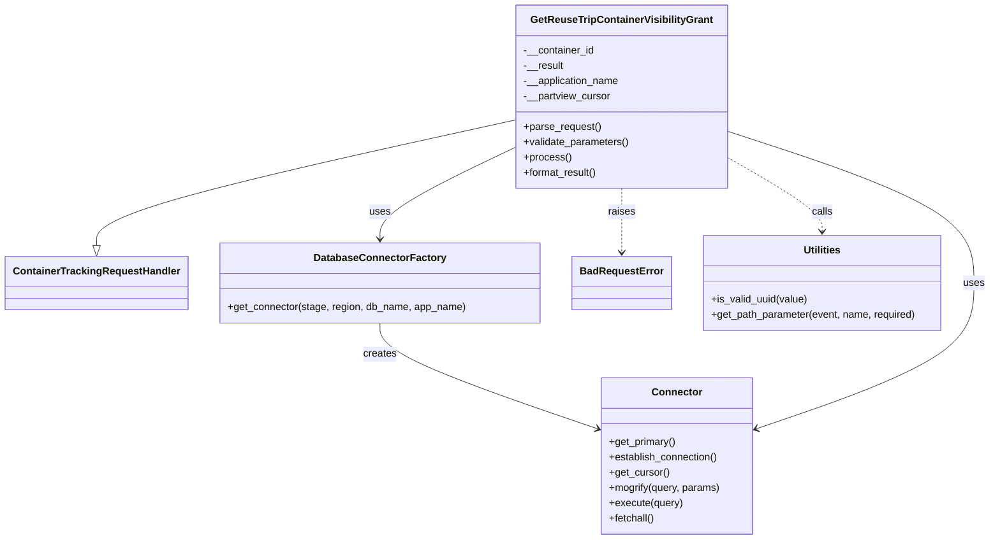
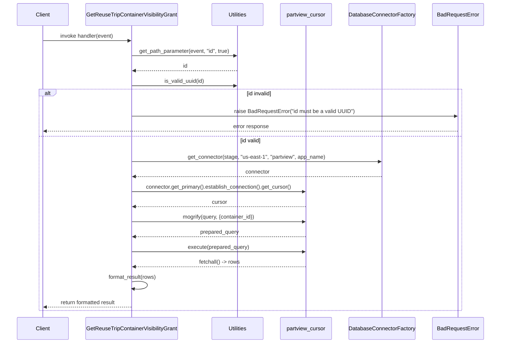

# Diagram: container_tracking_core/container_tracking_service/container_tracking_service/api/visibility_grants/handlers/get_visibility_grant.py

> Auto-generated by Obscura crawlers

## Diagram 1

### SVG

<svg id="container" width="1531.34375" xmlns="http://www.w3.org/2000/svg" class="classDiagram" height="848" viewBox="0 0 1531.34375 848" role="graphics-document document" aria-roledescription="class"><g><defs><marker id="container_class-aggregationStart" class="marker aggregation class" refX="18" refY="7" markerWidth="190" markerHeight="240" orient="auto"><path d="M 18,7 L9,13 L1,7 L9,1 Z"></path></marker></defs><defs><marker id="container_class-aggregationEnd" class="marker aggregation class" refX="1" refY="7" markerWidth="20" markerHeight="28" orient="auto"><path d="M 18,7 L9,13 L1,7 L9,1 Z"></path></marker></defs><defs><marker id="container_class-extensionStart" class="marker extension class" refX="18" refY="7" markerWidth="190" markerHeight="240" orient="auto"><path d="M 1,7 L18,13 V 1 Z"></path></marker></defs><defs><marker id="container_class-extensionEnd" class="marker extension class" refX="1" refY="7" markerWidth="20" markerHeight="28" orient="auto"><path d="M 1,1 V 13 L18,7 Z"></path></marker></defs><defs><marker id="container_class-compositionStart" class="marker composition class" refX="18" refY="7" markerWidth="190" markerHeight="240" orient="auto"><path d="M 18,7 L9,13 L1,7 L9,1 Z"></path></marker></defs><defs><marker id="container_class-compositionEnd" class="marker composition class" refX="1" refY="7" markerWidth="20" markerHeight="28" orient="auto"><path d="M 18,7 L9,13 L1,7 L9,1 Z"></path></marker></defs><defs><marker id="container_class-dependencyStart" class="marker dependency class" refX="6" refY="7" markerWidth="190" markerHeight="240" orient="auto"><path d="M 5,7 L9,13 L1,7 L9,1 Z"></path></marker></defs><defs><marker id="container_class-dependencyEnd" class="marker dependency class" refX="13" refY="7" markerWidth="20" markerHeight="28" orient="auto"><path d="M 18,7 L9,13 L14,7 L9,1 Z"></path></marker></defs><defs><marker id="container_class-lollipopStart" class="marker lollipop class" refX="13" refY="7" markerWidth="190" markerHeight="240" orient="auto"><circle stroke="black" fill="transparent" cx="7" cy="7" r="6"></circle></marker></defs><defs><marker id="container_class-lollipopEnd" class="marker lollipop class" refX="1" refY="7" markerWidth="190" markerHeight="240" orient="auto"><circle stroke="black" fill="transparent" cx="7" cy="7" r="6"></circle></marker></defs><g class="root"><g class="clusters"></g><g class="edgePaths"><path d="M789.969,188.648L682.572,212.706C575.174,236.765,360.38,284.883,252.983,317.733C145.586,350.583,145.586,368.167,145.586,376.958L145.586,385.75" id="id_GetReuseTripContainerVisibilityGrant_ContainerTrackingRequestHandler_1" class="edge-thickness-normal edge-pattern-solid relation" style=";;;" data-edge="true" data-et="edge" data-id="id_GetReuseTripContainerVisibilityGrant_ContainerTrackingRequestHandler_1" data-points="W3sieCI6Nzg5Ljk2ODc1LCJ5IjoxODguNjQ3NjgyNzcyMzU3NjV9LHsieCI6MTQ1LjU4NTkzNzUsInkiOjMzM30seyJ4IjoxNDUuNTg1OTM3NSwieSI6NDAzfV0=" marker-end="url(#container_class-extensionEnd)"></path><path d="M581.227,508L581.227,516.167C581.227,524.333,581.227,540.667,637.607,568.325C693.987,595.983,806.748,634.966,863.129,654.457L919.509,673.948" id="id_DatabaseConnectorFactory_Connector_2" class="edge-thickness-normal edge-pattern-solid relation" style=";;;" data-edge="true" data-et="edge" data-id="id_DatabaseConnectorFactory_Connector_2" data-points="W3sieCI6NTgxLjIyNjU2MjUsInkiOjUwOH0seyJ4Ijo1ODEuMjI2NTYyNSwieSI6NTU3fSx7IngiOjkyNS4xNzk2ODc1LCJ5Ijo2NzUuOTA4ODQ1Mzc0NzQ2OH1d" marker-end="url(#container_class-dependencyEnd)"></path><path d="M789.969,231.526L755.178,248.439C720.388,265.351,650.807,299.175,616.017,323.254C581.227,347.333,581.227,361.667,581.227,368.833L581.227,376" id="id_GetReuseTripContainerVisibilityGrant_DatabaseConnectorFactory_3" class="edge-thickness-normal edge-pattern-solid relation" style=";;;" data-edge="true" data-et="edge" data-id="id_GetReuseTripContainerVisibilityGrant_DatabaseConnectorFactory_3" data-points="W3sieCI6Nzg5Ljk2ODc1LCJ5IjoyMzEuNTI2MjE3NTAzNTE0NTR9LHsieCI6NTgxLjIyNjU2MjUsInkiOjMzM30seyJ4Ijo1ODEuMjI2NTYyNSwieSI6MzgyfV0=" marker-end="url(#container_class-dependencyEnd)"></path><path d="M1117.156,205.517L1182.105,226.764C1247.055,248.011,1376.953,290.506,1441.902,330.42C1506.852,370.333,1506.852,407.667,1506.852,445C1506.852,482.333,1506.852,519.667,1450.471,557.825C1394.091,595.983,1281.33,634.966,1224.95,654.457L1168.569,673.948" id="id_GetReuseTripContainerVisibilityGrant_Connector_4" class="edge-thickness-normal edge-pattern-solid relation" style=";;;" data-edge="true" data-et="edge" data-id="id_GetReuseTripContainerVisibilityGrant_Connector_4" data-points="W3sieCI6MTExNy4xNTYyNSwieSI6MjA1LjUxNzE3NzEwODQ4NDc2fSx7IngiOjE1MDYuODUxNTYyNSwieSI6MzMzfSx7IngiOjE1MDYuODUxNTYyNSwieSI6NDQ1fSx7IngiOjE1MDYuODUxNTYyNSwieSI6NTU3fSx7IngiOjExNjIuODk4NDM3NSwieSI6Njc1LjkwODg0NTM3NDc0Njh9XQ==" marker-end="url(#container_class-dependencyEnd)"></path><path d="M953.563,296L953.563,302.167C953.563,308.333,953.563,320.667,953.563,337.5C953.563,354.333,953.563,375.667,953.563,386.333L953.563,397" id="id_GetReuseTripContainerVisibilityGrant_BadRequestError_5" class="edge-thickness-normal edge-pattern-dashed relation" style=";;;" data-edge="true" data-et="edge" data-id="id_GetReuseTripContainerVisibilityGrant_BadRequestError_5" data-points="W3sieCI6OTUzLjU2MjUsInkiOjI5Nn0seyJ4Ijo5NTMuNTYyNSwieSI6MzMzfSx7IngiOjk1My41NjI1LCJ5Ijo0MDN9XQ==" marker-end="url(#container_class-dependencyEnd)"></path><path d="M1117.156,246.59L1142.064,260.992C1166.971,275.394,1216.786,304.197,1241.694,323.765C1266.602,343.333,1266.602,353.667,1266.602,358.833L1266.602,364" id="id_GetReuseTripContainerVisibilityGrant_Utilities_6" class="edge-thickness-normal edge-pattern-dashed relation" style=";;;" data-edge="true" data-et="edge" data-id="id_GetReuseTripContainerVisibilityGrant_Utilities_6" data-points="W3sieCI6MTExNy4xNTYyNSwieSI6MjQ2LjU5MDMzMTY3Nzg1NTcyfSx7IngiOjEyNjYuNjAxNTYyNSwieSI6MzMzfSx7IngiOjEyNjYuNjAxNTYyNSwieSI6MzcwfV0=" marker-end="url(#container_class-dependencyEnd)"></path></g><g class="edgeLabels"><g class="edgeLabel"><g class="label" data-id="id_GetReuseTripContainerVisibilityGrant_ContainerTrackingRequestHandler_1" transform="translate(0, 0)"><foreignObject width="0" height="0">

</foreignObject></g></g><g class="edgeLabel" transform="translate(581.2265625, 557)"><g class="label" data-id="id_DatabaseConnectorFactory_Connector_2" transform="translate(-26.171875, -12)"><foreignObject width="52.34375" height="24">

creates

</foreignObject></g></g><g class="edgeLabel" transform="translate(581.2265625, 333)"><g class="label" data-id="id_GetReuseTripContainerVisibilityGrant_DatabaseConnectorFactory_3" transform="translate(-16.4921875, -12)"><foreignObject width="32.984375" height="24">

uses

</foreignObject></g></g><g class="edgeLabel" transform="translate(1506.8515625, 445)"><g class="label" data-id="id_GetReuseTripContainerVisibilityGrant_Connector_4" transform="translate(-16.4921875, -12)"><foreignObject width="32.984375" height="24">

uses

</foreignObject></g></g><g class="edgeLabel" transform="translate(953.5625, 333)"><g class="label" data-id="id_GetReuseTripContainerVisibilityGrant_BadRequestError_5" transform="translate(-21.25, -12)"><foreignObject width="42.5" height="24">

raises

</foreignObject></g></g><g class="edgeLabel" transform="translate(1266.6015625, 333)"><g class="label" data-id="id_GetReuseTripContainerVisibilityGrant_Utilities_6" transform="translate(-16.4453125, -12)"><foreignObject width="32.890625" height="24">

calls

</foreignObject></g></g></g><g class="nodes"><g class="node default" id="classId-GetReuseTripContainerVisibilityGrant-0" transform="translate(953.5625, 152)"><g class="basic label-container"><path d="M-163.59375 -144 L163.59375 -144 L163.59375 144 L-163.59375 144" stroke="none" stroke-width="0" fill="#ECECFF" style=""></path><path d="M-163.59375 -144 C-50.397055406080966 -144, 62.79963918783807 -144, 163.59375 -144 M-163.59375 -144 C-60.023556883495644 -144, 43.54663623300871 -144, 163.59375 -144 M163.59375 -144 C163.59375 -70.96884190476581, 163.59375 2.0623161904683798, 163.59375 144 M163.59375 -144 C163.59375 -45.37854237967221, 163.59375 53.24291524065558, 163.59375 144 M163.59375 144 C62.036423396662485 144, -39.52090320667503 144, -163.59375 144 M163.59375 144 C34.41303357507226 144, -94.76768284985548 144, -163.59375 144 M-163.59375 144 C-163.59375 65.0019911583341, -163.59375 -13.996017683331786, -163.59375 -144 M-163.59375 144 C-163.59375 73.26181957867303, -163.59375 2.5236391573460537, -163.59375 -144" stroke="#9370DB" stroke-width="1.3" fill="none" stroke-dasharray="0 0" style=""></path></g><g class="annotation-group text" transform="translate(0, -120)"></g><g class="label-group text" transform="translate(-136.640625, -120)"><g class="label" style="font-weight: bolder" transform="translate(0,-12)"><foreignObject width="273.28125" height="24">

GetReuseTripContainerVisibilityGrant

</foreignObject></g></g><g class="members-group text" transform="translate(-151.59375, -72)"><g class="label" style="" transform="translate(0,-12)"><foreignObject width="111.65625" height="24">

-__container_id

</foreignObject></g><g class="label" style="" transform="translate(0,12)"><foreignObject width="63.3125" height="24">

-__result

</foreignObject></g><g class="label" style="" transform="translate(0,36)"><foreignObject width="152.28125" height="24">

-__application_name

</foreignObject></g><g class="label" style="" transform="translate(0,60)"><foreignObject width="137.5625" height="24">

-__partview_cursor

</foreignObject></g></g><g class="methods-group text" transform="translate(-151.59375, 48)"><g class="label" style="" transform="translate(0,-12)"><foreignObject width="121.796875" height="24">

+parse_request()

</foreignObject></g><g class="label" style="" transform="translate(0,12)"><foreignObject width="166.546875" height="24">

+validate_parameters()

</foreignObject></g><g class="label" style="" transform="translate(0,36)"><foreignObject width="73.734375" height="24">

+process()

</foreignObject></g><g class="label" style="" transform="translate(0,60)"><foreignObject width="117.015625" height="24">

+format_result()

</foreignObject></g></g><g class="divider" style=""><path d="M-163.59375 -96 C-82.37741732355323 -96, -1.1610846471064633 -96, 163.59375 -96 M-163.59375 -96 C-60.57378499171753 -96, 42.44618001656494 -96, 163.59375 -96" stroke="#9370DB" stroke-width="1.3" fill="none" stroke-dasharray="0 0" style=""></path></g><g class="divider" style=""><path d="M-163.59375 24 C-61.846454914963516 24, 39.90084017007297 24, 163.59375 24 M-163.59375 24 C-33.644980251232056 24, 96.30378949753589 24, 163.59375 24" stroke="#9370DB" stroke-width="1.3" fill="none" stroke-dasharray="0 0" style=""></path></g></g><g class="node default" id="classId-ContainerTrackingRequestHandler-1" transform="translate(145.5859375, 445)"><g class="basic label-container"><path d="M-137.5859375 -42 L137.5859375 -42 L137.5859375 42 L-137.5859375 42" stroke="none" stroke-width="0" fill="#ECECFF" style=""></path><path d="M-137.5859375 -42 C-41.28414393115348 -42, 55.01764963769304 -42, 137.5859375 -42 M-137.5859375 -42 C-47.25064315411686 -42, 43.084651191766284 -42, 137.5859375 -42 M137.5859375 -42 C137.5859375 -13.820979776462973, 137.5859375 14.358040447074053, 137.5859375 42 M137.5859375 -42 C137.5859375 -13.72898184876539, 137.5859375 14.54203630246922, 137.5859375 42 M137.5859375 42 C30.95869851718274 42, -75.66854046563452 42, -137.5859375 42 M137.5859375 42 C56.54379103862047 42, -24.49835542275906 42, -137.5859375 42 M-137.5859375 42 C-137.5859375 12.726051798640963, -137.5859375 -16.547896402718074, -137.5859375 -42 M-137.5859375 42 C-137.5859375 20.108119975009938, -137.5859375 -1.783760049980124, -137.5859375 -42" stroke="#9370DB" stroke-width="1.3" fill="none" stroke-dasharray="0 0" style=""></path></g><g class="annotation-group text" transform="translate(0, -18)"></g><g class="label-group text" transform="translate(-125.5859375, -18)"><g class="label" style="font-weight: bolder" transform="translate(0,-12)"><foreignObject width="251.171875" height="24">

ContainerTrackingRequestHandler

</foreignObject></g></g><g class="members-group text" transform="translate(-125.5859375, 30)"></g><g class="methods-group text" transform="translate(-125.5859375, 60)"></g><g class="divider" style=""><path d="M-137.5859375 6 C-28.037271667721768 6, 81.51139416455646 6, 137.5859375 6 M-137.5859375 6 C-41.760143663654674 6, 54.06565017269065 6, 137.5859375 6" stroke="#9370DB" stroke-width="1.3" fill="none" stroke-dasharray="0 0" style=""></path></g><g class="divider" style=""><path d="M-137.5859375 24 C-30.41127602613743 24, 76.76338544772514 24, 137.5859375 24 M-137.5859375 24 C-36.99139693940718 24, 63.60314362118564 24, 137.5859375 24" stroke="#9370DB" stroke-width="1.3" fill="none" stroke-dasharray="0 0" style=""></path></g></g><g class="node default" id="classId-DatabaseConnectorFactory-2" transform="translate(581.2265625, 445)"><g class="basic label-container"><path d="M-248.0546875 -63 L248.0546875 -63 L248.0546875 63 L-248.0546875 63" stroke="none" stroke-width="0" fill="#ECECFF" style=""></path><path d="M-248.0546875 -63 C-130.31624944869276 -63, -12.577811397385545 -63, 248.0546875 -63 M-248.0546875 -63 C-73.95453053564745 -63, 100.1456264287051 -63, 248.0546875 -63 M248.0546875 -63 C248.0546875 -31.202857852156278, 248.0546875 0.5942842956874443, 248.0546875 63 M248.0546875 -63 C248.0546875 -20.279107378531933, 248.0546875 22.441785242936135, 248.0546875 63 M248.0546875 63 C104.82183121480395 63, -38.4110250703921 63, -248.0546875 63 M248.0546875 63 C93.02374051774106 63, -62.00720646451788 63, -248.0546875 63 M-248.0546875 63 C-248.0546875 36.94678376751434, -248.0546875 10.89356753502868, -248.0546875 -63 M-248.0546875 63 C-248.0546875 34.018170456501, -248.0546875 5.036340913001993, -248.0546875 -63" stroke="#9370DB" stroke-width="1.3" fill="none" stroke-dasharray="0 0" style=""></path></g><g class="annotation-group text" transform="translate(0, -39)"></g><g class="label-group text" transform="translate(-98.1875, -39)"><g class="label" style="font-weight: bolder" transform="translate(0,-12)"><foreignObject width="196.375" height="24">

DatabaseConnectorFactory

</foreignObject></g></g><g class="members-group text" transform="translate(-236.0546875, 9)"></g><g class="methods-group text" transform="translate(-236.0546875, 39)"><g class="label" style="" transform="translate(0,-12)"><foreignObject width="373.921875" height="24">

+get_connector(stage, region, db_name, app_name)

</foreignObject></g></g><g class="divider" style=""><path d="M-248.0546875 -15 C-113.41158819490417 -15, 21.23151111019166 -15, 248.0546875 -15 M-248.0546875 -15 C-127.18203841518924 -15, -6.30938933037848 -15, 248.0546875 -15" stroke="#9370DB" stroke-width="1.3" fill="none" stroke-dasharray="0 0" style=""></path></g><g class="divider" style=""><path d="M-248.0546875 9 C-66.16468799780239 9, 115.72531150439522 9, 248.0546875 9 M-248.0546875 9 C-133.06735348364055 9, -18.080019467281062 9, 248.0546875 9" stroke="#9370DB" stroke-width="1.3" fill="none" stroke-dasharray="0 0" style=""></path></g></g><g class="node default" id="classId-Connector-3" transform="translate(1044.0390625, 717)"><g class="basic label-container"><path d="M-118.859375 -123 L118.859375 -123 L118.859375 123 L-118.859375 123" stroke="none" stroke-width="0" fill="#ECECFF" style=""></path><path d="M-118.859375 -123 C-47.24554533645646 -123, 24.368284327087082 -123, 118.859375 -123 M-118.859375 -123 C-63.378185736467955 -123, -7.896996472935911 -123, 118.859375 -123 M118.859375 -123 C118.859375 -51.39999875956478, 118.859375 20.200002480870438, 118.859375 123 M118.859375 -123 C118.859375 -27.583872519142474, 118.859375 67.83225496171505, 118.859375 123 M118.859375 123 C64.85333200630708 123, 10.847289012614183 123, -118.859375 123 M118.859375 123 C34.3943480179466 123, -50.070678964106804 123, -118.859375 123 M-118.859375 123 C-118.859375 63.3146614834357, -118.859375 3.629322966871399, -118.859375 -123 M-118.859375 123 C-118.859375 34.893302838557005, -118.859375 -53.21339432288599, -118.859375 -123" stroke="#9370DB" stroke-width="1.3" fill="none" stroke-dasharray="0 0" style=""></path></g><g class="annotation-group text" transform="translate(0, -99)"></g><g class="label-group text" transform="translate(-37.421875, -99)"><g class="label" style="font-weight: bolder" transform="translate(0,-12)"><foreignObject width="74.84375" height="24">

Connector

</foreignObject></g></g><g class="members-group text" transform="translate(-106.859375, -51)"></g><g class="methods-group text" transform="translate(-106.859375, -21)"><g class="label" style="" transform="translate(0,-12)"><foreignObject width="105.890625" height="24">

+get_primary()

</foreignObject></g><g class="label" style="" transform="translate(0,12)"><foreignObject width="173.265625" height="24">

+establish_connection()

</foreignObject></g><g class="label" style="" transform="translate(0,36)"><foreignObject width="94.640625" height="24">

+get_cursor()

</foreignObject></g><g class="label" style="" transform="translate(0,60)"><foreignObject width="176.296875" height="24">

+mogrify(query, params)

</foreignObject></g><g class="label" style="" transform="translate(0,84)"><foreignObject width="115.96875" height="24">

+execute(query)

</foreignObject></g><g class="label" style="" transform="translate(0,108)"><foreignObject width="72.515625" height="24">

+fetchall()

</foreignObject></g></g><g class="divider" style=""><path d="M-118.859375 -75 C-58.388576966782416 -75, 2.0822210664351672 -75, 118.859375 -75 M-118.859375 -75 C-61.94314682298109 -75, -5.0269186459621835 -75, 118.859375 -75" stroke="#9370DB" stroke-width="1.3" fill="none" stroke-dasharray="0 0" style=""></path></g><g class="divider" style=""><path d="M-118.859375 -51 C-62.22361645864563 -51, -5.5878579172912595 -51, 118.859375 -51 M-118.859375 -51 C-40.14848803865739 -51, 38.56239892268522 -51, 118.859375 -51" stroke="#9370DB" stroke-width="1.3" fill="none" stroke-dasharray="0 0" style=""></path></g></g><g class="node default" id="classId-BadRequestError-4" transform="translate(953.5625, 445)"><g class="basic label-container"><path d="M-74.28125 -42 L74.28125 -42 L74.28125 42 L-74.28125 42" stroke="none" stroke-width="0" fill="#ECECFF" style=""></path><path d="M-74.28125 -42 C-35.1483070942209 -42, 3.9846358115582063 -42, 74.28125 -42 M-74.28125 -42 C-17.548257862949185 -42, 39.18473427410163 -42, 74.28125 -42 M74.28125 -42 C74.28125 -23.644376085371697, 74.28125 -5.288752170743393, 74.28125 42 M74.28125 -42 C74.28125 -20.353411496032354, 74.28125 1.2931770079352916, 74.28125 42 M74.28125 42 C16.362346899411072 42, -41.556556201177855 42, -74.28125 42 M74.28125 42 C32.17229133677434 42, -9.936667326451314 42, -74.28125 42 M-74.28125 42 C-74.28125 8.435175683305609, -74.28125 -25.129648633388783, -74.28125 -42 M-74.28125 42 C-74.28125 11.975532124812904, -74.28125 -18.04893575037419, -74.28125 -42" stroke="#9370DB" stroke-width="1.3" fill="none" stroke-dasharray="0 0" style=""></path></g><g class="annotation-group text" transform="translate(0, -18)"></g><g class="label-group text" transform="translate(-62.28125, -18)"><g class="label" style="font-weight: bolder" transform="translate(0,-12)"><foreignObject width="124.5625" height="24">

BadRequestError

</foreignObject></g></g><g class="members-group text" transform="translate(-62.28125, 30)"></g><g class="methods-group text" transform="translate(-62.28125, 60)"></g><g class="divider" style=""><path d="M-74.28125 6 C-43.7977791670925 6, -13.314308334185 6, 74.28125 6 M-74.28125 6 C-30.42968374567397 6, 13.421882508652061 6, 74.28125 6" stroke="#9370DB" stroke-width="1.3" fill="none" stroke-dasharray="0 0" style=""></path></g><g class="divider" style=""><path d="M-74.28125 24 C-20.039290341235855 24, 34.20266931752829 24, 74.28125 24 M-74.28125 24 C-26.69627289442961 24, 20.888704211140777 24, 74.28125 24" stroke="#9370DB" stroke-width="1.3" fill="none" stroke-dasharray="0 0" style=""></path></g></g><g class="node default" id="classId-Utilities-5" transform="translate(1266.6015625, 445)"><g class="basic label-container"><path d="M-188.7578125 -75 L188.7578125 -75 L188.7578125 75 L-188.7578125 75" stroke="none" stroke-width="0" fill="#ECECFF" style=""></path><path d="M-188.7578125 -75 C-78.40591010643337 -75, 31.945992287133265 -75, 188.7578125 -75 M-188.7578125 -75 C-39.404506314590634 -75, 109.94879987081873 -75, 188.7578125 -75 M188.7578125 -75 C188.7578125 -41.17089102996411, 188.7578125 -7.341782059928221, 188.7578125 75 M188.7578125 -75 C188.7578125 -41.24837538823183, 188.7578125 -7.4967507764636565, 188.7578125 75 M188.7578125 75 C45.57919736647759 75, -97.59941776704483 75, -188.7578125 75 M188.7578125 75 C95.19121697937918 75, 1.6246214587583552 75, -188.7578125 75 M-188.7578125 75 C-188.7578125 37.590359644973134, -188.7578125 0.18071928994626774, -188.7578125 -75 M-188.7578125 75 C-188.7578125 24.423752982707448, -188.7578125 -26.152494034585104, -188.7578125 -75" stroke="#9370DB" stroke-width="1.3" fill="none" stroke-dasharray="0 0" style=""></path></g><g class="annotation-group text" transform="translate(0, -51)"></g><g class="label-group text" transform="translate(-28.8125, -51)"><g class="label" style="font-weight: bolder" transform="translate(0,-12)"><foreignObject width="57.625" height="24">

Utilities

</foreignObject></g></g><g class="members-group text" transform="translate(-176.7578125, -3)"></g><g class="methods-group text" transform="translate(-176.7578125, 27)"><g class="label" style="" transform="translate(0,-12)"><foreignObject width="152.375" height="24">

+is_valid_uuid(value)

</foreignObject></g><g class="label" style="" transform="translate(0,12)"><foreignObject width="324.703125" height="24">

+get_path_parameter(event, name, required)

</foreignObject></g></g><g class="divider" style=""><path d="M-188.7578125 -27 C-102.18794908630117 -27, -15.618085672602348 -27, 188.7578125 -27 M-188.7578125 -27 C-77.38995325493815 -27, 33.9779059901237 -27, 188.7578125 -27" stroke="#9370DB" stroke-width="1.3" fill="none" stroke-dasharray="0 0" style=""></path></g><g class="divider" style=""><path d="M-188.7578125 -3 C-87.02085174875572 -3, 14.716109002488565 -3, 188.7578125 -3 M-188.7578125 -3 C-81.21619821202962 -3, 26.32541607594075 -3, 188.7578125 -3" stroke="#9370DB" stroke-width="1.3" fill="none" stroke-dasharray="0 0" style=""></path></g></g></g></g></g></svg>

## Diagram 2

### SVG

<svg id="container" width="1523.5" xmlns="http://www.w3.org/2000/svg" height="1069" viewBox="-50 -10 1523.5 1069" role="graphics-document document" aria-roledescription="sequence"><g><rect x="1273.5" y="983" fill="#eaeaea" stroke="#666" width="150" height="65" name="Error" rx="3" ry="3" class="actor actor-bottom"></rect><text x="1348.5" y="1015.5" dominant-baseline="central" alignment-baseline="central" class="actor actor-box" style="text-anchor: middle; font-size: 16px; font-weight: 400;"><tspan x="1348.5" dy="0">BadRequestError</tspan></text></g><g><rect x="1009.5" y="983" fill="#eaeaea" stroke="#666" width="214" height="65" name="Factory" rx="3" ry="3" class="actor actor-bottom"></rect><text x="1116.5" y="1015.5" dominant-baseline="central" alignment-baseline="central" class="actor actor-box" style="text-anchor: middle; font-size: 16px; font-weight: 400;"><tspan x="1116.5" dy="0">DatabaseConnectorFactory</tspan></text></g><g><rect x="809.5" y="983" fill="#eaeaea" stroke="#666" width="150" height="65" name="DB" rx="3" ry="3" class="actor actor-bottom"></rect><text x="884.5" y="1015.5" dominant-baseline="central" alignment-baseline="central" class="actor actor-box" style="text-anchor: middle; font-size: 16px; font-weight: 400;"><tspan x="884.5" dy="0">partview_cursor</tspan></text></g><g><rect x="609.5" y="983" fill="#eaeaea" stroke="#666" width="150" height="65" name="Util" rx="3" ry="3" class="actor actor-bottom"></rect><text x="684.5" y="1015.5" dominant-baseline="central" alignment-baseline="central" class="actor actor-box" style="text-anchor: middle; font-size: 16px; font-weight: 400;"><tspan x="684.5" dy="0">Utilities</tspan></text></g><g><rect x="200" y="983" fill="#eaeaea" stroke="#666" width="289" height="65" name="Handler" rx="3" ry="3" class="actor actor-bottom"></rect><text x="344.5" y="1015.5" dominant-baseline="central" alignment-baseline="central" class="actor actor-box" style="text-anchor: middle; font-size: 16px; font-weight: 400;"><tspan x="344.5" dy="0">GetReuseTripContainerVisibilityGrant</tspan></text></g><g><rect x="0" y="983" fill="#eaeaea" stroke="#666" width="150" height="65" name="Client" rx="3" ry="3" class="actor actor-bottom"></rect><text x="75" y="1015.5" dominant-baseline="central" alignment-baseline="central" class="actor actor-box" style="text-anchor: middle; font-size: 16px; font-weight: 400;"><tspan x="75" dy="0">Client</tspan></text></g><g><line id="actor5" x1="1348.5" y1="65" x2="1348.5" y2="983" class="actor-line 200" stroke-width="0.5px" stroke="#999" name="Error"></line><g id="root-5"><rect x="1273.5" y="0" fill="#eaeaea" stroke="#666" width="150" height="65" name="Error" rx="3" ry="3" class="actor actor-top"></rect><text x="1348.5" y="32.5" dominant-baseline="central" alignment-baseline="central" class="actor actor-box" style="text-anchor: middle; font-size: 16px; font-weight: 400;"><tspan x="1348.5" dy="0">BadRequestError</tspan></text></g></g><g><line id="actor4" x1="1116.5" y1="65" x2="1116.5" y2="983" class="actor-line 200" stroke-width="0.5px" stroke="#999" name="Factory"></line><g id="root-4"><rect x="1009.5" y="0" fill="#eaeaea" stroke="#666" width="214" height="65" name="Factory" rx="3" ry="3" class="actor actor-top"></rect><text x="1116.5" y="32.5" dominant-baseline="central" alignment-baseline="central" class="actor actor-box" style="text-anchor: middle; font-size: 16px; font-weight: 400;"><tspan x="1116.5" dy="0">DatabaseConnectorFactory</tspan></text></g></g><g><line id="actor3" x1="884.5" y1="65" x2="884.5" y2="983" class="actor-line 200" stroke-width="0.5px" stroke="#999" name="DB"></line><g id="root-3"><rect x="809.5" y="0" fill="#eaeaea" stroke="#666" width="150" height="65" name="DB" rx="3" ry="3" class="actor actor-top"></rect><text x="884.5" y="32.5" dominant-baseline="central" alignment-baseline="central" class="actor actor-box" style="text-anchor: middle; font-size: 16px; font-weight: 400;"><tspan x="884.5" dy="0">partview_cursor</tspan></text></g></g><g><line id="actor2" x1="684.5" y1="65" x2="684.5" y2="983" class="actor-line 200" stroke-width="0.5px" stroke="#999" name="Util"></line><g id="root-2"><rect x="609.5" y="0" fill="#eaeaea" stroke="#666" width="150" height="65" name="Util" rx="3" ry="3" class="actor actor-top"></rect><text x="684.5" y="32.5" dominant-baseline="central" alignment-baseline="central" class="actor actor-box" style="text-anchor: middle; font-size: 16px; font-weight: 400;"><tspan x="684.5" dy="0">Utilities</tspan></text></g></g><g><line id="actor1" x1="344.5" y1="65" x2="344.5" y2="983" class="actor-line 200" stroke-width="0.5px" stroke="#999" name="Handler"></line><g id="root-1"><rect x="200" y="0" fill="#eaeaea" stroke="#666" width="289" height="65" name="Handler" rx="3" ry="3" class="actor actor-top"></rect><text x="344.5" y="32.5" dominant-baseline="central" alignment-baseline="central" class="actor actor-box" style="text-anchor: middle; font-size: 16px; font-weight: 400;"><tspan x="344.5" dy="0">GetReuseTripContainerVisibilityGrant</tspan></text></g></g><g><line id="actor0" x1="75" y1="65" x2="75" y2="983" class="actor-line 200" stroke-width="0.5px" stroke="#999" name="Client"></line><g id="root-0"><rect x="0" y="0" fill="#eaeaea" stroke="#666" width="150" height="65" name="Client" rx="3" ry="3" class="actor actor-top"></rect><text x="75" y="32.5" dominant-baseline="central" alignment-baseline="central" class="actor actor-box" style="text-anchor: middle; font-size: 16px; font-weight: 400;"><tspan x="75" dy="0">Client</tspan></text></g></g><g></g><defs><symbol id="computer" width="24" height="24"><path transform="scale(.5)" d="M2 2v13h20v-13h-20zm18 11h-16v-9h16v9zm-10.228 6l.466-1h3.524l.467 1h-4.457zm14.228 3h-24l2-6h2.104l-1.33 4h18.45l-1.297-4h2.073l2 6zm-5-10h-14v-7h14v7z"></path></symbol></defs><defs><symbol id="database" fill-rule="evenodd" clip-rule="evenodd"><path transform="scale(.5)" d="M12.258.001l.256.004.255.005.253.008.251.01.249.012.247.015.246.016.242.019.241.02.239.023.236.024.233.027.231.028.229.031.225.032.223.034.22.036.217.038.214.04.211.041.208.043.205.045.201.046.198.048.194.05.191.051.187.053.183.054.18.056.175.057.172.059.168.06.163.061.16.063.155.064.15.066.074.033.073.033.071.034.07.034.069.035.068.035.067.035.066.035.064.036.064.036.062.036.06.036.06.037.058.037.058.037.055.038.055.038.053.038.052.038.051.039.05.039.048.039.047.039.045.04.044.04.043.04.041.04.04.041.039.041.037.041.036.041.034.041.033.042.032.042.03.042.029.042.027.042.026.043.024.043.023.043.021.043.02.043.018.044.017.043.015.044.013.044.012.044.011.045.009.044.007.045.006.045.004.045.002.045.001.045v17l-.001.045-.002.045-.004.045-.006.045-.007.045-.009.044-.011.045-.012.044-.013.044-.015.044-.017.043-.018.044-.02.043-.021.043-.023.043-.024.043-.026.043-.027.042-.029.042-.03.042-.032.042-.033.042-.034.041-.036.041-.037.041-.039.041-.04.041-.041.04-.043.04-.044.04-.045.04-.047.039-.048.039-.05.039-.051.039-.052.038-.053.038-.055.038-.055.038-.058.037-.058.037-.06.037-.06.036-.062.036-.064.036-.064.036-.066.035-.067.035-.068.035-.069.035-.07.034-.071.034-.073.033-.074.033-.15.066-.155.064-.16.063-.163.061-.168.06-.172.059-.175.057-.18.056-.183.054-.187.053-.191.051-.194.05-.198.048-.201.046-.205.045-.208.043-.211.041-.214.04-.217.038-.22.036-.223.034-.225.032-.229.031-.231.028-.233.027-.236.024-.239.023-.241.02-.242.019-.246.016-.247.015-.249.012-.251.01-.253.008-.255.005-.256.004-.258.001-.258-.001-.256-.004-.255-.005-.253-.008-.251-.01-.249-.012-.247-.015-.245-.016-.243-.019-.241-.02-.238-.023-.236-.024-.234-.027-.231-.028-.228-.031-.226-.032-.223-.034-.22-.036-.217-.038-.214-.04-.211-.041-.208-.043-.204-.045-.201-.046-.198-.048-.195-.05-.19-.051-.187-.053-.184-.054-.179-.056-.176-.057-.172-.059-.167-.06-.164-.061-.159-.063-.155-.064-.151-.066-.074-.033-.072-.033-.072-.034-.07-.034-.069-.035-.068-.035-.067-.035-.066-.035-.064-.036-.063-.036-.062-.036-.061-.036-.06-.037-.058-.037-.057-.037-.056-.038-.055-.038-.053-.038-.052-.038-.051-.039-.049-.039-.049-.039-.046-.039-.046-.04-.044-.04-.043-.04-.041-.04-.04-.041-.039-.041-.037-.041-.036-.041-.034-.041-.033-.042-.032-.042-.03-.042-.029-.042-.027-.042-.026-.043-.024-.043-.023-.043-.021-.043-.02-.043-.018-.044-.017-.043-.015-.044-.013-.044-.012-.044-.011-.045-.009-.044-.007-.045-.006-.045-.004-.045-.002-.045-.001-.045v-17l.001-.045.002-.045.004-.045.006-.045.007-.045.009-.044.011-.045.012-.044.013-.044.015-.044.017-.043.018-.044.02-.043.021-.043.023-.043.024-.043.026-.043.027-.042.029-.042.03-.042.032-.042.033-.042.034-.041.036-.041.037-.041.039-.041.04-.041.041-.04.043-.04.044-.04.046-.04.046-.039.049-.039.049-.039.051-.039.052-.038.053-.038.055-.038.056-.038.057-.037.058-.037.06-.037.061-.036.062-.036.063-.036.064-.036.066-.035.067-.035.068-.035.069-.035.07-.034.072-.034.072-.033.074-.033.151-.066.155-.064.159-.063.164-.061.167-.06.172-.059.176-.057.179-.056.184-.054.187-.053.19-.051.195-.05.198-.048.201-.046.204-.045.208-.043.211-.041.214-.04.217-.038.22-.036.223-.034.226-.032.228-.031.231-.028.234-.027.236-.024.238-.023.241-.02.243-.019.245-.016.247-.015.249-.012.251-.01.253-.008.255-.005.256-.004.258-.001.258.001zm-9.258 20.499v.01l.001.021.003.021.004.022.005.021.006.022.007.022.009.023.01.022.011.023.012.023.013.023.015.023.016.024.017.023.018.024.019.024.021.024.022.025.023.024.024.025.052.049.056.05.061.051.066.051.07.051.075.051.079.052.084.052.088.052.092.052.097.052.102.051.105.052.11.052.114.051.119.051.123.051.127.05.131.05.135.05.139.048.144.049.147.047.152.047.155.047.16.045.163.045.167.043.171.043.176.041.178.041.183.039.187.039.19.037.194.035.197.035.202.033.204.031.209.03.212.029.216.027.219.025.222.024.226.021.23.02.233.018.236.016.24.015.243.012.246.01.249.008.253.005.256.004.259.001.26-.001.257-.004.254-.005.25-.008.247-.011.244-.012.241-.014.237-.016.233-.018.231-.021.226-.021.224-.024.22-.026.216-.027.212-.028.21-.031.205-.031.202-.034.198-.034.194-.036.191-.037.187-.039.183-.04.179-.04.175-.042.172-.043.168-.044.163-.045.16-.046.155-.046.152-.047.148-.048.143-.049.139-.049.136-.05.131-.05.126-.05.123-.051.118-.052.114-.051.11-.052.106-.052.101-.052.096-.052.092-.052.088-.053.083-.051.079-.052.074-.052.07-.051.065-.051.06-.051.056-.05.051-.05.023-.024.023-.025.021-.024.02-.024.019-.024.018-.024.017-.024.015-.023.014-.024.013-.023.012-.023.01-.023.01-.022.008-.022.006-.022.006-.022.004-.022.004-.021.001-.021.001-.021v-4.127l-.077.055-.08.053-.083.054-.085.053-.087.052-.09.052-.093.051-.095.05-.097.05-.1.049-.102.049-.105.048-.106.047-.109.047-.111.046-.114.045-.115.045-.118.044-.12.043-.122.042-.124.042-.126.041-.128.04-.13.04-.132.038-.134.038-.135.037-.138.037-.139.035-.142.035-.143.034-.144.033-.147.032-.148.031-.15.03-.151.03-.153.029-.154.027-.156.027-.158.026-.159.025-.161.024-.162.023-.163.022-.165.021-.166.02-.167.019-.169.018-.169.017-.171.016-.173.015-.173.014-.175.013-.175.012-.177.011-.178.01-.179.008-.179.008-.181.006-.182.005-.182.004-.184.003-.184.002h-.37l-.184-.002-.184-.003-.182-.004-.182-.005-.181-.006-.179-.008-.179-.008-.178-.01-.176-.011-.176-.012-.175-.013-.173-.014-.172-.015-.171-.016-.17-.017-.169-.018-.167-.019-.166-.02-.165-.021-.163-.022-.162-.023-.161-.024-.159-.025-.157-.026-.156-.027-.155-.027-.153-.029-.151-.03-.15-.03-.148-.031-.146-.032-.145-.033-.143-.034-.141-.035-.14-.035-.137-.037-.136-.037-.134-.038-.132-.038-.13-.04-.128-.04-.126-.041-.124-.042-.122-.042-.12-.044-.117-.043-.116-.045-.113-.045-.112-.046-.109-.047-.106-.047-.105-.048-.102-.049-.1-.049-.097-.05-.095-.05-.093-.052-.09-.051-.087-.052-.085-.053-.083-.054-.08-.054-.077-.054v4.127zm0-5.654v.011l.001.021.003.021.004.021.005.022.006.022.007.022.009.022.01.022.011.023.012.023.013.023.015.024.016.023.017.024.018.024.019.024.021.024.022.024.023.025.024.024.052.05.056.05.061.05.066.051.07.051.075.052.079.051.084.052.088.052.092.052.097.052.102.052.105.052.11.051.114.051.119.052.123.05.127.051.131.05.135.049.139.049.144.048.147.048.152.047.155.046.16.045.163.045.167.044.171.042.176.042.178.04.183.04.187.038.19.037.194.036.197.034.202.033.204.032.209.03.212.028.216.027.219.025.222.024.226.022.23.02.233.018.236.016.24.014.243.012.246.01.249.008.253.006.256.003.259.001.26-.001.257-.003.254-.006.25-.008.247-.01.244-.012.241-.015.237-.016.233-.018.231-.02.226-.022.224-.024.22-.025.216-.027.212-.029.21-.03.205-.032.202-.033.198-.035.194-.036.191-.037.187-.039.183-.039.179-.041.175-.042.172-.043.168-.044.163-.045.16-.045.155-.047.152-.047.148-.048.143-.048.139-.05.136-.049.131-.05.126-.051.123-.051.118-.051.114-.052.11-.052.106-.052.101-.052.096-.052.092-.052.088-.052.083-.052.079-.052.074-.051.07-.052.065-.051.06-.05.056-.051.051-.049.023-.025.023-.024.021-.025.02-.024.019-.024.018-.024.017-.024.015-.023.014-.023.013-.024.012-.022.01-.023.01-.023.008-.022.006-.022.006-.022.004-.021.004-.022.001-.021.001-.021v-4.139l-.077.054-.08.054-.083.054-.085.052-.087.053-.09.051-.093.051-.095.051-.097.05-.1.049-.102.049-.105.048-.106.047-.109.047-.111.046-.114.045-.115.044-.118.044-.12.044-.122.042-.124.042-.126.041-.128.04-.13.039-.132.039-.134.038-.135.037-.138.036-.139.036-.142.035-.143.033-.144.033-.147.033-.148.031-.15.03-.151.03-.153.028-.154.028-.156.027-.158.026-.159.025-.161.024-.162.023-.163.022-.165.021-.166.02-.167.019-.169.018-.169.017-.171.016-.173.015-.173.014-.175.013-.175.012-.177.011-.178.009-.179.009-.179.007-.181.007-.182.005-.182.004-.184.003-.184.002h-.37l-.184-.002-.184-.003-.182-.004-.182-.005-.181-.007-.179-.007-.179-.009-.178-.009-.176-.011-.176-.012-.175-.013-.173-.014-.172-.015-.171-.016-.17-.017-.169-.018-.167-.019-.166-.02-.165-.021-.163-.022-.162-.023-.161-.024-.159-.025-.157-.026-.156-.027-.155-.028-.153-.028-.151-.03-.15-.03-.148-.031-.146-.033-.145-.033-.143-.033-.141-.035-.14-.036-.137-.036-.136-.037-.134-.038-.132-.039-.13-.039-.128-.04-.126-.041-.124-.042-.122-.043-.12-.043-.117-.044-.116-.044-.113-.046-.112-.046-.109-.046-.106-.047-.105-.048-.102-.049-.1-.049-.097-.05-.095-.051-.093-.051-.09-.051-.087-.053-.085-.052-.083-.054-.08-.054-.077-.054v4.139zm0-5.666v.011l.001.02.003.022.004.021.005.022.006.021.007.022.009.023.01.022.011.023.012.023.013.023.015.023.016.024.017.024.018.023.019.024.021.025.022.024.023.024.024.025.052.05.056.05.061.05.066.051.07.051.075.052.079.051.084.052.088.052.092.052.097.052.102.052.105.051.11.052.114.051.119.051.123.051.127.05.131.05.135.05.139.049.144.048.147.048.152.047.155.046.16.045.163.045.167.043.171.043.176.042.178.04.183.04.187.038.19.037.194.036.197.034.202.033.204.032.209.03.212.028.216.027.219.025.222.024.226.021.23.02.233.018.236.017.24.014.243.012.246.01.249.008.253.006.256.003.259.001.26-.001.257-.003.254-.006.25-.008.247-.01.244-.013.241-.014.237-.016.233-.018.231-.02.226-.022.224-.024.22-.025.216-.027.212-.029.21-.03.205-.032.202-.033.198-.035.194-.036.191-.037.187-.039.183-.039.179-.041.175-.042.172-.043.168-.044.163-.045.16-.045.155-.047.152-.047.148-.048.143-.049.139-.049.136-.049.131-.051.126-.05.123-.051.118-.052.114-.051.11-.052.106-.052.101-.052.096-.052.092-.052.088-.052.083-.052.079-.052.074-.052.07-.051.065-.051.06-.051.056-.05.051-.049.023-.025.023-.025.021-.024.02-.024.019-.024.018-.024.017-.024.015-.023.014-.024.013-.023.012-.023.01-.022.01-.023.008-.022.006-.022.006-.022.004-.022.004-.021.001-.021.001-.021v-4.153l-.077.054-.08.054-.083.053-.085.053-.087.053-.09.051-.093.051-.095.051-.097.05-.1.049-.102.048-.105.048-.106.048-.109.046-.111.046-.114.046-.115.044-.118.044-.12.043-.122.043-.124.042-.126.041-.128.04-.13.039-.132.039-.134.038-.135.037-.138.036-.139.036-.142.034-.143.034-.144.033-.147.032-.148.032-.15.03-.151.03-.153.028-.154.028-.156.027-.158.026-.159.024-.161.024-.162.023-.163.023-.165.021-.166.02-.167.019-.169.018-.169.017-.171.016-.173.015-.173.014-.175.013-.175.012-.177.01-.178.01-.179.009-.179.007-.181.006-.182.006-.182.004-.184.003-.184.001-.185.001-.185-.001-.184-.001-.184-.003-.182-.004-.182-.006-.181-.006-.179-.007-.179-.009-.178-.01-.176-.01-.176-.012-.175-.013-.173-.014-.172-.015-.171-.016-.17-.017-.169-.018-.167-.019-.166-.02-.165-.021-.163-.023-.162-.023-.161-.024-.159-.024-.157-.026-.156-.027-.155-.028-.153-.028-.151-.03-.15-.03-.148-.032-.146-.032-.145-.033-.143-.034-.141-.034-.14-.036-.137-.036-.136-.037-.134-.038-.132-.039-.13-.039-.128-.041-.126-.041-.124-.041-.122-.043-.12-.043-.117-.044-.116-.044-.113-.046-.112-.046-.109-.046-.106-.048-.105-.048-.102-.048-.1-.05-.097-.049-.095-.051-.093-.051-.09-.052-.087-.052-.085-.053-.083-.053-.08-.054-.077-.054v4.153zm8.74-8.179l-.257.004-.254.005-.25.008-.247.011-.244.012-.241.014-.237.016-.233.018-.231.021-.226.022-.224.023-.22.026-.216.027-.212.028-.21.031-.205.032-.202.033-.198.034-.194.036-.191.038-.187.038-.183.04-.179.041-.175.042-.172.043-.168.043-.163.045-.16.046-.155.046-.152.048-.148.048-.143.048-.139.049-.136.05-.131.05-.126.051-.123.051-.118.051-.114.052-.11.052-.106.052-.101.052-.096.052-.092.052-.088.052-.083.052-.079.052-.074.051-.07.052-.065.051-.06.05-.056.05-.051.05-.023.025-.023.024-.021.024-.02.025-.019.024-.018.024-.017.023-.015.024-.014.023-.013.023-.012.023-.01.023-.01.022-.008.022-.006.023-.006.021-.004.022-.004.021-.001.021-.001.021.001.021.001.021.004.021.004.022.006.021.006.023.008.022.01.022.01.023.012.023.013.023.014.023.015.024.017.023.018.024.019.024.02.025.021.024.023.024.023.025.051.05.056.05.06.05.065.051.07.052.074.051.079.052.083.052.088.052.092.052.096.052.101.052.106.052.11.052.114.052.118.051.123.051.126.051.131.05.136.05.139.049.143.048.148.048.152.048.155.046.16.046.163.045.168.043.172.043.175.042.179.041.183.04.187.038.191.038.194.036.198.034.202.033.205.032.21.031.212.028.216.027.22.026.224.023.226.022.231.021.233.018.237.016.241.014.244.012.247.011.25.008.254.005.257.004.26.001.26-.001.257-.004.254-.005.25-.008.247-.011.244-.012.241-.014.237-.016.233-.018.231-.021.226-.022.224-.023.22-.026.216-.027.212-.028.21-.031.205-.032.202-.033.198-.034.194-.036.191-.038.187-.038.183-.04.179-.041.175-.042.172-.043.168-.043.163-.045.16-.046.155-.046.152-.048.148-.048.143-.048.139-.049.136-.05.131-.05.126-.051.123-.051.118-.051.114-.052.11-.052.106-.052.101-.052.096-.052.092-.052.088-.052.083-.052.079-.052.074-.051.07-.052.065-.051.06-.05.056-.05.051-.05.023-.025.023-.024.021-.024.02-.025.019-.024.018-.024.017-.023.015-.024.014-.023.013-.023.012-.023.01-.023.01-.022.008-.022.006-.023.006-.021.004-.022.004-.021.001-.021.001-.021-.001-.021-.001-.021-.004-.021-.004-.022-.006-.021-.006-.023-.008-.022-.01-.022-.01-.023-.012-.023-.013-.023-.014-.023-.015-.024-.017-.023-.018-.024-.019-.024-.02-.025-.021-.024-.023-.024-.023-.025-.051-.05-.056-.05-.06-.05-.065-.051-.07-.052-.074-.051-.079-.052-.083-.052-.088-.052-.092-.052-.096-.052-.101-.052-.106-.052-.11-.052-.114-.052-.118-.051-.123-.051-.126-.051-.131-.05-.136-.05-.139-.049-.143-.048-.148-.048-.152-.048-.155-.046-.16-.046-.163-.045-.168-.043-.172-.043-.175-.042-.179-.041-.183-.04-.187-.038-.191-.038-.194-.036-.198-.034-.202-.033-.205-.032-.21-.031-.212-.028-.216-.027-.22-.026-.224-.023-.226-.022-.231-.021-.233-.018-.237-.016-.241-.014-.244-.012-.247-.011-.25-.008-.254-.005-.257-.004-.26-.001-.26.001z"></path></symbol></defs><defs><symbol id="clock" width="24" height="24"><path transform="scale(.5)" d="M12 2c5.514 0 10 4.486 10 10s-4.486 10-10 10-10-4.486-10-10 4.486-10 10-10zm0-2c-6.627 0-12 5.373-12 12s5.373 12 12 12 12-5.373 12-12-5.373-12-12-12zm5.848 12.459c.202.038.202.333.001.372-1.907.361-6.045 1.111-6.547 1.111-.719 0-1.301-.582-1.301-1.301 0-.512.77-5.447 1.125-7.445.034-.192.312-.181.343.014l.985 6.238 5.394 1.011z"></path></symbol></defs><defs><marker id="arrowhead" refX="7.9" refY="5" markerUnits="userSpaceOnUse" markerWidth="12" markerHeight="12" orient="auto-start-reverse"><path d="M -1 0 L 10 5 L 0 10 z"></path></marker></defs><defs><marker id="crosshead" markerWidth="15" markerHeight="8" orient="auto" refX="4" refY="4.5"><path fill="none" stroke="#000000" stroke-width="1pt" d="M 1,2 L 6,7 M 6,2 L 1,7" style="stroke-dasharray: 0, 0;"></path></marker></defs><defs><marker id="filled-head" refX="15.5" refY="7" markerWidth="20" markerHeight="28" orient="auto"><path d="M 18,7 L9,13 L14,7 L9,1 Z"></path></marker></defs><defs><marker id="sequencenumber" refX="15" refY="15" markerWidth="60" markerHeight="40" orient="auto"><circle cx="15" cy="15" r="6"></circle></marker></defs><g><line x1="64" y1="267" x2="1359.5" y2="267" class="loopLine"></line><line x1="1359.5" y1="267" x2="1359.5" y2="963" class="loopLine"></line><line x1="64" y1="963" x2="1359.5" y2="963" class="loopLine"></line><line x1="64" y1="267" x2="64" y2="963" class="loopLine"></line><line x1="64" y1="413" x2="1359.5" y2="413" class="loopLine" style="stroke-dasharray: 3, 3;"></line><polygon points="64,267 114,267 114,280 105.6,287 64,287" class="labelBox"></polygon><text x="89" y="280" text-anchor="middle" dominant-baseline="middle" alignment-baseline="middle" class="labelText" style="font-size: 16px; font-weight: 400;">alt</text><text x="736.75" y="285" text-anchor="middle" class="loopText" style="font-size: 16px; font-weight: 400;"><tspan x="736.75">[id invalid]</tspan></text><text x="711.75" y="431" text-anchor="middle" class="loopText" style="font-size: 16px; font-weight: 400;">[id valid]</text></g><text x="208" y="80" text-anchor="middle" dominant-baseline="middle" alignment-baseline="middle" class="messageText" dy="1em" style="font-size: 16px; font-weight: 400;">invoke handler(event)</text><line x1="76" y1="113" x2="340.5" y2="113" class="messageLine0" stroke-width="2" stroke="none" marker-end="url(#arrowhead)" style="fill: none;"></line><text x="513" y="128" text-anchor="middle" dominant-baseline="middle" alignment-baseline="middle" class="messageText" dy="1em" style="font-size: 16px; font-weight: 400;">get_path_parameter(event, "id", true)</text><line x1="345.5" y1="161" x2="680.5" y2="161" class="messageLine0" stroke-width="2" stroke="none" marker-end="url(#arrowhead)" style="fill: none;"></line><text x="516" y="176" text-anchor="middle" dominant-baseline="middle" alignment-baseline="middle" class="messageText" dy="1em" style="font-size: 16px; font-weight: 400;">id</text><line x1="683.5" y1="209" x2="348.5" y2="209" class="messageLine1" stroke-width="2" stroke="none" marker-end="url(#arrowhead)" style="stroke-dasharray: 3, 3; fill: none;"></line><text x="513" y="224" text-anchor="middle" dominant-baseline="middle" alignment-baseline="middle" class="messageText" dy="1em" style="font-size: 16px; font-weight: 400;">is_valid_uuid(id)</text><line x1="345.5" y1="257" x2="680.5" y2="257" class="messageLine0" stroke-width="2" stroke="none" marker-end="url(#arrowhead)" style="fill: none;"></line><text x="845" y="317" text-anchor="middle" dominant-baseline="middle" alignment-baseline="middle" class="messageText" dy="1em" style="font-size: 16px; font-weight: 400;">raise BadRequestError("id must be a valid UUID")</text><line x1="345.5" y1="350" x2="1344.5" y2="350" class="messageLine0" stroke-width="2" stroke="none" marker-end="url(#arrowhead)" style="fill: none;"></line><text x="713" y="365" text-anchor="middle" dominant-baseline="middle" alignment-baseline="middle" class="messageText" dy="1em" style="font-size: 16px; font-weight: 400;">error response</text><line x1="1347.5" y1="398" x2="79" y2="398" class="messageLine1" stroke-width="2" stroke="none" marker-end="url(#arrowhead)" style="stroke-dasharray: 3, 3; fill: none;"></line><text x="729" y="458" text-anchor="middle" dominant-baseline="middle" alignment-baseline="middle" class="messageText" dy="1em" style="font-size: 16px; font-weight: 400;">get_connector(stage, "us-east-1", "partview", app_name)</text><line x1="345.5" y1="491" x2="1112.5" y2="491" class="messageLine0" stroke-width="2" stroke="none" marker-end="url(#arrowhead)" style="fill: none;"></line><text x="732" y="506" text-anchor="middle" dominant-baseline="middle" alignment-baseline="middle" class="messageText" dy="1em" style="font-size: 16px; font-weight: 400;">connector</text><line x1="1115.5" y1="539" x2="348.5" y2="539" class="messageLine1" stroke-width="2" stroke="none" marker-end="url(#arrowhead)" style="stroke-dasharray: 3, 3; fill: none;"></line><text x="613" y="554" text-anchor="middle" dominant-baseline="middle" alignment-baseline="middle" class="messageText" dy="1em" style="font-size: 16px; font-weight: 400;">connector.get_primary().establish_connection().get_cursor()</text><line x1="345.5" y1="587" x2="880.5" y2="587" class="messageLine0" stroke-width="2" stroke="none" marker-end="url(#arrowhead)" style="fill: none;"></line><text x="616" y="602" text-anchor="middle" dominant-baseline="middle" alignment-baseline="middle" class="messageText" dy="1em" style="font-size: 16px; font-weight: 400;">cursor</text><line x1="883.5" y1="635" x2="348.5" y2="635" class="messageLine1" stroke-width="2" stroke="none" marker-end="url(#arrowhead)" style="stroke-dasharray: 3, 3; fill: none;"></line><text x="613" y="650" text-anchor="middle" dominant-baseline="middle" alignment-baseline="middle" class="messageText" dy="1em" style="font-size: 16px; font-weight: 400;">mogrify(query, {container_id})</text><line x1="345.5" y1="683" x2="880.5" y2="683" class="messageLine0" stroke-width="2" stroke="none" marker-end="url(#arrowhead)" style="fill: none;"></line><text x="616" y="698" text-anchor="middle" dominant-baseline="middle" alignment-baseline="middle" class="messageText" dy="1em" style="font-size: 16px; font-weight: 400;">prepared_query</text><line x1="883.5" y1="731" x2="348.5" y2="731" class="messageLine1" stroke-width="2" stroke="none" marker-end="url(#arrowhead)" style="stroke-dasharray: 3, 3; fill: none;"></line><text x="613" y="746" text-anchor="middle" dominant-baseline="middle" alignment-baseline="middle" class="messageText" dy="1em" style="font-size: 16px; font-weight: 400;">execute(prepared_query)</text><line x1="345.5" y1="779" x2="880.5" y2="779" class="messageLine0" stroke-width="2" stroke="none" marker-end="url(#arrowhead)" style="fill: none;"></line><text x="616" y="794" text-anchor="middle" dominant-baseline="middle" alignment-baseline="middle" class="messageText" dy="1em" style="font-size: 16px; font-weight: 400;">fetchall() -&gt; rows</text><line x1="883.5" y1="827" x2="348.5" y2="827" class="messageLine1" stroke-width="2" stroke="none" marker-end="url(#arrowhead)" style="stroke-dasharray: 3, 3; fill: none;"></line><text x="346" y="842" text-anchor="middle" dominant-baseline="middle" alignment-baseline="middle" class="messageText" dy="1em" style="font-size: 16px; font-weight: 400;">format_result(rows)</text><path d="M 345.5,875 C 405.5,865 405.5,905 345.5,895" class="messageLine0" stroke-width="2" stroke="none" marker-end="url(#arrowhead)" style="fill: none;"></path><text x="211" y="920" text-anchor="middle" dominant-baseline="middle" alignment-baseline="middle" class="messageText" dy="1em" style="font-size: 16px; font-weight: 400;">return formatted result</text><line x1="343.5" y1="953" x2="79" y2="953" class="messageLine1" stroke-width="2" stroke="none" marker-end="url(#arrowhead)" style="stroke-dasharray: 3, 3; fill: none;"></line></svg>
