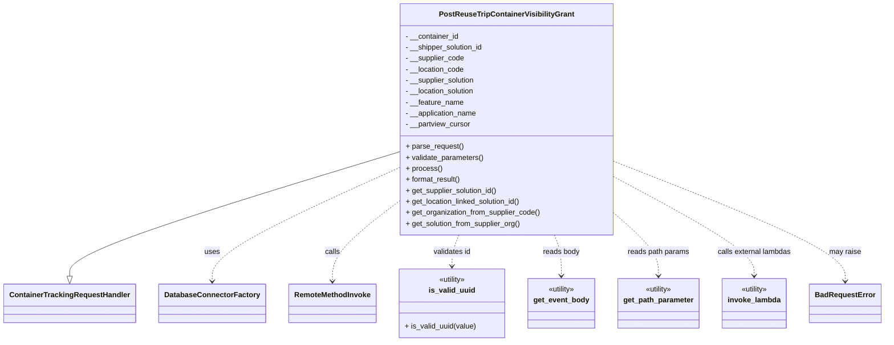

# Diagram: container_tracking_core/container_tracking_service/container_tracking_service/api/visibility_grants/handlers/post_visibility_grant.py


> Auto-generated by Obscura crawlers

## Diagram 1



> SVG rendering failed for this diagram.

## Diagram 2

```mermaid
flowchart LR
Start([Start]) --> ParseRequest[parse_request()]
ParseRequest --> Validate[validate_parameters()]
Validate --> ValidCheck{Valid UUID and\nsupplier or location code?}
ValidCheck -- No --> Raise[raise BadRequestError]
ValidCheck -- Yes --> Process[process()]
Process --> LocCheck{location_code present?}
LocCheck -- Yes --> GetLocation[get_location_linked_solution_id()]
GetLocation --> LocFound{location_solution found?}
LocFound -- Yes --> InsertLoc[INSERT visibility_grant (LOCATION)]
LocFound -- No --> NoLoc[skip LOCATION insert]
LocCheck -- No --> NoLoc
Process --> SupCheck{supplier_code present?}
SupCheck -- Yes --> GetSupplier[get_supplier_solution_id()]
GetSupplier --> SupFound{supplier_solution found?}
SupFound -- Yes --> InsertSup[INSERT visibility_grant (SOLUTION / SUPPLIER)]
SupFound -- No --> NoSup[skip SUPPLIER insert]
SupCheck -- No --> NoSup
InsertLoc --> Format[format_result()]
InsertSup --> Format
NoLoc --> Format
NoSup --> Format
Format --> End([Return response])
```

> SVG rendering failed for this diagram.
