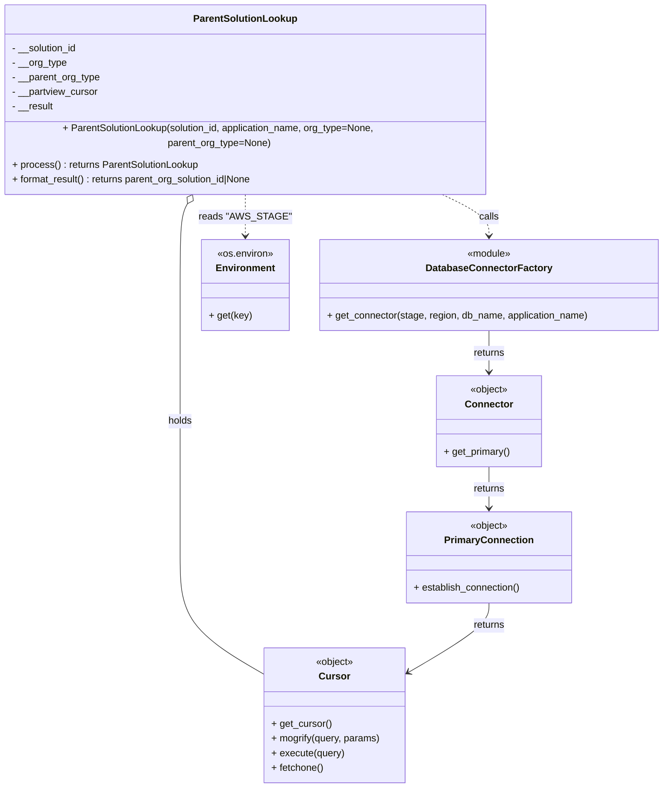

# Diagram: container_tracking_core/container_tracking_service/container_tracking_service/api/visibility_grants/reuse_trip_container_parent_solution_lookup.py

> Auto-generated by Obscura crawlers

## Mermaid

### SVG

<svg id="container" width="1091.99609375" xmlns="http://www.w3.org/2000/svg" class="classDiagram" height="1272" viewBox="0 0 1091.99609375 1272" role="graphics-document document" aria-roledescription="class"><g><defs><marker id="container_class-aggregationStart" class="marker aggregation class" refX="18" refY="7" markerWidth="190" markerHeight="240" orient="auto"><path d="M 18,7 L9,13 L1,7 L9,1 Z"></path></marker></defs><defs><marker id="container_class-aggregationEnd" class="marker aggregation class" refX="1" refY="7" markerWidth="20" markerHeight="28" orient="auto"><path d="M 18,7 L9,13 L1,7 L9,1 Z"></path></marker></defs><defs><marker id="container_class-extensionStart" class="marker extension class" refX="18" refY="7" markerWidth="190" markerHeight="240" orient="auto"><path d="M 1,7 L18,13 V 1 Z"></path></marker></defs><defs><marker id="container_class-extensionEnd" class="marker extension class" refX="1" refY="7" markerWidth="20" markerHeight="28" orient="auto"><path d="M 1,1 V 13 L18,7 Z"></path></marker></defs><defs><marker id="container_class-compositionStart" class="marker composition class" refX="18" refY="7" markerWidth="190" markerHeight="240" orient="auto"><path d="M 18,7 L9,13 L1,7 L9,1 Z"></path></marker></defs><defs><marker id="container_class-compositionEnd" class="marker composition class" refX="1" refY="7" markerWidth="20" markerHeight="28" orient="auto"><path d="M 18,7 L9,13 L1,7 L9,1 Z"></path></marker></defs><defs><marker id="container_class-dependencyStart" class="marker dependency class" refX="6" refY="7" markerWidth="190" markerHeight="240" orient="auto"><path d="M 5,7 L9,13 L1,7 L9,1 Z"></path></marker></defs><defs><marker id="container_class-dependencyEnd" class="marker dependency class" refX="13" refY="7" markerWidth="20" markerHeight="28" orient="auto"><path d="M 18,7 L9,13 L14,7 L9,1 Z"></path></marker></defs><defs><marker id="container_class-lollipopStart" class="marker lollipop class" refX="13" refY="7" markerWidth="190" markerHeight="240" orient="auto"><circle stroke="black" fill="transparent" cx="7" cy="7" r="6"></circle></marker></defs><defs><marker id="container_class-lollipopEnd" class="marker lollipop class" refX="1" refY="7" markerWidth="190" markerHeight="240" orient="auto"><circle stroke="black" fill="transparent" cx="7" cy="7" r="6"></circle></marker></defs><g class="root"><g class="clusters"></g><g class="edgePaths"><path d="M316.407,310.915L314.268,314.596C312.129,318.277,307.852,325.638,305.713,347.986C303.574,370.333,303.574,407.667,303.574,445C303.574,482.333,303.574,519.667,303.574,557C303.574,594.333,303.574,631.667,303.574,669C303.574,706.333,303.574,743.667,303.574,781C303.574,818.333,303.574,855.667,303.574,893C303.574,930.333,303.574,967.667,325.794,999.412C348.014,1031.158,392.454,1057.315,414.674,1070.394L436.895,1083.473" id="id_ParentSolutionLookup_Cursor_1" class="edge-thickness-normal edge-pattern-solid relation" style=";;;" data-edge="true" data-et="edge" data-id="id_ParentSolutionLookup_Cursor_1" data-points="W3sieCI6MzI1LjA3MzQ0MTgxNjI5ODMsInkiOjI5Nn0seyJ4IjozMDMuNTc0MjE4NzUsInkiOjMzM30seyJ4IjozMDMuNTc0MjE4NzUsInkiOjQ0NX0seyJ4IjozMDMuNTc0MjE4NzUsInkiOjU1N30seyJ4IjozMDMuNTc0MjE4NzUsInkiOjY2OX0seyJ4IjozMDMuNTc0MjE4NzUsInkiOjc4MX0seyJ4IjozMDMuNTc0MjE4NzUsInkiOjg5M30seyJ4IjozMDMuNTc0MjE4NzUsInkiOjEwMDV9LHsieCI6NDM2Ljg5NDUzMTI1LCJ5IjoxMDgzLjQ3MzE3ODA4MjYxNzN9XQ==" marker-start="url(#container_class-aggregationStart)"></path><path d="M725.157,296L738.707,302.167C752.257,308.333,779.357,320.667,792.907,332C806.457,343.333,806.457,353.667,806.457,358.833L806.457,364" id="id_ParentSolutionLookup_DatabaseConnectorFactory_2" class="edge-thickness-normal edge-pattern-dashed relation" style=";;;" data-edge="true" data-et="edge" data-id="id_ParentSolutionLookup_DatabaseConnectorFactory_2" data-points="W3sieCI6NzI1LjE1NzAwNTM1MjIwOTksInkiOjI5Nn0seyJ4Ijo4MDYuNDU3MDMxMjUsInkiOjMzM30seyJ4Ijo4MDYuNDU3MDMxMjUsInkiOjM3MH1d" marker-end="url(#container_class-dependencyEnd)"></path><path d="M806.457,520L806.457,526.167C806.457,532.333,806.457,544.667,806.457,556C806.457,567.333,806.457,577.667,806.457,582.833L806.457,588" id="id_DatabaseConnectorFactory_Connector_3" class="edge-thickness-normal edge-pattern-solid relation" style=";;;" data-edge="true" data-et="edge" data-id="id_DatabaseConnectorFactory_Connector_3" data-points="W3sieCI6ODA2LjQ1NzAzMTI1LCJ5Ijo1MjB9LHsieCI6ODA2LjQ1NzAzMTI1LCJ5Ijo1NTd9LHsieCI6ODA2LjQ1NzAzMTI1LCJ5Ijo1OTR9XQ==" marker-end="url(#container_class-dependencyEnd)"></path><path d="M806.457,744L806.457,750.167C806.457,756.333,806.457,768.667,806.457,780C806.457,791.333,806.457,801.667,806.457,806.833L806.457,812" id="id_Connector_PrimaryConnection_4" class="edge-thickness-normal edge-pattern-solid relation" style=";;;" data-edge="true" data-et="edge" data-id="id_Connector_PrimaryConnection_4" data-points="W3sieCI6ODA2LjQ1NzAzMTI1LCJ5Ijo3NDR9LHsieCI6ODA2LjQ1NzAzMTI1LCJ5Ijo3ODF9LHsieCI6ODA2LjQ1NzAzMTI1LCJ5Ijo4MTh9XQ==" marker-end="url(#container_class-dependencyEnd)"></path><path d="M806.457,968L806.457,974.167C806.457,980.333,806.457,992.667,785.099,1011.405C763.741,1030.143,721.024,1055.286,699.666,1067.858L678.307,1080.43" id="id_PrimaryConnection_Cursor_5" class="edge-thickness-normal edge-pattern-solid relation" style=";;;" data-edge="true" data-et="edge" data-id="id_PrimaryConnection_Cursor_5" data-points="W3sieCI6ODA2LjQ1NzAzMTI1LCJ5Ijo5Njh9LHsieCI6ODA2LjQ1NzAzMTI1LCJ5IjoxMDA1fSx7IngiOjY3My4xMzY3MTg3NSwieSI6MTA4My40NzMxNzgwODI2MTczfV0=" marker-end="url(#container_class-dependencyEnd)"></path><path d="M408.746,296L408.746,302.167C408.746,308.333,408.746,320.667,408.746,332C408.746,343.333,408.746,353.667,408.746,358.833L408.746,364" id="id_ParentSolutionLookup_Environment_6" class="edge-thickness-normal edge-pattern-dashed relation" style=";;;" data-edge="true" data-et="edge" data-id="id_ParentSolutionLookup_Environment_6" data-points="W3sieCI6NDA4Ljc0NjA5Mzc1LCJ5IjoyOTZ9LHsieCI6NDA4Ljc0NjA5Mzc1LCJ5IjozMzN9LHsieCI6NDA4Ljc0NjA5Mzc1LCJ5IjozNzB9XQ==" marker-end="url(#container_class-dependencyEnd)"></path></g><g class="edgeLabels"><g class="edgeLabel" transform="translate(303.57421875, 669)"><g class="label" data-id="id_ParentSolutionLookup_Cursor_1" transform="translate(-20.1875, -12)"><foreignObject width="40.375" height="24">

holds

</foreignObject></g></g><g class="edgeLabel" transform="translate(806.45703125, 333)"><g class="label" data-id="id_ParentSolutionLookup_DatabaseConnectorFactory_2" transform="translate(-16.4453125, -12)"><foreignObject width="32.890625" height="24">

calls

</foreignObject></g></g><g class="edgeLabel" transform="translate(806.45703125, 557)"><g class="label" data-id="id_DatabaseConnectorFactory_Connector_3" transform="translate(-26.265625, -12)"><foreignObject width="52.53125" height="24">

returns

</foreignObject></g></g><g class="edgeLabel" transform="translate(806.45703125, 781)"><g class="label" data-id="id_Connector_PrimaryConnection_4" transform="translate(-26.265625, -12)"><foreignObject width="52.53125" height="24">

returns

</foreignObject></g></g><g class="edgeLabel" transform="translate(806.45703125, 1005)"><g class="label" data-id="id_PrimaryConnection_Cursor_5" transform="translate(-26.265625, -12)"><foreignObject width="52.53125" height="24">

returns

</foreignObject></g></g><g class="edgeLabel" transform="translate(408.74609375, 333)"><g class="label" data-id="id_ParentSolutionLookup_Environment_6" transform="translate(-69.25, -12)"><foreignObject width="138.5" height="24">

reads "AWS_STAGE"

</foreignObject></g></g></g><g class="nodes"><g class="node default" id="classId-ParentSolutionLookup-0" transform="translate(408.74609375, 152)"><g class="basic label-container"><path d="M-400.74609375 -144 L400.74609375 -144 L400.74609375 144 L-400.74609375 144" stroke="none" stroke-width="0" fill="#ECECFF" style=""></path><path d="M-400.74609375 -144 C-93.4744325524905 -144, 213.797228645019 -144, 400.74609375 -144 M-400.74609375 -144 C-95.61483064131113 -144, 209.51643246737774 -144, 400.74609375 -144 M400.74609375 -144 C400.74609375 -66.53432414832892, 400.74609375 10.931351703342159, 400.74609375 144 M400.74609375 -144 C400.74609375 -62.499152221427565, 400.74609375 19.00169555714487, 400.74609375 144 M400.74609375 144 C156.62287343496675 144, -87.5003468800665 144, -400.74609375 144 M400.74609375 144 C193.4735767044281 144, -13.798940341143805 144, -400.74609375 144 M-400.74609375 144 C-400.74609375 67.29712797033538, -400.74609375 -9.405744059329237, -400.74609375 -144 M-400.74609375 144 C-400.74609375 34.40801702854863, -400.74609375 -75.18396594290274, -400.74609375 -144" stroke="#9370DB" stroke-width="1.3" fill="none" stroke-dasharray="0 0" style=""></path></g><g class="annotation-group text" transform="translate(0, -120)"></g><g class="label-group text" transform="translate(-81.6328125, -120)"><g class="label" style="font-weight: bolder" transform="translate(0,-12)"><foreignObject width="163.265625" height="24">

ParentSolutionLookup

</foreignObject></g></g><g class="members-group text" transform="translate(-388.74609375, -72)"><g class="label" style="" transform="translate(0,-12)"><foreignObject width="109.40625" height="24">

- __solution_id

</foreignObject></g><g class="label" style="" transform="translate(0,12)"><foreignObject width="90.3125" height="24">

- __org_type

</foreignObject></g><g class="label" style="" transform="translate(0,36)"><foreignObject width="146.25" height="24">

- __parent_org_type

</foreignObject></g><g class="label" style="" transform="translate(0,60)"><foreignObject width="143.078125" height="24">

- __partview_cursor

</foreignObject></g><g class="label" style="" transform="translate(0,84)"><foreignObject width="68.84375" height="24">

- __result

</foreignObject></g></g><g class="methods-group text" transform="translate(-388.74609375, 72)"><g class="label" style="" transform="translate(0,-12)"><foreignObject width="695.859375" height="24">

+ ParentSolutionLookup(solution_id, application_name, org_type=None, parent_org_type=None)

</foreignObject></g><g class="label" style="" transform="translate(0,12)"><foreignObject width="307.96875" height="24">

+ process() : returns ParentSolutionLookup

</foreignObject></g><g class="label" style="" transform="translate(0,36)"><foreignObject width="405.21875" height="24">

+ format_result() : returns parent_org_solution_id|None

</foreignObject></g></g><g class="divider" style=""><path d="M-400.74609375 -96 C-119.7595323396626 -96, 161.2270290706748 -96, 400.74609375 -96 M-400.74609375 -96 C-207.83288312865946 -96, -14.919672507318921 -96, 400.74609375 -96" stroke="#9370DB" stroke-width="1.3" fill="none" stroke-dasharray="0 0" style=""></path></g><g class="divider" style=""><path d="M-400.74609375 48 C-92.38955959864671 48, 215.96697455270657 48, 400.74609375 48 M-400.74609375 48 C-197.0604091106089 48, 6.625275528782197 48, 400.74609375 48" stroke="#9370DB" stroke-width="1.3" fill="none" stroke-dasharray="0 0" style=""></path></g></g><g class="node default" id="classId-DatabaseConnectorFactory-1" transform="translate(806.45703125, 445)"><g class="basic label-container"><path d="M-277.5390625 -75 L277.5390625 -75 L277.5390625 75 L-277.5390625 75" stroke="none" stroke-width="0" fill="#ECECFF" style=""></path><path d="M-277.5390625 -75 C-162.55161909418985 -75, -47.56417568837969 -75, 277.5390625 -75 M-277.5390625 -75 C-146.16412677661145 -75, -14.789191053222908 -75, 277.5390625 -75 M277.5390625 -75 C277.5390625 -29.1077943768965, 277.5390625 16.784411246207, 277.5390625 75 M277.5390625 -75 C277.5390625 -37.69639050117101, 277.5390625 -0.3927810023420193, 277.5390625 75 M277.5390625 75 C105.8397206892335 75, -65.859621121533 75, -277.5390625 75 M277.5390625 75 C68.36928584524986 75, -140.80049080950027 75, -277.5390625 75 M-277.5390625 75 C-277.5390625 17.07475121276469, -277.5390625 -40.85049757447062, -277.5390625 -75 M-277.5390625 75 C-277.5390625 34.17761600079434, -277.5390625 -6.644767998411325, -277.5390625 -75" stroke="#9370DB" stroke-width="1.3" fill="none" stroke-dasharray="0 0" style=""></path></g><g class="annotation-group text" transform="translate(-36.6015625, -51)"><g class="label" style="" transform="translate(0,-12)"><foreignObject width="73.203125" height="24">

«module»

</foreignObject></g></g><g class="label-group text" transform="translate(-98.1875, -27)"><g class="label" style="font-weight: bolder" transform="translate(0,-12)"><foreignObject width="196.375" height="24">

DatabaseConnectorFactory

</foreignObject></g></g><g class="members-group text" transform="translate(-265.5390625, 21)"></g><g class="methods-group text" transform="translate(-265.5390625, 51)"><g class="label" style="" transform="translate(0,-12)"><foreignObject width="432.890625" height="24">

+ get_connector(stage, region, db_name, application_name)

</foreignObject></g></g><g class="divider" style=""><path d="M-277.5390625 -3 C-104.70585527060018 -3, 68.12735195879964 -3, 277.5390625 -3 M-277.5390625 -3 C-164.3052998292222 -3, -51.071537158444414 -3, 277.5390625 -3" stroke="#9370DB" stroke-width="1.3" fill="none" stroke-dasharray="0 0" style=""></path></g><g class="divider" style=""><path d="M-277.5390625 21 C-104.2401025262777 21, 69.05885744744461 21, 277.5390625 21 M-277.5390625 21 C-74.8709906178662 21, 127.7970812642676 21, 277.5390625 21" stroke="#9370DB" stroke-width="1.3" fill="none" stroke-dasharray="0 0" style=""></path></g></g><g class="node default" id="classId-Connector-2" transform="translate(806.45703125, 669)"><g class="basic label-container"><path d="M-85.78125 -75 L85.78125 -75 L85.78125 75 L-85.78125 75" stroke="none" stroke-width="0" fill="#ECECFF" style=""></path><path d="M-85.78125 -75 C-38.114617625632036 -75, 9.552014748735928 -75, 85.78125 -75 M-85.78125 -75 C-35.260899148012804 -75, 15.259451703974392 -75, 85.78125 -75 M85.78125 -75 C85.78125 -18.966411651790324, 85.78125 37.06717669641935, 85.78125 75 M85.78125 -75 C85.78125 -34.54472994135996, 85.78125 5.910540117280078, 85.78125 75 M85.78125 75 C43.51518561453978 75, 1.249121229079563 75, -85.78125 75 M85.78125 75 C45.17675009267935 75, 4.572250185358698 75, -85.78125 75 M-85.78125 75 C-85.78125 20.975592710113318, -85.78125 -33.048814579773364, -85.78125 -75 M-85.78125 75 C-85.78125 36.64592879154644, -85.78125 -1.7081424169071227, -85.78125 -75" stroke="#9370DB" stroke-width="1.3" fill="none" stroke-dasharray="0 0" style=""></path></g><g class="annotation-group text" transform="translate(-31.7109375, -51)"><g class="label" style="" transform="translate(0,-12)"><foreignObject width="63.421875" height="24">

«object»

</foreignObject></g></g><g class="label-group text" transform="translate(-37.421875, -27)"><g class="label" style="font-weight: bolder" transform="translate(0,-12)"><foreignObject width="74.84375" height="24">

Connector

</foreignObject></g></g><g class="members-group text" transform="translate(-73.78125, 21)"></g><g class="methods-group text" transform="translate(-73.78125, 51)"><g class="label" style="" transform="translate(0,-12)"><foreignObject width="110.140625" height="24">

+ get_primary()

</foreignObject></g></g><g class="divider" style=""><path d="M-85.78125 -3 C-51.30199082104856 -3, -16.822731642097125 -3, 85.78125 -3 M-85.78125 -3 C-31.228982047611012 -3, 23.323285904777975 -3, 85.78125 -3" stroke="#9370DB" stroke-width="1.3" fill="none" stroke-dasharray="0 0" style=""></path></g><g class="divider" style=""><path d="M-85.78125 21 C-46.2772847858433 21, -6.773319571686599 21, 85.78125 21 M-85.78125 21 C-39.72195204082434 21, 6.337345918351318 21, 85.78125 21" stroke="#9370DB" stroke-width="1.3" fill="none" stroke-dasharray="0 0" style=""></path></g></g><g class="node default" id="classId-PrimaryConnection-3" transform="translate(806.45703125, 893)"><g class="basic label-container"><path d="M-135.671875 -75 L135.671875 -75 L135.671875 75 L-135.671875 75" stroke="none" stroke-width="0" fill="#ECECFF" style=""></path><path d="M-135.671875 -75 C-32.15418234382632 -75, 71.36351031234736 -75, 135.671875 -75 M-135.671875 -75 C-58.82846815347135 -75, 18.014938693057303 -75, 135.671875 -75 M135.671875 -75 C135.671875 -36.54267480210118, 135.671875 1.9146503957976364, 135.671875 75 M135.671875 -75 C135.671875 -21.250413857929495, 135.671875 32.49917228414101, 135.671875 75 M135.671875 75 C70.72748996903415 75, 5.7831049380683055 75, -135.671875 75 M135.671875 75 C48.446492905657976 75, -38.77888918868405 75, -135.671875 75 M-135.671875 75 C-135.671875 39.93800520437503, -135.671875 4.876010408750062, -135.671875 -75 M-135.671875 75 C-135.671875 37.124443793124684, -135.671875 -0.7511124137506329, -135.671875 -75" stroke="#9370DB" stroke-width="1.3" fill="none" stroke-dasharray="0 0" style=""></path></g><g class="annotation-group text" transform="translate(-31.7109375, -51)"><g class="label" style="" transform="translate(0,-12)"><foreignObject width="63.421875" height="24">

«object»

</foreignObject></g></g><g class="label-group text" transform="translate(-69.828125, -27)"><g class="label" style="font-weight: bolder" transform="translate(0,-12)"><foreignObject width="139.65625" height="24">

PrimaryConnection

</foreignObject></g></g><g class="members-group text" transform="translate(-123.671875, 21)"></g><g class="methods-group text" transform="translate(-123.671875, 51)"><g class="label" style="" transform="translate(0,-12)"><foreignObject width="177.515625" height="24">

+ establish_connection()

</foreignObject></g></g><g class="divider" style=""><path d="M-135.671875 -3 C-81.22643302276892 -3, -26.78099104553783 -3, 135.671875 -3 M-135.671875 -3 C-54.729385721772175 -3, 26.21310355645565 -3, 135.671875 -3" stroke="#9370DB" stroke-width="1.3" fill="none" stroke-dasharray="0 0" style=""></path></g><g class="divider" style=""><path d="M-135.671875 21 C-36.028291538041046 21, 63.61529192391791 21, 135.671875 21 M-135.671875 21 C-61.603676177261534 21, 12.464522645476933 21, 135.671875 21" stroke="#9370DB" stroke-width="1.3" fill="none" stroke-dasharray="0 0" style=""></path></g></g><g class="node default" id="classId-Cursor-4" transform="translate(555.015625, 1153)"><g class="basic label-container"><path d="M-118.12109375 -111 L118.12109375 -111 L118.12109375 111 L-118.12109375 111" stroke="none" stroke-width="0" fill="#ECECFF" style=""></path><path d="M-118.12109375 -111 C-58.447249965787925 -111, 1.2265938184241492 -111, 118.12109375 -111 M-118.12109375 -111 C-51.768436999291936 -111, 14.584219751416128 -111, 118.12109375 -111 M118.12109375 -111 C118.12109375 -35.988650436840075, 118.12109375 39.02269912631985, 118.12109375 111 M118.12109375 -111 C118.12109375 -40.18265672741333, 118.12109375 30.634686545173338, 118.12109375 111 M118.12109375 111 C38.78567488073125 111, -40.5497439885375 111, -118.12109375 111 M118.12109375 111 C70.08140458642389 111, 22.041715422847773 111, -118.12109375 111 M-118.12109375 111 C-118.12109375 29.57144935196922, -118.12109375 -51.85710129606156, -118.12109375 -111 M-118.12109375 111 C-118.12109375 41.183509150389, -118.12109375 -28.632981699222, -118.12109375 -111" stroke="#9370DB" stroke-width="1.3" fill="none" stroke-dasharray="0 0" style=""></path></g><g class="annotation-group text" transform="translate(-31.7109375, -87)"><g class="label" style="" transform="translate(0,-12)"><foreignObject width="63.421875" height="24">

«object»

</foreignObject></g></g><g class="label-group text" transform="translate(-23.90625, -63)"><g class="label" style="font-weight: bolder" transform="translate(0,-12)"><foreignObject width="47.8125" height="24">

Cursor

</foreignObject></g></g><g class="members-group text" transform="translate(-106.12109375, -15)"></g><g class="methods-group text" transform="translate(-106.12109375, 15)"><g class="label" style="" transform="translate(0,-12)"><foreignObject width="98.890625" height="24">

+ get_cursor()

</foreignObject></g><g class="label" style="" transform="translate(0,12)"><foreignObject width="180.53125" height="24">

+ mogrify(query, params)

</foreignObject></g><g class="label" style="" transform="translate(0,36)"><foreignObject width="120.21875" height="24">

+ execute(query)

</foreignObject></g><g class="label" style="" transform="translate(0,60)"><foreignObject width="86.515625" height="24">

+ fetchone()

</foreignObject></g></g><g class="divider" style=""><path d="M-118.12109375 -39 C-54.07691619623169 -39, 9.967261357536614 -39, 118.12109375 -39 M-118.12109375 -39 C-50.081944854183675 -39, 17.95720404163265 -39, 118.12109375 -39" stroke="#9370DB" stroke-width="1.3" fill="none" stroke-dasharray="0 0" style=""></path></g><g class="divider" style=""><path d="M-118.12109375 -15 C-43.12574587144772 -15, 31.86960200710456 -15, 118.12109375 -15 M-118.12109375 -15 C-25.78102444987543 -15, 66.55904485024914 -15, 118.12109375 -15" stroke="#9370DB" stroke-width="1.3" fill="none" stroke-dasharray="0 0" style=""></path></g></g><g class="node default" id="classId-Environment-5" transform="translate(408.74609375, 445)"><g class="basic label-container"><path d="M-70.171875 -75 L70.171875 -75 L70.171875 75 L-70.171875 75" stroke="none" stroke-width="0" fill="#ECECFF" style=""></path><path d="M-70.171875 -75 C-21.764292299190906 -75, 26.643290401618188 -75, 70.171875 -75 M-70.171875 -75 C-23.514572158646708 -75, 23.142730682706585 -75, 70.171875 -75 M70.171875 -75 C70.171875 -27.31866809901112, 70.171875 20.36266380197776, 70.171875 75 M70.171875 -75 C70.171875 -15.988505297338193, 70.171875 43.022989405323614, 70.171875 75 M70.171875 75 C29.402107244903362 75, -11.367660510193275 75, -70.171875 75 M70.171875 75 C14.39006200834013 75, -41.39175098331974 75, -70.171875 75 M-70.171875 75 C-70.171875 15.669112806776454, -70.171875 -43.66177438644709, -70.171875 -75 M-70.171875 75 C-70.171875 17.917231313548726, -70.171875 -39.16553737290255, -70.171875 -75" stroke="#9370DB" stroke-width="1.3" fill="none" stroke-dasharray="0 0" style=""></path></g><g class="annotation-group text" transform="translate(-46.609375, -51)"><g class="label" style="" transform="translate(0,-12)"><foreignObject width="93.21875" height="24">

«os.environ»

</foreignObject></g></g><g class="label-group text" transform="translate(-46.1953125, -27)"><g class="label" style="font-weight: bolder" transform="translate(0,-12)"><foreignObject width="92.390625" height="24">

Environment

</foreignObject></g></g><g class="members-group text" transform="translate(-58.171875, 21)"></g><g class="methods-group text" transform="translate(-58.171875, 51)"><g class="label" style="" transform="translate(0,-12)"><foreignObject width="69.734375" height="24">

+ get(key)

</foreignObject></g></g><g class="divider" style=""><path d="M-70.171875 -3 C-35.95803245887001 -3, -1.744189917740016 -3, 70.171875 -3 M-70.171875 -3 C-31.977050224441236 -3, 6.217774551117529 -3, 70.171875 -3" stroke="#9370DB" stroke-width="1.3" fill="none" stroke-dasharray="0 0" style=""></path></g><g class="divider" style=""><path d="M-70.171875 21 C-17.026343410196617 21, 36.119188179606766 21, 70.171875 21 M-70.171875 21 C-28.737601039626263 21, 12.696672920747474 21, 70.171875 21" stroke="#9370DB" stroke-width="1.3" fill="none" stroke-dasharray="0 0" style=""></path></g></g></g></g></g></svg>
