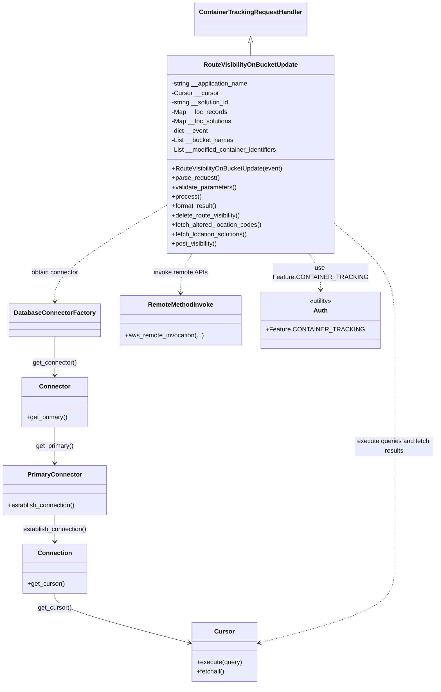

# Diagram: container_tracking_core/container_tracking_service/container_tracking_service/api/visibility_grants/reuse_trip_container_route_visibility.py

> Auto-generated by Obscura crawlers

## Mermaid

### SVG

<svg id="container" width="1077.65234375" xmlns="http://www.w3.org/2000/svg" class="classDiagram" height="1744" viewBox="0 0 1077.65234375 1744" role="graphics-document document" aria-roledescription="class"><g><defs><marker id="container_class-aggregationStart" class="marker aggregation class" refX="18" refY="7" markerWidth="190" markerHeight="240" orient="auto"><path d="M 18,7 L9,13 L1,7 L9,1 Z"></path></marker></defs><defs><marker id="container_class-aggregationEnd" class="marker aggregation class" refX="1" refY="7" markerWidth="20" markerHeight="28" orient="auto"><path d="M 18,7 L9,13 L1,7 L9,1 Z"></path></marker></defs><defs><marker id="container_class-extensionStart" class="marker extension class" refX="18" refY="7" markerWidth="190" markerHeight="240" orient="auto"><path d="M 1,7 L18,13 V 1 Z"></path></marker></defs><defs><marker id="container_class-extensionEnd" class="marker extension class" refX="1" refY="7" markerWidth="20" markerHeight="28" orient="auto"><path d="M 1,1 V 13 L18,7 Z"></path></marker></defs><defs><marker id="container_class-compositionStart" class="marker composition class" refX="18" refY="7" markerWidth="190" markerHeight="240" orient="auto"><path d="M 18,7 L9,13 L1,7 L9,1 Z"></path></marker></defs><defs><marker id="container_class-compositionEnd" class="marker composition class" refX="1" refY="7" markerWidth="20" markerHeight="28" orient="auto"><path d="M 18,7 L9,13 L1,7 L9,1 Z"></path></marker></defs><defs><marker id="container_class-dependencyStart" class="marker dependency class" refX="6" refY="7" markerWidth="190" markerHeight="240" orient="auto"><path d="M 5,7 L9,13 L1,7 L9,1 Z"></path></marker></defs><defs><marker id="container_class-dependencyEnd" class="marker dependency class" refX="13" refY="7" markerWidth="20" markerHeight="28" orient="auto"><path d="M 18,7 L9,13 L14,7 L9,1 Z"></path></marker></defs><defs><marker id="container_class-lollipopStart" class="marker lollipop class" refX="13" refY="7" markerWidth="190" markerHeight="240" orient="auto"><circle stroke="black" fill="transparent" cx="7" cy="7" r="6"></circle></marker></defs><defs><marker id="container_class-lollipopEnd" class="marker lollipop class" refX="1" refY="7" markerWidth="190" markerHeight="240" orient="auto"><circle stroke="black" fill="transparent" cx="7" cy="7" r="6"></circle></marker></defs><g class="root"><g class="clusters"></g><g class="edgePaths"><path d="M623.697,109.25L623.697,110.542C623.697,111.833,623.697,114.417,623.697,119.875C623.697,125.333,623.697,133.667,623.697,137.833L623.697,142" id="id_ContainerTrackingRequestHandler_RouteVisibilityOnBucketUpdate_1" class="edge-thickness-normal edge-pattern-solid relation" style=";;;" data-edge="true" data-et="edge" data-id="id_ContainerTrackingRequestHandler_RouteVisibilityOnBucketUpdate_1" data-points="W3sieCI6NjIzLjY5NzI2NTYyNSwieSI6OTJ9LHsieCI6NjIzLjY5NzI2NTYyNSwieSI6MTE3fSx7IngiOjYyMy42OTcyNjU2MjUsInkiOjE0Mn1d" marker-start="url(#container_class-extensionStart)"></path><path d="M139.645,858L139.645,869.167C139.645,880.333,139.645,902.667,139.645,919C139.645,935.333,139.645,945.667,139.645,950.833L139.645,956" id="id_DatabaseConnectorFactory_Connector_2" class="edge-thickness-normal edge-pattern-solid relation" style=";;;" data-edge="true" data-et="edge" data-id="id_DatabaseConnectorFactory_Connector_2" data-points="W3sieCI6MTM5LjY0NDUzMTI1LCJ5Ijo4NTh9LHsieCI6MTM5LjY0NDUzMTI1LCJ5Ijo5MjV9LHsieCI6MTM5LjY0NDUzMTI1LCJ5Ijo5NjJ9XQ==" marker-end="url(#container_class-dependencyEnd)"></path><path d="M139.645,1088L139.645,1096.167C139.645,1104.333,139.645,1120.667,139.645,1136C139.645,1151.333,139.645,1165.667,139.645,1172.833L139.645,1180" id="id_Connector_PrimaryConnector_3" class="edge-thickness-normal edge-pattern-solid relation" style=";;;" data-edge="true" data-et="edge" data-id="id_Connector_PrimaryConnector_3" data-points="W3sieCI6MTM5LjY0NDUzMTI1LCJ5IjoxMDg4fSx7IngiOjEzOS42NDQ1MzEyNSwieSI6MTEzN30seyJ4IjoxMzkuNjQ0NTMxMjUsInkiOjExODZ9XQ==" marker-end="url(#container_class-dependencyEnd)"></path><path d="M139.645,1312L139.645,1318.167C139.645,1324.333,139.645,1336.667,139.645,1348C139.645,1359.333,139.645,1369.667,139.645,1374.833L139.645,1380" id="id_PrimaryConnector_Connection_4" class="edge-thickness-normal edge-pattern-solid relation" style=";;;" data-edge="true" data-et="edge" data-id="id_PrimaryConnector_Connection_4" data-points="W3sieCI6MTM5LjY0NDUzMTI1LCJ5IjoxMzEyfSx7IngiOjEzOS42NDQ1MzEyNSwieSI6MTM0OX0seyJ4IjoxMzkuNjQ0NTMxMjUsInkiOjEzODZ9XQ==" marker-end="url(#container_class-dependencyEnd)"></path><path d="M139.645,1512L139.645,1518.167C139.645,1524.333,139.645,1536.667,194.19,1557.554C248.736,1578.441,357.827,1607.882,412.373,1622.603L466.918,1637.324" id="id_Connection_Cursor_5" class="edge-thickness-normal edge-pattern-solid relation" style=";;;" data-edge="true" data-et="edge" data-id="id_Connection_Cursor_5" data-points="W3sieCI6MTM5LjY0NDUzMTI1LCJ5IjoxNTEyfSx7IngiOjEzOS42NDQ1MzEyNSwieSI6MTU0OX0seyJ4Ijo0NzIuNzEwOTM3NSwieSI6MTYzOC44ODY5NTUxMzAzMTd9XQ==" marker-end="url(#container_class-dependencyEnd)"></path><path d="M411.404,526.011L366.111,554.176C320.818,582.341,230.231,638.67,184.938,679.002C139.645,719.333,139.645,743.667,139.645,755.833L139.645,768" id="id_RouteVisibilityOnBucketUpdate_DatabaseConnectorFactory_6" class="edge-thickness-normal edge-pattern-dashed relation" style=";;;" data-edge="true" data-et="edge" data-id="id_RouteVisibilityOnBucketUpdate_DatabaseConnectorFactory_6" data-points="W3sieCI6NDExLjQwNDI5Njg3NSwieSI6NTI2LjAxMDc4OTQzNjUyMDN9LHsieCI6MTM5LjY0NDUzMTI1LCJ5Ijo2OTV9LHsieCI6MTM5LjY0NDUzMTI1LCJ5Ijo3NzR9XQ==" marker-end="url(#container_class-dependencyEnd)"></path><path d="M480.363,646L475.718,654.167C471.073,662.333,461.782,678.667,457.137,695.5C452.492,712.333,452.492,729.667,452.492,738.333L452.492,747" id="id_RouteVisibilityOnBucketUpdate_RemoteMethodInvoke_7" class="edge-thickness-normal edge-pattern-dashed relation" style=";;;" data-edge="true" data-et="edge" data-id="id_RouteVisibilityOnBucketUpdate_RemoteMethodInvoke_7" data-points="W3sieCI6NDgwLjM2Mjc4MTYxMzM3MjE0LCJ5Ijo2NDZ9LHsieCI6NDUyLjQ5MjE4NzUsInkiOjY5NX0seyJ4Ijo0NTIuNDkyMTg3NSwieSI6NzUzfV0=" marker-end="url(#container_class-dependencyEnd)"></path><path d="M767.032,646L771.677,654.167C776.322,662.333,785.612,678.667,790.257,694C794.902,709.333,794.902,723.667,794.902,730.833L794.902,738" id="id_RouteVisibilityOnBucketUpdate_Auth_8" class="edge-thickness-normal edge-pattern-dashed relation" style=";;;" data-edge="true" data-et="edge" data-id="id_RouteVisibilityOnBucketUpdate_Auth_8" data-points="W3sieCI6NzY3LjAzMTc0OTYzNjYyNzksInkiOjY0Nn0seyJ4Ijo3OTQuOTAyMzQzNzUsInkiOjY5NX0seyJ4Ijo3OTQuOTAyMzQzNzUsInkiOjc0NH1d" marker-end="url(#container_class-dependencyEnd)"></path><path d="M835.99,578.707L858.267,598.089C880.544,617.471,925.098,656.236,947.375,695.784C969.652,735.333,969.652,775.667,969.652,814C969.652,852.333,969.652,888.667,969.652,923.5C969.652,958.333,969.652,991.667,969.652,1027C969.652,1062.333,969.652,1099.667,969.652,1137C969.652,1174.333,969.652,1211.667,969.652,1247C969.652,1282.333,969.652,1315.667,969.652,1349C969.652,1382.333,969.652,1415.667,969.652,1449C969.652,1482.333,969.652,1515.667,915.107,1547.054C860.561,1578.441,751.47,1607.882,696.924,1622.603L642.379,1637.324" id="id_RouteVisibilityOnBucketUpdate_Cursor_9" class="edge-thickness-normal edge-pattern-dashed relation" style=";;;" data-edge="true" data-et="edge" data-id="id_RouteVisibilityOnBucketUpdate_Cursor_9" data-points="W3sieCI6ODM1Ljk5MDIzNDM3NSwieSI6NTc4LjcwNjU5MjM3MDUzMjJ9LHsieCI6OTY5LjY1MjM0Mzc1LCJ5Ijo2OTV9LHsieCI6OTY5LjY1MjM0Mzc1LCJ5Ijo4MTZ9LHsieCI6OTY5LjY1MjM0Mzc1LCJ5Ijo5MjV9LHsieCI6OTY5LjY1MjM0Mzc1LCJ5IjoxMDI1fSx7IngiOjk2OS42NTIzNDM3NSwieSI6MTEzN30seyJ4Ijo5NjkuNjUyMzQzNzUsInkiOjEyNDl9LHsieCI6OTY5LjY1MjM0Mzc1LCJ5IjoxMzQ5fSx7IngiOjk2OS42NTIzNDM3NSwieSI6MTQ0OX0seyJ4Ijo5NjkuNjUyMzQzNzUsInkiOjE1NDl9LHsieCI6NjM2LjU4NTkzNzUsInkiOjE2MzguODg2OTU1MTMwMzE3fV0=" marker-end="url(#container_class-dependencyEnd)"></path></g><g class="edgeLabels"><g class="edgeLabel"><g class="label" data-id="id_ContainerTrackingRequestHandler_RouteVisibilityOnBucketUpdate_1" transform="translate(0, 0)"><foreignObject width="0" height="0">

</foreignObject></g></g><g class="edgeLabel" transform="translate(139.64453125, 925)"><g class="label" data-id="id_DatabaseConnectorFactory_Connector_2" transform="translate(-56.890625, -12)"><foreignObject width="113.78125" height="24">

get_connector()

</foreignObject></g></g><g class="edgeLabel" transform="translate(139.64453125, 1137)"><g class="label" data-id="id_Connector_PrimaryConnector_3" transform="translate(-48.953125, -12)"><foreignObject width="97.90625" height="24">

get_primary()

</foreignObject></g></g><g class="edgeLabel" transform="translate(139.64453125, 1349)"><g class="label" data-id="id_PrimaryConnector_Connection_4" transform="translate(-82.640625, -12)"><foreignObject width="165.28125" height="24">

establish_connection()

</foreignObject></g></g><g class="edgeLabel" transform="translate(139.64453125, 1549)"><g class="label" data-id="id_Connection_Cursor_5" transform="translate(-43.328125, -12)"><foreignObject width="86.65625" height="24">

get_cursor()

</foreignObject></g></g><g class="edgeLabel" transform="translate(139.64453125, 695)"><g class="label" data-id="id_RouteVisibilityOnBucketUpdate_DatabaseConnectorFactory_6" transform="translate(-62.1015625, -12)"><foreignObject width="124.203125" height="24">

obtain connector

</foreignObject></g></g><g class="edgeLabel" transform="translate(452.4921875, 695)"><g class="label" data-id="id_RouteVisibilityOnBucketUpdate_RemoteMethodInvoke_7" transform="translate(-69.28125, -12)"><foreignObject width="138.5625" height="24">

invoke remote APIs

</foreignObject></g></g><g class="edgeLabel" transform="translate(794.90234375, 695)"><g class="label" data-id="id_RouteVisibilityOnBucketUpdate_Auth_8" transform="translate(-108.6015625, -24)"><foreignObject width="217.203125" height="48">

use Feature.CONTAINER_TRACKING

</foreignObject></g></g><g class="edgeLabel" transform="translate(969.65234375, 1137)"><g class="label" data-id="id_RouteVisibilityOnBucketUpdate_Cursor_9" transform="translate(-100, -24)"><foreignObject width="200" height="48">

execute queries and fetch results

</foreignObject></g></g></g><g class="nodes"><g class="node default" id="classId-RouteVisibilityOnBucketUpdate-0" transform="translate(623.697265625, 394)"><g class="basic label-container"><path d="M-212.29296875 -252 L212.29296875 -252 L212.29296875 252 L-212.29296875 252" stroke="none" stroke-width="0" fill="#ECECFF" style=""></path><path d="M-212.29296875 -252 C-102.95541744611668 -252, 6.3821338577666324 -252, 212.29296875 -252 M-212.29296875 -252 C-120.2683137169036 -252, -28.24365868380721 -252, 212.29296875 -252 M212.29296875 -252 C212.29296875 -54.583184753308075, 212.29296875 142.83363049338385, 212.29296875 252 M212.29296875 -252 C212.29296875 -147.00804392139685, 212.29296875 -42.01608784279367, 212.29296875 252 M212.29296875 252 C45.39116490923402 252, -121.51063893153196 252, -212.29296875 252 M212.29296875 252 C123.00966359186467 252, 33.72635843372933 252, -212.29296875 252 M-212.29296875 252 C-212.29296875 52.350746802248835, -212.29296875 -147.29850639550233, -212.29296875 -252 M-212.29296875 252 C-212.29296875 82.28001674352882, -212.29296875 -87.43996651294236, -212.29296875 -252" stroke="#9370DB" stroke-width="1.3" fill="none" stroke-dasharray="0 0" style=""></path></g><g class="annotation-group text" transform="translate(0, -228)"></g><g class="label-group text" transform="translate(-115.0546875, -228)"><g class="label" style="font-weight: bolder" transform="translate(0,-12)"><foreignObject width="230.109375" height="24">

RouteVisibilityOnBucketUpdate

</foreignObject></g></g><g class="members-group text" transform="translate(-200.29296875, -180)"><g class="label" style="" transform="translate(0,-12)"><foreignObject width="199.4375" height="24">

-string __application_name

</foreignObject></g><g class="label" style="" transform="translate(0,12)"><foreignObject width="119.515625" height="24">

-Cursor __cursor

</foreignObject></g><g class="label" style="" transform="translate(0,36)"><foreignObject width="151.03125" height="24">

-string __solution_id

</foreignObject></g><g class="label" style="" transform="translate(0,60)"><foreignObject width="141.421875" height="24">

-Map __loc_records

</foreignObject></g><g class="label" style="" transform="translate(0,84)"><foreignObject width="154.890625" height="24">

-Map __loc_solutions

</foreignObject></g><g class="label" style="" transform="translate(0,108)"><foreignObject width="94.703125" height="24">

-dict __event

</foreignObject></g><g class="label" style="" transform="translate(0,132)"><foreignObject width="158.21875" height="24">

-List __bucket_names

</foreignObject></g><g class="label" style="" transform="translate(0,156)"><foreignObject width="275.5625" height="24">

-List __modified_container_identifiers

</foreignObject></g></g><g class="methods-group text" transform="translate(-200.29296875, 36)"><g class="label" style="" transform="translate(0,-12)"><foreignObject width="285.53125" height="24">

+RouteVisibilityOnBucketUpdate(event)

</foreignObject></g><g class="label" style="" transform="translate(0,12)"><foreignObject width="121.796875" height="24">

+parse_request()

</foreignObject></g><g class="label" style="" transform="translate(0,36)"><foreignObject width="166.546875" height="24">

+validate_parameters()

</foreignObject></g><g class="label" style="" transform="translate(0,60)"><foreignObject width="73.734375" height="24">

+process()

</foreignObject></g><g class="label" style="" transform="translate(0,84)"><foreignObject width="117.015625" height="24">

+format_result()

</foreignObject></g><g class="label" style="" transform="translate(0,108)"><foreignObject width="179.515625" height="24">

+delete_route_visibility()

</foreignObject></g><g class="label" style="" transform="translate(0,132)"><foreignObject width="231.8125" height="24">

+fetch_altered_location_codes()

</foreignObject></g><g class="label" style="" transform="translate(0,156)"><foreignObject width="197.53125" height="24">

+fetch_location_solutions()

</foreignObject></g><g class="label" style="" transform="translate(0,180)"><foreignObject width="119.453125" height="24">

+post_visibility()

</foreignObject></g></g><g class="divider" style=""><path d="M-212.29296875 -204 C-109.357590845348 -204, -6.422212940695999 -204, 212.29296875 -204 M-212.29296875 -204 C-90.82909466153211 -204, 30.63477942693578 -204, 212.29296875 -204" stroke="#9370DB" stroke-width="1.3" fill="none" stroke-dasharray="0 0" style=""></path></g><g class="divider" style=""><path d="M-212.29296875 12 C-68.01906576112162 12, 76.25483722775675 12, 212.29296875 12 M-212.29296875 12 C-104.58167909769186 12, 3.129610554616278 12, 212.29296875 12" stroke="#9370DB" stroke-width="1.3" fill="none" stroke-dasharray="0 0" style=""></path></g></g><g class="node default" id="classId-ContainerTrackingRequestHandler-1" transform="translate(623.697265625, 50)"><g class="basic label-container"><path d="M-137.5859375 -42 L137.5859375 -42 L137.5859375 42 L-137.5859375 42" stroke="none" stroke-width="0" fill="#ECECFF" style=""></path><path d="M-137.5859375 -42 C-50.207725437304376 -42, 37.17048662539125 -42, 137.5859375 -42 M-137.5859375 -42 C-29.883494654818506 -42, 77.81894819036299 -42, 137.5859375 -42 M137.5859375 -42 C137.5859375 -13.792400574870623, 137.5859375 14.415198850258754, 137.5859375 42 M137.5859375 -42 C137.5859375 -16.059112677918527, 137.5859375 9.881774644162945, 137.5859375 42 M137.5859375 42 C71.81153118969874 42, 6.037124879397481 42, -137.5859375 42 M137.5859375 42 C57.05076773448823 42, -23.484402031023535 42, -137.5859375 42 M-137.5859375 42 C-137.5859375 9.958899572244874, -137.5859375 -22.08220085551025, -137.5859375 -42 M-137.5859375 42 C-137.5859375 22.998428402079718, -137.5859375 3.9968568041594352, -137.5859375 -42" stroke="#9370DB" stroke-width="1.3" fill="none" stroke-dasharray="0 0" style=""></path></g><g class="annotation-group text" transform="translate(0, -18)"></g><g class="label-group text" transform="translate(-125.5859375, -18)"><g class="label" style="font-weight: bolder" transform="translate(0,-12)"><foreignObject width="251.171875" height="24">

ContainerTrackingRequestHandler

</foreignObject></g></g><g class="members-group text" transform="translate(-125.5859375, 30)"></g><g class="methods-group text" transform="translate(-125.5859375, 60)"></g><g class="divider" style=""><path d="M-137.5859375 6 C-66.05972513505536 6, 5.466487229889282 6, 137.5859375 6 M-137.5859375 6 C-42.81685451916927 6, 51.95222846166146 6, 137.5859375 6" stroke="#9370DB" stroke-width="1.3" fill="none" stroke-dasharray="0 0" style=""></path></g><g class="divider" style=""><path d="M-137.5859375 24 C-53.88130726100519 24, 29.82332297798962 24, 137.5859375 24 M-137.5859375 24 C-79.09635295443641 24, -20.60676840887281 24, 137.5859375 24" stroke="#9370DB" stroke-width="1.3" fill="none" stroke-dasharray="0 0" style=""></path></g></g><g class="node default" id="classId-DatabaseConnectorFactory-2" transform="translate(139.64453125, 816)"><g class="basic label-container"><path d="M-110.1875 -42 L110.1875 -42 L110.1875 42 L-110.1875 42" stroke="none" stroke-width="0" fill="#ECECFF" style=""></path><path d="M-110.1875 -42 C-51.03825862714105 -42, 8.110982745717905 -42, 110.1875 -42 M-110.1875 -42 C-44.66158610077815 -42, 20.864327798443696 -42, 110.1875 -42 M110.1875 -42 C110.1875 -19.655700457994342, 110.1875 2.688599084011315, 110.1875 42 M110.1875 -42 C110.1875 -9.628751687717546, 110.1875 22.742496624564907, 110.1875 42 M110.1875 42 C44.357383918884935 42, -21.47273216223013 42, -110.1875 42 M110.1875 42 C32.65950301518846 42, -44.868493969623074 42, -110.1875 42 M-110.1875 42 C-110.1875 18.0417328249438, -110.1875 -5.9165343501124, -110.1875 -42 M-110.1875 42 C-110.1875 20.848900684236455, -110.1875 -0.3021986315270908, -110.1875 -42" stroke="#9370DB" stroke-width="1.3" fill="none" stroke-dasharray="0 0" style=""></path></g><g class="annotation-group text" transform="translate(0, -18)"></g><g class="label-group text" transform="translate(-98.1875, -18)"><g class="label" style="font-weight: bolder" transform="translate(0,-12)"><foreignObject width="196.375" height="24">

DatabaseConnectorFactory

</foreignObject></g></g><g class="members-group text" transform="translate(-98.1875, 30)"></g><g class="methods-group text" transform="translate(-98.1875, 60)"></g><g class="divider" style=""><path d="M-110.1875 6 C-51.317663886597934 6, 7.552172226804132 6, 110.1875 6 M-110.1875 6 C-40.96315407095253 6, 28.261191858094946 6, 110.1875 6" stroke="#9370DB" stroke-width="1.3" fill="none" stroke-dasharray="0 0" style=""></path></g><g class="divider" style=""><path d="M-110.1875 24 C-62.68015434945256 24, -15.172808698905115 24, 110.1875 24 M-110.1875 24 C-40.87876246941573 24, 28.429975061168534 24, 110.1875 24" stroke="#9370DB" stroke-width="1.3" fill="none" stroke-dasharray="0 0" style=""></path></g></g><g class="node default" id="classId-Connector-3" transform="translate(139.64453125, 1025)"><g class="basic label-container"><path d="M-83.65625 -63 L83.65625 -63 L83.65625 63 L-83.65625 63" stroke="none" stroke-width="0" fill="#ECECFF" style=""></path><path d="M-83.65625 -63 C-45.03688811791391 -63, -6.417526235827822 -63, 83.65625 -63 M-83.65625 -63 C-30.22708076304839 -63, 23.202088473903217 -63, 83.65625 -63 M83.65625 -63 C83.65625 -29.895647106271, 83.65625 3.208705787458001, 83.65625 63 M83.65625 -63 C83.65625 -20.164820300902278, 83.65625 22.670359398195444, 83.65625 63 M83.65625 63 C20.186367131405966 63, -43.28351573718807 63, -83.65625 63 M83.65625 63 C35.888098725493094 63, -11.880052549013811 63, -83.65625 63 M-83.65625 63 C-83.65625 25.21912979136556, -83.65625 -12.56174041726888, -83.65625 -63 M-83.65625 63 C-83.65625 32.72765908744496, -83.65625 2.455318174889925, -83.65625 -63" stroke="#9370DB" stroke-width="1.3" fill="none" stroke-dasharray="0 0" style=""></path></g><g class="annotation-group text" transform="translate(0, -39)"></g><g class="label-group text" transform="translate(-37.421875, -39)"><g class="label" style="font-weight: bolder" transform="translate(0,-12)"><foreignObject width="74.84375" height="24">

Connector

</foreignObject></g></g><g class="members-group text" transform="translate(-71.65625, 9)"></g><g class="methods-group text" transform="translate(-71.65625, 39)"><g class="label" style="" transform="translate(0,-12)"><foreignObject width="105.890625" height="24">

+get_primary()

</foreignObject></g></g><g class="divider" style=""><path d="M-83.65625 -15 C-22.863751150221574 -15, 37.92874769955685 -15, 83.65625 -15 M-83.65625 -15 C-47.582139768590444 -15, -11.508029537180889 -15, 83.65625 -15" stroke="#9370DB" stroke-width="1.3" fill="none" stroke-dasharray="0 0" style=""></path></g><g class="divider" style=""><path d="M-83.65625 9 C-27.304139151520396 9, 29.04797169695921 9, 83.65625 9 M-83.65625 9 C-19.06938116398969 9, 45.51748767202062 9, 83.65625 9" stroke="#9370DB" stroke-width="1.3" fill="none" stroke-dasharray="0 0" style=""></path></g></g><g class="node default" id="classId-PrimaryConnector-4" transform="translate(139.64453125, 1249)"><g class="basic label-container"><path d="M-131.64453125 -63 L131.64453125 -63 L131.64453125 63 L-131.64453125 63" stroke="none" stroke-width="0" fill="#ECECFF" style=""></path><path d="M-131.64453125 -63 C-70.33944855581298 -63, -9.034365861625957 -63, 131.64453125 -63 M-131.64453125 -63 C-70.762794645412 -63, -9.881058040824001 -63, 131.64453125 -63 M131.64453125 -63 C131.64453125 -18.519918915209153, 131.64453125 25.960162169581693, 131.64453125 63 M131.64453125 -63 C131.64453125 -36.13282704821321, 131.64453125 -9.265654096426417, 131.64453125 63 M131.64453125 63 C72.97903966662552 63, 14.31354808325105 63, -131.64453125 63 M131.64453125 63 C58.05632877406501 63, -15.531873701869984 63, -131.64453125 63 M-131.64453125 63 C-131.64453125 21.973585346989246, -131.64453125 -19.052829306021508, -131.64453125 -63 M-131.64453125 63 C-131.64453125 33.283671445490846, -131.64453125 3.567342890981692, -131.64453125 -63" stroke="#9370DB" stroke-width="1.3" fill="none" stroke-dasharray="0 0" style=""></path></g><g class="annotation-group text" transform="translate(0, -39)"></g><g class="label-group text" transform="translate(-66.0234375, -39)"><g class="label" style="font-weight: bolder" transform="translate(0,-12)"><foreignObject width="132.046875" height="24">

PrimaryConnector

</foreignObject></g></g><g class="members-group text" transform="translate(-119.64453125, 9)"></g><g class="methods-group text" transform="translate(-119.64453125, 39)"><g class="label" style="" transform="translate(0,-12)"><foreignObject width="173.265625" height="24">

+establish_connection()

</foreignObject></g></g><g class="divider" style=""><path d="M-131.64453125 -15 C-45.75871312353618 -15, 40.127105002927635 -15, 131.64453125 -15 M-131.64453125 -15 C-29.594247223327102 -15, 72.4560368033458 -15, 131.64453125 -15" stroke="#9370DB" stroke-width="1.3" fill="none" stroke-dasharray="0 0" style=""></path></g><g class="divider" style=""><path d="M-131.64453125 9 C-64.24975880619384 9, 3.1450136376123226 9, 131.64453125 9 M-131.64453125 9 C-61.67069065171178 9, 8.30314994657644 9, 131.64453125 9" stroke="#9370DB" stroke-width="1.3" fill="none" stroke-dasharray="0 0" style=""></path></g></g><g class="node default" id="classId-Connection-5" transform="translate(139.64453125, 1449)"><g class="basic label-container"><path d="M-79.93359375 -63 L79.93359375 -63 L79.93359375 63 L-79.93359375 63" stroke="none" stroke-width="0" fill="#ECECFF" style=""></path><path d="M-79.93359375 -63 C-42.747768590558245 -63, -5.5619434311164895 -63, 79.93359375 -63 M-79.93359375 -63 C-21.52820382528631 -63, 36.87718609942738 -63, 79.93359375 -63 M79.93359375 -63 C79.93359375 -31.000802683503384, 79.93359375 0.9983946329932323, 79.93359375 63 M79.93359375 -63 C79.93359375 -26.03591778294301, 79.93359375 10.928164434113981, 79.93359375 63 M79.93359375 63 C16.086651627443985 63, -47.76029049511203 63, -79.93359375 63 M79.93359375 63 C23.508108228747922 63, -32.917377292504156 63, -79.93359375 63 M-79.93359375 63 C-79.93359375 14.462487071557426, -79.93359375 -34.07502585688515, -79.93359375 -63 M-79.93359375 63 C-79.93359375 33.17080341374324, -79.93359375 3.341606827486487, -79.93359375 -63" stroke="#9370DB" stroke-width="1.3" fill="none" stroke-dasharray="0 0" style=""></path></g><g class="annotation-group text" transform="translate(0, -39)"></g><g class="label-group text" transform="translate(-41.2265625, -39)"><g class="label" style="font-weight: bolder" transform="translate(0,-12)"><foreignObject width="82.453125" height="24">

Connection

</foreignObject></g></g><g class="members-group text" transform="translate(-67.93359375, 9)"></g><g class="methods-group text" transform="translate(-67.93359375, 39)"><g class="label" style="" transform="translate(0,-12)"><foreignObject width="94.640625" height="24">

+get_cursor()

</foreignObject></g></g><g class="divider" style=""><path d="M-79.93359375 -15 C-32.454701170388184 -15, 15.024191409223633 -15, 79.93359375 -15 M-79.93359375 -15 C-26.524319297383023 -15, 26.884955155233953 -15, 79.93359375 -15" stroke="#9370DB" stroke-width="1.3" fill="none" stroke-dasharray="0 0" style=""></path></g><g class="divider" style=""><path d="M-79.93359375 9 C-27.45034129794773 9, 25.03291115410454 9, 79.93359375 9 M-79.93359375 9 C-39.74443691920479 9, 0.44471991159042545 9, 79.93359375 9" stroke="#9370DB" stroke-width="1.3" fill="none" stroke-dasharray="0 0" style=""></path></g></g><g class="node default" id="classId-Cursor-6" transform="translate(554.6484375, 1661)"><g class="basic label-container"><path d="M-81.9375 -75 L81.9375 -75 L81.9375 75 L-81.9375 75" stroke="none" stroke-width="0" fill="#ECECFF" style=""></path><path d="M-81.9375 -75 C-23.92111163485169 -75, 34.09527673029662 -75, 81.9375 -75 M-81.9375 -75 C-31.001182027781752 -75, 19.935135944436496 -75, 81.9375 -75 M81.9375 -75 C81.9375 -17.748285871610307, 81.9375 39.50342825677939, 81.9375 75 M81.9375 -75 C81.9375 -42.547723900730176, 81.9375 -10.095447801460352, 81.9375 75 M81.9375 75 C32.087669341275145 75, -17.76216131744971 75, -81.9375 75 M81.9375 75 C28.38277961206382 75, -25.171940775872358 75, -81.9375 75 M-81.9375 75 C-81.9375 40.23330678160762, -81.9375 5.466613563215233, -81.9375 -75 M-81.9375 75 C-81.9375 26.815326288932276, -81.9375 -21.369347422135448, -81.9375 -75" stroke="#9370DB" stroke-width="1.3" fill="none" stroke-dasharray="0 0" style=""></path></g><g class="annotation-group text" transform="translate(0, -51)"></g><g class="label-group text" transform="translate(-23.90625, -51)"><g class="label" style="font-weight: bolder" transform="translate(0,-12)"><foreignObject width="47.8125" height="24">

Cursor

</foreignObject></g></g><g class="members-group text" transform="translate(-69.9375, -3)"></g><g class="methods-group text" transform="translate(-69.9375, 27)"><g class="label" style="" transform="translate(0,-12)"><foreignObject width="115.96875" height="24">

+execute(query)

</foreignObject></g><g class="label" style="" transform="translate(0,12)"><foreignObject width="72.515625" height="24">

+fetchall()

</foreignObject></g></g><g class="divider" style=""><path d="M-81.9375 -27 C-33.75243933792305 -27, 14.4326213241539 -27, 81.9375 -27 M-81.9375 -27 C-23.98053365631516 -27, 33.97643268736968 -27, 81.9375 -27" stroke="#9370DB" stroke-width="1.3" fill="none" stroke-dasharray="0 0" style=""></path></g><g class="divider" style=""><path d="M-81.9375 -3 C-28.08037249794633 -3, 25.776755004107343 -3, 81.9375 -3 M-81.9375 -3 C-22.234808337149225 -3, 37.46788332570155 -3, 81.9375 -3" stroke="#9370DB" stroke-width="1.3" fill="none" stroke-dasharray="0 0" style=""></path></g></g><g class="node default" id="classId-RemoteMethodInvoke-7" transform="translate(452.4921875, 816)"><g class="basic label-container"><path d="M-152.66015625 -63 L152.66015625 -63 L152.66015625 63 L-152.66015625 63" stroke="none" stroke-width="0" fill="#ECECFF" style=""></path><path d="M-152.66015625 -63 C-43.93382018327428 -63, 64.79251588345144 -63, 152.66015625 -63 M-152.66015625 -63 C-62.73244943261187 -63, 27.195257384776255 -63, 152.66015625 -63 M152.66015625 -63 C152.66015625 -26.896014667924035, 152.66015625 9.20797066415193, 152.66015625 63 M152.66015625 -63 C152.66015625 -13.82957582635514, 152.66015625 35.34084834728972, 152.66015625 63 M152.66015625 63 C58.761846366859345 63, -35.13646351628131 63, -152.66015625 63 M152.66015625 63 C69.63342180739555 63, -13.3933126352089 63, -152.66015625 63 M-152.66015625 63 C-152.66015625 23.589542165649455, -152.66015625 -15.82091566870109, -152.66015625 -63 M-152.66015625 63 C-152.66015625 18.086682422141223, -152.66015625 -26.826635155717554, -152.66015625 -63" stroke="#9370DB" stroke-width="1.3" fill="none" stroke-dasharray="0 0" style=""></path></g><g class="annotation-group text" transform="translate(0, -39)"></g><g class="label-group text" transform="translate(-80.2578125, -39)"><g class="label" style="font-weight: bolder" transform="translate(0,-12)"><foreignObject width="160.515625" height="24">

RemoteMethodInvoke

</foreignObject></g></g><g class="members-group text" transform="translate(-140.66015625, 9)"></g><g class="methods-group text" transform="translate(-140.66015625, 39)"><g class="label" style="" transform="translate(0,-12)"><foreignObject width="201.0625" height="24">

+aws_remote_invocation(...)

</foreignObject></g></g><g class="divider" style=""><path d="M-152.66015625 -15 C-84.78363274018544 -15, -16.907109230370878 -15, 152.66015625 -15 M-152.66015625 -15 C-46.239332807894286 -15, 60.18149063421143 -15, 152.66015625 -15" stroke="#9370DB" stroke-width="1.3" fill="none" stroke-dasharray="0 0" style=""></path></g><g class="divider" style=""><path d="M-152.66015625 9 C-43.94477063695638 9, 64.77061497608724 9, 152.66015625 9 M-152.66015625 9 C-83.91054950170654 9, -15.160942753413082 9, 152.66015625 9" stroke="#9370DB" stroke-width="1.3" fill="none" stroke-dasharray="0 0" style=""></path></g></g><g class="node default" id="classId-Auth-8" transform="translate(794.90234375, 816)"><g class="basic label-container"><path d="M-139.75 -72 L139.75 -72 L139.75 72 L-139.75 72" stroke="none" stroke-width="0" fill="#ECECFF" style=""></path><path d="M-139.75 -72 C-69.28981444672905 -72, 1.170371106541893 -72, 139.75 -72 M-139.75 -72 C-76.09165358138145 -72, -12.433307162762901 -72, 139.75 -72 M139.75 -72 C139.75 -24.53917030691931, 139.75 22.92165938616138, 139.75 72 M139.75 -72 C139.75 -14.978581768347937, 139.75 42.04283646330413, 139.75 72 M139.75 72 C75.41507698349389 72, 11.08015396698778 72, -139.75 72 M139.75 72 C64.11637482738915 72, -11.517250345221697 72, -139.75 72 M-139.75 72 C-139.75 30.80124799409012, -139.75 -10.397504011819763, -139.75 -72 M-139.75 72 C-139.75 38.435347064624025, -139.75 4.870694129248051, -139.75 -72" stroke="#9370DB" stroke-width="1.3" fill="none" stroke-dasharray="0 0" style=""></path></g><g class="annotation-group text" transform="translate(-30.3125, -48)"><g class="label" style="" transform="translate(0,-12)"><foreignObject width="60.625" height="24">

«utility»

</foreignObject></g></g><g class="label-group text" transform="translate(-17.0078125, -24)"><g class="label" style="font-weight: bolder" transform="translate(0,-12)"><foreignObject width="34.015625" height="24">

Auth

</foreignObject></g></g><g class="members-group text" transform="translate(-127.75, 24)"><g class="label" style="" transform="translate(0,-12)"><foreignObject width="225.1875" height="24">

+Feature.CONTAINER_TRACKING

</foreignObject></g></g><g class="methods-group text" transform="translate(-127.75, 72)"></g><g class="divider" style=""><path d="M-139.75 0 C-36.62106133949993 0, 66.50787732100014 0, 139.75 0 M-139.75 0 C-42.68768849452469 0, 54.374623010950614 0, 139.75 0" stroke="#9370DB" stroke-width="1.3" fill="none" stroke-dasharray="0 0" style=""></path></g><g class="divider" style=""><path d="M-139.75 48 C-77.66833176749586 48, -15.586663534991729 48, 139.75 48 M-139.75 48 C-39.82863556562813 48, 60.092728868743734 48, 139.75 48" stroke="#9370DB" stroke-width="1.3" fill="none" stroke-dasharray="0 0" style=""></path></g></g></g></g></g></svg>
