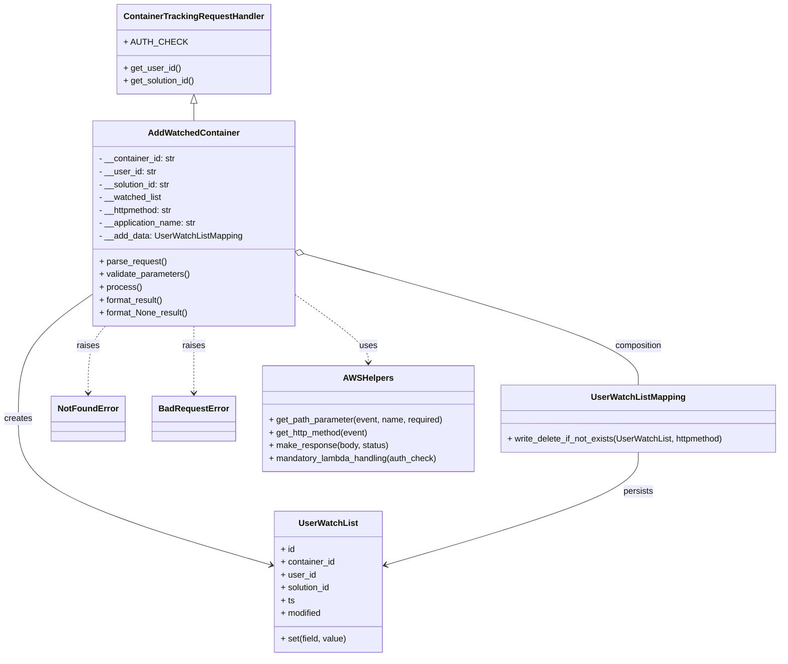

# Diagram: container_tracking_core/container_tracking_service/container_tracking_service/api/watch_list/user_watched_container.py


> Auto-generated by Obscura crawlers

## Diagram 1



### SVG

<svg id="container" width="1448.0078125" xmlns="http://www.w3.org/2000/svg" class="classDiagram" height="1228" viewBox="0 0 1448.0078125 1228" role="graphics-document document" aria-roledescription="class"><style>#container{font-family:"trebuchet ms",verdana,arial,sans-serif;font-size:16px;fill:#333;}@keyframes edge-animation-frame{from{stroke-dashoffset:0;}}@keyframes dash{to{stroke-dashoffset:0;}}#container .edge-animation-slow{stroke-dasharray:9,5!important;stroke-dashoffset:900;animation:dash 50s linear infinite;stroke-linecap:round;}#container .edge-animation-fast{stroke-dasharray:9,5!important;stroke-dashoffset:900;animation:dash 20s linear infinite;stroke-linecap:round;}#container .error-icon{fill:#552222;}#container .error-text{fill:#552222;stroke:#552222;}#container .edge-thickness-normal{stroke-width:1px;}#container .edge-thickness-thick{stroke-width:3.5px;}#container .edge-pattern-solid{stroke-dasharray:0;}#container .edge-thickness-invisible{stroke-width:0;fill:none;}#container .edge-pattern-dashed{stroke-dasharray:3;}#container .edge-pattern-dotted{stroke-dasharray:2;}#container .marker{fill:#333333;stroke:#333333;}#container .marker.cross{stroke:#333333;}#container svg{font-family:"trebuchet ms",verdana,arial,sans-serif;font-size:16px;}#container p{margin:0;}#container g.classGroup text{fill:#9370DB;stroke:none;font-family:"trebuchet ms",verdana,arial,sans-serif;font-size:10px;}#container g.classGroup text .title{font-weight:bolder;}#container .nodeLabel,#container .edgeLabel{color:#131300;}#container .edgeLabel .label rect{fill:#ECECFF;}#container .label text{fill:#131300;}#container .labelBkg{background:#ECECFF;}#container .edgeLabel .label span{background:#ECECFF;}#container .classTitle{font-weight:bolder;}#container .node rect,#container .node circle,#container .node ellipse,#container .node polygon,#container .node path{fill:#ECECFF;stroke:#9370DB;stroke-width:1px;}#container .divider{stroke:#9370DB;stroke-width:1;}#container g.clickable{cursor:pointer;}#container g.classGroup rect{fill:#ECECFF;stroke:#9370DB;}#container g.classGroup line{stroke:#9370DB;stroke-width:1;}#container .classLabel .box{stroke:none;stroke-width:0;fill:#ECECFF;opacity:0.5;}#container .classLabel .label{fill:#9370DB;font-size:10px;}#container .relation{stroke:#333333;stroke-width:1;fill:none;}#container .dashed-line{stroke-dasharray:3;}#container .dotted-line{stroke-dasharray:1 2;}#container #compositionStart,#container .composition{fill:#333333!important;stroke:#333333!important;stroke-width:1;}#container #compositionEnd,#container .composition{fill:#333333!important;stroke:#333333!important;stroke-width:1;}#container #dependencyStart,#container .dependency{fill:#333333!important;stroke:#333333!important;stroke-width:1;}#container #dependencyStart,#container .dependency{fill:#333333!important;stroke:#333333!important;stroke-width:1;}#container #extensionStart,#container .extension{fill:transparent!important;stroke:#333333!important;stroke-width:1;}#container #extensionEnd,#container .extension{fill:transparent!important;stroke:#333333!important;stroke-width:1;}#container #aggregationStart,#container .aggregation{fill:transparent!important;stroke:#333333!important;stroke-width:1;}#container #aggregationEnd,#container .aggregation{fill:transparent!important;stroke:#333333!important;stroke-width:1;}#container #lollipopStart,#container .lollipop{fill:#ECECFF!important;stroke:#333333!important;stroke-width:1;}#container #lollipopEnd,#container .lollipop{fill:#ECECFF!important;stroke:#333333!important;stroke-width:1;}#container .edgeTerminals{font-size:11px;line-height:initial;}#container .classTitleText{text-anchor:middle;font-size:18px;fill:#333;}#container .label-icon{display:inline-block;height:1em;overflow:visible;vertical-align:-0.125em;}#container .node .label-icon path{fill:currentColor;stroke:revert;stroke-width:revert;}#container :root{--mermaid-font-family:"trebuchet ms",verdana,arial,sans-serif;}</style><g><defs><marker id="container_class-aggregationStart" class="marker aggregation class" refX="18" refY="7" markerWidth="190" markerHeight="240" orient="auto"><path d="M 18,7 L9,13 L1,7 L9,1 Z"></path></marker></defs><defs><marker id="container_class-aggregationEnd" class="marker aggregation class" refX="1" refY="7" markerWidth="20" markerHeight="28" orient="auto"><path d="M 18,7 L9,13 L1,7 L9,1 Z"></path></marker></defs><defs><marker id="container_class-extensionStart" class="marker extension class" refX="18" refY="7" markerWidth="190" markerHeight="240" orient="auto"><path d="M 1,7 L18,13 V 1 Z"></path></marker></defs><defs><marker id="container_class-extensionEnd" class="marker extension class" refX="1" refY="7" markerWidth="20" markerHeight="28" orient="auto"><path d="M 1,1 V 13 L18,7 Z"></path></marker></defs><defs><marker id="container_class-compositionStart" class="marker composition class" refX="18" refY="7" markerWidth="190" markerHeight="240" orient="auto"><path d="M 18,7 L9,13 L1,7 L9,1 Z"></path></marker></defs><defs><marker id="container_class-compositionEnd" class="marker composition class" refX="1" refY="7" markerWidth="20" markerHeight="28" orient="auto"><path d="M 18,7 L9,13 L1,7 L9,1 Z"></path></marker></defs><defs><marker id="container_class-dependencyStart" class="marker dependency class" refX="6" refY="7" markerWidth="190" markerHeight="240" orient="auto"><path d="M 5,7 L9,13 L1,7 L9,1 Z"></path></marker></defs><defs><marker id="container_class-dependencyEnd" class="marker dependency class" refX="13" refY="7" markerWidth="20" markerHeight="28" orient="auto"><path d="M 18,7 L9,13 L14,7 L9,1 Z"></path></marker></defs><defs><marker id="container_class-lollipopStart" class="marker lollipop class" refX="13" refY="7" markerWidth="190" markerHeight="240" orient="auto"><circle stroke="black" fill="transparent" cx="7" cy="7" r="6"></circle></marker></defs><defs><marker id="container_class-lollipopEnd" class="marker lollipop class" refX="1" refY="7" markerWidth="190" markerHeight="240" orient="auto"><circle stroke="black" fill="transparent" cx="7" cy="7" r="6"></circle></marker></defs><g class="root"><g class="clusters"></g><g class="edgePaths"><path d="M350.688,193.25L350.688,194.542C350.688,195.833,350.688,198.417,350.688,203.875C350.688,209.333,350.688,217.667,350.688,221.833L350.688,226" id="id_ContainerTrackingRequestHandler_AddWatchedContainer_1" class="edge-thickness-normal edge-pattern-solid relation" style=";;;" data-edge="true" data-et="edge" data-id="id_ContainerTrackingRequestHandler_AddWatchedContainer_1" data-points="W3sieCI6MzUwLjY4NzUsInkiOjE3Nn0seyJ4IjozNTAuNjg3NSwieSI6MjAxfSx7IngiOjM1MC42ODc1LCJ5IjoyMjZ9XQ==" marker-start="url(#container_class-extensionStart)"></path><path d="M554.239,474.133L658.715,502.944C763.192,531.755,972.145,589.378,1076.621,630.355C1181.098,671.333,1181.098,695.667,1181.098,707.833L1181.098,720" id="id_AddWatchedContainer_UserWatchListMapping_2" class="edge-thickness-normal edge-pattern-solid relation" style=";;;" data-edge="true" data-et="edge" data-id="id_AddWatchedContainer_UserWatchListMapping_2" data-points="W3sieCI6NTM3LjYwOTM3NSwieSI6NDY5LjU0Njk0ODI3OTUxMTc1fSx7IngiOjExODEuMDk3NjU2MjUsInkiOjY0N30seyJ4IjoxMTgxLjA5NzY1NjI1LCJ5Ijo3MjB9XQ==" marker-start="url(#container_class-aggregationStart)"></path><path d="M163.766,553.239L142.167,568.865C120.568,584.492,77.37,615.746,55.771,654.04C34.172,692.333,34.172,737.667,34.172,783C34.172,828.333,34.172,873.667,112.131,919.308C190.09,964.949,346.008,1010.898,423.967,1033.873L501.926,1056.848" id="id_AddWatchedContainer_UserWatchList_3" class="edge-thickness-normal edge-pattern-solid relation" style=";;;" data-edge="true" data-et="edge" data-id="id_AddWatchedContainer_UserWatchList_3" data-points="W3sieCI6MTYzLjc2NTYyNSwieSI6NTUzLjIzODUzNDgyNzQ2N30seyJ4IjozNC4xNzE4NzUsInkiOjY0N30seyJ4IjozNC4xNzE4NzUsInkiOjc4M30seyJ4IjozNC4xNzE4NzUsInkiOjkxOX0seyJ4Ijo1MDcuNjgxNjQwNjI1LCJ5IjoxMDU4LjU0MzcyOTMzMDc4NTd9XQ==" marker-end="url(#container_class-dependencyEnd)"></path><path d="M191.543,610L186.432,616.167C181.321,622.333,171.098,634.667,165.986,655.5C160.875,676.333,160.875,705.667,160.875,720.333L160.875,735" id="id_AddWatchedContainer_NotFoundError_4" class="edge-thickness-normal edge-pattern-dashed relation" style=";;;" data-edge="true" data-et="edge" data-id="id_AddWatchedContainer_NotFoundError_4" data-points="W3sieCI6MTkxLjU0MzM5NTE5NjUwNjU0LCJ5Ijo2MTB9LHsieCI6MTYwLjg3NSwieSI6NjQ3fSx7IngiOjE2MC44NzUsInkiOjc0MX1d" marker-end="url(#container_class-dependencyEnd)"></path><path d="M350.688,610L350.688,616.167C350.688,622.333,350.688,634.667,350.688,655.5C350.688,676.333,350.688,705.667,350.688,720.333L350.688,735" id="id_AddWatchedContainer_BadRequestError_5" class="edge-thickness-normal edge-pattern-dashed relation" style=";;;" data-edge="true" data-et="edge" data-id="id_AddWatchedContainer_BadRequestError_5" data-points="W3sieCI6MzUwLjY4NzUsInkiOjYxMH0seyJ4IjozNTAuNjg3NSwieSI6NjQ3fSx7IngiOjM1MC42ODc1LCJ5Ijo3NDF9XQ==" marker-end="url(#container_class-dependencyEnd)"></path><path d="M537.609,550.568L560.271,566.64C582.932,582.712,628.255,614.856,650.917,636.095C673.578,657.333,673.578,667.667,673.578,672.833L673.578,678" id="id_AddWatchedContainer_AWSHelpers_6" class="edge-thickness-normal edge-pattern-dashed relation" style=";;;" data-edge="true" data-et="edge" data-id="id_AddWatchedContainer_AWSHelpers_6" data-points="W3sieCI6NTM3LjYwOTM3NSwieSI6NTUwLjU2ODQ0OTA2ODQ3MzJ9LHsieCI6NjczLjU3ODEyNSwieSI6NjQ3fSx7IngiOjY3My41NzgxMjUsInkiOjY4NH1d" marker-end="url(#container_class-dependencyEnd)"></path><path d="M1181.098,846L1181.098,858.167C1181.098,870.333,1181.098,894.667,1103.139,929.808C1025.179,964.949,869.261,1010.898,791.302,1033.873L713.343,1056.848" id="id_UserWatchListMapping_UserWatchList_7" class="edge-thickness-normal edge-pattern-solid relation" style=";;;" data-edge="true" data-et="edge" data-id="id_UserWatchListMapping_UserWatchList_7" data-points="W3sieCI6MTE4MS4wOTc2NTYyNSwieSI6ODQ2fSx7IngiOjExODEuMDk3NjU2MjUsInkiOjkxOX0seyJ4Ijo3MDcuNTg3ODkwNjI1LCJ5IjoxMDU4LjU0MzcyOTMzMDc4NTd9XQ==" marker-end="url(#container_class-dependencyEnd)"></path></g><g class="edgeLabels"><g class="edgeLabel"><g class="label" data-id="id_ContainerTrackingRequestHandler_AddWatchedContainer_1" transform="translate(0, 0)"><foreignObject width="0" height="0"><div xmlns="http://www.w3.org/1999/xhtml" class="labelBkg" style="display: table-cell; white-space: nowrap; line-height: 1.5; max-width: 200px; text-align: center;"><span class="edgeLabel"></span></div></foreignObject></g></g><g class="edgeLabel" transform="translate(1181.09765625, 647)"><g class="label" data-id="id_AddWatchedContainer_UserWatchListMapping_2" transform="translate(-45.1171875, -12)"><foreignObject width="90.234375" height="24"><div xmlns="http://www.w3.org/1999/xhtml" class="labelBkg" style="display: table-cell; white-space: nowrap; line-height: 1.5; max-width: 200px; text-align: center;"><span class="edgeLabel"><p>composition</p></span></div></foreignObject></g></g><g class="edgeLabel" transform="translate(34.171875, 783)"><g class="label" data-id="id_AddWatchedContainer_UserWatchList_3" transform="translate(-26.171875, -12)"><foreignObject width="52.34375" height="24"><div xmlns="http://www.w3.org/1999/xhtml" class="labelBkg" style="display: table-cell; white-space: nowrap; line-height: 1.5; max-width: 200px; text-align: center;"><span class="edgeLabel"><p>creates</p></span></div></foreignObject></g></g><g class="edgeLabel" transform="translate(160.875, 647)"><g class="label" data-id="id_AddWatchedContainer_NotFoundError_4" transform="translate(-21.25, -12)"><foreignObject width="42.5" height="24"><div xmlns="http://www.w3.org/1999/xhtml" class="labelBkg" style="display: table-cell; white-space: nowrap; line-height: 1.5; max-width: 200px; text-align: center;"><span class="edgeLabel"><p>raises</p></span></div></foreignObject></g></g><g class="edgeLabel" transform="translate(350.6875, 647)"><g class="label" data-id="id_AddWatchedContainer_BadRequestError_5" transform="translate(-21.25, -12)"><foreignObject width="42.5" height="24"><div xmlns="http://www.w3.org/1999/xhtml" class="labelBkg" style="display: table-cell; white-space: nowrap; line-height: 1.5; max-width: 200px; text-align: center;"><span class="edgeLabel"><p>raises</p></span></div></foreignObject></g></g><g class="edgeLabel" transform="translate(673.578125, 647)"><g class="label" data-id="id_AddWatchedContainer_AWSHelpers_6" transform="translate(-16.4921875, -12)"><foreignObject width="32.984375" height="24"><div xmlns="http://www.w3.org/1999/xhtml" class="labelBkg" style="display: table-cell; white-space: nowrap; line-height: 1.5; max-width: 200px; text-align: center;"><span class="edgeLabel"><p>uses</p></span></div></foreignObject></g></g><g class="edgeLabel" transform="translate(1181.09765625, 919)"><g class="label" data-id="id_UserWatchListMapping_UserWatchList_7" transform="translate(-28.4375, -12)"><foreignObject width="56.875" height="24"><div xmlns="http://www.w3.org/1999/xhtml" class="labelBkg" style="display: table-cell; white-space: nowrap; line-height: 1.5; max-width: 200px; text-align: center;"><span class="edgeLabel"><p>persists</p></span></div></foreignObject></g></g></g><g class="nodes"><g class="node default" id="classId-AddWatchedContainer-0" transform="translate(350.6875, 418)"><g class="basic label-container"><path d="M-186.921875 -192 L186.921875 -192 L186.921875 192 L-186.921875 192" stroke="none" stroke-width="0" fill="#ECECFF" style=""></path><path d="M-186.921875 -192 C-42.87411610413898 -192, 101.17364279172205 -192, 186.921875 -192 M-186.921875 -192 C-80.12525500246409 -192, 26.671364995071826 -192, 186.921875 -192 M186.921875 -192 C186.921875 -106.75164576707718, 186.921875 -21.503291534154357, 186.921875 192 M186.921875 -192 C186.921875 -110.89123008001742, 186.921875 -29.782460160034844, 186.921875 192 M186.921875 192 C105.66533605093852 192, 24.40879710187704 192, -186.921875 192 M186.921875 192 C98.56670197350053 192, 10.211528947001057 192, -186.921875 192 M-186.921875 192 C-186.921875 45.230662546127064, -186.921875 -101.53867490774587, -186.921875 -192 M-186.921875 192 C-186.921875 47.15257598207725, -186.921875 -97.6948480358455, -186.921875 -192" stroke="#9370DB" stroke-width="1.3" fill="none" stroke-dasharray="0 0" style=""></path></g><g class="annotation-group text" transform="translate(0, -168)"></g><g class="label-group text" transform="translate(-81.453125, -168)"><g class="label" style="font-weight: bolder" transform="translate(0,-12)"><foreignObject width="162.90625" height="24"><div xmlns="http://www.w3.org/1999/xhtml" style="display: table-cell; white-space: nowrap; line-height: 1.5; max-width: 212px; text-align: center;"><span class="nodeLabel markdown-node-label" style=""><p>AddWatchedContainer</p></span></div></foreignObject></g></g><g class="members-group text" transform="translate(-174.921875, -120)"><g class="label" style="" transform="translate(0,-12)"><foreignObject width="144.6875" height="24"><div xmlns="http://www.w3.org/1999/xhtml" style="display: table-cell; white-space: nowrap; line-height: 1.5; max-width: 203px; text-align: center;"><span class="nodeLabel markdown-node-label" style=""><p>- __container_id: str</p></span></div></foreignObject></g><g class="label" style="" transform="translate(0,12)"><foreignObject width="107.15625" height="24"><div xmlns="http://www.w3.org/1999/xhtml" style="display: table-cell; white-space: nowrap; line-height: 1.5; max-width: 165px; text-align: center;"><span class="nodeLabel markdown-node-label" style=""><p>- __user_id: str</p></span></div></foreignObject></g><g class="label" style="" transform="translate(0,36)"><foreignObject width="136.90625" height="24"><div xmlns="http://www.w3.org/1999/xhtml" style="display: table-cell; white-space: nowrap; line-height: 1.5; max-width: 195px; text-align: center;"><span class="nodeLabel markdown-node-label" style=""><p>- __solution_id: str</p></span></div></foreignObject></g><g class="label" style="" transform="translate(0,60)"><foreignObject width="118.296875" height="24"><div xmlns="http://www.w3.org/1999/xhtml" style="display: table-cell; white-space: nowrap; line-height: 1.5; max-width: 176px; text-align: center;"><span class="nodeLabel markdown-node-label" style=""><p>- __watched_list</p></span></div></foreignObject></g><g class="label" style="" transform="translate(0,84)"><foreignObject width="141.609375" height="24"><div xmlns="http://www.w3.org/1999/xhtml" style="display: table-cell; white-space: nowrap; line-height: 1.5; max-width: 200px; text-align: center;"><span class="nodeLabel markdown-node-label" style=""><p>- __httpmethod: str</p></span></div></foreignObject></g><g class="label" style="" transform="translate(0,108)"><foreignObject width="185.296875" height="24"><div xmlns="http://www.w3.org/1999/xhtml" style="display: table-cell; white-space: nowrap; line-height: 1.5; max-width: 243px; text-align: center;"><span class="nodeLabel markdown-node-label" style=""><p>- __application_name: str</p></span></div></foreignObject></g><g class="label" style="" transform="translate(0,132)"><foreignObject width="268.390625" height="24"><div xmlns="http://www.w3.org/1999/xhtml" style="display: table-cell; white-space: nowrap; line-height: 1.5; max-width: 326px; text-align: center;"><span class="nodeLabel markdown-node-label" style=""><p>- __add_data: UserWatchListMapping</p></span></div></foreignObject></g></g><g class="methods-group text" transform="translate(-174.921875, 72)"><g class="label" style="" transform="translate(0,-12)"><foreignObject width="126.046875" height="24"><div xmlns="http://www.w3.org/1999/xhtml" style="display: table-cell; white-space: nowrap; line-height: 1.5; max-width: 183px; text-align: center;"><span class="nodeLabel markdown-node-label" style=""><p>+ parse_request()</p></span></div></foreignObject></g><g class="label" style="" transform="translate(0,12)"><foreignObject width="170.953125" height="24"><div xmlns="http://www.w3.org/1999/xhtml" style="display: table-cell; white-space: nowrap; line-height: 1.5; max-width: 228px; text-align: center;"><span class="nodeLabel markdown-node-label" style=""><p>+ validate_parameters()</p></span></div></foreignObject></g><g class="label" style="" transform="translate(0,36)"><foreignObject width="77.96875" height="24"><div xmlns="http://www.w3.org/1999/xhtml" style="display: table-cell; white-space: nowrap; line-height: 1.5; max-width: 135px; text-align: center;"><span class="nodeLabel markdown-node-label" style=""><p>+ process()</p></span></div></foreignObject></g><g class="label" style="" transform="translate(0,60)"><foreignObject width="121.5" height="24"><div xmlns="http://www.w3.org/1999/xhtml" style="display: table-cell; white-space: nowrap; line-height: 1.5; max-width: 179px; text-align: center;"><span class="nodeLabel markdown-node-label" style=""><p>+ format_result()</p></span></div></foreignObject></g><g class="label" style="" transform="translate(0,84)"><foreignObject width="167.859375" height="24"><div xmlns="http://www.w3.org/1999/xhtml" style="display: table-cell; white-space: nowrap; line-height: 1.5; max-width: 225px; text-align: center;"><span class="nodeLabel markdown-node-label" style=""><p>+ format_None_result()</p></span></div></foreignObject></g></g><g class="divider" style=""><path d="M-186.921875 -144 C-80.39118252452478 -144, 26.13950995095044 -144, 186.921875 -144 M-186.921875 -144 C-104.84465088252627 -144, -22.767426765052534 -144, 186.921875 -144" stroke="#9370DB" stroke-width="1.3" fill="none" stroke-dasharray="0 0" style=""></path></g><g class="divider" style=""><path d="M-186.921875 48 C-98.5589129654263 48, -10.195950930852604 48, 186.921875 48 M-186.921875 48 C-72.6523139701119 48, 41.61724705977619 48, 186.921875 48" stroke="#9370DB" stroke-width="1.3" fill="none" stroke-dasharray="0 0" style=""></path></g></g><g class="node default" id="classId-ContainerTrackingRequestHandler-1" transform="translate(350.6875, 92)"><g class="basic label-container"><path d="M-142.64453125 -84 L142.64453125 -84 L142.64453125 84 L-142.64453125 84" stroke="none" stroke-width="0" fill="#ECECFF" style=""></path><path d="M-142.64453125 -84 C-57.11784182226225 -84, 28.4088476054755 -84, 142.64453125 -84 M-142.64453125 -84 C-72.90198222521926 -84, -3.1594332004385137 -84, 142.64453125 -84 M142.64453125 -84 C142.64453125 -48.65647912332951, 142.64453125 -13.312958246659022, 142.64453125 84 M142.64453125 -84 C142.64453125 -37.79206188110554, 142.64453125 8.415876237788922, 142.64453125 84 M142.64453125 84 C76.46275416520353 84, 10.28097708040707 84, -142.64453125 84 M142.64453125 84 C72.84897808165013 84, 3.053424913300262 84, -142.64453125 84 M-142.64453125 84 C-142.64453125 17.022921261817103, -142.64453125 -49.95415747636579, -142.64453125 -84 M-142.64453125 84 C-142.64453125 17.673987957021623, -142.64453125 -48.652024085956754, -142.64453125 -84" stroke="#9370DB" stroke-width="1.3" fill="none" stroke-dasharray="0 0" style=""></path></g><g class="annotation-group text" transform="translate(0, -60)"></g><g class="label-group text" transform="translate(-125.5859375, -60)"><g class="label" style="font-weight: bolder" transform="translate(0,-12)"><foreignObject width="251.171875" height="24"><div xmlns="http://www.w3.org/1999/xhtml" style="display: table-cell; white-space: nowrap; line-height: 1.5; max-width: 299px; text-align: center;"><span class="nodeLabel markdown-node-label" style=""><p>ContainerTrackingRequestHandler</p></span></div></foreignObject></g></g><g class="members-group text" transform="translate(-130.64453125, -12)"><g class="label" style="" transform="translate(0,-12)"><foreignObject width="105.25" height="24"><div xmlns="http://www.w3.org/1999/xhtml" style="display: table-cell; white-space: nowrap; line-height: 1.5; max-width: 163px; text-align: center;"><span class="nodeLabel markdown-node-label" style=""><p>+ AUTH_CHECK</p></span></div></foreignObject></g></g><g class="methods-group text" transform="translate(-130.64453125, 36)"><g class="label" style="" transform="translate(0,-12)"><foreignObject width="105.953125" height="24"><div xmlns="http://www.w3.org/1999/xhtml" style="display: table-cell; white-space: nowrap; line-height: 1.5; max-width: 163px; text-align: center;"><span class="nodeLabel markdown-node-label" style=""><p>+ get_user_id()</p></span></div></foreignObject></g><g class="label" style="" transform="translate(0,12)"><foreignObject width="135.703125" height="24"><div xmlns="http://www.w3.org/1999/xhtml" style="display: table-cell; white-space: nowrap; line-height: 1.5; max-width: 193px; text-align: center;"><span class="nodeLabel markdown-node-label" style=""><p>+ get_solution_id()</p></span></div></foreignObject></g></g><g class="divider" style=""><path d="M-142.64453125 -36 C-28.908378906337845 -36, 84.82777343732431 -36, 142.64453125 -36 M-142.64453125 -36 C-77.98002725262252 -36, -13.31552325524504 -36, 142.64453125 -36" stroke="#9370DB" stroke-width="1.3" fill="none" stroke-dasharray="0 0" style=""></path></g><g class="divider" style=""><path d="M-142.64453125 12 C-73.78191989652974 12, -4.919308543059486 12, 142.64453125 12 M-142.64453125 12 C-77.31243579142564 12, -11.980340332851284 12, 142.64453125 12" stroke="#9370DB" stroke-width="1.3" fill="none" stroke-dasharray="0 0" style=""></path></g></g><g class="node default" id="classId-UserWatchListMapping-2" transform="translate(1181.09765625, 783)"><g class="basic label-container"><path d="M-258.91015625 -63 L258.91015625 -63 L258.91015625 63 L-258.91015625 63" stroke="none" stroke-width="0" fill="#ECECFF" style=""></path><path d="M-258.91015625 -63 C-68.99287268854019 -63, 120.92441087291962 -63, 258.91015625 -63 M-258.91015625 -63 C-87.59108094542245 -63, 83.7279943591551 -63, 258.91015625 -63 M258.91015625 -63 C258.91015625 -28.232335427937507, 258.91015625 6.5353291441249866, 258.91015625 63 M258.91015625 -63 C258.91015625 -34.562547808199646, 258.91015625 -6.1250956163992925, 258.91015625 63 M258.91015625 63 C59.06008844464145 63, -140.7899793607171 63, -258.91015625 63 M258.91015625 63 C91.53307700045747 63, -75.84400224908507 63, -258.91015625 63 M-258.91015625 63 C-258.91015625 34.49493742520331, -258.91015625 5.989874850406622, -258.91015625 -63 M-258.91015625 63 C-258.91015625 13.321741408988615, -258.91015625 -36.35651718202277, -258.91015625 -63" stroke="#9370DB" stroke-width="1.3" fill="none" stroke-dasharray="0 0" style=""></path></g><g class="annotation-group text" transform="translate(0, -39)"></g><g class="label-group text" transform="translate(-83.7890625, -39)"><g class="label" style="font-weight: bolder" transform="translate(0,-12)"><foreignObject width="167.578125" height="24"><div xmlns="http://www.w3.org/1999/xhtml" style="display: table-cell; white-space: nowrap; line-height: 1.5; max-width: 216px; text-align: center;"><span class="nodeLabel markdown-node-label" style=""><p>UserWatchListMapping</p></span></div></foreignObject></g></g><g class="members-group text" transform="translate(-246.91015625, 9)"></g><g class="methods-group text" transform="translate(-246.91015625, 39)"><g class="label" style="" transform="translate(0,-12)"><foreignObject width="410.03125" height="24"><div xmlns="http://www.w3.org/1999/xhtml" style="display: table-cell; white-space: nowrap; line-height: 1.5; max-width: 467px; text-align: center;"><span class="nodeLabel markdown-node-label" style=""><p>+ write_delete_if_not_exists(UserWatchList, httpmethod)</p></span></div></foreignObject></g></g><g class="divider" style=""><path d="M-258.91015625 -15 C-96.18903454303566 -15, 66.53208716392868 -15, 258.91015625 -15 M-258.91015625 -15 C-94.6043939885273 -15, 69.70136827294539 -15, 258.91015625 -15" stroke="#9370DB" stroke-width="1.3" fill="none" stroke-dasharray="0 0" style=""></path></g><g class="divider" style=""><path d="M-258.91015625 9 C-78.68894270229933 9, 101.53227084540134 9, 258.91015625 9 M-258.91015625 9 C-78.44407360853714 9, 102.02200903292572 9, 258.91015625 9" stroke="#9370DB" stroke-width="1.3" fill="none" stroke-dasharray="0 0" style=""></path></g></g><g class="node default" id="classId-UserWatchList-3" transform="translate(607.634765625, 1088)"><g class="basic label-container"><path d="M-99.953125 -132 L99.953125 -132 L99.953125 132 L-99.953125 132" stroke="none" stroke-width="0" fill="#ECECFF" style=""></path><path d="M-99.953125 -132 C-20.376672206755273 -132, 59.19978058648945 -132, 99.953125 -132 M-99.953125 -132 C-45.05642129086736 -132, 9.840282418265275 -132, 99.953125 -132 M99.953125 -132 C99.953125 -57.85918176188821, 99.953125 16.281636476223582, 99.953125 132 M99.953125 -132 C99.953125 -66.97621287946804, 99.953125 -1.952425758936073, 99.953125 132 M99.953125 132 C30.625856126951334 132, -38.70141274609733 132, -99.953125 132 M99.953125 132 C23.462024635934114 132, -53.02907572813177 132, -99.953125 132 M-99.953125 132 C-99.953125 42.46233854450223, -99.953125 -47.07532291099554, -99.953125 -132 M-99.953125 132 C-99.953125 44.64990038943503, -99.953125 -42.700199221129935, -99.953125 -132" stroke="#9370DB" stroke-width="1.3" fill="none" stroke-dasharray="0 0" style=""></path></g><g class="annotation-group text" transform="translate(0, -108)"></g><g class="label-group text" transform="translate(-52.28125, -108)"><g class="label" style="font-weight: bolder" transform="translate(0,-12)"><foreignObject width="104.5625" height="24"><div xmlns="http://www.w3.org/1999/xhtml" style="display: table-cell; white-space: nowrap; line-height: 1.5; max-width: 153px; text-align: center;"><span class="nodeLabel markdown-node-label" style=""><p>UserWatchList</p></span></div></foreignObject></g></g><g class="members-group text" transform="translate(-87.953125, -60)"><g class="label" style="" transform="translate(0,-12)"><foreignObject width="26.3125" height="24"><div xmlns="http://www.w3.org/1999/xhtml" style="display: table-cell; white-space: nowrap; line-height: 1.5; max-width: 84px; text-align: center;"><span class="nodeLabel markdown-node-label" style=""><p>+ id</p></span></div></foreignObject></g><g class="label" style="" transform="translate(0,12)"><foreignObject width="102.546875" height="24"><div xmlns="http://www.w3.org/1999/xhtml" style="display: table-cell; white-space: nowrap; line-height: 1.5; max-width: 160px; text-align: center;"><span class="nodeLabel markdown-node-label" style=""><p>+ container_id</p></span></div></foreignObject></g><g class="label" style="" transform="translate(0,36)"><foreignObject width="65.03125" height="24"><div xmlns="http://www.w3.org/1999/xhtml" style="display: table-cell; white-space: nowrap; line-height: 1.5; max-width: 122px; text-align: center;"><span class="nodeLabel markdown-node-label" style=""><p>+ user_id</p></span></div></foreignObject></g><g class="label" style="" transform="translate(0,60)"><foreignObject width="94.453125" height="24"><div xmlns="http://www.w3.org/1999/xhtml" style="display: table-cell; white-space: nowrap; line-height: 1.5; max-width: 152px; text-align: center;"><span class="nodeLabel markdown-node-label" style=""><p>+ solution_id</p></span></div></foreignObject></g><g class="label" style="" transform="translate(0,84)"><foreignObject width="25.484375" height="24"><div xmlns="http://www.w3.org/1999/xhtml" style="display: table-cell; white-space: nowrap; line-height: 1.5; max-width: 83px; text-align: center;"><span class="nodeLabel markdown-node-label" style=""><p>+ ts</p></span></div></foreignObject></g><g class="label" style="" transform="translate(0,108)"><foreignObject width="76.859375" height="24"><div xmlns="http://www.w3.org/1999/xhtml" style="display: table-cell; white-space: nowrap; line-height: 1.5; max-width: 134px; text-align: center;"><span class="nodeLabel markdown-node-label" style=""><p>+ modified</p></span></div></foreignObject></g></g><g class="methods-group text" transform="translate(-87.953125, 108)"><g class="label" style="" transform="translate(0,-12)"><foreignObject width="123.625" height="24"><div xmlns="http://www.w3.org/1999/xhtml" style="display: table-cell; white-space: nowrap; line-height: 1.5; max-width: 181px; text-align: center;"><span class="nodeLabel markdown-node-label" style=""><p>+ set(field, value)</p></span></div></foreignObject></g></g><g class="divider" style=""><path d="M-99.953125 -84 C-48.35711414950712 -84, 3.2388967009857623 -84, 99.953125 -84 M-99.953125 -84 C-35.452346739216665 -84, 29.04843152156667 -84, 99.953125 -84" stroke="#9370DB" stroke-width="1.3" fill="none" stroke-dasharray="0 0" style=""></path></g><g class="divider" style=""><path d="M-99.953125 84 C-59.669576820366586 84, -19.386028640733173 84, 99.953125 84 M-99.953125 84 C-46.221409320277864 84, 7.510306359444272 84, 99.953125 84" stroke="#9370DB" stroke-width="1.3" fill="none" stroke-dasharray="0 0" style=""></path></g></g><g class="node default" id="classId-NotFoundError-4" transform="translate(160.875, 783)"><g class="basic label-container"><path d="M-65.53125 -42 L65.53125 -42 L65.53125 42 L-65.53125 42" stroke="none" stroke-width="0" fill="#ECECFF" style=""></path><path d="M-65.53125 -42 C-29.444115805041072 -42, 6.643018389917856 -42, 65.53125 -42 M-65.53125 -42 C-34.52041921927267 -42, -3.509588438545329 -42, 65.53125 -42 M65.53125 -42 C65.53125 -14.641362876912357, 65.53125 12.717274246175286, 65.53125 42 M65.53125 -42 C65.53125 -16.785835875275005, 65.53125 8.42832824944999, 65.53125 42 M65.53125 42 C34.409431118619466 42, 3.287612237238932 42, -65.53125 42 M65.53125 42 C37.56379293842416 42, 9.596335876848315 42, -65.53125 42 M-65.53125 42 C-65.53125 24.622674458999345, -65.53125 7.24534891799869, -65.53125 -42 M-65.53125 42 C-65.53125 21.39729672879007, -65.53125 0.7945934575801417, -65.53125 -42" stroke="#9370DB" stroke-width="1.3" fill="none" stroke-dasharray="0 0" style=""></path></g><g class="annotation-group text" transform="translate(0, -18)"></g><g class="label-group text" transform="translate(-53.53125, -18)"><g class="label" style="font-weight: bolder" transform="translate(0,-12)"><foreignObject width="107.0625" height="24"><div xmlns="http://www.w3.org/1999/xhtml" style="display: table-cell; white-space: nowrap; line-height: 1.5; max-width: 158px; text-align: center;"><span class="nodeLabel markdown-node-label" style=""><p>NotFoundError</p></span></div></foreignObject></g></g><g class="members-group text" transform="translate(-53.53125, 30)"></g><g class="methods-group text" transform="translate(-53.53125, 60)"></g><g class="divider" style=""><path d="M-65.53125 6 C-29.05220881312379 6, 7.4268323737524184 6, 65.53125 6 M-65.53125 6 C-28.3018826043744 6, 8.927484791251203 6, 65.53125 6" stroke="#9370DB" stroke-width="1.3" fill="none" stroke-dasharray="0 0" style=""></path></g><g class="divider" style=""><path d="M-65.53125 24 C-32.01679759788305 24, 1.4976548042339033 24, 65.53125 24 M-65.53125 24 C-31.942128559734783 24, 1.6469928805304335 24, 65.53125 24" stroke="#9370DB" stroke-width="1.3" fill="none" stroke-dasharray="0 0" style=""></path></g></g><g class="node default" id="classId-BadRequestError-5" transform="translate(350.6875, 783)"><g class="basic label-container"><path d="M-74.28125 -42 L74.28125 -42 L74.28125 42 L-74.28125 42" stroke="none" stroke-width="0" fill="#ECECFF" style=""></path><path d="M-74.28125 -42 C-30.321643805947105 -42, 13.637962388105791 -42, 74.28125 -42 M-74.28125 -42 C-36.909533943683925 -42, 0.46218211263214926 -42, 74.28125 -42 M74.28125 -42 C74.28125 -16.718312412243396, 74.28125 8.563375175513208, 74.28125 42 M74.28125 -42 C74.28125 -13.681675324435922, 74.28125 14.636649351128156, 74.28125 42 M74.28125 42 C15.568401579166022 42, -43.14444684166796 42, -74.28125 42 M74.28125 42 C40.140393706497846 42, 5.999537412995693 42, -74.28125 42 M-74.28125 42 C-74.28125 12.831920887489694, -74.28125 -16.33615822502061, -74.28125 -42 M-74.28125 42 C-74.28125 23.752909347619507, -74.28125 5.5058186952390145, -74.28125 -42" stroke="#9370DB" stroke-width="1.3" fill="none" stroke-dasharray="0 0" style=""></path></g><g class="annotation-group text" transform="translate(0, -18)"></g><g class="label-group text" transform="translate(-62.28125, -18)"><g class="label" style="font-weight: bolder" transform="translate(0,-12)"><foreignObject width="124.5625" height="24"><div xmlns="http://www.w3.org/1999/xhtml" style="display: table-cell; white-space: nowrap; line-height: 1.5; max-width: 174px; text-align: center;"><span class="nodeLabel markdown-node-label" style=""><p>BadRequestError</p></span></div></foreignObject></g></g><g class="members-group text" transform="translate(-62.28125, 30)"></g><g class="methods-group text" transform="translate(-62.28125, 60)"></g><g class="divider" style=""><path d="M-74.28125 6 C-21.611949971649246 6, 31.05735005670151 6, 74.28125 6 M-74.28125 6 C-35.529404363706696 6, 3.2224412725866074 6, 74.28125 6" stroke="#9370DB" stroke-width="1.3" fill="none" stroke-dasharray="0 0" style=""></path></g><g class="divider" style=""><path d="M-74.28125 24 C-40.926347810257404 24, -7.571445620514808 24, 74.28125 24 M-74.28125 24 C-34.03509276916378 24, 6.211064461672436 24, 74.28125 24" stroke="#9370DB" stroke-width="1.3" fill="none" stroke-dasharray="0 0" style=""></path></g></g><g class="node default" id="classId-AWSHelpers-6" transform="translate(673.578125, 783)"><g class="basic label-container"><path d="M-198.609375 -99 L198.609375 -99 L198.609375 99 L-198.609375 99" stroke="none" stroke-width="0" fill="#ECECFF" style=""></path><path d="M-198.609375 -99 C-70.513460344972 -99, 57.582454310055994 -99, 198.609375 -99 M-198.609375 -99 C-113.72284582783868 -99, -28.836316655677365 -99, 198.609375 -99 M198.609375 -99 C198.609375 -29.15130983003219, 198.609375 40.69738033993562, 198.609375 99 M198.609375 -99 C198.609375 -24.181598582526746, 198.609375 50.63680283494651, 198.609375 99 M198.609375 99 C103.52146574665204 99, 8.433556493304081 99, -198.609375 99 M198.609375 99 C43.80129245977548 99, -111.00679008044904 99, -198.609375 99 M-198.609375 99 C-198.609375 26.085456273523562, -198.609375 -46.829087452952876, -198.609375 -99 M-198.609375 99 C-198.609375 22.3228367839546, -198.609375 -54.3543264320908, -198.609375 -99" stroke="#9370DB" stroke-width="1.3" fill="none" stroke-dasharray="0 0" style=""></path></g><g class="annotation-group text" transform="translate(0, -75)"></g><g class="label-group text" transform="translate(-44.28125, -75)"><g class="label" style="font-weight: bolder" transform="translate(0,-12)"><foreignObject width="88.5625" height="24"><div xmlns="http://www.w3.org/1999/xhtml" style="display: table-cell; white-space: nowrap; line-height: 1.5; max-width: 137px; text-align: center;"><span class="nodeLabel markdown-node-label" style=""><p>AWSHelpers</p></span></div></foreignObject></g></g><g class="members-group text" transform="translate(-186.609375, -27)"></g><g class="methods-group text" transform="translate(-186.609375, 3)"><g class="label" style="" transform="translate(0,-12)"><foreignObject width="328.9375" height="24"><div xmlns="http://www.w3.org/1999/xhtml" style="display: table-cell; white-space: nowrap; line-height: 1.5; max-width: 386px; text-align: center;"><span class="nodeLabel markdown-node-label" style=""><p>+ get_path_parameter(event, name, required)</p></span></div></foreignObject></g><g class="label" style="" transform="translate(0,12)"><foreignObject width="188.75" height="24"><div xmlns="http://www.w3.org/1999/xhtml" style="display: table-cell; white-space: nowrap; line-height: 1.5; max-width: 246px; text-align: center;"><span class="nodeLabel markdown-node-label" style=""><p>+ get_http_method(event)</p></span></div></foreignObject></g><g class="label" style="" transform="translate(0,36)"><foreignObject width="224.21875" height="24"><div xmlns="http://www.w3.org/1999/xhtml" style="display: table-cell; white-space: nowrap; line-height: 1.5; max-width: 282px; text-align: center;"><span class="nodeLabel markdown-node-label" style=""><p>+ make_response(body, status)</p></span></div></foreignObject></g><g class="label" style="" transform="translate(0,60)"><foreignObject width="319.0625" height="24"><div xmlns="http://www.w3.org/1999/xhtml" style="display: table-cell; white-space: nowrap; line-height: 1.5; max-width: 376px; text-align: center;"><span class="nodeLabel markdown-node-label" style=""><p>+ mandatory_lambda_handling(auth_check)</p></span></div></foreignObject></g></g><g class="divider" style=""><path d="M-198.609375 -51 C-89.81401816980993 -51, 18.981338660380146 -51, 198.609375 -51 M-198.609375 -51 C-103.88342294040103 -51, -9.157470880802066 -51, 198.609375 -51" stroke="#9370DB" stroke-width="1.3" fill="none" stroke-dasharray="0 0" style=""></path></g><g class="divider" style=""><path d="M-198.609375 -27 C-107.20018263102 -27, -15.790990262039998 -27, 198.609375 -27 M-198.609375 -27 C-83.1347562354057 -27, 32.33986252918859 -27, 198.609375 -27" stroke="#9370DB" stroke-width="1.3" fill="none" stroke-dasharray="0 0" style=""></path></g></g></g></g></g></svg>

## Diagram 2

```mermaid
sequenceDiagram
participant Client
participant Lambda as lambda_handler
participant Add as AddWatchedContainer
participant Helpers as AWSHelpers
participant Mapping as UserWatchListMapping
participant Watch as UserWatchList

Client->>Lambda: invoke(event, context, audit_refs)
Lambda->>Add: instantiate with event
Add->>Helpers: get_path_parameter(event, "container_id", required=True)
Helpers-->>Add: container_id
Add->>Add: get_user_id(); get_solution_id()
Add->>Helpers: get_http_method(event)
Helpers-->>Add: httpmethod
alt validate_parameters fails
    Add-->>Lambda: raises BadRequestError
    Lambda->>Helpers: make_response({"error":"Invalid Container ID passed"}, 400)
    Helpers-->>Lambda: HTTP 400 response
else validation succeeds
    Add->>Watch: new UserWatchList()
    Watch-->>Add: empty watchlist
    Add->>Watch: set("container_id", ...)
    Add->>Watch: set("user_id", ...)
    Add->>Watch: set("solution_id", ...)
    Add->>Mapping: write_delete_if_not_exists(watchlist, httpmethod)
    alt NotFoundError from Mapping
        Mapping-->>Add: throws NotFoundError
        Add->>Helpers: make_response(format_None_result(), 404)
        Helpers-->>Lambda: HTTP 404 response
    else Mapping returns watched_list
        Mapping-->>Add: watched_list
        Add->>Add: format_result()
        Add->>Helpers: make_response(result, 200)
        Helpers-->>Lambda: HTTP 200 response
    end
end
```

> SVG rendering failed for this diagram.
