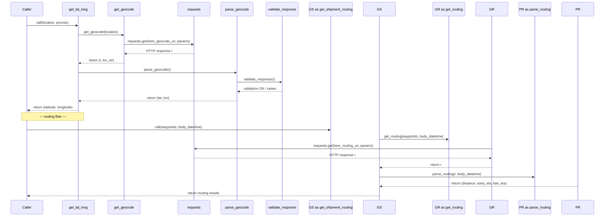

# Diagram: container_tracking_core/container_tracking_service/container_tracking_service/common/HERE/HERE.py


> Auto-generated by Obscura crawlers

## Diagram 1

```mermaid
flowchart TD
    SECRETS[Secrets() / SECRETS] --> here_config[here_config]
    here_config --> app_id[app_id]
    here_config --> app_code[app_code]
    here_config --> api_key[api_key]
    get_lat_long[get_lat_long(location, precise=True)] --> get_geocode[get_geocode(location)]
    get_geocode --> build_locstr[build loc_str from address/name/city/state/postal_code]
    build_locstr --> requests_geo[requests.get(here_geocode_uri, params)]
    requests_geo --> r_geo[HTTP Response r]
    r_geo --> parse_geocode[parse_geocode(r) => (lat, lon)]
    parse_geocode --> validate_response[validate_response(r)]
    validate_response --> BadRequestError[BadRequestError (raises on invalid)]
    get_normalized_address[get_normalized_address(location)] --> get_geocode
    get_normalized_address --> validate_response
    get_geocode_long_lat[get_geocode_long_lat(address,city,state,postal_code,country,cursor)] --> locator_read[locator.read_by_city_state_db_by_cache]
    locator_read --> locator_hit[row_class or None]
    locator_hit -->|hit| get_geocode_long_lat
    locator_hit -->|miss| requests_geo
    get_geocode_long_lat --> locator_write[locator.write_by_long_lat_db]
    get_reverse_geocode[get_reverse_geocode(lat,lng)] --> requests_rev[requests.get(here_reverse_geocode_uri, params)]
    requests_rev --> r_rev[HTTP Response r]
    r_rev --> parse_reverse_geocode[parse_reverse_geocode(r, need_full)]
    parse_reverse_geocode --> address_transform[transform & validate address fields]
    parse_reverse_geocode --> utilities[utilities.is_present]
    get_locality[get_locality(lat, lon)] --> get_reverse_geocode
    get_shipment_routing[get_shipment_routing(waypoints, body_datetime)] --> get_routing[get_routing(waypoints, body_datetime)]
    get_routing --> validate_waypoints[validate waypoint types & counts]
    get_routing --> build_routing_payload[build routing payload + waypoints]
    build_routing_payload --> requests_route[requests.get(here_routing_uri, params)]
    requests_route --> r_route[HTTP Response r]
    r_route --> parse_routing[parse_routing(r, body_datetime)]
    parse_routing --> compute_eta[compute distance, early_eta, late_eta]
    get_stop_location[get_stop_location(stop, payload)] --> utilities_validate[utilities.validate_location_update]
    utilities_validate -->|valid lat/lon| use_payload_latlon[use lat/lon from payload]
    get_stop_location -->|else if address present| get_geocode
    get_stop_location --> parse_geocode
```

> SVG rendering failed for this diagram.

## Diagram 2



> SVG rendering failed for this diagram.
