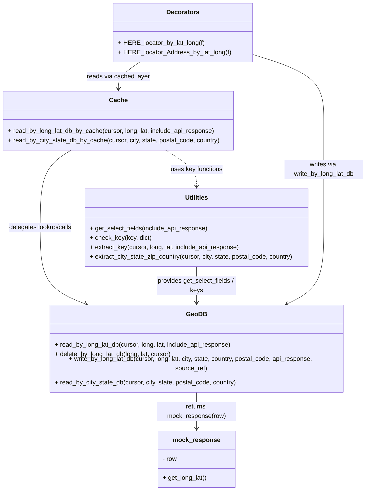

# Diagram: container_tracking_core/container_tracking_service/container_tracking_service/common/HERE/HERE_locator.py


> Auto-generated by Obscura crawlers

## Diagram 1



> SVG rendering failed for this diagram.

## Diagram 2

```mermaid
flowchart TD
    A[Incoming call to decorated function] --> B{is_valid_lat_long(lng,lat)?}
    B -- No --> C[Call original function f(*args,**kwargs) and return result]
    B -- Yes --> D[Format lat/long to 2 decimal places]
    D --> E{cursor is None?}
    E -- Yes --> F[Call original function f and return its result]
    E -- No --> G[Call read_by_long_lat_db_by_cache(long,lat,cursor)]
    G --> H{DB cache returned result?}
    H -- Yes --> I[Log "in db" and return cached result]
    H -- No --> J[Log "Not in db"; call original function f to get API result]
    J --> K[Call write_by_long_lat_db(long,lat,city,state,country,postal,api_response,source_ref,cursor)]
    K --> L[Return API result to caller]
```

> SVG rendering failed for this diagram.
