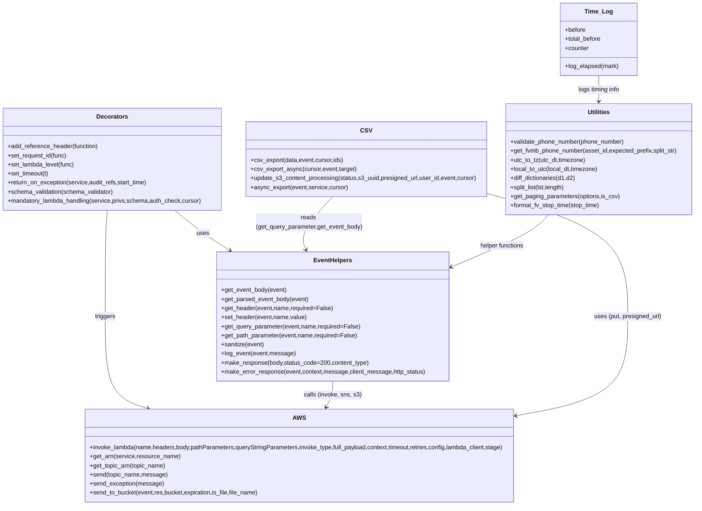

# Diagram: container_tracking_core/container_tracking_service/container_tracking_service/common/aws/lambdas/__init__.py


> Auto-generated by Obscura crawlers

## Diagram 1



### SVG

<svg id="container" width="1847.56640625" xmlns="http://www.w3.org/2000/svg" class="classDiagram" height="1336" viewBox="0 0 1847.56640625 1336" role="graphics-document document" aria-roledescription="class"><style>#container{font-family:"trebuchet ms",verdana,arial,sans-serif;font-size:16px;fill:#333;}@keyframes edge-animation-frame{from{stroke-dashoffset:0;}}@keyframes dash{to{stroke-dashoffset:0;}}#container .edge-animation-slow{stroke-dasharray:9,5!important;stroke-dashoffset:900;animation:dash 50s linear infinite;stroke-linecap:round;}#container .edge-animation-fast{stroke-dasharray:9,5!important;stroke-dashoffset:900;animation:dash 20s linear infinite;stroke-linecap:round;}#container .error-icon{fill:#552222;}#container .error-text{fill:#552222;stroke:#552222;}#container .edge-thickness-normal{stroke-width:1px;}#container .edge-thickness-thick{stroke-width:3.5px;}#container .edge-pattern-solid{stroke-dasharray:0;}#container .edge-thickness-invisible{stroke-width:0;fill:none;}#container .edge-pattern-dashed{stroke-dasharray:3;}#container .edge-pattern-dotted{stroke-dasharray:2;}#container .marker{fill:#333333;stroke:#333333;}#container .marker.cross{stroke:#333333;}#container svg{font-family:"trebuchet ms",verdana,arial,sans-serif;font-size:16px;}#container p{margin:0;}#container g.classGroup text{fill:#9370DB;stroke:none;font-family:"trebuchet ms",verdana,arial,sans-serif;font-size:10px;}#container g.classGroup text .title{font-weight:bolder;}#container .nodeLabel,#container .edgeLabel{color:#131300;}#container .edgeLabel .label rect{fill:#ECECFF;}#container .label text{fill:#131300;}#container .labelBkg{background:#ECECFF;}#container .edgeLabel .label span{background:#ECECFF;}#container .classTitle{font-weight:bolder;}#container .node rect,#container .node circle,#container .node ellipse,#container .node polygon,#container .node path{fill:#ECECFF;stroke:#9370DB;stroke-width:1px;}#container .divider{stroke:#9370DB;stroke-width:1;}#container g.clickable{cursor:pointer;}#container g.classGroup rect{fill:#ECECFF;stroke:#9370DB;}#container g.classGroup line{stroke:#9370DB;stroke-width:1;}#container .classLabel .box{stroke:none;stroke-width:0;fill:#ECECFF;opacity:0.5;}#container .classLabel .label{fill:#9370DB;font-size:10px;}#container .relation{stroke:#333333;stroke-width:1;fill:none;}#container .dashed-line{stroke-dasharray:3;}#container .dotted-line{stroke-dasharray:1 2;}#container #compositionStart,#container .composition{fill:#333333!important;stroke:#333333!important;stroke-width:1;}#container #compositionEnd,#container .composition{fill:#333333!important;stroke:#333333!important;stroke-width:1;}#container #dependencyStart,#container .dependency{fill:#333333!important;stroke:#333333!important;stroke-width:1;}#container #dependencyStart,#container .dependency{fill:#333333!important;stroke:#333333!important;stroke-width:1;}#container #extensionStart,#container .extension{fill:transparent!important;stroke:#333333!important;stroke-width:1;}#container #extensionEnd,#container .extension{fill:transparent!important;stroke:#333333!important;stroke-width:1;}#container #aggregationStart,#container .aggregation{fill:transparent!important;stroke:#333333!important;stroke-width:1;}#container #aggregationEnd,#container .aggregation{fill:transparent!important;stroke:#333333!important;stroke-width:1;}#container #lollipopStart,#container .lollipop{fill:#ECECFF!important;stroke:#333333!important;stroke-width:1;}#container #lollipopEnd,#container .lollipop{fill:#ECECFF!important;stroke:#333333!important;stroke-width:1;}#container .edgeTerminals{font-size:11px;line-height:initial;}#container .classTitleText{text-anchor:middle;font-size:18px;fill:#333;}#container .label-icon{display:inline-block;height:1em;overflow:visible;vertical-align:-0.125em;}#container .node .label-icon path{fill:currentColor;stroke:revert;stroke-width:revert;}#container :root{--mermaid-font-family:"trebuchet ms",verdana,arial,sans-serif;}</style><g><defs><marker id="container_class-aggregationStart" class="marker aggregation class" refX="18" refY="7" markerWidth="190" markerHeight="240" orient="auto"><path d="M 18,7 L9,13 L1,7 L9,1 Z"></path></marker></defs><defs><marker id="container_class-aggregationEnd" class="marker aggregation class" refX="1" refY="7" markerWidth="20" markerHeight="28" orient="auto"><path d="M 18,7 L9,13 L1,7 L9,1 Z"></path></marker></defs><defs><marker id="container_class-extensionStart" class="marker extension class" refX="18" refY="7" markerWidth="190" markerHeight="240" orient="auto"><path d="M 1,7 L18,13 V 1 Z"></path></marker></defs><defs><marker id="container_class-extensionEnd" class="marker extension class" refX="1" refY="7" markerWidth="20" markerHeight="28" orient="auto"><path d="M 1,1 V 13 L18,7 Z"></path></marker></defs><defs><marker id="container_class-compositionStart" class="marker composition class" refX="18" refY="7" markerWidth="190" markerHeight="240" orient="auto"><path d="M 18,7 L9,13 L1,7 L9,1 Z"></path></marker></defs><defs><marker id="container_class-compositionEnd" class="marker composition class" refX="1" refY="7" markerWidth="20" markerHeight="28" orient="auto"><path d="M 18,7 L9,13 L1,7 L9,1 Z"></path></marker></defs><defs><marker id="container_class-dependencyStart" class="marker dependency class" refX="6" refY="7" markerWidth="190" markerHeight="240" orient="auto"><path d="M 5,7 L9,13 L1,7 L9,1 Z"></path></marker></defs><defs><marker id="container_class-dependencyEnd" class="marker dependency class" refX="13" refY="7" markerWidth="20" markerHeight="28" orient="auto"><path d="M 18,7 L9,13 L14,7 L9,1 Z"></path></marker></defs><defs><marker id="container_class-lollipopStart" class="marker lollipop class" refX="13" refY="7" markerWidth="190" markerHeight="240" orient="auto"><circle stroke="black" fill="transparent" cx="7" cy="7" r="6"></circle></marker></defs><defs><marker id="container_class-lollipopEnd" class="marker lollipop class" refX="1" refY="7" markerWidth="190" markerHeight="240" orient="auto"><circle stroke="black" fill="transparent" cx="7" cy="7" r="6"></circle></marker></defs><g class="root"><g class="clusters"></g><g class="edgePaths"><path d="M464.498,556L476.982,566.167C489.466,576.333,514.434,596.667,538.774,614.459C563.115,632.251,586.827,647.503,598.683,655.129L610.539,662.754" id="id_Decorators_EventHelpers_1" class="edge-thickness-normal edge-pattern-solid relation" style=";;;" data-edge="true" data-et="edge" data-id="id_Decorators_EventHelpers_1" data-points="W3sieCI6NDY0LjQ5ODE0NjUyNDIzNDcsInkiOjU1Nn0seyJ4Ijo1MzkuNDAyMzQzNzUsInkiOjYxN30seyJ4Ijo2MTUuNTg1NTExMzYzNjM2NCwieSI6NjY2fV0=" marker-end="url(#container_class-dependencyEnd)"></path><path d="M286.159,556L285.213,566.167C284.266,576.333,282.373,596.667,281.427,643.5C280.48,690.333,280.48,763.667,280.48,835C280.48,906.333,280.48,975.667,299.345,1016.203C318.209,1056.739,355.938,1068.478,374.803,1074.348L393.667,1080.217" id="id_Decorators_AWS_2" class="edge-thickness-normal edge-pattern-solid relation" style=";;;" data-edge="true" data-et="edge" data-id="id_Decorators_AWS_2" data-points="W3sieCI6Mjg2LjE1OTA5OTk2ODExMjIzLCJ5Ijo1NTZ9LHsieCI6MjgwLjQ4MDQ2ODc1LCJ5Ijo2MTd9LHsieCI6MjgwLjQ4MDQ2ODc1LCJ5Ijo4Mzd9LHsieCI6MjgwLjQ4MDQ2ODc1LCJ5IjoxMDQ1fSx7IngiOjM5OS4zOTYyNjQ2NDg0Mzc1LCJ5IjoxMDgyfV0=" marker-end="url(#container_class-dependencyEnd)"></path><path d="M881.449,1008L881.449,1014.167C881.449,1020.333,881.449,1032.667,878.583,1044.121C875.716,1055.575,869.983,1066.15,867.117,1071.438L864.251,1076.725" id="id_EventHelpers_AWS_3" class="edge-thickness-normal edge-pattern-solid relation" style=";;;" data-edge="true" data-et="edge" data-id="id_EventHelpers_AWS_3" data-points="W3sieCI6ODgxLjQ0OTIxODc1LCJ5IjoxMDA4fSx7IngiOjg4MS40NDkyMTg3NSwieSI6MTA0NX0seyJ4Ijo4NjEuMzkwOTkxMjEwOTM3NSwieSI6MTA4Mn1d" marker-end="url(#container_class-dependencyEnd)"></path><path d="M1289.473,510.45L1352.781,528.208C1416.09,545.967,1542.707,581.483,1606.016,635.908C1669.324,690.333,1669.324,763.667,1669.324,835C1669.324,906.333,1669.324,975.667,1620.337,1019.295C1571.349,1062.923,1473.374,1080.847,1424.386,1089.809L1375.398,1098.77" id="id_CSV_AWS_4" class="edge-thickness-normal edge-pattern-solid relation" style=";;;" data-edge="true" data-et="edge" data-id="id_CSV_AWS_4" data-points="W3sieCI6MTI4OS40NzI2NTYyNSwieSI6NTEwLjQ1MDEwNTY1ODYwNTN9LHsieCI6MTY2OS4zMjQyMTg3NSwieSI6NjE3fSx7IngiOjE2NjkuMzI0MjE4NzUsInkiOjgzN30seyJ4IjoxNjY5LjMyNDIxODc1LCJ5IjoxMDQ1fSx7IngiOjEzNjkuNDk2MDkzNzUsInkiOjEwOTkuODQ5OTU2MDA3MzQyNn1d" marker-end="url(#container_class-dependencyEnd)"></path><path d="M881.749,520L867.243,536.167C852.736,552.333,823.724,584.667,812.07,608.07C800.417,631.473,806.123,645.945,808.976,653.182L811.829,660.418" id="id_CSV_EventHelpers_5" class="edge-thickness-normal edge-pattern-solid relation" style=";;;" data-edge="true" data-et="edge" data-id="id_CSV_EventHelpers_5" data-points="W3sieCI6ODgxLjc0OTE4Mjg3NjI3NTUsInkiOjUyMH0seyJ4Ijo3OTQuNzEwOTM3NSwieSI6NjE3fSx7IngiOjgxNC4wMjk5MTgzMjM4NjM2LCJ5Ijo2NjZ9XQ==" marker-end="url(#container_class-dependencyEnd)"></path><path d="M1457.616,568L1450.288,576.167C1442.96,584.333,1428.304,600.667,1384.259,624.011C1340.214,647.356,1266.78,677.712,1230.063,692.89L1193.346,708.069" id="id_Utilities_EventHelpers_6" class="edge-thickness-normal edge-pattern-solid relation" style=";;;" data-edge="true" data-et="edge" data-id="id_Utilities_EventHelpers_6" data-points="W3sieCI6MTQ1Ny42MTYyMTA5Mzc1LCJ5Ijo1Njh9LHsieCI6MTQxMy42NDg0Mzc1LCJ5Ijo2MTd9LHsieCI6MTE4Ny44MDA3ODEyNSwieSI6NzEwLjM2MDY4NjQyMDU4Njd9XQ==" marker-end="url(#container_class-dependencyEnd)"></path><path d="M1589.52,200L1589.52,206.167C1589.52,212.333,1589.52,224.667,1589.52,236C1589.52,247.333,1589.52,257.667,1589.52,262.833L1589.52,268" id="id_Time_Log_Utilities_7" class="edge-thickness-normal edge-pattern-solid relation" style=";;;" data-edge="true" data-et="edge" data-id="id_Time_Log_Utilities_7" data-points="W3sieCI6MTU4OS41MTk1MzEyNSwieSI6MjAwfSx7IngiOjE1ODkuNTE5NTMxMjUsInkiOjIzN30seyJ4IjoxNTg5LjUxOTUzMTI1LCJ5IjoyNzR9XQ==" marker-end="url(#container_class-dependencyEnd)"></path></g><g class="edgeLabels"><g class="edgeLabel" transform="translate(539.40234375, 617)"><g class="label" data-id="id_Decorators_EventHelpers_1" transform="translate(-16.4921875, -12)"><foreignObject width="32.984375" height="24"><div xmlns="http://www.w3.org/1999/xhtml" class="labelBkg" style="display: table-cell; white-space: nowrap; line-height: 1.5; max-width: 200px; text-align: center;"><span class="edgeLabel"><p>uses</p></span></div></foreignObject></g></g><g class="edgeLabel" transform="translate(280.48046875, 837)"><g class="label" data-id="id_Decorators_AWS_2" transform="translate(-27.4921875, -12)"><foreignObject width="54.984375" height="24"><div xmlns="http://www.w3.org/1999/xhtml" class="labelBkg" style="display: table-cell; white-space: nowrap; line-height: 1.5; max-width: 200px; text-align: center;"><span class="edgeLabel"><p>triggers</p></span></div></foreignObject></g></g><g class="edgeLabel" transform="translate(881.44921875, 1045)"><g class="label" data-id="id_EventHelpers_AWS_3" transform="translate(-75.484375, -12)"><foreignObject width="150.96875" height="24"><div xmlns="http://www.w3.org/1999/xhtml" class="labelBkg" style="display: table-cell; white-space: nowrap; line-height: 1.5; max-width: 200px; text-align: center;"><span class="edgeLabel"><p>calls (invoke, sns, s3)</p></span></div></foreignObject></g></g><g class="edgeLabel" transform="translate(1669.32421875, 837)"><g class="label" data-id="id_CSV_AWS_4" transform="translate(-90.1953125, -12)"><foreignObject width="180.390625" height="24"><div xmlns="http://www.w3.org/1999/xhtml" class="labelBkg" style="display: table-cell; white-space: nowrap; line-height: 1.5; max-width: 200px; text-align: center;"><span class="edgeLabel"><p>uses (put, presigned_url)</p></span></div></foreignObject></g></g><g class="edgeLabel" transform="translate(820.64182, 588.10126)"><g class="label" data-id="id_CSV_EventHelpers_5" transform="translate(-141.7734375, -24)"><foreignObject width="283.546875" height="48"><div xmlns="http://www.w3.org/1999/xhtml" class="labelBkg" style="display: table; white-space: break-spaces; line-height: 1.5; max-width: 200px; text-align: center; width: 200px;"><span class="edgeLabel"><p>reads (get_query_parameter,get_event_body)</p></span></div></foreignObject></g></g><g class="edgeLabel" transform="translate(1331.14509, 651.10515)"><g class="label" data-id="id_Utilities_EventHelpers_6" transform="translate(-59.8046875, -12)"><foreignObject width="119.609375" height="24"><div xmlns="http://www.w3.org/1999/xhtml" class="labelBkg" style="display: table-cell; white-space: nowrap; line-height: 1.5; max-width: 200px; text-align: center;"><span class="edgeLabel"><p>helper functions</p></span></div></foreignObject></g></g><g class="edgeLabel" transform="translate(1589.51953125, 237)"><g class="label" data-id="id_Time_Log_Utilities_7" transform="translate(-56.3828125, -12)"><foreignObject width="112.765625" height="24"><div xmlns="http://www.w3.org/1999/xhtml" class="labelBkg" style="display: table-cell; white-space: nowrap; line-height: 1.5; max-width: 200px; text-align: center;"><span class="edgeLabel"><p>logs timing info</p></span></div></foreignObject></g></g></g><g class="nodes"><g class="node default" id="classId-Time_Log-0" transform="translate(1589.51953125, 104)"><g class="basic label-container"><path d="M-100.76171875 -96 L100.76171875 -96 L100.76171875 96 L-100.76171875 96" stroke="none" stroke-width="0" fill="#ECECFF" style=""></path><path d="M-100.76171875 -96 C-23.03420546127738 -96, 54.69330782744524 -96, 100.76171875 -96 M-100.76171875 -96 C-20.4697932183757 -96, 59.8221323132486 -96, 100.76171875 -96 M100.76171875 -96 C100.76171875 -23.648571765712376, 100.76171875 48.70285646857525, 100.76171875 96 M100.76171875 -96 C100.76171875 -54.01551299790035, 100.76171875 -12.031025995800704, 100.76171875 96 M100.76171875 96 C53.976566428182814 96, 7.191414106365627 96, -100.76171875 96 M100.76171875 96 C22.482374949997634 96, -55.79696885000473 96, -100.76171875 96 M-100.76171875 96 C-100.76171875 36.34970782607434, -100.76171875 -23.300584347851327, -100.76171875 -96 M-100.76171875 96 C-100.76171875 46.05949073026134, -100.76171875 -3.8810185394773242, -100.76171875 -96" stroke="#9370DB" stroke-width="1.3" fill="none" stroke-dasharray="0 0" style=""></path></g><g class="annotation-group text" transform="translate(0, -72)"></g><g class="label-group text" transform="translate(-34.7421875, -72)"><g class="label" style="font-weight: bolder" transform="translate(0,-12)"><foreignObject width="69.484375" height="24"><div xmlns="http://www.w3.org/1999/xhtml" style="display: table-cell; white-space: nowrap; line-height: 1.5; max-width: 119px; text-align: center;"><span class="nodeLabel markdown-node-label" style=""><p>Time_Log</p></span></div></foreignObject></g></g><g class="members-group text" transform="translate(-88.76171875, -24)"><g class="label" style="" transform="translate(0,-12)"><foreignObject width="55.171875" height="24"><div xmlns="http://www.w3.org/1999/xhtml" style="display: table-cell; white-space: nowrap; line-height: 1.5; max-width: 113px; text-align: center;"><span class="nodeLabel markdown-node-label" style=""><p>+before</p></span></div></foreignObject></g><g class="label" style="" transform="translate(0,12)"><foreignObject width="97.1875" height="24"><div xmlns="http://www.w3.org/1999/xhtml" style="display: table-cell; white-space: nowrap; line-height: 1.5; max-width: 155px; text-align: center;"><span class="nodeLabel markdown-node-label" style=""><p>+total_before</p></span></div></foreignObject></g><g class="label" style="" transform="translate(0,36)"><foreignObject width="63.78125" height="24"><div xmlns="http://www.w3.org/1999/xhtml" style="display: table-cell; white-space: nowrap; line-height: 1.5; max-width: 122px; text-align: center;"><span class="nodeLabel markdown-node-label" style=""><p>+counter</p></span></div></foreignObject></g></g><g class="methods-group text" transform="translate(-88.76171875, 72)"><g class="label" style="" transform="translate(0,-12)"><foreignObject width="142.78125" height="24"><div xmlns="http://www.w3.org/1999/xhtml" style="display: table-cell; white-space: nowrap; line-height: 1.5; max-width: 200px; text-align: center;"><span class="nodeLabel markdown-node-label" style=""><p>+log_elapsed(mark)</p></span></div></foreignObject></g></g><g class="divider" style=""><path d="M-100.76171875 -48 C-36.419537905972405 -48, 27.92264293805519 -48, 100.76171875 -48 M-100.76171875 -48 C-42.69980286562359 -48, 15.362113018752822 -48, 100.76171875 -48" stroke="#9370DB" stroke-width="1.3" fill="none" stroke-dasharray="0 0" style=""></path></g><g class="divider" style=""><path d="M-100.76171875 48 C-21.904436883940036 48, 56.95284498211993 48, 100.76171875 48 M-100.76171875 48 C-34.46564056299988 48, 31.83043762400024 48, 100.76171875 48" stroke="#9370DB" stroke-width="1.3" fill="none" stroke-dasharray="0 0" style=""></path></g></g><g class="node default" id="classId-Decorators-1" transform="translate(298.7265625, 421)"><g class="basic label-container"><path d="M-290.7265625 -135 L290.7265625 -135 L290.7265625 135 L-290.7265625 135" stroke="none" stroke-width="0" fill="#ECECFF" style=""></path><path d="M-290.7265625 -135 C-88.12296927407843 -135, 114.48062395184314 -135, 290.7265625 -135 M-290.7265625 -135 C-150.32474109556355 -135, -9.922919691127106 -135, 290.7265625 -135 M290.7265625 -135 C290.7265625 -34.42617384851786, 290.7265625 66.14765230296427, 290.7265625 135 M290.7265625 -135 C290.7265625 -61.33065080553476, 290.7265625 12.338698388930482, 290.7265625 135 M290.7265625 135 C77.00472321163235 135, -136.7171160767353 135, -290.7265625 135 M290.7265625 135 C151.54399971002366 135, 12.36143692004731 135, -290.7265625 135 M-290.7265625 135 C-290.7265625 56.82474493393502, -290.7265625 -21.350510132129955, -290.7265625 -135 M-290.7265625 135 C-290.7265625 62.71575718808472, -290.7265625 -9.568485623830554, -290.7265625 -135" stroke="#9370DB" stroke-width="1.3" fill="none" stroke-dasharray="0 0" style=""></path></g><g class="annotation-group text" transform="translate(0, -111)"></g><g class="label-group text" transform="translate(-39.875, -111)"><g class="label" style="font-weight: bolder" transform="translate(0,-12)"><foreignObject width="79.75" height="24"><div xmlns="http://www.w3.org/1999/xhtml" style="display: table-cell; white-space: nowrap; line-height: 1.5; max-width: 128px; text-align: center;"><span class="nodeLabel markdown-node-label" style=""><p>Decorators</p></span></div></foreignObject></g></g><g class="members-group text" transform="translate(-278.7265625, -63)"></g><g class="methods-group text" transform="translate(-278.7265625, -33)"><g class="label" style="" transform="translate(0,-12)"><foreignObject width="242.265625" height="24"><div xmlns="http://www.w3.org/1999/xhtml" style="display: table-cell; white-space: nowrap; line-height: 1.5; max-width: 300px; text-align: center;"><span class="nodeLabel markdown-node-label" style=""><p>+add_reference_header(function)</p></span></div></foreignObject></g><g class="label" style="" transform="translate(0,12)"><foreignObject width="158.015625" height="24"><div xmlns="http://www.w3.org/1999/xhtml" style="display: table-cell; white-space: nowrap; line-height: 1.5; max-width: 215px; text-align: center;"><span class="nodeLabel markdown-node-label" style=""><p>+set_request_id(func)</p></span></div></foreignObject></g><g class="label" style="" transform="translate(0,36)"><foreignObject width="177.625" height="24"><div xmlns="http://www.w3.org/1999/xhtml" style="display: table-cell; white-space: nowrap; line-height: 1.5; max-width: 235px; text-align: center;"><span class="nodeLabel markdown-node-label" style=""><p>+set_lambda_level(func)</p></span></div></foreignObject></g><g class="label" style="" transform="translate(0,60)"><foreignObject width="111.25" height="24"><div xmlns="http://www.w3.org/1999/xhtml" style="display: table-cell; white-space: nowrap; line-height: 1.5; max-width: 169px; text-align: center;"><span class="nodeLabel markdown-node-label" style=""><p>+set_timeout(t)</p></span></div></foreignObject></g><g class="label" style="" transform="translate(0,84)"><foreignObject width="375.140625" height="24"><div xmlns="http://www.w3.org/1999/xhtml" style="display: table-cell; white-space: nowrap; line-height: 1.5; max-width: 433px; text-align: center;"><span class="nodeLabel markdown-node-label" style=""><p>+return_on_exception(service,audit_refs,start_time)</p></span></div></foreignObject></g><g class="label" style="" transform="translate(0,108)"><foreignObject width="282.625" height="24"><div xmlns="http://www.w3.org/1999/xhtml" style="display: table-cell; white-space: nowrap; line-height: 1.5; max-width: 340px; text-align: center;"><span class="nodeLabel markdown-node-label" style=""><p>+schema_validation(schema_validator)</p></span></div></foreignObject></g><g class="label" style="" transform="translate(0,132)"><foreignObject width="517.578125" height="24"><div xmlns="http://www.w3.org/1999/xhtml" style="display: table-cell; white-space: nowrap; line-height: 1.5; max-width: 575px; text-align: center;"><span class="nodeLabel markdown-node-label" style=""><p>+mandatory_lambda_handling(service,privs,schema,auth_check,cursor)</p></span></div></foreignObject></g></g><g class="divider" style=""><path d="M-290.7265625 -87 C-144.00559067185503 -87, 2.7153811562899364 -87, 290.7265625 -87 M-290.7265625 -87 C-90.8097623092305 -87, 109.10703788153899 -87, 290.7265625 -87" stroke="#9370DB" stroke-width="1.3" fill="none" stroke-dasharray="0 0" style=""></path></g><g class="divider" style=""><path d="M-290.7265625 -63 C-114.1566104647114 -63, 62.41334157057719 -63, 290.7265625 -63 M-290.7265625 -63 C-75.91963819435267 -63, 138.88728611129466 -63, 290.7265625 -63" stroke="#9370DB" stroke-width="1.3" fill="none" stroke-dasharray="0 0" style=""></path></g></g><g class="node default" id="classId-EventHelpers-2" transform="translate(881.44921875, 837)"><g class="basic label-container"><path d="M-306.3515625 -171 L306.3515625 -171 L306.3515625 171 L-306.3515625 171" stroke="none" stroke-width="0" fill="#ECECFF" style=""></path><path d="M-306.3515625 -171 C-173.57848785832724 -171, -40.80541321665447 -171, 306.3515625 -171 M-306.3515625 -171 C-124.50568718748588 -171, 57.34018812502825 -171, 306.3515625 -171 M306.3515625 -171 C306.3515625 -65.98387993188999, 306.3515625 39.032240136220025, 306.3515625 171 M306.3515625 -171 C306.3515625 -102.31271379151008, 306.3515625 -33.625427583020155, 306.3515625 171 M306.3515625 171 C72.0388335077651 171, -162.2738954844698 171, -306.3515625 171 M306.3515625 171 C132.537292596843 171, -41.276977306313995 171, -306.3515625 171 M-306.3515625 171 C-306.3515625 79.93898541467732, -306.3515625 -11.122029170645362, -306.3515625 -171 M-306.3515625 171 C-306.3515625 96.19490463169336, -306.3515625 21.389809263386724, -306.3515625 -171" stroke="#9370DB" stroke-width="1.3" fill="none" stroke-dasharray="0 0" style=""></path></g><g class="annotation-group text" transform="translate(0, -147)"></g><g class="label-group text" transform="translate(-48.5, -147)"><g class="label" style="font-weight: bolder" transform="translate(0,-12)"><foreignObject width="97" height="24"><div xmlns="http://www.w3.org/1999/xhtml" style="display: table-cell; white-space: nowrap; line-height: 1.5; max-width: 146px; text-align: center;"><span class="nodeLabel markdown-node-label" style=""><p>EventHelpers</p></span></div></foreignObject></g></g><g class="members-group text" transform="translate(-294.3515625, -99)"></g><g class="methods-group text" transform="translate(-294.3515625, -69)"><g class="label" style="" transform="translate(0,-12)"><foreignObject width="174.203125" height="24"><div xmlns="http://www.w3.org/1999/xhtml" style="display: table-cell; white-space: nowrap; line-height: 1.5; max-width: 232px; text-align: center;"><span class="nodeLabel markdown-node-label" style=""><p>+get_event_body(event)</p></span></div></foreignObject></g><g class="label" style="" transform="translate(0,12)"><foreignObject width="232.265625" height="24"><div xmlns="http://www.w3.org/1999/xhtml" style="display: table-cell; white-space: nowrap; line-height: 1.5; max-width: 290px; text-align: center;"><span class="nodeLabel markdown-node-label" style=""><p>+get_parsed_event_body(event)</p></span></div></foreignObject></g><g class="label" style="" transform="translate(0,36)"><foreignObject width="294.890625" height="24"><div xmlns="http://www.w3.org/1999/xhtml" style="display: table-cell; white-space: nowrap; line-height: 1.5; max-width: 352px; text-align: center;"><span class="nodeLabel markdown-node-label" style=""><p>+get_header(event,name,required=False)</p></span></div></foreignObject></g><g class="label" style="" transform="translate(0,60)"><foreignObject width="226.421875" height="24"><div xmlns="http://www.w3.org/1999/xhtml" style="display: table-cell; white-space: nowrap; line-height: 1.5; max-width: 284px; text-align: center;"><span class="nodeLabel markdown-node-label" style=""><p>+set_header(event,name,value)</p></span></div></foreignObject></g><g class="label" style="" transform="translate(0,84)"><foreignObject width="368.1875" height="24"><div xmlns="http://www.w3.org/1999/xhtml" style="display: table-cell; white-space: nowrap; line-height: 1.5; max-width: 426px; text-align: center;"><span class="nodeLabel markdown-node-label" style=""><p>+get_query_parameter(event,name,required=False)</p></span></div></foreignObject></g><g class="label" style="" transform="translate(0,108)"><foreignObject width="360.53125" height="24"><div xmlns="http://www.w3.org/1999/xhtml" style="display: table-cell; white-space: nowrap; line-height: 1.5; max-width: 418px; text-align: center;"><span class="nodeLabel markdown-node-label" style=""><p>+get_path_parameter(event,name,required=False)</p></span></div></foreignObject></g><g class="label" style="" transform="translate(0,132)"><foreignObject width="114.484375" height="24"><div xmlns="http://www.w3.org/1999/xhtml" style="display: table-cell; white-space: nowrap; line-height: 1.5; max-width: 172px; text-align: center;"><span class="nodeLabel markdown-node-label" style=""><p>+sanitize(event)</p></span></div></foreignObject></g><g class="label" style="" transform="translate(0,156)"><foreignObject width="195.65625" height="24"><div xmlns="http://www.w3.org/1999/xhtml" style="display: table-cell; white-space: nowrap; line-height: 1.5; max-width: 253px; text-align: center;"><span class="nodeLabel markdown-node-label" style=""><p>+log_event(event,message)</p></span></div></foreignObject></g><g class="label" style="" transform="translate(0,180)"><foreignObject width="390.953125" height="24"><div xmlns="http://www.w3.org/1999/xhtml" style="display: table-cell; white-space: nowrap; line-height: 1.5; max-width: 448px; text-align: center;"><span class="nodeLabel markdown-node-label" style=""><p>+make_response(body,status_code=200,content_type)</p></span></div></foreignObject></g><g class="label" style="" transform="translate(0,204)"><foreignObject width="540.203125" height="24"><div xmlns="http://www.w3.org/1999/xhtml" style="display: table-cell; white-space: nowrap; line-height: 1.5; max-width: 598px; text-align: center;"><span class="nodeLabel markdown-node-label" style=""><p>+make_error_response(event,context,message,client_message,http_status)</p></span></div></foreignObject></g></g><g class="divider" style=""><path d="M-306.3515625 -123 C-71.47686898300614 -123, 163.39782453398772 -123, 306.3515625 -123 M-306.3515625 -123 C-131.48008065830376 -123, 43.391401183392475 -123, 306.3515625 -123" stroke="#9370DB" stroke-width="1.3" fill="none" stroke-dasharray="0 0" style=""></path></g><g class="divider" style=""><path d="M-306.3515625 -99 C-136.8064628433616 -99, 32.7386368132768 -99, 306.3515625 -99 M-306.3515625 -99 C-182.54644482124203 -99, -58.74132714248407 -99, 306.3515625 -99" stroke="#9370DB" stroke-width="1.3" fill="none" stroke-dasharray="0 0" style=""></path></g></g><g class="node default" id="classId-AWS-3" transform="translate(794.7109375, 1205)"><g class="basic label-container"><path d="M-574.78515625 -123 L574.78515625 -123 L574.78515625 123 L-574.78515625 123" stroke="none" stroke-width="0" fill="#ECECFF" style=""></path><path d="M-574.78515625 -123 C-143.78617094596694 -123, 287.2128143580661 -123, 574.78515625 -123 M-574.78515625 -123 C-188.24553118636413 -123, 198.29409387727173 -123, 574.78515625 -123 M574.78515625 -123 C574.78515625 -71.45948197751457, 574.78515625 -19.918963955029128, 574.78515625 123 M574.78515625 -123 C574.78515625 -41.39494597136563, 574.78515625 40.21010805726874, 574.78515625 123 M574.78515625 123 C325.2195582823812 123, 75.65396031476234 123, -574.78515625 123 M574.78515625 123 C159.68728526622158 123, -255.41058571755684 123, -574.78515625 123 M-574.78515625 123 C-574.78515625 72.9782294578403, -574.78515625 22.9564589156806, -574.78515625 -123 M-574.78515625 123 C-574.78515625 33.12574549741376, -574.78515625 -56.74850900517248, -574.78515625 -123" stroke="#9370DB" stroke-width="1.3" fill="none" stroke-dasharray="0 0" style=""></path></g><g class="annotation-group text" transform="translate(0, -99)"></g><g class="label-group text" transform="translate(-15.9921875, -99)"><g class="label" style="font-weight: bolder" transform="translate(0,-12)"><foreignObject width="31.984375" height="24"><div xmlns="http://www.w3.org/1999/xhtml" style="display: table-cell; white-space: nowrap; line-height: 1.5; max-width: 81px; text-align: center;"><span class="nodeLabel markdown-node-label" style=""><p>AWS</p></span></div></foreignObject></g></g><g class="members-group text" transform="translate(-562.78515625, -51)"></g><g class="methods-group text" transform="translate(-562.78515625, -21)"><g class="label" style="" transform="translate(0,-12)"><foreignObject width="1109.578125" height="24"><div xmlns="http://www.w3.org/1999/xhtml" style="display: table-cell; white-space: nowrap; line-height: 1.5; max-width: 1167px; text-align: center;"><span class="nodeLabel markdown-node-label" style=""><p>+invoke_lambda(name,headers,body,pathParameters,queryStringParameters,invoke_type,full_payload,context,timeout,retries,config,lambda_client,stage)</p></span></div></foreignObject></g><g class="label" style="" transform="translate(0,12)"><foreignObject width="238.453125" height="24"><div xmlns="http://www.w3.org/1999/xhtml" style="display: table-cell; white-space: nowrap; line-height: 1.5; max-width: 296px; text-align: center;"><span class="nodeLabel markdown-node-label" style=""><p>+get_arn(service,resource_name)</p></span></div></foreignObject></g><g class="label" style="" transform="translate(0,36)"><foreignObject width="203.09375" height="24"><div xmlns="http://www.w3.org/1999/xhtml" style="display: table-cell; white-space: nowrap; line-height: 1.5; max-width: 260px; text-align: center;"><span class="nodeLabel markdown-node-label" style=""><p>+get_topic_arn(topic_name)</p></span></div></foreignObject></g><g class="label" style="" transform="translate(0,60)"><foreignObject width="204.9375" height="24"><div xmlns="http://www.w3.org/1999/xhtml" style="display: table-cell; white-space: nowrap; line-height: 1.5; max-width: 262px; text-align: center;"><span class="nodeLabel markdown-node-label" style=""><p>+send(topic_name,message)</p></span></div></foreignObject></g><g class="label" style="" transform="translate(0,84)"><foreignObject width="194.625" height="24"><div xmlns="http://www.w3.org/1999/xhtml" style="display: table-cell; white-space: nowrap; line-height: 1.5; max-width: 252px; text-align: center;"><span class="nodeLabel markdown-node-label" style=""><p>+send_exception(message)</p></span></div></foreignObject></g><g class="label" style="" transform="translate(0,108)"><foreignObject width="450.3125" height="24"><div xmlns="http://www.w3.org/1999/xhtml" style="display: table-cell; white-space: nowrap; line-height: 1.5; max-width: 508px; text-align: center;"><span class="nodeLabel markdown-node-label" style=""><p>+send_to_bucket(event,res,bucket,expiration,is_file,file_name)</p></span></div></foreignObject></g></g><g class="divider" style=""><path d="M-574.78515625 -75 C-193.37897314912556 -75, 188.0272099517489 -75, 574.78515625 -75 M-574.78515625 -75 C-121.73316246790199 -75, 331.318831314196 -75, 574.78515625 -75" stroke="#9370DB" stroke-width="1.3" fill="none" stroke-dasharray="0 0" style=""></path></g><g class="divider" style=""><path d="M-574.78515625 -51 C-142.60774602123394 -51, 289.5696642075321 -51, 574.78515625 -51 M-574.78515625 -51 C-261.27813329724813 -51, 52.228889655503735 -51, 574.78515625 -51" stroke="#9370DB" stroke-width="1.3" fill="none" stroke-dasharray="0 0" style=""></path></g></g><g class="node default" id="classId-CSV-4" transform="translate(970.58203125, 421)"><g class="basic label-container"><path d="M-318.890625 -99 L318.890625 -99 L318.890625 99 L-318.890625 99" stroke="none" stroke-width="0" fill="#ECECFF" style=""></path><path d="M-318.890625 -99 C-69.46054707203328 -99, 179.96953085593344 -99, 318.890625 -99 M-318.890625 -99 C-146.17871172229098 -99, 26.53320155541803 -99, 318.890625 -99 M318.890625 -99 C318.890625 -43.30510042478329, 318.890625 12.389799150433419, 318.890625 99 M318.890625 -99 C318.890625 -34.578092414158164, 318.890625 29.843815171683673, 318.890625 99 M318.890625 99 C189.35592037805947 99, 59.82121575611893 99, -318.890625 99 M318.890625 99 C95.21380182006462 99, -128.46302135987077 99, -318.890625 99 M-318.890625 99 C-318.890625 38.32076953564416, -318.890625 -22.35846092871168, -318.890625 -99 M-318.890625 99 C-318.890625 57.731001369136806, -318.890625 16.46200273827361, -318.890625 -99" stroke="#9370DB" stroke-width="1.3" fill="none" stroke-dasharray="0 0" style=""></path></g><g class="annotation-group text" transform="translate(0, -75)"></g><g class="label-group text" transform="translate(-13.5, -75)"><g class="label" style="font-weight: bolder" transform="translate(0,-12)"><foreignObject width="27" height="24"><div xmlns="http://www.w3.org/1999/xhtml" style="display: table-cell; white-space: nowrap; line-height: 1.5; max-width: 76px; text-align: center;"><span class="nodeLabel markdown-node-label" style=""><p>CSV</p></span></div></foreignObject></g></g><g class="members-group text" transform="translate(-306.890625, -27)"></g><g class="methods-group text" transform="translate(-306.890625, 3)"><g class="label" style="" transform="translate(0,-12)"><foreignObject width="245.96875" height="24"><div xmlns="http://www.w3.org/1999/xhtml" style="display: table-cell; white-space: nowrap; line-height: 1.5; max-width: 303px; text-align: center;"><span class="nodeLabel markdown-node-label" style=""><p>+csv_export(data,event,cursor,ids)</p></span></div></foreignObject></g><g class="label" style="" transform="translate(0,12)"><foreignObject width="279.125" height="24"><div xmlns="http://www.w3.org/1999/xhtml" style="display: table-cell; white-space: nowrap; line-height: 1.5; max-width: 336px; text-align: center;"><span class="nodeLabel markdown-node-label" style=""><p>+csv_export_async(cursor,event,target)</p></span></div></foreignObject></g><g class="label" style="" transform="translate(0,36)"><foreignObject width="600.28125" height="24"><div xmlns="http://www.w3.org/1999/xhtml" style="display: table-cell; white-space: nowrap; line-height: 1.5; max-width: 658px; text-align: center;"><span class="nodeLabel markdown-node-label" style=""><p>+update_s3_content_processing(status,s3_uuid,presigned_url,user_id,event,cursor)</p></span></div></foreignObject></g><g class="label" style="" transform="translate(0,60)"><foreignObject width="258.25" height="24"><div xmlns="http://www.w3.org/1999/xhtml" style="display: table-cell; white-space: nowrap; line-height: 1.5; max-width: 316px; text-align: center;"><span class="nodeLabel markdown-node-label" style=""><p>+async_export(event,service,cursor)</p></span></div></foreignObject></g></g><g class="divider" style=""><path d="M-318.890625 -51 C-133.19992865021814 -51, 52.49076769956372 -51, 318.890625 -51 M-318.890625 -51 C-84.4291336561947 -51, 150.0323576876106 -51, 318.890625 -51" stroke="#9370DB" stroke-width="1.3" fill="none" stroke-dasharray="0 0" style=""></path></g><g class="divider" style=""><path d="M-318.890625 -27 C-76.252393661273 -27, 166.385837677454 -27, 318.890625 -27 M-318.890625 -27 C-94.39254757114077 -27, 130.10552985771847 -27, 318.890625 -27" stroke="#9370DB" stroke-width="1.3" fill="none" stroke-dasharray="0 0" style=""></path></g></g><g class="node default" id="classId-Utilities-5" transform="translate(1589.51953125, 421)"><g class="basic label-container"><path d="M-250.046875 -147 L250.046875 -147 L250.046875 147 L-250.046875 147" stroke="none" stroke-width="0" fill="#ECECFF" style=""></path><path d="M-250.046875 -147 C-139.5179113092053 -147, -28.988947618410577 -147, 250.046875 -147 M-250.046875 -147 C-129.2928071480589 -147, -8.538739296117825 -147, 250.046875 -147 M250.046875 -147 C250.046875 -43.058811205616536, 250.046875 60.88237758876693, 250.046875 147 M250.046875 -147 C250.046875 -79.37425837286199, 250.046875 -11.748516745723975, 250.046875 147 M250.046875 147 C58.328549259178516 147, -133.38977648164297 147, -250.046875 147 M250.046875 147 C64.18969331170638 147, -121.66748837658724 147, -250.046875 147 M-250.046875 147 C-250.046875 44.97512810476583, -250.046875 -57.04974379046834, -250.046875 -147 M-250.046875 147 C-250.046875 69.39056536982798, -250.046875 -8.218869260344036, -250.046875 -147" stroke="#9370DB" stroke-width="1.3" fill="none" stroke-dasharray="0 0" style=""></path></g><g class="annotation-group text" transform="translate(0, -123)"></g><g class="label-group text" transform="translate(-28.8125, -123)"><g class="label" style="font-weight: bolder" transform="translate(0,-12)"><foreignObject width="57.625" height="24"><div xmlns="http://www.w3.org/1999/xhtml" style="display: table-cell; white-space: nowrap; line-height: 1.5; max-width: 107px; text-align: center;"><span class="nodeLabel markdown-node-label" style=""><p>Utilities</p></span></div></foreignObject></g></g><g class="members-group text" transform="translate(-238.046875, -75)"></g><g class="methods-group text" transform="translate(-238.046875, -45)"><g class="label" style="" transform="translate(0,-12)"><foreignObject width="306.328125" height="24"><div xmlns="http://www.w3.org/1999/xhtml" style="display: table-cell; white-space: nowrap; line-height: 1.5; max-width: 364px; text-align: center;"><span class="nodeLabel markdown-node-label" style=""><p>+validate_phone_number(phone_number)</p></span></div></foreignObject></g><g class="label" style="" transform="translate(0,12)"><foreignObject width="447.28125" height="24"><div xmlns="http://www.w3.org/1999/xhtml" style="display: table-cell; white-space: nowrap; line-height: 1.5; max-width: 505px; text-align: center;"><span class="nodeLabel markdown-node-label" style=""><p>+get_fvmb_phone_number(asset_id,expected_prefix,split_str)</p></span></div></foreignObject></g><g class="label" style="" transform="translate(0,36)"><foreignObject width="200.375" height="24"><div xmlns="http://www.w3.org/1999/xhtml" style="display: table-cell; white-space: nowrap; line-height: 1.5; max-width: 258px; text-align: center;"><span class="nodeLabel markdown-node-label" style=""><p>+utc_to_tz(utc_dt,timezone)</p></span></div></foreignObject></g><g class="label" style="" transform="translate(0,60)"><foreignObject width="234.453125" height="24"><div xmlns="http://www.w3.org/1999/xhtml" style="display: table-cell; white-space: nowrap; line-height: 1.5; max-width: 292px; text-align: center;"><span class="nodeLabel markdown-node-label" style=""><p>+local_to_utc(local_dt,timezone)</p></span></div></foreignObject></g><g class="label" style="" transform="translate(0,84)"><foreignObject width="174.671875" height="24"><div xmlns="http://www.w3.org/1999/xhtml" style="display: table-cell; white-space: nowrap; line-height: 1.5; max-width: 232px; text-align: center;"><span class="nodeLabel markdown-node-label" style=""><p>+diff_dictionaries(d1,d2)</p></span></div></foreignObject></g><g class="label" style="" transform="translate(0,108)"><foreignObject width="148.9375" height="24"><div xmlns="http://www.w3.org/1999/xhtml" style="display: table-cell; white-space: nowrap; line-height: 1.5; max-width: 206px; text-align: center;"><span class="nodeLabel markdown-node-label" style=""><p>+split_list(lst,length)</p></span></div></foreignObject></g><g class="label" style="" transform="translate(0,132)"><foreignObject width="290.0625" height="24"><div xmlns="http://www.w3.org/1999/xhtml" style="display: table-cell; white-space: nowrap; line-height: 1.5; max-width: 347px; text-align: center;"><span class="nodeLabel markdown-node-label" style=""><p>+get_paging_parameters(options,is_csv)</p></span></div></foreignObject></g><g class="label" style="" transform="translate(0,156)"><foreignObject width="240.609375" height="24"><div xmlns="http://www.w3.org/1999/xhtml" style="display: table-cell; white-space: nowrap; line-height: 1.5; max-width: 298px; text-align: center;"><span class="nodeLabel markdown-node-label" style=""><p>+format_fv_stop_time(stop_time)</p></span></div></foreignObject></g></g><g class="divider" style=""><path d="M-250.046875 -99 C-71.59752139605916 -99, 106.85183220788167 -99, 250.046875 -99 M-250.046875 -99 C-71.26615518010746 -99, 107.51456463978508 -99, 250.046875 -99" stroke="#9370DB" stroke-width="1.3" fill="none" stroke-dasharray="0 0" style=""></path></g><g class="divider" style=""><path d="M-250.046875 -75 C-85.80010957397462 -75, 78.44665585205075 -75, 250.046875 -75 M-250.046875 -75 C-133.15063255178876 -75, -16.25439010357755 -75, 250.046875 -75" stroke="#9370DB" stroke-width="1.3" fill="none" stroke-dasharray="0 0" style=""></path></g></g></g></g></g></svg>

## Diagram 2

```mermaid
flowchart TD
    A[Incoming Lambda event] --> B[sanitize & log_event]
    B --> C[prepare_auth(event, auth_check, privs)]
    C --> D{auth_check present?}
    D -- yes --> E[check_auth_wrapper(cursor,event,auth_check)]
    D -- no --> F[skip auth check]
    E --> G[schema_validation_v2(event,schema)]
    F --> G
    G --> H[get_event_body(event) & remove_carriage_control_line_feed_dict]
    H --> I[add_to_audit_refs(event,audit_refs)]
    I --> J[call handler f(event,context,audit_refs)]
    J --> K{handler returned response?}
    K -- null/exception --> L[make_error_response(event,context,error,audit_refs)]
    K -- ok --> M[maybe pickle response body]
    M --> N{body size > limit?}
    N -- yes & fv-overflow header --> O[send_to_bucket -> make_response(url,303)]
    N -- yes & no fv-overflow --> P[raise HandledException (body too large)]
    N -- no --> Q[normal response flow]
    Q --> R[to_audit(event,context,is_error) ?]
    R -- true --> S[invoke_lambda(request_audit, full_payload=event_audit, invoke_type=Event)]
    R -- false --> T[skip audit invocation]
    S --> U[return response]
    T --> U
```

> SVG rendering failed for this diagram.
