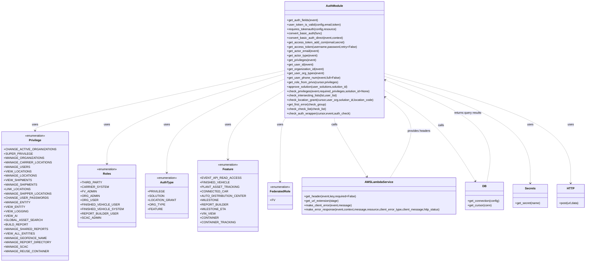

# Diagram: container_tracking_core/container_tracking_service/container_tracking_service/common/aws/lambdas/auth.py


> Auto-generated by Obscura crawlers

## Diagram 1



> SVG rendering failed for this diagram.

## Diagram 2

```mermaid
sequenceDiagram
participant Client
participant APIGateway
participant Decorator as requires_tokenauth
participant AuthModule
participant AWSLambda as AWSLambdaService
participant DB
participant Handler as OriginalFunction

Client->>APIGateway: HTTP request
APIGateway->>Decorator: invoke decorated_handler(event,context)
Decorator->>AuthModule: get_auth_fields(event)
AuthModule->>AWSLambda: get_header(event,"x-user-email")
AWSLambda-->>AuthModule: email or KeyError
AuthModule->>AWSLambda: get_header(event,"x-user-token")
AWSLambda-->>AuthModule: token or KeyError
Decorator->>AuthModule: user_token_is_valid(config,email,token)
AuthModule->>DB: get_connection(config) / get_cursor
DB->>DB: execute SELECT users WHERE email,token,is_active
DB-->>AuthModule: user row or None
AuthModule-->>Decorator: True or False
alt valid token
Decorator->>Handler: call original function(event,context)
Handler-->>Decorator: function response
Decorator-->>APIGateway: success response
else invalid token or errors
Decorator->>AWSLambda: make_client_error(event,str(e))
AWSLambda-->>Decorator: client_error
Decorator->>AWSLambda: make_error_response(...,http_status=401)
AWSLambda-->>APIGateway: error response
```

> SVG rendering failed for this diagram.
