# Diagram: container_tracking_core/container_tracking_service/container_tracking_service/common/aws/lambdas/constants.py

> Auto-generated by Obscura crawlers

## Mermaid

```mermaid
classDiagram
class Account_Number <<enumeration>> {
  PROD
  STAGING
  DEV
}
class Service <<enumeration>> {
  SHIPMENTS
  NG_SHIPMENTS
  NG_PREFERENCES
  LOCATION
  REPLAY
  CONSUMER
  ENTITY
  TRIP_LEG
  DWELL
  FV_SCHEDULED_SERVICES
  ENTITY_SEARCH
  IAM
  MONITORING
  FV_WATCHERS_SERVICE
  FV_SUPPORT_SERVICE
  FV_SHIPMENT_WATCHERS
  FV_SHIPMENT_TRIP_PLAN_SERVICE
  MOBILE
  NOTIFICATION
  COMMENT
  SUBSCRIPTION
}
class CSV_LAMBDAS <<enumeration>> {
  ENTITY
  SHIPMENTS
  MILESTONE
  ENTITY_LOCATIONS
  GET_ORGANIZATIONS_MEMBERS
  TRIP_PLAN
  TRIP_PLAN_SHIPMENT
  GET_FEDERATOR_DETAILS
  LOCATIONS
  CONTAINER_TRACKING
  HOME_CONTAINER_TYPE
  SENSOR_SEARCH
}
class KEY_HEADER <<enumeration>> {
  KEY1
  KEY2
  KEY3
}
class SNSTopics <<enumeration>> {
  AUDIT
  FAILED
}
class PaginationOptions <<enumeration>> {
  PAGE_NUMBER
  PAGE_SIZE
}
class MetaFields <<enumeration>> {
  TOTAL_PAGES
  CURRENT_PAGE
  TOTAL_COUNT
}
class HeaderOptions <<enumeration>> {
  TIMEZONE
  MOCK
  ACCEPT
}
class OrgTypes <<enumeration>> {
  SHIPPER
  CARRIER
  THIRD_PARTY
  FREIGHTVERIFY
  PARTNER
  DEALER
}
class Org_FV_Ids <<enumeration>> {
  TEST_SUPPLIER
  TEST_SHIPPER
  TEST_CARRIER
  TEST_THIRD_PARTY
  INTERMODAL_CARRIER
  LTL_CARRIER
}
class Psycopg2Errors <<enumeration>> {
  ForeignKeyViolation
  NotNullViolation
  UniqueViolation
}
class BATCH_TYPE <<enumeration>> {
  VIN
  ENTITY_ID
  LOCATION
  ACTUAL_TRIP_LEG_ID
  PROD_TYPE
  TRAILER_NUMBER
  ROUTE
  ORDER
  PART
  TRIP_PLAN_ID
  BILL_OF_LADING
  INVALID
  TAX_ID
  TAX_KEY
  VIN_INVOICE
  LAST_8_OF_VIN
  ORDER_NUMBER
}
class BATCH_SEARCH_TYPE <<enumeration>> {
  BASIC
  EXPANDED
}
class State <<enumeration>> {
  PENDING
  PROCESSING
  COMPLETE
  FAILURE
  CONFLICT
  NO_ACTION
  UNAVAILABLE
  NO_VINS
  NO_NOTIFICATION
  CLAIMED
  NO_SOLUTION
  INVALID_SHIPMENT
  INVALID_CHAR
  CHECKSUM_ERROR
  UNKNOWN_VIN
  NO_ARRIVAL
}
class Searchable_Ids <<enumeration>> {
  DURATION
  ENTITY_ID
  SOLUTION_ID
  ACTUAL_TRIP_LEG_ID
  PLANNED_TRIP_LEG_ID
  HOLD_ID
  ENTITY_EXCEPTION_ID
  MEDIA_ID
  POSITION_UPDATE_ID
  PROGRESS_UPDATE_ID
  EXCEPTION_ID
  VIN
  SHIPMENT_ID
  SHIPMENT_DB_ID
  CUSTOMER_ID
  CARRIER_ID
  SENDER_ID
  TRIP_ID
  TRIP_TYPE
  LOCATION_ID
  GRANTEE_ID
  ZONE_ID
  ORGANIZATION_LAD_ID
  OWNER_ID
  USER_ID
  AUTH0_USER_ID
  ORGANIZATION_ID
  GROUP_TYPE
  GROUP_CATEGORY
}
class Logging_Key {
}
class Logging_Key_Shipments <<enumeration>> {
  SHIPMENT_ID
  CARRIER_ID
  CUSTOMER_ID
}
class Logging_Key_Entity <<enumeration>> {
  EXTERNAL_ID
  SOLUTION_ID
}
class Logging_Key_Trip_Leg <<enumeration>> {
  EXTERNAL_ID
  SOLUTION_ID
}
class Logging_Key_Location <<enumeration>> {
  CODE
  OWNER_ID
  CUSTOMER_ID
}
class Logging_Key_Mobile <<enumeration>> {
  MOBILE_NUMBER
  SHIPMENT_ID
  ORG_ID
}
class Logging_Key_Notification <<enumeration>> {
  REFERENCE_ID
}
class Logging_Key_Comment <<enumeration>> {
  REFERENCE_ID
}
class Logging_Key_Subscription <<enumeration>> {
  REFERENCE_ID
}
class QSP {
}
class QSP_Entity <<enumeration>> {
  INBOUND_LOCATION
  OUTBOUND_LOCATION
  CURRENT_LOCATION
  EXCEPTION
  HOLD_TYPE
  SHIPMENT_ID
  CARRIER
  EVERYTHING
  EVERYTHING_REFS
  DESCRIPTION
  DESCRIPTION_SEARCH
  ORIGIN
  ORIGIN_ID
  DESTINATION
  DESTINATION_ID
  LOCATION_ID
  LOCATION
  CLUSTER_OPTION
  ENTITY_ID
  AGE_FROM
  AGE_TO
  WATCHED
  LIFECYCLE_STATE
  LIFECYCLE_STATE_ALL
  LIFECYCLE_CHANGE_TS
  TRIP_PLAN_COMPLETE_SOURCE
  TRIP_PLAN_COMPLETE_TS
  SCHEDULED_ARRIVAL_FROM
  SCHEDULED_ARRIVAL_TO
  PICKUP_DATE_FROM
  PICKUP_DATE_TO
  DELIVERY_DATE_FROM
  DELIVERY_DATE_TO
  ACTUAL_PICKUP_DATE_FROM
  ACTUAL_PICKUP_DATE_TO
  ACTUAL_DELIVERY_DATE_FROM
  ACTUAL_DELIVERY_DATE_TO
  ETA_DELIVERY_DATE_FROM
  ETA_DELIVERY_DATE_TO
  CREATION_FROM
  CREATION_TO
  STATUS_UPDATE_CODE
  STATUS_UPDATE_SEARCH
  PARTNER
  LAD
  POSITION_UPDATE_TO
  POSITION_UPDATE_FROM
  POSITION_UPDATE_CITY
  POSITION_UPDATE_STATE
  SHIPMENT_EXCEPTIONS
  SHIPMENT_STATUSES
  GROUP_CATEGORY
  CATEGORY_GROUP
  CATEGORY_SEARCH
  DAYS_INTERVAL
  REGION_ORIGIN
  REGION_DESTINATION
  ALT_KEY
  UNPAGINATED
  REFERENCE_TYPE
  TRIP_PLAN
  ENTITY_SEARCH_AND
  CURRENT_POSITION
  AT_LOCATION
  ROUTE_NUMBER
  REF
  ACTUAL_TRIP_LEG_REF
  IS_NEW
  PLANNED_TRIP_LEG_REF
  PART_REF
  PART_QUANTITY
  LOCATION_TYPE
  TRANSPORT_MODE
  ORIGIN_NOT_NULL
  ORIGIN_NULL
  DESTINATION_NOT_NULL
  DESTINATION_NULL
  CARRIER_NOT_NULL
  CARRIER_NULL
  DESCRIPTION_NOT_NULL
  DESCRIPTION_NULL
  PARTNER_NOT_NULL
  PARTNER_NULL
  ITSS_NOT_NULL
  ITSS_NULL
  SPOT_BY_AUTH_NOT_NULL
  SPOT_BY_AUTH_NULL
  CURRENT_POSITION_CODES_NOT_NULL
  CURRENT_POSITION_CODES_NULL
  ROUTE_NUMBER_NOT_NULL
  ROUTE_NUMBER_NULL
  POSITION_UPDATE_CITY_NOT_NULL
  POSITION_UPDATE_CITY_NULL
  POSITION_UPDATE_STATE_NOT_NULL
  POSITION_UPDATE_STATE_NULL
  INCLUDE_CONFIGURATIONS
  NGAVS_STATUS_CODE
  FUZZY_DESCRIPTION
  FUZZY_PARTNER
  FUZZY_ITSS
  FUZZY_SB
  FUZZY_CURRENT_POSITION_CODE
  FUZZY_ORIGIN
  FUZZY_DESTINATION
  FUZZY_CARRIER
  FUZZY_ROUTE_NUMBER
  FUZZY_POSITION_CITY
  FUZZY_POSITION_STATE
  SHIPPER_ID
  INBOUND_STATUS
  PICKUP_LOCATION
}
class QSP_EntityLocation <<enumeration>> {
  GROUP
  ELS
  LOCATION_IDS
  SEARCH
  LOCATION
  PERCENT_FROM
  PERCENT_TO
  CAPACITY_LOWER
  CAPACITY_UPPER
  LAD
  LOB
  COUNTRY
  LIFECYCLE_STATE
  DEMAND_AREA
  ENTITY_ID
  DESCRIPTION
  EVERYTHING
  WATCHED
  DETAIL
  ENTITY_EXTERNAL_IDS_BY_LOCATION
}
class QSP_EntityGroup <<enumeration>> {
  ENTITY_ID
  INTERNAL_ENTITY_ID
}
class QSP_LocationGrant <<enumeration>> {
  LOCATION_IDS
  GRANTEE_ID
  GRANTER_ID
  DEREFERENCE
  POINT_OF_VIEW
  POV_GRANTER
  POV_GRANTEE
  GRANT_TYPE
}
class QSP_Notification <<enumeration>> {
  READ
  EVENT_TS_FROM
  EVENT_TS_TO
}
class VersionOptions {
}
class VersionOptions_ContainerTracking <<enumeration>> {
  BASIC
  SAVED_SEARCH
  MINIFY
}
class VersionOptions_ContainerTrackingBucket <<enumeration>> {
  BASIC
  ALL
}
class VersionOptions_NGShipments <<enumeration>> {
  BASIC
  ID
  TOTALS
  COUNT
  SHIPMENT
  WATCH_DASHBOARD
}
class VersionOptions_Entity <<enumeration>> {
  FULL
  ENTITY
  CLUSTER
  ADC
  CONNECTED
  COUNT
  SAVED_SEARCH
  LOG
  REFERENCES_CHANGES
  INBOUND_VINS
  INBOUND_VINS_COUNT
  INTERNAL_ID
}
class VersionOptions_EntityLocation <<enumeration>> {
  BY_DAY
  BY_BUCKET
  DETAIL
  BY_ADC
}
class VersionOptions_StatusUpdate <<enumeration>> {
  FULL
  COUNT
}
class VersionOptions_ShipmentPatch <<enumeration>> {
  InboundShipmentEvent
}
class VersionOptions_APILogs <<enumeration>> {
  FULL
  COUNT
  MILESTONE
  MILESTONE_COUNT
}
class VersionOptions_LOCATIONS <<enumeration>> {
  SUMMARY
  COUNT
  FULL
  CHILD_IDS
  BASIC
}
class VersionOptions_Iam <<enumeration>> {
  FULL
  COUNT
}
class PositionUpdate {
}
class PositionUpdate_SourceType <<enumeration>> {
  DEFAULT
  SHIPMENT
  MILESTONE
}
class PositionUpdate_PositionType <<enumeration>> {
  AT_LOCATION
  ON_RAIL
  ON_ROAD
  ON_WATER
}
class MVW {
}
class MVW_Entity <<enumeration>> {
  ROUTE_NUMBER
  ACTIVE_LOCATION
  ORIGIN_DESTINATION_LOCATION
}
class MVW_Shipment <<enumeration>> {
}
%% Associations mapping major relationships
Service --> Logging_Key_Shipments : "logs for shipments"
Service --> Logging_Key_Entity : "logs for entity"
Service --> Logging_Key_Trip_Leg : "logs for trip_leg"
Service --> Logging_Key_Location : "logs for location"
Service --> Logging_Key_Mobile : "logs for mobile"
Service --> Logging_Key_Notification : "logs for notification"
Service --> Logging_Key_Comment : "logs for comment"
Service --> Logging_Key_Subscription : "logs for subscription"
Logging_Key_Shipments --> KEY_HEADER : "KEY1,KEY2,KEY3"
Logging_Key_Entity --> KEY_HEADER : "KEY1,KEY2"
Logging_Key_Trip_Leg --> KEY_HEADER : "KEY1,KEY2"
Logging_Key_Location --> KEY_HEADER : "KEY1,KEY2,KEY3"
Logging_Key_Mobile --> KEY_HEADER : "KEY1,KEY2,KEY3"
Logging_Key_Notification --> KEY_HEADER : "KEY1"
Logging_Key_Comment --> KEY_HEADER : "KEY1"
Logging_Key_Subscription --> KEY_HEADER : "KEY1"
QSP_Entity --> QSP_EntityLocation : "related qsp groups"
PositionUpdate --> PositionUpdate_SourceType : "has"
PositionUpdate --> PositionUpdate_PositionType : "has"
VersionOptions --> VersionOptions_ContainerTracking
VersionOptions --> VersionOptions_NGShipments
VersionOptions --> VersionOptions_Entity
VersionOptions --> VersionOptions_EntityLocation
VersionOptions --> VersionOptions_StatusUpdate
VersionOptions --> VersionOptions_APILogs
MVW --> MVW_Entity
MVW --> MVW_Shipment
```

> SVG rendering failed for this diagram.
