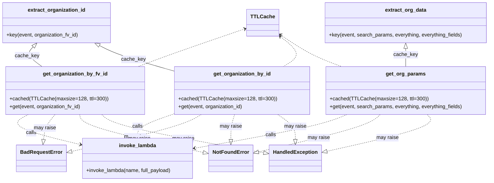

# Diagram: container_tracking_core/container_tracking_service/container_tracking_service/common/aws/lambdas/invokinators/invokinator_organization.py


> Auto-generated by Obscura crawlers

## Diagram 1

```mermaid
graph TD
  Event[Incoming event]
  EOID[extract_organization_id(event, organization_fv_id)]
  EOD[extract_org_data(event, search_params, everything, everything_fields)]
  GOBF[get_organization_by_fv_id(event, organization_fv_id)]
  GOBID[get_organization_by_id(event, organization_id)]
  GOP[get_org_params(event, search_params, everything, everything_fields)]
  Deepcopy[deepcopy(event) & set request params]
  Invoke[invoke_lambda("get_organizations", full_payload=invoke_event)]
  Parse[json.loads(body) -> organization_body]
  StatusCheck[status_code evaluation]
  NotFound[NotFoundError raised]
  BadRequest[BadRequestError raised]
  Handled[HandledException raised]
  Return[return organization response]

  Event -->|organization_fv_id provided?| GOBF
  Event -->|organization_id provided?| GOBID
  Event -->|search_params/everything| GOP

  GOBF -->|uses key function| EOID
  GOBID -->|uses key function| EOID
  GOP -->|uses key function| EOD

  GOBF -->|validate input| BadRequest
  GOBID -->|validate input| BadRequest

  GOBF --> Deepcopy
  GOBID --> Deepcopy
  GOP --> Deepcopy
  Deepcopy --> Invoke
  Invoke --> Parse
  Parse --> StatusCheck
  StatusCheck -->|404| NotFound
  StatusCheck -->|>=400 and !=404| Handled
  StatusCheck -->|200| Return
```

> SVG rendering failed for this diagram.

## Diagram 2



### SVG

<svg id="container" width="1501.6875" xmlns="http://www.w3.org/2000/svg" class="classDiagram" height="566" viewBox="0 0 1501.6875 566" role="graphics-document document" aria-roledescription="class"><style>#container{font-family:"trebuchet ms",verdana,arial,sans-serif;font-size:16px;fill:#333;}@keyframes edge-animation-frame{from{stroke-dashoffset:0;}}@keyframes dash{to{stroke-dashoffset:0;}}#container .edge-animation-slow{stroke-dasharray:9,5!important;stroke-dashoffset:900;animation:dash 50s linear infinite;stroke-linecap:round;}#container .edge-animation-fast{stroke-dasharray:9,5!important;stroke-dashoffset:900;animation:dash 20s linear infinite;stroke-linecap:round;}#container .error-icon{fill:#552222;}#container .error-text{fill:#552222;stroke:#552222;}#container .edge-thickness-normal{stroke-width:1px;}#container .edge-thickness-thick{stroke-width:3.5px;}#container .edge-pattern-solid{stroke-dasharray:0;}#container .edge-thickness-invisible{stroke-width:0;fill:none;}#container .edge-pattern-dashed{stroke-dasharray:3;}#container .edge-pattern-dotted{stroke-dasharray:2;}#container .marker{fill:#333333;stroke:#333333;}#container .marker.cross{stroke:#333333;}#container svg{font-family:"trebuchet ms",verdana,arial,sans-serif;font-size:16px;}#container p{margin:0;}#container g.classGroup text{fill:#9370DB;stroke:none;font-family:"trebuchet ms",verdana,arial,sans-serif;font-size:10px;}#container g.classGroup text .title{font-weight:bolder;}#container .nodeLabel,#container .edgeLabel{color:#131300;}#container .edgeLabel .label rect{fill:#ECECFF;}#container .label text{fill:#131300;}#container .labelBkg{background:#ECECFF;}#container .edgeLabel .label span{background:#ECECFF;}#container .classTitle{font-weight:bolder;}#container .node rect,#container .node circle,#container .node ellipse,#container .node polygon,#container .node path{fill:#ECECFF;stroke:#9370DB;stroke-width:1px;}#container .divider{stroke:#9370DB;stroke-width:1;}#container g.clickable{cursor:pointer;}#container g.classGroup rect{fill:#ECECFF;stroke:#9370DB;}#container g.classGroup line{stroke:#9370DB;stroke-width:1;}#container .classLabel .box{stroke:none;stroke-width:0;fill:#ECECFF;opacity:0.5;}#container .classLabel .label{fill:#9370DB;font-size:10px;}#container .relation{stroke:#333333;stroke-width:1;fill:none;}#container .dashed-line{stroke-dasharray:3;}#container .dotted-line{stroke-dasharray:1 2;}#container #compositionStart,#container .composition{fill:#333333!important;stroke:#333333!important;stroke-width:1;}#container #compositionEnd,#container .composition{fill:#333333!important;stroke:#333333!important;stroke-width:1;}#container #dependencyStart,#container .dependency{fill:#333333!important;stroke:#333333!important;stroke-width:1;}#container #dependencyStart,#container .dependency{fill:#333333!important;stroke:#333333!important;stroke-width:1;}#container #extensionStart,#container .extension{fill:transparent!important;stroke:#333333!important;stroke-width:1;}#container #extensionEnd,#container .extension{fill:transparent!important;stroke:#333333!important;stroke-width:1;}#container #aggregationStart,#container .aggregation{fill:transparent!important;stroke:#333333!important;stroke-width:1;}#container #aggregationEnd,#container .aggregation{fill:transparent!important;stroke:#333333!important;stroke-width:1;}#container #lollipopStart,#container .lollipop{fill:#ECECFF!important;stroke:#333333!important;stroke-width:1;}#container #lollipopEnd,#container .lollipop{fill:#ECECFF!important;stroke:#333333!important;stroke-width:1;}#container .edgeTerminals{font-size:11px;line-height:initial;}#container .classTitleText{text-anchor:middle;font-size:18px;fill:#333;}#container .label-icon{display:inline-block;height:1em;overflow:visible;vertical-align:-0.125em;}#container .node .label-icon path{fill:currentColor;stroke:revert;stroke-width:revert;}#container :root{--mermaid-font-family:"trebuchet ms",verdana,arial,sans-serif;}</style><g><defs><marker id="container_class-aggregationStart" class="marker aggregation class" refX="18" refY="7" markerWidth="190" markerHeight="240" orient="auto"><path d="M 18,7 L9,13 L1,7 L9,1 Z"></path></marker></defs><defs><marker id="container_class-aggregationEnd" class="marker aggregation class" refX="1" refY="7" markerWidth="20" markerHeight="28" orient="auto"><path d="M 18,7 L9,13 L1,7 L9,1 Z"></path></marker></defs><defs><marker id="container_class-extensionStart" class="marker extension class" refX="18" refY="7" markerWidth="190" markerHeight="240" orient="auto"><path d="M 1,7 L18,13 V 1 Z"></path></marker></defs><defs><marker id="container_class-extensionEnd" class="marker extension class" refX="1" refY="7" markerWidth="20" markerHeight="28" orient="auto"><path d="M 1,1 V 13 L18,7 Z"></path></marker></defs><defs><marker id="container_class-compositionStart" class="marker composition class" refX="18" refY="7" markerWidth="190" markerHeight="240" orient="auto"><path d="M 18,7 L9,13 L1,7 L9,1 Z"></path></marker></defs><defs><marker id="container_class-compositionEnd" class="marker composition class" refX="1" refY="7" markerWidth="20" markerHeight="28" orient="auto"><path d="M 18,7 L9,13 L1,7 L9,1 Z"></path></marker></defs><defs><marker id="container_class-dependencyStart" class="marker dependency class" refX="6" refY="7" markerWidth="190" markerHeight="240" orient="auto"><path d="M 5,7 L9,13 L1,7 L9,1 Z"></path></marker></defs><defs><marker id="container_class-dependencyEnd" class="marker dependency class" refX="13" refY="7" markerWidth="20" markerHeight="28" orient="auto"><path d="M 18,7 L9,13 L14,7 L9,1 Z"></path></marker></defs><defs><marker id="container_class-lollipopStart" class="marker lollipop class" refX="13" refY="7" markerWidth="190" markerHeight="240" orient="auto"><circle stroke="black" fill="transparent" cx="7" cy="7" r="6"></circle></marker></defs><defs><marker id="container_class-lollipopEnd" class="marker lollipop class" refX="1" refY="7" markerWidth="190" markerHeight="240" orient="auto"><circle stroke="black" fill="transparent" cx="7" cy="7" r="6"></circle></marker></defs><g class="root"><g class="clusters"></g><g class="edgePaths"><path d="M105.503,146.537L101.649,150.614C97.795,154.691,90.088,162.846,94.591,173.089C99.094,183.333,115.807,195.667,124.164,201.833L132.52,208" id="id_extract_organization_id_get_organization_by_fv_id_1" class="edge-thickness-normal edge-pattern-solid relation" style=";;;" data-edge="true" data-et="edge" data-id="id_extract_organization_id_get_organization_by_fv_id_1" data-points="W3sieCI6MTE3LjM1MTY0MDYyNSwieSI6MTM0fSx7IngiOjgyLjM4MDg1OTM3NSwieSI6MTcxfSx7IngiOjEzMi41MjAyOTg1NDkxMDcxNCwieSI6MjA4fV0=" marker-start="url(#container_class-extensionStart)"></path><path d="M303.912,142.458L312.367,147.215C320.823,151.972,337.734,161.486,376.885,175.154C416.036,188.821,477.428,206.643,508.124,215.553L538.82,224.464" id="id_extract_organization_id_get_organization_by_id_2" class="edge-thickness-normal edge-pattern-solid relation" style=";;;" data-edge="true" data-et="edge" data-id="id_extract_organization_id_get_organization_by_id_2" data-points="W3sieCI6Mjg4Ljg3Nzc1MzkwNjI1LCJ5IjoxMzR9LHsieCI6MzU0LjY0NDUzMTI1LCJ5IjoxNzF9LHsieCI6NTM4LjgyMDMxMjUsInkiOjIyNC40NjM5NTE5Njk3MDc3fV0=" marker-start="url(#container_class-extensionStart)"></path><path d="M1241.555,151.25L1241.555,154.542C1241.555,157.833,1241.555,164.417,1241.555,173.875C1241.555,183.333,1241.555,195.667,1241.555,201.833L1241.555,208" id="id_extract_org_data_get_org_params_3" class="edge-thickness-normal edge-pattern-solid relation" style=";;;" data-edge="true" data-et="edge" data-id="id_extract_org_data_get_org_params_3" data-points="W3sieCI6MTI0MS41NTQ2ODc1LCJ5IjoxMzR9LHsieCI6MTI0MS41NTQ2ODc1LCJ5IjoxNzF9LHsieCI6MTI0MS41NTQ2ODc1LCJ5IjoyMDh9XQ==" marker-start="url(#container_class-extensionStart)"></path><path d="M93.724,358L82.178,364.167C70.631,370.333,47.538,382.667,71.847,397.925C96.156,413.183,167.867,431.367,203.723,440.458L239.579,449.55" id="id_get_organization_by_fv_id_invoke_lambda_4" class="edge-thickness-normal edge-pattern-dashed relation" style=";;;" data-edge="true" data-et="edge" data-id="id_get_organization_by_fv_id_invoke_lambda_4" data-points="W3sieCI6OTMuNzI0MTczNDA5NTk4MjIsInkiOjM1OH0seyJ4IjoyNC40NDUzMTI1LCJ5IjozOTV9LHsieCI6MjQ1LjM5NDUzMTI1LCJ5Ijo0NTEuMDI0NjAzNTU5NzkwNH1d" marker-end="url(#container_class-dependencyEnd)"></path><path d="M538.82,353.216L518.821,360.18C498.822,367.144,458.823,381.072,438.824,393.203C418.824,405.333,418.824,415.667,418.824,420.833L418.824,426" id="id_get_organization_by_id_invoke_lambda_5" class="edge-thickness-normal edge-pattern-dashed relation" style=";;;" data-edge="true" data-et="edge" data-id="id_get_organization_by_id_invoke_lambda_5" data-points="W3sieCI6NTM4LjgyMDMxMjUsInkiOjM1My4yMTYxMDEzMzQ2OTM1fSx7IngiOjQxOC44MjQyMTg3NSwieSI6Mzk1fSx7IngiOjQxOC44MjQyMTg3NSwieSI6NDMyfV0=" marker-end="url(#container_class-dependencyEnd)"></path><path d="M1061.586,358L1046.788,364.167C1031.991,370.333,1002.396,382.667,925.158,400.105C847.92,417.543,723.039,440.085,660.599,451.357L598.158,462.628" id="id_get_org_params_invoke_lambda_6" class="edge-thickness-normal edge-pattern-dashed relation" style=";;;" data-edge="true" data-et="edge" data-id="id_get_org_params_invoke_lambda_6" data-points="W3sieCI6MTA2MS41ODU1NTM4NTA0NDYzLCJ5IjozNTh9LHsieCI6OTcyLjgwMDc4MTI1LCJ5IjozOTV9LHsieCI6NTkyLjI1MzkwNjI1LCJ5Ijo0NjMuNjkzNjc3ODEyNDA3NDN9XQ==" marker-end="url(#container_class-dependencyEnd)"></path><path d="M171.417,358L166.259,364.167C161.1,370.333,150.784,382.667,144.301,395.677C137.818,408.688,135.169,422.376,133.844,429.22L132.519,436.064" id="id_get_organization_by_fv_id_BadRequestError_7" class="edge-thickness-normal edge-pattern-dashed relation" style=";;;" data-edge="true" data-et="edge" data-id="id_get_organization_by_fv_id_BadRequestError_7" data-points="W3sieCI6MTcxLjQxNzEzMTY5NjQyODU2LCJ5IjozNTh9LHsieCI6MTQwLjQ2Njc5Njg3NSwieSI6Mzk1fSx7IngiOjEyOS4yNDE3NTc4MTI1LCJ5Ijo0NTN9XQ==" marker-end="url(#container_class-extensionEnd)"></path><path d="M615.735,358L605.479,364.167C595.223,370.333,574.711,382.667,507.456,401.995C440.2,421.322,326.201,447.645,269.202,460.806L212.202,473.967" id="id_get_organization_by_id_BadRequestError_8" class="edge-thickness-normal edge-pattern-dashed relation" style=";;;" data-edge="true" data-et="edge" data-id="id_get_organization_by_id_BadRequestError_8" data-points="W3sieCI6NjE1LjczNDY4ODg5NTA4OTMsInkiOjM1OH0seyJ4Ijo1NTQuMTk5MjE4NzUsInkiOjM5NX0seyJ4IjoxOTUuMzk0NTMxMjUsInkiOjQ3Ny44NDgzODA5ODY3NDEyM31d" marker-end="url(#container_class-extensionEnd)"></path><path d="M247.291,358L248.371,364.167C249.451,370.333,251.611,382.667,314.631,402.476C377.65,422.285,501.529,449.57,563.468,463.213L625.408,476.856" id="id_get_organization_by_fv_id_NotFoundError_9" class="edge-thickness-normal edge-pattern-dashed relation" style=";;;" data-edge="true" data-et="edge" data-id="id_get_organization_by_fv_id_NotFoundError_9" data-points="W3sieCI6MjQ3LjI5MDgwNjM2MTYwNzE0LCJ5IjozNTh9LHsieCI6MjUzLjc3MTQ4NDM3NSwieSI6Mzk1fSx7IngiOjY0Mi4yNTM5MDYyNSwieSI6NDgwLjU2NjIzODYyNjgzMX1d" marker-end="url(#container_class-extensionEnd)"></path><path d="M718.582,358L716.783,364.167C714.983,370.333,711.384,382.667,709.585,395.625C707.785,408.583,707.785,422.167,707.785,428.958L707.785,435.75" id="id_get_organization_by_id_NotFoundError_10" class="edge-thickness-normal edge-pattern-dashed relation" style=";;;" data-edge="true" data-et="edge" data-id="id_get_organization_by_id_NotFoundError_10" data-points="W3sieCI6NzE4LjU4MjQxNDg5OTU1MzYsInkiOjM1OH0seyJ4Ijo3MDcuNzg1MTU2MjUsInkiOjM5NX0seyJ4Ijo3MDcuNzg1MTU2MjUsInkiOjQ1M31d" marker-end="url(#container_class-extensionEnd)"></path><path d="M1164.433,358L1158.092,364.167C1151.751,370.333,1139.069,382.667,1076.679,402.223C1014.289,421.779,902.192,448.558,846.143,461.948L790.094,475.337" id="id_get_org_params_NotFoundError_11" class="edge-thickness-normal edge-pattern-dashed relation" style=";;;" data-edge="true" data-et="edge" data-id="id_get_org_params_NotFoundError_11" data-points="W3sieCI6MTE2NC40MzMyNzk4NTQ5MTA4LCJ5IjozNTh9LHsieCI6MTEyNi4zODY3MTg3NSwieSI6Mzk1fSx7IngiOjc3My4zMTY0MDYyNSwieSI6NDc5LjM0NTE5Njk5MTQ3MDg2fV0=" marker-end="url(#container_class-extensionEnd)"></path><path d="M310.205,358L316.458,364.167C322.711,370.333,335.217,382.667,417.906,402.631C500.595,422.596,653.468,450.191,729.904,463.989L806.341,477.787" id="id_get_organization_by_fv_id_HandledException_12" class="edge-thickness-normal edge-pattern-dashed relation" style=";;;" data-edge="true" data-et="edge" data-id="id_get_organization_by_fv_id_HandledException_12" data-points="W3sieCI6MzEwLjIwNDUzNzUyNzkwMTgsInkiOjM1OH0seyJ4IjozNDcuNzIyNjU2MjUsInkiOjM5NX0seyJ4Ijo4MjMuMzE2NDA2MjUsInkiOjQ4MC44NTA4NzkyOTU5OTkxfV0=" marker-end="url(#container_class-extensionEnd)"></path><path d="M848.436,358L857.313,364.167C866.19,370.333,883.945,382.667,892.822,395.625C901.699,408.583,901.699,422.167,901.699,428.958L901.699,435.75" id="id_get_organization_by_id_HandledException_13" class="edge-thickness-normal edge-pattern-dashed relation" style=";;;" data-edge="true" data-et="edge" data-id="id_get_organization_by_id_HandledException_13" data-points="W3sieCI6ODQ4LjQzNTU4MTc1MjIzMjEsInkiOjM1OH0seyJ4Ijo5MDEuNjk5MjE4NzUsInkiOjM5NX0seyJ4Ijo5MDEuNjk5MjE4NzUsInkiOjQ1M31d" marker-end="url(#container_class-extensionEnd)"></path><path d="M1306.481,358L1311.82,364.167C1317.158,370.333,1327.835,382.667,1276.238,401.868C1224.64,421.069,1110.769,447.138,1053.833,460.172L996.897,473.206" id="id_get_org_params_HandledException_14" class="edge-thickness-normal edge-pattern-dashed relation" style=";;;" data-edge="true" data-et="edge" data-id="id_get_org_params_HandledException_14" data-points="W3sieCI6MTMwNi40ODEyNzA5MjYzMzkyLCJ5IjozNTh9LHsieCI6MTMzOC41MTE3MTg3NSwieSI6Mzk1fSx7IngiOjk4MC4wODIwMzEyNSwieSI6NDc3LjA1NTczMDQzMzUzODQzfV0=" marker-end="url(#container_class-extensionEnd)"></path><path d="M749.877,89.065L710.687,102.721C671.496,116.377,593.115,143.688,538.476,163.511C483.837,183.333,452.94,195.667,437.491,201.833L422.043,208" id="id_TTLCache_get_organization_by_fv_id_15" class="edge-thickness-normal edge-pattern-dashed relation" style=";;;" data-edge="true" data-et="edge" data-id="id_TTLCache_get_organization_by_fv_id_15" data-points="W3sieCI6NzU1LjU0Mjk2ODc1LCJ5Ijo4Ny4wOTExNDA0ODEwMTkyMX0seyJ4Ijo1MTQuNzM0Mzc1LCJ5IjoxNzF9LHsieCI6NDIyLjA0Mjc0MjA0Nzk5MTA2LCJ5IjoyMDh9XQ==" marker-start="url(#container_class-dependencyStart)"></path><path d="M852.595,111.527L865.038,121.439C877.48,131.351,902.365,151.176,904.523,167.255C906.682,183.333,886.114,195.667,875.83,201.833L865.545,208" id="id_TTLCache_get_organization_by_id_16" class="edge-thickness-normal edge-pattern-dashed relation" style=";;;" data-edge="true" data-et="edge" data-id="id_TTLCache_get_organization_by_id_16" data-points="W3sieCI6ODQ3LjkwMjM0Mzc1LCJ5IjoxMDcuNzg4NTQ4MzExODA5NTZ9LHsieCI6OTI3LjI1LCJ5IjoxNzF9LHsieCI6ODY1LjU0NTQ3OTkxMDcxNDMsInkiOjIwOH1d" marker-start="url(#container_class-dependencyStart)"></path><path d="M852.847,106.131L868.581,116.942C884.315,127.754,915.782,149.377,947.721,166.355C979.659,183.333,1012.067,195.667,1028.271,201.833L1044.476,208" id="id_TTLCache_get_org_params_17" class="edge-thickness-normal edge-pattern-dashed relation" style=";;;" data-edge="true" data-et="edge" data-id="id_TTLCache_get_org_params_17" data-points="W3sieCI6ODQ3LjkwMjM0Mzc1LCJ5IjoxMDIuNzMyNjUzMzM1MTIyOH0seyJ4Ijo5NDcuMjUsInkiOjE3MX0seyJ4IjoxMDQ0LjQ3NTY1NTY5MTk2NDIsInkiOjIwOH1d" marker-start="url(#container_class-dependencyStart)"></path></g><g class="edgeLabels"><g class="edgeLabel" transform="translate(86.96814, 174.38515)"><g class="label" data-id="id_extract_organization_id_get_organization_by_fv_id_1" transform="translate(-37.2578125, -12)"><foreignObject width="74.515625" height="24"><div xmlns="http://www.w3.org/1999/xhtml" class="labelBkg" style="display: table-cell; white-space: nowrap; line-height: 1.5; max-width: 200px; text-align: center;"><span class="edgeLabel"><p>cache_key</p></span></div></foreignObject></g></g><g class="edgeLabel" transform="translate(410.49804, 187.21358)"><g class="label" data-id="id_extract_organization_id_get_organization_by_id_2" transform="translate(-37.2578125, -12)"><foreignObject width="74.515625" height="24"><div xmlns="http://www.w3.org/1999/xhtml" class="labelBkg" style="display: table-cell; white-space: nowrap; line-height: 1.5; max-width: 200px; text-align: center;"><span class="edgeLabel"><p>cache_key</p></span></div></foreignObject></g></g><g class="edgeLabel" transform="translate(1241.5546875, 171)"><g class="label" data-id="id_extract_org_data_get_org_params_3" transform="translate(-37.2578125, -12)"><foreignObject width="74.515625" height="24"><div xmlns="http://www.w3.org/1999/xhtml" class="labelBkg" style="display: table-cell; white-space: nowrap; line-height: 1.5; max-width: 200px; text-align: center;"><span class="edgeLabel"><p>cache_key</p></span></div></foreignObject></g></g><g class="edgeLabel" transform="translate(24.4453125, 395)"><g class="label" data-id="id_get_organization_by_fv_id_invoke_lambda_4" transform="translate(-16.4453125, -12)"><foreignObject width="32.890625" height="24"><div xmlns="http://www.w3.org/1999/xhtml" class="labelBkg" style="display: table-cell; white-space: nowrap; line-height: 1.5; max-width: 200px; text-align: center;"><span class="edgeLabel"><p>calls</p></span></div></foreignObject></g></g><g class="edgeLabel" transform="translate(418.82421875, 395)"><g class="label" data-id="id_get_organization_by_id_invoke_lambda_5" transform="translate(-16.4453125, -12)"><foreignObject width="32.890625" height="24"><div xmlns="http://www.w3.org/1999/xhtml" class="labelBkg" style="display: table-cell; white-space: nowrap; line-height: 1.5; max-width: 200px; text-align: center;"><span class="edgeLabel"><p>calls</p></span></div></foreignObject></g></g><g class="edgeLabel" transform="translate(829.85541, 420.80351)"><g class="label" data-id="id_get_org_params_invoke_lambda_6" transform="translate(-16.4453125, -12)"><foreignObject width="32.890625" height="24"><div xmlns="http://www.w3.org/1999/xhtml" class="labelBkg" style="display: table-cell; white-space: nowrap; line-height: 1.5; max-width: 200px; text-align: center;"><span class="edgeLabel"><p>calls</p></span></div></foreignObject></g></g><g class="edgeLabel" transform="translate(139.43713, 400.3203)"><g class="label" data-id="id_get_organization_by_fv_id_BadRequestError_7" transform="translate(-34.65625, -12)"><foreignObject width="69.3125" height="24"><div xmlns="http://www.w3.org/1999/xhtml" class="labelBkg" style="display: table-cell; white-space: nowrap; line-height: 1.5; max-width: 200px; text-align: center;"><span class="edgeLabel"><p>may raise</p></span></div></foreignObject></g></g><g class="edgeLabel" transform="translate(409.77778, 428.34706)"><g class="label" data-id="id_get_organization_by_id_BadRequestError_8" transform="translate(-34.65625, -12)"><foreignObject width="69.3125" height="24"><div xmlns="http://www.w3.org/1999/xhtml" class="labelBkg" style="display: table-cell; white-space: nowrap; line-height: 1.5; max-width: 200px; text-align: center;"><span class="edgeLabel"><p>may raise</p></span></div></foreignObject></g></g><g class="edgeLabel" transform="translate(429.67071, 433.74316)"><g class="label" data-id="id_get_organization_by_fv_id_NotFoundError_9" transform="translate(-34.65625, -12)"><foreignObject width="69.3125" height="24"><div xmlns="http://www.w3.org/1999/xhtml" class="labelBkg" style="display: table-cell; white-space: nowrap; line-height: 1.5; max-width: 200px; text-align: center;"><span class="edgeLabel"><p>may raise</p></span></div></foreignObject></g></g><g class="edgeLabel" transform="translate(707.78515625, 395)"><g class="label" data-id="id_get_organization_by_id_NotFoundError_10" transform="translate(-34.65625, -12)"><foreignObject width="69.3125" height="24"><div xmlns="http://www.w3.org/1999/xhtml" class="labelBkg" style="display: table-cell; white-space: nowrap; line-height: 1.5; max-width: 200px; text-align: center;"><span class="edgeLabel"><p>may raise</p></span></div></foreignObject></g></g><g class="edgeLabel" transform="translate(975.66087, 431.007)"><g class="label" data-id="id_get_org_params_NotFoundError_11" transform="translate(-34.65625, -12)"><foreignObject width="69.3125" height="24"><div xmlns="http://www.w3.org/1999/xhtml" class="labelBkg" style="display: table-cell; white-space: nowrap; line-height: 1.5; max-width: 200px; text-align: center;"><span class="edgeLabel"><p>may raise</p></span></div></foreignObject></g></g><g class="edgeLabel" transform="translate(559.5918, 433.24515)"><g class="label" data-id="id_get_organization_by_fv_id_HandledException_12" transform="translate(-34.65625, -12)"><foreignObject width="69.3125" height="24"><div xmlns="http://www.w3.org/1999/xhtml" class="labelBkg" style="display: table-cell; white-space: nowrap; line-height: 1.5; max-width: 200px; text-align: center;"><span class="edgeLabel"><p>may raise</p></span></div></foreignObject></g></g><g class="edgeLabel" transform="translate(901.69921875, 395)"><g class="label" data-id="id_get_organization_by_id_HandledException_13" transform="translate(-34.65625, -12)"><foreignObject width="69.3125" height="24"><div xmlns="http://www.w3.org/1999/xhtml" class="labelBkg" style="display: table-cell; white-space: nowrap; line-height: 1.5; max-width: 200px; text-align: center;"><span class="edgeLabel"><p>may raise</p></span></div></foreignObject></g></g><g class="edgeLabel" transform="translate(1183.14893, 430.56739)"><g class="label" data-id="id_get_org_params_HandledException_14" transform="translate(-34.65625, -12)"><foreignObject width="69.3125" height="24"><div xmlns="http://www.w3.org/1999/xhtml" class="labelBkg" style="display: table-cell; white-space: nowrap; line-height: 1.5; max-width: 200px; text-align: center;"><span class="edgeLabel"><p>may raise</p></span></div></foreignObject></g></g><g class="edgeLabel"><g class="label" data-id="id_TTLCache_get_organization_by_fv_id_15" transform="translate(0, 0)"><foreignObject width="0" height="0"><div xmlns="http://www.w3.org/1999/xhtml" class="labelBkg" style="display: table-cell; white-space: nowrap; line-height: 1.5; max-width: 200px; text-align: center;"><span class="edgeLabel"></span></div></foreignObject></g></g><g class="edgeLabel"><g class="label" data-id="id_TTLCache_get_organization_by_id_16" transform="translate(0, 0)"><foreignObject width="0" height="0"><div xmlns="http://www.w3.org/1999/xhtml" class="labelBkg" style="display: table-cell; white-space: nowrap; line-height: 1.5; max-width: 200px; text-align: center;"><span class="edgeLabel"></span></div></foreignObject></g></g><g class="edgeLabel"><g class="label" data-id="id_TTLCache_get_org_params_17" transform="translate(0, 0)"><foreignObject width="0" height="0"><div xmlns="http://www.w3.org/1999/xhtml" class="labelBkg" style="display: table-cell; white-space: nowrap; line-height: 1.5; max-width: 200px; text-align: center;"><span class="edgeLabel"></span></div></foreignObject></g></g></g><g class="nodes"><g class="node default" id="classId-extract_organization_id-0" transform="translate(176.896484375, 71)"><g class="basic label-container"><path d="M-167.8515625 -63 L167.8515625 -63 L167.8515625 63 L-167.8515625 63" stroke="none" stroke-width="0" fill="#ECECFF" style=""></path><path d="M-167.8515625 -63 C-80.94308088858809 -63, 5.96540072282383 -63, 167.8515625 -63 M-167.8515625 -63 C-51.65999917960373 -63, 64.53156414079254 -63, 167.8515625 -63 M167.8515625 -63 C167.8515625 -36.56336798868182, 167.8515625 -10.126735977363637, 167.8515625 63 M167.8515625 -63 C167.8515625 -36.54282675316479, 167.8515625 -10.085653506329578, 167.8515625 63 M167.8515625 63 C49.951111717129336 63, -67.94933906574133 63, -167.8515625 63 M167.8515625 63 C37.18492380478267 63, -93.48171489043466 63, -167.8515625 63 M-167.8515625 63 C-167.8515625 19.5010359912365, -167.8515625 -23.997928017527002, -167.8515625 -63 M-167.8515625 63 C-167.8515625 15.081578975825401, -167.8515625 -32.8368420483492, -167.8515625 -63" stroke="#9370DB" stroke-width="1.3" fill="none" stroke-dasharray="0 0" style=""></path></g><g class="annotation-group text" transform="translate(0, -39)"></g><g class="label-group text" transform="translate(-86.78125, -39)"><g class="label" style="font-weight: bolder" transform="translate(0,-12)"><foreignObject width="173.5625" height="24"><div xmlns="http://www.w3.org/1999/xhtml" style="display: table-cell; white-space: nowrap; line-height: 1.5; max-width: 221px; text-align: center;"><span class="nodeLabel markdown-node-label" style=""><p>extract_organization_id</p></span></div></foreignObject></g></g><g class="members-group text" transform="translate(-155.8515625, 9)"></g><g class="methods-group text" transform="translate(-155.8515625, 39)"><g class="label" style="" transform="translate(0,-12)"><foreignObject width="224.921875" height="24"><div xmlns="http://www.w3.org/1999/xhtml" style="display: table-cell; white-space: nowrap; line-height: 1.5; max-width: 282px; text-align: center;"><span class="nodeLabel markdown-node-label" style=""><p>+key(event, organization_fv_id)</p></span></div></foreignObject></g></g><g class="divider" style=""><path d="M-167.8515625 -15 C-34.311215031593605 -15, 99.22913243681279 -15, 167.8515625 -15 M-167.8515625 -15 C-45.505555271996585 -15, 76.84045195600683 -15, 167.8515625 -15" stroke="#9370DB" stroke-width="1.3" fill="none" stroke-dasharray="0 0" style=""></path></g><g class="divider" style=""><path d="M-167.8515625 9 C-80.44292877967642 9, 6.965704940647157 9, 167.8515625 9 M-167.8515625 9 C-86.80242251696441 9, -5.753282533928825 9, 167.8515625 9" stroke="#9370DB" stroke-width="1.3" fill="none" stroke-dasharray="0 0" style=""></path></g></g><g class="node default" id="classId-extract_org_data-1" transform="translate(1241.5546875, 71)"><g class="basic label-container"><path d="M-252.1328125 -63 L252.1328125 -63 L252.1328125 63 L-252.1328125 63" stroke="none" stroke-width="0" fill="#ECECFF" style=""></path><path d="M-252.1328125 -63 C-50.85759334366358 -63, 150.41762581267284 -63, 252.1328125 -63 M-252.1328125 -63 C-112.10706943981583 -63, 27.918673620368338 -63, 252.1328125 -63 M252.1328125 -63 C252.1328125 -26.481418304422185, 252.1328125 10.03716339115563, 252.1328125 63 M252.1328125 -63 C252.1328125 -16.75766989878992, 252.1328125 29.48466020242016, 252.1328125 63 M252.1328125 63 C134.44232025932357 63, 16.75182801864713 63, -252.1328125 63 M252.1328125 63 C139.55554357612715 63, 26.9782746522543 63, -252.1328125 63 M-252.1328125 63 C-252.1328125 33.12124553017123, -252.1328125 3.2424910603424593, -252.1328125 -63 M-252.1328125 63 C-252.1328125 23.16974989870947, -252.1328125 -16.660500202581062, -252.1328125 -63" stroke="#9370DB" stroke-width="1.3" fill="none" stroke-dasharray="0 0" style=""></path></g><g class="annotation-group text" transform="translate(0, -39)"></g><g class="label-group text" transform="translate(-62.546875, -39)"><g class="label" style="font-weight: bolder" transform="translate(0,-12)"><foreignObject width="125.09375" height="24"><div xmlns="http://www.w3.org/1999/xhtml" style="display: table-cell; white-space: nowrap; line-height: 1.5; max-width: 172px; text-align: center;"><span class="nodeLabel markdown-node-label" style=""><p>extract_org_data</p></span></div></foreignObject></g></g><g class="members-group text" transform="translate(-240.1328125, 9)"></g><g class="methods-group text" transform="translate(-240.1328125, 39)"><g class="label" style="" transform="translate(0,-12)"><foreignObject width="417.71875" height="24"><div xmlns="http://www.w3.org/1999/xhtml" style="display: table-cell; white-space: nowrap; line-height: 1.5; max-width: 475px; text-align: center;"><span class="nodeLabel markdown-node-label" style=""><p>+key(event, search_params, everything, everything_fields)</p></span></div></foreignObject></g></g><g class="divider" style=""><path d="M-252.1328125 -15 C-75.90558240986181 -15, 100.32164768027639 -15, 252.1328125 -15 M-252.1328125 -15 C-122.34751195440649 -15, 7.437788591187029 -15, 252.1328125 -15" stroke="#9370DB" stroke-width="1.3" fill="none" stroke-dasharray="0 0" style=""></path></g><g class="divider" style=""><path d="M-252.1328125 9 C-103.9769036431828 9, 44.17900521363441 9, 252.1328125 9 M-252.1328125 9 C-61.53573469674643 9, 129.06134310650714 9, 252.1328125 9" stroke="#9370DB" stroke-width="1.3" fill="none" stroke-dasharray="0 0" style=""></path></g></g><g class="node default" id="classId-get_organization_by_fv_id-2" transform="translate(234.154296875, 283)"><g class="basic label-container"><path d="M-207.00390625 -75 L207.00390625 -75 L207.00390625 75 L-207.00390625 75" stroke="none" stroke-width="0" fill="#ECECFF" style=""></path><path d="M-207.00390625 -75 C-103.87986188997935 -75, -0.7558175299587049 -75, 207.00390625 -75 M-207.00390625 -75 C-51.30001378916924 -75, 104.40387867166152 -75, 207.00390625 -75 M207.00390625 -75 C207.00390625 -43.6762704810362, 207.00390625 -12.35254096207239, 207.00390625 75 M207.00390625 -75 C207.00390625 -25.598005562240886, 207.00390625 23.80398887551823, 207.00390625 75 M207.00390625 75 C94.6948915913496 75, -17.614123067300795 75, -207.00390625 75 M207.00390625 75 C41.42292179298627 75, -124.15806266402745 75, -207.00390625 75 M-207.00390625 75 C-207.00390625 25.06037728317859, -207.00390625 -24.879245433642822, -207.00390625 -75 M-207.00390625 75 C-207.00390625 42.95328345544053, -207.00390625 10.906566910881054, -207.00390625 -75" stroke="#9370DB" stroke-width="1.3" fill="none" stroke-dasharray="0 0" style=""></path></g><g class="annotation-group text" transform="translate(0, -51)"></g><g class="label-group text" transform="translate(-96.2734375, -51)"><g class="label" style="font-weight: bolder" transform="translate(0,-12)"><foreignObject width="192.546875" height="24"><div xmlns="http://www.w3.org/1999/xhtml" style="display: table-cell; white-space: nowrap; line-height: 1.5; max-width: 239px; text-align: center;"><span class="nodeLabel markdown-node-label" style=""><p>get_organization_by_fv_id</p></span></div></foreignObject></g></g><g class="members-group text" transform="translate(-195.00390625, -3)"></g><g class="methods-group text" transform="translate(-195.00390625, 27)"><g class="label" style="" transform="translate(0,-12)"><foreignObject width="293.734375" height="24"><div xmlns="http://www.w3.org/1999/xhtml" style="display: table-cell; white-space: nowrap; line-height: 1.5; max-width: 351px; text-align: center;"><span class="nodeLabel markdown-node-label" style=""><p>+cached(TTLCache(maxsize=128, ttl=300))</p></span></div></foreignObject></g><g class="label" style="" transform="translate(0,12)"><foreignObject width="222.90625" height="24"><div xmlns="http://www.w3.org/1999/xhtml" style="display: table-cell; white-space: nowrap; line-height: 1.5; max-width: 280px; text-align: center;"><span class="nodeLabel markdown-node-label" style=""><p>+get(event, organization_fv_id)</p></span></div></foreignObject></g></g><g class="divider" style=""><path d="M-207.00390625 -27 C-83.24441865108804 -27, 40.51506894782392 -27, 207.00390625 -27 M-207.00390625 -27 C-80.27552863455983 -27, 46.45284898088033 -27, 207.00390625 -27" stroke="#9370DB" stroke-width="1.3" fill="none" stroke-dasharray="0 0" style=""></path></g><g class="divider" style=""><path d="M-207.00390625 -3 C-90.23973828833928 -3, 26.524429673321436 -3, 207.00390625 -3 M-207.00390625 -3 C-123.19281611015755 -3, -39.3817259703151 -3, 207.00390625 -3" stroke="#9370DB" stroke-width="1.3" fill="none" stroke-dasharray="0 0" style=""></path></g></g><g class="node default" id="classId-get_organization_by_id-3" transform="translate(740.46875, 283)"><g class="basic label-container"><path d="M-201.6484375 -75 L201.6484375 -75 L201.6484375 75 L-201.6484375 75" stroke="none" stroke-width="0" fill="#ECECFF" style=""></path><path d="M-201.6484375 -75 C-99.51432351440282 -75, 2.6197904711943636 -75, 201.6484375 -75 M-201.6484375 -75 C-41.406667815215 -75, 118.83510186957 -75, 201.6484375 -75 M201.6484375 -75 C201.6484375 -41.53412278072449, 201.6484375 -8.068245561448975, 201.6484375 75 M201.6484375 -75 C201.6484375 -34.07613076827338, 201.6484375 6.84773846345324, 201.6484375 75 M201.6484375 75 C46.51691047882488 75, -108.61461654235023 75, -201.6484375 75 M201.6484375 75 C120.59121256976326 75, 39.533987639526515 75, -201.6484375 75 M-201.6484375 75 C-201.6484375 30.248718982107242, -201.6484375 -14.502562035785516, -201.6484375 -75 M-201.6484375 75 C-201.6484375 37.03789498717408, -201.6484375 -0.9242100256518455, -201.6484375 -75" stroke="#9370DB" stroke-width="1.3" fill="none" stroke-dasharray="0 0" style=""></path></g><g class="annotation-group text" transform="translate(0, -51)"></g><g class="label-group text" transform="translate(-85.5625, -51)"><g class="label" style="font-weight: bolder" transform="translate(0,-12)"><foreignObject width="171.125" height="24"><div xmlns="http://www.w3.org/1999/xhtml" style="display: table-cell; white-space: nowrap; line-height: 1.5; max-width: 218px; text-align: center;"><span class="nodeLabel markdown-node-label" style=""><p>get_organization_by_id</p></span></div></foreignObject></g></g><g class="members-group text" transform="translate(-189.6484375, -3)"></g><g class="methods-group text" transform="translate(-189.6484375, 27)"><g class="label" style="" transform="translate(0,-12)"><foreignObject width="293.734375" height="24"><div xmlns="http://www.w3.org/1999/xhtml" style="display: table-cell; white-space: nowrap; line-height: 1.5; max-width: 351px; text-align: center;"><span class="nodeLabel markdown-node-label" style=""><p>+cached(TTLCache(maxsize=128, ttl=300))</p></span></div></foreignObject></g><g class="label" style="" transform="translate(0,12)"><foreignObject width="202.15625" height="24"><div xmlns="http://www.w3.org/1999/xhtml" style="display: table-cell; white-space: nowrap; line-height: 1.5; max-width: 260px; text-align: center;"><span class="nodeLabel markdown-node-label" style=""><p>+get(event, organization_id)</p></span></div></foreignObject></g></g><g class="divider" style=""><path d="M-201.6484375 -27 C-63.51909620102148 -27, 74.61024509795703 -27, 201.6484375 -27 M-201.6484375 -27 C-56.491324075373484 -27, 88.66578934925303 -27, 201.6484375 -27" stroke="#9370DB" stroke-width="1.3" fill="none" stroke-dasharray="0 0" style=""></path></g><g class="divider" style=""><path d="M-201.6484375 -3 C-71.19259544137213 -3, 59.26324661725573 -3, 201.6484375 -3 M-201.6484375 -3 C-68.23051505773631 -3, 65.18740738452738 -3, 201.6484375 -3" stroke="#9370DB" stroke-width="1.3" fill="none" stroke-dasharray="0 0" style=""></path></g></g><g class="node default" id="classId-get_org_params-4" transform="translate(1241.5546875, 283)"><g class="basic label-container"><path d="M-249.4375 -75 L249.4375 -75 L249.4375 75 L-249.4375 75" stroke="none" stroke-width="0" fill="#ECECFF" style=""></path><path d="M-249.4375 -75 C-94.66636371979351 -75, 60.10477256041298 -75, 249.4375 -75 M-249.4375 -75 C-117.85957241130129 -75, 13.718355177397427 -75, 249.4375 -75 M249.4375 -75 C249.4375 -26.36477744864238, 249.4375 22.270445102715243, 249.4375 75 M249.4375 -75 C249.4375 -42.71460750718776, 249.4375 -10.429215014375515, 249.4375 75 M249.4375 75 C63.78620484078144 75, -121.86509031843713 75, -249.4375 75 M249.4375 75 C72.50301177101713 75, -104.43147645796574 75, -249.4375 75 M-249.4375 75 C-249.4375 25.36612143885028, -249.4375 -24.267757122299443, -249.4375 -75 M-249.4375 75 C-249.4375 19.53840356783936, -249.4375 -35.92319286432128, -249.4375 -75" stroke="#9370DB" stroke-width="1.3" fill="none" stroke-dasharray="0 0" style=""></path></g><g class="annotation-group text" transform="translate(0, -51)"></g><g class="label-group text" transform="translate(-59.171875, -51)"><g class="label" style="font-weight: bolder" transform="translate(0,-12)"><foreignObject width="118.34375" height="24"><div xmlns="http://www.w3.org/1999/xhtml" style="display: table-cell; white-space: nowrap; line-height: 1.5; max-width: 166px; text-align: center;"><span class="nodeLabel markdown-node-label" style=""><p>get_org_params</p></span></div></foreignObject></g></g><g class="members-group text" transform="translate(-237.4375, -3)"></g><g class="methods-group text" transform="translate(-237.4375, 27)"><g class="label" style="" transform="translate(0,-12)"><foreignObject width="293.734375" height="24"><div xmlns="http://www.w3.org/1999/xhtml" style="display: table-cell; white-space: nowrap; line-height: 1.5; max-width: 351px; text-align: center;"><span class="nodeLabel markdown-node-label" style=""><p>+cached(TTLCache(maxsize=128, ttl=300))</p></span></div></foreignObject></g><g class="label" style="" transform="translate(0,12)"><foreignObject width="415.703125" height="24"><div xmlns="http://www.w3.org/1999/xhtml" style="display: table-cell; white-space: nowrap; line-height: 1.5; max-width: 473px; text-align: center;"><span class="nodeLabel markdown-node-label" style=""><p>+get(event, search_params, everything, everything_fields)</p></span></div></foreignObject></g></g><g class="divider" style=""><path d="M-249.4375 -27 C-58.33103008237978 -27, 132.77543983524043 -27, 249.4375 -27 M-249.4375 -27 C-131.12908355788193 -27, -12.820667115763854 -27, 249.4375 -27" stroke="#9370DB" stroke-width="1.3" fill="none" stroke-dasharray="0 0" style=""></path></g><g class="divider" style=""><path d="M-249.4375 -3 C-82.9363299410069 -3, 83.5648401179862 -3, 249.4375 -3 M-249.4375 -3 C-108.1835292229724 -3, 33.07044155405521 -3, 249.4375 -3" stroke="#9370DB" stroke-width="1.3" fill="none" stroke-dasharray="0 0" style=""></path></g></g><g class="node default" id="classId-invoke_lambda-5" transform="translate(418.82421875, 495)"><g class="basic label-container"><path d="M-173.4296875 -63 L173.4296875 -63 L173.4296875 63 L-173.4296875 63" stroke="none" stroke-width="0" fill="#ECECFF" style=""></path><path d="M-173.4296875 -63 C-102.55993847133318 -63, -31.690189442666366 -63, 173.4296875 -63 M-173.4296875 -63 C-50.6123030108114 -63, 72.2050814783772 -63, 173.4296875 -63 M173.4296875 -63 C173.4296875 -18.44883444034295, 173.4296875 26.1023311193141, 173.4296875 63 M173.4296875 -63 C173.4296875 -37.197555748315565, 173.4296875 -11.395111496631138, 173.4296875 63 M173.4296875 63 C43.1127484727578 63, -87.2041905544844 63, -173.4296875 63 M173.4296875 63 C70.12294349531246 63, -33.18380050937509 63, -173.4296875 63 M-173.4296875 63 C-173.4296875 31.487250754947457, -173.4296875 -0.02549849010508609, -173.4296875 -63 M-173.4296875 63 C-173.4296875 19.88713666450498, -173.4296875 -23.225726670990042, -173.4296875 -63" stroke="#9370DB" stroke-width="1.3" fill="none" stroke-dasharray="0 0" style=""></path></g><g class="annotation-group text" transform="translate(0, -39)"></g><g class="label-group text" transform="translate(-55.625, -39)"><g class="label" style="font-weight: bolder" transform="translate(0,-12)"><foreignObject width="111.25" height="24"><div xmlns="http://www.w3.org/1999/xhtml" style="display: table-cell; white-space: nowrap; line-height: 1.5; max-width: 160px; text-align: center;"><span class="nodeLabel markdown-node-label" style=""><p>invoke_lambda</p></span></div></foreignObject></g></g><g class="members-group text" transform="translate(-161.4296875, 9)"></g><g class="methods-group text" transform="translate(-161.4296875, 39)"><g class="label" style="" transform="translate(0,-12)"><foreignObject width="267.234375" height="24"><div xmlns="http://www.w3.org/1999/xhtml" style="display: table-cell; white-space: nowrap; line-height: 1.5; max-width: 325px; text-align: center;"><span class="nodeLabel markdown-node-label" style=""><p>+invoke_lambda(name, full_payload)</p></span></div></foreignObject></g></g><g class="divider" style=""><path d="M-173.4296875 -15 C-94.00604507287633 -15, -14.582402645752666 -15, 173.4296875 -15 M-173.4296875 -15 C-87.10826175662778 -15, -0.7868360132555665 -15, 173.4296875 -15" stroke="#9370DB" stroke-width="1.3" fill="none" stroke-dasharray="0 0" style=""></path></g><g class="divider" style=""><path d="M-173.4296875 9 C-42.213473193342054 9, 89.00274111331589 9, 173.4296875 9 M-173.4296875 9 C-40.21255450015849 9, 93.00457849968302 9, 173.4296875 9" stroke="#9370DB" stroke-width="1.3" fill="none" stroke-dasharray="0 0" style=""></path></g></g><g class="node default" id="classId-TTLCache-6" transform="translate(801.72265625, 71)"><g class="basic label-container"><path d="M-46.1796875 -42 L46.1796875 -42 L46.1796875 42 L-46.1796875 42" stroke="none" stroke-width="0" fill="#ECECFF" style=""></path><path d="M-46.1796875 -42 C-16.148707532704407 -42, 13.882272434591187 -42, 46.1796875 -42 M-46.1796875 -42 C-16.981593390451938 -42, 12.216500719096125 -42, 46.1796875 -42 M46.1796875 -42 C46.1796875 -25.00177075885548, 46.1796875 -8.003541517710957, 46.1796875 42 M46.1796875 -42 C46.1796875 -16.885731694382333, 46.1796875 8.228536611235334, 46.1796875 42 M46.1796875 42 C21.39488531050375 42, -3.3899168789925014 42, -46.1796875 42 M46.1796875 42 C10.640881739297967 42, -24.897924021404066 42, -46.1796875 42 M-46.1796875 42 C-46.1796875 12.598482367327907, -46.1796875 -16.803035265344185, -46.1796875 -42 M-46.1796875 42 C-46.1796875 9.910407899359171, -46.1796875 -22.179184201281657, -46.1796875 -42" stroke="#9370DB" stroke-width="1.3" fill="none" stroke-dasharray="0 0" style=""></path></g><g class="annotation-group text" transform="translate(0, -18)"></g><g class="label-group text" transform="translate(-34.1796875, -18)"><g class="label" style="font-weight: bolder" transform="translate(0,-12)"><foreignObject width="68.359375" height="24"><div xmlns="http://www.w3.org/1999/xhtml" style="display: table-cell; white-space: nowrap; line-height: 1.5; max-width: 117px; text-align: center;"><span class="nodeLabel markdown-node-label" style=""><p>TTLCache</p></span></div></foreignObject></g></g><g class="members-group text" transform="translate(-34.1796875, 30)"></g><g class="methods-group text" transform="translate(-34.1796875, 60)"></g><g class="divider" style=""><path d="M-46.1796875 6 C-20.55474439065546 6, 5.070198718689078 6, 46.1796875 6 M-46.1796875 6 C-19.676900345592838 6, 6.8258868088143245 6, 46.1796875 6" stroke="#9370DB" stroke-width="1.3" fill="none" stroke-dasharray="0 0" style=""></path></g><g class="divider" style=""><path d="M-46.1796875 24 C-21.951818297482266 24, 2.2760509050354685 24, 46.1796875 24 M-46.1796875 24 C-10.398213714141676 24, 25.38326007171665 24, 46.1796875 24" stroke="#9370DB" stroke-width="1.3" fill="none" stroke-dasharray="0 0" style=""></path></g></g><g class="node default" id="classId-BadRequestError-7" transform="translate(121.11328125, 495)"><g class="basic label-container"><path d="M-74.28125 -42 L74.28125 -42 L74.28125 42 L-74.28125 42" stroke="none" stroke-width="0" fill="#ECECFF" style=""></path><path d="M-74.28125 -42 C-31.800716812993166 -42, 10.679816374013669 -42, 74.28125 -42 M-74.28125 -42 C-43.698710372437745 -42, -13.116170744875483 -42, 74.28125 -42 M74.28125 -42 C74.28125 -11.759785301367778, 74.28125 18.480429397264444, 74.28125 42 M74.28125 -42 C74.28125 -9.354999159833959, 74.28125 23.290001680332082, 74.28125 42 M74.28125 42 C44.12805693330726 42, 13.974863866614534 42, -74.28125 42 M74.28125 42 C37.4962743976706 42, 0.7112987953411931 42, -74.28125 42 M-74.28125 42 C-74.28125 15.780034327382097, -74.28125 -10.439931345235806, -74.28125 -42 M-74.28125 42 C-74.28125 15.49954967386454, -74.28125 -11.000900652270921, -74.28125 -42" stroke="#9370DB" stroke-width="1.3" fill="none" stroke-dasharray="0 0" style=""></path></g><g class="annotation-group text" transform="translate(0, -18)"></g><g class="label-group text" transform="translate(-62.28125, -18)"><g class="label" style="font-weight: bolder" transform="translate(0,-12)"><foreignObject width="124.5625" height="24"><div xmlns="http://www.w3.org/1999/xhtml" style="display: table-cell; white-space: nowrap; line-height: 1.5; max-width: 174px; text-align: center;"><span class="nodeLabel markdown-node-label" style=""><p>BadRequestError</p></span></div></foreignObject></g></g><g class="members-group text" transform="translate(-62.28125, 30)"></g><g class="methods-group text" transform="translate(-62.28125, 60)"></g><g class="divider" style=""><path d="M-74.28125 6 C-40.80899996635942 6, -7.3367499327188455 6, 74.28125 6 M-74.28125 6 C-27.804707891915463 6, 18.671834216169074 6, 74.28125 6" stroke="#9370DB" stroke-width="1.3" fill="none" stroke-dasharray="0 0" style=""></path></g><g class="divider" style=""><path d="M-74.28125 24 C-25.829289630826473 24, 22.622670738347054 24, 74.28125 24 M-74.28125 24 C-33.77915860619664 24, 6.722932787606723 24, 74.28125 24" stroke="#9370DB" stroke-width="1.3" fill="none" stroke-dasharray="0 0" style=""></path></g></g><g class="node default" id="classId-NotFoundError-8" transform="translate(707.78515625, 495)"><g class="basic label-container"><path d="M-65.53125 -42 L65.53125 -42 L65.53125 42 L-65.53125 42" stroke="none" stroke-width="0" fill="#ECECFF" style=""></path><path d="M-65.53125 -42 C-26.009097802349636 -42, 13.513054395300728 -42, 65.53125 -42 M-65.53125 -42 C-15.275941459212483 -42, 34.979367081575035 -42, 65.53125 -42 M65.53125 -42 C65.53125 -24.41728139070562, 65.53125 -6.834562781411243, 65.53125 42 M65.53125 -42 C65.53125 -22.728695855693974, 65.53125 -3.457391711387949, 65.53125 42 M65.53125 42 C28.0654713849477 42, -9.400307230104602 42, -65.53125 42 M65.53125 42 C25.00466758796064 42, -15.52191482407872 42, -65.53125 42 M-65.53125 42 C-65.53125 18.914835539399427, -65.53125 -4.170328921201147, -65.53125 -42 M-65.53125 42 C-65.53125 14.018101433713614, -65.53125 -13.963797132572772, -65.53125 -42" stroke="#9370DB" stroke-width="1.3" fill="none" stroke-dasharray="0 0" style=""></path></g><g class="annotation-group text" transform="translate(0, -18)"></g><g class="label-group text" transform="translate(-53.53125, -18)"><g class="label" style="font-weight: bolder" transform="translate(0,-12)"><foreignObject width="107.0625" height="24"><div xmlns="http://www.w3.org/1999/xhtml" style="display: table-cell; white-space: nowrap; line-height: 1.5; max-width: 158px; text-align: center;"><span class="nodeLabel markdown-node-label" style=""><p>NotFoundError</p></span></div></foreignObject></g></g><g class="members-group text" transform="translate(-53.53125, 30)"></g><g class="methods-group text" transform="translate(-53.53125, 60)"></g><g class="divider" style=""><path d="M-65.53125 6 C-15.246663475695101 6, 35.0379230486098 6, 65.53125 6 M-65.53125 6 C-38.70318925564397 6, -11.87512851128794 6, 65.53125 6" stroke="#9370DB" stroke-width="1.3" fill="none" stroke-dasharray="0 0" style=""></path></g><g class="divider" style=""><path d="M-65.53125 24 C-34.62030898983164 24, -3.709367979663277 24, 65.53125 24 M-65.53125 24 C-29.572527301487227 24, 6.386195397025546 24, 65.53125 24" stroke="#9370DB" stroke-width="1.3" fill="none" stroke-dasharray="0 0" style=""></path></g></g><g class="node default" id="classId-HandledException-9" transform="translate(901.69921875, 495)"><g class="basic label-container"><path d="M-78.3828125 -42 L78.3828125 -42 L78.3828125 42 L-78.3828125 42" stroke="none" stroke-width="0" fill="#ECECFF" style=""></path><path d="M-78.3828125 -42 C-36.32081558928219 -42, 5.741181321435619 -42, 78.3828125 -42 M-78.3828125 -42 C-37.77837747033694 -42, 2.8260575593261166 -42, 78.3828125 -42 M78.3828125 -42 C78.3828125 -16.482436425911235, 78.3828125 9.03512714817753, 78.3828125 42 M78.3828125 -42 C78.3828125 -19.53516353540511, 78.3828125 2.9296729291897776, 78.3828125 42 M78.3828125 42 C38.9292786476538 42, -0.5242552046923947 42, -78.3828125 42 M78.3828125 42 C19.361968656743592 42, -39.658875186512816 42, -78.3828125 42 M-78.3828125 42 C-78.3828125 21.314274815894606, -78.3828125 0.6285496317892125, -78.3828125 -42 M-78.3828125 42 C-78.3828125 21.41343420643108, -78.3828125 0.8268684128621615, -78.3828125 -42" stroke="#9370DB" stroke-width="1.3" fill="none" stroke-dasharray="0 0" style=""></path></g><g class="annotation-group text" transform="translate(0, -18)"></g><g class="label-group text" transform="translate(-66.3828125, -18)"><g class="label" style="font-weight: bolder" transform="translate(0,-12)"><foreignObject width="132.765625" height="24"><div xmlns="http://www.w3.org/1999/xhtml" style="display: table-cell; white-space: nowrap; line-height: 1.5; max-width: 182px; text-align: center;"><span class="nodeLabel markdown-node-label" style=""><p>HandledException</p></span></div></foreignObject></g></g><g class="members-group text" transform="translate(-66.3828125, 30)"></g><g class="methods-group text" transform="translate(-66.3828125, 60)"></g><g class="divider" style=""><path d="M-78.3828125 6 C-20.71444167797803 6, 36.95392914404394 6, 78.3828125 6 M-78.3828125 6 C-26.96233449874788 6, 24.458143502504242 6, 78.3828125 6" stroke="#9370DB" stroke-width="1.3" fill="none" stroke-dasharray="0 0" style=""></path></g><g class="divider" style=""><path d="M-78.3828125 24 C-31.118502055309115 24, 16.14580838938177 24, 78.3828125 24 M-78.3828125 24 C-26.457813616735898 24, 25.467185266528205 24, 78.3828125 24" stroke="#9370DB" stroke-width="1.3" fill="none" stroke-dasharray="0 0" style=""></path></g></g></g></g></g></svg>
