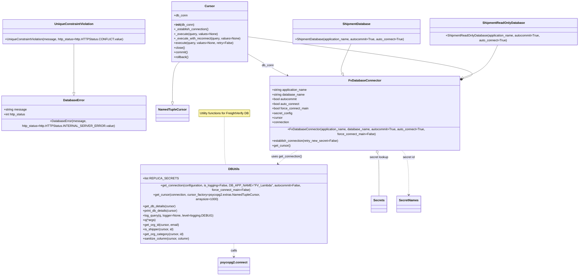

# Diagram: container_tracking_core/container_tracking_service/container_tracking_service/common/db/__init__.py

> Auto-generated by Obscura crawlers

## Mermaid

### SVG

<svg id="container" width="2978.40234375" xmlns="http://www.w3.org/2000/svg" class="classDiagram" height="1354" viewBox="0 0 2978.40234375 1354" role="graphics-document document" aria-roledescription="class"><g><defs><marker id="container_class-aggregationStart" class="marker aggregation class" refX="18" refY="7" markerWidth="190" markerHeight="240" orient="auto"><path d="M 18,7 L9,13 L1,7 L9,1 Z"></path></marker></defs><defs><marker id="container_class-aggregationEnd" class="marker aggregation class" refX="1" refY="7" markerWidth="20" markerHeight="28" orient="auto"><path d="M 18,7 L9,13 L1,7 L9,1 Z"></path></marker></defs><defs><marker id="container_class-extensionStart" class="marker extension class" refX="18" refY="7" markerWidth="190" markerHeight="240" orient="auto"><path d="M 1,7 L18,13 V 1 Z"></path></marker></defs><defs><marker id="container_class-extensionEnd" class="marker extension class" refX="1" refY="7" markerWidth="20" markerHeight="28" orient="auto"><path d="M 1,1 V 13 L18,7 Z"></path></marker></defs><defs><marker id="container_class-compositionStart" class="marker composition class" refX="18" refY="7" markerWidth="190" markerHeight="240" orient="auto"><path d="M 18,7 L9,13 L1,7 L9,1 Z"></path></marker></defs><defs><marker id="container_class-compositionEnd" class="marker composition class" refX="1" refY="7" markerWidth="20" markerHeight="28" orient="auto"><path d="M 18,7 L9,13 L1,7 L9,1 Z"></path></marker></defs><defs><marker id="container_class-dependencyStart" class="marker dependency class" refX="6" refY="7" markerWidth="190" markerHeight="240" orient="auto"><path d="M 5,7 L9,13 L1,7 L9,1 Z"></path></marker></defs><defs><marker id="container_class-dependencyEnd" class="marker dependency class" refX="13" refY="7" markerWidth="20" markerHeight="28" orient="auto"><path d="M 18,7 L9,13 L14,7 L9,1 Z"></path></marker></defs><defs><marker id="container_class-lollipopStart" class="marker lollipop class" refX="13" refY="7" markerWidth="190" markerHeight="240" orient="auto"><circle stroke="black" fill="transparent" cx="7" cy="7" r="6"></circle></marker></defs><defs><marker id="container_class-lollipopEnd" class="marker lollipop class" refX="1" refY="7" markerWidth="190" markerHeight="240" orient="auto"><circle stroke="black" fill="transparent" cx="7" cy="7" r="6"></circle></marker></defs><g class="root"><g class="clusters"></g><g class="edgePaths"><path d="M1123.07,592L1123.07,625.167C1123.07,658.333,1123.07,724.667,1124.484,764C1125.897,803.333,1128.724,815.667,1130.138,821.833L1131.551,828" id="edgeNote1" class="edge-thickness-normal edge-pattern-dotted relation" style="fill: none;;;fill: none" data-edge="true" data-et="edge" data-id="edgeNote1" data-points="W3sieCI6MTEyMy4wNzAzMTI1LCJ5Ijo1OTJ9LHsieCI6MTEyMy4wNzAzMTI1LCJ5Ijo3OTF9LHsieCI6MTEzMS41NTEwMzMyNjYxMjksInkiOjgyOH1d"></path><path d="M368.484,227L368.484,248.667C368.484,270.333,368.484,313.667,368.484,354.625C368.484,395.583,368.484,434.167,368.484,453.458L368.484,472.75" id="id_UniqueConstraintViolation_DatabaseError_1" class="edge-thickness-normal edge-pattern-solid relation" style=";;;" data-edge="true" data-et="edge" data-id="id_UniqueConstraintViolation_DatabaseError_1" data-points="W3sieCI6MzY4LjQ4NDM3NSwieSI6MjI3fSx7IngiOjM2OC40ODQzNzUsInkiOjM1N30seyJ4IjozNjguNDg0Mzc1LCJ5Ijo0OTB9XQ==" marker-end="url(#container_class-extensionEnd)"></path><path d="M894.178,320L887.682,326.167C881.186,332.333,868.195,344.667,861.699,377.125C855.203,409.583,855.203,462.167,855.203,488.458L855.203,514.75" id="id_Cursor_NamedTupleCursor_2" class="edge-thickness-normal edge-pattern-solid relation" style=";;;" data-edge="true" data-et="edge" data-id="id_Cursor_NamedTupleCursor_2" data-points="W3sieCI6ODk0LjE3Nzg4NjE3MjI3OTgsInkiOjMyMH0seyJ4Ijo4NTUuMjAzMTI1LCJ5IjozNTd9LHsieCI6ODU1LjIwMzEyNSwieSI6NTMyfV0=" marker-end="url(#container_class-extensionEnd)"></path><path d="M1253.441,275.942L1276.967,289.452C1300.493,302.962,1347.544,329.981,1383.8,349.245C1420.057,368.51,1445.518,380.019,1458.248,385.774L1470.979,391.529" id="id_Cursor_FvDatabaseConnector_3" class="edge-thickness-normal edge-pattern-solid relation" style=";;;" data-edge="true" data-et="edge" data-id="id_Cursor_FvDatabaseConnector_3" data-points="W3sieCI6MTI1My40NDE0MDYyNSwieSI6Mjc1Ljk0MjQ0NTAzOTc3ODI1fSx7IngiOjEzOTQuNTk1NzAzMTI1LCJ5IjozNTd9LHsieCI6MTQ3Ni40NDYwMTQ1NDQ5MzEsInkiOjM5NH1d" marker-end="url(#container_class-dependencyEnd)"></path><path d="M2397.024,399.347L2418.134,392.289C2439.244,385.231,2481.464,371.116,2290.867,336.171C2100.27,301.226,1676.855,245.452,1465.148,217.565L1253.441,189.678" id="id_FvDatabaseConnector_Cursor_4" class="edge-thickness-normal edge-pattern-solid relation" style=";;;" data-edge="true" data-et="edge" data-id="id_FvDatabaseConnector_Cursor_4" data-points="W3sieCI6MjM4MC42NjQwNjI1LCJ5Ijo0MDQuODE2NjM2MTczMjM0Nzd9LHsieCI6MjUyMy42ODM1OTM3NSwieSI6MzU3fSx7IngiOjEyNTMuNDQxNDA2MjUsInkiOjE4OS42NzgwMzY1MDM2Mjg1fV0=" marker-start="url(#container_class-compositionStart)"></path><path d="M1517.892,754L1505.67,760.167C1493.448,766.333,1469.004,778.667,1449.841,790.376C1430.678,802.085,1416.796,813.171,1409.855,818.713L1402.914,824.256" id="id_FvDatabaseConnector_DBUtils_5" class="edge-thickness-normal edge-pattern-dashed relation" style=";;;" data-edge="true" data-et="edge" data-id="id_FvDatabaseConnector_DBUtils_5" data-points="W3sieCI6MTUxNy44OTE1MDcwNTY0NTE3LCJ5Ijo3NTR9LHsieCI6MTQ0NC41NjA1NDY4NzUsInkiOjc5MX0seyJ4IjoxMzk4LjIyNDk2MDM5NzQ2NTYsInkiOjgyOH1d" marker-end="url(#container_class-dependencyEnd)"></path><path d="M1941.906,770.319L1943.087,773.765C1944.268,777.212,1946.63,784.106,1947.811,816.72C1948.992,849.333,1948.992,907.667,1948.992,936.833L1948.992,966" id="id_FvDatabaseConnector_Secrets_6" class="edge-thickness-normal edge-pattern-solid relation" style=";;;" data-edge="true" data-et="edge" data-id="id_FvDatabaseConnector_Secrets_6" data-points="W3sieCI6MTkzNi4zMTQwNjYxMDAyMzAzLCJ5Ijo3NTR9LHsieCI6MTk0OC45OTIxODc1LCJ5Ijo3OTF9LHsieCI6MTk0OC45OTIxODc1LCJ5Ijo5NjZ9XQ==" marker-start="url(#container_class-aggregationStart)"></path><path d="M2060.071,754L2066.423,760.167C2072.776,766.333,2085.482,778.667,2091.835,813C2098.188,847.333,2098.188,903.667,2098.188,931.833L2098.188,960" id="id_FvDatabaseConnector_SecretNames_7" class="edge-thickness-normal edge-pattern-dashed relation" style=";;;" data-edge="true" data-et="edge" data-id="id_FvDatabaseConnector_SecretNames_7" data-points="W3sieCI6MjA2MC4wNzA1NDY1MTQ5NzY3LCJ5Ijo3NTR9LHsieCI6MjA5OC4xODc1LCJ5Ijo3OTF9LHsieCI6MjA5OC4xODc1LCJ5Ijo5NjZ9XQ==" marker-end="url(#container_class-dependencyEnd)"></path><path d="M1798.448,227L1788.951,248.667C1779.453,270.333,1760.459,313.667,1753.243,339.05C1746.026,364.433,1750.588,371.865,1752.868,375.582L1755.149,379.298" id="id_ShipmentDatabase_FvDatabaseConnector_8" class="edge-thickness-normal edge-pattern-solid relation" style=";;;" data-edge="true" data-et="edge" data-id="id_ShipmentDatabase_FvDatabaseConnector_8" data-points="W3sieCI6MTc5OC40NDc3MjEwMTY4MzkzLCJ5IjoyMjd9LHsieCI6MTc0MS40NjQ4NDM3NSwieSI6MzU3fSx7IngiOjE3NjQuMTcxNTY4OTgwNDE0OCwieSI6Mzk0fV0=" marker-end="url(#container_class-extensionEnd)"></path><path d="M2560.666,227L2551.169,248.667C2541.672,270.333,2522.678,313.667,2495.395,341.469C2468.113,369.271,2432.542,381.541,2414.756,387.677L2396.971,393.812" id="id_ShipmentReadOnlyDatabase_FvDatabaseConnector_9" class="edge-thickness-normal edge-pattern-solid relation" style=";;;" data-edge="true" data-et="edge" data-id="id_ShipmentReadOnlyDatabase_FvDatabaseConnector_9" data-points="W3sieCI6MjU2MC42NjY0NzEwMTY4MzkzLCJ5IjoyMjd9LHsieCI6MjUwMy42ODM1OTM3NSwieSI6MzU3fSx7IngiOjIzODAuNjY0MDYyNSwieSI6Mzk5LjQzNzU5NzgwNDIxNzd9XQ==" marker-end="url(#container_class-extensionEnd)"></path><path d="M1172.809,1188L1172.809,1194.167C1172.809,1200.333,1172.809,1212.667,1172.809,1224C1172.809,1235.333,1172.809,1245.667,1172.809,1250.833L1172.809,1256" id="id_DBUtils_psycopg2.connect_10" class="edge-thickness-normal edge-pattern-dashed relation" style=";;;" data-edge="true" data-et="edge" data-id="id_DBUtils_psycopg2.connect_10" data-points="W3sieCI6MTE3Mi44MDg1OTM3NSwieSI6MTE4OH0seyJ4IjoxMTcyLjgwODU5Mzc1LCJ5IjoxMjI1fSx7IngiOjExNzIuODA4NTkzNzUsInkiOjEyNjJ9XQ==" marker-end="url(#container_class-dependencyEnd)"></path></g><g class="edgeLabels"><g class="edgeLabel"><g class="label" data-id="edgeNote1" transform="translate(0, 0)"><foreignObject width="0" height="0">

</foreignObject></g></g><g class="edgeLabel"><g class="label" data-id="id_UniqueConstraintViolation_DatabaseError_1" transform="translate(0, 0)"><foreignObject width="0" height="0">

</foreignObject></g></g><g class="edgeLabel"><g class="label" data-id="id_Cursor_NamedTupleCursor_2" transform="translate(0, 0)"><foreignObject width="0" height="0">

</foreignObject></g></g><g class="edgeLabel" transform="translate(1362.966, 338.83671)"><g class="label" data-id="id_Cursor_FvDatabaseConnector_3" transform="translate(-31.09375, -12)"><foreignObject width="62.1875" height="24">

db_conn

</foreignObject></g></g><g class="edgeLabel"><g class="label" data-id="id_FvDatabaseConnector_Cursor_4" transform="translate(0, 0)"><foreignObject width="0" height="0">

</foreignObject></g></g><g class="edgeLabel" transform="translate(1454.75663, 785.85544)"><g class="label" data-id="id_FvDatabaseConnector_DBUtils_5" transform="translate(-79.4765625, -12)"><foreignObject width="158.953125" height="24">

uses get_connection()

</foreignObject></g></g><g class="edgeLabel" transform="translate(1948.9921875, 791)"><g class="label" data-id="id_FvDatabaseConnector_Secrets_6" transform="translate(-49.234375, -12)"><foreignObject width="98.46875" height="24">

secret lookup

</foreignObject></g></g><g class="edgeLabel" transform="translate(2098.1875, 791)"><g class="label" data-id="id_FvDatabaseConnector_SecretNames_7" transform="translate(-31.1796875, -12)"><foreignObject width="62.359375" height="24">

secret id

</foreignObject></g></g><g class="edgeLabel"><g class="label" data-id="id_ShipmentDatabase_FvDatabaseConnector_8" transform="translate(0, 0)"><foreignObject width="0" height="0">

</foreignObject></g></g><g class="edgeLabel"><g class="label" data-id="id_ShipmentReadOnlyDatabase_FvDatabaseConnector_9" transform="translate(0, 0)"><foreignObject width="0" height="0">

</foreignObject></g></g><g class="edgeLabel" transform="translate(1172.80859375, 1225)"><g class="label" data-id="id_DBUtils_psycopg2.connect_10" transform="translate(-16.4453125, -12)"><foreignObject width="32.890625" height="24">

calls

</foreignObject></g></g></g><g class="nodes"><g class="node default" id="classId-DatabaseError-0" transform="translate(368.484375, 574)"><g class="basic label-container"><path d="M-355.0390625 -84 L355.0390625 -84 L355.0390625 84 L-355.0390625 84" stroke="none" stroke-width="0" fill="#ECECFF" style=""></path><path d="M-355.0390625 -84 C-129.15465518248834 -84, 96.72975213502332 -84, 355.0390625 -84 M-355.0390625 -84 C-180.38089672071735 -84, -5.7227309414346905 -84, 355.0390625 -84 M355.0390625 -84 C355.0390625 -18.271549531766127, 355.0390625 47.45690093646775, 355.0390625 84 M355.0390625 -84 C355.0390625 -27.65269641598043, 355.0390625 28.69460716803914, 355.0390625 84 M355.0390625 84 C142.2921902978323 84, -70.45468190433542 84, -355.0390625 84 M355.0390625 84 C186.47121162965792 84, 17.90336075931583 84, -355.0390625 84 M-355.0390625 84 C-355.0390625 32.98657379293016, -355.0390625 -18.026852414139682, -355.0390625 -84 M-355.0390625 84 C-355.0390625 21.13158940830146, -355.0390625 -41.73682118339708, -355.0390625 -84" stroke="#9370DB" stroke-width="1.3" fill="none" stroke-dasharray="0 0" style=""></path></g><g class="annotation-group text" transform="translate(0, -60)"></g><g class="label-group text" transform="translate(-52.359375, -60)"><g class="label" style="font-weight: bolder" transform="translate(0,-12)"><foreignObject width="104.71875" height="24">

DatabaseError

</foreignObject></g></g><g class="members-group text" transform="translate(-343.0390625, -12)"><g class="label" style="" transform="translate(0,-12)"><foreignObject width="116.25" height="24">

+string message

</foreignObject></g><g class="label" style="" transform="translate(0,12)"><foreignObject width="114.734375" height="24">

+int http_status

</foreignObject></g></g><g class="methods-group text" transform="translate(-343.0390625, 60)"><g class="label" style="" transform="translate(0,-12)"><foreignObject width="633.71875" height="24">

+DatabaseError(message, http_status=http.HTTPStatus.INTERNAL_SERVER_ERROR.value)

</foreignObject></g></g><g class="divider" style=""><path d="M-355.0390625 -36 C-165.13550144312478 -36, 24.768059613750438 -36, 355.0390625 -36 M-355.0390625 -36 C-152.7457648989004 -36, 49.54753270219919 -36, 355.0390625 -36" stroke="#9370DB" stroke-width="1.3" fill="none" stroke-dasharray="0 0" style=""></path></g><g class="divider" style=""><path d="M-355.0390625 36 C-165.0665556458065 36, 24.905951208387023 36, 355.0390625 36 M-355.0390625 36 C-73.2851618105704 36, 208.4687388788592 36, 355.0390625 36" stroke="#9370DB" stroke-width="1.3" fill="none" stroke-dasharray="0 0" style=""></path></g></g><g class="node default" id="classId-UniqueConstraintViolation-1" transform="translate(368.484375, 164)"><g class="basic label-container"><path d="M-360.484375 -63 L360.484375 -63 L360.484375 63 L-360.484375 63" stroke="none" stroke-width="0" fill="#ECECFF" style=""></path><path d="M-360.484375 -63 C-206.09068178127737 -63, -51.696988562554736 -63, 360.484375 -63 M-360.484375 -63 C-111.59245808991147 -63, 137.29945882017705 -63, 360.484375 -63 M360.484375 -63 C360.484375 -14.90631547831579, 360.484375 33.18736904336842, 360.484375 63 M360.484375 -63 C360.484375 -19.529616200234706, 360.484375 23.940767599530588, 360.484375 63 M360.484375 63 C88.5924399434748 63, -183.2994951130504 63, -360.484375 63 M360.484375 63 C134.36494884730865 63, -91.7544773053827 63, -360.484375 63 M-360.484375 63 C-360.484375 17.562861448738616, -360.484375 -27.87427710252277, -360.484375 -63 M-360.484375 63 C-360.484375 12.896989664233558, -360.484375 -37.20602067153288, -360.484375 -63" stroke="#9370DB" stroke-width="1.3" fill="none" stroke-dasharray="0 0" style=""></path></g><g class="annotation-group text" transform="translate(0, -39)"></g><g class="label-group text" transform="translate(-96.671875, -39)"><g class="label" style="font-weight: bolder" transform="translate(0,-12)"><foreignObject width="193.34375" height="24">

UniqueConstraintViolation

</foreignObject></g></g><g class="members-group text" transform="translate(-348.484375, 9)"></g><g class="methods-group text" transform="translate(-348.484375, 39)"><g class="label" style="" transform="translate(0,-12)"><foreignObject width="600.296875" height="24">

+UniqueConstraintViolation(message, http_status=http.HTTPStatus.CONFLICT.value)

</foreignObject></g></g><g class="divider" style=""><path d="M-360.484375 -15 C-177.10724547585977 -15, 6.26988404828046 -15, 360.484375 -15 M-360.484375 -15 C-146.3117615119749 -15, 67.86085197605018 -15, 360.484375 -15" stroke="#9370DB" stroke-width="1.3" fill="none" stroke-dasharray="0 0" style=""></path></g><g class="divider" style=""><path d="M-360.484375 9 C-171.04699671006412 9, 18.390381579871757 9, 360.484375 9 M-360.484375 9 C-209.0614455157027 9, -57.6385160314054 9, 360.484375 9" stroke="#9370DB" stroke-width="1.3" fill="none" stroke-dasharray="0 0" style=""></path></g></g><g class="node default" id="classId-DBUtils-2" transform="translate(1172.80859375, 1008)"><g class="basic label-container"><path d="M-476.3125 -180 L476.3125 -180 L476.3125 180 L-476.3125 180" stroke="none" stroke-width="0" fill="#ECECFF" style=""></path><path d="M-476.3125 -180 C-149.8077007675073 -180, 176.6970984649854 -180, 476.3125 -180 M-476.3125 -180 C-223.8002418122618 -180, 28.712016375476423 -180, 476.3125 -180 M476.3125 -180 C476.3125 -78.8077721080824, 476.3125 22.384455783835193, 476.3125 180 M476.3125 -180 C476.3125 -79.16837135777828, 476.3125 21.663257284443432, 476.3125 180 M476.3125 180 C264.11964653873383 180, 51.92679307746761 180, -476.3125 180 M476.3125 180 C160.70739647230278 180, -154.89770705539445 180, -476.3125 180 M-476.3125 180 C-476.3125 104.06932866003513, -476.3125 28.13865732007025, -476.3125 -180 M-476.3125 180 C-476.3125 75.31616399578714, -476.3125 -29.36767200842573, -476.3125 -180" stroke="#9370DB" stroke-width="1.3" fill="none" stroke-dasharray="0 0" style=""></path></g><g class="annotation-group text" transform="translate(0, -156)"></g><g class="label-group text" transform="translate(-26.9375, -156)"><g class="label" style="font-weight: bolder" transform="translate(0,-12)"><foreignObject width="53.875" height="24">

DBUtils

</foreignObject></g></g><g class="members-group text" transform="translate(-464.3125, -108)"><g class="label" style="" transform="translate(0,-12)"><foreignObject width="161.984375" height="24">

+list REPLICA_SECRETS

</foreignObject></g></g><g class="methods-group text" transform="translate(-464.3125, -60)"><g class="label" style="" transform="translate(0,-12)"><foreignObject width="901.6875" height="24">

+get_connection(configuration, is_logging=False, DB_APP_NAME="FV_Lambda", autocommit=False, force_connect_main=False)

</foreignObject></g><g class="label" style="" transform="translate(0,12)"><foreignObject width="663.296875" height="24">

+get_cursor(connection, cursor_factory=psycopg2.extras.NamedTupleCursor, arraysize=1000)

</foreignObject></g><g class="label" style="" transform="translate(0,36)"><foreignObject width="170.734375" height="24">

+get_db_details(cursor)

</foreignObject></g><g class="label" style="" transform="translate(0,60)"><foreignObject width="183.515625" height="24">

+print_db_details(cursor)

</foreignObject></g><g class="label" style="" transform="translate(0,84)"><foreignObject width="355.90625" height="24">

+log_query(q, logger=None, level=logging.DEBUG)

</foreignObject></g><g class="label" style="" transform="translate(0,108)"><foreignObject width="64.953125" height="24">

+q(*args)

</foreignObject></g><g class="label" style="" transform="translate(0,132)"><foreignObject width="187.84375" height="24">

+get_org_id(cursor, email)

</foreignObject></g><g class="label" style="" transform="translate(0,156)"><foreignObject width="160.21875" height="24">

+is_shipper(cursor, id)

</foreignObject></g><g class="label" style="" transform="translate(0,180)"><foreignObject width="209.09375" height="24">

+get_org_category(cursor, id)

</foreignObject></g><g class="label" style="" transform="translate(0,204)"><foreignObject width="241.875" height="24">

+sanitize_column(cursor, column)

</foreignObject></g></g><g class="divider" style=""><path d="M-476.3125 -132 C-175.6820031595455 -132, 124.948493680909 -132, 476.3125 -132 M-476.3125 -132 C-205.98858585043445 -132, 64.3353282991311 -132, 476.3125 -132" stroke="#9370DB" stroke-width="1.3" fill="none" stroke-dasharray="0 0" style=""></path></g><g class="divider" style=""><path d="M-476.3125 -84 C-254.39357038530733 -84, -32.474640770614656 -84, 476.3125 -84 M-476.3125 -84 C-132.79858610373378 -84, 210.71532779253243 -84, 476.3125 -84" stroke="#9370DB" stroke-width="1.3" fill="none" stroke-dasharray="0 0" style=""></path></g></g><g class="node default" id="classId-NamedTupleCursor-3" transform="translate(855.203125, 574)"><g class="basic label-container"><path d="M-81.6796875 -42 L81.6796875 -42 L81.6796875 42 L-81.6796875 42" stroke="none" stroke-width="0" fill="#ECECFF" style=""></path><path d="M-81.6796875 -42 C-33.720421798724466 -42, 14.238843902551068 -42, 81.6796875 -42 M-81.6796875 -42 C-20.028815568593622 -42, 41.622056362812756 -42, 81.6796875 -42 M81.6796875 -42 C81.6796875 -8.644887182676399, 81.6796875 24.710225634647202, 81.6796875 42 M81.6796875 -42 C81.6796875 -13.368710084463196, 81.6796875 15.262579831073609, 81.6796875 42 M81.6796875 42 C26.033772540486396 42, -29.612142419027208 42, -81.6796875 42 M81.6796875 42 C22.92978550629732 42, -35.82011648740536 42, -81.6796875 42 M-81.6796875 42 C-81.6796875 15.352905426442838, -81.6796875 -11.294189147114324, -81.6796875 -42 M-81.6796875 42 C-81.6796875 19.606586098817914, -81.6796875 -2.786827802364172, -81.6796875 -42" stroke="#9370DB" stroke-width="1.3" fill="none" stroke-dasharray="0 0" style=""></path></g><g class="annotation-group text" transform="translate(0, -18)"></g><g class="label-group text" transform="translate(-69.6796875, -18)"><g class="label" style="font-weight: bolder" transform="translate(0,-12)"><foreignObject width="139.359375" height="24">

NamedTupleCursor

</foreignObject></g></g><g class="members-group text" transform="translate(-69.6796875, 30)"></g><g class="methods-group text" transform="translate(-69.6796875, 60)"></g><g class="divider" style=""><path d="M-81.6796875 6 C-38.17929200172466 6, 5.321103496550677 6, 81.6796875 6 M-81.6796875 6 C-19.999916576149154 6, 41.67985434770169 6, 81.6796875 6" stroke="#9370DB" stroke-width="1.3" fill="none" stroke-dasharray="0 0" style=""></path></g><g class="divider" style=""><path d="M-81.6796875 24 C-38.48097273948846 24, 4.717742021023085 24, 81.6796875 24 M-81.6796875 24 C-48.40181019711761 24, -15.123932894235224 24, 81.6796875 24" stroke="#9370DB" stroke-width="1.3" fill="none" stroke-dasharray="0 0" style=""></path></g></g><g class="node default" id="classId-Cursor-4" transform="translate(1058.50390625, 164)"><g class="basic label-container"><path d="M-194.9375 -156 L194.9375 -156 L194.9375 156 L-194.9375 156" stroke="none" stroke-width="0" fill="#ECECFF" style=""></path><path d="M-194.9375 -156 C-70.91909583227498 -156, 53.09930833545005 -156, 194.9375 -156 M-194.9375 -156 C-77.24331154705726 -156, 40.45087690588548 -156, 194.9375 -156 M194.9375 -156 C194.9375 -81.00324072895963, 194.9375 -6.00648145791925, 194.9375 156 M194.9375 -156 C194.9375 -87.14588451741147, 194.9375 -18.29176903482295, 194.9375 156 M194.9375 156 C51.046772172171046 156, -92.84395565565791 156, -194.9375 156 M194.9375 156 C66.22471080423438 156, -62.488078391531246 156, -194.9375 156 M-194.9375 156 C-194.9375 35.681745980515444, -194.9375 -84.63650803896911, -194.9375 -156 M-194.9375 156 C-194.9375 41.54280852628672, -194.9375 -72.91438294742656, -194.9375 -156" stroke="#9370DB" stroke-width="1.3" fill="none" stroke-dasharray="0 0" style=""></path></g><g class="annotation-group text" transform="translate(0, -132)"></g><g class="label-group text" transform="translate(-23.90625, -132)"><g class="label" style="font-weight: bolder" transform="translate(0,-12)"><foreignObject width="47.8125" height="24">

Cursor

</foreignObject></g></g><g class="members-group text" transform="translate(-182.9375, -84)"><g class="label" style="" transform="translate(0,-12)"><foreignObject width="70.171875" height="24">

+db_conn

</foreignObject></g></g><g class="methods-group text" transform="translate(-182.9375, -36)"><g class="label" style="" transform="translate(0,-12)"><foreignObject width="104.96875" height="24">

+<strong>init</strong>(db_conn)

</foreignObject></g><g class="label" style="" transform="translate(0,12)"><foreignObject width="179.984375" height="24">

+_establish_connection()

</foreignObject></g><g class="label" style="" transform="translate(0,36)"><foreignObject width="222.859375" height="24">

+_execute(query, values=None)

</foreignObject></g><g class="label" style="" transform="translate(0,60)"><foreignObject width="341.96875" height="24">

+_execute_with_reconnect(query, values=None)

</foreignObject></g><g class="label" style="" transform="translate(0,84)"><foreignObject width="302.609375" height="24">

+execute(query, values=None, retry=False)

</foreignObject></g><g class="label" style="" transform="translate(0,108)"><foreignObject width="56.15625" height="24">

+close()

</foreignObject></g><g class="label" style="" transform="translate(0,132)"><foreignObject width="72.75" height="24">

+commit()

</foreignObject></g><g class="label" style="" transform="translate(0,156)"><foreignObject width="76.65625" height="24">

+rollback()

</foreignObject></g></g><g class="divider" style=""><path d="M-194.9375 -108 C-41.99053877206137 -108, 110.95642245587726 -108, 194.9375 -108 M-194.9375 -108 C-51.44183441564357 -108, 92.05383116871286 -108, 194.9375 -108" stroke="#9370DB" stroke-width="1.3" fill="none" stroke-dasharray="0 0" style=""></path></g><g class="divider" style=""><path d="M-194.9375 -60 C-94.86733816456264 -60, 5.2028236708747215 -60, 194.9375 -60 M-194.9375 -60 C-111.36772743839563 -60, -27.797954876791266 -60, 194.9375 -60" stroke="#9370DB" stroke-width="1.3" fill="none" stroke-dasharray="0 0" style=""></path></g></g><g class="node default" id="classId-FvDatabaseConnector-5" transform="translate(1874.63671875, 574)"><g class="basic label-container"><path d="M-506.02734375 -180 L506.02734375 -180 L506.02734375 180 L-506.02734375 180" stroke="none" stroke-width="0" fill="#ECECFF" style=""></path><path d="M-506.02734375 -180 C-135.07593770209837 -180, 235.87546834580326 -180, 506.02734375 -180 M-506.02734375 -180 C-123.94269409084512 -180, 258.14195556830975 -180, 506.02734375 -180 M506.02734375 -180 C506.02734375 -104.74931042903773, 506.02734375 -29.49862085807547, 506.02734375 180 M506.02734375 -180 C506.02734375 -82.57464655773538, 506.02734375 14.850706884529245, 506.02734375 180 M506.02734375 180 C212.80160651082087 180, -80.42413072835825 180, -506.02734375 180 M506.02734375 180 C182.45479394281523 180, -141.11775586436954 180, -506.02734375 180 M-506.02734375 180 C-506.02734375 84.62794772601131, -506.02734375 -10.744104547977372, -506.02734375 -180 M-506.02734375 180 C-506.02734375 84.03897173240351, -506.02734375 -11.92205653519298, -506.02734375 -180" stroke="#9370DB" stroke-width="1.3" fill="none" stroke-dasharray="0 0" style=""></path></g><g class="annotation-group text" transform="translate(0, -156)"></g><g class="label-group text" transform="translate(-79.3046875, -156)"><g class="label" style="font-weight: bolder" transform="translate(0,-12)"><foreignObject width="158.609375" height="24">

FvDatabaseConnector

</foreignObject></g></g><g class="members-group text" transform="translate(-494.02734375, -108)"><g class="label" style="" transform="translate(0,-12)"><foreignObject width="184.8125" height="24">

+string application_name

</foreignObject></g><g class="label" style="" transform="translate(0,12)"><foreignObject width="169.09375" height="24">

+string database_name

</foreignObject></g><g class="label" style="" transform="translate(0,36)"><foreignObject width="132.390625" height="24">

+bool autocommit

</foreignObject></g><g class="label" style="" transform="translate(0,60)"><foreignObject width="143.25" height="24">

+bool auto_connect

</foreignObject></g><g class="label" style="" transform="translate(0,84)"><foreignObject width="191.265625" height="24">

+bool force_connect_main

</foreignObject></g><g class="label" style="" transform="translate(0,108)"><foreignObject width="103.59375" height="24">

+secret_config

</foreignObject></g><g class="label" style="" transform="translate(0,132)"><foreignObject width="53.71875" height="24">

+cursor

</foreignObject></g><g class="label" style="" transform="translate(0,156)"><foreignObject width="88.796875" height="24">

+connection

</foreignObject></g></g><g class="methods-group text" transform="translate(-494.02734375, 108)"><g class="label" style="" transform="translate(0,-12)"><foreignObject width="908.75" height="24">

+FvDatabaseConnector(application_name, database_name, autocommit=True, auto_connect=True, force_connect_main=False)

</foreignObject></g><g class="label" style="" transform="translate(0,12)"><foreignObject width="341.265625" height="24">

+establish_connection(retry_new_secret=False)

</foreignObject></g><g class="label" style="" transform="translate(0,36)"><foreignObject width="94.640625" height="24">

+get_cursor()

</foreignObject></g></g><g class="divider" style=""><path d="M-506.02734375 -132 C-104.57395666192457 -132, 296.87943042615086 -132, 506.02734375 -132 M-506.02734375 -132 C-220.96694847368468 -132, 64.09344680263064 -132, 506.02734375 -132" stroke="#9370DB" stroke-width="1.3" fill="none" stroke-dasharray="0 0" style=""></path></g><g class="divider" style=""><path d="M-506.02734375 84 C-266.5748138207332 84, -27.12228389146634 84, 506.02734375 84 M-506.02734375 84 C-233.4349903909757 84, 39.157362968048574 84, 506.02734375 84" stroke="#9370DB" stroke-width="1.3" fill="none" stroke-dasharray="0 0" style=""></path></g></g><g class="node default" id="classId-Secrets-6" transform="translate(1948.9921875, 1008)"><g class="basic label-container"><path d="M-39.1640625 -42 L39.1640625 -42 L39.1640625 42 L-39.1640625 42" stroke="none" stroke-width="0" fill="#ECECFF" style=""></path><path d="M-39.1640625 -42 C-21.4450496088341 -42, -3.726036717668201 -42, 39.1640625 -42 M-39.1640625 -42 C-18.90277435632495 -42, 1.3585137873500983 -42, 39.1640625 -42 M39.1640625 -42 C39.1640625 -24.934822269202893, 39.1640625 -7.869644538405787, 39.1640625 42 M39.1640625 -42 C39.1640625 -17.567260597224696, 39.1640625 6.865478805550609, 39.1640625 42 M39.1640625 42 C8.54640768789639 42, -22.07124712420722 42, -39.1640625 42 M39.1640625 42 C18.57759158790185 42, -2.0088793241963003 42, -39.1640625 42 M-39.1640625 42 C-39.1640625 24.4689325914991, -39.1640625 6.937865182998202, -39.1640625 -42 M-39.1640625 42 C-39.1640625 18.142648005892134, -39.1640625 -5.714703988215732, -39.1640625 -42" stroke="#9370DB" stroke-width="1.3" fill="none" stroke-dasharray="0 0" style=""></path></g><g class="annotation-group text" transform="translate(0, -18)"></g><g class="label-group text" transform="translate(-27.1640625, -18)"><g class="label" style="font-weight: bolder" transform="translate(0,-12)"><foreignObject width="54.328125" height="24">

Secrets

</foreignObject></g></g><g class="members-group text" transform="translate(-27.1640625, 30)"></g><g class="methods-group text" transform="translate(-27.1640625, 60)"></g><g class="divider" style=""><path d="M-39.1640625 6 C-22.137858829149277 6, -5.111655158298554 6, 39.1640625 6 M-39.1640625 6 C-13.247421464910268 6, 12.669219570179465 6, 39.1640625 6" stroke="#9370DB" stroke-width="1.3" fill="none" stroke-dasharray="0 0" style=""></path></g><g class="divider" style=""><path d="M-39.1640625 24 C-12.939685624014906 24, 13.284691251970187 24, 39.1640625 24 M-39.1640625 24 C-7.863891783737863 24, 23.436278932524274 24, 39.1640625 24" stroke="#9370DB" stroke-width="1.3" fill="none" stroke-dasharray="0 0" style=""></path></g></g><g class="node default" id="classId-SecretNames-7" transform="translate(2098.1875, 1008)"><g class="basic label-container"><path d="M-60.03125 -42 L60.03125 -42 L60.03125 42 L-60.03125 42" stroke="none" stroke-width="0" fill="#ECECFF" style=""></path><path d="M-60.03125 -42 C-28.696387008255993 -42, 2.6384759834880143 -42, 60.03125 -42 M-60.03125 -42 C-35.76745939935829 -42, -11.503668798716582 -42, 60.03125 -42 M60.03125 -42 C60.03125 -17.456826282532074, 60.03125 7.086347434935853, 60.03125 42 M60.03125 -42 C60.03125 -15.723406599361304, 60.03125 10.553186801277391, 60.03125 42 M60.03125 42 C33.203480115235664 42, 6.37571023047132 42, -60.03125 42 M60.03125 42 C14.731968900839298 42, -30.567312198321403 42, -60.03125 42 M-60.03125 42 C-60.03125 14.171120344453477, -60.03125 -13.657759311093045, -60.03125 -42 M-60.03125 42 C-60.03125 16.82291920852418, -60.03125 -8.35416158295164, -60.03125 -42" stroke="#9370DB" stroke-width="1.3" fill="none" stroke-dasharray="0 0" style=""></path></g><g class="annotation-group text" transform="translate(0, -18)"></g><g class="label-group text" transform="translate(-48.03125, -18)"><g class="label" style="font-weight: bolder" transform="translate(0,-12)"><foreignObject width="96.0625" height="24">

SecretNames

</foreignObject></g></g><g class="members-group text" transform="translate(-48.03125, 30)"></g><g class="methods-group text" transform="translate(-48.03125, 60)"></g><g class="divider" style=""><path d="M-60.03125 6 C-33.112552312468864 6, -6.193854624937735 6, 60.03125 6 M-60.03125 6 C-34.241050587666 6, -8.450851175332005 6, 60.03125 6" stroke="#9370DB" stroke-width="1.3" fill="none" stroke-dasharray="0 0" style=""></path></g><g class="divider" style=""><path d="M-60.03125 24 C-28.679988177504907 24, 2.671273644990187 24, 60.03125 24 M-60.03125 24 C-23.69091427727082 24, 12.649421445458358 24, 60.03125 24" stroke="#9370DB" stroke-width="1.3" fill="none" stroke-dasharray="0 0" style=""></path></g></g><g class="node default" id="classId-ShipmentDatabase-8" transform="translate(1826.0625, 164)"><g class="basic label-container"><path d="M-330.09765625 -63 L330.09765625 -63 L330.09765625 63 L-330.09765625 63" stroke="none" stroke-width="0" fill="#ECECFF" style=""></path><path d="M-330.09765625 -63 C-181.64268724703936 -63, -33.187718244078724 -63, 330.09765625 -63 M-330.09765625 -63 C-83.30159078177545 -63, 163.4944746864491 -63, 330.09765625 -63 M330.09765625 -63 C330.09765625 -24.675696934415278, 330.09765625 13.648606131169444, 330.09765625 63 M330.09765625 -63 C330.09765625 -32.96063235754201, 330.09765625 -2.9212647150840283, 330.09765625 63 M330.09765625 63 C167.53804841144344 63, 4.978440572886882 63, -330.09765625 63 M330.09765625 63 C107.35896067532565 63, -115.3797348993487 63, -330.09765625 63 M-330.09765625 63 C-330.09765625 26.195649427573812, -330.09765625 -10.608701144852375, -330.09765625 -63 M-330.09765625 63 C-330.09765625 20.749516741853675, -330.09765625 -21.50096651629265, -330.09765625 -63" stroke="#9370DB" stroke-width="1.3" fill="none" stroke-dasharray="0 0" style=""></path></g><g class="annotation-group text" transform="translate(0, -39)"></g><g class="label-group text" transform="translate(-69.2734375, -39)"><g class="label" style="font-weight: bolder" transform="translate(0,-12)"><foreignObject width="138.546875" height="24">

ShipmentDatabase

</foreignObject></g></g><g class="members-group text" transform="translate(-318.09765625, 9)"></g><g class="methods-group text" transform="translate(-318.09765625, 39)"><g class="label" style="" transform="translate(0,-12)"><foreignObject width="566.921875" height="24">

+ShipmentDatabase(application_name, autocommit=True, auto_connect=True)

</foreignObject></g></g><g class="divider" style=""><path d="M-330.09765625 -15 C-189.66741139046445 -15, -49.2371665309289 -15, 330.09765625 -15 M-330.09765625 -15 C-186.6418153947575 -15, -43.18597453951497 -15, 330.09765625 -15" stroke="#9370DB" stroke-width="1.3" fill="none" stroke-dasharray="0 0" style=""></path></g><g class="divider" style=""><path d="M-330.09765625 9 C-78.78915059047253 9, 172.51935506905494 9, 330.09765625 9 M-330.09765625 9 C-112.36645513753982 9, 105.36474597492037 9, 330.09765625 9" stroke="#9370DB" stroke-width="1.3" fill="none" stroke-dasharray="0 0" style=""></path></g></g><g class="node default" id="classId-ShipmentReadOnlyDatabase-9" transform="translate(2588.28125, 164)"><g class="basic label-container"><path d="M-382.12109375 -63 L382.12109375 -63 L382.12109375 63 L-382.12109375 63" stroke="none" stroke-width="0" fill="#ECECFF" style=""></path><path d="M-382.12109375 -63 C-107.38482279333704 -63, 167.35144816332593 -63, 382.12109375 -63 M-382.12109375 -63 C-213.0490908412699 -63, -43.9770879325398 -63, 382.12109375 -63 M382.12109375 -63 C382.12109375 -26.01958343908906, 382.12109375 10.960833121821878, 382.12109375 63 M382.12109375 -63 C382.12109375 -14.789016530942128, 382.12109375 33.421966938115744, 382.12109375 63 M382.12109375 63 C197.53376469288057 63, 12.946435635761134 63, -382.12109375 63 M382.12109375 63 C80.79467690348105 63, -220.5317399430379 63, -382.12109375 63 M-382.12109375 63 C-382.12109375 26.77600840357381, -382.12109375 -9.447983192852377, -382.12109375 -63 M-382.12109375 63 C-382.12109375 14.448783104574595, -382.12109375 -34.10243379085081, -382.12109375 -63" stroke="#9370DB" stroke-width="1.3" fill="none" stroke-dasharray="0 0" style=""></path></g><g class="annotation-group text" transform="translate(0, -39)"></g><g class="label-group text" transform="translate(-104.1953125, -39)"><g class="label" style="font-weight: bolder" transform="translate(0,-12)"><foreignObject width="208.390625" height="24">

ShipmentReadOnlyDatabase

</foreignObject></g></g><g class="members-group text" transform="translate(-370.12109375, 9)"></g><g class="methods-group text" transform="translate(-370.12109375, 39)"><g class="label" style="" transform="translate(0,-12)"><foreignObject width="636.046875" height="24">

+ShipmentReadOnlyDatabase(application_name, autocommit=True, auto_connect=True)

</foreignObject></g></g><g class="divider" style=""><path d="M-382.12109375 -15 C-165.7330914612048 -15, 50.65491082759041 -15, 382.12109375 -15 M-382.12109375 -15 C-214.25129838750811 -15, -46.38150302501623 -15, 382.12109375 -15" stroke="#9370DB" stroke-width="1.3" fill="none" stroke-dasharray="0 0" style=""></path></g><g class="divider" style=""><path d="M-382.12109375 9 C-77.80785164792871 9, 226.50539045414257 9, 382.12109375 9 M-382.12109375 9 C-189.3420995318004 9, 3.436894686399228 9, 382.12109375 9" stroke="#9370DB" stroke-width="1.3" fill="none" stroke-dasharray="0 0" style=""></path></g></g><g class="node default" id="classId-psycopg2.connect-10" transform="translate(1172.80859375, 1304)"><g class="basic label-container"><path d="M-76.984375 -42 L76.984375 -42 L76.984375 42 L-76.984375 42" stroke="none" stroke-width="0" fill="#ECECFF" style=""></path><path d="M-76.984375 -42 C-28.65920885340647 -42, 19.665957293187063 -42, 76.984375 -42 M-76.984375 -42 C-35.272491771059386 -42, 6.439391457881229 -42, 76.984375 -42 M76.984375 -42 C76.984375 -22.488780257628445, 76.984375 -2.97756051525689, 76.984375 42 M76.984375 -42 C76.984375 -21.031723417947894, 76.984375 -0.06344683589578892, 76.984375 42 M76.984375 42 C20.520047497679705 42, -35.94428000464059 42, -76.984375 42 M76.984375 42 C33.01453887729884 42, -10.95529724540232 42, -76.984375 42 M-76.984375 42 C-76.984375 10.407236685476509, -76.984375 -21.185526629046983, -76.984375 -42 M-76.984375 42 C-76.984375 17.164400458703167, -76.984375 -7.671199082593667, -76.984375 -42" stroke="#9370DB" stroke-width="1.3" fill="none" stroke-dasharray="0 0" style=""></path></g><g class="annotation-group text" transform="translate(0, -18)"></g><g class="label-group text" transform="translate(-64.984375, -18)"><g class="label" style="font-weight: bolder" transform="translate(0,-12)"><foreignObject width="129.96875" height="24">

psycopg2.connect

</foreignObject></g></g><g class="members-group text" transform="translate(-64.984375, 30)"></g><g class="methods-group text" transform="translate(-64.984375, 60)"></g><g class="divider" style=""><path d="M-76.984375 6 C-37.19416979054557 6, 2.596035418908855 6, 76.984375 6 M-76.984375 6 C-16.069306273198855 6, 44.84576245360229 6, 76.984375 6" stroke="#9370DB" stroke-width="1.3" fill="none" stroke-dasharray="0 0" style=""></path></g><g class="divider" style=""><path d="M-76.984375 24 C-36.04021200604559 24, 4.903950987908814 24, 76.984375 24 M-76.984375 24 C-42.17010212188357 24, -7.355829243767147 24, 76.984375 24" stroke="#9370DB" stroke-width="1.3" fill="none" stroke-dasharray="0 0" style=""></path></g></g><g class="node undefined" id="note0" transform="translate(1123.0703125, 574)"><g class="basic label-container"><path d="M-136.1875 -18 L136.1875 -18 L136.1875 18 L-136.1875 18" stroke="none" stroke-width="0" fill="#fff5ad" style="fill:#fff5ad !important;stroke:#aaaa33 !important"></path><path d="M-136.1875 -18 C-61.187415169553006 -18, 13.812669660893988 -18, 136.1875 -18 M-136.1875 -18 C-42.49737919000981 -18, 51.19274161998038 -18, 136.1875 -18 M136.1875 -18 C136.1875 -4.740806748670728, 136.1875 8.518386502658544, 136.1875 18 M136.1875 -18 C136.1875 -10.416398502822503, 136.1875 -2.8327970056450056, 136.1875 18 M136.1875 18 C52.92895481706958 18, -30.329590365860838 18, -136.1875 18 M136.1875 18 C29.008928818587833 18, -78.16964236282433 18, -136.1875 18 M-136.1875 18 C-136.1875 6.100264284162657, -136.1875 -5.799471431674686, -136.1875 -18 M-136.1875 18 C-136.1875 6.484379353166933, -136.1875 -5.031241293666135, -136.1875 -18" stroke="#aaaa33" stroke-width="1.3" fill="none" stroke-dasharray="0 0" style="fill:#fff5ad !important;stroke:#aaaa33 !important"></path></g><g class="label" style="text-align:left !important;white-space:nowrap !important" transform="translate(-130.1875, -12)"><rect></rect><foreignObject width="260.375" height="24">

Utility functions for FreightVerify DB

</foreignObject></g></g></g></g></g></svg>
