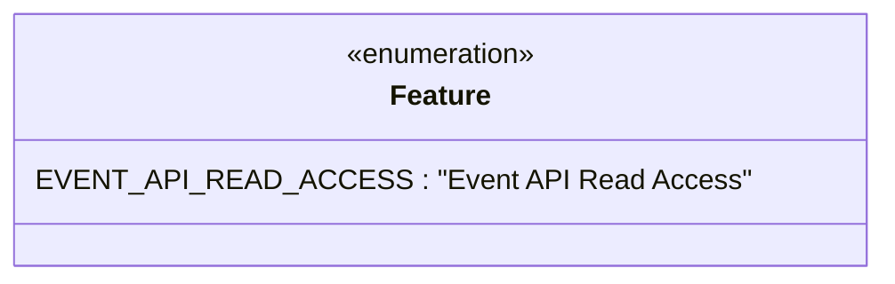

# Diagram: container_tracking_core/container_tracking_service/container_tracking_service/common/db/features.py


> Auto-generated by Obscura crawlers

## Diagram 1



### SVG

<svg id="container" width="461.7265625" xmlns="http://www.w3.org/2000/svg" class="classDiagram" height="160" viewBox="0 0 461.7265625 160" role="graphics-document document" aria-roledescription="class"><style>#container{font-family:"trebuchet ms",verdana,arial,sans-serif;font-size:16px;fill:#333;}@keyframes edge-animation-frame{from{stroke-dashoffset:0;}}@keyframes dash{to{stroke-dashoffset:0;}}#container .edge-animation-slow{stroke-dasharray:9,5!important;stroke-dashoffset:900;animation:dash 50s linear infinite;stroke-linecap:round;}#container .edge-animation-fast{stroke-dasharray:9,5!important;stroke-dashoffset:900;animation:dash 20s linear infinite;stroke-linecap:round;}#container .error-icon{fill:#552222;}#container .error-text{fill:#552222;stroke:#552222;}#container .edge-thickness-normal{stroke-width:1px;}#container .edge-thickness-thick{stroke-width:3.5px;}#container .edge-pattern-solid{stroke-dasharray:0;}#container .edge-thickness-invisible{stroke-width:0;fill:none;}#container .edge-pattern-dashed{stroke-dasharray:3;}#container .edge-pattern-dotted{stroke-dasharray:2;}#container .marker{fill:#333333;stroke:#333333;}#container .marker.cross{stroke:#333333;}#container svg{font-family:"trebuchet ms",verdana,arial,sans-serif;font-size:16px;}#container p{margin:0;}#container g.classGroup text{fill:#9370DB;stroke:none;font-family:"trebuchet ms",verdana,arial,sans-serif;font-size:10px;}#container g.classGroup text .title{font-weight:bolder;}#container .nodeLabel,#container .edgeLabel{color:#131300;}#container .edgeLabel .label rect{fill:#ECECFF;}#container .label text{fill:#131300;}#container .labelBkg{background:#ECECFF;}#container .edgeLabel .label span{background:#ECECFF;}#container .classTitle{font-weight:bolder;}#container .node rect,#container .node circle,#container .node ellipse,#container .node polygon,#container .node path{fill:#ECECFF;stroke:#9370DB;stroke-width:1px;}#container .divider{stroke:#9370DB;stroke-width:1;}#container g.clickable{cursor:pointer;}#container g.classGroup rect{fill:#ECECFF;stroke:#9370DB;}#container g.classGroup line{stroke:#9370DB;stroke-width:1;}#container .classLabel .box{stroke:none;stroke-width:0;fill:#ECECFF;opacity:0.5;}#container .classLabel .label{fill:#9370DB;font-size:10px;}#container .relation{stroke:#333333;stroke-width:1;fill:none;}#container .dashed-line{stroke-dasharray:3;}#container .dotted-line{stroke-dasharray:1 2;}#container #compositionStart,#container .composition{fill:#333333!important;stroke:#333333!important;stroke-width:1;}#container #compositionEnd,#container .composition{fill:#333333!important;stroke:#333333!important;stroke-width:1;}#container #dependencyStart,#container .dependency{fill:#333333!important;stroke:#333333!important;stroke-width:1;}#container #dependencyStart,#container .dependency{fill:#333333!important;stroke:#333333!important;stroke-width:1;}#container #extensionStart,#container .extension{fill:transparent!important;stroke:#333333!important;stroke-width:1;}#container #extensionEnd,#container .extension{fill:transparent!important;stroke:#333333!important;stroke-width:1;}#container #aggregationStart,#container .aggregation{fill:transparent!important;stroke:#333333!important;stroke-width:1;}#container #aggregationEnd,#container .aggregation{fill:transparent!important;stroke:#333333!important;stroke-width:1;}#container #lollipopStart,#container .lollipop{fill:#ECECFF!important;stroke:#333333!important;stroke-width:1;}#container #lollipopEnd,#container .lollipop{fill:#ECECFF!important;stroke:#333333!important;stroke-width:1;}#container .edgeTerminals{font-size:11px;line-height:initial;}#container .classTitleText{text-anchor:middle;font-size:18px;fill:#333;}#container .label-icon{display:inline-block;height:1em;overflow:visible;vertical-align:-0.125em;}#container .node .label-icon path{fill:currentColor;stroke:revert;stroke-width:revert;}#container :root{--mermaid-font-family:"trebuchet ms",verdana,arial,sans-serif;}</style><g><defs><marker id="container_class-aggregationStart" class="marker aggregation class" refX="18" refY="7" markerWidth="190" markerHeight="240" orient="auto"><path d="M 18,7 L9,13 L1,7 L9,1 Z"></path></marker></defs><defs><marker id="container_class-aggregationEnd" class="marker aggregation class" refX="1" refY="7" markerWidth="20" markerHeight="28" orient="auto"><path d="M 18,7 L9,13 L1,7 L9,1 Z"></path></marker></defs><defs><marker id="container_class-extensionStart" class="marker extension class" refX="18" refY="7" markerWidth="190" markerHeight="240" orient="auto"><path d="M 1,7 L18,13 V 1 Z"></path></marker></defs><defs><marker id="container_class-extensionEnd" class="marker extension class" refX="1" refY="7" markerWidth="20" markerHeight="28" orient="auto"><path d="M 1,1 V 13 L18,7 Z"></path></marker></defs><defs><marker id="container_class-compositionStart" class="marker composition class" refX="18" refY="7" markerWidth="190" markerHeight="240" orient="auto"><path d="M 18,7 L9,13 L1,7 L9,1 Z"></path></marker></defs><defs><marker id="container_class-compositionEnd" class="marker composition class" refX="1" refY="7" markerWidth="20" markerHeight="28" orient="auto"><path d="M 18,7 L9,13 L1,7 L9,1 Z"></path></marker></defs><defs><marker id="container_class-dependencyStart" class="marker dependency class" refX="6" refY="7" markerWidth="190" markerHeight="240" orient="auto"><path d="M 5,7 L9,13 L1,7 L9,1 Z"></path></marker></defs><defs><marker id="container_class-dependencyEnd" class="marker dependency class" refX="13" refY="7" markerWidth="20" markerHeight="28" orient="auto"><path d="M 18,7 L9,13 L14,7 L9,1 Z"></path></marker></defs><defs><marker id="container_class-lollipopStart" class="marker lollipop class" refX="13" refY="7" markerWidth="190" markerHeight="240" orient="auto"><circle stroke="black" fill="transparent" cx="7" cy="7" r="6"></circle></marker></defs><defs><marker id="container_class-lollipopEnd" class="marker lollipop class" refX="1" refY="7" markerWidth="190" markerHeight="240" orient="auto"><circle stroke="black" fill="transparent" cx="7" cy="7" r="6"></circle></marker></defs><g class="root"><g class="clusters"></g><g class="edgePaths"></g><g class="edgeLabels"></g><g class="nodes"><g class="node default" id="classId-Feature-0" transform="translate(230.86328125, 80)"><g class="basic label-container"><path d="M-222.86328125 -72 L222.86328125 -72 L222.86328125 72 L-222.86328125 72" stroke="none" stroke-width="0" fill="#ECECFF" style=""></path><path d="M-222.86328125 -72 C-123.58441929005352 -72, -24.305557330107035 -72, 222.86328125 -72 M-222.86328125 -72 C-56.05639146616679 -72, 110.75049831766643 -72, 222.86328125 -72 M222.86328125 -72 C222.86328125 -35.85498937466165, 222.86328125 0.2900212506767019, 222.86328125 72 M222.86328125 -72 C222.86328125 -15.622117051616584, 222.86328125 40.75576589676683, 222.86328125 72 M222.86328125 72 C116.78930672442759 72, 10.71533219885518 72, -222.86328125 72 M222.86328125 72 C100.97688053100258 72, -20.909520187994843 72, -222.86328125 72 M-222.86328125 72 C-222.86328125 17.90078104215425, -222.86328125 -36.1984379156915, -222.86328125 -72 M-222.86328125 72 C-222.86328125 31.60713131752324, -222.86328125 -8.785737364953519, -222.86328125 -72" stroke="#9370DB" stroke-width="1.3" fill="none" stroke-dasharray="0 0" style=""></path></g><g class="annotation-group text" transform="translate(-55.5546875, -48)"><g class="label" style="" transform="translate(0,-12)"><foreignObject width="111.109375" height="24"><div xmlns="http://www.w3.org/1999/xhtml" style="display: table-cell; white-space: nowrap; line-height: 1.5; max-width: 161px; text-align: center;"><span class="nodeLabel markdown-node-label" style=""><p>«enumeration»</p></span></div></foreignObject></g></g><g class="label-group text" transform="translate(-27.390625, -24)"><g class="label" style="font-weight: bolder" transform="translate(0,-12)"><foreignObject width="54.78125" height="24"><div xmlns="http://www.w3.org/1999/xhtml" style="display: table-cell; white-space: nowrap; line-height: 1.5; max-width: 104px; text-align: center;"><span class="nodeLabel markdown-node-label" style=""><p>Feature</p></span></div></foreignObject></g></g><g class="members-group text" transform="translate(-210.86328125, 24)"><g class="label" style="" transform="translate(0,-12)"><foreignObject width="366.171875" height="24"><div xmlns="http://www.w3.org/1999/xhtml" style="display: table-cell; white-space: nowrap; line-height: 1.5; max-width: 416px; text-align: center;"><span class="nodeLabel markdown-node-label" style=""><p>EVENT_API_READ_ACCESS : "Event API Read Access"</p></span></div></foreignObject></g></g><g class="methods-group text" transform="translate(-210.86328125, 72)"></g><g class="divider" style=""><path d="M-222.86328125 0 C-82.74698092930379 0, 57.36931939139242 0, 222.86328125 0 M-222.86328125 0 C-46.461372745514865 0, 129.94053575897027 0, 222.86328125 0" stroke="#9370DB" stroke-width="1.3" fill="none" stroke-dasharray="0 0" style=""></path></g><g class="divider" style=""><path d="M-222.86328125 48 C-59.819579722979626 48, 103.22412180404075 48, 222.86328125 48 M-222.86328125 48 C-53.037926198568755 48, 116.78742885286249 48, 222.86328125 48" stroke="#9370DB" stroke-width="1.3" fill="none" stroke-dasharray="0 0" style=""></path></g></g></g></g></g></svg>

## Diagram 2

```mermaid
flowchart TD
  subgraph GetFeaturesFlow["get_features(cursor, org_id)"]
    direction TB
    Caller1[Caller] --> GFcall[get_features(cursor, org_id)]
    GFcall --> CK1[extract_org_id(cursor, org_id)]
    CK1 --> SC1{Cache hit?}
    SC1 -- Yes --> Cached1[Return cached features]
    SC1 -- No --> Q1[Execute SQL query:\nSELECT f.name FROM feature f\nINNER JOIN solution so ON so.feature_id = f.id\nWHERE so.organizations_id = %s]
    Q1 --> FA1[fetchall() -> rows]
    FA1 --> Map1[Map rows to list of feature.name]
    Map1 --> Return1[Return features list]
  end

  subgraph GetFeatureFromSolutionFlow["get_feature_from_solution(cursor, solution_id)"]
    direction TB
    Caller2[Caller] --> GFS_call[get_feature_from_solution(cursor, solution_id)]
    GFS_call --> CK2[extract_solution_id(cursor, solution_id)]
    CK2 --> SC2{Cache hit?}
    SC2 -- Yes --> Cached2[Return cached feature]
    SC2 -- No --> Q2[Execute SQL query:\nSELECT f.id, f.name FROM feature f\nJOIN solution s ON f.id = s.feature_id\nWHERE s.external_id = %s]
    Q2 --> FO2[fetchone() -> row]
    FO2 --> Return2[Return row or None]
  end
```

> SVG rendering failed for this diagram.
