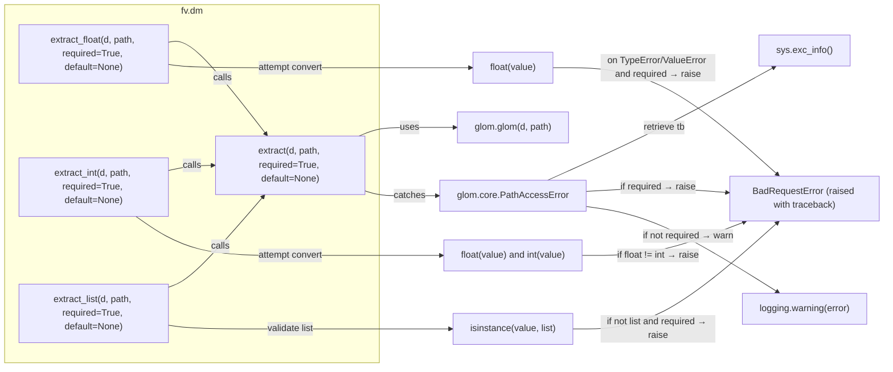

# Diagram: container_tracking_core/container_tracking_service/container_tracking_service/common/dm.py

> Auto-generated by Obscura crawlers

## Mermaid

```mermaid
flowchart LR
  subgraph fv.dm
    EXTRACT["extract(d, path, required=True, default=None)"]
    EXTRACT_FLOAT["extract_float(d, path, required=True, default=None)"]
    EXTRACT_INT["extract_int(d, path, required=True, default=None)"]
    EXTRACT_LIST["extract_list(d, path, required=True, default=None)"]
  end
  GLOM["glom.glom(d, path)"]
  PATH_ERR["glom.core.PathAccessError"]
  SYS["sys.exc_info()"]
  RAISE_BAD["BadRequestError (raised with traceback)"]
  WARN["logging.warning(error)"]
  FLOAT_CONV["float(value)"]
  FLOAT_INT_CONV["float(value) and int(value)"]
  IS_LIST["isinstance(value, list)"]

  EXTRACT_FLOAT -->|calls| EXTRACT
  EXTRACT_INT -->|calls| EXTRACT
  EXTRACT_LIST -->|calls| EXTRACT
  EXTRACT -->|uses| GLOM
  EXTRACT -->|catches| PATH_ERR
  PATH_ERR -->|retrieve tb| SYS
  PATH_ERR -->|if required → raise| RAISE_BAD
  PATH_ERR -->|if not required → warn| WARN
  EXTRACT_FLOAT -->|attempt convert| FLOAT_CONV
  FLOAT_CONV -->|on TypeError/ValueError and required → raise| RAISE_BAD
  EXTRACT_INT -->|attempt convert| FLOAT_INT_CONV
  FLOAT_INT_CONV -->|if float != int → raise| RAISE_BAD
  EXTRACT_LIST -->|validate list| IS_LIST
  IS_LIST -->|if not list and required → raise| RAISE_BAD
```

> SVG rendering failed for this diagram.
