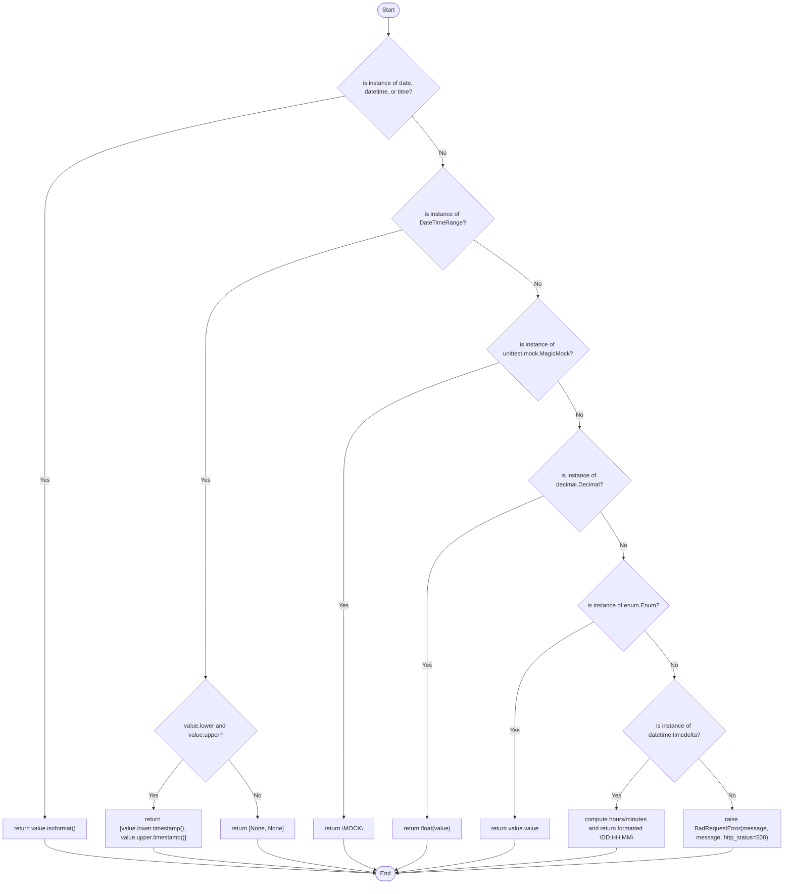

# Diagram: container_tracking_core/container_tracking_service/container_tracking_service/common/encoding/json.py


> Auto-generated by Obscura crawlers

## Diagram 1



### SVG

<svg id="container" width="2131.828125" xmlns="http://www.w3.org/2000/svg" class="flowchart" height="2377.1875" viewBox="0 0 2131.828125 2377.1875" role="graphics-document document" aria-roledescription="flowchart-v2"><style>#container{font-family:"trebuchet ms",verdana,arial,sans-serif;font-size:16px;fill:#333;}@keyframes edge-animation-frame{from{stroke-dashoffset:0;}}@keyframes dash{to{stroke-dashoffset:0;}}#container .edge-animation-slow{stroke-dasharray:9,5!important;stroke-dashoffset:900;animation:dash 50s linear infinite;stroke-linecap:round;}#container .edge-animation-fast{stroke-dasharray:9,5!important;stroke-dashoffset:900;animation:dash 20s linear infinite;stroke-linecap:round;}#container .error-icon{fill:#552222;}#container .error-text{fill:#552222;stroke:#552222;}#container .edge-thickness-normal{stroke-width:1px;}#container .edge-thickness-thick{stroke-width:3.5px;}#container .edge-pattern-solid{stroke-dasharray:0;}#container .edge-thickness-invisible{stroke-width:0;fill:none;}#container .edge-pattern-dashed{stroke-dasharray:3;}#container .edge-pattern-dotted{stroke-dasharray:2;}#container .marker{fill:#333333;stroke:#333333;}#container .marker.cross{stroke:#333333;}#container svg{font-family:"trebuchet ms",verdana,arial,sans-serif;font-size:16px;}#container p{margin:0;}#container .label{font-family:"trebuchet ms",verdana,arial,sans-serif;color:#333;}#container .cluster-label text{fill:#333;}#container .cluster-label span{color:#333;}#container .cluster-label span p{background-color:transparent;}#container .label text,#container span{fill:#333;color:#333;}#container .node rect,#container .node circle,#container .node ellipse,#container .node polygon,#container .node path{fill:#ECECFF;stroke:#9370DB;stroke-width:1px;}#container .rough-node .label text,#container .node .label text,#container .image-shape .label,#container .icon-shape .label{text-anchor:middle;}#container .node .katex path{fill:#000;stroke:#000;stroke-width:1px;}#container .rough-node .label,#container .node .label,#container .image-shape .label,#container .icon-shape .label{text-align:center;}#container .node.clickable{cursor:pointer;}#container .root .anchor path{fill:#333333!important;stroke-width:0;stroke:#333333;}#container .arrowheadPath{fill:#333333;}#container .edgePath .path{stroke:#333333;stroke-width:2.0px;}#container .flowchart-link{stroke:#333333;fill:none;}#container .edgeLabel{background-color:rgba(232,232,232, 0.8);text-align:center;}#container .edgeLabel p{background-color:rgba(232,232,232, 0.8);}#container .edgeLabel rect{opacity:0.5;background-color:rgba(232,232,232, 0.8);fill:rgba(232,232,232, 0.8);}#container .labelBkg{background-color:rgba(232, 232, 232, 0.5);}#container .cluster rect{fill:#ffffde;stroke:#aaaa33;stroke-width:1px;}#container .cluster text{fill:#333;}#container .cluster span{color:#333;}#container div.mermaidTooltip{position:absolute;text-align:center;max-width:200px;padding:2px;font-family:"trebuchet ms",verdana,arial,sans-serif;font-size:12px;background:hsl(80, 100%, 96.2745098039%);border:1px solid #aaaa33;border-radius:2px;pointer-events:none;z-index:100;}#container .flowchartTitleText{text-anchor:middle;font-size:18px;fill:#333;}#container rect.text{fill:none;stroke-width:0;}#container .icon-shape,#container .image-shape{background-color:rgba(232,232,232, 0.8);text-align:center;}#container .icon-shape p,#container .image-shape p{background-color:rgba(232,232,232, 0.8);padding:2px;}#container .icon-shape rect,#container .image-shape rect{opacity:0.5;background-color:rgba(232,232,232, 0.8);fill:rgba(232,232,232, 0.8);}#container .label-icon{display:inline-block;height:1em;overflow:visible;vertical-align:-0.125em;}#container .node .label-icon path{fill:currentColor;stroke:revert;stroke-width:revert;}#container :root{--mermaid-font-family:"trebuchet ms",verdana,arial,sans-serif;}</style><g><marker id="container_flowchart-v2-pointEnd" class="marker flowchart-v2" viewBox="0 0 10 10" refX="5" refY="5" markerUnits="userSpaceOnUse" markerWidth="8" markerHeight="8" orient="auto"><path d="M 0 0 L 10 5 L 0 10 z" class="arrowMarkerPath" style="stroke-width: 1; stroke-dasharray: 1, 0;"></path></marker><marker id="container_flowchart-v2-pointStart" class="marker flowchart-v2" viewBox="0 0 10 10" refX="4.5" refY="5" markerUnits="userSpaceOnUse" markerWidth="8" markerHeight="8" orient="auto"><path d="M 0 5 L 10 10 L 10 0 z" class="arrowMarkerPath" style="stroke-width: 1; stroke-dasharray: 1, 0;"></path></marker><marker id="container_flowchart-v2-circleEnd" class="marker flowchart-v2" viewBox="0 0 10 10" refX="11" refY="5" markerUnits="userSpaceOnUse" markerWidth="11" markerHeight="11" orient="auto"><circle cx="5" cy="5" r="5" class="arrowMarkerPath" style="stroke-width: 1; stroke-dasharray: 1, 0;"></circle></marker><marker id="container_flowchart-v2-circleStart" class="marker flowchart-v2" viewBox="0 0 10 10" refX="-1" refY="5" markerUnits="userSpaceOnUse" markerWidth="11" markerHeight="11" orient="auto"><circle cx="5" cy="5" r="5" class="arrowMarkerPath" style="stroke-width: 1; stroke-dasharray: 1, 0;"></circle></marker><marker id="container_flowchart-v2-crossEnd" class="marker cross flowchart-v2" viewBox="0 0 11 11" refX="12" refY="5.2" markerUnits="userSpaceOnUse" markerWidth="11" markerHeight="11" orient="auto"><path d="M 1,1 l 9,9 M 10,1 l -9,9" class="arrowMarkerPath" style="stroke-width: 2; stroke-dasharray: 1, 0;"></path></marker><marker id="container_flowchart-v2-crossStart" class="marker cross flowchart-v2" viewBox="0 0 11 11" refX="-1" refY="5.2" markerUnits="userSpaceOnUse" markerWidth="11" markerHeight="11" orient="auto"><path d="M 1,1 l 9,9 M 10,1 l -9,9" class="arrowMarkerPath" style="stroke-width: 2; stroke-dasharray: 1, 0;"></path></marker><g class="root"><g class="clusters"></g><g class="edgePaths"><path d="M1059.531,47.5L1059.448,51.583C1059.365,55.667,1059.198,63.833,1059.115,71.417C1059.031,79,1059.031,86,1059.031,89.5L1059.031,93" id="L_Start_IsDate_0" class="edge-thickness-normal edge-pattern-solid edge-thickness-normal edge-pattern-solid flowchart-link" style=";" data-edge="true" data-et="edge" data-id="L_Start_IsDate_0" data-points="W3sieCI6MTA1OS41MzEyNSwieSI6NDcuNX0seyJ4IjoxMDU5LjAzMTI1LCJ5Ijo3Mn0seyJ4IjoxMDU5LjAzMTI1LCJ5Ijo5N31d" marker-end="url(#container_flowchart-v2-pointEnd)"></path><path d="M942.055,258.024L805.752,283.687C669.448,309.349,396.841,360.675,260.538,415.671C124.234,470.667,124.234,529.333,124.234,588C124.234,646.667,124.234,705.333,124.234,764C124.234,822.667,124.234,881.333,124.234,940C124.234,998.667,124.234,1057.333,124.234,1116C124.234,1174.667,124.234,1233.333,124.234,1292C124.234,1350.667,124.234,1409.333,124.234,1465.432C124.234,1521.531,124.234,1575.063,124.234,1628.594C124.234,1682.125,124.234,1735.656,124.234,1791.755C124.234,1847.854,124.234,1906.521,124.234,1965.188C124.234,2023.854,124.234,2082.521,124.234,2121.354C124.234,2160.188,124.234,2179.188,124.234,2188.688L124.234,2198.188" id="L_IsDate_ReturnISO_0" class="edge-thickness-normal edge-pattern-solid edge-thickness-normal edge-pattern-solid flowchart-link" style=";" data-edge="true" data-et="edge" data-id="L_IsDate_ReturnISO_0" data-points="W3sieCI6OTQyLjA1NTA3ODYxNDAyOTksInkiOjI1OC4wMjM4Mjg2MTQwMjk5fSx7IngiOjEyNC4yMzQzNzUsInkiOjQxMn0seyJ4IjoxMjQuMjM0Mzc1LCJ5Ijo1ODh9LHsieCI6MTI0LjIzNDM3NSwieSI6NzY0fSx7IngiOjEyNC4yMzQzNzUsInkiOjk0MH0seyJ4IjoxMjQuMjM0Mzc1LCJ5IjoxMTE2fSx7IngiOjEyNC4yMzQzNzUsInkiOjEyOTJ9LHsieCI6MTI0LjIzNDM3NSwieSI6MTQ2OH0seyJ4IjoxMjQuMjM0Mzc1LCJ5IjoxNjI4LjU5Mzc1fSx7IngiOjEyNC4yMzQzNzUsInkiOjE3ODkuMTg3NX0seyJ4IjoxMjQuMjM0Mzc1LCJ5IjoxOTY1LjE4NzV9LHsieCI6MTI0LjIzNDM3NSwieSI6MjE0MS4xODc1fSx7IngiOjEyNC4yMzQzNzUsInkiOjIyMDIuMTg3NX1d" marker-end="url(#container_flowchart-v2-pointEnd)"></path><path d="M1122.552,311.479L1136.652,328.232C1150.751,344.986,1178.95,378.493,1193.049,400.746C1207.148,423,1207.148,434,1207.148,439.5L1207.148,445" id="L_IsDate_IsRange_0" class="edge-thickness-normal edge-pattern-solid edge-thickness-normal edge-pattern-solid flowchart-link" style=";" data-edge="true" data-et="edge" data-id="L_IsDate_IsRange_0" data-points="W3sieCI6MTEyMi41NTIzNzcxMDAwNTU1LCJ5IjozMTEuNDc4ODcyODk5OTQ0Nn0seyJ4IjoxMjA3LjE0ODQzNzUsInkiOjQxMn0seyJ4IjoxMjA3LjE0ODQzNzUsInkiOjQ0OX1d" marker-end="url(#container_flowchart-v2-pointEnd)"></path><path d="M1097.924,617.776L1008.526,642.146C919.128,666.517,740.331,715.259,650.933,768.963C561.535,822.667,561.535,881.333,561.535,940C561.535,998.667,561.535,1057.333,561.535,1116C561.535,1174.667,561.535,1233.333,561.535,1292C561.535,1350.667,561.535,1409.333,561.535,1465.432C561.535,1521.531,561.535,1575.063,561.535,1628.594C561.535,1682.125,561.535,1735.656,561.535,1767.922C561.535,1800.188,561.535,1811.188,561.535,1816.688L561.535,1822.188" id="L_IsRange_RangeBounds_0" class="edge-thickness-normal edge-pattern-solid edge-thickness-normal edge-pattern-solid flowchart-link" style=";" data-edge="true" data-et="edge" data-id="L_IsRange_RangeBounds_0" data-points="W3sieCI6MTA5Ny45MjQwMDI5MTI5NDA1LCJ5Ijo2MTcuNzc1NTY1NDEyOTQwNH0seyJ4Ijo1NjEuNTM1MTU2MjUsInkiOjc2NH0seyJ4Ijo1NjEuNTM1MTU2MjUsInkiOjk0MH0seyJ4Ijo1NjEuNTM1MTU2MjUsInkiOjExMTZ9LHsieCI6NTYxLjUzNTE1NjI1LCJ5IjoxMjkyfSx7IngiOjU2MS41MzUxNTYyNSwieSI6MTQ2OH0seyJ4Ijo1NjEuNTM1MTU2MjUsInkiOjE2MjguNTkzNzV9LHsieCI6NTYxLjUzNTE1NjI1LCJ5IjoxNzg5LjE4NzV9LHsieCI6NTYxLjUzNTE1NjI1LCJ5IjoxODI2LjE4NzV9XQ==" marker-end="url(#container_flowchart-v2-pointEnd)"></path><path d="M499.692,2042.345L486.489,2058.819C473.285,2075.292,446.877,2108.24,433.673,2130.214C420.469,2152.188,420.469,2163.188,420.469,2168.688L420.469,2174.188" id="L_RangeBounds_ReturnRangeTS_0" class="edge-thickness-normal edge-pattern-solid edge-thickness-normal edge-pattern-solid flowchart-link" style=";" data-edge="true" data-et="edge" data-id="L_RangeBounds_ReturnRangeTS_0" data-points="W3sieCI6NDk5LjY5MjQ5NDY0MjczNjE2LCJ5IjoyMDQyLjM0NDgzODM5MjczNjJ9LHsieCI6NDIwLjQ2ODc1LCJ5IjoyMTQxLjE4NzV9LHsieCI6NDIwLjQ2ODc1LCJ5IjoyMTc4LjE4NzV9XQ==" marker-end="url(#container_flowchart-v2-pointEnd)"></path><path d="M623.378,2042.345L636.582,2058.819C649.786,2075.292,676.194,2108.24,689.398,2134.214C702.602,2160.188,702.602,2179.188,702.602,2188.688L702.602,2198.188" id="L_RangeBounds_ReturnRangeNone_0" class="edge-thickness-normal edge-pattern-solid edge-thickness-normal edge-pattern-solid flowchart-link" style=";" data-edge="true" data-et="edge" data-id="L_RangeBounds_ReturnRangeNone_0" data-points="W3sieCI6NjIzLjM3NzgxNzg1NzI2MzgsInkiOjIwNDIuMzQ0ODM4MzkyNzM2Mn0seyJ4Ijo3MDIuNjAxNTYyNSwieSI6MjE0MS4xODc1fSx7IngiOjcwMi42MDE1NjI1LCJ5IjoyMjAyLjE4NzV9XQ==" marker-end="url(#container_flowchart-v2-pointEnd)"></path><path d="M1289.906,644.242L1319.276,664.202C1348.646,684.161,1407.385,724.081,1436.755,749.54C1466.125,775,1466.125,786,1466.125,791.5L1466.125,797" id="L_IsRange_IsMock_0" class="edge-thickness-normal edge-pattern-solid edge-thickness-normal edge-pattern-solid flowchart-link" style=";" data-edge="true" data-et="edge" data-id="L_IsRange_IsMock_0" data-points="W3sieCI6MTI4OS45MDYzMjY3NTQwOTA1LCJ5Ijo2NDQuMjQyMTEwNzQ1OTA5NX0seyJ4IjoxNDY2LjEyNSwieSI6NzY0fSx7IngiOjE0NjYuMTI1LCJ5Ijo4MDF9XQ==" marker-end="url(#container_flowchart-v2-pointEnd)"></path><path d="M1361.89,974.765L1291.312,998.304C1220.734,1021.843,1079.578,1068.922,1009,1121.794C938.422,1174.667,938.422,1233.333,938.422,1292C938.422,1350.667,938.422,1409.333,938.422,1465.432C938.422,1521.531,938.422,1575.063,938.422,1628.594C938.422,1682.125,938.422,1735.656,938.422,1791.755C938.422,1847.854,938.422,1906.521,938.422,1965.188C938.422,2023.854,938.422,2082.521,938.422,2121.354C938.422,2160.188,938.422,2179.188,938.422,2188.688L938.422,2198.188" id="L_IsMock_ReturnMock_0" class="edge-thickness-normal edge-pattern-solid edge-thickness-normal edge-pattern-solid flowchart-link" style=";" data-edge="true" data-et="edge" data-id="L_IsMock_ReturnMock_0" data-points="W3sieCI6MTM2MS44ODk2NjAxNjgzMDYxLCJ5Ijo5NzQuNzY0NjYwMTY4MzA2fSx7IngiOjkzOC40MjE4NzUsInkiOjExMTZ9LHsieCI6OTM4LjQyMTg3NSwieSI6MTI5Mn0seyJ4Ijo5MzguNDIxODc1LCJ5IjoxNDY4fSx7IngiOjkzOC40MjE4NzUsInkiOjE2MjguNTkzNzV9LHsieCI6OTM4LjQyMTg3NSwieSI6MTc4OS4xODc1fSx7IngiOjkzOC40MjE4NzUsInkiOjE5NjUuMTg3NX0seyJ4Ijo5MzguNDIxODc1LCJ5IjoyMTQxLjE4NzV9LHsieCI6OTM4LjQyMTg3NSwieSI6MjIwMi4xODc1fV0=" marker-end="url(#container_flowchart-v2-pointEnd)"></path><path d="M1520.983,1024.142L1530.964,1039.452C1540.946,1054.761,1560.908,1085.381,1570.89,1106.19C1580.871,1127,1580.871,1138,1580.871,1143.5L1580.871,1149" id="L_IsMock_IsDecimal_0" class="edge-thickness-normal edge-pattern-solid edge-thickness-normal edge-pattern-solid flowchart-link" style=";" data-edge="true" data-et="edge" data-id="L_IsMock_IsDecimal_0" data-points="W3sieCI6MTUyMC45ODI4NTQ5MjYwMzksInkiOjEwMjQuMTQyMTQ1MDczOTYxfSx7IngiOjE1ODAuODcxMDkzNzUsInkiOjExMTZ9LHsieCI6MTU4MC44NzEwOTM3NSwieSI6MTE1M31d" marker-end="url(#container_flowchart-v2-pointEnd)"></path><path d="M1483.409,1333.538L1430.826,1355.948C1378.244,1378.359,1273.079,1423.179,1220.497,1472.355C1167.914,1521.531,1167.914,1575.063,1167.914,1628.594C1167.914,1682.125,1167.914,1735.656,1167.914,1791.755C1167.914,1847.854,1167.914,1906.521,1167.914,1965.188C1167.914,2023.854,1167.914,2082.521,1167.914,2121.354C1167.914,2160.188,1167.914,2179.188,1167.914,2188.688L1167.914,2198.188" id="L_IsDecimal_ReturnFloat_0" class="edge-thickness-normal edge-pattern-solid edge-thickness-normal edge-pattern-solid flowchart-link" style=";" data-edge="true" data-et="edge" data-id="L_IsDecimal_ReturnFloat_0" data-points="W3sieCI6MTQ4My40MDg5Mjg3NzM1MTIxLCJ5IjoxMzMzLjUzNzgzNTAyMzUxMjF9LHsieCI6MTE2Ny45MTQwNjI1LCJ5IjoxNDY4fSx7IngiOjExNjcuOTE0MDYyNSwieSI6MTYyOC41OTM3NX0seyJ4IjoxMTY3LjkxNDA2MjUsInkiOjE3ODkuMTg3NX0seyJ4IjoxMTY3LjkxNDA2MjUsInkiOjE5NjUuMTg3NX0seyJ4IjoxMTY3LjkxNDA2MjUsInkiOjIxNDEuMTg3NX0seyJ4IjoxMTY3LjkxNDA2MjUsInkiOjIyMDIuMTg3NX1d" marker-end="url(#container_flowchart-v2-pointEnd)"></path><path d="M1637.342,1374.529L1648.002,1390.107C1658.662,1405.686,1679.981,1436.843,1690.641,1457.921C1701.301,1479,1701.301,1490,1701.301,1495.5L1701.301,1501" id="L_IsDecimal_IsEnum_0" class="edge-thickness-normal edge-pattern-solid edge-thickness-normal edge-pattern-solid flowchart-link" style=";" data-edge="true" data-et="edge" data-id="L_IsDecimal_IsEnum_0" data-points="W3sieCI6MTYzNy4zNDIyNDc4NDk1NzA0LCJ5IjoxMzc0LjUyODg0NTkwMDQyOTZ9LHsieCI6MTcwMS4zMDA3ODEyNSwieSI6MTQ2OH0seyJ4IjoxNzAxLjMwMDc4MTI1LCJ5IjoxNTA1fV0=" marker-end="url(#container_flowchart-v2-pointEnd)"></path><path d="M1621.511,1672.397L1586.055,1691.862C1550.598,1711.327,1479.686,1750.257,1444.23,1799.056C1408.773,1847.854,1408.773,1906.521,1408.773,1965.188C1408.773,2023.854,1408.773,2082.521,1408.773,2121.354C1408.773,2160.188,1408.773,2179.188,1408.773,2188.688L1408.773,2198.188" id="L_IsEnum_ReturnEnum_0" class="edge-thickness-normal edge-pattern-solid edge-thickness-normal edge-pattern-solid flowchart-link" style=";" data-edge="true" data-et="edge" data-id="L_IsEnum_ReturnEnum_0" data-points="W3sieCI6MTYyMS41MTA3Mzg2MDk1NDYzLCJ5IjoxNjcyLjM5NzQ1NzM1OTU0NjN9LHsieCI6MTQwOC43NzM0Mzc1LCJ5IjoxNzg5LjE4NzV9LHsieCI6MTQwOC43NzM0Mzc1LCJ5IjoxOTY1LjE4NzV9LHsieCI6MTQwOC43NzM0Mzc1LCJ5IjoyMTQxLjE4NzV9LHsieCI6MTQwOC43NzM0Mzc1LCJ5IjoyMjAyLjE4NzV9XQ==" marker-end="url(#container_flowchart-v2-pointEnd)"></path><path d="M1758.316,1695.172L1771.735,1710.841C1785.154,1726.511,1811.991,1757.849,1825.409,1779.018C1838.828,1800.188,1838.828,1811.188,1838.828,1816.688L1838.828,1822.188" id="L_IsEnum_IsTimedelta_0" class="edge-thickness-normal edge-pattern-solid edge-thickness-normal edge-pattern-solid flowchart-link" style=";" data-edge="true" data-et="edge" data-id="L_IsEnum_IsTimedelta_0" data-points="W3sieCI6MTc1OC4zMTYyNzA5MjE2NDE1LCJ5IjoxNjk1LjE3MjAxMDMyODM1ODV9LHsieCI6MTgzOC44MjgxMjUsInkiOjE3ODkuMTg3NX0seyJ4IjoxODM4LjgyODEyNSwieSI6MTgyNi4xODc1fV0=" marker-end="url(#container_flowchart-v2-pointEnd)"></path><path d="M1773.737,2039.097L1758.753,2056.112C1743.768,2073.127,1713.798,2107.157,1698.813,2129.672C1683.828,2152.188,1683.828,2163.188,1683.828,2168.688L1683.828,2174.188" id="L_IsTimedelta_ReturnTimedelta_0" class="edge-thickness-normal edge-pattern-solid edge-thickness-normal edge-pattern-solid flowchart-link" style=";" data-edge="true" data-et="edge" data-id="L_IsTimedelta_ReturnTimedelta_0" data-points="W3sieCI6MTc3My43Mzc0OTA1NTg5MTI0LCJ5IjoyMDM5LjA5Njg2NTU1ODkxMjR9LHsieCI6MTY4My44MjgxMjUsInkiOjIxNDEuMTg3NX0seyJ4IjoxNjgzLjgyODEyNSwieSI6MjE3OC4xODc1fV0=" marker-end="url(#container_flowchart-v2-pointEnd)"></path><path d="M1903.919,2039.097L1918.904,2056.112C1933.889,2073.127,1963.858,2107.157,1978.843,2129.672C1993.828,2152.188,1993.828,2163.188,1993.828,2168.688L1993.828,2174.188" id="L_IsTimedelta_RaiseErr_0" class="edge-thickness-normal edge-pattern-solid edge-thickness-normal edge-pattern-solid flowchart-link" style=";" data-edge="true" data-et="edge" data-id="L_IsTimedelta_RaiseErr_0" data-points="W3sieCI6MTkwMy45MTg3NTk0NDEwODc2LCJ5IjoyMDM5LjA5Njg2NTU1ODkxMjR9LHsieCI6MTk5My44MjgxMjUsInkiOjIxNDEuMTg3NX0seyJ4IjoxOTkzLjgyODEyNSwieSI6MjE3OC4xODc1fV0=" marker-end="url(#container_flowchart-v2-pointEnd)"></path><path d="M124.234,2256.188L124.234,2264.354C124.234,2272.521,124.234,2288.854,274.14,2304.281C424.046,2319.708,723.857,2334.228,873.762,2341.488L1023.668,2348.748" id="L_ReturnISO_End_0" class="edge-thickness-normal edge-pattern-solid edge-thickness-normal edge-pattern-solid flowchart-link" style=";" data-edge="true" data-et="edge" data-id="L_ReturnISO_End_0" data-points="W3sieCI6MTI0LjIzNDM3NSwieSI6MjI1Ni4xODc1fSx7IngiOjEyNC4yMzQzNzUsInkiOjIzMDUuMTg3NX0seyJ4IjoxMDI3LjY2MzE1MzMyNzM0NDYsInkiOjIzNDguOTQxNzU1MTAwNTg2OH1d" marker-end="url(#container_flowchart-v2-pointEnd)"></path><path d="M420.469,2280.188L420.469,2284.354C420.469,2288.521,420.469,2296.854,521.009,2308.169C621.549,2319.484,822.63,2333.781,923.17,2340.929L1023.711,2348.077" id="L_ReturnRangeTS_End_0" class="edge-thickness-normal edge-pattern-solid edge-thickness-normal edge-pattern-solid flowchart-link" style=";" data-edge="true" data-et="edge" data-id="L_ReturnRangeTS_End_0" data-points="W3sieCI6NDIwLjQ2ODc1LCJ5IjoyMjgwLjE4NzV9LHsieCI6NDIwLjQ2ODc1LCJ5IjoyMzA1LjE4NzV9LHsieCI6MTAyNy43MDA0MzE5NjU1MzE2LCJ5IjoyMzQ4LjM2MTExMDIyMDA0OH1d" marker-end="url(#container_flowchart-v2-pointEnd)"></path><path d="M702.602,2256.188L702.602,2264.354C702.602,2272.521,702.602,2288.854,756.156,2303.891C809.71,2318.927,916.818,2332.667,970.373,2339.537L1023.927,2346.407" id="L_ReturnRangeNone_End_0" class="edge-thickness-normal edge-pattern-solid edge-thickness-normal edge-pattern-solid flowchart-link" style=";" data-edge="true" data-et="edge" data-id="L_ReturnRangeNone_End_0" data-points="W3sieCI6NzAyLjYwMTU2MjUsInkiOjIyNTYuMTg3NX0seyJ4Ijo3MDIuNjAxNTYyNSwieSI6MjMwNS4xODc1fSx7IngiOjEwMjcuODk0Mjg5MjUwMDA0MiwieSI6MjM0Ni45MTU4NTUyNjM2NDcyfV0=" marker-end="url(#container_flowchart-v2-pointEnd)"></path><path d="M938.422,2256.188L938.422,2264.354C938.422,2272.521,938.422,2288.854,953.052,2302.744C967.683,2316.633,996.944,2328.079,1011.574,2333.802L1026.204,2339.524" id="L_ReturnMock_End_0" class="edge-thickness-normal edge-pattern-solid edge-thickness-normal edge-pattern-solid flowchart-link" style=";" data-edge="true" data-et="edge" data-id="L_ReturnMock_End_0" data-points="W3sieCI6OTM4LjQyMTg3NSwieSI6MjI1Ni4xODc1fSx7IngiOjkzOC40MjE4NzUsInkiOjIzMDUuMTg3NX0seyJ4IjoxMDI5LjkyOTY0NTg5NzczMiwieSI6MjM0MC45ODE0NzUzNTU0NzF9XQ==" marker-end="url(#container_flowchart-v2-pointEnd)"></path><path d="M1167.914,2256.188L1167.914,2264.354C1167.914,2272.521,1167.914,2288.854,1153.449,2302.741C1138.985,2316.628,1110.055,2328.069,1095.591,2333.79L1081.126,2339.51" id="L_ReturnFloat_End_0" class="edge-thickness-normal edge-pattern-solid edge-thickness-normal edge-pattern-solid flowchart-link" style=";" data-edge="true" data-et="edge" data-id="L_ReturnFloat_End_0" data-points="W3sieCI6MTE2Ny45MTQwNjI1LCJ5IjoyMjU2LjE4NzV9LHsieCI6MTE2Ny45MTQwNjI1LCJ5IjoyMzA1LjE4NzV9LHsieCI6MTA3Ny40MDYyOTI0NTMwMzI4LCJ5IjoyMzQwLjk4MTQ3NTAyNTUzMzd9XQ==" marker-end="url(#container_flowchart-v2-pointEnd)"></path><path d="M1408.773,2256.188L1408.773,2264.354C1408.773,2272.521,1408.773,2288.854,1354.548,2303.899C1300.322,2318.944,1191.87,2332.701,1137.644,2339.579L1083.419,2346.458" id="L_ReturnEnum_End_0" class="edge-thickness-normal edge-pattern-solid edge-thickness-normal edge-pattern-solid flowchart-link" style=";" data-edge="true" data-et="edge" data-id="L_ReturnEnum_End_0" data-points="W3sieCI6MTQwOC43NzM0Mzc1LCJ5IjoyMjU2LjE4NzV9LHsieCI6MTQwOC43NzM0Mzc1LCJ5IjoyMzA1LjE4NzV9LHsieCI6MTA3OS40NTA0NjMxNTM0NDUsInkiOjIzNDYuOTYxMTEyNjA3ODUzNX1d" marker-end="url(#container_flowchart-v2-pointEnd)"></path><path d="M1683.828,2280.188L1683.828,2284.354C1683.828,2288.521,1683.828,2296.854,1583.794,2308.168C1483.76,2319.482,1283.693,2333.776,1183.659,2340.923L1083.625,2348.07" id="L_ReturnTimedelta_End_0" class="edge-thickness-normal edge-pattern-solid edge-thickness-normal edge-pattern-solid flowchart-link" style=";" data-edge="true" data-et="edge" data-id="L_ReturnTimedelta_End_0" data-points="W3sieCI6MTY4My44MjgxMjUsInkiOjIyODAuMTg3NX0seyJ4IjoxNjgzLjgyODEyNSwieSI6MjMwNS4xODc1fSx7IngiOjEwNzkuNjM1MTI5MTU0ODUxLCJ5IjoyMzQ4LjM1NTIzMTY1OTMzNX1d" marker-end="url(#container_flowchart-v2-pointEnd)"></path><path d="M1993.828,2280.188L1993.828,2284.354C1993.828,2288.521,1993.828,2296.854,1842.135,2308.284C1690.442,2319.714,1387.056,2334.24,1235.362,2341.503L1083.669,2348.766" id="L_RaiseErr_End_0" class="edge-thickness-normal edge-pattern-solid edge-thickness-normal edge-pattern-solid flowchart-link" style=";" data-edge="true" data-et="edge" data-id="L_RaiseErr_End_0" data-points="W3sieCI6MTk5My44MjgxMjUsInkiOjIyODAuMTg3NX0seyJ4IjoxOTkzLjgyODEyNSwieSI6MjMwNS4xODc1fSx7IngiOjEwNzkuNjczNzc5MjM1OTksInkiOjIzNDguOTU3MjM3ODcwODU5NH1d" marker-end="url(#container_flowchart-v2-pointEnd)"></path></g><g class="edgeLabels"><g class="edgeLabel"><g class="label" data-id="L_Start_IsDate_0" transform="translate(0, 0)"><foreignObject width="0" height="0"><div xmlns="http://www.w3.org/1999/xhtml" class="labelBkg" style="display: table-cell; white-space: nowrap; line-height: 1.5; max-width: 200px; text-align: center;"><span class="edgeLabel"></span></div></foreignObject></g></g><g class="edgeLabel" transform="translate(124.234375, 1292)"><g class="label" data-id="L_IsDate_ReturnISO_0" transform="translate(-12.03125, -12)"><foreignObject width="24.0625" height="24"><div xmlns="http://www.w3.org/1999/xhtml" class="labelBkg" style="display: table-cell; white-space: nowrap; line-height: 1.5; max-width: 200px; text-align: center;"><span class="edgeLabel"><p>Yes</p></span></div></foreignObject></g></g><g class="edgeLabel" transform="translate(1207.1484375, 412)"><g class="label" data-id="L_IsDate_IsRange_0" transform="translate(-10.140625, -12)"><foreignObject width="20.28125" height="24"><div xmlns="http://www.w3.org/1999/xhtml" class="labelBkg" style="display: table-cell; white-space: nowrap; line-height: 1.5; max-width: 200px; text-align: center;"><span class="edgeLabel"><p>No</p></span></div></foreignObject></g></g><g class="edgeLabel" transform="translate(561.53515625, 1292)"><g class="label" data-id="L_IsRange_RangeBounds_0" transform="translate(-12.03125, -12)"><foreignObject width="24.0625" height="24"><div xmlns="http://www.w3.org/1999/xhtml" class="labelBkg" style="display: table-cell; white-space: nowrap; line-height: 1.5; max-width: 200px; text-align: center;"><span class="edgeLabel"><p>Yes</p></span></div></foreignObject></g></g><g class="edgeLabel" transform="translate(420.46875, 2141.1875)"><g class="label" data-id="L_RangeBounds_ReturnRangeTS_0" transform="translate(-12.03125, -12)"><foreignObject width="24.0625" height="24"><div xmlns="http://www.w3.org/1999/xhtml" class="labelBkg" style="display: table-cell; white-space: nowrap; line-height: 1.5; max-width: 200px; text-align: center;"><span class="edgeLabel"><p>Yes</p></span></div></foreignObject></g></g><g class="edgeLabel" transform="translate(702.6015625, 2141.1875)"><g class="label" data-id="L_RangeBounds_ReturnRangeNone_0" transform="translate(-10.140625, -12)"><foreignObject width="20.28125" height="24"><div xmlns="http://www.w3.org/1999/xhtml" class="labelBkg" style="display: table-cell; white-space: nowrap; line-height: 1.5; max-width: 200px; text-align: center;"><span class="edgeLabel"><p>No</p></span></div></foreignObject></g></g><g class="edgeLabel" transform="translate(1466.125, 764)"><g class="label" data-id="L_IsRange_IsMock_0" transform="translate(-10.140625, -12)"><foreignObject width="20.28125" height="24"><div xmlns="http://www.w3.org/1999/xhtml" class="labelBkg" style="display: table-cell; white-space: nowrap; line-height: 1.5; max-width: 200px; text-align: center;"><span class="edgeLabel"><p>No</p></span></div></foreignObject></g></g><g class="edgeLabel" transform="translate(938.421875, 1628.59375)"><g class="label" data-id="L_IsMock_ReturnMock_0" transform="translate(-12.03125, -12)"><foreignObject width="24.0625" height="24"><div xmlns="http://www.w3.org/1999/xhtml" class="labelBkg" style="display: table-cell; white-space: nowrap; line-height: 1.5; max-width: 200px; text-align: center;"><span class="edgeLabel"><p>Yes</p></span></div></foreignObject></g></g><g class="edgeLabel" transform="translate(1580.87109375, 1116)"><g class="label" data-id="L_IsMock_IsDecimal_0" transform="translate(-10.140625, -12)"><foreignObject width="20.28125" height="24"><div xmlns="http://www.w3.org/1999/xhtml" class="labelBkg" style="display: table-cell; white-space: nowrap; line-height: 1.5; max-width: 200px; text-align: center;"><span class="edgeLabel"><p>No</p></span></div></foreignObject></g></g><g class="edgeLabel" transform="translate(1167.9140625, 1789.1875)"><g class="label" data-id="L_IsDecimal_ReturnFloat_0" transform="translate(-12.03125, -12)"><foreignObject width="24.0625" height="24"><div xmlns="http://www.w3.org/1999/xhtml" class="labelBkg" style="display: table-cell; white-space: nowrap; line-height: 1.5; max-width: 200px; text-align: center;"><span class="edgeLabel"><p>Yes</p></span></div></foreignObject></g></g><g class="edgeLabel" transform="translate(1701.30078125, 1468)"><g class="label" data-id="L_IsDecimal_IsEnum_0" transform="translate(-10.140625, -12)"><foreignObject width="20.28125" height="24"><div xmlns="http://www.w3.org/1999/xhtml" class="labelBkg" style="display: table-cell; white-space: nowrap; line-height: 1.5; max-width: 200px; text-align: center;"><span class="edgeLabel"><p>No</p></span></div></foreignObject></g></g><g class="edgeLabel" transform="translate(1408.7734375, 1965.1875)"><g class="label" data-id="L_IsEnum_ReturnEnum_0" transform="translate(-12.03125, -12)"><foreignObject width="24.0625" height="24"><div xmlns="http://www.w3.org/1999/xhtml" class="labelBkg" style="display: table-cell; white-space: nowrap; line-height: 1.5; max-width: 200px; text-align: center;"><span class="edgeLabel"><p>Yes</p></span></div></foreignObject></g></g><g class="edgeLabel" transform="translate(1838.828125, 1789.1875)"><g class="label" data-id="L_IsEnum_IsTimedelta_0" transform="translate(-10.140625, -12)"><foreignObject width="20.28125" height="24"><div xmlns="http://www.w3.org/1999/xhtml" class="labelBkg" style="display: table-cell; white-space: nowrap; line-height: 1.5; max-width: 200px; text-align: center;"><span class="edgeLabel"><p>No</p></span></div></foreignObject></g></g><g class="edgeLabel" transform="translate(1683.828125, 2141.1875)"><g class="label" data-id="L_IsTimedelta_ReturnTimedelta_0" transform="translate(-12.03125, -12)"><foreignObject width="24.0625" height="24"><div xmlns="http://www.w3.org/1999/xhtml" class="labelBkg" style="display: table-cell; white-space: nowrap; line-height: 1.5; max-width: 200px; text-align: center;"><span class="edgeLabel"><p>Yes</p></span></div></foreignObject></g></g><g class="edgeLabel" transform="translate(1993.828125, 2141.1875)"><g class="label" data-id="L_IsTimedelta_RaiseErr_0" transform="translate(-10.140625, -12)"><foreignObject width="20.28125" height="24"><div xmlns="http://www.w3.org/1999/xhtml" class="labelBkg" style="display: table-cell; white-space: nowrap; line-height: 1.5; max-width: 200px; text-align: center;"><span class="edgeLabel"><p>No</p></span></div></foreignObject></g></g><g class="edgeLabel"><g class="label" data-id="L_ReturnISO_End_0" transform="translate(0, 0)"><foreignObject width="0" height="0"><div xmlns="http://www.w3.org/1999/xhtml" class="labelBkg" style="display: table-cell; white-space: nowrap; line-height: 1.5; max-width: 200px; text-align: center;"><span class="edgeLabel"></span></div></foreignObject></g></g><g class="edgeLabel"><g class="label" data-id="L_ReturnRangeTS_End_0" transform="translate(0, 0)"><foreignObject width="0" height="0"><div xmlns="http://www.w3.org/1999/xhtml" class="labelBkg" style="display: table-cell; white-space: nowrap; line-height: 1.5; max-width: 200px; text-align: center;"><span class="edgeLabel"></span></div></foreignObject></g></g><g class="edgeLabel"><g class="label" data-id="L_ReturnRangeNone_End_0" transform="translate(0, 0)"><foreignObject width="0" height="0"><div xmlns="http://www.w3.org/1999/xhtml" class="labelBkg" style="display: table-cell; white-space: nowrap; line-height: 1.5; max-width: 200px; text-align: center;"><span class="edgeLabel"></span></div></foreignObject></g></g><g class="edgeLabel"><g class="label" data-id="L_ReturnMock_End_0" transform="translate(0, 0)"><foreignObject width="0" height="0"><div xmlns="http://www.w3.org/1999/xhtml" class="labelBkg" style="display: table-cell; white-space: nowrap; line-height: 1.5; max-width: 200px; text-align: center;"><span class="edgeLabel"></span></div></foreignObject></g></g><g class="edgeLabel"><g class="label" data-id="L_ReturnFloat_End_0" transform="translate(0, 0)"><foreignObject width="0" height="0"><div xmlns="http://www.w3.org/1999/xhtml" class="labelBkg" style="display: table-cell; white-space: nowrap; line-height: 1.5; max-width: 200px; text-align: center;"><span class="edgeLabel"></span></div></foreignObject></g></g><g class="edgeLabel"><g class="label" data-id="L_ReturnEnum_End_0" transform="translate(0, 0)"><foreignObject width="0" height="0"><div xmlns="http://www.w3.org/1999/xhtml" class="labelBkg" style="display: table-cell; white-space: nowrap; line-height: 1.5; max-width: 200px; text-align: center;"><span class="edgeLabel"></span></div></foreignObject></g></g><g class="edgeLabel"><g class="label" data-id="L_ReturnTimedelta_End_0" transform="translate(0, 0)"><foreignObject width="0" height="0"><div xmlns="http://www.w3.org/1999/xhtml" class="labelBkg" style="display: table-cell; white-space: nowrap; line-height: 1.5; max-width: 200px; text-align: center;"><span class="edgeLabel"></span></div></foreignObject></g></g><g class="edgeLabel"><g class="label" data-id="L_RaiseErr_End_0" transform="translate(0, 0)"><foreignObject width="0" height="0"><div xmlns="http://www.w3.org/1999/xhtml" class="labelBkg" style="display: table-cell; white-space: nowrap; line-height: 1.5; max-width: 200px; text-align: center;"><span class="edgeLabel"></span></div></foreignObject></g></g></g><g class="nodes"><g class="node default" id="flowchart-Start-0" transform="translate(1059.03125, 27.5)"><g class="basic label-container outer-path"><path d="M-10.3984375 -19.5 C-2.1801672905107488 -19.5, 6.0381029189785025 -19.5, 10.3984375 -19.5 C10.3984375 -19.5, 10.398437499999998 -19.5, 10.398437499999998 -19.5 C10.714211963419716 -19.489873727575837, 11.029986426839434 -19.479747455151674, 11.6478067896239 -19.45993515863156 C11.929853842232232 -19.432726418677642, 12.211900894840563 -19.405517678723726, 12.892042152847864 -19.3399052695533 C13.24342027430444 -19.28309717985423, 13.594798395761014 -19.226289090155163, 14.126030759676757 -19.140403561325776 C14.604622852694124 -19.031168039199837, 15.083214945711493 -18.9219325170739, 15.34470188623539 -18.862249829261074 C15.608256693471253 -18.784028145900884, 15.871811500707118 -18.705806462540693, 16.543047751460602 -18.50658706670804 C16.955287601836694 -18.354878991066233, 17.367527452212787 -18.20317091542443, 17.716144095147794 -18.074876768247425 C17.947944291772103 -17.972265697310366, 18.179744488396413 -17.86965462637331, 18.85917041279238 -17.568892924097174 C19.09033396981071 -17.448295044468036, 19.32149752682904 -17.3276971648389, 19.967429764076783 -16.990714730406097 C20.26171296083254 -16.81231852713273, 20.555996157588293 -16.63392232385937, 21.036368073605697 -16.342718045390892 C21.359150945672056 -16.117558686882727, 21.68193381773841 -15.892399328374564, 22.061592844578712 -15.627565626425154 C22.36705933104207 -15.383964232275218, 22.67252581750543 -15.140362838125283, 23.03889120850187 -14.848196188198123 C23.404134073542988 -14.516492281964428, 23.76937693858411 -14.184788375730733, 23.964247236767985 -14.007812326905688 C24.182802678487246 -13.782135889595079, 24.401358120206503 -13.556459452284471, 24.833858442968648 -13.10986736009568 C25.02231585968165 -12.888494554893795, 25.210773276394654 -12.667121749691907, 25.644151408126582 -12.158051136245305 C25.827062397035423 -11.912967074641347, 26.009973385944264 -11.66788301303739, 26.391796464640635 -11.156274872382312 C26.611147308694957 -10.819293071965914, 26.83049815274928 -10.482311271549516, 27.073721378604247 -10.108655082055241 C27.27848323559721 -9.745079670577855, 27.483245092590174 -9.381504259100469, 27.6871239742735 -9.019496659696287 C27.824279193001583 -8.73469091335586, 27.96143441172967 -8.449885167015434, 28.22948364880834 -7.893275190886684 C28.369678048275546 -7.546992313728366, 28.50987244774275 -7.200709436570048, 28.698571729970325 -6.734618561215508 C28.81815549865311 -6.3744513030290415, 28.937739267335893 -6.014284044842574, 29.09246063421488 -5.548287939305138 C29.20655112671025 -5.113211444288066, 29.320641619205617 -4.6781349492709925, 29.40953178754556 -4.339158212148133 C29.5013559844677 -3.867660368003839, 29.59318018138984 -3.3961625238595445, 29.648482276581777 -3.1121979531509023 C29.704476484142393 -2.677917936617723, 29.760470691703006 -2.2436379200845433, 29.808330202509367 -1.872449005199798 C29.832432950739552 -1.4970292461264614, 29.856535698969736 -1.1216094870531248, 29.888418715913414 -0.6250057626472757 C29.888418715913414 -0.24780056454407906, 29.888418715913414 0.12940463355911758, 29.888418715913414 0.625005762647271 C29.869856577889255 0.9141260454616597, 29.8512944398651 1.2032463282760482, 29.808330202509367 1.8724490051997846 C29.75351109234637 2.297615198366286, 29.69869198218337 2.722781391532788, 29.648482276581777 3.1121979531508885 C29.56776633085273 3.526657275148374, 29.487050385123684 3.9411165971458595, 29.40953178754556 4.339158212148129 C29.31872645293116 4.685438308313813, 29.227921118316758 5.031718404479497, 29.092460634214884 5.548287939305125 C28.987213406627138 5.865275819930954, 28.881966179039395 6.182263700556783, 28.69857172997033 6.734618561215495 C28.557779061935012 7.082379173303784, 28.4169863938997 7.430139785392074, 28.229483648808344 7.893275190886679 C28.058734435647747 8.247839585462554, 27.887985222487146 8.60240398003843, 27.687123974273504 9.019496659696284 C27.539713097810175 9.281239597826794, 27.392302221346842 9.542982535957306, 27.07372137860425 10.108655082055236 C26.914943973668425 10.35257981373973, 26.7561665687326 10.596504545424226, 26.39179646464064 11.156274872382301 C26.138205732195754 11.496063351267459, 25.88461499975087 11.835851830152619, 25.644151408126582 12.158051136245302 C25.412201456197565 12.430512748107281, 25.18025150426855 12.70297435996926, 24.83385844296866 13.10986736009567 C24.50031481305247 13.454278542425435, 24.16677118313628 13.798689724755198, 23.96424723676799 14.007812326905684 C23.659687842601592 14.284405110487613, 23.355128448435195 14.56099789406954, 23.038891208501887 14.848196188198111 C22.681423888472754 15.133266863316456, 22.32395656844362 15.418337538434798, 22.061592844578715 15.627565626425152 C21.66038033061658 15.907434107955336, 21.259167816654443 16.18730258948552, 21.036368073605708 16.34271804539089 C20.6541515418127 16.57441995311747, 20.271935010019693 16.80612186084405, 19.967429764076787 16.990714730406093 C19.605896694955504 17.179326300993683, 19.244363625834225 17.367937871581272, 18.859170412792388 17.56889292409717 C18.46945320948631 17.74140916945068, 18.079736006180234 17.913925414804194, 17.716144095147804 18.07487676824742 C17.341553444719878 18.212729590282912, 16.966962794291952 18.350582412318403, 16.543047751460616 18.506587066708033 C16.1849596308799 18.61286574125349, 15.826871510299181 18.719144415798947, 15.344701886235413 18.86224982926107 C15.026193814841255 18.934947218097378, 14.7076857434471 19.007644606933688, 14.126030759676766 19.140403561325773 C13.777022615716426 19.1968284914427, 13.428014471756088 19.25325342155963, 12.892042152847878 19.3399052695533 C12.42537630460471 19.384923962685523, 11.95871045636154 19.429942655817744, 11.6478067896239 19.45993515863156 C11.283819740900105 19.47160751482632, 10.919832692176312 19.483279871021082, 10.398437500000004 19.5 C10.398437500000004 19.5, 10.398437500000002 19.5, 10.3984375 19.5 C2.666848062729672 19.5, -5.064741374540656 19.5, -10.398437499999996 19.5 C-10.838549252752099 19.4858864727148, -11.278661005504201 19.4717729454296, -11.647806789623893 19.45993515863156 C-11.984637715476856 19.42744148431298, -12.321468641329819 19.394947809994402, -12.892042152847871 19.3399052695533 C-13.287605201771605 19.275953703440567, -13.683168250695337 19.21200213732784, -14.126030759676759 19.140403561325773 C-14.490993170421586 19.05710327267557, -14.855955581166413 18.973802984025365, -15.344701886235388 18.862249829261074 C-15.784806284423192 18.731629154034064, -16.224910682610997 18.60100847880705, -16.54304775146059 18.506587066708043 C-16.816818456196547 18.405836916656558, -17.090589160932502 18.305086766605076, -17.716144095147797 18.074876768247425 C-18.036827939946065 17.932919542903498, -18.357511784744336 17.790962317559572, -18.85917041279238 17.568892924097174 C-19.131943412694792 17.42658742476753, -19.404716412597203 17.284281925437888, -19.96742976407678 16.990714730406097 C-20.22625443418444 16.833813694364242, -20.485079104292097 16.676912658322387, -21.036368073605686 16.3427180453909 C-21.264158884838427 16.18382103638023, -21.491949696071163 16.02492402736956, -22.061592844578712 15.627565626425156 C-22.401264319016253 15.356686664598767, -22.74093579345379 15.08580770277238, -23.03889120850187 14.848196188198125 C-23.389848368904943 14.529466180937671, -23.740805529308016 14.210736173677217, -23.964247236767974 14.007812326905697 C-24.260145589152092 13.702272984362564, -24.556043941536213 13.39673364181943, -24.833858442968655 13.109867360095677 C-25.01092700692345 12.90187254938766, -25.187995570878243 12.693877738679642, -25.64415140812658 12.158051136245307 C-25.875064988249612 11.848647975540356, -26.105978568372645 11.539244814835406, -26.391796464640635 11.156274872382316 C-26.53847697946612 10.930934212377123, -26.68515749429161 10.70559355237193, -27.073721378604244 10.108655082055249 C-27.277354490276014 9.747083872193494, -27.48098760194779 9.385512662331742, -27.6871239742735 9.019496659696289 C-27.881003941463902 8.616900759458675, -28.074883908654307 8.21430485922106, -28.22948364880834 7.893275190886686 C-28.387955102118205 7.501847637374204, -28.54642655542807 7.1104200838617215, -28.698571729970325 6.73461856121551 C-28.84875474027331 6.282291262596063, -28.998937750576296 5.829963963976616, -29.09246063421488 5.5482879393051325 C-29.196740223429185 5.150624670571131, -29.301019812643492 4.75296140183713, -29.409531787545557 4.339158212148136 C-29.46018558105884 4.07906168814047, -29.51083937457213 3.8189651641328037, -29.648482276581777 3.112197953150904 C-29.699354356786465 2.7176441449118416, -29.750226436991152 2.323090336672779, -29.808330202509364 1.872449005199809 C-29.829893125413243 1.5365890756937908, -29.85145604831712 1.2007291461877725, -29.888418715913414 0.6250057626472781 C-29.888418715913414 0.16038756963540862, -29.888418715913414 -0.3042306233764609, -29.888418715913414 -0.6250057626472687 C-29.868832376905928 -0.9300788024971585, -29.849246037898443 -1.2351518423470482, -29.808330202509367 -1.8724490051997822 C-29.755721841571617 -2.280469063937059, -29.70311348063387 -2.6884891226743353, -29.648482276581777 -3.112197953150895 C-29.574614115811716 -3.491495346663848, -29.500745955041655 -3.8707927401768005, -29.40953178754556 -4.339158212148126 C-29.320465501009284 -4.678806564283711, -29.231399214473008 -5.018454916419297, -29.092460634214884 -5.548287939305123 C-28.989986967423842 -5.85692229671818, -28.887513300632804 -6.165556654131237, -28.698571729970332 -6.734618561215485 C-28.597508275927982 -6.984247246629046, -28.496444821885635 -7.233875932042608, -28.229483648808344 -7.893275190886676 C-28.106264659461416 -8.149142058729588, -27.983045670114493 -8.405008926572501, -27.687123974273504 -9.019496659696282 C-27.533707423852242 -9.29190328007953, -27.380290873430983 -9.56430990046278, -27.073721378604247 -10.108655082055243 C-26.915165393366195 -10.352239653624444, -26.756609408128142 -10.595824225193645, -26.39179646464064 -11.156274872382308 C-26.227896959290728 -11.375885277999087, -26.06399745394081 -11.595495683615864, -25.644151408126586 -12.158051136245302 C-25.363636621458586 -12.48755976640907, -25.08312183479059 -12.81706839657284, -24.833858442968662 -13.10986736009567 C-24.538613413062837 -13.414732093541193, -24.243368383157012 -13.719596826986717, -23.964247236767996 -14.007812326905677 C-23.656603933163282 -14.28720583544371, -23.34896062955857 -14.566599343981746, -23.038891208501887 -14.848196188198107 C-22.65393279833529 -15.155190276132448, -22.268974388168694 -15.462184364066786, -22.06159284457872 -15.627565626425149 C-21.708516635298896 -15.873856305595996, -21.35544042601907 -16.120146984766844, -21.03636807360571 -16.342718045390885 C-20.770682384706664 -16.503778271343904, -20.504996695807613 -16.66483849729692, -19.96742976407679 -16.99071473040609 C-19.591038101309657 -17.18707801978134, -19.21464643854252 -17.383441309156588, -18.859170412792388 -17.56889292409717 C-18.45849929440183 -17.746258142722237, -18.057828176011267 -17.923623361347303, -17.716144095147804 -18.07487676824742 C-17.263835809953047 -18.241330398291048, -16.811527524758286 -18.40778402833467, -16.54304775146062 -18.506587066708033 C-16.277301490807943 -18.58545916193916, -16.011555230155267 -18.664331257170286, -15.344701886235413 -18.862249829261067 C-14.976240338940825 -18.946348772994757, -14.607778791646236 -19.030447716728442, -14.126030759676768 -19.140403561325773 C-13.826339693438129 -19.188855288776306, -13.526648627199489 -19.23730701622684, -12.89204215284788 -19.3399052695533 C-12.635273348394298 -19.364675447309267, -12.378504543940716 -19.38944562506524, -11.647806789623903 -19.45993515863156 C-11.266237684102645 -19.47217133716642, -10.884668578581387 -19.484407515701275, -10.398437500000005 -19.5 C-10.398437500000004 -19.5, -10.398437500000002 -19.5, -10.3984375 -19.5" stroke="none" stroke-width="0" fill="#ECECFF" style=""></path><path d="M-10.3984375 -19.5 C-4.8508121259321815 -19.5, 0.696813248135637 -19.5, 10.3984375 -19.5 M-10.3984375 -19.5 C-2.5574432871281427 -19.5, 5.2835509257437145 -19.5, 10.3984375 -19.5 M10.3984375 -19.5 C10.3984375 -19.5, 10.398437499999998 -19.5, 10.398437499999998 -19.5 M10.3984375 -19.5 C10.3984375 -19.5, 10.3984375 -19.5, 10.398437499999998 -19.5 M10.398437499999998 -19.5 C10.682034021272893 -19.49090561154992, 10.965630542545787 -19.48181122309984, 11.6478067896239 -19.45993515863156 M10.398437499999998 -19.5 C10.719339353642749 -19.489709302151244, 11.0402412072855 -19.479418604302488, 11.6478067896239 -19.45993515863156 M11.6478067896239 -19.45993515863156 C11.986981394409158 -19.42721539242507, 12.326155999194416 -19.394495626218575, 12.892042152847864 -19.3399052695533 M11.6478067896239 -19.45993515863156 C12.12014966242324 -19.414368809768025, 12.59249253522258 -19.368802460904487, 12.892042152847864 -19.3399052695533 M12.892042152847864 -19.3399052695533 C13.341516506497369 -19.26723774178092, 13.790990860146875 -19.19457021400854, 14.126030759676757 -19.140403561325776 M12.892042152847864 -19.3399052695533 C13.32382001174065 -19.27009877381482, 13.755597870633437 -19.20029227807634, 14.126030759676757 -19.140403561325776 M14.126030759676757 -19.140403561325776 C14.537120392385289 -19.04657503527061, 14.94821002509382 -18.952746509215444, 15.34470188623539 -18.862249829261074 M14.126030759676757 -19.140403561325776 C14.396628155240716 -19.078641471601333, 14.667225550804677 -19.016879381876887, 15.34470188623539 -18.862249829261074 M15.34470188623539 -18.862249829261074 C15.670994987119752 -18.765407749666032, 15.997288088004114 -18.668565670070993, 16.543047751460602 -18.50658706670804 M15.34470188623539 -18.862249829261074 C15.586917180965937 -18.790361601199074, 15.829132475696484 -18.718473373137076, 16.543047751460602 -18.50658706670804 M16.543047751460602 -18.50658706670804 C16.866190516981085 -18.38766754189752, 17.18933328250157 -18.268748017087002, 17.716144095147794 -18.074876768247425 M16.543047751460602 -18.50658706670804 C16.813808259819904 -18.406944696749115, 17.084568768179203 -18.30730232679019, 17.716144095147794 -18.074876768247425 M17.716144095147794 -18.074876768247425 C18.15237921117702 -17.881768422836227, 18.588614327206248 -17.68866007742503, 18.85917041279238 -17.568892924097174 M17.716144095147794 -18.074876768247425 C17.97101007793775 -17.962055157997074, 18.2258760607277 -17.84923354774672, 18.85917041279238 -17.568892924097174 M18.85917041279238 -17.568892924097174 C19.258515200291317 -17.360555004251523, 19.657859987790257 -17.152217084405873, 19.967429764076783 -16.990714730406097 M18.85917041279238 -17.568892924097174 C19.227926640355705 -17.376513036377027, 19.59668286791903 -17.184133148656876, 19.967429764076783 -16.990714730406097 M19.967429764076783 -16.990714730406097 C20.35064159357265 -16.758409467363023, 20.733853423068517 -16.52610420431995, 21.036368073605697 -16.342718045390892 M19.967429764076783 -16.990714730406097 C20.215359863823817 -16.840418046940453, 20.463289963570855 -16.69012136347481, 21.036368073605697 -16.342718045390892 M21.036368073605697 -16.342718045390892 C21.30294743100853 -16.156763825701066, 21.569526788411363 -15.97080960601124, 22.061592844578712 -15.627565626425154 M21.036368073605697 -16.342718045390892 C21.44371719781859 -16.058568930199357, 21.851066322031485 -15.774419815007823, 22.061592844578712 -15.627565626425154 M22.061592844578712 -15.627565626425154 C22.416841136072925 -15.34426456751258, 22.772089427567135 -15.060963508600008, 23.03889120850187 -14.848196188198123 M22.061592844578712 -15.627565626425154 C22.26606239615241 -15.464506600208413, 22.470531947726105 -15.30144757399167, 23.03889120850187 -14.848196188198123 M23.03889120850187 -14.848196188198123 C23.2973027317733 -14.61351367995725, 23.55571425504473 -14.378831171716376, 23.964247236767985 -14.007812326905688 M23.03889120850187 -14.848196188198123 C23.316558996855687 -14.596025649502282, 23.5942267852095 -14.343855110806441, 23.964247236767985 -14.007812326905688 M23.964247236767985 -14.007812326905688 C24.188711918479218 -13.776034114145741, 24.41317660019045 -13.544255901385794, 24.833858442968648 -13.10986736009568 M23.964247236767985 -14.007812326905688 C24.141159200472096 -13.82513619963885, 24.318071164176207 -13.64246007237201, 24.833858442968648 -13.10986736009568 M24.833858442968648 -13.10986736009568 C25.030422748553523 -12.878971741929849, 25.226987054138398 -12.648076123764016, 25.644151408126582 -12.158051136245305 M24.833858442968648 -13.10986736009568 C25.10777088307966 -12.788114221881912, 25.38168332319067 -12.466361083668144, 25.644151408126582 -12.158051136245305 M25.644151408126582 -12.158051136245305 C25.902611893520934 -11.811737632051484, 26.161072378915286 -11.465424127857665, 26.391796464640635 -11.156274872382312 M25.644151408126582 -12.158051136245305 C25.889052975745923 -11.82990534662718, 26.13395454336526 -11.501759557009056, 26.391796464640635 -11.156274872382312 M26.391796464640635 -11.156274872382312 C26.585131598193133 -10.859260189493144, 26.778466731745635 -10.562245506603976, 27.073721378604247 -10.108655082055241 M26.391796464640635 -11.156274872382312 C26.650284915952632 -10.75916719729905, 26.90877336726463 -10.36205952221579, 27.073721378604247 -10.108655082055241 M27.073721378604247 -10.108655082055241 C27.269864157309314 -9.760383716854331, 27.466006936014384 -9.41211235165342, 27.6871239742735 -9.019496659696287 M27.073721378604247 -10.108655082055241 C27.26526968216862 -9.768541672707695, 27.45681798573299 -9.428428263360148, 27.6871239742735 -9.019496659696287 M27.6871239742735 -9.019496659696287 C27.903334629467018 -8.570530608020023, 28.119545284660536 -8.121564556343762, 28.22948364880834 -7.893275190886684 M27.6871239742735 -9.019496659696287 C27.85087309011147 -8.679468116988943, 28.014622205949436 -8.3394395742816, 28.22948364880834 -7.893275190886684 M28.22948364880834 -7.893275190886684 C28.32585977709832 -7.655224290704754, 28.422235905388302 -7.417173390522823, 28.698571729970325 -6.734618561215508 M28.22948364880834 -7.893275190886684 C28.361557131369185 -7.567051135494325, 28.49363061393003 -7.240827080101967, 28.698571729970325 -6.734618561215508 M28.698571729970325 -6.734618561215508 C28.851076421432637 -6.275298728853827, 29.003581112894953 -5.815978896492147, 29.09246063421488 -5.548287939305138 M28.698571729970325 -6.734618561215508 C28.806685855014198 -6.408996042229898, 28.91479998005807 -6.083373523244287, 29.09246063421488 -5.548287939305138 M29.09246063421488 -5.548287939305138 C29.16288147305815 -5.279742760211135, 29.23330231190142 -5.011197581117131, 29.40953178754556 -4.339158212148133 M29.09246063421488 -5.548287939305138 C29.21132989498774 -5.094987929714731, 29.330199155760592 -4.641687920124323, 29.40953178754556 -4.339158212148133 M29.40953178754556 -4.339158212148133 C29.470233750059315 -4.027466464004331, 29.53093571257307 -3.7157747158605297, 29.648482276581777 -3.1121979531509023 M29.40953178754556 -4.339158212148133 C29.489372835246495 -3.9291913066152433, 29.56921388294743 -3.5192244010823535, 29.648482276581777 -3.1121979531509023 M29.648482276581777 -3.1121979531509023 C29.687268195469166 -2.8113820254063175, 29.726054114356554 -2.510566097661733, 29.808330202509367 -1.872449005199798 M29.648482276581777 -3.1121979531509023 C29.712158730770962 -2.618335948797713, 29.775835184960147 -2.1244739444445235, 29.808330202509367 -1.872449005199798 M29.808330202509367 -1.872449005199798 C29.834378594589815 -1.4667242726631817, 29.860426986670262 -1.0609995401265655, 29.888418715913414 -0.6250057626472757 M29.808330202509367 -1.872449005199798 C29.834612873906163 -1.4630751832041977, 29.860895545302956 -1.0537013612085975, 29.888418715913414 -0.6250057626472757 M29.888418715913414 -0.6250057626472757 C29.888418715913414 -0.14751017130141525, 29.888418715913414 0.3299854200444452, 29.888418715913414 0.625005762647271 M29.888418715913414 -0.6250057626472757 C29.888418715913414 -0.18027082345980933, 29.888418715913414 0.26446411572765705, 29.888418715913414 0.625005762647271 M29.888418715913414 0.625005762647271 C29.868561152850084 0.9343033360950528, 29.84870358978675 1.2436009095428344, 29.808330202509367 1.8724490051997846 M29.888418715913414 0.625005762647271 C29.862469339735686 1.029188242574817, 29.83651996355796 1.4333707225023629, 29.808330202509367 1.8724490051997846 M29.808330202509367 1.8724490051997846 C29.758945932214957 2.2554636535760455, 29.709561661920542 2.6384783019523064, 29.648482276581777 3.1121979531508885 M29.808330202509367 1.8724490051997846 C29.75826922696576 2.260712045858253, 29.70820825142215 2.648975086516721, 29.648482276581777 3.1121979531508885 M29.648482276581777 3.1121979531508885 C29.56894712443964 3.5205941496404143, 29.4894119722975 3.92899034612994, 29.40953178754556 4.339158212148129 M29.648482276581777 3.1121979531508885 C29.567580767450572 3.52761010399963, 29.486679258319363 3.943022254848371, 29.40953178754556 4.339158212148129 M29.40953178754556 4.339158212148129 C29.284914134811434 4.8143793316556955, 29.160296482077307 5.289600451163263, 29.092460634214884 5.548287939305125 M29.40953178754556 4.339158212148129 C29.31378451072507 4.704284075796929, 29.21803723390458 5.06940993944573, 29.092460634214884 5.548287939305125 M29.092460634214884 5.548287939305125 C28.95484152959313 5.962774755799224, 28.817222424971376 6.377261572293321, 28.69857172997033 6.734618561215495 M29.092460634214884 5.548287939305125 C29.009201027084654 5.799052610364485, 28.925941419954427 6.049817281423844, 28.69857172997033 6.734618561215495 M28.69857172997033 6.734618561215495 C28.559448745402502 7.07825502285795, 28.42032576083468 7.421891484500405, 28.229483648808344 7.893275190886679 M28.69857172997033 6.734618561215495 C28.583653293217118 7.018469321792757, 28.468734856463904 7.30232008237002, 28.229483648808344 7.893275190886679 M28.229483648808344 7.893275190886679 C28.08469091278628 8.193940405304748, 27.939898176764213 8.494605619722815, 27.687123974273504 9.019496659696284 M28.229483648808344 7.893275190886679 C28.09395229167847 8.17470895387335, 27.958420934548595 8.456142716860022, 27.687123974273504 9.019496659696284 M27.687123974273504 9.019496659696284 C27.54013435532025 9.280491612460699, 27.393144736367002 9.541486565225114, 27.07372137860425 10.108655082055236 M27.687123974273504 9.019496659696284 C27.468741778042407 9.40725636269988, 27.25035958181131 9.795016065703475, 27.07372137860425 10.108655082055236 M27.07372137860425 10.108655082055236 C26.800954655192864 10.527698017336068, 26.528187931781474 10.9467409526169, 26.39179646464064 11.156274872382301 M27.07372137860425 10.108655082055236 C26.86868820554413 10.423641094991547, 26.663655032484012 10.73862710792786, 26.39179646464064 11.156274872382301 M26.39179646464064 11.156274872382301 C26.163230804097342 11.462532034750286, 25.93466514355404 11.76878919711827, 25.644151408126582 12.158051136245302 M26.39179646464064 11.156274872382301 C26.233881157820424 11.367866997140988, 26.075965851000205 11.579459121899674, 25.644151408126582 12.158051136245302 M25.644151408126582 12.158051136245302 C25.386666719659683 12.460507302612347, 25.129182031192784 12.762963468979393, 24.83385844296866 13.10986736009567 M25.644151408126582 12.158051136245302 C25.453806173583942 12.381641479689758, 25.263460939041305 12.605231823134213, 24.83385844296866 13.10986736009567 M24.83385844296866 13.10986736009567 C24.545314216258035 13.407812964095974, 24.25676998954741 13.705758568096279, 23.96424723676799 14.007812326905684 M24.83385844296866 13.10986736009567 C24.574868065613106 13.377296188220706, 24.315877688257554 13.644725016345742, 23.96424723676799 14.007812326905684 M23.96424723676799 14.007812326905684 C23.63039125855657 14.311011492972163, 23.296535280345154 14.614210659038642, 23.038891208501887 14.848196188198111 M23.96424723676799 14.007812326905684 C23.733428102423186 14.217436157578, 23.502608968078384 14.427059988250315, 23.038891208501887 14.848196188198111 M23.038891208501887 14.848196188198111 C22.677106357353605 15.136709979489648, 22.315321506205322 15.425223770781187, 22.061592844578715 15.627565626425152 M23.038891208501887 14.848196188198111 C22.707083163830266 15.112804274040831, 22.375275119158648 15.377412359883554, 22.061592844578715 15.627565626425152 M22.061592844578715 15.627565626425152 C21.840944937305597 15.78148005484492, 21.62029703003248 15.93539448326469, 21.036368073605708 16.34271804539089 M22.061592844578715 15.627565626425152 C21.830149239697246 15.789010666158289, 21.59870563481578 15.950455705891423, 21.036368073605708 16.34271804539089 M21.036368073605708 16.34271804539089 C20.720489474403244 16.534205508536118, 20.404610875200785 16.725692971681344, 19.967429764076787 16.990714730406093 M21.036368073605708 16.34271804539089 C20.80148697391675 16.48510434833689, 20.566605874227793 16.62749065128289, 19.967429764076787 16.990714730406093 M19.967429764076787 16.990714730406093 C19.707989100856317 17.126064758228537, 19.448548437635846 17.26141478605098, 18.859170412792388 17.56889292409717 M19.967429764076787 16.990714730406093 C19.58951953196219 17.187870256437222, 19.211609299847588 17.385025782468354, 18.859170412792388 17.56889292409717 M18.859170412792388 17.56889292409717 C18.405129907192855 17.769883187293026, 17.951089401593322 17.97087345048888, 17.716144095147804 18.07487676824742 M18.859170412792388 17.56889292409717 C18.484061907369266 17.73494233224952, 18.10895340194615 17.900991740401874, 17.716144095147804 18.07487676824742 M17.716144095147804 18.07487676824742 C17.331153555149186 18.216556845780453, 16.946163015150567 18.358236923313484, 16.543047751460616 18.506587066708033 M17.716144095147804 18.07487676824742 C17.33430688151354 18.21539639252934, 16.952469667879274 18.35591601681126, 16.543047751460616 18.506587066708033 M16.543047751460616 18.506587066708033 C16.124381528769327 18.630845003978962, 15.705715306078034 18.75510294124989, 15.344701886235413 18.86224982926107 M16.543047751460616 18.506587066708033 C16.210631874681944 18.6052463540494, 15.878215997903274 18.703905641390765, 15.344701886235413 18.86224982926107 M15.344701886235413 18.86224982926107 C14.975536180761626 18.9465094925041, 14.60637047528784 19.030769155747127, 14.126030759676766 19.140403561325773 M15.344701886235413 18.86224982926107 C14.937977331498008 18.955082054754122, 14.531252776760603 19.047914280247173, 14.126030759676766 19.140403561325773 M14.126030759676766 19.140403561325773 C13.823048264692908 19.189387421450423, 13.520065769709051 19.238371281575073, 12.892042152847878 19.3399052695533 M14.126030759676766 19.140403561325773 C13.741777858725778 19.202526590425776, 13.357524957774789 19.26464961952578, 12.892042152847878 19.3399052695533 M12.892042152847878 19.3399052695533 C12.615082453499117 19.3666232386567, 12.338122754150357 19.393341207760106, 11.6478067896239 19.45993515863156 M12.892042152847878 19.3399052695533 C12.56183306670496 19.371760142958976, 12.231623980562041 19.403615016364657, 11.6478067896239 19.45993515863156 M11.6478067896239 19.45993515863156 C11.310511182071666 19.470751572259687, 10.973215574519434 19.481567985887814, 10.398437500000004 19.5 M11.6478067896239 19.45993515863156 C11.200522905334532 19.474278682215452, 10.753239021045164 19.48862220579935, 10.398437500000004 19.5 M10.398437500000004 19.5 C10.398437500000002 19.5, 10.398437500000002 19.5, 10.3984375 19.5 M10.398437500000004 19.5 C10.398437500000002 19.5, 10.398437500000002 19.5, 10.3984375 19.5 M10.3984375 19.5 C3.3124936736831065 19.5, -3.773450152633787 19.5, -10.398437499999996 19.5 M10.3984375 19.5 C2.2286471412600903 19.5, -5.941143217479819 19.5, -10.398437499999996 19.5 M-10.398437499999996 19.5 C-10.693082986281633 19.490551292747597, -10.98772847256327 19.48110258549519, -11.647806789623893 19.45993515863156 M-10.398437499999996 19.5 C-10.697852642912737 19.49039833914301, -10.99726778582548 19.48079667828602, -11.647806789623893 19.45993515863156 M-11.647806789623893 19.45993515863156 C-12.090695200194789 19.41721024631503, -12.533583610765685 19.374485333998496, -12.892042152847871 19.3399052695533 M-11.647806789623893 19.45993515863156 C-12.120785795546654 19.41430744277067, -12.593764801469415 19.36867972690978, -12.892042152847871 19.3399052695533 M-12.892042152847871 19.3399052695533 C-13.344731024526238 19.26671804343497, -13.797419896204604 19.193530817316645, -14.126030759676759 19.140403561325773 M-12.892042152847871 19.3399052695533 C-13.21056851324893 19.28840839781247, -13.52909487364999 19.236911526071648, -14.126030759676759 19.140403561325773 M-14.126030759676759 19.140403561325773 C-14.447488988238975 19.06703281836743, -14.76894721680119 18.993662075409087, -15.344701886235388 18.862249829261074 M-14.126030759676759 19.140403561325773 C-14.45314580850692 19.065741686055475, -14.78026085733708 18.991079810785173, -15.344701886235388 18.862249829261074 M-15.344701886235388 18.862249829261074 C-15.633566590295445 18.776516301377825, -15.9224312943555 18.690782773494572, -16.54304775146059 18.506587066708043 M-15.344701886235388 18.862249829261074 C-15.654857915365596 18.77019714785745, -15.965013944495807 18.678144466453823, -16.54304775146059 18.506587066708043 M-16.54304775146059 18.506587066708043 C-16.91236070582935 18.370676485608815, -17.28167366019811 18.234765904509583, -17.716144095147797 18.074876768247425 M-16.54304775146059 18.506587066708043 C-16.86859041452765 18.386784357415976, -17.194133077594707 18.26698164812391, -17.716144095147797 18.074876768247425 M-17.716144095147797 18.074876768247425 C-17.97234142276114 17.961465811136698, -18.228538750374483 17.848054854025975, -18.85917041279238 17.568892924097174 M-17.716144095147797 18.074876768247425 C-18.13839106917689 17.8879605583562, -18.560638043205984 17.70104434846497, -18.85917041279238 17.568892924097174 M-18.85917041279238 17.568892924097174 C-19.110071920741376 17.437997768110268, -19.36097342869037 17.307102612123362, -19.96742976407678 16.990714730406097 M-18.85917041279238 17.568892924097174 C-19.166200712798876 17.408715413246078, -19.47323101280537 17.248537902394983, -19.96742976407678 16.990714730406097 M-19.96742976407678 16.990714730406097 C-20.216037853901266 16.84000704537119, -20.464645943725756 16.689299360336282, -21.036368073605686 16.3427180453909 M-19.96742976407678 16.990714730406097 C-20.29355914746458 16.79301318164742, -20.61968853085238 16.595311632888748, -21.036368073605686 16.3427180453909 M-21.036368073605686 16.3427180453909 C-21.271846897324536 16.178458211678617, -21.507325721043387 16.014198377966334, -22.061592844578712 15.627565626425156 M-21.036368073605686 16.3427180453909 C-21.284177217181146 16.16985711431759, -21.531986360756605 15.996996183244278, -22.061592844578712 15.627565626425156 M-22.061592844578712 15.627565626425156 C-22.31000734068819 15.429461676365214, -22.55842183679767 15.231357726305273, -23.03889120850187 14.848196188198125 M-22.061592844578712 15.627565626425156 C-22.295003964466073 15.441426469645744, -22.528415084353437 15.255287312866333, -23.03889120850187 14.848196188198125 M-23.03889120850187 14.848196188198125 C-23.2566178685651 14.650462596260443, -23.474344528628336 14.452729004322762, -23.964247236767974 14.007812326905697 M-23.03889120850187 14.848196188198125 C-23.28390583345116 14.625680388550911, -23.528920458400457 14.403164588903696, -23.964247236767974 14.007812326905697 M-23.964247236767974 14.007812326905697 C-24.18518467061271 13.779676287160344, -24.40612210445745 13.55154024741499, -24.833858442968655 13.109867360095677 M-23.964247236767974 14.007812326905697 C-24.188799038790698 13.775944155271425, -24.413350840813425 13.544075983637152, -24.833858442968655 13.109867360095677 M-24.833858442968655 13.109867360095677 C-25.049589168561788 12.856457774387948, -25.265319894154924 12.603048188680217, -25.64415140812658 12.158051136245307 M-24.833858442968655 13.109867360095677 C-25.058763258463554 12.84568136636883, -25.283668073958452 12.581495372641983, -25.64415140812658 12.158051136245307 M-25.64415140812658 12.158051136245307 C-25.942341063396444 11.758504163820133, -26.24053071866631 11.35895719139496, -26.391796464640635 11.156274872382316 M-25.64415140812658 12.158051136245307 C-25.88325939954669 11.837668210928497, -26.122367390966804 11.517285285611685, -26.391796464640635 11.156274872382316 M-26.391796464640635 11.156274872382316 C-26.556990485729436 10.902492495184154, -26.72218450681824 10.648710117985992, -27.073721378604244 10.108655082055249 M-26.391796464640635 11.156274872382316 C-26.601682493252476 10.833833570144382, -26.811568521864316 10.511392267906446, -27.073721378604244 10.108655082055249 M-27.073721378604244 10.108655082055249 C-27.26669252961435 9.766015262988871, -27.45966368062446 9.423375443922492, -27.6871239742735 9.019496659696289 M-27.073721378604244 10.108655082055249 C-27.214650146476263 9.858421784113283, -27.355578914348282 9.608188486171315, -27.6871239742735 9.019496659696289 M-27.6871239742735 9.019496659696289 C-27.818742809445375 8.746187332269965, -27.95036164461725 8.472878004843643, -28.22948364880834 7.893275190886686 M-27.6871239742735 9.019496659696289 C-27.848430227572706 8.684540773319576, -28.009736480871908 8.349584886942862, -28.22948364880834 7.893275190886686 M-28.22948364880834 7.893275190886686 C-28.408471616370772 7.451171450510542, -28.587459583933207 7.009067710134399, -28.698571729970325 6.73461856121551 M-28.22948364880834 7.893275190886686 C-28.365514100283526 7.557277345773109, -28.501544551758716 7.2212795006595325, -28.698571729970325 6.73461856121551 M-28.698571729970325 6.73461856121551 C-28.782049286173113 6.483197462275074, -28.8655268423759 6.231776363334637, -29.09246063421488 5.5482879393051325 M-28.698571729970325 6.73461856121551 C-28.809001892828153 6.402020505344782, -28.91943205568598 6.069422449474055, -29.09246063421488 5.5482879393051325 M-29.09246063421488 5.5482879393051325 C-29.21041927121627 5.09846053282217, -29.328377908217657 4.648633126339206, -29.409531787545557 4.339158212148136 M-29.09246063421488 5.5482879393051325 C-29.210143651513896 5.099511590201651, -29.32782666881291 4.650735241098169, -29.409531787545557 4.339158212148136 M-29.409531787545557 4.339158212148136 C-29.46292675106825 4.064986359488649, -29.516321714590944 3.7908145068291623, -29.648482276581777 3.112197953150904 M-29.409531787545557 4.339158212148136 C-29.493813930609114 3.9063872205540253, -29.57809607367267 3.473616228959915, -29.648482276581777 3.112197953150904 M-29.648482276581777 3.112197953150904 C-29.695524201018266 2.747350076700185, -29.742566125454754 2.382502200249466, -29.808330202509364 1.872449005199809 M-29.648482276581777 3.112197953150904 C-29.68996304442015 2.7904813091005947, -29.731443812258522 2.4687646650502852, -29.808330202509364 1.872449005199809 M-29.808330202509364 1.872449005199809 C-29.825996133133064 1.5972878760531362, -29.843662063756764 1.3221267469064633, -29.888418715913414 0.6250057626472781 M-29.808330202509364 1.872449005199809 C-29.832786080836 1.4915289598327635, -29.857241959162636 1.1106089144657179, -29.888418715913414 0.6250057626472781 M-29.888418715913414 0.6250057626472781 C-29.888418715913414 0.247389056462485, -29.888418715913414 -0.13022764972230816, -29.888418715913414 -0.6250057626472687 M-29.888418715913414 0.6250057626472781 C-29.888418715913414 0.23233724397875632, -29.888418715913414 -0.1603312746897655, -29.888418715913414 -0.6250057626472687 M-29.888418715913414 -0.6250057626472687 C-29.856742855114337 -1.118382862887532, -29.82506699431526 -1.6117599631277955, -29.808330202509367 -1.8724490051997822 M-29.888418715913414 -0.6250057626472687 C-29.859695710385733 -1.0723897585336568, -29.830972704858056 -1.519773754420045, -29.808330202509367 -1.8724490051997822 M-29.808330202509367 -1.8724490051997822 C-29.74614426631831 -2.3547508462955524, -29.683958330127254 -2.837052687391323, -29.648482276581777 -3.112197953150895 M-29.808330202509367 -1.8724490051997822 C-29.753204399283945 -2.2999938491950354, -29.698078596058526 -2.7275386931902887, -29.648482276581777 -3.112197953150895 M-29.648482276581777 -3.112197953150895 C-29.578501228414282 -3.4715358449912146, -29.508520180246787 -3.830873736831534, -29.40953178754556 -4.339158212148126 M-29.648482276581777 -3.112197953150895 C-29.57708713989005 -3.478796890695422, -29.505692003198327 -3.845395828239948, -29.40953178754556 -4.339158212148126 M-29.40953178754556 -4.339158212148126 C-29.303137247305504 -4.744886705768885, -29.19674270706545 -5.1506151993896445, -29.092460634214884 -5.548287939305123 M-29.40953178754556 -4.339158212148126 C-29.290360384151114 -4.793610422504105, -29.171188980756664 -5.248062632860083, -29.092460634214884 -5.548287939305123 M-29.092460634214884 -5.548287939305123 C-29.011158225251442 -5.7931578413232945, -28.929855816288004 -6.038027743341466, -28.698571729970332 -6.734618561215485 M-29.092460634214884 -5.548287939305123 C-28.98914960676597 -5.859444293604392, -28.885838579317056 -6.170600647903661, -28.698571729970332 -6.734618561215485 M-28.698571729970332 -6.734618561215485 C-28.58528793528526 -7.0144317242807945, -28.47200414060018 -7.294244887346103, -28.229483648808344 -7.893275190886676 M-28.698571729970332 -6.734618561215485 C-28.5893329775807 -7.004440391605476, -28.48009422519107 -7.274262221995466, -28.229483648808344 -7.893275190886676 M-28.229483648808344 -7.893275190886676 C-28.04996674132158 -8.266045890329439, -27.87044983383482 -8.6388165897722, -27.687123974273504 -9.019496659696282 M-28.229483648808344 -7.893275190886676 C-28.020661569403565 -8.326898706847428, -27.811839489998786 -8.760522222808179, -27.687123974273504 -9.019496659696282 M-27.687123974273504 -9.019496659696282 C-27.47064841965636 -9.40387092744591, -27.254172865039212 -9.788245195195536, -27.073721378604247 -10.108655082055243 M-27.687123974273504 -9.019496659696282 C-27.466899774409903 -9.410527026672487, -27.2466755745463 -9.801557393648693, -27.073721378604247 -10.108655082055243 M-27.073721378604247 -10.108655082055243 C-26.819330908034203 -10.499467158256962, -26.564940437464156 -10.89027923445868, -26.39179646464064 -11.156274872382308 M-27.073721378604247 -10.108655082055243 C-26.90149507877434 -10.373240927830993, -26.729268778944427 -10.637826773606745, -26.39179646464064 -11.156274872382308 M-26.39179646464064 -11.156274872382308 C-26.174151246044804 -11.44789963741342, -25.956506027448963 -11.73952440244453, -25.644151408126586 -12.158051136245302 M-26.39179646464064 -11.156274872382308 C-26.11498433093414 -11.527177913444858, -25.838172197227635 -11.898080954507407, -25.644151408126586 -12.158051136245302 M-25.644151408126586 -12.158051136245302 C-25.430906155597523 -12.40854114386455, -25.21766090306846 -12.659031151483799, -24.833858442968662 -13.10986736009567 M-25.644151408126586 -12.158051136245302 C-25.331147690463578 -12.525723113428354, -25.018143972800566 -12.893395090611408, -24.833858442968662 -13.10986736009567 M-24.833858442968662 -13.10986736009567 C-24.56455994214326 -13.387940172016004, -24.295261441317855 -13.666012983936337, -23.964247236767996 -14.007812326905677 M-24.833858442968662 -13.10986736009567 C-24.58181500515103 -13.370122902793462, -24.329771567333392 -13.630378445491253, -23.964247236767996 -14.007812326905677 M-23.964247236767996 -14.007812326905677 C-23.70693961621008 -14.241492299909803, -23.44963199565216 -14.47517227291393, -23.038891208501887 -14.848196188198107 M-23.964247236767996 -14.007812326905677 C-23.68737584731711 -14.259259597189438, -23.410504457866228 -14.510706867473196, -23.038891208501887 -14.848196188198107 M-23.038891208501887 -14.848196188198107 C-22.75169834550503 -15.077224853915052, -22.464505482508176 -15.306253519631994, -22.06159284457872 -15.627565626425149 M-23.038891208501887 -14.848196188198107 C-22.755417763822475 -15.074258716784769, -22.471944319143063 -15.30032124537143, -22.06159284457872 -15.627565626425149 M-22.06159284457872 -15.627565626425149 C-21.687402675819293 -15.888584489720392, -21.313212507059866 -16.149603353015635, -21.03636807360571 -16.342718045390885 M-22.06159284457872 -15.627565626425149 C-21.660663305841574 -15.90723671668818, -21.259733767104425 -16.18690780695121, -21.03636807360571 -16.342718045390885 M-21.03636807360571 -16.342718045390885 C-20.640632630240788 -16.582615196758304, -20.244897186875868 -16.822512348125723, -19.96742976407679 -16.99071473040609 M-21.03636807360571 -16.342718045390885 C-20.764728326663587 -16.507387656319544, -20.49308857972146 -16.672057267248206, -19.96742976407679 -16.99071473040609 M-19.96742976407679 -16.99071473040609 C-19.52548583815454 -17.221276593481132, -19.083541912232292 -17.451838456556178, -18.859170412792388 -17.56889292409717 M-19.96742976407679 -16.99071473040609 C-19.659143264127266 -17.15154759996283, -19.350856764177745 -17.312380469519567, -18.859170412792388 -17.56889292409717 M-18.859170412792388 -17.56889292409717 C-18.524937913548886 -17.716847736857446, -18.190705414305384 -17.864802549617725, -17.716144095147804 -18.07487676824742 M-18.859170412792388 -17.56889292409717 C-18.599594819143338 -17.6837993393692, -18.340019225494288 -17.798705754641233, -17.716144095147804 -18.07487676824742 M-17.716144095147804 -18.07487676824742 C-17.395087990134556 -18.193028382702398, -17.074031885121308 -18.311179997157375, -16.54304775146062 -18.506587066708033 M-17.716144095147804 -18.07487676824742 C-17.479557395263257 -18.161942860788415, -17.242970695378705 -18.249008953329408, -16.54304775146062 -18.506587066708033 M-16.54304775146062 -18.506587066708033 C-16.06472528466833 -18.64855066408612, -15.586402817876039 -18.79051426146421, -15.344701886235413 -18.862249829261067 M-16.54304775146062 -18.506587066708033 C-16.17028501773401 -18.617221089406573, -15.797522284007396 -18.727855112105114, -15.344701886235413 -18.862249829261067 M-15.344701886235413 -18.862249829261067 C-14.899752718937714 -18.9638065731321, -14.454803551640014 -19.06536331700313, -14.126030759676768 -19.140403561325773 M-15.344701886235413 -18.862249829261067 C-14.868886406774894 -18.97085160746175, -14.393070927314378 -19.079453385662436, -14.126030759676768 -19.140403561325773 M-14.126030759676768 -19.140403561325773 C-13.810215003720364 -19.191462203561038, -13.494399247763962 -19.242520845796303, -12.89204215284788 -19.3399052695533 M-14.126030759676768 -19.140403561325773 C-13.787349514963598 -19.19515891845872, -13.448668270250428 -19.249914275591664, -12.89204215284788 -19.3399052695533 M-12.89204215284788 -19.3399052695533 C-12.58363812643924 -19.369656635070832, -12.275234100030602 -19.399408000588366, -11.647806789623903 -19.45993515863156 M-12.89204215284788 -19.3399052695533 C-12.515210723492093 -19.376257744337153, -12.138379294136303 -19.412610219121003, -11.647806789623903 -19.45993515863156 M-11.647806789623903 -19.45993515863156 C-11.265449879199716 -19.472196600536286, -10.883092968775529 -19.484458042441013, -10.398437500000005 -19.5 M-11.647806789623903 -19.45993515863156 C-11.188634231789855 -19.474659928836132, -10.729461673955807 -19.489384699040706, -10.398437500000005 -19.5 M-10.398437500000005 -19.5 C-10.398437500000004 -19.5, -10.398437500000002 -19.5, -10.3984375 -19.5 M-10.398437500000005 -19.5 C-10.398437500000004 -19.5, -10.398437500000002 -19.5, -10.3984375 -19.5" stroke="#9370DB" stroke-width="1.3" fill="none" stroke-dasharray="0 0" style=""></path></g><g class="label" style="" transform="translate(-17.5234375, -12)"><rect></rect><foreignObject width="35.046875" height="24"><div xmlns="http://www.w3.org/1999/xhtml" style="display: table-cell; white-space: nowrap; line-height: 1.5; max-width: 200px; text-align: center;"><span class="nodeLabel"><p>Start</p></span></div></foreignObject></g></g><g class="node default" id="flowchart-IsDate-1" transform="translate(1059.03125, 236)"><polygon points="139,0 278,-139 139,-278 0,-139" class="label-container" transform="translate(-138.5, 139)"></polygon><g class="label" style="" transform="translate(-100, -24)"><rect></rect><foreignObject width="200" height="48"><div xmlns="http://www.w3.org/1999/xhtml" style="display: table; white-space: break-spaces; line-height: 1.5; max-width: 200px; text-align: center; width: 200px;"><span class="nodeLabel"><p>is instance of date, datetime, or time?</p></span></div></foreignObject></g></g><g class="node default" id="flowchart-ReturnISO-3" transform="translate(124.234375, 2229.1875)"><rect class="basic label-container" style="" x="-116.234375" y="-27" width="232.46875" height="54"></rect><g class="label" style="" transform="translate(-86.234375, -12)"><rect></rect><foreignObject width="172.46875" height="24"><div xmlns="http://www.w3.org/1999/xhtml" style="display: table-cell; white-space: nowrap; line-height: 1.5; max-width: 200px; text-align: center;"><span class="nodeLabel"><p>return value.isoformat()</p></span></div></foreignObject></g></g><g class="node default" id="flowchart-IsRange-5" transform="translate(1207.1484375, 588)"><polygon points="139,0 278,-139 139,-278 0,-139" class="label-container" transform="translate(-138.5, 139)"></polygon><g class="label" style="" transform="translate(-100, -24)"><rect></rect><foreignObject width="200" height="48"><div xmlns="http://www.w3.org/1999/xhtml" style="display: table; white-space: break-spaces; line-height: 1.5; max-width: 200px; text-align: center; width: 200px;"><span class="nodeLabel"><p>is instance of DateTimeRange?</p></span></div></foreignObject></g></g><g class="node default" id="flowchart-RangeBounds-7" transform="translate(561.53515625, 1965.1875)"><polygon points="139,0 278,-139 139,-278 0,-139" class="label-container" transform="translate(-138.5, 139)"></polygon><g class="label" style="" transform="translate(-100, -24)"><rect></rect><foreignObject width="200" height="48"><div xmlns="http://www.w3.org/1999/xhtml" style="display: table; white-space: break-spaces; line-height: 1.5; max-width: 200px; text-align: center; width: 200px;"><span class="nodeLabel"><p>value.lower and value.upper?</p></span></div></foreignObject></g></g><g class="node default" id="flowchart-ReturnRangeTS-9" transform="translate(420.46875, 2229.1875)"><rect class="basic label-container" style="" x="-130" y="-51" width="260" height="102"></rect><g class="label" style="" transform="translate(-100, -36)"><rect></rect><foreignObject width="200" height="72"><div xmlns="http://www.w3.org/1999/xhtml" style="display: table; white-space: break-spaces; line-height: 1.5; max-width: 200px; text-align: center; width: 200px;"><span class="nodeLabel"><p>return [value.lower.timestamp(), value.upper.timestamp()]</p></span></div></foreignObject></g></g><g class="node default" id="flowchart-ReturnRangeNone-11" transform="translate(702.6015625, 2229.1875)"><rect class="basic label-container" style="" x="-102.1328125" y="-27" width="204.265625" height="54"></rect><g class="label" style="" transform="translate(-72.1328125, -12)"><rect></rect><foreignObject width="144.265625" height="24"><div xmlns="http://www.w3.org/1999/xhtml" style="display: table-cell; white-space: nowrap; line-height: 1.5; max-width: 200px; text-align: center;"><span class="nodeLabel"><p>return [None, None]</p></span></div></foreignObject></g></g><g class="node default" id="flowchart-IsMock-13" transform="translate(1466.125, 940)"><polygon points="139,0 278,-139 139,-278 0,-139" class="label-container" transform="translate(-138.5, 139)"></polygon><g class="label" style="" transform="translate(-100, -24)"><rect></rect><foreignObject width="200" height="48"><div xmlns="http://www.w3.org/1999/xhtml" style="display: table; white-space: break-spaces; line-height: 1.5; max-width: 200px; text-align: center; width: 200px;"><span class="nodeLabel"><p>is instance of unittest.mock.MagicMock?</p></span></div></foreignObject></g></g><g class="node default" id="flowchart-ReturnMock-15" transform="translate(938.421875, 2229.1875)"><rect class="basic label-container" style="" x="-83.6875" y="-27" width="167.375" height="54"></rect><g class="label" style="" transform="translate(-53.6875, -12)"><rect></rect><foreignObject width="107.375" height="24"><div xmlns="http://www.w3.org/1999/xhtml" style="display: table-cell; white-space: nowrap; line-height: 1.5; max-width: 200px; text-align: center;"><span class="nodeLabel"><p>return \MOCK\</p></span></div></foreignObject></g></g><g class="node default" id="flowchart-IsDecimal-17" transform="translate(1580.87109375, 1292)"><polygon points="139,0 278,-139 139,-278 0,-139" class="label-container" transform="translate(-138.5, 139)"></polygon><g class="label" style="" transform="translate(-100, -24)"><rect></rect><foreignObject width="200" height="48"><div xmlns="http://www.w3.org/1999/xhtml" style="display: table; white-space: break-spaces; line-height: 1.5; max-width: 200px; text-align: center; width: 200px;"><span class="nodeLabel"><p>is instance of decimal.Decimal?</p></span></div></foreignObject></g></g><g class="node default" id="flowchart-ReturnFloat-19" transform="translate(1167.9140625, 2229.1875)"><rect class="basic label-container" style="" x="-95.8046875" y="-27" width="191.609375" height="54"></rect><g class="label" style="" transform="translate(-65.8046875, -12)"><rect></rect><foreignObject width="131.609375" height="24"><div xmlns="http://www.w3.org/1999/xhtml" style="display: table-cell; white-space: nowrap; line-height: 1.5; max-width: 200px; text-align: center;"><span class="nodeLabel"><p>return float(value)</p></span></div></foreignObject></g></g><g class="node default" id="flowchart-IsEnum-21" transform="translate(1701.30078125, 1628.59375)"><polygon points="123.59375,0 247.1875,-123.59375 123.59375,-247.1875 0,-123.59375" class="label-container" transform="translate(-123.09375, 123.59375)"></polygon><g class="label" style="" transform="translate(-96.59375, -12)"><rect></rect><foreignObject width="193.1875" height="24"><div xmlns="http://www.w3.org/1999/xhtml" style="display: table-cell; white-space: nowrap; line-height: 1.5; max-width: 200px; text-align: center;"><span class="nodeLabel"><p>is instance of enum.Enum?</p></span></div></foreignObject></g></g><g class="node default" id="flowchart-ReturnEnum-23" transform="translate(1408.7734375, 2229.1875)"><rect class="basic label-container" style="" x="-95.0546875" y="-27" width="190.109375" height="54"></rect><g class="label" style="" transform="translate(-65.0546875, -12)"><rect></rect><foreignObject width="130.109375" height="24"><div xmlns="http://www.w3.org/1999/xhtml" style="display: table-cell; white-space: nowrap; line-height: 1.5; max-width: 200px; text-align: center;"><span class="nodeLabel"><p>return value.value</p></span></div></foreignObject></g></g><g class="node default" id="flowchart-IsTimedelta-25" transform="translate(1838.828125, 1965.1875)"><polygon points="139,0 278,-139 139,-278 0,-139" class="label-container" transform="translate(-138.5, 139)"></polygon><g class="label" style="" transform="translate(-100, -24)"><rect></rect><foreignObject width="200" height="48"><div xmlns="http://www.w3.org/1999/xhtml" style="display: table; white-space: break-spaces; line-height: 1.5; max-width: 200px; text-align: center; width: 200px;"><span class="nodeLabel"><p>is instance of datetime.timedelta?</p></span></div></foreignObject></g></g><g class="node default" id="flowchart-ReturnTimedelta-27" transform="translate(1683.828125, 2229.1875)"><rect class="basic label-container" style="" x="-130" y="-51" width="260" height="102"></rect><g class="label" style="" transform="translate(-100, -36)"><rect></rect><foreignObject width="200" height="72"><div xmlns="http://www.w3.org/1999/xhtml" style="display: table; white-space: break-spaces; line-height: 1.5; max-width: 200px; text-align: center; width: 200px;"><span class="nodeLabel"><p>compute hours/minutes and return formatted \DD:HH:MM\</p></span></div></foreignObject></g></g><g class="node default" id="flowchart-RaiseErr-29" transform="translate(1993.828125, 2229.1875)"><rect class="basic label-container" style="" x="-130" y="-51" width="260" height="102"></rect><g class="label" style="" transform="translate(-100, -36)"><rect></rect><foreignObject width="200" height="72"><div xmlns="http://www.w3.org/1999/xhtml" style="display: table; white-space: break-spaces; line-height: 1.5; max-width: 200px; text-align: center; width: 200px;"><span class="nodeLabel"><p>raise BadRequestError(message, message, http_status=500)</p></span></div></foreignObject></g></g><g class="node default" id="flowchart-End-31" transform="translate(1053.16796875, 2349.6875)"><g class="basic label-container outer-path"><path d="M-6.5546875 -19.5 C-3.4087653134056684 -19.5, -0.2628431268113367 -19.5, 6.5546875 -19.5 C6.5546875 -19.5, 6.554687499999999 -19.5, 6.554687499999999 -19.5 C6.814125304093736 -19.491680334587766, 7.073563108187472 -19.483360669175532, 7.8040567896239 -19.45993515863156 C8.216510649307342 -19.420146230836238, 8.628964508990784 -19.380357303040917, 9.048292152847864 -19.3399052695533 C9.448328131585257 -19.275230554836387, 9.848364110322649 -19.210555840119476, 10.282280759676757 -19.140403561325776 C10.605091441944781 -19.066724129634668, 10.927902124212807 -18.993044697943557, 11.50095188623539 -18.862249829261074 C11.975045501827775 -18.721541332721426, 12.449139117420161 -18.580832836181777, 12.699297751460602 -18.50658706670804 C12.934719723047923 -18.419949604947057, 13.170141694635245 -18.333312143186074, 13.872394095147794 -18.074876768247425 C14.112613052806205 -17.968538961534243, 14.352832010464617 -17.86220115482106, 15.015420412792382 -17.568892924097174 C15.246169131527648 -17.448511465334594, 15.476917850262915 -17.328130006572014, 16.123679764076783 -16.990714730406097 C16.414990055919574 -16.8141207195617, 16.70630034776236 -16.637526708717306, 17.192618073605697 -16.342718045390892 C17.47862812641121 -16.143209813729406, 17.764638179216718 -15.943701582067918, 18.217842844578712 -15.627565626425154 C18.583481417937374 -15.335978594222693, 18.94911999129604 -15.04439156202023, 19.19514120850187 -14.848196188198123 C19.536908445201753 -14.537812226492848, 19.87867568190164 -14.227428264787575, 20.120497236767985 -14.007812326905688 C20.328106579819664 -13.79343863516077, 20.535715922871344 -13.579064943415853, 20.990108442968648 -13.10986736009568 C21.276702877176106 -12.773217229990319, 21.563297311383565 -12.436567099884956, 21.800401408126582 -12.158051136245305 C22.060861757988686 -11.809057995856096, 22.32132210785079 -11.460064855466886, 22.548046464640635 -11.156274872382312 C22.81742122152965 -10.742442908550393, 23.08679597841866 -10.328610944718475, 23.229971378604247 -10.108655082055241 C23.47110779407532 -9.680492958676519, 23.712244209546395 -9.252330835297796, 23.8433739742735 -9.019496659696287 C23.978798098423418 -8.738285568286914, 24.11422222257334 -8.457074476877539, 24.38573364880834 -7.893275190886684 C24.532040504466913 -7.531894428759392, 24.678347360125482 -7.1705136666321, 24.854821729970325 -6.734618561215508 C25.009922096296627 -6.267480969728117, 25.165022462622932 -5.800343378240727, 25.24871063421488 -5.548287939305138 C25.326218112313576 -5.252718333361319, 25.403725590412268 -4.957148727417501, 25.56578178754556 -4.339158212148133 C25.654816705863357 -3.881982724122905, 25.74385162418115 -3.424807236097677, 25.804732276581777 -3.1121979531509023 C25.856927316657046 -2.7073835294036024, 25.90912235673231 -2.3025691056563025, 25.964580202509367 -1.872449005199798 C25.989558977121785 -1.4833844281074056, 26.014537751734203 -1.0943198510150132, 26.044668715913414 -0.6250057626472757 C26.044668715913414 -0.30035606311399426, 26.044668715913414 0.024293636419287168, 26.044668715913414 0.625005762647271 C26.013933541306855 1.1037309161308224, 25.9831983667003 1.582456069614374, 25.964580202509367 1.8724490051997846 C25.91209367535744 2.2795241451530353, 25.85960714820551 2.6865992851062863, 25.804732276581777 3.1121979531508885 C25.726251847585267 3.5151783692034217, 25.64777141858876 3.918158785255955, 25.56578178754556 4.339158212148129 C25.480243518024427 4.66535270635273, 25.394705248503293 4.991547200557331, 25.248710634214884 5.548287939305125 C25.14392021207399 5.863899994707109, 25.039129789933092 6.179512050109093, 24.85482172997033 6.734618561215495 C24.673308636401444 7.182959411647566, 24.491795542832563 7.631300262079637, 24.385733648808344 7.893275190886679 C24.178052516088016 8.324529506644824, 23.970371383367684 8.755783822402968, 23.843373974273504 9.019496659696284 C23.657781803095503 9.349034352868028, 23.4721896319175 9.67857204603977, 23.22997137860425 10.108655082055236 C22.96215779028681 10.520088671728761, 22.69434420196937 10.931522261402286, 22.54804646464064 11.156274872382301 C22.262542803493083 11.538823768401427, 21.977039142345525 11.92137266442055, 21.800401408126582 12.158051136245302 C21.4832791831851 12.530560946427352, 21.166156958243615 12.903070756609404, 20.99010844296866 13.10986736009567 C20.680582851622123 13.429477945684624, 20.37105726027559 13.74908853127358, 20.12049723676799 14.007812326905684 C19.82571467889671 14.2755260464453, 19.53093212102543 14.543239765984918, 19.195141208501887 14.848196188198111 C18.92647993460666 15.062446404752801, 18.657818660711435 15.276696621307492, 18.217842844578715 15.627565626425152 C17.939240129895758 15.821906819670847, 17.6606374152128 16.01624801291654, 17.192618073605708 16.34271804539089 C16.868076252681252 16.53945720445473, 16.543534431756793 16.736196363518577, 16.123679764076787 16.990714730406093 C15.703276565594182 17.21003880977337, 15.282873367111577 17.42936288914064, 15.015420412792386 17.56889292409717 C14.755680414128081 17.683872116592553, 14.495940415463775 17.798851309087937, 13.872394095147804 18.07487676824742 C13.542032087155858 18.196453041021382, 13.211670079163913 18.318029313795343, 12.699297751460616 18.506587066708033 C12.454010337921552 18.57938708350652, 12.208722924382487 18.652187100305007, 11.500951886235413 18.86224982926107 C11.225957371038312 18.92501553284789, 10.950962855841212 18.987781236434714, 10.282280759676766 19.140403561325773 C9.847850416493314 19.210638890154044, 9.41342007330986 19.28087421898232, 9.048292152847878 19.3399052695533 C8.774897257201287 19.366279346330856, 8.501502361554696 19.392653423108417, 7.804056789623901 19.45993515863156 C7.365564755041646 19.473996744707645, 6.927072720459391 19.48805833078373, 6.5546875000000036 19.5 C6.554687500000003 19.5, 6.554687500000001 19.5, 6.5546875 19.5 C1.6447728405370663 19.5, -3.2651418189258674 19.5, -6.5546874999999964 19.5 C-6.971222226275176 19.486642542064015, -7.3877569525503555 19.47328508412803, -7.8040567896238935 19.45993515863156 C-8.288150447506696 19.41323522566341, -8.7722441053895 19.366535292695257, -9.048292152847871 19.3399052695533 C-9.393913176811163 19.284027942729985, -9.739534200774454 19.22815061590667, -10.282280759676759 19.140403561325773 C-10.608903212723114 19.06585411782864, -10.935525665769466 18.991304674331506, -11.500951886235388 18.862249829261074 C-11.771901687627492 18.781833350452427, -12.042851489019597 18.701416871643783, -12.699297751460593 18.506587066708043 C-13.042974661333153 18.38011078696041, -13.38665157120571 18.25363450721278, -13.872394095147797 18.074876768247425 C-14.13869030184279 17.95699533693986, -14.40498650853778 17.83911390563229, -15.01542041279238 17.568892924097174 C-15.256954707542587 17.44288463723609, -15.498489002292791 17.316876350375008, -16.12367976407678 16.990714730406097 C-16.411512832891553 16.816228632595717, -16.699345901706327 16.641742534785333, -17.192618073605686 16.3427180453909 C-17.58287047868103 16.07049486136468, -17.973122883756375 15.798271677338455, -18.217842844578712 15.627565626425156 C-18.482059234580127 15.416860086492452, -18.746275624581543 15.206154546559748, -19.19514120850187 14.848196188198125 C-19.521338588475967 14.551952358415376, -19.847535968450064 14.255708528632626, -20.120497236767974 14.007812326905697 C-20.41036631538142 13.708498704543366, -20.700235393994866 13.409185082181034, -20.990108442968655 13.109867360095677 C-21.180597960901377 12.886107533171272, -21.3710874788341 12.662347706246864, -21.80040140812658 12.158051136245307 C-22.018401485108082 11.865950893305671, -22.236401562089583 11.573850650366035, -22.548046464640635 11.156274872382316 C-22.75090708959321 10.844626476750044, -22.953767714545783 10.532978081117774, -23.229971378604244 10.108655082055249 C-23.45665874816566 9.70614870281368, -23.683346117727073 9.30364232357211, -23.8433739742735 9.019496659696289 C-23.973413780280307 8.749466220117037, -24.103453586287117 8.479435780537784, -24.38573364880834 7.893275190886686 C-24.486488010137574 7.6444099704504245, -24.587242371466807 7.395544750014162, -24.854821729970325 6.73461856121551 C-24.966377377085877 6.398630726082078, -25.077933024201432 6.062642890948645, -25.24871063421488 5.5482879393051325 C-25.34067081913695 5.1976038984010255, -25.43263100405902 4.846919857496918, -25.565781787545557 4.339158212148136 C-25.658581059689034 3.862653562824505, -25.75138033183251 3.386148913500875, -25.804732276581777 3.112197953150904 C-25.84268473859448 2.817846152341712, -25.88063720060718 2.52349435153252, -25.964580202509364 1.872449005199809 C-25.99429141144065 1.409672943638825, -26.024002620371938 0.9468968820778407, -26.044668715913414 0.6250057626472781 C-26.044668715913414 0.3073096890672235, -26.044668715913414 -0.010386384512831137, -26.044668715913414 -0.6250057626472687 C-26.014380287363565 -1.096772485690669, -25.984091858813713 -1.5685392087340695, -25.964580202509367 -1.8724490051997822 C-25.90290686532864 -2.350775229595573, -25.84123352814791 -2.8291014539913633, -25.804732276581777 -3.112197953150895 C-25.719687570232534 -3.5488845460492175, -25.634642863883286 -3.98557113894754, -25.56578178754556 -4.339158212148126 C-25.460110547183216 -4.742128449855025, -25.354439306820872 -5.145098687561925, -25.248710634214884 -5.548287939305123 C-25.152003042824784 -5.839555796309904, -25.05529545143468 -6.1308236533146845, -24.854821729970332 -6.734618561215485 C-24.703843696400867 -7.1075372230937734, -24.552865662831397 -7.480455884972062, -24.385733648808344 -7.893275190886676 C-24.212821987100376 -8.25232995614015, -24.03991032539241 -8.611384721393621, -23.843373974273504 -9.019496659696282 C-23.67825216643473 -9.312687149910163, -23.51313035859596 -9.605877640124044, -23.229971378604247 -10.108655082055243 C-23.055687347260754 -10.376402156014137, -22.88140331591726 -10.644149229973031, -22.54804646464064 -11.156274872382308 C-22.300352195820455 -11.488162627189256, -22.052657927000265 -11.820050381996204, -21.800401408126586 -12.158051136245302 C-21.57672916192684 -12.420789283942884, -21.353056915727088 -12.683527431640465, -20.990108442968662 -13.10986736009567 C-20.697071971583856 -13.412451575542212, -20.404035500199054 -13.715035790988754, -20.120497236767996 -14.007812326905677 C-19.796573467971616 -14.30199132317328, -19.472649699175236 -14.596170319440882, -19.195141208501887 -14.848196188198107 C-18.91469492753851 -15.07184463427744, -18.63424864657513 -15.295493080356772, -18.21784284457872 -15.627565626425149 C-17.92415813720396 -15.832427364883701, -17.630473429829205 -16.037289103342253, -17.19261807360571 -16.342718045390885 C-16.962796413837946 -16.48203728612409, -16.73297475407018 -16.621356526857294, -16.12367976407679 -16.99071473040609 C-15.886252580316633 -17.114580340094395, -15.648825396556475 -17.2384459497827, -15.01542041279239 -17.56889292409717 C-14.569885155486283 -17.766118166172753, -14.124349898180178 -17.963343408248335, -13.872394095147806 -18.07487676824742 C-13.448731052944233 -18.23078868407657, -13.02506801074066 -18.386700599905712, -12.699297751460618 -18.506587066708033 C-12.274968574163474 -18.632525739180522, -11.850639396866328 -18.758464411653012, -11.500951886235413 -18.862249829261067 C-11.168377803997615 -18.938157693283138, -10.835803721759815 -19.01406555730521, -10.282280759676768 -19.140403561325773 C-9.914467226828041 -19.199868800880207, -9.546653693979314 -19.25933404043464, -9.04829215284788 -19.3399052695533 C-8.631285858383379 -19.380133365256846, -8.214279563918879 -19.42036146096039, -7.804056789623903 -19.45993515863156 C-7.363768219935525 -19.474054356091752, -6.923479650247146 -19.48817355355195, -6.554687500000006 -19.5 C-6.554687500000004 -19.5, -6.554687500000003 -19.5, -6.5546875 -19.5" stroke="none" stroke-width="0" fill="#ECECFF" style=""></path><path d="M-6.5546875 -19.5 C-2.2400134796955005 -19.5, 2.074660540608999 -19.5, 6.5546875 -19.5 M-6.5546875 -19.5 C-1.7016016484865517 -19.5, 3.1514842030268966 -19.5, 6.5546875 -19.5 M6.5546875 -19.5 C6.5546875 -19.5, 6.5546875 -19.5, 6.554687499999999 -19.5 M6.5546875 -19.5 C6.5546875 -19.5, 6.5546875 -19.5, 6.554687499999999 -19.5 M6.554687499999999 -19.5 C7.023801712115982 -19.48495642029286, 7.492915924231965 -19.469912840585724, 7.8040567896239 -19.45993515863156 M6.554687499999999 -19.5 C6.948485560605675 -19.487371662677802, 7.34228362121135 -19.474743325355604, 7.8040567896239 -19.45993515863156 M7.8040567896239 -19.45993515863156 C8.276793923452667 -19.414330775880682, 8.749531057281436 -19.368726393129805, 9.048292152847864 -19.3399052695533 M7.8040567896239 -19.45993515863156 C8.189783410893119 -19.42272457538185, 8.575510032162336 -19.385513992132143, 9.048292152847864 -19.3399052695533 M9.048292152847864 -19.3399052695533 C9.386681065778914 -19.28519717435582, 9.725069978709966 -19.230489079158342, 10.282280759676757 -19.140403561325776 M9.048292152847864 -19.3399052695533 C9.476431184876603 -19.270687071122676, 9.904570216905341 -19.20146887269205, 10.282280759676757 -19.140403561325776 M10.282280759676757 -19.140403561325776 C10.763783637621188 -19.030503671534884, 11.245286515565619 -18.92060378174399, 11.50095188623539 -18.862249829261074 M10.282280759676757 -19.140403561325776 C10.563045961961912 -19.076320736068357, 10.843811164247066 -19.012237910810942, 11.50095188623539 -18.862249829261074 M11.50095188623539 -18.862249829261074 C11.960174204083533 -18.72595505583088, 12.419396521931676 -18.58966028240069, 12.699297751460602 -18.50658706670804 M11.50095188623539 -18.862249829261074 C11.916727884045956 -18.738849695563648, 12.332503881856525 -18.615449561866217, 12.699297751460602 -18.50658706670804 M12.699297751460602 -18.50658706670804 C13.057716116510925 -18.374685795186473, 13.416134481561247 -18.24278452366491, 13.872394095147794 -18.074876768247425 M12.699297751460602 -18.50658706670804 C13.129994291597384 -18.34808675862253, 13.560690831734167 -18.18958645053702, 13.872394095147794 -18.074876768247425 M13.872394095147794 -18.074876768247425 C14.185664381747255 -17.936201305202722, 14.498934668346715 -17.797525842158016, 15.015420412792382 -17.568892924097174 M13.872394095147794 -18.074876768247425 C14.187263783390485 -17.93549329753983, 14.502133471633174 -17.79610982683223, 15.015420412792382 -17.568892924097174 M15.015420412792382 -17.568892924097174 C15.419960049751898 -17.3578448546154, 15.824499686711414 -17.146796785133624, 16.123679764076783 -16.990714730406097 M15.015420412792382 -17.568892924097174 C15.435149547295726 -17.34992050347612, 15.854878681799072 -17.130948082855067, 16.123679764076783 -16.990714730406097 M16.123679764076783 -16.990714730406097 C16.5467194320631 -16.734265597615753, 16.969759100049412 -16.477816464825413, 17.192618073605697 -16.342718045390892 M16.123679764076783 -16.990714730406097 C16.427521943566088 -16.806523815624836, 16.731364123055393 -16.622332900843578, 17.192618073605697 -16.342718045390892 M17.192618073605697 -16.342718045390892 C17.51157406067152 -16.120228156195918, 17.830530047737348 -15.897738267000943, 18.217842844578712 -15.627565626425154 M17.192618073605697 -16.342718045390892 C17.44591195180532 -16.166031200874098, 17.69920583000495 -15.989344356357304, 18.217842844578712 -15.627565626425154 M18.217842844578712 -15.627565626425154 C18.494607146305704 -15.406853460805257, 18.7713714480327 -15.186141295185358, 19.19514120850187 -14.848196188198123 M18.217842844578712 -15.627565626425154 C18.45472853717234 -15.438655590374758, 18.691614229765968 -15.249745554324363, 19.19514120850187 -14.848196188198123 M19.19514120850187 -14.848196188198123 C19.468427471287942 -14.600004835094094, 19.74171373407401 -14.351813481990064, 20.120497236767985 -14.007812326905688 M19.19514120850187 -14.848196188198123 C19.448862370298066 -14.617773342148894, 19.70258353209426 -14.387350496099664, 20.120497236767985 -14.007812326905688 M20.120497236767985 -14.007812326905688 C20.30543319295185 -13.816850768621471, 20.49036914913571 -13.625889210337256, 20.990108442968648 -13.10986736009568 M20.120497236767985 -14.007812326905688 C20.35201870956027 -13.76874739798123, 20.583540182352557 -13.529682469056773, 20.990108442968648 -13.10986736009568 M20.990108442968648 -13.10986736009568 C21.23827397348714 -12.818358006929943, 21.486439504005634 -12.526848653764205, 21.800401408126582 -12.158051136245305 M20.990108442968648 -13.10986736009568 C21.224225348651828 -12.834860321050902, 21.458342254335005 -12.559853282006122, 21.800401408126582 -12.158051136245305 M21.800401408126582 -12.158051136245305 C22.08662160678041 -11.774542145245688, 22.37284180543424 -11.39103315424607, 22.548046464640635 -11.156274872382312 M21.800401408126582 -12.158051136245305 C22.0789281862277 -11.784850627901289, 22.35745496432882 -11.411650119557272, 22.548046464640635 -11.156274872382312 M22.548046464640635 -11.156274872382312 C22.708384349960387 -10.909952823780452, 22.868722235280135 -10.663630775178595, 23.229971378604247 -10.108655082055241 M22.548046464640635 -11.156274872382312 C22.735906672691836 -10.867671145286483, 22.92376688074304 -10.579067418190654, 23.229971378604247 -10.108655082055241 M23.229971378604247 -10.108655082055241 C23.44041774458585 -9.734986249249573, 23.65086411056745 -9.361317416443905, 23.8433739742735 -9.019496659696287 M23.229971378604247 -10.108655082055241 C23.452609328779918 -9.713338856981238, 23.675247278955588 -9.318022631907233, 23.8433739742735 -9.019496659696287 M23.8433739742735 -9.019496659696287 C24.045799260060626 -8.599156222552052, 24.24822454584775 -8.178815785407817, 24.38573364880834 -7.893275190886684 M23.8433739742735 -9.019496659696287 C24.039777852264976 -8.611659804677208, 24.23618173025645 -8.203822949658129, 24.38573364880834 -7.893275190886684 M24.38573364880834 -7.893275190886684 C24.561726689131756 -7.458568978693892, 24.737719729455172 -7.023862766501099, 24.854821729970325 -6.734618561215508 M24.38573364880834 -7.893275190886684 C24.51447487243049 -7.575281879497746, 24.64321609605264 -7.257288568108807, 24.854821729970325 -6.734618561215508 M24.854821729970325 -6.734618561215508 C24.993787569665496 -6.316075593253374, 25.132753409360667 -5.89753262529124, 25.24871063421488 -5.548287939305138 M24.854821729970325 -6.734618561215508 C24.974091525024342 -6.3753969415739835, 25.09336132007836 -6.016175321932459, 25.24871063421488 -5.548287939305138 M25.24871063421488 -5.548287939305138 C25.375194336160405 -5.065950765403672, 25.501678038105926 -4.583613591502206, 25.56578178754556 -4.339158212148133 M25.24871063421488 -5.548287939305138 C25.366910290362117 -5.0975414223607, 25.485109946509354 -4.646794905416262, 25.56578178754556 -4.339158212148133 M25.56578178754556 -4.339158212148133 C25.640811377747713 -3.9538971239695924, 25.715840967949863 -3.568636035791051, 25.804732276581777 -3.1121979531509023 M25.56578178754556 -4.339158212148133 C25.63447603665546 -3.9864277615034864, 25.70317028576536 -3.6336973108588397, 25.804732276581777 -3.1121979531509023 M25.804732276581777 -3.1121979531509023 C25.855622203794546 -2.7175057270414595, 25.906512131007315 -2.322813500932017, 25.964580202509367 -1.872449005199798 M25.804732276581777 -3.1121979531509023 C25.83770184071521 -2.8564925243088446, 25.87067140484864 -2.6007870954667864, 25.964580202509367 -1.872449005199798 M25.964580202509367 -1.872449005199798 C25.981612971993357 -1.607149871882557, 25.99864574147735 -1.341850738565316, 26.044668715913414 -0.6250057626472757 M25.964580202509367 -1.872449005199798 C25.98229136479493 -1.596583356409297, 26.00000252708049 -1.3207177076187961, 26.044668715913414 -0.6250057626472757 M26.044668715913414 -0.6250057626472757 C26.044668715913414 -0.23250903584623056, 26.044668715913414 0.15998769095481458, 26.044668715913414 0.625005762647271 M26.044668715913414 -0.6250057626472757 C26.044668715913414 -0.3575179889792277, 26.044668715913414 -0.09003021531117972, 26.044668715913414 0.625005762647271 M26.044668715913414 0.625005762647271 C26.02192171096136 0.9793087258273926, 25.999174706009313 1.333611689007514, 25.964580202509367 1.8724490051997846 M26.044668715913414 0.625005762647271 C26.019652335272763 1.0146560839844092, 25.994635954632113 1.4043064053215473, 25.964580202509367 1.8724490051997846 M25.964580202509367 1.8724490051997846 C25.931827251995095 2.1264744215868285, 25.899074301480827 2.3804998379738724, 25.804732276581777 3.1121979531508885 M25.964580202509367 1.8724490051997846 C25.924439858714706 2.183769585063721, 25.88429951492005 2.4950901649276576, 25.804732276581777 3.1121979531508885 M25.804732276581777 3.1121979531508885 C25.735021126439698 3.4701499756736656, 25.66530997629762 3.8281019981964426, 25.56578178754556 4.339158212148129 M25.804732276581777 3.1121979531508885 C25.739514857885084 3.4470756144520958, 25.674297439188386 3.7819532757533025, 25.56578178754556 4.339158212148129 M25.56578178754556 4.339158212148129 C25.47887709149869 4.67056348290838, 25.391972395451813 5.001968753668632, 25.248710634214884 5.548287939305125 M25.56578178754556 4.339158212148129 C25.451466836998453 4.775090662997223, 25.337151886451345 5.211023113846317, 25.248710634214884 5.548287939305125 M25.248710634214884 5.548287939305125 C25.14071210860879 5.873562291202415, 25.032713583002696 6.198836643099704, 24.85482172997033 6.734618561215495 M25.248710634214884 5.548287939305125 C25.14178028560778 5.870345112272344, 25.03484993700068 6.192402285239561, 24.85482172997033 6.734618561215495 M24.85482172997033 6.734618561215495 C24.725310957216546 7.054512673837788, 24.595800184462764 7.374406786460082, 24.385733648808344 7.893275190886679 M24.85482172997033 6.734618561215495 C24.706443448549404 7.101115785024095, 24.55806516712848 7.467613008832695, 24.385733648808344 7.893275190886679 M24.385733648808344 7.893275190886679 C24.276788962267183 8.119501163532266, 24.167844275726022 8.345727136177855, 23.843373974273504 9.019496659696284 M24.385733648808344 7.893275190886679 C24.2639145095018 8.146235240168746, 24.142095370195253 8.399195289450812, 23.843373974273504 9.019496659696284 M23.843373974273504 9.019496659696284 C23.64357662772291 9.374257080172045, 23.443779281172322 9.729017500647805, 23.22997137860425 10.108655082055236 M23.843373974273504 9.019496659696284 C23.602990543219946 9.44632178299377, 23.362607112166383 9.873146906291256, 23.22997137860425 10.108655082055236 M23.22997137860425 10.108655082055236 C23.017707197493866 10.434749865154293, 22.805443016383485 10.760844648253348, 22.54804646464064 11.156274872382301 M23.22997137860425 10.108655082055236 C23.02284671398194 10.426854187675193, 22.815722049359636 10.74505329329515, 22.54804646464064 11.156274872382301 M22.54804646464064 11.156274872382301 C22.256861132044442 11.546436690531689, 21.96567579944824 11.936598508681078, 21.800401408126582 12.158051136245302 M22.54804646464064 11.156274872382301 C22.290329510365503 11.501592112613457, 22.03261255609036 11.846909352844612, 21.800401408126582 12.158051136245302 M21.800401408126582 12.158051136245302 C21.561355589545222 12.438847956843373, 21.322309770963866 12.719644777441445, 20.99010844296866 13.10986736009567 M21.800401408126582 12.158051136245302 C21.51927594502533 12.488277101696042, 21.23815048192408 12.818503067146784, 20.99010844296866 13.10986736009567 M20.99010844296866 13.10986736009567 C20.721784350407244 13.386934015483028, 20.45346025784583 13.664000670870388, 20.12049723676799 14.007812326905684 M20.99010844296866 13.10986736009567 C20.690084433412355 13.41966678239184, 20.390060423856053 13.729466204688007, 20.12049723676799 14.007812326905684 M20.12049723676799 14.007812326905684 C19.884954750228193 14.221725781068443, 19.649412263688394 14.435639235231204, 19.195141208501887 14.848196188198111 M20.12049723676799 14.007812326905684 C19.76569256348526 14.330036543563828, 19.410887890202535 14.652260760221973, 19.195141208501887 14.848196188198111 M19.195141208501887 14.848196188198111 C18.964856785172767 15.031841887677215, 18.734572361843647 15.21548758715632, 18.217842844578715 15.627565626425152 M19.195141208501887 14.848196188198111 C18.884352218238277 15.096042137490974, 18.573563227974667 15.343888086783835, 18.217842844578715 15.627565626425152 M18.217842844578715 15.627565626425152 C17.91810720730507 15.836648231640638, 17.61837157003142 16.045730836856123, 17.192618073605708 16.34271804539089 M18.217842844578715 15.627565626425152 C17.843156066858384 15.888930902633668, 17.468469289138053 16.150296178842183, 17.192618073605708 16.34271804539089 M17.192618073605708 16.34271804539089 C16.851580054003218 16.54945729703578, 16.510542034400725 16.756196548680673, 16.123679764076787 16.990714730406093 M17.192618073605708 16.34271804539089 C16.83329788718927 16.56054005399633, 16.47397770077284 16.778362062601772, 16.123679764076787 16.990714730406093 M16.123679764076787 16.990714730406093 C15.860167215572528 17.12818905817292, 15.596654667068268 17.26566338593975, 15.015420412792386 17.56889292409717 M16.123679764076787 16.990714730406093 C15.768221195487493 17.17615723795705, 15.4127626268982 17.361599745508002, 15.015420412792386 17.56889292409717 M15.015420412792386 17.56889292409717 C14.777631222876387 17.674155144707285, 14.539842032960388 17.7794173653174, 13.872394095147804 18.07487676824742 M15.015420412792386 17.56889292409717 C14.65174647184764 17.72988058974925, 14.288072530902893 17.89086825540133, 13.872394095147804 18.07487676824742 M13.872394095147804 18.07487676824742 C13.482443045363341 18.21838235923609, 13.092491995578879 18.361887950224762, 12.699297751460616 18.506587066708033 M13.872394095147804 18.07487676824742 C13.563419480386717 18.18858228260953, 13.25444486562563 18.30228779697164, 12.699297751460616 18.506587066708033 M12.699297751460616 18.506587066708033 C12.35280731169869 18.609423610463942, 12.006316871936765 18.712260154219848, 11.500951886235413 18.86224982926107 M12.699297751460616 18.506587066708033 C12.232588507998615 18.645103920360746, 11.765879264536617 18.78362077401346, 11.500951886235413 18.86224982926107 M11.500951886235413 18.86224982926107 C11.213777912949364 18.927795414678304, 10.926603939663314 18.993341000095533, 10.282280759676766 19.140403561325773 M11.500951886235413 18.86224982926107 C11.04676282270735 18.965915519150723, 10.592573759179286 19.069581209040376, 10.282280759676766 19.140403561325773 M10.282280759676766 19.140403561325773 C9.922388316281406 19.198588180566354, 9.562495872886048 19.25677279980693, 9.048292152847878 19.3399052695533 M10.282280759676766 19.140403561325773 C9.868937037263128 19.207229768837166, 9.455593314849493 19.274055976348563, 9.048292152847878 19.3399052695533 M9.048292152847878 19.3399052695533 C8.580457530825676 19.38503671288633, 8.112622908803472 19.43016815621936, 7.804056789623901 19.45993515863156 M9.048292152847878 19.3399052695533 C8.727400948668839 19.370861258092315, 8.4065097444898 19.40181724663133, 7.804056789623901 19.45993515863156 M7.804056789623901 19.45993515863156 C7.463467187088454 19.470857204267425, 7.122877584553007 19.481779249903294, 6.5546875000000036 19.5 M7.804056789623901 19.45993515863156 C7.332643223426665 19.47505247414866, 6.861229657229429 19.490169789665764, 6.5546875000000036 19.5 M6.5546875000000036 19.5 C6.554687500000003 19.5, 6.554687500000001 19.5, 6.5546875 19.5 M6.5546875000000036 19.5 C6.554687500000003 19.5, 6.554687500000001 19.5, 6.5546875 19.5 M6.5546875 19.5 C1.5388987970474055 19.5, -3.476889905905189 19.5, -6.5546874999999964 19.5 M6.5546875 19.5 C1.9115949135395907 19.5, -2.7314976729208187 19.5, -6.5546874999999964 19.5 M-6.5546874999999964 19.5 C-6.859015895239478 19.490240780703957, -7.16334429047896 19.480481561407913, -7.8040567896238935 19.45993515863156 M-6.5546874999999964 19.5 C-6.8731834849341915 19.489786453677986, -7.191679469868387 19.479572907355976, -7.8040567896238935 19.45993515863156 M-7.8040567896238935 19.45993515863156 C-8.19718777473225 19.42201028530734, -8.590318759840605 19.384085411983122, -9.048292152847871 19.3399052695533 M-7.8040567896238935 19.45993515863156 C-8.127210522781494 19.42876090664307, -8.450364255939094 19.39758665465458, -9.048292152847871 19.3399052695533 M-9.048292152847871 19.3399052695533 C-9.360605075702598 19.289412938209036, -9.672917998557322 19.238920606864774, -10.282280759676759 19.140403561325773 M-9.048292152847871 19.3399052695533 C-9.411287379287101 19.281219016412628, -9.77428260572633 19.222532763271957, -10.282280759676759 19.140403561325773 M-10.282280759676759 19.140403561325773 C-10.72186030865228 19.040072397796745, -11.1614398576278 18.939741234267718, -11.500951886235388 18.862249829261074 M-10.282280759676759 19.140403561325773 C-10.63395524176083 19.06013615568055, -10.985629723844902 18.979868750035322, -11.500951886235388 18.862249829261074 M-11.500951886235388 18.862249829261074 C-11.850643394367452 18.75846322521566, -12.200334902499515 18.65467662117025, -12.699297751460593 18.506587066708043 M-11.500951886235388 18.862249829261074 C-11.88111295687578 18.74942001900119, -12.261274027516174 18.6365902087413, -12.699297751460593 18.506587066708043 M-12.699297751460593 18.506587066708043 C-13.086443823292983 18.364113733534666, -13.473589895125373 18.221640400361288, -13.872394095147797 18.074876768247425 M-12.699297751460593 18.506587066708043 C-13.017446429959488 18.389505412086304, -13.335595108458383 18.272423757464566, -13.872394095147797 18.074876768247425 M-13.872394095147797 18.074876768247425 C-14.10666812682074 17.971170603918047, -14.340942158493684 17.86746443958867, -15.01542041279238 17.568892924097174 M-13.872394095147797 18.074876768247425 C-14.294653288250977 17.887955149334566, -14.716912481354155 17.701033530421707, -15.01542041279238 17.568892924097174 M-15.01542041279238 17.568892924097174 C-15.390182266341649 17.373379905146944, -15.764944119890917 17.177866886196714, -16.12367976407678 16.990714730406097 M-15.01542041279238 17.568892924097174 C-15.313681001458813 17.41329056603492, -15.611941590125245 17.25768820797267, -16.12367976407678 16.990714730406097 M-16.12367976407678 16.990714730406097 C-16.536264410129025 16.74060349335272, -16.948849056181267 16.49049225629934, -17.192618073605686 16.3427180453909 M-16.12367976407678 16.990714730406097 C-16.383083563791942 16.83346262259283, -16.642487363507104 16.676210514779562, -17.192618073605686 16.3427180453909 M-17.192618073605686 16.3427180453909 C-17.40744469988548 16.192864290592883, -17.62227132616528 16.043010535794863, -18.217842844578712 15.627565626425156 M-17.192618073605686 16.3427180453909 C-17.532401372215322 16.105699925262748, -17.872184670824957 15.868681805134598, -18.217842844578712 15.627565626425156 M-18.217842844578712 15.627565626425156 C-18.452734364165362 15.440245890280652, -18.687625883752013 15.252926154136146, -19.19514120850187 14.848196188198125 M-18.217842844578712 15.627565626425156 C-18.527670537607293 15.380486286096035, -18.837498230635877 15.133406945766914, -19.19514120850187 14.848196188198125 M-19.19514120850187 14.848196188198125 C-19.39576174992432 14.665997920606907, -19.596382291346764 14.483799653015689, -20.120497236767974 14.007812326905697 M-19.19514120850187 14.848196188198125 C-19.454674664981532 14.612494769902261, -19.714208121461194 14.376793351606397, -20.120497236767974 14.007812326905697 M-20.120497236767974 14.007812326905697 C-20.318629520986043 13.803224476487483, -20.516761805204116 13.598636626069267, -20.990108442968655 13.109867360095677 M-20.120497236767974 14.007812326905697 C-20.453978266602547 13.663465784299767, -20.78745929643712 13.319119241693837, -20.990108442968655 13.109867360095677 M-20.990108442968655 13.109867360095677 C-21.22388513093917 12.835259960135128, -21.457661818909685 12.560652560174578, -21.80040140812658 12.158051136245307 M-20.990108442968655 13.109867360095677 C-21.219565288427138 12.840334292955765, -21.449022133885617 12.570801225815853, -21.80040140812658 12.158051136245307 M-21.80040140812658 12.158051136245307 C-22.00223810775501 11.887608346444816, -22.204074807383442 11.617165556644325, -22.548046464640635 11.156274872382316 M-21.80040140812658 12.158051136245307 C-22.080515132362418 11.782724264654533, -22.36062885659826 11.407397393063757, -22.548046464640635 11.156274872382316 M-22.548046464640635 11.156274872382316 C-22.72631930814829 10.882399911793227, -22.904592151655947 10.608524951204137, -23.229971378604244 10.108655082055249 M-22.548046464640635 11.156274872382316 C-22.793012449697777 10.779941336757128, -23.03797843475492 10.403607801131939, -23.229971378604244 10.108655082055249 M-23.229971378604244 10.108655082055249 C-23.460106716721807 9.700026485497565, -23.690242054839366 9.29139788893988, -23.8433739742735 9.019496659696289 M-23.229971378604244 10.108655082055249 C-23.4395339215523 9.736555566542428, -23.649096464500357 9.364456051029606, -23.8433739742735 9.019496659696289 M-23.8433739742735 9.019496659696289 C-23.99962363319709 8.69504089973433, -24.155873292120674 8.37058513977237, -24.38573364880834 7.893275190886686 M-23.8433739742735 9.019496659696289 C-23.952712903099393 8.792452034511024, -24.062051831925285 8.565407409325761, -24.38573364880834 7.893275190886686 M-24.38573364880834 7.893275190886686 C-24.496737096705235 7.61909452847569, -24.60774054460213 7.344913866064695, -24.854821729970325 6.73461856121551 M-24.38573364880834 7.893275190886686 C-24.507106274973268 7.593482457679227, -24.628478901138195 7.2936897244717676, -24.854821729970325 6.73461856121551 M-24.854821729970325 6.73461856121551 C-24.934425357293037 6.494865118835109, -25.014028984615752 6.255111676454709, -25.24871063421488 5.5482879393051325 M-24.854821729970325 6.73461856121551 C-24.936270724788844 6.489307165957122, -25.017719719607364 6.243995770698734, -25.24871063421488 5.5482879393051325 M-25.24871063421488 5.5482879393051325 C-25.31432697932562 5.29806437709401, -25.379943324436365 5.047840814882888, -25.565781787545557 4.339158212148136 M-25.24871063421488 5.5482879393051325 C-25.331058614367226 5.234259401143877, -25.41340659451957 4.920230862982621, -25.565781787545557 4.339158212148136 M-25.565781787545557 4.339158212148136 C-25.636350396797912 3.9768033183181455, -25.706919006050267 3.6144484244881547, -25.804732276581777 3.112197953150904 M-25.565781787545557 4.339158212148136 C-25.61440996806268 4.089462782762302, -25.663038148579805 3.839767353376468, -25.804732276581777 3.112197953150904 M-25.804732276581777 3.112197953150904 C-25.838478695729837 2.8504673902227564, -25.872225114877896 2.5887368272946087, -25.964580202509364 1.872449005199809 M-25.804732276581777 3.112197953150904 C-25.851214338714268 2.751692258172671, -25.897696400846762 2.3911865631944376, -25.964580202509364 1.872449005199809 M-25.964580202509364 1.872449005199809 C-25.989206735073747 1.4888708823302474, -26.01383326763813 1.1052927594606858, -26.044668715913414 0.6250057626472781 M-25.964580202509364 1.872449005199809 C-25.98301366823509 1.58533289729592, -26.001447133960813 1.2982167893920307, -26.044668715913414 0.6250057626472781 M-26.044668715913414 0.6250057626472781 C-26.044668715913414 0.27646892724661115, -26.044668715913414 -0.07206790815405584, -26.044668715913414 -0.6250057626472687 M-26.044668715913414 0.6250057626472781 C-26.044668715913414 0.2865671498601405, -26.044668715913414 -0.05187146292699718, -26.044668715913414 -0.6250057626472687 M-26.044668715913414 -0.6250057626472687 C-26.023431761343854 -0.9557884722293373, -26.0021948067743 -1.2865711818114058, -25.964580202509367 -1.8724490051997822 M-26.044668715913414 -0.6250057626472687 C-26.01979304532957 -1.012464411270491, -25.994917374745732 -1.3999230598937134, -25.964580202509367 -1.8724490051997822 M-25.964580202509367 -1.8724490051997822 C-25.91590161510873 -2.249990516404772, -25.867223027708093 -2.627532027609762, -25.804732276581777 -3.112197953150895 M-25.964580202509367 -1.8724490051997822 C-25.922850733213995 -2.1960945286389135, -25.881121263918626 -2.5197400520780455, -25.804732276581777 -3.112197953150895 M-25.804732276581777 -3.112197953150895 C-25.75331224973811 -3.3762289233666065, -25.701892222894443 -3.6402598935823174, -25.56578178754556 -4.339158212148126 M-25.804732276581777 -3.112197953150895 C-25.73145944003648 -3.488438482591501, -25.658186603491185 -3.8646790120321066, -25.56578178754556 -4.339158212148126 M-25.56578178754556 -4.339158212148126 C-25.483507117929527 -4.652907185461436, -25.401232448313493 -4.966656158774747, -25.248710634214884 -5.548287939305123 M-25.56578178754556 -4.339158212148126 C-25.486163121275005 -4.64277869358599, -25.406544455004454 -4.9463991750238545, -25.248710634214884 -5.548287939305123 M-25.248710634214884 -5.548287939305123 C-25.091262025273128 -6.022498063408609, -24.933813416331372 -6.4967081875120956, -24.854821729970332 -6.734618561215485 M-25.248710634214884 -5.548287939305123 C-25.109783550834372 -5.966714179422483, -24.970856467453864 -6.385140419539843, -24.854821729970332 -6.734618561215485 M-24.854821729970332 -6.734618561215485 C-24.733877937628986 -7.033352066587764, -24.61293414528764 -7.332085571960042, -24.385733648808344 -7.893275190886676 M-24.854821729970332 -6.734618561215485 C-24.74126141103131 -7.015114744534277, -24.627701092092288 -7.29561092785307, -24.385733648808344 -7.893275190886676 M-24.385733648808344 -7.893275190886676 C-24.22436557011238 -8.228359459022613, -24.062997491416418 -8.56344372715855, -23.843373974273504 -9.019496659696282 M-24.385733648808344 -7.893275190886676 C-24.24870834685471 -8.177811162265183, -24.111683044901074 -8.462347133643691, -23.843373974273504 -9.019496659696282 M-23.843373974273504 -9.019496659696282 C-23.60809757561754 -9.437253729828734, -23.372821176961573 -9.855010799961189, -23.229971378604247 -10.108655082055243 M-23.843373974273504 -9.019496659696282 C-23.695348244515895 -9.282331332111434, -23.54732251475828 -9.545166004526587, -23.229971378604247 -10.108655082055243 M-23.229971378604247 -10.108655082055243 C-23.06534237152893 -10.361569446001184, -22.900713364453615 -10.614483809947123, -22.54804646464064 -11.156274872382308 M-23.229971378604247 -10.108655082055243 C-22.993762494579343 -10.471535358884033, -22.757553610554435 -10.834415635712821, -22.54804646464064 -11.156274872382308 M-22.54804646464064 -11.156274872382308 C-22.39559012320021 -11.360552480854054, -22.243133781759784 -11.564830089325799, -21.800401408126586 -12.158051136245302 M-22.54804646464064 -11.156274872382308 C-22.29849915012643 -11.490645539603312, -22.04895183561222 -11.825016206824317, -21.800401408126586 -12.158051136245302 M-21.800401408126586 -12.158051136245302 C-21.60272667134188 -12.390251130083781, -21.405051934557175 -12.62245112392226, -20.990108442968662 -13.10986736009567 M-21.800401408126586 -12.158051136245302 C-21.57502288186047 -12.422793577598926, -21.349644355594354 -12.68753601895255, -20.990108442968662 -13.10986736009567 M-20.990108442968662 -13.10986736009567 C-20.74280077846818 -13.365232828029283, -20.495493113967697 -13.620598295962894, -20.120497236767996 -14.007812326905677 M-20.990108442968662 -13.10986736009567 C-20.78637590351275 -13.320237933836463, -20.58264336405684 -13.530608507577256, -20.120497236767996 -14.007812326905677 M-20.120497236767996 -14.007812326905677 C-19.897473790317264 -14.210356320095197, -19.674450343866532 -14.412900313284718, -19.195141208501887 -14.848196188198107 M-20.120497236767996 -14.007812326905677 C-19.929026641884597 -14.18170085514445, -19.7375560470012 -14.355589383383222, -19.195141208501887 -14.848196188198107 M-19.195141208501887 -14.848196188198107 C-18.876741285515077 -15.102111653802297, -18.558341362528264 -15.356027119406487, -18.21784284457872 -15.627565626425149 M-19.195141208501887 -14.848196188198107 C-18.962716220341424 -15.033548931167385, -18.73029123218096 -15.218901674136664, -18.21784284457872 -15.627565626425149 M-18.21784284457872 -15.627565626425149 C-17.95626507920886 -15.810030952028205, -17.694687313838994 -15.992496277631261, -17.19261807360571 -16.342718045390885 M-18.21784284457872 -15.627565626425149 C-17.81391615174994 -15.909327401637793, -17.40998945892116 -16.191089176850436, -17.19261807360571 -16.342718045390885 M-17.19261807360571 -16.342718045390885 C-16.92763851615783 -16.503350210308515, -16.662658958709955 -16.663982375226144, -16.12367976407679 -16.99071473040609 M-17.19261807360571 -16.342718045390885 C-16.94132190423672 -16.49505526004258, -16.690025734867728 -16.647392474694275, -16.12367976407679 -16.99071473040609 M-16.12367976407679 -16.99071473040609 C-15.889627535249337 -17.112819628267765, -15.655575306421882 -17.23492452612944, -15.01542041279239 -17.56889292409717 M-16.12367976407679 -16.99071473040609 C-15.802197668617236 -17.15843173368823, -15.480715573157683 -17.32614873697037, -15.01542041279239 -17.56889292409717 M-15.01542041279239 -17.56889292409717 C-14.600435104717665 -17.752594609880067, -14.185449796642942 -17.93629629566296, -13.872394095147806 -18.07487676824742 M-15.01542041279239 -17.56889292409717 C-14.590971340963831 -17.75678393736131, -14.166522269135273 -17.94467495062545, -13.872394095147806 -18.07487676824742 M-13.872394095147806 -18.07487676824742 C-13.60976530775866 -18.171526589720525, -13.347136520369514 -18.268176411193625, -12.699297751460618 -18.506587066708033 M-13.872394095147806 -18.07487676824742 C-13.618695630276154 -18.16824014848309, -13.364997165404501 -18.26160352871876, -12.699297751460618 -18.506587066708033 M-12.699297751460618 -18.506587066708033 C-12.428721946367816 -18.58689254537819, -12.158146141275013 -18.667198024048353, -11.500951886235413 -18.862249829261067 M-12.699297751460618 -18.506587066708033 C-12.44206470990676 -18.58293248319743, -12.1848316683529 -18.659277899686828, -11.500951886235413 -18.862249829261067 M-11.500951886235413 -18.862249829261067 C-11.216526131369152 -18.927168151757783, -10.932100376502893 -18.9920864742545, -10.282280759676768 -19.140403561325773 M-11.500951886235413 -18.862249829261067 C-11.178608278848433 -18.935822654158525, -10.856264671461455 -19.009395479055986, -10.282280759676768 -19.140403561325773 M-10.282280759676768 -19.140403561325773 C-9.798338535828492 -19.218643587049566, -9.314396311980216 -19.296883612773357, -9.04829215284788 -19.3399052695533 M-10.282280759676768 -19.140403561325773 C-9.931302571840297 -19.197146992858677, -9.580324384003825 -19.253890424391578, -9.04829215284788 -19.3399052695533 M-9.04829215284788 -19.3399052695533 C-8.562575182273466 -19.38676180154449, -8.076858211699053 -19.43361833353568, -7.804056789623903 -19.45993515863156 M-9.04829215284788 -19.3399052695533 C-8.722740917733383 -19.371310805672152, -8.397189682618887 -19.402716341791002, -7.804056789623903 -19.45993515863156 M-7.804056789623903 -19.45993515863156 C-7.4774272838319815 -19.470409531136543, -7.15079777804006 -19.480883903641523, -6.554687500000006 -19.5 M-7.804056789623903 -19.45993515863156 C-7.419746733287014 -19.472259234124138, -7.035436676950125 -19.484583309616717, -6.554687500000006 -19.5 M-6.554687500000006 -19.5 C-6.554687500000004 -19.5, -6.554687500000003 -19.5, -6.5546875 -19.5 M-6.554687500000006 -19.5 C-6.554687500000005 -19.5, -6.5546875000000036 -19.5, -6.5546875 -19.5" stroke="#9370DB" stroke-width="1.3" fill="none" stroke-dasharray="0 0" style=""></path></g><g class="label" style="" transform="translate(-13.6796875, -12)"><rect></rect><foreignObject width="27.359375" height="24"><div xmlns="http://www.w3.org/1999/xhtml" style="display: table-cell; white-space: nowrap; line-height: 1.5; max-width: 200px; text-align: center;"><span class="nodeLabel"><p>End</p></span></div></foreignObject></g></g></g></g></g></svg>

## Diagram 2

```mermaid
classDiagram
    class Encoder {
        +encoder(value)
    }
    class DateTimeTypes
    class DateTimeRange
    class MagicMock
    class Decimal
    class EnumType
    class Timedelta
    class BadRequestError

    Encoder --> DateTimeTypes : calls isoformat()
    Encoder --> DateTimeRange : returns [lower.timestamp(), upper.timestamp()]
    Encoder --> MagicMock : returns "MOCK"
    Encoder --> Decimal : converts to float
    Encoder --> EnumType : uses value attribute
    Encoder --> Timedelta : formats as "DD:HH:MM"
    Encoder --> BadRequestError : raises on unsupported types
```

> SVG rendering failed for this diagram.
