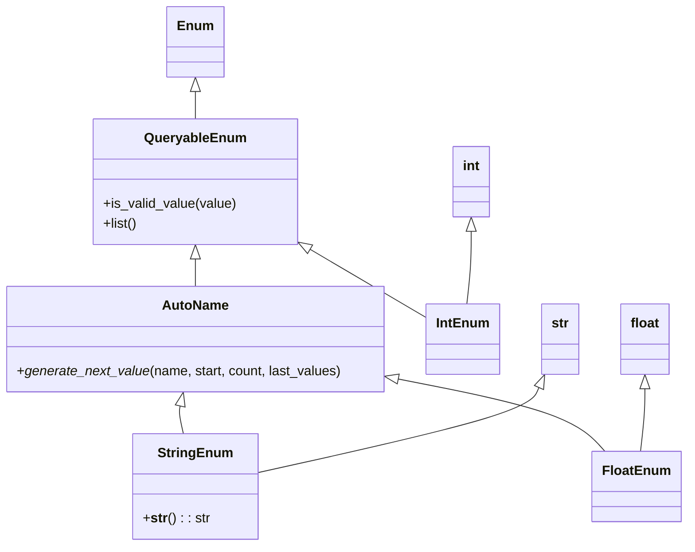

# Diagram: container_tracking_core/container_tracking_service/container_tracking_service/common/enum.py

> Auto-generated by Obscura crawlers

## Mermaid

### SVG

<svg id="container" width="813.53125" xmlns="http://www.w3.org/2000/svg" class="classDiagram" height="652" viewBox="0 0 813.53125 652" role="graphics-document document" aria-roledescription="class"><g><defs><marker id="container_class-aggregationStart" class="marker aggregation class" refX="18" refY="7" markerWidth="190" markerHeight="240" orient="auto"><path d="M 18,7 L9,13 L1,7 L9,1 Z"></path></marker></defs><defs><marker id="container_class-aggregationEnd" class="marker aggregation class" refX="1" refY="7" markerWidth="20" markerHeight="28" orient="auto"><path d="M 18,7 L9,13 L1,7 L9,1 Z"></path></marker></defs><defs><marker id="container_class-extensionStart" class="marker extension class" refX="18" refY="7" markerWidth="190" markerHeight="240" orient="auto"><path d="M 1,7 L18,13 V 1 Z"></path></marker></defs><defs><marker id="container_class-extensionEnd" class="marker extension class" refX="1" refY="7" markerWidth="20" markerHeight="28" orient="auto"><path d="M 1,1 V 13 L18,7 Z"></path></marker></defs><defs><marker id="container_class-compositionStart" class="marker composition class" refX="18" refY="7" markerWidth="190" markerHeight="240" orient="auto"><path d="M 18,7 L9,13 L1,7 L9,1 Z"></path></marker></defs><defs><marker id="container_class-compositionEnd" class="marker composition class" refX="1" refY="7" markerWidth="20" markerHeight="28" orient="auto"><path d="M 18,7 L9,13 L1,7 L9,1 Z"></path></marker></defs><defs><marker id="container_class-dependencyStart" class="marker dependency class" refX="6" refY="7" markerWidth="190" markerHeight="240" orient="auto"><path d="M 5,7 L9,13 L1,7 L9,1 Z"></path></marker></defs><defs><marker id="container_class-dependencyEnd" class="marker dependency class" refX="13" refY="7" markerWidth="20" markerHeight="28" orient="auto"><path d="M 18,7 L9,13 L14,7 L9,1 Z"></path></marker></defs><defs><marker id="container_class-lollipopStart" class="marker lollipop class" refX="13" refY="7" markerWidth="190" markerHeight="240" orient="auto"><circle stroke="black" fill="transparent" cx="7" cy="7" r="6"></circle></marker></defs><defs><marker id="container_class-lollipopEnd" class="marker lollipop class" refX="1" refY="7" markerWidth="190" markerHeight="240" orient="auto"><circle stroke="black" fill="transparent" cx="7" cy="7" r="6"></circle></marker></defs><g class="root"><g class="clusters"></g><g class="edgePaths"><path d="M232.781,109.25L232.781,110.542C232.781,111.833,232.781,114.417,232.781,119.875C232.781,125.333,232.781,133.667,232.781,137.833L232.781,142" id="id_Enum_QueryableEnum_1" class="edge-thickness-normal edge-pattern-solid relation" style=";;;" data-edge="true" data-et="edge" data-id="id_Enum_QueryableEnum_1" data-points="W3sieCI6MjMyLjc4MTI1LCJ5Ijo5Mn0seyJ4IjoyMzIuNzgxMjUsInkiOjExN30seyJ4IjoyMzIuNzgxMjUsInkiOjE0Mn1d" marker-start="url(#container_class-extensionStart)"></path><path d="M232.781,309.25L232.781,310.542C232.781,311.833,232.781,314.417,232.781,319.875C232.781,325.333,232.781,333.667,232.781,337.833L232.781,342" id="id_QueryableEnum_AutoName_2" class="edge-thickness-normal edge-pattern-solid relation" style=";;;" data-edge="true" data-et="edge" data-id="id_QueryableEnum_AutoName_2" data-points="W3sieCI6MjMyLjc4MTI1LCJ5IjoyOTJ9LHsieCI6MjMyLjc4MTI1LCJ5IjozMTd9LHsieCI6MjMyLjc4MTI1LCJ5IjozNDJ9XQ==" marker-start="url(#container_class-extensionStart)"></path><path d="M367.654,297.063L373.251,300.386C378.849,303.709,390.043,310.354,413.362,324.181C436.68,338.008,472.121,359.017,489.842,369.521L507.563,380.025" id="id_QueryableEnum_IntEnum_3" class="edge-thickness-normal edge-pattern-solid relation" style=";;;" data-edge="true" data-et="edge" data-id="id_QueryableEnum_IntEnum_3" data-points="W3sieCI6MzUyLjgyMDMxMjUsInkiOjI4OC4yNTc5NzEwMTQ0OTI3NH0seyJ4Ijo0MDEuMjM4MjgxMjUsInkiOjMxN30seyJ4Ijo1MDcuNTYyNSwieSI6MzgwLjAyNTE4MDg5NzI1MDR9XQ==" marker-start="url(#container_class-extensionStart)"></path><path d="M559.695,276.25L559.695,283.042C559.695,289.833,559.695,303.417,558.824,317.875C557.953,332.333,556.21,347.667,555.339,355.333L554.468,363" id="id_int_IntEnum_4" class="edge-thickness-normal edge-pattern-solid relation" style=";;;" data-edge="true" data-et="edge" data-id="id_int_IntEnum_4" data-points="W3sieCI6NTU5LjY5NTMxMjUsInkiOjI1OX0seyJ4Ijo1NTkuNjk1MzEyNSwieSI6MzE3fSx7IngiOjU1NC40NjgwMzk3NzI3MjczLCJ5IjozNjN9XQ==" marker-start="url(#container_class-extensionStart)"></path><path d="M214.64,484.821L214.33,486.184C214.02,487.547,213.401,490.274,214.038,495.804C214.675,501.333,216.569,509.667,217.516,513.833L218.463,518" id="id_AutoName_StringEnum_5" class="edge-thickness-normal edge-pattern-solid relation" style=";;;" data-edge="true" data-et="edge" data-id="id_AutoName_StringEnum_5" data-points="W3sieCI6MjE4LjQ2MzA2ODE4MTgxODIsInkiOjQ2OH0seyJ4IjoyMTIuNzgxMjUsInkiOjQ5M30seyJ4IjoyMTguNDYzMDY4MTgxODE4MiwieSI6NTE4fV0=" marker-start="url(#container_class-extensionStart)"></path><path d="M640.459,462.984L638.429,467.986C636.399,472.989,632.338,482.995,576.454,499.98C520.57,516.965,412.863,540.931,359.01,552.913L305.156,564.896" id="id_str_StringEnum_6" class="edge-thickness-normal edge-pattern-solid relation" style=";;;" data-edge="true" data-et="edge" data-id="id_str_StringEnum_6" data-points="W3sieCI6NjQ2Ljk0NjQ2NjYxOTMxODEsInkiOjQ0N30seyJ4Ijo2MjguMjc3MzQzNzUsInkiOjQ5M30seyJ4IjozMDUuMTU2MjUsInkiOjU2NC44OTYxNzQ3MDE0NzI3fV0=" marker-start="url(#container_class-extensionStart)"></path><path d="M474.486,452.678L508.555,459.398C542.624,466.119,610.761,479.559,651.48,493.946C692.199,508.333,705.5,523.667,712.151,531.333L718.801,539" id="id_AutoName_FloatEnum_7" class="edge-thickness-normal edge-pattern-solid relation" style=";;;" data-edge="true" data-et="edge" data-id="id_AutoName_FloatEnum_7" data-points="W3sieCI6NDU3LjU2MjUsInkiOjQ0OS4zMzk4MDcwMTUzOTMyNn0seyJ4Ijo2NzguODk4NDM3NSwieSI6NDkzfSx7IngiOjcxOC44MDEzMTM5MjA0NTQ1LCJ5Ijo1Mzl9XQ==" marker-start="url(#container_class-extensionStart)"></path><path d="M765.234,464.25L765.234,469.042C765.234,473.833,765.234,483.417,764.363,495.875C763.492,508.333,761.75,523.667,760.878,531.333L760.007,539" id="id_float_FloatEnum_8" class="edge-thickness-normal edge-pattern-solid relation" style=";;;" data-edge="true" data-et="edge" data-id="id_float_FloatEnum_8" data-points="W3sieCI6NzY1LjIzNDM3NSwieSI6NDQ3fSx7IngiOjc2NS4yMzQzNzUsInkiOjQ5M30seyJ4Ijo3NjAuMDA3MTAyMjcyNzI3MywieSI6NTM5fV0=" marker-start="url(#container_class-extensionStart)"></path></g><g class="edgeLabels"><g class="edgeLabel"><g class="label" data-id="id_Enum_QueryableEnum_1" transform="translate(0, 0)"><foreignObject width="0" height="0">

</foreignObject></g></g><g class="edgeLabel"><g class="label" data-id="id_QueryableEnum_AutoName_2" transform="translate(0, 0)"><foreignObject width="0" height="0">

</foreignObject></g></g><g class="edgeLabel"><g class="label" data-id="id_QueryableEnum_IntEnum_3" transform="translate(0, 0)"><foreignObject width="0" height="0">

</foreignObject></g></g><g class="edgeLabel"><g class="label" data-id="id_int_IntEnum_4" transform="translate(0, 0)"><foreignObject width="0" height="0">

</foreignObject></g></g><g class="edgeLabel"><g class="label" data-id="id_AutoName_StringEnum_5" transform="translate(0, 0)"><foreignObject width="0" height="0">

</foreignObject></g></g><g class="edgeLabel"><g class="label" data-id="id_str_StringEnum_6" transform="translate(0, 0)"><foreignObject width="0" height="0">

</foreignObject></g></g><g class="edgeLabel"><g class="label" data-id="id_AutoName_FloatEnum_7" transform="translate(0, 0)"><foreignObject width="0" height="0">

</foreignObject></g></g><g class="edgeLabel"><g class="label" data-id="id_float_FloatEnum_8" transform="translate(0, 0)"><foreignObject width="0" height="0">

</foreignObject></g></g></g><g class="nodes"><g class="node default" id="classId-Enum-0" transform="translate(232.78125, 50)"><g class="basic label-container"><path d="M-32.0859375 -42 L32.0859375 -42 L32.0859375 42 L-32.0859375 42" stroke="none" stroke-width="0" fill="#ECECFF" style=""></path><path d="M-32.0859375 -42 C-16.89424227382156 -42, -1.7025470476431188 -42, 32.0859375 -42 M-32.0859375 -42 C-7.350851794169287 -42, 17.384233911661426 -42, 32.0859375 -42 M32.0859375 -42 C32.0859375 -24.31867580773702, 32.0859375 -6.637351615474039, 32.0859375 42 M32.0859375 -42 C32.0859375 -19.49534647548399, 32.0859375 3.0093070490320173, 32.0859375 42 M32.0859375 42 C9.160524633937698 42, -13.764888232124605 42, -32.0859375 42 M32.0859375 42 C6.845189817994434 42, -18.39555786401113 42, -32.0859375 42 M-32.0859375 42 C-32.0859375 15.785123890841003, -32.0859375 -10.429752218317994, -32.0859375 -42 M-32.0859375 42 C-32.0859375 18.94239317843404, -32.0859375 -4.1152136431319235, -32.0859375 -42" stroke="#9370DB" stroke-width="1.3" fill="none" stroke-dasharray="0 0" style=""></path></g><g class="annotation-group text" transform="translate(0, -18)"></g><g class="label-group text" transform="translate(-20.0859375, -18)"><g class="label" style="font-weight: bolder" transform="translate(0,-12)"><foreignObject width="40.171875" height="24">

Enum

</foreignObject></g></g><g class="members-group text" transform="translate(-20.0859375, 30)"></g><g class="methods-group text" transform="translate(-20.0859375, 60)"></g><g class="divider" style=""><path d="M-32.0859375 6 C-17.443411247345338 6, -2.800884994690673 6, 32.0859375 6 M-32.0859375 6 C-10.431497256372822 6, 11.222942987254356 6, 32.0859375 6" stroke="#9370DB" stroke-width="1.3" fill="none" stroke-dasharray="0 0" style=""></path></g><g class="divider" style=""><path d="M-32.0859375 24 C-13.694164828739662 24, 4.697607842520675 24, 32.0859375 24 M-32.0859375 24 C-9.02195771921205 24, 14.0420220615759 24, 32.0859375 24" stroke="#9370DB" stroke-width="1.3" fill="none" stroke-dasharray="0 0" style=""></path></g></g><g class="node default" id="classId-QueryableEnum-1" transform="translate(232.78125, 217)"><g class="basic label-container"><path d="M-120.0390625 -75 L120.0390625 -75 L120.0390625 75 L-120.0390625 75" stroke="none" stroke-width="0" fill="#ECECFF" style=""></path><path d="M-120.0390625 -75 C-34.30202281062378 -75, 51.435016878752435 -75, 120.0390625 -75 M-120.0390625 -75 C-52.658312244966126 -75, 14.722438010067748 -75, 120.0390625 -75 M120.0390625 -75 C120.0390625 -21.87864022501187, 120.0390625 31.242719549976258, 120.0390625 75 M120.0390625 -75 C120.0390625 -19.253218199319896, 120.0390625 36.49356360136021, 120.0390625 75 M120.0390625 75 C41.96087374529036 75, -36.117315009419286 75, -120.0390625 75 M120.0390625 75 C62.81489332098584 75, 5.590724141971677 75, -120.0390625 75 M-120.0390625 75 C-120.0390625 27.26387549368333, -120.0390625 -20.47224901263334, -120.0390625 -75 M-120.0390625 75 C-120.0390625 20.485308264000565, -120.0390625 -34.02938347199887, -120.0390625 -75" stroke="#9370DB" stroke-width="1.3" fill="none" stroke-dasharray="0 0" style=""></path></g><g class="annotation-group text" transform="translate(0, -51)"></g><g class="label-group text" transform="translate(-57.6875, -51)"><g class="label" style="font-weight: bolder" transform="translate(0,-12)"><foreignObject width="115.375" height="24">

QueryableEnum

</foreignObject></g></g><g class="members-group text" transform="translate(-108.0390625, -3)"></g><g class="methods-group text" transform="translate(-108.0390625, 27)"><g class="label" style="" transform="translate(0,-12)"><foreignObject width="158.390625" height="24">

+is_valid_value(value)

</foreignObject></g><g class="label" style="" transform="translate(0,12)"><foreignObject width="40.8125" height="24">

+list()

</foreignObject></g></g><g class="divider" style=""><path d="M-120.0390625 -27 C-32.90865263232705 -27, 54.221757235345905 -27, 120.0390625 -27 M-120.0390625 -27 C-26.668186241007106 -27, 66.70269001798579 -27, 120.0390625 -27" stroke="#9370DB" stroke-width="1.3" fill="none" stroke-dasharray="0 0" style=""></path></g><g class="divider" style=""><path d="M-120.0390625 -3 C-65.98999984053319 -3, -11.940937181066374 -3, 120.0390625 -3 M-120.0390625 -3 C-31.327206508978648 -3, 57.384649482042704 -3, 120.0390625 -3" stroke="#9370DB" stroke-width="1.3" fill="none" stroke-dasharray="0 0" style=""></path></g></g><g class="node default" id="classId-AutoName-2" transform="translate(232.78125, 405)"><g class="basic label-container"><path d="M-224.78125 -63 L224.78125 -63 L224.78125 63 L-224.78125 63" stroke="none" stroke-width="0" fill="#ECECFF" style=""></path><path d="M-224.78125 -63 C-84.56199000673251 -63, 55.65726998653497 -63, 224.78125 -63 M-224.78125 -63 C-95.19279695615691 -63, 34.39565608768618 -63, 224.78125 -63 M224.78125 -63 C224.78125 -23.095089031699693, 224.78125 16.809821936600613, 224.78125 63 M224.78125 -63 C224.78125 -23.262783315133916, 224.78125 16.474433369732168, 224.78125 63 M224.78125 63 C48.58804553735783 63, -127.60515892528434 63, -224.78125 63 M224.78125 63 C103.8071796409066 63, -17.166890718186806 63, -224.78125 63 M-224.78125 63 C-224.78125 27.726294782484224, -224.78125 -7.547410435031551, -224.78125 -63 M-224.78125 63 C-224.78125 31.330528022072716, -224.78125 -0.3389439558545675, -224.78125 -63" stroke="#9370DB" stroke-width="1.3" fill="none" stroke-dasharray="0 0" style=""></path></g><g class="annotation-group text" transform="translate(0, -39)"></g><g class="label-group text" transform="translate(-37.78125, -39)"><g class="label" style="font-weight: bolder" transform="translate(0,-12)"><foreignObject width="75.5625" height="24">

AutoName

</foreignObject></g></g><g class="members-group text" transform="translate(-212.78125, 9)"></g><g class="methods-group text" transform="translate(-212.78125, 39)"><g class="label" style="" transform="translate(0,-12)"><foreignObject width="387.78125" height="24">

+<em>generate_next_value</em>(name, start, count, last_values)

</foreignObject></g></g><g class="divider" style=""><path d="M-224.78125 -15 C-92.97676483947495 -15, 38.827720321050094 -15, 224.78125 -15 M-224.78125 -15 C-73.8654062552882 -15, 77.05043748942359 -15, 224.78125 -15" stroke="#9370DB" stroke-width="1.3" fill="none" stroke-dasharray="0 0" style=""></path></g><g class="divider" style=""><path d="M-224.78125 9 C-47.496499706633415 9, 129.78825058673317 9, 224.78125 9 M-224.78125 9 C-111.25279064886574 9, 2.2756687022685185 9, 224.78125 9" stroke="#9370DB" stroke-width="1.3" fill="none" stroke-dasharray="0 0" style=""></path></g></g><g class="node default" id="classId-IntEnum-3" transform="translate(549.6953125, 405)"><g class="basic label-container"><path d="M-42.1328125 -42 L42.1328125 -42 L42.1328125 42 L-42.1328125 42" stroke="none" stroke-width="0" fill="#ECECFF" style=""></path><path d="M-42.1328125 -42 C-18.828826450536347 -42, 4.475159598927306 -42, 42.1328125 -42 M-42.1328125 -42 C-11.997619901803624 -42, 18.137572696392752 -42, 42.1328125 -42 M42.1328125 -42 C42.1328125 -12.835896128443185, 42.1328125 16.32820774311363, 42.1328125 42 M42.1328125 -42 C42.1328125 -14.31511246064466, 42.1328125 13.369775078710681, 42.1328125 42 M42.1328125 42 C20.80722202934775 42, -0.5183684413045029 42, -42.1328125 42 M42.1328125 42 C22.380293432158687 42, 2.627774364317375 42, -42.1328125 42 M-42.1328125 42 C-42.1328125 24.52497341268258, -42.1328125 7.049946825365161, -42.1328125 -42 M-42.1328125 42 C-42.1328125 16.35226809979783, -42.1328125 -9.295463800404342, -42.1328125 -42" stroke="#9370DB" stroke-width="1.3" fill="none" stroke-dasharray="0 0" style=""></path></g><g class="annotation-group text" transform="translate(0, -18)"></g><g class="label-group text" transform="translate(-30.1328125, -18)"><g class="label" style="font-weight: bolder" transform="translate(0,-12)"><foreignObject width="60.265625" height="24">

IntEnum

</foreignObject></g></g><g class="members-group text" transform="translate(-30.1328125, 30)"></g><g class="methods-group text" transform="translate(-30.1328125, 60)"></g><g class="divider" style=""><path d="M-42.1328125 6 C-12.845114639757373 6, 16.442583220485254 6, 42.1328125 6 M-42.1328125 6 C-21.84890989647005 6, -1.565007292940102 6, 42.1328125 6" stroke="#9370DB" stroke-width="1.3" fill="none" stroke-dasharray="0 0" style=""></path></g><g class="divider" style=""><path d="M-42.1328125 24 C-18.856610051965482 24, 4.419592396069035 24, 42.1328125 24 M-42.1328125 24 C-19.058776547537317 24, 4.0152594049253665 24, 42.1328125 24" stroke="#9370DB" stroke-width="1.3" fill="none" stroke-dasharray="0 0" style=""></path></g></g><g class="node default" id="classId-StringEnum-4" transform="translate(232.78125, 581)"><g class="basic label-container"><path d="M-72.375 -63 L72.375 -63 L72.375 63 L-72.375 63" stroke="none" stroke-width="0" fill="#ECECFF" style=""></path><path d="M-72.375 -63 C-32.71943626612931 -63, 6.936127467741386 -63, 72.375 -63 M-72.375 -63 C-21.730305188047417 -63, 28.914389623905166 -63, 72.375 -63 M72.375 -63 C72.375 -31.624218101622034, 72.375 -0.24843620324406857, 72.375 63 M72.375 -63 C72.375 -23.159881682786185, 72.375 16.68023663442763, 72.375 63 M72.375 63 C29.234242061064876 63, -13.906515877870248 63, -72.375 63 M72.375 63 C25.06570495708845 63, -22.2435900858231 63, -72.375 63 M-72.375 63 C-72.375 25.845117594634807, -72.375 -11.309764810730385, -72.375 -63 M-72.375 63 C-72.375 23.902244787725728, -72.375 -15.195510424548544, -72.375 -63" stroke="#9370DB" stroke-width="1.3" fill="none" stroke-dasharray="0 0" style=""></path></g><g class="annotation-group text" transform="translate(0, -39)"></g><g class="label-group text" transform="translate(-42.234375, -39)"><g class="label" style="font-weight: bolder" transform="translate(0,-12)"><foreignObject width="84.46875" height="24">

StringEnum

</foreignObject></g></g><g class="members-group text" transform="translate(-60.375, 9)"></g><g class="methods-group text" transform="translate(-60.375, 39)"><g class="label" style="" transform="translate(0,-12)"><foreignObject width="78.515625" height="24">

+<strong>str</strong>() : : str

</foreignObject></g></g><g class="divider" style=""><path d="M-72.375 -15 C-25.401920207129464 -15, 21.57115958574107 -15, 72.375 -15 M-72.375 -15 C-26.415035127102534 -15, 19.54492974579493 -15, 72.375 -15" stroke="#9370DB" stroke-width="1.3" fill="none" stroke-dasharray="0 0" style=""></path></g><g class="divider" style=""><path d="M-72.375 9 C-29.913523436465333 9, 12.547953127069334 9, 72.375 9 M-72.375 9 C-17.502443592729087 9, 37.37011281454183 9, 72.375 9" stroke="#9370DB" stroke-width="1.3" fill="none" stroke-dasharray="0 0" style=""></path></g></g><g class="node default" id="classId-FloatEnum-5" transform="translate(755.234375, 581)"><g class="basic label-container"><path d="M-50.296875 -42 L50.296875 -42 L50.296875 42 L-50.296875 42" stroke="none" stroke-width="0" fill="#ECECFF" style=""></path><path d="M-50.296875 -42 C-26.94485124445047 -42, -3.5928274889009373 -42, 50.296875 -42 M-50.296875 -42 C-21.975438328991824 -42, 6.345998342016351 -42, 50.296875 -42 M50.296875 -42 C50.296875 -12.867867104940231, 50.296875 16.264265790119538, 50.296875 42 M50.296875 -42 C50.296875 -13.04537435445824, 50.296875 15.909251291083521, 50.296875 42 M50.296875 42 C30.127696619897087 42, 9.958518239794174 42, -50.296875 42 M50.296875 42 C27.19111053414977 42, 4.085346068299543 42, -50.296875 42 M-50.296875 42 C-50.296875 23.763121299590846, -50.296875 5.526242599181693, -50.296875 -42 M-50.296875 42 C-50.296875 9.653465230211424, -50.296875 -22.693069539577152, -50.296875 -42" stroke="#9370DB" stroke-width="1.3" fill="none" stroke-dasharray="0 0" style=""></path></g><g class="annotation-group text" transform="translate(0, -18)"></g><g class="label-group text" transform="translate(-38.296875, -18)"><g class="label" style="font-weight: bolder" transform="translate(0,-12)"><foreignObject width="76.59375" height="24">

FloatEnum

</foreignObject></g></g><g class="members-group text" transform="translate(-38.296875, 30)"></g><g class="methods-group text" transform="translate(-38.296875, 60)"></g><g class="divider" style=""><path d="M-50.296875 6 C-25.544502957708676 6, -0.7921309154173528 6, 50.296875 6 M-50.296875 6 C-20.149309331877085 6, 9.99825633624583 6, 50.296875 6" stroke="#9370DB" stroke-width="1.3" fill="none" stroke-dasharray="0 0" style=""></path></g><g class="divider" style=""><path d="M-50.296875 24 C-20.738354229485314 24, 8.820166541029373 24, 50.296875 24 M-50.296875 24 C-16.71830003423093 24, 16.860274931538143 24, 50.296875 24" stroke="#9370DB" stroke-width="1.3" fill="none" stroke-dasharray="0 0" style=""></path></g></g><g class="node default" id="classId-int-6" transform="translate(559.6953125, 217)"><g class="basic label-container"><path d="M-21.9609375 -42 L21.9609375 -42 L21.9609375 42 L-21.9609375 42" stroke="none" stroke-width="0" fill="#ECECFF" style=""></path><path d="M-21.9609375 -42 C-8.8026910701931 -42, 4.355555359613799 -42, 21.9609375 -42 M-21.9609375 -42 C-7.974091278855061 -42, 6.012754942289877 -42, 21.9609375 -42 M21.9609375 -42 C21.9609375 -22.548977478738855, 21.9609375 -3.097954957477711, 21.9609375 42 M21.9609375 -42 C21.9609375 -19.31642577190813, 21.9609375 3.3671484561837417, 21.9609375 42 M21.9609375 42 C8.324075698368457 42, -5.312786103263086 42, -21.9609375 42 M21.9609375 42 C9.249542221307365 42, -3.4618530573852695 42, -21.9609375 42 M-21.9609375 42 C-21.9609375 23.12648034451797, -21.9609375 4.2529606890359375, -21.9609375 -42 M-21.9609375 42 C-21.9609375 19.535165909526086, -21.9609375 -2.9296681809478287, -21.9609375 -42" stroke="#9370DB" stroke-width="1.3" fill="none" stroke-dasharray="0 0" style=""></path></g><g class="annotation-group text" transform="translate(0, -18)"></g><g class="label-group text" transform="translate(-9.9609375, -18)"><g class="label" style="font-weight: bolder" transform="translate(0,-12)"><foreignObject width="19.921875" height="24">

int

</foreignObject></g></g><g class="members-group text" transform="translate(-9.9609375, 30)"></g><g class="methods-group text" transform="translate(-9.9609375, 60)"></g><g class="divider" style=""><path d="M-21.9609375 6 C-7.975550092531986 6, 6.0098373149360285 6, 21.9609375 6 M-21.9609375 6 C-12.744665369470457 6, -3.5283932389409145 6, 21.9609375 6" stroke="#9370DB" stroke-width="1.3" fill="none" stroke-dasharray="0 0" style=""></path></g><g class="divider" style=""><path d="M-21.9609375 24 C-6.741212989408426 24, 8.478511521183147 24, 21.9609375 24 M-21.9609375 24 C-12.470253253490812 24, -2.979569006981624 24, 21.9609375 24" stroke="#9370DB" stroke-width="1.3" fill="none" stroke-dasharray="0 0" style=""></path></g></g><g class="node default" id="classId-str-7" transform="translate(663.9921875, 405)"><g class="basic label-container"><path d="M-22.1640625 -42 L22.1640625 -42 L22.1640625 42 L-22.1640625 42" stroke="none" stroke-width="0" fill="#ECECFF" style=""></path><path d="M-22.1640625 -42 C-9.237835174633346 -42, 3.688392150733307 -42, 22.1640625 -42 M-22.1640625 -42 C-7.7946673144679846 -42, 6.574727871064031 -42, 22.1640625 -42 M22.1640625 -42 C22.1640625 -20.85511781535833, 22.1640625 0.2897643692833398, 22.1640625 42 M22.1640625 -42 C22.1640625 -16.952773154271267, 22.1640625 8.094453691457467, 22.1640625 42 M22.1640625 42 C10.047075426153583 42, -2.069911647692834 42, -22.1640625 42 M22.1640625 42 C7.576195208461559 42, -7.011672083076881 42, -22.1640625 42 M-22.1640625 42 C-22.1640625 22.377971887562335, -22.1640625 2.7559437751246705, -22.1640625 -42 M-22.1640625 42 C-22.1640625 12.709535802007949, -22.1640625 -16.580928395984103, -22.1640625 -42" stroke="#9370DB" stroke-width="1.3" fill="none" stroke-dasharray="0 0" style=""></path></g><g class="annotation-group text" transform="translate(0, -18)"></g><g class="label-group text" transform="translate(-10.1640625, -18)"><g class="label" style="font-weight: bolder" transform="translate(0,-12)"><foreignObject width="20.328125" height="24">

str

</foreignObject></g></g><g class="members-group text" transform="translate(-10.1640625, 30)"></g><g class="methods-group text" transform="translate(-10.1640625, 60)"></g><g class="divider" style=""><path d="M-22.1640625 6 C-10.636914989703374 6, 0.8902325205932513 6, 22.1640625 6 M-22.1640625 6 C-10.273920628647549 6, 1.6162212427049027 6, 22.1640625 6" stroke="#9370DB" stroke-width="1.3" fill="none" stroke-dasharray="0 0" style=""></path></g><g class="divider" style=""><path d="M-22.1640625 24 C-11.058867374838881 24, 0.046327750322237904 24, 22.1640625 24 M-22.1640625 24 C-6.835808529250183 24, 8.492445441499633 24, 22.1640625 24" stroke="#9370DB" stroke-width="1.3" fill="none" stroke-dasharray="0 0" style=""></path></g></g><g class="node default" id="classId-float-8" transform="translate(765.234375, 405)"><g class="basic label-container"><path d="M-29.078125 -42 L29.078125 -42 L29.078125 42 L-29.078125 42" stroke="none" stroke-width="0" fill="#ECECFF" style=""></path><path d="M-29.078125 -42 C-11.540364544443491 -42, 5.997395911113017 -42, 29.078125 -42 M-29.078125 -42 C-8.42580684188647 -42, 12.226511316227061 -42, 29.078125 -42 M29.078125 -42 C29.078125 -19.113712704941943, 29.078125 3.7725745901161147, 29.078125 42 M29.078125 -42 C29.078125 -16.736116299014604, 29.078125 8.527767401970792, 29.078125 42 M29.078125 42 C6.875862459368356 42, -15.326400081263287 42, -29.078125 42 M29.078125 42 C10.636932541789001 42, -7.804259916421998 42, -29.078125 42 M-29.078125 42 C-29.078125 22.349328545025013, -29.078125 2.698657090050027, -29.078125 -42 M-29.078125 42 C-29.078125 22.993251376502368, -29.078125 3.9865027530047357, -29.078125 -42" stroke="#9370DB" stroke-width="1.3" fill="none" stroke-dasharray="0 0" style=""></path></g><g class="annotation-group text" transform="translate(0, -18)"></g><g class="label-group text" transform="translate(-17.078125, -18)"><g class="label" style="font-weight: bolder" transform="translate(0,-12)"><foreignObject width="34.15625" height="24">

float

</foreignObject></g></g><g class="members-group text" transform="translate(-17.078125, 30)"></g><g class="methods-group text" transform="translate(-17.078125, 60)"></g><g class="divider" style=""><path d="M-29.078125 6 C-10.201523382985968 6, 8.675078234028064 6, 29.078125 6 M-29.078125 6 C-15.643663589323175 6, -2.2092021786463505 6, 29.078125 6" stroke="#9370DB" stroke-width="1.3" fill="none" stroke-dasharray="0 0" style=""></path></g><g class="divider" style=""><path d="M-29.078125 24 C-10.758921266870338 24, 7.5602824662593235 24, 29.078125 24 M-29.078125 24 C-12.27483260546932 24, 4.528459789061358 24, 29.078125 24" stroke="#9370DB" stroke-width="1.3" fill="none" stroke-dasharray="0 0" style=""></path></g></g></g></g></g></svg>
