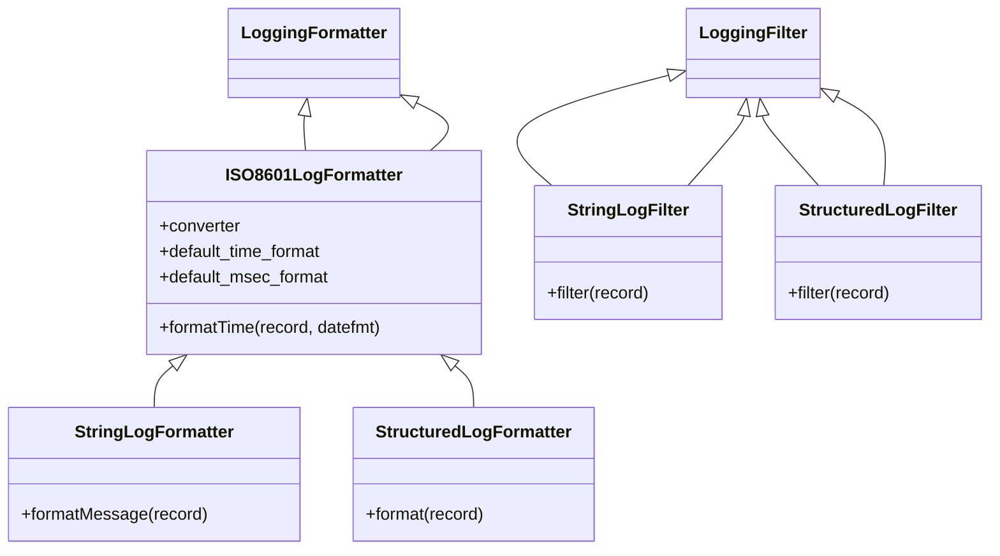

# Diagram: container_tracking_core/container_tracking_service/container_tracking_service/common/log.py


> Auto-generated by Obscura crawlers

## Diagram 1



> SVG rendering failed for this diagram.

## Diagram 2

```mermaid
flowchart LR
subgraph DecoratorFlow
    A[config_logging decorator invoked] --> B{is_logging_enabled(context)?}
    B -- yes --> C[get_request_id(event)]
    C --> D[remove existing root handlers]
    D --> E[determine log_level (env or default)]
    E --> F[create Structured and String handlers]
    F --> G[set formatters (StructuredLogFormatter, StringLogFormatter)]
    G --> H[add filters (StructuredLogFilter, StringLogFilter)]
    H --> I[add handlers to root_logger]
    I --> J[call wrapped function event, context]
    B -- no --> J
end
subgraph ConfigureFlow
    K[configure_logging(log_level, log_format, request_id)] --> L[remove existing root handlers]
    L --> M[determine log_level (env or provided)]
    M --> N[create Structured and String handlers]
    N --> O[set formatters (StructuredLogFormatter, StringLogFormatter)]
    O --> P[add filters (StructuredLogFilter, StringLogFilter)]
    P --> Q[add handlers to root_logger]
end
J --> End[return wrapped function result]
Q --> End
```

> SVG rendering failed for this diagram.
