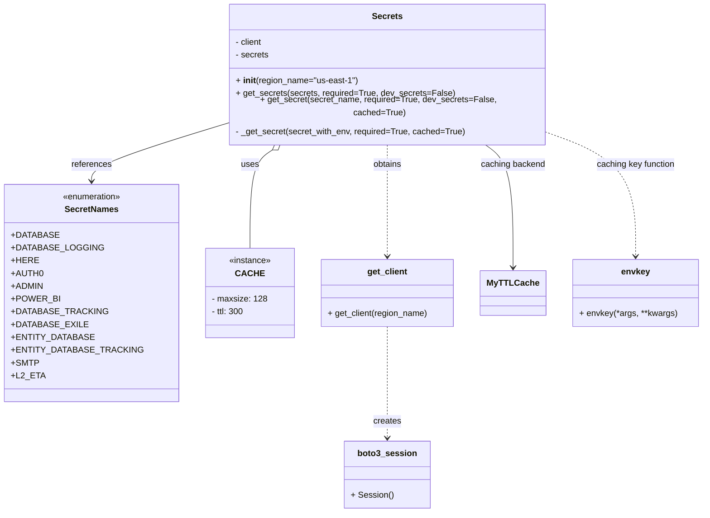

# Diagram: container_tracking_core/container_tracking_service/container_tracking_service/common/secrets/__init__.py


> Auto-generated by Obscura crawlers

## Diagram 1



> SVG rendering failed for this diagram.

## Diagram 2

```mermaid
flowchart TD
    Start(["Start: Secrets.get_secret(secret_name)"])
    CheckCached{secret_name in self.secrets?}
    ReturnCached["Return self.secrets[secret_name]"]
    GetStage["stage = os.environ.get('AWS_STAGE')\nspec_env = os.environ.get('SPECIFIED_ENV')\nif not dev_secrets: stage = dev_to_staging(stage, spec_env)"]
    Compose["secret_with_env = f\"{stage}/{secret_name}\""]
    CallGet["_get_secret(secret_with_env, required=True, cached=cached)  (cached via envkey)"]
    TryGet["client.get_secret_value(SecretId=secret_with_env)"]
    RNFException[/"ResourceNotFoundException"/]
    ClientErrorNode[/ClientError/]
    Success["Response received"]
    CheckSecretString{"'SecretString' in response?"}
    Parse["secret = dotdict(json.loads(SecretString))\nreturn secret"]
    SecretNone["secret is None"]
    RequiredNone{required?}
    RaiseBadReq["raise BadRequestError(message, message)"]
    LogWarnNone["logging.warning(...) \nreturn None"]
    RequiredRNF{required?}
    LogErrRaiseRNF["logging.error(...)\nraise"]
    LogWarnRNF["logging.warning(...)\nreturn None"]
    RequiredCE{required?}
    LogErrRaiseCE["logging.error(...)\nraise"]
    LogWarnCE["logging.warning(...)\nreturn None"]

    Start --> CheckCached
    CheckCached -- yes --> ReturnCached
    CheckCached -- no --> GetStage --> Compose --> CallGet --> TryGet
    TryGet --> RNFException
    TryGet --> ClientErrorNode
    TryGet --> Success
    RNFException --> RequiredRNF
    RequiredRNF -- yes --> LogErrRaiseRNF
    RequiredRNF -- no --> LogWarnRNF
    ClientErrorNode --> RequiredCE
    RequiredCE -- yes --> LogErrRaiseCE
    RequiredCE -- no --> LogWarnCE
    Success --> CheckSecretString
    CheckSecretString -- yes --> Parse
    CheckSecretString -- no --> SecretNone --> RequiredNone
    RequiredNone -- yes --> RaiseBadReq
    RequiredNone -- no --> LogWarnNone
```

> SVG rendering failed for this diagram.
