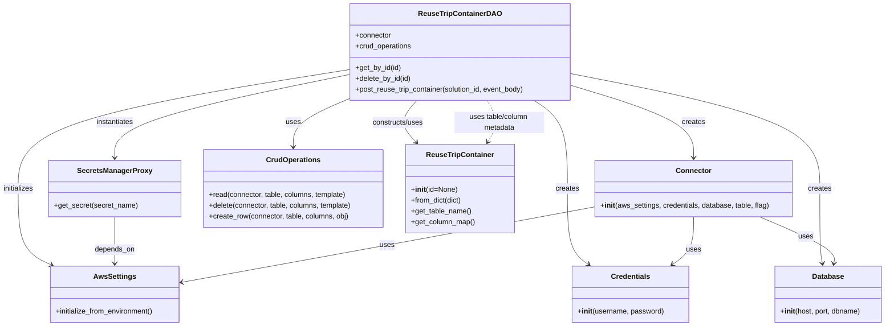
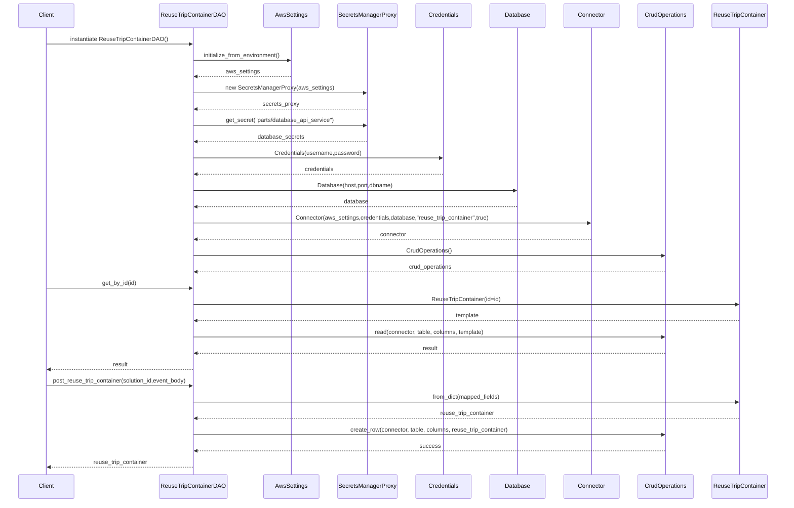

# Diagram: container_tracking_core/container_tracking_service/container_tracking_service/core/business/ReuseTripContainerDAO.py

> Auto-generated by Obscura crawlers

## Diagram 1

### SVG

<svg id="container" width="1973.97265625" xmlns="http://www.w3.org/2000/svg" class="classDiagram" height="728" viewBox="0 0 1973.97265625 728" role="graphics-document document" aria-roledescription="class"><g><defs><marker id="container_class-aggregationStart" class="marker aggregation class" refX="18" refY="7" markerWidth="190" markerHeight="240" orient="auto"><path d="M 18,7 L9,13 L1,7 L9,1 Z"></path></marker></defs><defs><marker id="container_class-aggregationEnd" class="marker aggregation class" refX="1" refY="7" markerWidth="20" markerHeight="28" orient="auto"><path d="M 18,7 L9,13 L1,7 L9,1 Z"></path></marker></defs><defs><marker id="container_class-extensionStart" class="marker extension class" refX="18" refY="7" markerWidth="190" markerHeight="240" orient="auto"><path d="M 1,7 L18,13 V 1 Z"></path></marker></defs><defs><marker id="container_class-extensionEnd" class="marker extension class" refX="1" refY="7" markerWidth="20" markerHeight="28" orient="auto"><path d="M 1,1 V 13 L18,7 Z"></path></marker></defs><defs><marker id="container_class-compositionStart" class="marker composition class" refX="18" refY="7" markerWidth="190" markerHeight="240" orient="auto"><path d="M 18,7 L9,13 L1,7 L9,1 Z"></path></marker></defs><defs><marker id="container_class-compositionEnd" class="marker composition class" refX="1" refY="7" markerWidth="20" markerHeight="28" orient="auto"><path d="M 18,7 L9,13 L1,7 L9,1 Z"></path></marker></defs><defs><marker id="container_class-dependencyStart" class="marker dependency class" refX="6" refY="7" markerWidth="190" markerHeight="240" orient="auto"><path d="M 5,7 L9,13 L1,7 L9,1 Z"></path></marker></defs><defs><marker id="container_class-dependencyEnd" class="marker dependency class" refX="13" refY="7" markerWidth="20" markerHeight="28" orient="auto"><path d="M 18,7 L9,13 L14,7 L9,1 Z"></path></marker></defs><defs><marker id="container_class-lollipopStart" class="marker lollipop class" refX="13" refY="7" markerWidth="190" markerHeight="240" orient="auto"><circle stroke="black" fill="transparent" cx="7" cy="7" r="6"></circle></marker></defs><defs><marker id="container_class-lollipopEnd" class="marker lollipop class" refX="1" refY="7" markerWidth="190" markerHeight="240" orient="auto"><circle stroke="black" fill="transparent" cx="7" cy="7" r="6"></circle></marker></defs><g class="root"><g class="clusters"></g><g class="edgePaths"><path d="M778.246,155.576L655.665,175.147C533.083,194.717,287.921,233.859,165.339,278.096C42.758,322.333,42.758,371.667,42.758,419C42.758,466.333,42.758,511.667,55.069,540.077C67.381,568.488,92.004,579.976,104.316,585.719L116.628,591.463" id="id_ReuseTripContainerDAO_AwsSettings_1" class="edge-thickness-normal edge-pattern-solid relation" style=";;;" data-edge="true" data-et="edge" data-id="id_ReuseTripContainerDAO_AwsSettings_1" data-points="W3sieCI6Nzc4LjI0NjA5Mzc1LCJ5IjoxNTUuNTc2MTY4NjQ3NTE0OTJ9LHsieCI6NDIuNzU3ODEyNSwieSI6MjczfSx7IngiOjQyLjc1NzgxMjUsInkiOjQyMX0seyJ4Ijo0Mi43NTc4MTI1LCJ5Ijo1NTd9LHsieCI6MTIyLjA2NSwieSI6NTk0fV0=" marker-end="url(#container_class-dependencyEnd)"></path><path d="M778.246,166.607L691.389,184.339C604.531,202.071,430.816,237.536,343.959,268.434C257.102,299.333,257.102,325.667,257.102,338.833L257.102,352" id="id_ReuseTripContainerDAO_SecretsManagerProxy_2" class="edge-thickness-normal edge-pattern-solid relation" style=";;;" data-edge="true" data-et="edge" data-id="id_ReuseTripContainerDAO_SecretsManagerProxy_2" data-points="W3sieCI6Nzc4LjI0NjA5Mzc1LCJ5IjoxNjYuNjA2ODA1NDM3MDM1MjN9LHsieCI6MjU3LjEwMTU2MjUsInkiOjI3M30seyJ4IjoyNTcuMTAxNTYyNSwieSI6MzU4fV0=" marker-end="url(#container_class-dependencyEnd)"></path><path d="M257.102,484L257.102,496.167C257.102,508.333,257.102,532.667,257.102,550C257.102,567.333,257.102,577.667,257.102,582.833L257.102,588" id="id_SecretsManagerProxy_AwsSettings_3" class="edge-thickness-normal edge-pattern-solid relation" style=";;;" data-edge="true" data-et="edge" data-id="id_SecretsManagerProxy_AwsSettings_3" data-points="W3sieCI6MjU3LjEwMTU2MjUsInkiOjQ4NH0seyJ4IjoyNTcuMTAxNTYyNSwieSI6NTU3fSx7IngiOjI1Ny4xMDE1NjI1LCJ5Ijo1OTR9XQ==" marker-end="url(#container_class-dependencyEnd)"></path><path d="M1190.847,224L1203.302,232.167C1215.757,240.333,1240.668,256.667,1253.123,289.5C1265.578,322.333,1265.578,371.667,1265.578,419C1265.578,466.333,1265.578,511.667,1273.433,539.92C1281.287,568.174,1296.996,579.348,1304.851,584.935L1312.706,590.522" id="id_ReuseTripContainerDAO_Credentials_4" class="edge-thickness-normal edge-pattern-solid relation" style=";;;" data-edge="true" data-et="edge" data-id="id_ReuseTripContainerDAO_Credentials_4" data-points="W3sieCI6MTE5MC44NDY3ODU0Mjk5MzYzLCJ5IjoyMjR9LHsieCI6MTI2NS41NzgxMjUsInkiOjI3M30seyJ4IjoxMjY1LjU3ODEyNSwieSI6NDIxfSx7IngiOjEyNjUuNTc4MTI1LCJ5Ijo1NTd9LHsieCI6MTMxNy41OTQ5MjE4NzUsInkiOjU5NH1d" marker-end="url(#container_class-dependencyEnd)"></path><path d="M1274.02,164.539L1366.337,182.616C1458.654,200.693,1643.288,236.846,1735.605,279.59C1827.922,322.333,1827.922,371.667,1827.922,419C1827.922,466.333,1827.922,511.667,1828.868,539.516C1829.813,567.366,1831.705,577.732,1832.65,582.915L1833.596,588.097" id="id_ReuseTripContainerDAO_Database_5" class="edge-thickness-normal edge-pattern-solid relation" style=";;;" data-edge="true" data-et="edge" data-id="id_ReuseTripContainerDAO_Database_5" data-points="W3sieCI6MTI3NC4wMTk1MzEyNSwieSI6MTY0LjUzOTIxODkzNDIxOTM4fSx7IngiOjE4MjcuOTIxODc1LCJ5IjoyNzN9LHsieCI6MTgyNy45MjE4NzUsInkiOjQyMX0seyJ4IjoxODI3LjkyMTg3NSwieSI6NTU3fSx7IngiOjE4MzQuNjcyOTI5Njg3NSwieSI6NTk0fV0=" marker-end="url(#container_class-dependencyEnd)"></path><path d="M1274.02,190.754L1319.475,204.462C1364.93,218.169,1455.84,245.585,1501.295,272.459C1546.75,299.333,1546.75,325.667,1546.75,338.833L1546.75,352" id="id_ReuseTripContainerDAO_Connector_6" class="edge-thickness-normal edge-pattern-solid relation" style=";;;" data-edge="true" data-et="edge" data-id="id_ReuseTripContainerDAO_Connector_6" data-points="W3sieCI6MTI3NC4wMTk1MzEyNSwieSI6MTkwLjc1Mzk5NTQwODA5NDM0fSx7IngiOjE1NDYuNzUsInkiOjI3M30seyJ4IjoxNTQ2Ljc1LCJ5IjozNTh9XQ==" marker-end="url(#container_class-dependencyEnd)"></path><path d="M1326.75,461.781L1241.138,477.651C1155.526,493.521,984.302,525.26,831.292,553.253C678.282,581.245,543.486,605.49,476.088,617.612L408.69,629.735" id="id_Connector_AwsSettings_7" class="edge-thickness-normal edge-pattern-solid relation" style=";;;" data-edge="true" data-et="edge" data-id="id_Connector_AwsSettings_7" data-points="W3sieCI6MTMyNi43NSwieSI6NDYxLjc4MTE3MzQ2Mzk1NDl9LHsieCI6ODEzLjA3ODEyNSwieSI6NTU3fSx7IngiOjQwMi43ODUxNTYyNSwieSI6NjMwLjc5NjgxMDIyOTc0Nzd9XQ==" marker-end="url(#container_class-dependencyEnd)"></path><path d="M1546.75,484L1546.75,496.167C1546.75,508.333,1546.75,532.667,1538.895,550.42C1531.041,568.174,1515.332,579.348,1507.477,584.935L1499.622,590.522" id="id_Connector_Credentials_8" class="edge-thickness-normal edge-pattern-solid relation" style=";;;" data-edge="true" data-et="edge" data-id="id_Connector_Credentials_8" data-points="W3sieCI6MTU0Ni43NSwieSI6NDg0fSx7IngiOjE1NDYuNzUsInkiOjU1N30seyJ4IjoxNDk0LjczMzIwMzEyNSwieSI6NTk0fV0=" marker-end="url(#container_class-dependencyEnd)"></path><path d="M1693.903,484L1722.322,496.167C1750.74,508.333,1807.577,532.667,1835.05,550.016C1862.523,567.366,1860.631,577.732,1859.686,582.915L1858.74,588.097" id="id_Connector_Database_9" class="edge-thickness-normal edge-pattern-solid relation" style=";;;" data-edge="true" data-et="edge" data-id="id_Connector_Database_9" data-points="W3sieCI6MTY5My45MDMyMDU0MjI3OTQxLCJ5Ijo0ODR9LHsieCI6MTg2NC40MTQwNjI1LCJ5Ijo1NTd9LHsieCI6MTg1Ny42NjMwMDc4MTI1LCJ5Ijo1OTR9XQ==" marker-end="url(#container_class-dependencyEnd)"></path><path d="M778.246,220.631L757.568,229.359C736.889,238.087,695.533,255.544,674.854,273.438C654.176,291.333,654.176,309.667,654.176,318.833L654.176,328" id="id_ReuseTripContainerDAO_CrudOperations_10" class="edge-thickness-normal edge-pattern-solid relation" style=";;;" data-edge="true" data-et="edge" data-id="id_ReuseTripContainerDAO_CrudOperations_10" data-points="W3sieCI6Nzc4LjI0NjA5Mzc1LCJ5IjoyMjAuNjMwOTQyNzU0MjI0Mzh9LHsieCI6NjU0LjE3NTc4MTI1LCJ5IjoyNzN9LHsieCI6NjU0LjE3NTc4MTI1LCJ5IjozMzR9XQ==" marker-end="url(#container_class-dependencyEnd)"></path><path d="M930.785,224L923.575,232.167C916.365,240.333,901.945,256.667,901.7,272.27C901.455,287.874,915.385,302.747,922.349,310.184L929.314,317.621" id="id_ReuseTripContainerDAO_ReuseTripContainer_11" class="edge-thickness-normal edge-pattern-solid relation" style=";;;" data-edge="true" data-et="edge" data-id="id_ReuseTripContainerDAO_ReuseTripContainer_11" data-points="W3sieCI6OTMwLjc4NTAzMTg0NzEzMzcsInkiOjIyNH0seyJ4Ijo4ODcuNTI1MzkwNjI1LCJ5IjoyNzN9LHsieCI6OTMzLjQxNTY4NTcwNTIzNjUsInkiOjMyMn1d" marker-end="url(#container_class-dependencyEnd)"></path><path d="M1087.442,224L1092.078,232.167C1096.714,240.333,1105.986,256.667,1106.22,272.143C1106.454,287.62,1097.65,302.24,1093.248,309.55L1088.845,316.86" id="id_ReuseTripContainerDAO_ReuseTripContainer_12" class="edge-thickness-normal edge-pattern-dashed relation" style=";;;" data-edge="true" data-et="edge" data-id="id_ReuseTripContainerDAO_ReuseTripContainer_12" data-points="W3sieCI6MTA4Ny40NDE3Mjk2OTc0NTIzLCJ5IjoyMjR9LHsieCI6MTExNS4yNTc4MTI1LCJ5IjoyNzN9LHsieCI6MTA4NS43NTAyMTExNDg2NDg4LCJ5IjozMjJ9XQ==" marker-end="url(#container_class-dependencyEnd)"></path></g><g class="edgeLabels"><g class="edgeLabel" transform="translate(42.7578125, 421)"><g class="label" data-id="id_ReuseTripContainerDAO_AwsSettings_1" transform="translate(-34.7578125, -12)"><foreignObject width="69.515625" height="24">

initializes

</foreignObject></g></g><g class="edgeLabel" transform="translate(257.1015625, 273)"><g class="label" data-id="id_ReuseTripContainerDAO_SecretsManagerProxy_2" transform="translate(-42.9140625, -12)"><foreignObject width="85.828125" height="24">

instantiates

</foreignObject></g></g><g class="edgeLabel" transform="translate(257.1015625, 557)"><g class="label" data-id="id_SecretsManagerProxy_AwsSettings_3" transform="translate(-44.671875, -12)"><foreignObject width="89.34375" height="24">

depends_on

</foreignObject></g></g><g class="edgeLabel" transform="translate(1265.578125, 421)"><g class="label" data-id="id_ReuseTripContainerDAO_Credentials_4" transform="translate(-26.171875, -12)"><foreignObject width="52.34375" height="24">

creates

</foreignObject></g></g><g class="edgeLabel" transform="translate(1827.921875, 421)"><g class="label" data-id="id_ReuseTripContainerDAO_Database_5" transform="translate(-26.171875, -12)"><foreignObject width="52.34375" height="24">

creates

</foreignObject></g></g><g class="edgeLabel" transform="translate(1546.75, 273)"><g class="label" data-id="id_ReuseTripContainerDAO_Connector_6" transform="translate(-26.171875, -12)"><foreignObject width="52.34375" height="24">

creates

</foreignObject></g></g><g class="edgeLabel" transform="translate(864.96707, 547.3814)"><g class="label" data-id="id_Connector_AwsSettings_7" transform="translate(-16.4921875, -12)"><foreignObject width="32.984375" height="24">

uses

</foreignObject></g></g><g class="edgeLabel" transform="translate(1546.75, 557)"><g class="label" data-id="id_Connector_Credentials_8" transform="translate(-16.4921875, -12)"><foreignObject width="32.984375" height="24">

uses

</foreignObject></g></g><g class="edgeLabel" transform="translate(1796.44634, 527.9013)"><g class="label" data-id="id_Connector_Database_9" transform="translate(-16.4921875, -12)"><foreignObject width="32.984375" height="24">

uses

</foreignObject></g></g><g class="edgeLabel" transform="translate(654.17578125, 273)"><g class="label" data-id="id_ReuseTripContainerDAO_CrudOperations_10" transform="translate(-16.4921875, -12)"><foreignObject width="32.984375" height="24">

uses

</foreignObject></g></g><g class="edgeLabel" transform="translate(888.13035, 273.64596)"><g class="label" data-id="id_ReuseTripContainerDAO_ReuseTripContainer_11" transform="translate(-58.25, -12)"><foreignObject width="116.5" height="24">

constructs/uses

</foreignObject></g></g><g class="edgeLabel" transform="translate(1115.03754, 273.36579)"><g class="label" data-id="id_ReuseTripContainerDAO_ReuseTripContainer_12" transform="translate(-100, -24)"><foreignObject width="200" height="48">

uses table/column metadata

</foreignObject></g></g></g><g class="nodes"><g class="node default" id="classId-ReuseTripContainerDAO-0" transform="translate(1026.1328125, 116)"><g class="basic label-container"><path d="M-247.88671875 -108 L247.88671875 -108 L247.88671875 108 L-247.88671875 108" stroke="none" stroke-width="0" fill="#ECECFF" style=""></path><path d="M-247.88671875 -108 C-61.697227361775134 -108, 124.49226402644973 -108, 247.88671875 -108 M-247.88671875 -108 C-98.39130788260206 -108, 51.10410298479587 -108, 247.88671875 -108 M247.88671875 -108 C247.88671875 -33.67640561000627, 247.88671875 40.64718877998746, 247.88671875 108 M247.88671875 -108 C247.88671875 -29.917827395913534, 247.88671875 48.16434520817293, 247.88671875 108 M247.88671875 108 C65.61264279421965 108, -116.6614331615607 108, -247.88671875 108 M247.88671875 108 C142.2634138711253 108, 36.64010899225056 108, -247.88671875 108 M-247.88671875 108 C-247.88671875 58.62531329583272, -247.88671875 9.250626591665437, -247.88671875 -108 M-247.88671875 108 C-247.88671875 53.4297107635014, -247.88671875 -1.1405784729972055, -247.88671875 -108" stroke="#9370DB" stroke-width="1.3" fill="none" stroke-dasharray="0 0" style=""></path></g><g class="annotation-group text" transform="translate(0, -84)"></g><g class="label-group text" transform="translate(-87.3046875, -84)"><g class="label" style="font-weight: bolder" transform="translate(0,-12)"><foreignObject width="174.609375" height="24">

ReuseTripContainerDAO

</foreignObject></g></g><g class="members-group text" transform="translate(-235.88671875, -36)"><g class="label" style="" transform="translate(0,-12)"><foreignObject width="80.84375" height="24">

+connector

</foreignObject></g><g class="label" style="" transform="translate(0,12)"><foreignObject width="127.0625" height="24">

+crud_operations

</foreignObject></g></g><g class="methods-group text" transform="translate(-235.88671875, 36)"><g class="label" style="" transform="translate(0,-12)"><foreignObject width="102.546875" height="24">

+get_by_id(id)

</foreignObject></g><g class="label" style="" transform="translate(0,12)"><foreignObject width="125.546875" height="24">

+delete_by_id(id)

</foreignObject></g><g class="label" style="" transform="translate(0,36)"><foreignObject width="384.46875" height="24">

+post_reuse_trip_container(solution_id, event_body)

</foreignObject></g></g><g class="divider" style=""><path d="M-247.88671875 -60 C-143.13570414386706 -60, -38.38468953773412 -60, 247.88671875 -60 M-247.88671875 -60 C-110.14904667744773 -60, 27.588625395104543 -60, 247.88671875 -60" stroke="#9370DB" stroke-width="1.3" fill="none" stroke-dasharray="0 0" style=""></path></g><g class="divider" style=""><path d="M-247.88671875 12 C-73.55008613277124 12, 100.78654648445752 12, 247.88671875 12 M-247.88671875 12 C-103.33786736971496 12, 41.21098401057009 12, 247.88671875 12" stroke="#9370DB" stroke-width="1.3" fill="none" stroke-dasharray="0 0" style=""></path></g></g><g class="node default" id="classId-AwsSettings-1" transform="translate(257.1015625, 657)"><g class="basic label-container"><path d="M-145.68359375 -63 L145.68359375 -63 L145.68359375 63 L-145.68359375 63" stroke="none" stroke-width="0" fill="#ECECFF" style=""></path><path d="M-145.68359375 -63 C-45.49589658892775 -63, 54.6918005721445 -63, 145.68359375 -63 M-145.68359375 -63 C-71.0373141738904 -63, 3.608965402219212 -63, 145.68359375 -63 M145.68359375 -63 C145.68359375 -34.78103184959467, 145.68359375 -6.562063699189331, 145.68359375 63 M145.68359375 -63 C145.68359375 -37.442431759142764, 145.68359375 -11.884863518285528, 145.68359375 63 M145.68359375 63 C31.798684738485008 63, -82.08622427302998 63, -145.68359375 63 M145.68359375 63 C70.8141468563353 63, -4.055300037329403 63, -145.68359375 63 M-145.68359375 63 C-145.68359375 28.78961940572644, -145.68359375 -5.420761188547118, -145.68359375 -63 M-145.68359375 63 C-145.68359375 31.89951336151898, -145.68359375 0.7990267230379615, -145.68359375 -63" stroke="#9370DB" stroke-width="1.3" fill="none" stroke-dasharray="0 0" style=""></path></g><g class="annotation-group text" transform="translate(0, -39)"></g><g class="label-group text" transform="translate(-44.8203125, -39)"><g class="label" style="font-weight: bolder" transform="translate(0,-12)"><foreignObject width="89.640625" height="24">

AwsSettings

</foreignObject></g></g><g class="members-group text" transform="translate(-133.68359375, 9)"></g><g class="methods-group text" transform="translate(-133.68359375, 39)"><g class="label" style="" transform="translate(0,-12)"><foreignObject width="222.546875" height="24">

+initialize_from_environment()

</foreignObject></g></g><g class="divider" style=""><path d="M-145.68359375 -15 C-57.716752854226314 -15, 30.25008804154737 -15, 145.68359375 -15 M-145.68359375 -15 C-39.73549003519838 -15, 66.21261367960324 -15, 145.68359375 -15" stroke="#9370DB" stroke-width="1.3" fill="none" stroke-dasharray="0 0" style=""></path></g><g class="divider" style=""><path d="M-145.68359375 9 C-74.18435989762246 9, -2.685126045244914 9, 145.68359375 9 M-145.68359375 9 C-44.902166824541865 9, 55.87926010091627 9, 145.68359375 9" stroke="#9370DB" stroke-width="1.3" fill="none" stroke-dasharray="0 0" style=""></path></g></g><g class="node default" id="classId-SecretsManagerProxy-2" transform="translate(257.1015625, 421)"><g class="basic label-container"><path d="M-144.5859375 -63 L144.5859375 -63 L144.5859375 63 L-144.5859375 63" stroke="none" stroke-width="0" fill="#ECECFF" style=""></path><path d="M-144.5859375 -63 C-77.83273796131405 -63, -11.079538422628104 -63, 144.5859375 -63 M-144.5859375 -63 C-40.971580605105586 -63, 62.64277628978883 -63, 144.5859375 -63 M144.5859375 -63 C144.5859375 -25.87646021254399, 144.5859375 11.247079574912021, 144.5859375 63 M144.5859375 -63 C144.5859375 -22.326333786066847, 144.5859375 18.347332427866306, 144.5859375 63 M144.5859375 63 C68.37454899211225 63, -7.836839515775495 63, -144.5859375 63 M144.5859375 63 C49.11753278290392 63, -46.350871934192156 63, -144.5859375 63 M-144.5859375 63 C-144.5859375 28.416044103343573, -144.5859375 -6.167911793312854, -144.5859375 -63 M-144.5859375 63 C-144.5859375 17.136546586478474, -144.5859375 -28.726906827043052, -144.5859375 -63" stroke="#9370DB" stroke-width="1.3" fill="none" stroke-dasharray="0 0" style=""></path></g><g class="annotation-group text" transform="translate(0, -39)"></g><g class="label-group text" transform="translate(-79.03125, -39)"><g class="label" style="font-weight: bolder" transform="translate(0,-12)"><foreignObject width="158.0625" height="24">

SecretsManagerProxy

</foreignObject></g></g><g class="members-group text" transform="translate(-132.5859375, 9)"></g><g class="methods-group text" transform="translate(-132.5859375, 39)"><g class="label" style="" transform="translate(0,-12)"><foreignObject width="186.140625" height="24">

+get_secret(secret_name)

</foreignObject></g></g><g class="divider" style=""><path d="M-144.5859375 -15 C-63.74990773892965 -15, 17.0861220221407 -15, 144.5859375 -15 M-144.5859375 -15 C-79.96386759032292 -15, -15.34179768064584 -15, 144.5859375 -15" stroke="#9370DB" stroke-width="1.3" fill="none" stroke-dasharray="0 0" style=""></path></g><g class="divider" style=""><path d="M-144.5859375 9 C-77.1327826372781 9, -9.679627774556195 9, 144.5859375 9 M-144.5859375 9 C-54.078870728756485 9, 36.42819604248703 9, 144.5859375 9" stroke="#9370DB" stroke-width="1.3" fill="none" stroke-dasharray="0 0" style=""></path></g></g><g class="node default" id="classId-Credentials-3" transform="translate(1406.1640625, 657)"><g class="basic label-container"><path d="M-128.578125 -63 L128.578125 -63 L128.578125 63 L-128.578125 63" stroke="none" stroke-width="0" fill="#ECECFF" style=""></path><path d="M-128.578125 -63 C-33.76489928898434 -63, 61.04832642203132 -63, 128.578125 -63 M-128.578125 -63 C-58.202647762429294 -63, 12.172829475141413 -63, 128.578125 -63 M128.578125 -63 C128.578125 -13.550219477125587, 128.578125 35.899561045748825, 128.578125 63 M128.578125 -63 C128.578125 -21.475834204621847, 128.578125 20.048331590756305, 128.578125 63 M128.578125 63 C51.54253773249863 63, -25.49304953500274 63, -128.578125 63 M128.578125 63 C64.96990575130577 63, 1.3616865026115477 63, -128.578125 63 M-128.578125 63 C-128.578125 16.860594736313274, -128.578125 -29.27881052737345, -128.578125 -63 M-128.578125 63 C-128.578125 25.299454010592754, -128.578125 -12.401091978814492, -128.578125 -63" stroke="#9370DB" stroke-width="1.3" fill="none" stroke-dasharray="0 0" style=""></path></g><g class="annotation-group text" transform="translate(0, -39)"></g><g class="label-group text" transform="translate(-41.609375, -39)"><g class="label" style="font-weight: bolder" transform="translate(0,-12)"><foreignObject width="83.21875" height="24">

Credentials

</foreignObject></g></g><g class="members-group text" transform="translate(-116.578125, 9)"></g><g class="methods-group text" transform="translate(-116.578125, 39)"><g class="label" style="" transform="translate(0,-12)"><foreignObject width="191.546875" height="24">

+<strong>init</strong>(username, password)

</foreignObject></g></g><g class="divider" style=""><path d="M-128.578125 -15 C-69.71750342819828 -15, -10.85688185639657 -15, 128.578125 -15 M-128.578125 -15 C-41.1655466203333 -15, 46.247031759333396 -15, 128.578125 -15" stroke="#9370DB" stroke-width="1.3" fill="none" stroke-dasharray="0 0" style=""></path></g><g class="divider" style=""><path d="M-128.578125 9 C-60.64115535979782 9, 7.2958142804043575 9, 128.578125 9 M-128.578125 9 C-33.36368218603441 9, 61.85076062793118 9, 128.578125 9" stroke="#9370DB" stroke-width="1.3" fill="none" stroke-dasharray="0 0" style=""></path></g></g><g class="node default" id="classId-Database-4" transform="translate(1846.16796875, 657)"><g class="basic label-container"><path d="M-119.8046875 -63 L119.8046875 -63 L119.8046875 63 L-119.8046875 63" stroke="none" stroke-width="0" fill="#ECECFF" style=""></path><path d="M-119.8046875 -63 C-65.69948009661688 -63, -11.594272693233762 -63, 119.8046875 -63 M-119.8046875 -63 C-45.46387189337088 -63, 28.876943713258242 -63, 119.8046875 -63 M119.8046875 -63 C119.8046875 -37.49464205356523, 119.8046875 -11.989284107130452, 119.8046875 63 M119.8046875 -63 C119.8046875 -13.016094062096066, 119.8046875 36.96781187580787, 119.8046875 63 M119.8046875 63 C59.346652279962925 63, -1.1113829400741508 63, -119.8046875 63 M119.8046875 63 C55.90429103885842 63, -7.996105422283165 63, -119.8046875 63 M-119.8046875 63 C-119.8046875 30.252575108457094, -119.8046875 -2.4948497830858116, -119.8046875 -63 M-119.8046875 63 C-119.8046875 16.548420422531684, -119.8046875 -29.90315915493663, -119.8046875 -63" stroke="#9370DB" stroke-width="1.3" fill="none" stroke-dasharray="0 0" style=""></path></g><g class="annotation-group text" transform="translate(0, -39)"></g><g class="label-group text" transform="translate(-34.171875, -39)"><g class="label" style="font-weight: bolder" transform="translate(0,-12)"><foreignObject width="68.34375" height="24">

Database

</foreignObject></g></g><g class="members-group text" transform="translate(-107.8046875, 9)"></g><g class="methods-group text" transform="translate(-107.8046875, 39)"><g class="label" style="" transform="translate(0,-12)"><foreignObject width="181.4375" height="24">

+<strong>init</strong>(host, port, dbname)

</foreignObject></g></g><g class="divider" style=""><path d="M-119.8046875 -15 C-41.405604120447805 -15, 36.99347925910439 -15, 119.8046875 -15 M-119.8046875 -15 C-62.00969511876404 -15, -4.214702737528086 -15, 119.8046875 -15" stroke="#9370DB" stroke-width="1.3" fill="none" stroke-dasharray="0 0" style=""></path></g><g class="divider" style=""><path d="M-119.8046875 9 C-50.111946057740965 9, 19.58079538451807 9, 119.8046875 9 M-119.8046875 9 C-69.6512678598636 9, -19.497848219727203 9, 119.8046875 9" stroke="#9370DB" stroke-width="1.3" fill="none" stroke-dasharray="0 0" style=""></path></g></g><g class="node default" id="classId-Connector-5" transform="translate(1546.75, 421)"><g class="basic label-container"><path d="M-220 -63 L220 -63 L220 63 L-220 63" stroke="none" stroke-width="0" fill="#ECECFF" style=""></path><path d="M-220 -63 C-119.87211172282706 -63, -19.744223445654114 -63, 220 -63 M-220 -63 C-62.721792492019205 -63, 94.55641501596159 -63, 220 -63 M220 -63 C220 -16.91148925362623, 220 29.177021492747542, 220 63 M220 -63 C220 -15.713591083733817, 220 31.572817832532365, 220 63 M220 63 C122.72361362488583 63, 25.447227249771657 63, -220 63 M220 63 C91.50154228678332 63, -36.99691542643336 63, -220 63 M-220 63 C-220 26.8072845790147, -220 -9.385430841970603, -220 -63 M-220 63 C-220 26.837239792011957, -220 -9.325520415976086, -220 -63" stroke="#9370DB" stroke-width="1.3" fill="none" stroke-dasharray="0 0" style=""></path></g><g class="annotation-group text" transform="translate(0, -39)"></g><g class="label-group text" transform="translate(-37.421875, -39)"><g class="label" style="font-weight: bolder" transform="translate(0,-12)"><foreignObject width="74.84375" height="24">

Connector

</foreignObject></g></g><g class="members-group text" transform="translate(-208, 9)"></g><g class="methods-group text" transform="translate(-208, 39)"><g class="label" style="" transform="translate(0,-12)"><foreignObject width="378.578125" height="24">

+<strong>init</strong>(aws_settings, credentials, database, table, flag)

</foreignObject></g></g><g class="divider" style=""><path d="M-220 -15 C-81.70241411965284 -15, 56.59517176069431 -15, 220 -15 M-220 -15 C-112.04473199844878 -15, -4.089463996897564 -15, 220 -15" stroke="#9370DB" stroke-width="1.3" fill="none" stroke-dasharray="0 0" style=""></path></g><g class="divider" style=""><path d="M-220 9 C-60.95140145512673 9, 98.09719708974654 9, 220 9 M-220 9 C-103.26277085112105 9, 13.474458297757906 9, 220 9" stroke="#9370DB" stroke-width="1.3" fill="none" stroke-dasharray="0 0" style=""></path></g></g><g class="node default" id="classId-CrudOperations-6" transform="translate(654.17578125, 421)"><g class="basic label-container"><path d="M-202.48828125 -87 L202.48828125 -87 L202.48828125 87 L-202.48828125 87" stroke="none" stroke-width="0" fill="#ECECFF" style=""></path><path d="M-202.48828125 -87 C-118.05532424463213 -87, -33.622367239264264 -87, 202.48828125 -87 M-202.48828125 -87 C-104.63239763543393 -87, -6.7765140208678645 -87, 202.48828125 -87 M202.48828125 -87 C202.48828125 -31.201680611697228, 202.48828125 24.596638776605545, 202.48828125 87 M202.48828125 -87 C202.48828125 -47.600195539752114, 202.48828125 -8.200391079504229, 202.48828125 87 M202.48828125 87 C58.40178862036231 87, -85.68470400927538 87, -202.48828125 87 M202.48828125 87 C99.98789838768903 87, -2.5124844746219424 87, -202.48828125 87 M-202.48828125 87 C-202.48828125 17.612408651893375, -202.48828125 -51.77518269621325, -202.48828125 -87 M-202.48828125 87 C-202.48828125 48.16429143968709, -202.48828125 9.328582879374181, -202.48828125 -87" stroke="#9370DB" stroke-width="1.3" fill="none" stroke-dasharray="0 0" style=""></path></g><g class="annotation-group text" transform="translate(0, -63)"></g><g class="label-group text" transform="translate(-57.6171875, -63)"><g class="label" style="font-weight: bolder" transform="translate(0,-12)"><foreignObject width="115.234375" height="24">

CrudOperations

</foreignObject></g></g><g class="members-group text" transform="translate(-190.48828125, -15)"></g><g class="methods-group text" transform="translate(-190.48828125, 15)"><g class="label" style="" transform="translate(0,-12)"><foreignObject width="310.015625" height="24">

+read(connector, table, columns, template)

</foreignObject></g><g class="label" style="" transform="translate(0,12)"><foreignObject width="323.359375" height="24">

+delete(connector, table, columns, template)

</foreignObject></g><g class="label" style="" transform="translate(0,36)"><foreignObject width="315.140625" height="24">

+create_row(connector, table, columns, obj)

</foreignObject></g></g><g class="divider" style=""><path d="M-202.48828125 -39 C-80.64531327974768 -39, 41.197654690504635 -39, 202.48828125 -39 M-202.48828125 -39 C-48.04061825622847 -39, 106.40704473754306 -39, 202.48828125 -39" stroke="#9370DB" stroke-width="1.3" fill="none" stroke-dasharray="0 0" style=""></path></g><g class="divider" style=""><path d="M-202.48828125 -15 C-88.37387507954558 -15, 25.74053109090883 -15, 202.48828125 -15 M-202.48828125 -15 C-71.95400682977211 -15, 58.580267590455776 -15, 202.48828125 -15" stroke="#9370DB" stroke-width="1.3" fill="none" stroke-dasharray="0 0" style=""></path></g></g><g class="node default" id="classId-ReuseTripContainer-7" transform="translate(1026.1328125, 421)"><g class="basic label-container"><path d="M-119.46875 -99 L119.46875 -99 L119.46875 99 L-119.46875 99" stroke="none" stroke-width="0" fill="#ECECFF" style=""></path><path d="M-119.46875 -99 C-47.94073824268567 -99, 23.587273514628663 -99, 119.46875 -99 M-119.46875 -99 C-42.932710557573614 -99, 33.60332888485277 -99, 119.46875 -99 M119.46875 -99 C119.46875 -24.427952978173508, 119.46875 50.144094043652984, 119.46875 99 M119.46875 -99 C119.46875 -30.466210089039762, 119.46875 38.067579821920475, 119.46875 99 M119.46875 99 C42.7664126260303 99, -33.935924747939396 99, -119.46875 99 M119.46875 99 C25.435047015726568 99, -68.59865596854686 99, -119.46875 99 M-119.46875 99 C-119.46875 30.9632092248671, -119.46875 -37.0735815502658, -119.46875 -99 M-119.46875 99 C-119.46875 27.31684087901536, -119.46875 -44.36631824196928, -119.46875 -99" stroke="#9370DB" stroke-width="1.3" fill="none" stroke-dasharray="0 0" style=""></path></g><g class="annotation-group text" transform="translate(0, -75)"></g><g class="label-group text" transform="translate(-72.015625, -75)"><g class="label" style="font-weight: bolder" transform="translate(0,-12)"><foreignObject width="144.03125" height="24">

ReuseTripContainer

</foreignObject></g></g><g class="members-group text" transform="translate(-107.46875, -27)"></g><g class="methods-group text" transform="translate(-107.46875, 3)"><g class="label" style="" transform="translate(0,-12)"><foreignObject width="103.25" height="24">

+<strong>init</strong>(id=None)

</foreignObject></g><g class="label" style="" transform="translate(0,12)"><foreignObject width="115.234375" height="24">

+from_dict(dict)

</foreignObject></g><g class="label" style="" transform="translate(0,36)"><foreignObject width="134.625" height="24">

+get_table_name()

</foreignObject></g><g class="label" style="" transform="translate(0,60)"><foreignObject width="142.921875" height="24">

+get_column_map()

</foreignObject></g></g><g class="divider" style=""><path d="M-119.46875 -51 C-33.80382103523378 -51, 51.86110792953244 -51, 119.46875 -51 M-119.46875 -51 C-46.62874184436188 -51, 26.211266311276233 -51, 119.46875 -51" stroke="#9370DB" stroke-width="1.3" fill="none" stroke-dasharray="0 0" style=""></path></g><g class="divider" style=""><path d="M-119.46875 -27 C-28.711320934178545 -27, 62.04610813164291 -27, 119.46875 -27 M-119.46875 -27 C-37.13021834333553 -27, 45.208313313328944 -27, 119.46875 -27" stroke="#9370DB" stroke-width="1.3" fill="none" stroke-dasharray="0 0" style=""></path></g></g></g></g></g></svg>

## Diagram 2

> SVG rendering failed for this diagram.
