# Diagram: container_tracking_core/container_tracking_service/container_tracking_service/core/business/ReuseTripContainerEventLogician.py


> Auto-generated by Obscura crawlers

## Diagram 1

```mermaid
classDiagram
class ReuseTripContainerEventLogician {
  - __unaccounted_exception_type_fv_id
  - __excessive_dwell_exception_type_fv_id
  - __no_update_thirty_days_fv_id
  - __off_route
  - __container_to_bucket_data_store
  - __locations_to_bucket_data_store
  - __exception_data_store
  - __exception_mapping
  - __exception_type_mapping
  - __new_container_event
  - __valid_event_codes
  - __valid_exception_types
  - __is_latest_event
  - __organization_id
  - __solution_id
  - __exception_handlers
  + is_latest_event(reuse_trip_container_event) bool
  + handle_unaccounted_exception_logic()
  + handle_excessive_dwell_exception_logic()
  + handle_no_update_thirty_days()
  + handle_off_route()
  + handle_post_business_logic(container_event, is_latest_event)
}
class PartviewTTLCache
class LambdaInvoker
class OutgoingLambdaEventBuider
class ReuseTripContainerException
class ReuseTripContainerExceptionType
class ContainerToBucketPostgresqlMapping
class LocationsToBucketPostgresqlMapping
class ReuseTripContainerExceptionPostgresqlMapping
class ReuseTripContainerExceptionApiMapping
class ReuseTripContainerExceptionTypeApiMapping
class ContainerToBucket
class LocationsToBucket
class MapAction
class NormalizeTime
class Auth
class Exceptions
class EventCodeTypes
class LifeCycleState

ReuseTripContainerEventLogician ..> PartviewTTLCache : uses CACHE
ReuseTripContainerEventLogician ..> LambdaInvoker : invokes lambdas
ReuseTripContainerEventLogician ..> OutgoingLambdaEventBuider : builds payloads
ReuseTripContainerEventLogician --> ContainerToBucketPostgresqlMapping : container_to_bucket_data_store
ReuseTripContainerEventLogician --> LocationsToBucketPostgresqlMapping : locations_to_bucket_data_store
ReuseTripContainerEventLogician --> ReuseTripContainerExceptionPostgresqlMapping : exception_data_store
ReuseTripContainerEventLogician ..> ReuseTripContainerExceptionApiMapping : maps DB->API
ReuseTripContainerEventLogician ..> ReuseTripContainerExceptionTypeApiMapping : maps DB->API
ReuseTripContainerEventLogician ..> ReuseTripContainerException : creates/updates
ReuseTripContainerEventLogician ..> ReuseTripContainerExceptionType : retrieves types
ReuseTripContainerEventLogician ..> ContainerToBucket : queries associations
ReuseTripContainerEventLogician ..> LocationsToBucket : queries associations
ReuseTripContainerEventLogician ..> MapAction : mapping helpers
ReuseTripContainerEventLogician ..> NormalizeTime : timezone helpers
ReuseTripContainerEventLogician ..> Auth : authorization feature constants
ReuseTripContainerEventLogician ..> Exceptions : exception fvId constants
ReuseTripContainerEventLogician ..> EventCodeTypes : event code constants
ReuseTripContainerEventLogician ..> LifeCycleState : lifecycle constants
```



> SVG rendering failed for this diagram.

## Diagram 2

```mermaid
flowchart LR
Start((Start)) --> SetEvent[Set new container event\nand is_latest_event flag]
SetEvent --> Loop{Iterate valid_exception_types}
Loop --> |mapped| HandlerLookup[Lookup handler in __exception_handlers]
HandlerLookup --> CallHandler[Call handler function]
CallHandler --> Decision{Handler type}
Decision --> Unaccounted[Unaccounted logic]
Decision --> Dwell[Excessive dwell logic]
Decision --> ThirtyDays[No-update-30-days logic]
Decision --> OffRoute[Off-route logic]

subgraph UnaccFlow [Unaccounted Flow]
  U_GetType[Get exception type via __get_exception_type] --> U_CalcDelay[Compute activation_delay_timedelta]
  U_CalcDelay --> U_CheckPrev[Get previous exception via __get_latest_exception_of_type]
  U_CheckPrev --> U_NoPrev{previous exists?}
  U_NoPrev -->|no| U_Create[Create exception (__create_exception) if event not DEPARTED]
  U_NoPrev -->|yes| U_Eval[Evaluate previous.active_ts and now_utc]
  U_Eval --> U_ResolveOrUpdate[Resolve / Update / Create based on timestamps and event_code]
end
CallHandler --> UnaccFlow

subgraph DwellFlow [Excessive Dwell Flow]
  D_GetType[Get exception type] --> D_CalcDelay[Compute activation_delay_timedelta]
  D_CalcDelay --> D_CheckPrev[Get previous dwell exception]
  D_CheckPrev --> D_NoPrev{previous exists?}
  D_NoPrev -->|no| D_Create[Create when ARRIVED and location present]
  D_NoPrev -->|yes| D_Eval[Compare event_ts vs previous and\nresolve/update/create accordingly]
end
CallHandler --> DwellFlow

subgraph ThirtyFlow [No Update 30 Days Flow]
  T_GetType[Get exception type] --> T_CalcDelay[Compute activation_delay_timedelta]
  T_CalcDelay --> T_CheckPrev[Get previous 30-day exception]
  T_CheckPrev --> T_NoPrev{previous exists?}
  T_NoPrev -->|no| T_Create[Create exception]
  T_NoPrev -->|yes| T_UpdateOrResolve[Update, Resolve, or Create based on timestamps]
end
CallHandler --> ThirtyFlow

subgraph OffRouteFlow [Off Route Flow]
  O_GetType[Get exception type] --> O_EnsureLatest{__is_latest_event?}
  O_EnsureLatest --> O_CalcDelay[Compute activation_delay_timedelta]
  O_CalcDelay --> O_CheckBuckets[__check_if_approved_location -> valid_location]
  O_CheckBuckets --> O_GetContainer[__invoke_get_container -> container_details]
  O_GetContainer --> O_CheckPrev[Get previous off-route exception]
  O_CheckPrev --> O_NoPrev{previous exists?}
  O_NoPrev -->|no| O_Create[Create if not valid_location and not IN_TRANSIT]
  O_NoPrev -->|yes| O_UpdateResolve[Resolve or Create based on timestamps,\nvalid_location and lifecycle state]
end
CallHandler --> OffRouteFlow

CallHandler --> Loop
Loop --> End((End))
```

> SVG rendering failed for this diagram.
