# Diagram: container_tracking_core/container_tracking_service/container_tracking_service/core/business/ReuseTripContainerLocationEventLogician.py


> Auto-generated by Obscura crawlers

## Diagram 1

```mermaid
classDiagram
class ReuseTripContainerLocationEventLogician {
  -__solution_id: Optional[str]
  -__organization_id: Optional[int]
  -__organization_fv_id: Optional[str]
  -__container_to_bucket_data_store: ContainerToBucketPostgresqlMapping
  -__locations_to_bucket_data_store: LocationsToBucketPostgresqlMapping
  +__get_latest_event(container_id)
  +__get_container_route_locations(container_id)
  +__create_reuse_trip_container_event(target_feature, reuse_trip_container_event)
  +__check_for_location_intersections(reuse_trip_container_event)
  +create_reuse_trip_container_location_event(target_feature, reuse_trip_container_event)
  +__save_reuse_trip_container_contents(target_feature, reuse_trip_container_event)
}
class ReuseTripContainerEvent {
  +container_id
  +alternate_location_code
  +latitude
  +longitude
  +contents
  +event_metadata
  +set(key, value)
}
class ContainerToBucketPostgresqlMapping
class LocationsToBucketPostgresqlMapping
class InvokeReuseTripContainer {
  +get_reuse_trip_container(org_id, container_id)
}
class InvokeReuseTripContainerEvent {
  +post_reuse_trip_container_event(org_id, container_id, event, target_feature)
}
class InvokeReuseTripContainerContent {
  +post_reuse_trip_container_content(container_id, org_id, body, target_feature)
}
class InvokeLocationsIntersection {
  +invoke_get_intersections(org_id, lat, lon, locations, flag)
}
class ContainerToBucket {
  +bucket_id
  +solution_id
  +container_id
  +set(key, value)
}
class LocationsToBucket {
  +location_id
  +bucket_id
  +solution_id
  +set(key, value)
}
class EventCodeTypes
class BadRequestError
class Constants {
  LO
  FV_ARRIVED
  FV_DEPARTED
}
ReuseTripContainerLocationEventLogician --> ContainerToBucketPostgresqlMapping : uses
ReuseTripContainerLocationEventLogician --> LocationsToBucketPostgresqlMapping : uses
ReuseTripContainerLocationEventLogician --> InvokeReuseTripContainer : queries
ReuseTripContainerLocationEventLogician --> InvokeReuseTripContainerEvent : posts events
ReuseTripContainerLocationEventLogician --> InvokeReuseTripContainerContent : posts contents
ReuseTripContainerLocationEventLogician --> InvokeLocationsIntersection : checks intersections
ReuseTripContainerLocationEventLogician --> ReuseTripContainerEvent : handles
ContainerToBucketPostgresqlMapping --> ContainerToBucket : stores/searches
LocationsToBucketPostgresqlMapping --> LocationsToBucket : stores/searches
ReuseTripContainerLocationEventLogician --> EventCodeTypes : reads
ReuseTripContainerLocationEventLogician --> BadRequestError : raises
ReuseTripContainerLocationEventLogician --> Constants : references
```



> SVG rendering failed for this diagram.

## Diagram 2

```mermaid
flowchart TD
Start([Start create_reuse_trip_container_location_event]) --> CheckTarget{target_feature and reuse_trip_container_event present?}
CheckTarget -->|No| EndNo[End]
CheckTarget -->|Yes| CheckIntersections[__check_for_location_intersections]
CheckIntersections --> LocCount{locations exists and len(locations) == 1?}
LocCount -->|Yes| SetAlt[set alternate_location_code = locations[0].code]
LocCount -->|No| SetAltNull[set alternate_location_code = null]
SetAlt --> SetMetadata[set event_metadata = event_metadata or locations[0]]
SetAltNull --> SetMetadata
SetMetadata --> CreateEvent[__create_reuse_trip_container_event]
CreateEvent --> EvaluateStatus{status_code == 200 (HTTP OK)?}
EvaluateStatus -->|Yes| SaveContents[__save_reuse_trip_container_contents]
EvaluateStatus -->|No| EndNo
SaveContents --> EndOk([End - success])
```

> SVG rendering failed for this diagram.
