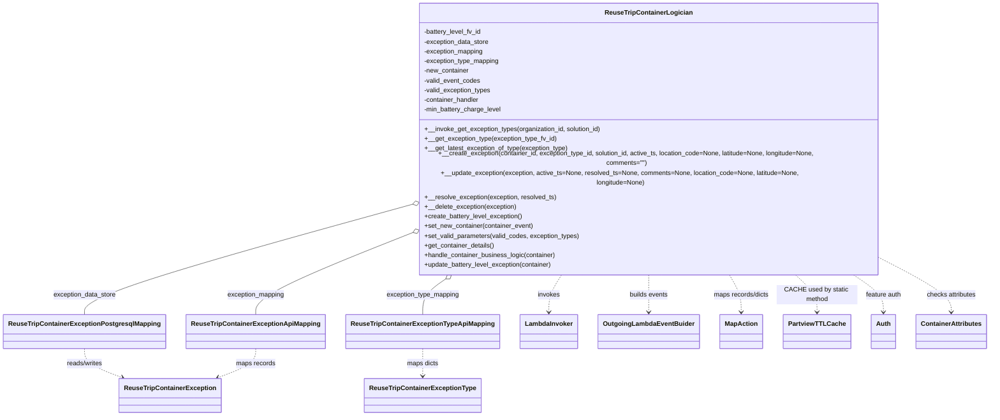

# Diagram: container_tracking_core/container_tracking_service/container_tracking_service/core/business/ReuseTripContainerLogician.py


> Auto-generated by Obscura crawlers

## Diagram 1



> SVG rendering failed for this diagram.

## Diagram 2

```mermaid
flowchart TD
    HC[handle_container_business_logic(container)] --> VET{ContainerAttributes.BATTERY_LEVEL_EXCEPTION in valid_exception_types?}
    VET -- No --> END1([End])
    VET -- Yes --> DF{Battery charge in container.get_dirty_fields()?}
    DF -- Yes --> UBLE[update_battery_level_exception(container)]
    DF -- No --> ND{container.get_dirty_fields() is empty?}
    ND -- Yes --> SNC[set_new_container(container) and create_battery_level_exception()]
    ND -- No --> END1

    subgraph UpdateBatteryFlow
        UBLE --> SNEW[set_new_container(container)]
        SNEW --> GETTYPE[__get_exception_type(BATTERY_LEVEL_FV_ID)]
        GETTYPE --> BTC{exception_type found?}
        BTC -- No --> CBE[create_battery_level_exception()]
        BTC -- Yes --> PREV[__get_latest_exception_of_type(exception_type)]
        PREV --> PREVCHECK{previous exists AND previous.resolved_ts is null?}
        PREVCHECK -- No --> CBE
        PREVCHECK -- Yes --> GCD[get_container_details() -> prev_battery_charge]
        GCD --> COMP1{prev_battery_charge is None AND battery_charge > min_level?}
        COMP1 -- True --> RESOLVE1[__resolve_exception(previous, new_ts)]
        COMP1 -- False --> COMP2{(prev_battery_charge is None AND battery_charge <= min_level) OR (battery_charge < prev_battery_charge) OR (prev_battery_charge < battery_charge <= min_level)}
        COMP2 -- True --> UPDATE_EX[__update_exception(previous, active_ts=new_ts, comments="Container has a battery level of X%")]
        COMP2 -- False --> RESOLVE2[__resolve_exception(previous, new_ts)]
    end

    CBE --> END1
    UPDATE_EX --> END1
    RESOLVE1 --> END1
    RESOLVE2 --> END1
```

> SVG rendering failed for this diagram.
