# Diagram: container_tracking_core/container_tracking_service/container_tracking_service/core/business/ReuseTripContainerSearchResult.py

> Auto-generated by Obscura crawlers

## Mermaid

```mermaid
classDiagram
    class Persistable {
        +__init__(id, ts, modified)
        +add_dirty_field(name, value)
    }
    class ReuseTripContainerSearchResult {
        -__container_identifier: str
        -__solution_id: str
        -__lifecycle_state: str
        -__status: str
        -__location_id: int
        -__sensor_identifier: str
        -__most_recent_scan_ts: datetime
        -__location: str
        -__created_ts: datetime
        -__sensor_type: str
        -__last_modified_ts: datetime
        -__last_reported_latitude: float
        -__last_reported_longitude: float
        -__battery_charge: int
        -__presence_status: str
        -__supplier_code: str
        -__process_type: str
        -__arrival_ts: datetime
        -__rack_code: str
        -__sequence_number: str
        -__manufacturing_ts: datetime
        -__gateway_serial_number: str
        -__fleet_type: str
        -__program_code: str
        -__ownership: str
        -__gps_accuracy: str
        -__gps_device_id: str
        -__route_number: str
        -__class_identifier: str
        -__serial_number: str
        -__type: str
        -__full_count: str
        +container_identifier(): str
        +container_identifier(container_identifier: str): ReuseTripContainerSearchResult
        +solution_id(): str
        +solution_id(solution_id: str): ReuseTripContainerSearchResult
        +lifecycle_state(): str
        +lifecycle_state(lifecycle_state: str): ReuseTripContainerSearchResult
        +status(): str
        +status(status: str): ReuseTripContainerSearchResult
        +location_id(): int
        +location_id(location_id: int): ReuseTripContainerSearchResult
        +sensor_identifier(): str
        +sensor_identifier(sensor_identifier: str): ReuseTripContainerSearchResult
        +most_recent_scan_ts(): datetime
        +most_recent_scan_ts(most_recent_scan_ts: datetime): ReuseTripContainerSearchResult
        +location(): str
        +location(location: str): ReuseTripContainerSearchResult
        +created_ts(): datetime
        +created_ts(created_ts: datetime): ReuseTripContainerSearchResult
        +sensor_type(): str
        +sensor_type(sensor_type: str): ReuseTripContainerSearchResult
        +last_modified_ts(): datetime
        +last_modified_ts(last_modified_ts: datetime): ReuseTripContainerSearchResult
        +last_reported_latitude(): float
        +last_reported_latitude(last_reported_latitude: float): ReuseTripContainerSearchResult
        +last_reported_longitude(): float
        +last_reported_longitude(last_reported_longitude: float): ReuseTripContainerSearchResult
        +battery_charge(): int
        +battery_charge(battery_charge: int): ReuseTripContainerSearchResult
        +presence_status(): str
        +presence_status(presence_status: str): ReuseTripContainerSearchResult
        +supplier_code(): str
        +supplier_code(supplier_code: str): ReuseTripContainerSearchResult
        +process_type(): str
        +process_type(process_type: str): ReuseTripContainerSearchResult
        +arrival_ts(): datetime
        +arrival_ts(arrival_ts: datetime): ReuseTripContainerSearchResult
        +rack_code(): str
        +rack_code(rack_code: str): ReuseTripContainerSearchResult
        +sequence_number(): str
        +sequence_number(sequence_number: str): ReuseTripContainerSearchResult
        +manufacturing_ts(): datetime
        +manufacturing_ts(manufacturing_ts: datetime): ReuseTripContainerSearchResult
        +gateway_serial_number(): str
        +gateway_serial_number(gateway_serial_number: str): ReuseTripContainerSearchResult
        +fleet_type(): str
        +fleet_type(fleet_type: str): ReuseTripContainerSearchResult
        +program_code(): str
        +program_code(program_code: str): ReuseTripContainerSearchResult
        +ownership(): str
        +ownership(ownership: str): ReuseTripContainerSearchResult
        +gps_accuracy(): str
        +gps_accuracy(gps_accuracy: str): ReuseTripContainerSearchResult
        +gps_device_id(): str
        +gps_device_id(gps_device_id: str): ReuseTripContainerSearchResult
        +route_number(): str
        +route_number(route_number: str): ReuseTripContainerSearchResult
        +class_identifier(): str
        +class_identifier(class_identifier: str): ReuseTripContainerSearchResult
        +serial_number(): str
        +serial_number(serial_number: str): ReuseTripContainerSearchResult
        +type(): str
        +type(type: str): ReuseTripContainerSearchResult
        +full_count(): str
        +full_count(full_count: str): ReuseTripContainerSearchResult
        +is_valid(): bool
    }
    Persistable <|-- ReuseTripContainerSearchResult
```

### SVG

<svg id="container" width="827.390625" xmlns="http://www.w3.org/2000/svg" class="classDiagram" height="2640" viewBox="0 0 827.390625 2640" role="graphics-document document" aria-roledescription="class"><g><defs><marker id="container_class-aggregationStart" class="marker aggregation class" refX="18" refY="7" markerWidth="190" markerHeight="240" orient="auto"><path d="M 18,7 L9,13 L1,7 L9,1 Z"></path></marker></defs><defs><marker id="container_class-aggregationEnd" class="marker aggregation class" refX="1" refY="7" markerWidth="20" markerHeight="28" orient="auto"><path d="M 18,7 L9,13 L1,7 L9,1 Z"></path></marker></defs><defs><marker id="container_class-extensionStart" class="marker extension class" refX="18" refY="7" markerWidth="190" markerHeight="240" orient="auto"><path d="M 1,7 L18,13 V 1 Z"></path></marker></defs><defs><marker id="container_class-extensionEnd" class="marker extension class" refX="1" refY="7" markerWidth="20" markerHeight="28" orient="auto"><path d="M 1,1 V 13 L18,7 Z"></path></marker></defs><defs><marker id="container_class-compositionStart" class="marker composition class" refX="18" refY="7" markerWidth="190" markerHeight="240" orient="auto"><path d="M 18,7 L9,13 L1,7 L9,1 Z"></path></marker></defs><defs><marker id="container_class-compositionEnd" class="marker composition class" refX="1" refY="7" markerWidth="20" markerHeight="28" orient="auto"><path d="M 18,7 L9,13 L1,7 L9,1 Z"></path></marker></defs><defs><marker id="container_class-dependencyStart" class="marker dependency class" refX="6" refY="7" markerWidth="190" markerHeight="240" orient="auto"><path d="M 5,7 L9,13 L1,7 L9,1 Z"></path></marker></defs><defs><marker id="container_class-dependencyEnd" class="marker dependency class" refX="13" refY="7" markerWidth="20" markerHeight="28" orient="auto"><path d="M 18,7 L9,13 L14,7 L9,1 Z"></path></marker></defs><defs><marker id="container_class-lollipopStart" class="marker lollipop class" refX="13" refY="7" markerWidth="190" markerHeight="240" orient="auto"><circle stroke="black" fill="transparent" cx="7" cy="7" r="6"></circle></marker></defs><defs><marker id="container_class-lollipopEnd" class="marker lollipop class" refX="1" refY="7" markerWidth="190" markerHeight="240" orient="auto"><circle stroke="black" fill="transparent" cx="7" cy="7" r="6"></circle></marker></defs><g class="root"><g class="clusters"></g><g class="edgePaths"><path d="M413.695,175.25L413.695,176.542C413.695,177.833,413.695,180.417,413.695,185.875C413.695,191.333,413.695,199.667,413.695,203.833L413.695,208" id="id_Persistable_ReuseTripContainerSearchResult_1" class="edge-thickness-normal edge-pattern-solid relation" style=";;;" data-edge="true" data-et="edge" data-id="id_Persistable_ReuseTripContainerSearchResult_1" data-points="W3sieCI6NDEzLjY5NTMxMjUsInkiOjE1OH0seyJ4Ijo0MTMuNjk1MzEyNSwieSI6MTgzfSx7IngiOjQxMy42OTUzMTI1LCJ5IjoyMDh9XQ==" marker-start="url(#container_class-extensionStart)"></path></g><g class="edgeLabels"><g class="edgeLabel"><g class="label" data-id="id_Persistable_ReuseTripContainerSearchResult_1" transform="translate(0, 0)"><foreignObject width="0" height="0">

</foreignObject></g></g></g><g class="nodes"><g class="node default" id="classId-Persistable-0" transform="translate(413.6953125, 83)"><g class="basic label-container"><path d="M-139.84765625 -75 L139.84765625 -75 L139.84765625 75 L-139.84765625 75" stroke="none" stroke-width="0" fill="#ECECFF" style=""></path><path d="M-139.84765625 -75 C-70.47355905059251 -75, -1.0994618511850263 -75, 139.84765625 -75 M-139.84765625 -75 C-63.85049159951885 -75, 12.146673050962306 -75, 139.84765625 -75 M139.84765625 -75 C139.84765625 -42.80334723745123, 139.84765625 -10.606694474902454, 139.84765625 75 M139.84765625 -75 C139.84765625 -25.060012710305926, 139.84765625 24.879974579388147, 139.84765625 75 M139.84765625 75 C72.11737390120689 75, 4.387091552413779 75, -139.84765625 75 M139.84765625 75 C49.42810468479432 75, -40.99144688041136 75, -139.84765625 75 M-139.84765625 75 C-139.84765625 24.08341691968029, -139.84765625 -26.833166160639422, -139.84765625 -75 M-139.84765625 75 C-139.84765625 28.201633943160537, -139.84765625 -18.596732113678925, -139.84765625 -75" stroke="#9370DB" stroke-width="1.3" fill="none" stroke-dasharray="0 0" style=""></path></g><g class="annotation-group text" transform="translate(0, -51)"></g><g class="label-group text" transform="translate(-40.9765625, -51)"><g class="label" style="font-weight: bolder" transform="translate(0,-12)"><foreignObject width="81.953125" height="24">

Persistable

</foreignObject></g></g><g class="members-group text" transform="translate(-127.84765625, -3)"></g><g class="methods-group text" transform="translate(-127.84765625, 27)"><g class="label" style="" transform="translate(0,-12)"><foreignObject width="150.90625" height="24">

+<strong>init</strong>(id, ts, modified)

</foreignObject></g><g class="label" style="" transform="translate(0,12)"><foreignObject width="214.71875" height="24">

+add_dirty_field(name, value)

</foreignObject></g></g><g class="divider" style=""><path d="M-139.84765625 -27 C-53.597359578669824 -27, 32.65293709266035 -27, 139.84765625 -27 M-139.84765625 -27 C-45.62335691624776 -27, 48.600942417504484 -27, 139.84765625 -27" stroke="#9370DB" stroke-width="1.3" fill="none" stroke-dasharray="0 0" style=""></path></g><g class="divider" style=""><path d="M-139.84765625 -3 C-79.07821805577824 -3, -18.308779861556474 -3, 139.84765625 -3 M-139.84765625 -3 C-49.73650506530838 -3, 40.37464611938324 -3, 139.84765625 -3" stroke="#9370DB" stroke-width="1.3" fill="none" stroke-dasharray="0 0" style=""></path></g></g><g class="node default" id="classId-ReuseTripContainerSearchResult-1" transform="translate(413.6953125, 1420)"><g class="basic label-container"><path d="M-405.6953125 -1212 L405.6953125 -1212 L405.6953125 1212 L-405.6953125 1212" stroke="none" stroke-width="0" fill="#ECECFF" style=""></path><path d="M-405.6953125 -1212 C-117.04195199642498 -1212, 171.61140850715003 -1212, 405.6953125 -1212 M-405.6953125 -1212 C-165.82472532035834 -1212, 74.04586185928332 -1212, 405.6953125 -1212 M405.6953125 -1212 C405.6953125 -350.1229770273811, 405.6953125 511.75404594523775, 405.6953125 1212 M405.6953125 -1212 C405.6953125 -703.1978197131018, 405.6953125 -194.3956394262035, 405.6953125 1212 M405.6953125 1212 C140.1857244452131 1212, -125.32386360957378 1212, -405.6953125 1212 M405.6953125 1212 C145.56796210873875 1212, -114.55938828252249 1212, -405.6953125 1212 M-405.6953125 1212 C-405.6953125 633.8886549994875, -405.6953125 55.77730999897494, -405.6953125 -1212 M-405.6953125 1212 C-405.6953125 622.0517509671239, -405.6953125 32.10350193424779, -405.6953125 -1212" stroke="#9370DB" stroke-width="1.3" fill="none" stroke-dasharray="0 0" style=""></path></g><g class="annotation-group text" transform="translate(0, -1188)"></g><g class="label-group text" transform="translate(-119.859375, -1188)"><g class="label" style="font-weight: bolder" transform="translate(0,-12)"><foreignObject width="239.71875" height="24">

ReuseTripContainerSearchResult

</foreignObject></g></g><g class="members-group text" transform="translate(-393.6953125, -1140)"><g class="label" style="" transform="translate(0,-12)"><foreignObject width="191.796875" height="24">

-__container_identifier: str

</foreignObject></g><g class="label" style="" transform="translate(0,12)"><foreignObject width="131.390625" height="24">

-__solution_id: str

</foreignObject></g><g class="label" style="" transform="translate(0,36)"><foreignObject width="152.640625" height="24">

-__lifecycle_state: str

</foreignObject></g><g class="label" style="" transform="translate(0,60)"><foreignObject width="93.5625" height="24">

-__status: str

</foreignObject></g><g class="label" style="" transform="translate(0,84)"><foreignObject width="130.796875" height="24">

-__location_id: int

</foreignObject></g><g class="label" style="" transform="translate(0,108)"><foreignObject width="171.484375" height="24">

-__sensor_identifier: str

</foreignObject></g><g class="label" style="" transform="translate(0,132)"><foreignObject width="247.828125" height="24">

-__most_recent_scan_ts: datetime

</foreignObject></g><g class="label" style="" transform="translate(0,156)"><foreignObject width="108.15625" height="24">

-__location: str

</foreignObject></g><g class="label" style="" transform="translate(0,180)"><foreignObject width="170.34375" height="24">

-__created_ts: datetime

</foreignObject></g><g class="label" style="" transform="translate(0,204)"><foreignObject width="136.234375" height="24">

-__sensor_type: str

</foreignObject></g><g class="label" style="" transform="translate(0,228)"><foreignObject width="215.421875" height="24">

-__last_modified_ts: datetime

</foreignObject></g><g class="label" style="" transform="translate(0,252)"><foreignObject width="225.75" height="24">

-__last_reported_latitude: float

</foreignObject></g><g class="label" style="" transform="translate(0,276)"><foreignObject width="238.3125" height="24">

-__last_reported_longitude: float

</foreignObject></g><g class="label" style="" transform="translate(0,300)"><foreignObject width="157.5" height="24">

-__battery_charge: int

</foreignObject></g><g class="label" style="" transform="translate(0,324)"><foreignObject width="167.09375" height="24">

-__presence_status: str

</foreignObject></g><g class="label" style="" transform="translate(0,348)"><foreignObject width="150.734375" height="24">

-__supplier_code: str

</foreignObject></g><g class="label" style="" transform="translate(0,372)"><foreignObject width="144.015625" height="24">

-__process_type: str

</foreignObject></g><g class="label" style="" transform="translate(0,396)"><foreignObject width="162.328125" height="24">

-__arrival_ts: datetime

</foreignObject></g><g class="label" style="" transform="translate(0,420)"><foreignObject width="122.28125" height="24">

-__rack_code: str

</foreignObject></g><g class="label" style="" transform="translate(0,444)"><foreignObject width="183.34375" height="24">

-__sequence_number: str

</foreignObject></g><g class="label" style="" transform="translate(0,468)"><foreignObject width="222.234375" height="24">

-__manufacturing_ts: datetime

</foreignObject></g><g class="label" style="" transform="translate(0,492)"><foreignObject width="221.125" height="24">

-__gateway_serial_number: str

</foreignObject></g><g class="label" style="" transform="translate(0,516)"><foreignObject width="121.234375" height="24">

-__fleet_type: str

</foreignObject></g><g class="label" style="" transform="translate(0,540)"><foreignObject width="153.015625" height="24">

-__program_code: str

</foreignObject></g><g class="label" style="" transform="translate(0,564)"><foreignObject width="124.546875" height="24">

-__ownership: str

</foreignObject></g><g class="label" style="" transform="translate(0,588)"><foreignObject width="145.015625" height="24">

-__gps_accuracy: str

</foreignObject></g><g class="label" style="" transform="translate(0,612)"><foreignObject width="151.015625" height="24">

-__gps_device_id: str

</foreignObject></g><g class="label" style="" transform="translate(0,636)"><foreignObject width="152.734375" height="24">

-__route_number: str

</foreignObject></g><g class="label" style="" transform="translate(0,660)"><foreignObject width="159.140625" height="24">

-__class_identifier: str

</foreignObject></g><g class="label" style="" transform="translate(0,684)"><foreignObject width="154.546875" height="24">

-__serial_number: str

</foreignObject></g><g class="label" style="" transform="translate(0,708)"><foreignObject width="80.625" height="24">

-__type: str

</foreignObject></g><g class="label" style="" transform="translate(0,732)"><foreignObject width="122.09375" height="24">

-__full_count: str

</foreignObject></g></g><g class="methods-group text" transform="translate(-393.6953125, -348)"><g class="label" style="" transform="translate(0,-12)"><foreignObject width="200.984375" height="24">

+container_identifier() : : str

</foreignObject></g><g class="label" style="" transform="translate(0,12)"><foreignObject width="588.296875" height="24">

+container_identifier(container_identifier: str) : : ReuseTripContainerSearchResult

</foreignObject></g><g class="label" style="" transform="translate(0,36)"><foreignObject width="140.40625" height="24">

+solution_id() : : str

</foreignObject></g><g class="label" style="" transform="translate(0,60)"><foreignObject width="466.984375" height="24">

+solution_id(solution_id: str) : : ReuseTripContainerSearchResult

</foreignObject></g><g class="label" style="" transform="translate(0,84)"><foreignObject width="161.828125" height="24">

+lifecycle_state() : : str

</foreignObject></g><g class="label" style="" transform="translate(0,108)"><foreignObject width="509.828125" height="24">

+lifecycle_state(lifecycle_state: str) : : ReuseTripContainerSearchResult

</foreignObject></g><g class="label" style="" transform="translate(0,132)"><foreignObject width="102.578125" height="24">

+status() : : str

</foreignObject></g><g class="label" style="" transform="translate(0,156)"><foreignObject width="391.34375" height="24">

+status(status: str) : : ReuseTripContainerSearchResult

</foreignObject></g><g class="label" style="" transform="translate(0,180)"><foreignObject width="139.96875" height="24">

+location_id() : : int

</foreignObject></g><g class="label" style="" transform="translate(0,204)"><foreignObject width="465.875" height="24">

+location_id(location_id: int) : : ReuseTripContainerSearchResult

</foreignObject></g><g class="label" style="" transform="translate(0,228)"><foreignObject width="180.34375" height="24">

+sensor_identifier() : : str

</foreignObject></g><g class="label" style="" transform="translate(0,252)"><foreignObject width="547.015625" height="24">

+sensor_identifier(sensor_identifier: str) : : ReuseTripContainerSearchResult

</foreignObject></g><g class="label" style="" transform="translate(0,276)"><foreignObject width="256.859375" height="24">

+most_recent_scan_ts() : : datetime

</foreignObject></g><g class="label" style="" transform="translate(0,300)"><foreignObject width="654.0625" height="24">

+most_recent_scan_ts(most_recent_scan_ts: datetime) : : ReuseTripContainerSearchResult

</foreignObject></g><g class="label" style="" transform="translate(0,324)"><foreignObject width="117.34375" height="24">

+location() : : str

</foreignObject></g><g class="label" style="" transform="translate(0,348)"><foreignObject width="420.84375" height="24">

+location(location: str) : : ReuseTripContainerSearchResult

</foreignObject></g><g class="label" style="" transform="translate(0,372)"><foreignObject width="179.6875" height="24">

+created_ts() : : datetime

</foreignObject></g><g class="label" style="" transform="translate(0,396)"><foreignObject width="499.71875" height="24">

+created_ts(created_ts: datetime) : : ReuseTripContainerSearchResult

</foreignObject></g><g class="label" style="" transform="translate(0,420)"><foreignObject width="145.25" height="24">

+sensor_type() : : str

</foreignObject></g><g class="label" style="" transform="translate(0,444)"><foreignObject width="476.6875" height="24">

+sensor_type(sensor_type: str) : : ReuseTripContainerSearchResult

</foreignObject></g><g class="label" style="" transform="translate(0,468)"><foreignObject width="224.59375" height="24">

+last_modified_ts() : : datetime

</foreignObject></g><g class="label" style="" transform="translate(0,492)"><foreignObject width="589.546875" height="24">

+last_modified_ts(last_modified_ts: datetime) : : ReuseTripContainerSearchResult

</foreignObject></g><g class="label" style="" transform="translate(0,516)"><foreignObject width="234.9375" height="24">

+last_reported_latitude() : : float

</foreignObject></g><g class="label" style="" transform="translate(0,540)"><foreignObject width="642.40625" height="24">

+last_reported_latitude(last_reported_latitude: float) : : ReuseTripContainerSearchResult

</foreignObject></g><g class="label" style="" transform="translate(0,564)"><foreignObject width="247.5" height="24">

+last_reported_longitude() : : float

</foreignObject></g><g class="label" style="" transform="translate(0,588)"><foreignObject width="667.53125" height="24">

+last_reported_longitude(last_reported_longitude: float) : : ReuseTripContainerSearchResult

</foreignObject></g><g class="label" style="" transform="translate(0,612)"><foreignObject width="166.515625" height="24">

+battery_charge() : : int

</foreignObject></g><g class="label" style="" transform="translate(0,636)"><foreignObject width="518.96875" height="24">

+battery_charge(battery_charge: int) : : ReuseTripContainerSearchResult

</foreignObject></g><g class="label" style="" transform="translate(0,660)"><foreignObject width="176.125" height="24">

+presence_status() : : str

</foreignObject></g><g class="label" style="" transform="translate(0,684)"><foreignObject width="538.40625" height="24">

+presence_status(presence_status: str) : : ReuseTripContainerSearchResult

</foreignObject></g><g class="label" style="" transform="translate(0,708)"><foreignObject width="159.75" height="24">

+supplier_code() : : str

</foreignObject></g><g class="label" style="" transform="translate(0,732)"><foreignObject width="505.671875" height="24">

+supplier_code(supplier_code: str) : : ReuseTripContainerSearchResult

</foreignObject></g><g class="label" style="" transform="translate(0,756)"><foreignObject width="153.03125" height="24">

+process_type() : : str

</foreignObject></g><g class="label" style="" transform="translate(0,780)"><foreignObject width="492.234375" height="24">

+process_type(process_type: str) : : ReuseTripContainerSearchResult

</foreignObject></g><g class="label" style="" transform="translate(0,804)"><foreignObject width="171.4375" height="24">

+arrival_ts() : : datetime

</foreignObject></g><g class="label" style="" transform="translate(0,828)"><foreignObject width="483.453125" height="24">

+arrival_ts(arrival_ts: datetime) : : ReuseTripContainerSearchResult

</foreignObject></g><g class="label" style="" transform="translate(0,852)"><foreignObject width="131.296875" height="24">

+rack_code() : : str

</foreignObject></g><g class="label" style="" transform="translate(0,876)"><foreignObject width="448.78125" height="24">

+rack_code(rack_code: str) : : ReuseTripContainerSearchResult

</foreignObject></g><g class="label" style="" transform="translate(0,900)"><foreignObject width="192.203125" height="24">

+sequence_number() : : str

</foreignObject></g><g class="label" style="" transform="translate(0,924)"><foreignObject width="570.734375" height="24">

+sequence_number(sequence_number: str) : : ReuseTripContainerSearchResult

</foreignObject></g><g class="label" style="" transform="translate(0,948)"><foreignObject width="231.25" height="24">

+manufacturing_ts() : : datetime

</foreignObject></g><g class="label" style="" transform="translate(0,972)"><foreignObject width="602.859375" height="24">

+manufacturing_ts(manufacturing_ts: datetime) : : ReuseTripContainerSearchResult

</foreignObject></g><g class="label" style="" transform="translate(0,996)"><foreignObject width="229.84375" height="24">

+gateway_serial_number() : : str

</foreignObject></g><g class="label" style="" transform="translate(0,1020)"><foreignObject width="646.03125" height="24">

+gateway_serial_number(gateway_serial_number: str) : : ReuseTripContainerSearchResult

</foreignObject></g><g class="label" style="" transform="translate(0,1044)"><foreignObject width="130.34375" height="24">

+fleet_type() : : str

</foreignObject></g><g class="label" style="" transform="translate(0,1068)"><foreignObject width="447.09375" height="24">

+fleet_type(fleet_type: str) : : ReuseTripContainerSearchResult

</foreignObject></g><g class="label" style="" transform="translate(0,1092)"><foreignObject width="162.046875" height="24">

+program_code() : : str

</foreignObject></g><g class="label" style="" transform="translate(0,1116)"><foreignObject width="510.25" height="24">

+program_code(program_code: str) : : ReuseTripContainerSearchResult

</foreignObject></g><g class="label" style="" transform="translate(0,1140)"><foreignObject width="133.890625" height="24">

+ownership() : : str

</foreignObject></g><g class="label" style="" transform="translate(0,1164)"><foreignObject width="453.953125" height="24">

+ownership(ownership: str) : : ReuseTripContainerSearchResult

</foreignObject></g><g class="label" style="" transform="translate(0,1188)"><foreignObject width="153.828125" height="24">

+gps_accuracy() : : str

</foreignObject></g><g class="label" style="" transform="translate(0,1212)"><foreignObject width="493.890625" height="24">

+gps_accuracy(gps_accuracy: str) : : ReuseTripContainerSearchResult

</foreignObject></g><g class="label" style="" transform="translate(0,1236)"><foreignObject width="159.890625" height="24">

+gps_device_id() : : str

</foreignObject></g><g class="label" style="" transform="translate(0,1260)"><foreignObject width="505.953125" height="24">

+gps_device_id(gps_device_id: str) : : ReuseTripContainerSearchResult

</foreignObject></g><g class="label" style="" transform="translate(0,1284)"><foreignObject width="161.59375" height="24">

+route_number() : : str

</foreignObject></g><g class="label" style="" transform="translate(0,1308)"><foreignObject width="509.515625" height="24">

+route_number(route_number: str) : : ReuseTripContainerSearchResult

</foreignObject></g><g class="label" style="" transform="translate(0,1332)"><foreignObject width="168.328125" height="24">

+class_identifier() : : str

</foreignObject></g><g class="label" style="" transform="translate(0,1356)"><foreignObject width="522.984375" height="24">

+class_identifier(class_identifier: str) : : ReuseTripContainerSearchResult

</foreignObject></g><g class="label" style="" transform="translate(0,1380)"><foreignObject width="163.421875" height="24">

+serial_number() : : str

</foreignObject></g><g class="label" style="" transform="translate(0,1404)"><foreignObject width="513.15625" height="24">

+serial_number(serial_number: str) : : ReuseTripContainerSearchResult

</foreignObject></g><g class="label" style="" transform="translate(0,1428)"><foreignObject width="89.890625" height="24">

+type() : : str

</foreignObject></g><g class="label" style="" transform="translate(0,1452)"><foreignObject width="366.046875" height="24">

+type(type: str) : : ReuseTripContainerSearchResult

</foreignObject></g><g class="label" style="" transform="translate(0,1476)"><foreignObject width="131.125" height="24">

+full_count() : : str

</foreignObject></g><g class="label" style="" transform="translate(0,1500)"><foreignObject width="448.734375" height="24">

+full_count(full_count: str) : : ReuseTripContainerSearchResult

</foreignObject></g><g class="label" style="" transform="translate(0,1524)"><foreignObject width="126.078125" height="24">

+is_valid() : : bool

</foreignObject></g></g><g class="divider" style=""><path d="M-405.6953125 -1164 C-125.80029665162431 -1164, 154.09471919675138 -1164, 405.6953125 -1164 M-405.6953125 -1164 C-153.8702164658215 -1164, 97.954879568357 -1164, 405.6953125 -1164" stroke="#9370DB" stroke-width="1.3" fill="none" stroke-dasharray="0 0" style=""></path></g><g class="divider" style=""><path d="M-405.6953125 -372 C-98.60718124352252 -372, 208.48095001295496 -372, 405.6953125 -372 M-405.6953125 -372 C-146.55522724031903 -372, 112.58485801936195 -372, 405.6953125 -372" stroke="#9370DB" stroke-width="1.3" fill="none" stroke-dasharray="0 0" style=""></path></g></g></g></g></g></svg>
