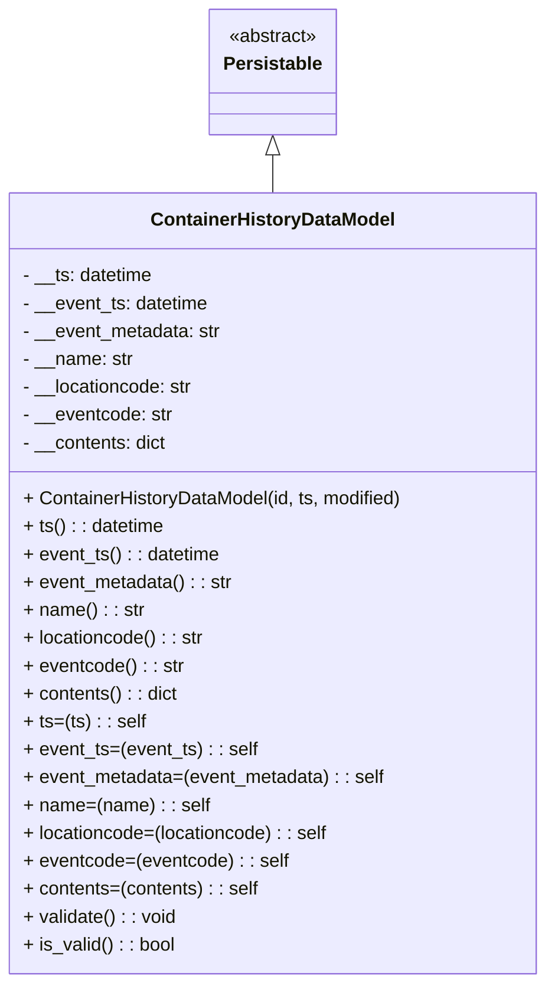

# Diagram: container_tracking_core/container_tracking_service/container_tracking_service/core/datamodel/ContainerHistoryDataModel.py


> Auto-generated by Obscura crawlers

## Diagram 1



### SVG

<svg id="container" width="472.4609375" xmlns="http://www.w3.org/2000/svg" class="classDiagram" height="846" viewBox="0 0 472.4609375 846" role="graphics-document document" aria-roledescription="class"><style>#container{font-family:"trebuchet ms",verdana,arial,sans-serif;font-size:16px;fill:#333;}@keyframes edge-animation-frame{from{stroke-dashoffset:0;}}@keyframes dash{to{stroke-dashoffset:0;}}#container .edge-animation-slow{stroke-dasharray:9,5!important;stroke-dashoffset:900;animation:dash 50s linear infinite;stroke-linecap:round;}#container .edge-animation-fast{stroke-dasharray:9,5!important;stroke-dashoffset:900;animation:dash 20s linear infinite;stroke-linecap:round;}#container .error-icon{fill:#552222;}#container .error-text{fill:#552222;stroke:#552222;}#container .edge-thickness-normal{stroke-width:1px;}#container .edge-thickness-thick{stroke-width:3.5px;}#container .edge-pattern-solid{stroke-dasharray:0;}#container .edge-thickness-invisible{stroke-width:0;fill:none;}#container .edge-pattern-dashed{stroke-dasharray:3;}#container .edge-pattern-dotted{stroke-dasharray:2;}#container .marker{fill:#333333;stroke:#333333;}#container .marker.cross{stroke:#333333;}#container svg{font-family:"trebuchet ms",verdana,arial,sans-serif;font-size:16px;}#container p{margin:0;}#container g.classGroup text{fill:#9370DB;stroke:none;font-family:"trebuchet ms",verdana,arial,sans-serif;font-size:10px;}#container g.classGroup text .title{font-weight:bolder;}#container .nodeLabel,#container .edgeLabel{color:#131300;}#container .edgeLabel .label rect{fill:#ECECFF;}#container .label text{fill:#131300;}#container .labelBkg{background:#ECECFF;}#container .edgeLabel .label span{background:#ECECFF;}#container .classTitle{font-weight:bolder;}#container .node rect,#container .node circle,#container .node ellipse,#container .node polygon,#container .node path{fill:#ECECFF;stroke:#9370DB;stroke-width:1px;}#container .divider{stroke:#9370DB;stroke-width:1;}#container g.clickable{cursor:pointer;}#container g.classGroup rect{fill:#ECECFF;stroke:#9370DB;}#container g.classGroup line{stroke:#9370DB;stroke-width:1;}#container .classLabel .box{stroke:none;stroke-width:0;fill:#ECECFF;opacity:0.5;}#container .classLabel .label{fill:#9370DB;font-size:10px;}#container .relation{stroke:#333333;stroke-width:1;fill:none;}#container .dashed-line{stroke-dasharray:3;}#container .dotted-line{stroke-dasharray:1 2;}#container #compositionStart,#container .composition{fill:#333333!important;stroke:#333333!important;stroke-width:1;}#container #compositionEnd,#container .composition{fill:#333333!important;stroke:#333333!important;stroke-width:1;}#container #dependencyStart,#container .dependency{fill:#333333!important;stroke:#333333!important;stroke-width:1;}#container #dependencyStart,#container .dependency{fill:#333333!important;stroke:#333333!important;stroke-width:1;}#container #extensionStart,#container .extension{fill:transparent!important;stroke:#333333!important;stroke-width:1;}#container #extensionEnd,#container .extension{fill:transparent!important;stroke:#333333!important;stroke-width:1;}#container #aggregationStart,#container .aggregation{fill:transparent!important;stroke:#333333!important;stroke-width:1;}#container #aggregationEnd,#container .aggregation{fill:transparent!important;stroke:#333333!important;stroke-width:1;}#container #lollipopStart,#container .lollipop{fill:#ECECFF!important;stroke:#333333!important;stroke-width:1;}#container #lollipopEnd,#container .lollipop{fill:#ECECFF!important;stroke:#333333!important;stroke-width:1;}#container .edgeTerminals{font-size:11px;line-height:initial;}#container .classTitleText{text-anchor:middle;font-size:18px;fill:#333;}#container .label-icon{display:inline-block;height:1em;overflow:visible;vertical-align:-0.125em;}#container .node .label-icon path{fill:currentColor;stroke:revert;stroke-width:revert;}#container :root{--mermaid-font-family:"trebuchet ms",verdana,arial,sans-serif;}</style><g><defs><marker id="container_class-aggregationStart" class="marker aggregation class" refX="18" refY="7" markerWidth="190" markerHeight="240" orient="auto"><path d="M 18,7 L9,13 L1,7 L9,1 Z"></path></marker></defs><defs><marker id="container_class-aggregationEnd" class="marker aggregation class" refX="1" refY="7" markerWidth="20" markerHeight="28" orient="auto"><path d="M 18,7 L9,13 L1,7 L9,1 Z"></path></marker></defs><defs><marker id="container_class-extensionStart" class="marker extension class" refX="18" refY="7" markerWidth="190" markerHeight="240" orient="auto"><path d="M 1,7 L18,13 V 1 Z"></path></marker></defs><defs><marker id="container_class-extensionEnd" class="marker extension class" refX="1" refY="7" markerWidth="20" markerHeight="28" orient="auto"><path d="M 1,1 V 13 L18,7 Z"></path></marker></defs><defs><marker id="container_class-compositionStart" class="marker composition class" refX="18" refY="7" markerWidth="190" markerHeight="240" orient="auto"><path d="M 18,7 L9,13 L1,7 L9,1 Z"></path></marker></defs><defs><marker id="container_class-compositionEnd" class="marker composition class" refX="1" refY="7" markerWidth="20" markerHeight="28" orient="auto"><path d="M 18,7 L9,13 L1,7 L9,1 Z"></path></marker></defs><defs><marker id="container_class-dependencyStart" class="marker dependency class" refX="6" refY="7" markerWidth="190" markerHeight="240" orient="auto"><path d="M 5,7 L9,13 L1,7 L9,1 Z"></path></marker></defs><defs><marker id="container_class-dependencyEnd" class="marker dependency class" refX="13" refY="7" markerWidth="20" markerHeight="28" orient="auto"><path d="M 18,7 L9,13 L14,7 L9,1 Z"></path></marker></defs><defs><marker id="container_class-lollipopStart" class="marker lollipop class" refX="13" refY="7" markerWidth="190" markerHeight="240" orient="auto"><circle stroke="black" fill="transparent" cx="7" cy="7" r="6"></circle></marker></defs><defs><marker id="container_class-lollipopEnd" class="marker lollipop class" refX="1" refY="7" markerWidth="190" markerHeight="240" orient="auto"><circle stroke="black" fill="transparent" cx="7" cy="7" r="6"></circle></marker></defs><g class="root"><g class="clusters"></g><g class="edgePaths"><path d="M236.23,133.25L236.23,134.542C236.23,135.833,236.23,138.417,236.23,143.875C236.23,149.333,236.23,157.667,236.23,161.833L236.23,166" id="id_Persistable_ContainerHistoryDataModel_1" class="edge-thickness-normal edge-pattern-solid relation" style=";;;" data-edge="true" data-et="edge" data-id="id_Persistable_ContainerHistoryDataModel_1" data-points="W3sieCI6MjM2LjIzMDQ2ODc1LCJ5IjoxMTZ9LHsieCI6MjM2LjIzMDQ2ODc1LCJ5IjoxNDF9LHsieCI6MjM2LjIzMDQ2ODc1LCJ5IjoxNjZ9XQ==" marker-start="url(#container_class-extensionStart)"></path></g><g class="edgeLabels"><g class="edgeLabel"><g class="label" data-id="id_Persistable_ContainerHistoryDataModel_1" transform="translate(0, 0)"><foreignObject width="0" height="0"><div xmlns="http://www.w3.org/1999/xhtml" class="labelBkg" style="display: table-cell; white-space: nowrap; line-height: 1.5; max-width: 200px; text-align: center;"><span class="edgeLabel"></span></div></foreignObject></g></g></g><g class="nodes"><g class="node default" id="classId-Persistable-0" transform="translate(236.23046875, 62)"><g class="basic label-container"><path d="M-52.9765625 -54 L52.9765625 -54 L52.9765625 54 L-52.9765625 54" stroke="none" stroke-width="0" fill="#ECECFF" style=""></path><path d="M-52.9765625 -54 C-20.804188580952776 -54, 11.368185338094449 -54, 52.9765625 -54 M-52.9765625 -54 C-14.293165588360182 -54, 24.390231323279636 -54, 52.9765625 -54 M52.9765625 -54 C52.9765625 -23.456629118307283, 52.9765625 7.086741763385433, 52.9765625 54 M52.9765625 -54 C52.9765625 -10.893465125931122, 52.9765625 32.213069748137755, 52.9765625 54 M52.9765625 54 C20.188963945483756 54, -12.598634609032487 54, -52.9765625 54 M52.9765625 54 C30.115182564847313 54, 7.253802629694626 54, -52.9765625 54 M-52.9765625 54 C-52.9765625 23.058708771962866, -52.9765625 -7.882582456074267, -52.9765625 -54 M-52.9765625 54 C-52.9765625 18.510890536656433, -52.9765625 -16.978218926687134, -52.9765625 -54" stroke="#9370DB" stroke-width="1.3" fill="none" stroke-dasharray="0 0" style=""></path></g><g class="annotation-group text" transform="translate(-38.609375, -30)"><g class="label" style="" transform="translate(0,-12)"><foreignObject width="77.21875" height="24"><div xmlns="http://www.w3.org/1999/xhtml" style="display: table-cell; white-space: nowrap; line-height: 1.5; max-width: 127px; text-align: center;"><span class="nodeLabel markdown-node-label" style=""><p>«abstract»</p></span></div></foreignObject></g></g><g class="label-group text" transform="translate(-40.9765625, -6)"><g class="label" style="font-weight: bolder" transform="translate(0,-12)"><foreignObject width="81.953125" height="24"><div xmlns="http://www.w3.org/1999/xhtml" style="display: table-cell; white-space: nowrap; line-height: 1.5; max-width: 130px; text-align: center;"><span class="nodeLabel markdown-node-label" style=""><p>Persistable</p></span></div></foreignObject></g></g><g class="members-group text" transform="translate(-40.9765625, 42)"></g><g class="methods-group text" transform="translate(-40.9765625, 72)"></g><g class="divider" style=""><path d="M-52.9765625 18 C-26.356074611508294 18, 0.26441327698341155 18, 52.9765625 18 M-52.9765625 18 C-19.012750954243742 18, 14.951060591512515 18, 52.9765625 18" stroke="#9370DB" stroke-width="1.3" fill="none" stroke-dasharray="0 0" style=""></path></g><g class="divider" style=""><path d="M-52.9765625 36 C-15.559036511982363 36, 21.858489476035274 36, 52.9765625 36 M-52.9765625 36 C-20.635258977798934 36, 11.706044544402133 36, 52.9765625 36" stroke="#9370DB" stroke-width="1.3" fill="none" stroke-dasharray="0 0" style=""></path></g></g><g class="node default" id="classId-ContainerHistoryDataModel-1" transform="translate(236.23046875, 502)"><g class="basic label-container"><path d="M-228.23046875 -336 L228.23046875 -336 L228.23046875 336 L-228.23046875 336" stroke="none" stroke-width="0" fill="#ECECFF" style=""></path><path d="M-228.23046875 -336 C-73.82315003104404 -336, 80.58416868791193 -336, 228.23046875 -336 M-228.23046875 -336 C-128.5183144909468 -336, -28.806160231893585 -336, 228.23046875 -336 M228.23046875 -336 C228.23046875 -73.75869932988832, 228.23046875 188.48260134022337, 228.23046875 336 M228.23046875 -336 C228.23046875 -73.78422093068895, 228.23046875 188.4315581386221, 228.23046875 336 M228.23046875 336 C111.29952426675962 336, -5.6314202164807625 336, -228.23046875 336 M228.23046875 336 C64.1940888629023 336, -99.84229102419539 336, -228.23046875 336 M-228.23046875 336 C-228.23046875 118.41602530015237, -228.23046875 -99.16794939969526, -228.23046875 -336 M-228.23046875 336 C-228.23046875 197.0760282788758, -228.23046875 58.15205655775162, -228.23046875 -336" stroke="#9370DB" stroke-width="1.3" fill="none" stroke-dasharray="0 0" style=""></path></g><g class="annotation-group text" transform="translate(0, -312)"></g><g class="label-group text" transform="translate(-101.4609375, -312)"><g class="label" style="font-weight: bolder" transform="translate(0,-12)"><foreignObject width="202.921875" height="24"><div xmlns="http://www.w3.org/1999/xhtml" style="display: table-cell; white-space: nowrap; line-height: 1.5; max-width: 251px; text-align: center;"><span class="nodeLabel markdown-node-label" style=""><p>ContainerHistoryDataModel</p></span></div></foreignObject></g></g><g class="members-group text" transform="translate(-216.23046875, -264)"><g class="label" style="" transform="translate(0,-12)"><foreignObject width="113.4375" height="24"><div xmlns="http://www.w3.org/1999/xhtml" style="display: table-cell; white-space: nowrap; line-height: 1.5; max-width: 171px; text-align: center;"><span class="nodeLabel markdown-node-label" style=""><p>- __ts: datetime</p></span></div></foreignObject></g><g class="label" style="" transform="translate(0,12)"><foreignObject width="161.765625" height="24"><div xmlns="http://www.w3.org/1999/xhtml" style="display: table-cell; white-space: nowrap; line-height: 1.5; max-width: 219px; text-align: center;"><span class="nodeLabel markdown-node-label" style=""><p>- __event_ts: datetime</p></span></div></foreignObject></g><g class="label" style="" transform="translate(0,36)"><foreignObject width="172.453125" height="24"><div xmlns="http://www.w3.org/1999/xhtml" style="display: table-cell; white-space: nowrap; line-height: 1.5; max-width: 231px; text-align: center;"><span class="nodeLabel markdown-node-label" style=""><p>- __event_metadata: str</p></span></div></foreignObject></g><g class="label" style="" transform="translate(0,60)"><foreignObject width="95.1875" height="24"><div xmlns="http://www.w3.org/1999/xhtml" style="display: table-cell; white-space: nowrap; line-height: 1.5; max-width: 153px; text-align: center;"><span class="nodeLabel markdown-node-label" style=""><p>- __name: str</p></span></div></foreignObject></g><g class="label" style="" transform="translate(0,84)"><foreignObject width="148.625" height="24"><div xmlns="http://www.w3.org/1999/xhtml" style="display: table-cell; white-space: nowrap; line-height: 1.5; max-width: 207px; text-align: center;"><span class="nodeLabel markdown-node-label" style=""><p>- __locationcode: str</p></span></div></foreignObject></g><g class="label" style="" transform="translate(0,108)"><foreignObject width="129.421875" height="24"><div xmlns="http://www.w3.org/1999/xhtml" style="display: table-cell; white-space: nowrap; line-height: 1.5; max-width: 188px; text-align: center;"><span class="nodeLabel markdown-node-label" style=""><p>- __eventcode: str</p></span></div></foreignObject></g><g class="label" style="" transform="translate(0,132)"><foreignObject width="125.375" height="24"><div xmlns="http://www.w3.org/1999/xhtml" style="display: table-cell; white-space: nowrap; line-height: 1.5; max-width: 183px; text-align: center;"><span class="nodeLabel markdown-node-label" style=""><p>- __contents: dict</p></span></div></foreignObject></g></g><g class="methods-group text" transform="translate(-216.23046875, -72)"><g class="label" style="" transform="translate(0,-12)"><foreignObject width="331" height="24"><div xmlns="http://www.w3.org/1999/xhtml" style="display: table-cell; white-space: nowrap; line-height: 1.5; max-width: 388px; text-align: center;"><span class="nodeLabel markdown-node-label" style=""><p>+ ContainerHistoryDataModel(id, ts, modified)</p></span></div></foreignObject></g><g class="label" style="" transform="translate(0,12)"><foreignObject width="121.5" height="24"><div xmlns="http://www.w3.org/1999/xhtml" style="display: table-cell; white-space: nowrap; line-height: 1.5; max-width: 179px; text-align: center;"><span class="nodeLabel markdown-node-label" style=""><p>+ ts() : : datetime</p></span></div></foreignObject></g><g class="label" style="" transform="translate(0,36)"><foreignObject width="169.828125" height="24"><div xmlns="http://www.w3.org/1999/xhtml" style="display: table-cell; white-space: nowrap; line-height: 1.5; max-width: 227px; text-align: center;"><span class="nodeLabel markdown-node-label" style=""><p>+ event_ts() : : datetime</p></span></div></foreignObject></g><g class="label" style="" transform="translate(0,60)"><foreignObject width="180.515625" height="24"><div xmlns="http://www.w3.org/1999/xhtml" style="display: table-cell; white-space: nowrap; line-height: 1.5; max-width: 239px; text-align: center;"><span class="nodeLabel markdown-node-label" style=""><p>+ event_metadata() : : str</p></span></div></foreignObject></g><g class="label" style="" transform="translate(0,84)"><foreignObject width="102.9375" height="24"><div xmlns="http://www.w3.org/1999/xhtml" style="display: table-cell; white-space: nowrap; line-height: 1.5; max-width: 161px; text-align: center;"><span class="nodeLabel markdown-node-label" style=""><p>+ name() : : str</p></span></div></foreignObject></g><g class="label" style="" transform="translate(0,108)"><foreignObject width="156.53125" height="24"><div xmlns="http://www.w3.org/1999/xhtml" style="display: table-cell; white-space: nowrap; line-height: 1.5; max-width: 215px; text-align: center;"><span class="nodeLabel markdown-node-label" style=""><p>+ locationcode() : : str</p></span></div></foreignObject></g><g class="label" style="" transform="translate(0,132)"><foreignObject width="137.484375" height="24"><div xmlns="http://www.w3.org/1999/xhtml" style="display: table-cell; white-space: nowrap; line-height: 1.5; max-width: 196px; text-align: center;"><span class="nodeLabel markdown-node-label" style=""><p>+ eventcode() : : str</p></span></div></foreignObject></g><g class="label" style="" transform="translate(0,156)"><foreignObject width="133.4375" height="24"><div xmlns="http://www.w3.org/1999/xhtml" style="display: table-cell; white-space: nowrap; line-height: 1.5; max-width: 191px; text-align: center;"><span class="nodeLabel markdown-node-label" style=""><p>+ contents() : : dict</p></span></div></foreignObject></g><g class="label" style="" transform="translate(0,180)"><foreignObject width="103.734375" height="24"><div xmlns="http://www.w3.org/1999/xhtml" style="display: table-cell; white-space: nowrap; line-height: 1.5; max-width: 163px; text-align: center;"><span class="nodeLabel markdown-node-label" style=""><p>+ ts=(ts) : : self</p></span></div></foreignObject></g><g class="label" style="" transform="translate(0,204)"><foreignObject width="200.40625" height="24"><div xmlns="http://www.w3.org/1999/xhtml" style="display: table-cell; white-space: nowrap; line-height: 1.5; max-width: 259px; text-align: center;"><span class="nodeLabel markdown-node-label" style=""><p>+ event_ts=(event_ts) : : self</p></span></div></foreignObject></g><g class="label" style="" transform="translate(0,228)"><foreignObject width="313.4375" height="24"><div xmlns="http://www.w3.org/1999/xhtml" style="display: table-cell; white-space: nowrap; line-height: 1.5; max-width: 372px; text-align: center;"><span class="nodeLabel markdown-node-label" style=""><p>+ event_metadata=(event_metadata) : : self</p></span></div></foreignObject></g><g class="label" style="" transform="translate(0,252)"><foreignObject width="158.265625" height="24"><div xmlns="http://www.w3.org/1999/xhtml" style="display: table-cell; white-space: nowrap; line-height: 1.5; max-width: 217px; text-align: center;"><span class="nodeLabel markdown-node-label" style=""><p>+ name=(name) : : self</p></span></div></foreignObject></g><g class="label" style="" transform="translate(0,276)"><foreignObject width="265.46875" height="24"><div xmlns="http://www.w3.org/1999/xhtml" style="display: table-cell; white-space: nowrap; line-height: 1.5; max-width: 324px; text-align: center;"><span class="nodeLabel markdown-node-label" style=""><p>+ locationcode=(locationcode) : : self</p></span></div></foreignObject></g><g class="label" style="" transform="translate(0,300)"><foreignObject width="227.359375" height="24"><div xmlns="http://www.w3.org/1999/xhtml" style="display: table-cell; white-space: nowrap; line-height: 1.5; max-width: 286px; text-align: center;"><span class="nodeLabel markdown-node-label" style=""><p>+ eventcode=(eventcode) : : self</p></span></div></foreignObject></g><g class="label" style="" transform="translate(0,324)"><foreignObject width="203.09375" height="24"><div xmlns="http://www.w3.org/1999/xhtml" style="display: table-cell; white-space: nowrap; line-height: 1.5; max-width: 262px; text-align: center;"><span class="nodeLabel markdown-node-label" style=""><p>+ contents=(contents) : : self</p></span></div></foreignObject></g><g class="label" style="" transform="translate(0,348)"><foreignObject width="132.125" height="24"><div xmlns="http://www.w3.org/1999/xhtml" style="display: table-cell; white-space: nowrap; line-height: 1.5; max-width: 189px; text-align: center;"><span class="nodeLabel markdown-node-label" style=""><p>+ validate() : : void</p></span></div></foreignObject></g><g class="label" style="" transform="translate(0,372)"><foreignObject width="130.3125" height="24"><div xmlns="http://www.w3.org/1999/xhtml" style="display: table-cell; white-space: nowrap; line-height: 1.5; max-width: 188px; text-align: center;"><span class="nodeLabel markdown-node-label" style=""><p>+ is_valid() : : bool</p></span></div></foreignObject></g></g><g class="divider" style=""><path d="M-228.23046875 -288 C-58.76344715374529 -288, 110.70357444250942 -288, 228.23046875 -288 M-228.23046875 -288 C-63.525849605853296 -288, 101.17876953829341 -288, 228.23046875 -288" stroke="#9370DB" stroke-width="1.3" fill="none" stroke-dasharray="0 0" style=""></path></g><g class="divider" style=""><path d="M-228.23046875 -96 C-64.15943958140744 -96, 99.91158958718512 -96, 228.23046875 -96 M-228.23046875 -96 C-55.57425829444168 -96, 117.08195216111665 -96, 228.23046875 -96" stroke="#9370DB" stroke-width="1.3" fill="none" stroke-dasharray="0 0" style=""></path></g></g></g></g></g></svg>

## Diagram 2

```mermaid
flowchart LR
    SetterInvoked[Setter invoked] --> TypeCheck{Type valid?}
    TypeCheck -- No --> Assertion[AssertionError raised]
    TypeCheck -- Yes --> ChangeCheck{Value changed vs current?}
    ChangeCheck -- No --> ReturnSelf[Return self]
    ChangeCheck -- Yes --> Assign[Assign to private field]
    Assign --> AddDirty[add_dirty_field(field, value)]
    AddDirty --> ReturnSelf
```

> SVG rendering failed for this diagram.
