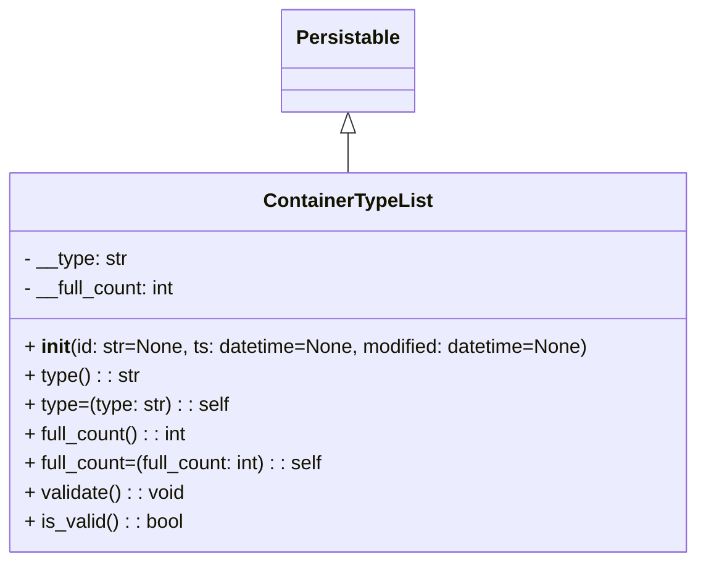

# Diagram: container_tracking_core/container_tracking_service/container_tracking_service/core/datamodel/ContainerTypeList.py

> Auto-generated by Obscura crawlers

## Mermaid

> SVG rendering failed for this diagram.
