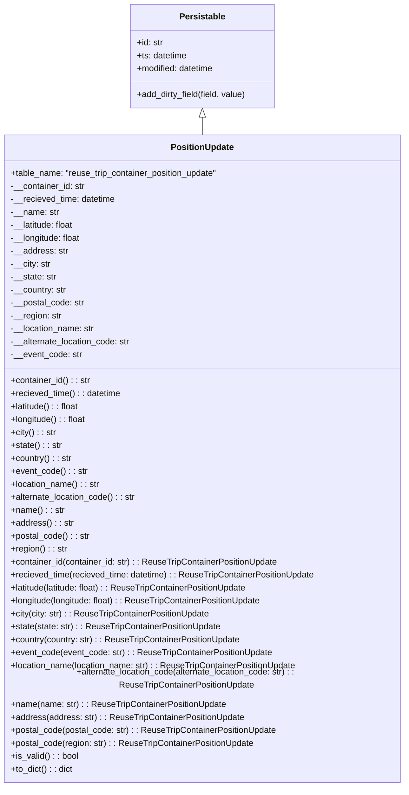

# Diagram: container_tracking_core/container_tracking_service/container_tracking_service/core/datamodel/PositionUpdate.py

> Auto-generated by Obscura crawlers

## Mermaid

### SVG

<svg id="container" width="768.375" xmlns="http://www.w3.org/2000/svg" class="classDiagram" height="1434" viewBox="0 0 768.375 1434" role="graphics-document document" aria-roledescription="class"><g><defs><marker id="container_class-aggregationStart" class="marker aggregation class" refX="18" refY="7" markerWidth="190" markerHeight="240" orient="auto"><path d="M 18,7 L9,13 L1,7 L9,1 Z"></path></marker></defs><defs><marker id="container_class-aggregationEnd" class="marker aggregation class" refX="1" refY="7" markerWidth="20" markerHeight="28" orient="auto"><path d="M 18,7 L9,13 L1,7 L9,1 Z"></path></marker></defs><defs><marker id="container_class-extensionStart" class="marker extension class" refX="18" refY="7" markerWidth="190" markerHeight="240" orient="auto"><path d="M 1,7 L18,13 V 1 Z"></path></marker></defs><defs><marker id="container_class-extensionEnd" class="marker extension class" refX="1" refY="7" markerWidth="20" markerHeight="28" orient="auto"><path d="M 1,1 V 13 L18,7 Z"></path></marker></defs><defs><marker id="container_class-compositionStart" class="marker composition class" refX="18" refY="7" markerWidth="190" markerHeight="240" orient="auto"><path d="M 18,7 L9,13 L1,7 L9,1 Z"></path></marker></defs><defs><marker id="container_class-compositionEnd" class="marker composition class" refX="1" refY="7" markerWidth="20" markerHeight="28" orient="auto"><path d="M 18,7 L9,13 L1,7 L9,1 Z"></path></marker></defs><defs><marker id="container_class-dependencyStart" class="marker dependency class" refX="6" refY="7" markerWidth="190" markerHeight="240" orient="auto"><path d="M 5,7 L9,13 L1,7 L9,1 Z"></path></marker></defs><defs><marker id="container_class-dependencyEnd" class="marker dependency class" refX="13" refY="7" markerWidth="20" markerHeight="28" orient="auto"><path d="M 18,7 L9,13 L14,7 L9,1 Z"></path></marker></defs><defs><marker id="container_class-lollipopStart" class="marker lollipop class" refX="13" refY="7" markerWidth="190" markerHeight="240" orient="auto"><circle stroke="black" fill="transparent" cx="7" cy="7" r="6"></circle></marker></defs><defs><marker id="container_class-lollipopEnd" class="marker lollipop class" refX="1" refY="7" markerWidth="190" markerHeight="240" orient="auto"><circle stroke="black" fill="transparent" cx="7" cy="7" r="6"></circle></marker></defs><g class="root"><g class="clusters"></g><g class="edgePaths"><path d="M384.188,217.25L384.188,218.542C384.188,219.833,384.188,222.417,384.188,227.875C384.188,233.333,384.188,241.667,384.188,245.833L384.188,250" id="id_Persistable_PositionUpdate_1" class="edge-thickness-normal edge-pattern-solid relation" style=";;;" data-edge="true" data-et="edge" data-id="id_Persistable_PositionUpdate_1" data-points="W3sieCI6Mzg0LjE4NzUsInkiOjIwMH0seyJ4IjozODQuMTg3NSwieSI6MjI1fSx7IngiOjM4NC4xODc1LCJ5IjoyNTB9XQ==" marker-start="url(#container_class-extensionStart)"></path></g><g class="edgeLabels"><g class="edgeLabel"><g class="label" data-id="id_Persistable_PositionUpdate_1" transform="translate(0, 0)"><foreignObject width="0" height="0">

</foreignObject></g></g></g><g class="nodes"><g class="node default" id="classId-Persistable-0" transform="translate(384.1875, 104)"><g class="basic label-container"><path d="M-135.71484375 -96 L135.71484375 -96 L135.71484375 96 L-135.71484375 96" stroke="none" stroke-width="0" fill="#ECECFF" style=""></path><path d="M-135.71484375 -96 C-58.67575740005098 -96, 18.363328949898033 -96, 135.71484375 -96 M-135.71484375 -96 C-48.90724378323988 -96, 37.900356183520245 -96, 135.71484375 -96 M135.71484375 -96 C135.71484375 -41.07806096591961, 135.71484375 13.843878068160777, 135.71484375 96 M135.71484375 -96 C135.71484375 -31.05324693870692, 135.71484375 33.89350612258616, 135.71484375 96 M135.71484375 96 C58.546427038996995 96, -18.62198967200601 96, -135.71484375 96 M135.71484375 96 C78.77260447108654 96, 21.830365192173076 96, -135.71484375 96 M-135.71484375 96 C-135.71484375 54.67706119658635, -135.71484375 13.354122393172702, -135.71484375 -96 M-135.71484375 96 C-135.71484375 26.133671671596346, -135.71484375 -43.73265665680731, -135.71484375 -96" stroke="#9370DB" stroke-width="1.3" fill="none" stroke-dasharray="0 0" style=""></path></g><g class="annotation-group text" transform="translate(0, -72)"></g><g class="label-group text" transform="translate(-40.9765625, -72)"><g class="label" style="font-weight: bolder" transform="translate(0,-12)"><foreignObject width="81.953125" height="24">

Persistable

</foreignObject></g></g><g class="members-group text" transform="translate(-123.71484375, -24)"><g class="label" style="" transform="translate(0,-12)"><foreignObject width="49.578125" height="24">

+id: str

</foreignObject></g><g class="label" style="" transform="translate(0,12)"><foreignObject width="94.484375" height="24">

+ts: datetime

</foreignObject></g><g class="label" style="" transform="translate(0,36)"><foreignObject width="145.9375" height="24">

+modified: datetime

</foreignObject></g></g><g class="methods-group text" transform="translate(-123.71484375, 72)"><g class="label" style="" transform="translate(0,-12)"><foreignObject width="206.453125" height="24">

+add_dirty_field(field, value)

</foreignObject></g></g><g class="divider" style=""><path d="M-135.71484375 -48 C-49.838999473805515 -48, 36.03684480238897 -48, 135.71484375 -48 M-135.71484375 -48 C-40.40306058741355 -48, 54.9087225751729 -48, 135.71484375 -48" stroke="#9370DB" stroke-width="1.3" fill="none" stroke-dasharray="0 0" style=""></path></g><g class="divider" style=""><path d="M-135.71484375 48 C-50.14686270755843 48, 35.42111833488315 48, 135.71484375 48 M-135.71484375 48 C-70.6174417313598 48, -5.520039712719608 48, 135.71484375 48" stroke="#9370DB" stroke-width="1.3" fill="none" stroke-dasharray="0 0" style=""></path></g></g><g class="node default" id="classId-PositionUpdate-1" transform="translate(384.1875, 838)"><g class="basic label-container"><path d="M-376.1875 -588 L376.1875 -588 L376.1875 588 L-376.1875 588" stroke="none" stroke-width="0" fill="#ECECFF" style=""></path><path d="M-376.1875 -588 C-113.7458709180641 -588, 148.6957581638718 -588, 376.1875 -588 M-376.1875 -588 C-193.06596892344547 -588, -9.944437846890935 -588, 376.1875 -588 M376.1875 -588 C376.1875 -117.69634406909813, 376.1875 352.60731186180374, 376.1875 588 M376.1875 -588 C376.1875 -253.26230107728298, 376.1875 81.47539784543403, 376.1875 588 M376.1875 588 C218.31848713132126 588, 60.449474262642525 588, -376.1875 588 M376.1875 588 C211.76466885049132 588, 47.34183770098264 588, -376.1875 588 M-376.1875 588 C-376.1875 339.3679685222528, -376.1875 90.73593704450559, -376.1875 -588 M-376.1875 588 C-376.1875 145.4322882703616, -376.1875 -297.1354234592768, -376.1875 -588" stroke="#9370DB" stroke-width="1.3" fill="none" stroke-dasharray="0 0" style=""></path></g><g class="annotation-group text" transform="translate(0, -564)"></g><g class="label-group text" transform="translate(-56.515625, -564)"><g class="label" style="font-weight: bolder" transform="translate(0,-12)"><foreignObject width="113.03125" height="24">

PositionUpdate

</foreignObject></g></g><g class="members-group text" transform="translate(-364.1875, -516)"><g class="label" style="" transform="translate(0,-12)"><foreignObject width="390.984375" height="24">

+table_name: "reuse_trip_container_position_update"

</foreignObject></g><g class="label" style="" transform="translate(0,12)"><foreignObject width="139.15625" height="24">

-__container_id: str

</foreignObject></g><g class="label" style="" transform="translate(0,36)"><foreignObject width="197.03125" height="24">

-__recieved_time: datetime

</foreignObject></g><g class="label" style="" transform="translate(0,60)"><foreignObject width="89.671875" height="24">

-__name: str

</foreignObject></g><g class="label" style="" transform="translate(0,84)"><foreignObject width="119.609375" height="24">

-__latitude: float

</foreignObject></g><g class="label" style="" transform="translate(0,108)"><foreignObject width="132.171875" height="24">

-__longitude: float

</foreignObject></g><g class="label" style="" transform="translate(0,132)"><foreignObject width="105.875" height="24">

-__address: str

</foreignObject></g><g class="label" style="" transform="translate(0,156)"><foreignObject width="74.625" height="24">

-__city: str

</foreignObject></g><g class="label" style="" transform="translate(0,180)"><foreignObject width="85.25" height="24">

-__state: str

</foreignObject></g><g class="label" style="" transform="translate(0,204)"><foreignObject width="104.09375" height="24">

-__country: str

</foreignObject></g><g class="label" style="" transform="translate(0,228)"><foreignObject width="137.34375" height="24">

-__postal_code: str

</foreignObject></g><g class="label" style="" transform="translate(0,252)"><foreignObject width="95.125" height="24">

-__region: str

</foreignObject></g><g class="label" style="" transform="translate(0,276)"><foreignObject width="156.984375" height="24">

-__location_name: str

</foreignObject></g><g class="label" style="" transform="translate(0,300)"><foreignObject width="224.796875" height="24">

-__alternate_location_code: str

</foreignObject></g><g class="label" style="" transform="translate(0,324)"><foreignObject width="132.140625" height="24">

-__event_code: str

</foreignObject></g></g><g class="methods-group text" transform="translate(-364.1875, -132)"><g class="label" style="" transform="translate(0,-12)"><foreignObject width="148.5" height="24">

+container_id() : : str

</foreignObject></g><g class="label" style="" transform="translate(0,12)"><foreignObject width="206.0625" height="24">

+recieved_time() : : datetime

</foreignObject></g><g class="label" style="" transform="translate(0,36)"><foreignObject width="128.796875" height="24">

+latitude() : : float

</foreignObject></g><g class="label" style="" transform="translate(0,60)"><foreignObject width="141.359375" height="24">

+longitude() : : float

</foreignObject></g><g class="label" style="" transform="translate(0,84)"><foreignObject width="83.90625" height="24">

+city() : : str

</foreignObject></g><g class="label" style="" transform="translate(0,108)"><foreignObject width="94.28125" height="24">

+state() : : str

</foreignObject></g><g class="label" style="" transform="translate(0,132)"><foreignObject width="113.375" height="24">

+country() : : str

</foreignObject></g><g class="label" style="" transform="translate(0,156)"><foreignObject width="141.484375" height="24">

+event_code() : : str

</foreignObject></g><g class="label" style="" transform="translate(0,180)"><foreignObject width="166.171875" height="24">

+location_name() : : str

</foreignObject></g><g class="label" style="" transform="translate(0,204)"><foreignObject width="233.890625" height="24">

+alternate_location_code() : : str

</foreignObject></g><g class="label" style="" transform="translate(0,228)"><foreignObject width="98.703125" height="24">

+name() : : str

</foreignObject></g><g class="label" style="" transform="translate(0,252)"><foreignObject width="114.984375" height="24">

+address() : : str

</foreignObject></g><g class="label" style="" transform="translate(0,276)"><foreignObject width="146.359375" height="24">

+postal_code() : : str

</foreignObject></g><g class="label" style="" transform="translate(0,300)"><foreignObject width="104.15625" height="24">

+region() : : str

</foreignObject></g><g class="label" style="" transform="translate(0,324)"><foreignObject width="500.84375" height="24">

+container_id(container_id: str) : : ReuseTripContainerPositionUpdate

</foreignObject></g><g class="label" style="" transform="translate(0,348)"><foreignObject width="570.125" height="24">

+recieved_time(recieved_time: datetime) : : ReuseTripContainerPositionUpdate

</foreignObject></g><g class="label" style="" transform="translate(0,372)"><foreignObject width="447.78125" height="24">

+latitude(latitude: float) : : ReuseTripContainerPositionUpdate

</foreignObject></g><g class="label" style="" transform="translate(0,396)"><foreignObject width="472.90625" height="24">

+longitude(longitude: float) : : ReuseTripContainerPositionUpdate

</foreignObject></g><g class="label" style="" transform="translate(0,420)"><foreignObject width="371.71875" height="24">

+city(city: str) : : ReuseTripContainerPositionUpdate

</foreignObject></g><g class="label" style="" transform="translate(0,444)"><foreignObject width="392.390625" height="24">

+state(state: str) : : ReuseTripContainerPositionUpdate

</foreignObject></g><g class="label" style="" transform="translate(0,468)"><foreignObject width="430.625" height="24">

+country(country: str) : : ReuseTripContainerPositionUpdate

</foreignObject></g><g class="label" style="" transform="translate(0,492)"><foreignObject width="486.796875" height="24">

+event_code(event_code: str) : : ReuseTripContainerPositionUpdate

</foreignObject></g><g class="label" style="" transform="translate(0,516)"><foreignObject width="536.171875" height="24">

+location_name(location_name: str) : : ReuseTripContainerPositionUpdate

</foreignObject></g><g class="label" style="" transform="translate(0,540)"><foreignObject width="671.859375" height="24">

+alternate_location_code(alternate_location_code: str) : : ReuseTripContainerPositionUpdate

</foreignObject></g><g class="label" style="" transform="translate(0,564)"><foreignObject width="401.21875" height="24">

+name(name: str) : : ReuseTripContainerPositionUpdate

</foreignObject></g><g class="label" style="" transform="translate(0,588)"><foreignObject width="434.046875" height="24">

+address(address: str) : : ReuseTripContainerPositionUpdate

</foreignObject></g><g class="label" style="" transform="translate(0,612)"><foreignObject width="496.546875" height="24">

+postal_code(postal_code: str) : : ReuseTripContainerPositionUpdate

</foreignObject></g><g class="label" style="" transform="translate(0,636)"><foreignObject width="454.34375" height="24">

+postal_code(region: str) : : ReuseTripContainerPositionUpdate

</foreignObject></g><g class="label" style="" transform="translate(0,660)"><foreignObject width="126.078125" height="24">

+is_valid() : : bool

</foreignObject></g><g class="label" style="" transform="translate(0,684)"><foreignObject width="116.25" height="24">

+to_dict() : : dict

</foreignObject></g></g><g class="divider" style=""><path d="M-376.1875 -540 C-185.41283044411108 -540, 5.36183911177784 -540, 376.1875 -540 M-376.1875 -540 C-92.78545959200761 -540, 190.61658081598478 -540, 376.1875 -540" stroke="#9370DB" stroke-width="1.3" fill="none" stroke-dasharray="0 0" style=""></path></g><g class="divider" style=""><path d="M-376.1875 -156 C-221.4623800946673 -156, -66.73726018933462 -156, 376.1875 -156 M-376.1875 -156 C-224.91499080927727 -156, -73.64248161855454 -156, 376.1875 -156" stroke="#9370DB" stroke-width="1.3" fill="none" stroke-dasharray="0 0" style=""></path></g></g></g></g></g></svg>
