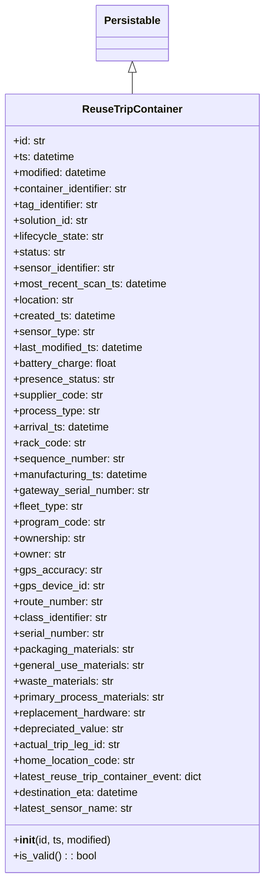

# Diagram: container_tracking_core/container_tracking_service/container_tracking_service/core/datamodel/ReuseTripContainer.py

> Auto-generated by Obscura crawlers

## Mermaid

### SVG

<svg id="container" width="402.296875" xmlns="http://www.w3.org/2000/svg" class="classDiagram" height="1326" viewBox="0 0 402.296875 1326" role="graphics-document document" aria-roledescription="class"><g><defs><marker id="container_class-aggregationStart" class="marker aggregation class" refX="18" refY="7" markerWidth="190" markerHeight="240" orient="auto"><path d="M 18,7 L9,13 L1,7 L9,1 Z"></path></marker></defs><defs><marker id="container_class-aggregationEnd" class="marker aggregation class" refX="1" refY="7" markerWidth="20" markerHeight="28" orient="auto"><path d="M 18,7 L9,13 L1,7 L9,1 Z"></path></marker></defs><defs><marker id="container_class-extensionStart" class="marker extension class" refX="18" refY="7" markerWidth="190" markerHeight="240" orient="auto"><path d="M 1,7 L18,13 V 1 Z"></path></marker></defs><defs><marker id="container_class-extensionEnd" class="marker extension class" refX="1" refY="7" markerWidth="20" markerHeight="28" orient="auto"><path d="M 1,1 V 13 L18,7 Z"></path></marker></defs><defs><marker id="container_class-compositionStart" class="marker composition class" refX="18" refY="7" markerWidth="190" markerHeight="240" orient="auto"><path d="M 18,7 L9,13 L1,7 L9,1 Z"></path></marker></defs><defs><marker id="container_class-compositionEnd" class="marker composition class" refX="1" refY="7" markerWidth="20" markerHeight="28" orient="auto"><path d="M 18,7 L9,13 L1,7 L9,1 Z"></path></marker></defs><defs><marker id="container_class-dependencyStart" class="marker dependency class" refX="6" refY="7" markerWidth="190" markerHeight="240" orient="auto"><path d="M 5,7 L9,13 L1,7 L9,1 Z"></path></marker></defs><defs><marker id="container_class-dependencyEnd" class="marker dependency class" refX="13" refY="7" markerWidth="20" markerHeight="28" orient="auto"><path d="M 18,7 L9,13 L14,7 L9,1 Z"></path></marker></defs><defs><marker id="container_class-lollipopStart" class="marker lollipop class" refX="13" refY="7" markerWidth="190" markerHeight="240" orient="auto"><circle stroke="black" fill="transparent" cx="7" cy="7" r="6"></circle></marker></defs><defs><marker id="container_class-lollipopEnd" class="marker lollipop class" refX="1" refY="7" markerWidth="190" markerHeight="240" orient="auto"><circle stroke="black" fill="transparent" cx="7" cy="7" r="6"></circle></marker></defs><g class="root"><g class="clusters"></g><g class="edgePaths"><path d="M201.148,109.25L201.148,110.542C201.148,111.833,201.148,114.417,201.148,119.875C201.148,125.333,201.148,133.667,201.148,137.833L201.148,142" id="id_Persistable_ReuseTripContainer_1" class="edge-thickness-normal edge-pattern-solid relation" style=";;;" data-edge="true" data-et="edge" data-id="id_Persistable_ReuseTripContainer_1" data-points="W3sieCI6MjAxLjE0ODQzNzUsInkiOjkyfSx7IngiOjIwMS4xNDg0Mzc1LCJ5IjoxMTd9LHsieCI6MjAxLjE0ODQzNzUsInkiOjE0Mn1d" marker-start="url(#container_class-extensionStart)"></path></g><g class="edgeLabels"><g class="edgeLabel"><g class="label" data-id="id_Persistable_ReuseTripContainer_1" transform="translate(0, 0)"><foreignObject width="0" height="0">

</foreignObject></g></g></g><g class="nodes"><g class="node default" id="classId-Persistable-0" transform="translate(201.1484375, 50)"><g class="basic label-container"><path d="M-52.9765625 -42 L52.9765625 -42 L52.9765625 42 L-52.9765625 42" stroke="none" stroke-width="0" fill="#ECECFF" style=""></path><path d="M-52.9765625 -42 C-11.336352489949718 -42, 30.303857520100564 -42, 52.9765625 -42 M-52.9765625 -42 C-11.826582162569906 -42, 29.323398174860188 -42, 52.9765625 -42 M52.9765625 -42 C52.9765625 -14.670668412701094, 52.9765625 12.658663174597812, 52.9765625 42 M52.9765625 -42 C52.9765625 -22.129227674018054, 52.9765625 -2.258455348036108, 52.9765625 42 M52.9765625 42 C17.34465788107088 42, -18.28724673785824 42, -52.9765625 42 M52.9765625 42 C30.090005226671437 42, 7.203447953342874 42, -52.9765625 42 M-52.9765625 42 C-52.9765625 17.573230621138748, -52.9765625 -6.853538757722504, -52.9765625 -42 M-52.9765625 42 C-52.9765625 14.650608849371856, -52.9765625 -12.698782301256287, -52.9765625 -42" stroke="#9370DB" stroke-width="1.3" fill="none" stroke-dasharray="0 0" style=""></path></g><g class="annotation-group text" transform="translate(0, -18)"></g><g class="label-group text" transform="translate(-40.9765625, -18)"><g class="label" style="font-weight: bolder" transform="translate(0,-12)"><foreignObject width="81.953125" height="24">

Persistable

</foreignObject></g></g><g class="members-group text" transform="translate(-40.9765625, 30)"></g><g class="methods-group text" transform="translate(-40.9765625, 60)"></g><g class="divider" style=""><path d="M-52.9765625 6 C-24.012433850715585 6, 4.95169479856883 6, 52.9765625 6 M-52.9765625 6 C-19.762053177158435 6, 13.45245614568313 6, 52.9765625 6" stroke="#9370DB" stroke-width="1.3" fill="none" stroke-dasharray="0 0" style=""></path></g><g class="divider" style=""><path d="M-52.9765625 24 C-21.23082639952224 24, 10.51490970095552 24, 52.9765625 24 M-52.9765625 24 C-12.956131875435105 24, 27.06429874912979 24, 52.9765625 24" stroke="#9370DB" stroke-width="1.3" fill="none" stroke-dasharray="0 0" style=""></path></g></g><g class="node default" id="classId-ReuseTripContainer-1" transform="translate(201.1484375, 730)"><g class="basic label-container"><path d="M-193.1484375 -588 L193.1484375 -588 L193.1484375 588 L-193.1484375 588" stroke="none" stroke-width="0" fill="#ECECFF" style=""></path><path d="M-193.1484375 -588 C-58.20182354999662 -588, 76.74479040000676 -588, 193.1484375 -588 M-193.1484375 -588 C-75.00276746838733 -588, 43.142902563225334 -588, 193.1484375 -588 M193.1484375 -588 C193.1484375 -326.7351068823061, 193.1484375 -65.47021376461225, 193.1484375 588 M193.1484375 -588 C193.1484375 -314.14329027279246, 193.1484375 -40.28658054558491, 193.1484375 588 M193.1484375 588 C103.05065582965979 588, 12.952874159319578 588, -193.1484375 588 M193.1484375 588 C72.23690105809895 588, -48.6746353838021 588, -193.1484375 588 M-193.1484375 588 C-193.1484375 310.42139344665253, -193.1484375 32.84278689330506, -193.1484375 -588 M-193.1484375 588 C-193.1484375 199.5591168602689, -193.1484375 -188.88176627946223, -193.1484375 -588" stroke="#9370DB" stroke-width="1.3" fill="none" stroke-dasharray="0 0" style=""></path></g><g class="annotation-group text" transform="translate(0, -564)"></g><g class="label-group text" transform="translate(-72.015625, -564)"><g class="label" style="font-weight: bolder" transform="translate(0,-12)"><foreignObject width="144.03125" height="24">

ReuseTripContainer

</foreignObject></g></g><g class="members-group text" transform="translate(-181.1484375, -516)"><g class="label" style="" transform="translate(0,-12)"><foreignObject width="49.578125" height="24">

+id: str

</foreignObject></g><g class="label" style="" transform="translate(0,12)"><foreignObject width="94.484375" height="24">

+ts: datetime

</foreignObject></g><g class="label" style="" transform="translate(0,36)"><foreignObject width="145.9375" height="24">

+modified: datetime

</foreignObject></g><g class="label" style="" transform="translate(0,60)"><foreignObject width="178.453125" height="24">

+container_identifier: str

</foreignObject></g><g class="label" style="" transform="translate(0,84)"><foreignObject width="133.046875" height="24">

+tag_identifier: str

</foreignObject></g><g class="label" style="" transform="translate(0,108)"><foreignObject width="117.71875" height="24">

+solution_id: str

</foreignObject></g><g class="label" style="" transform="translate(0,132)"><foreignObject width="139.140625" height="24">

+lifecycle_state: str

</foreignObject></g><g class="label" style="" transform="translate(0,156)"><foreignObject width="79.890625" height="24">

+status: str

</foreignObject></g><g class="label" style="" transform="translate(0,180)"><foreignObject width="157.8125" height="24">

+sensor_identifier: str

</foreignObject></g><g class="label" style="" transform="translate(0,204)"><foreignObject width="234.171875" height="24">

+most_recent_scan_ts: datetime

</foreignObject></g><g class="label" style="" transform="translate(0,228)"><foreignObject width="94.640625" height="24">

+location: str

</foreignObject></g><g class="label" style="" transform="translate(0,252)"><foreignObject width="157" height="24">

+created_ts: datetime

</foreignObject></g><g class="label" style="" transform="translate(0,276)"><foreignObject width="122.5625" height="24">

+sensor_type: str

</foreignObject></g><g class="label" style="" transform="translate(0,300)"><foreignObject width="201.90625" height="24">

+last_modified_ts: datetime

</foreignObject></g><g class="label" style="" transform="translate(0,324)"><foreignObject width="157.21875" height="24">

+battery_charge: float

</foreignObject></g><g class="label" style="" transform="translate(0,348)"><foreignObject width="153.4375" height="24">

+presence_status: str

</foreignObject></g><g class="label" style="" transform="translate(0,372)"><foreignObject width="137.0625" height="24">

+supplier_code: str

</foreignObject></g><g class="label" style="" transform="translate(0,396)"><foreignObject width="130.34375" height="24">

+process_type: str

</foreignObject></g><g class="label" style="" transform="translate(0,420)"><foreignObject width="148.75" height="24">

+arrival_ts: datetime

</foreignObject></g><g class="label" style="" transform="translate(0,444)"><foreignObject width="108.609375" height="24">

+rack_code: str

</foreignObject></g><g class="label" style="" transform="translate(0,468)"><foreignObject width="169.671875" height="24">

+sequence_number: str

</foreignObject></g><g class="label" style="" transform="translate(0,492)"><foreignObject width="208.5625" height="24">

+manufacturing_ts: datetime

</foreignObject></g><g class="label" style="" transform="translate(0,516)"><foreignObject width="207.3125" height="24">

+gateway_serial_number: str

</foreignObject></g><g class="label" style="" transform="translate(0,540)"><foreignObject width="107.65625" height="24">

+fleet_type: str

</foreignObject></g><g class="label" style="" transform="translate(0,564)"><foreignObject width="139.359375" height="24">

+program_code: str

</foreignObject></g><g class="label" style="" transform="translate(0,588)"><foreignObject width="111.203125" height="24">

+ownership: str

</foreignObject></g><g class="label" style="" transform="translate(0,612)"><foreignObject width="80.75" height="24">

+owner: str

</foreignObject></g><g class="label" style="" transform="translate(0,636)"><foreignObject width="131.203125" height="24">

+gps_accuracy: str

</foreignObject></g><g class="label" style="" transform="translate(0,660)"><foreignObject width="137.203125" height="24">

+gps_device_id: str

</foreignObject></g><g class="label" style="" transform="translate(0,684)"><foreignObject width="139.0625" height="24">

+route_number: str

</foreignObject></g><g class="label" style="" transform="translate(0,708)"><foreignObject width="145.796875" height="24">

+class_identifier: str

</foreignObject></g><g class="label" style="" transform="translate(0,732)"><foreignObject width="140.890625" height="24">

+serial_number: str

</foreignObject></g><g class="label" style="" transform="translate(0,756)"><foreignObject width="184.671875" height="24">

+packaging_materials: str

</foreignObject></g><g class="label" style="" transform="translate(0,780)"><foreignObject width="198.796875" height="24">

+general_use_materials: str

</foreignObject></g><g class="label" style="" transform="translate(0,804)"><foreignObject width="153.109375" height="24">

+waste_materials: str

</foreignObject></g><g class="label" style="" transform="translate(0,828)"><foreignObject width="231.4375" height="24">

+primary_process_materials: str

</foreignObject></g><g class="label" style="" transform="translate(0,852)"><foreignObject width="202.421875" height="24">

+replacement_hardware: str

</foreignObject></g><g class="label" style="" transform="translate(0,876)"><foreignObject width="169.109375" height="24">

+depreciated_value: str

</foreignObject></g><g class="label" style="" transform="translate(0,900)"><foreignObject width="165.84375" height="24">

+actual_trip_leg_id: str

</foreignObject></g><g class="label" style="" transform="translate(0,924)"><foreignObject width="186.59375" height="24">

+home_location_code: str

</foreignObject></g><g class="label" style="" transform="translate(0,948)"><foreignObject width="290.28125" height="24">

+latest_reuse_trip_container_event: dict

</foreignObject></g><g class="label" style="" transform="translate(0,972)"><foreignObject width="195.546875" height="24">

+destination_eta: datetime

</foreignObject></g><g class="label" style="" transform="translate(0,996)"><foreignObject width="180.75" height="24">

+latest_sensor_name: str

</foreignObject></g></g><g class="methods-group text" transform="translate(-181.1484375, 540)"><g class="label" style="" transform="translate(0,-12)"><foreignObject width="150.90625" height="24">

+<strong>init</strong>(id, ts, modified)

</foreignObject></g><g class="label" style="" transform="translate(0,12)"><foreignObject width="126.078125" height="24">

+is_valid() : : bool

</foreignObject></g></g><g class="divider" style=""><path d="M-193.1484375 -540 C-82.836706285868 -540, 27.47502492826399 -540, 193.1484375 -540 M-193.1484375 -540 C-102.74480339133606 -540, -12.341169282672126 -540, 193.1484375 -540" stroke="#9370DB" stroke-width="1.3" fill="none" stroke-dasharray="0 0" style=""></path></g><g class="divider" style=""><path d="M-193.1484375 516 C-83.39839350231438 516, 26.351650495371246 516, 193.1484375 516 M-193.1484375 516 C-44.869940593420665 516, 103.40855631315867 516, 193.1484375 516" stroke="#9370DB" stroke-width="1.3" fill="none" stroke-dasharray="0 0" style=""></path></g></g></g></g></g></svg>
