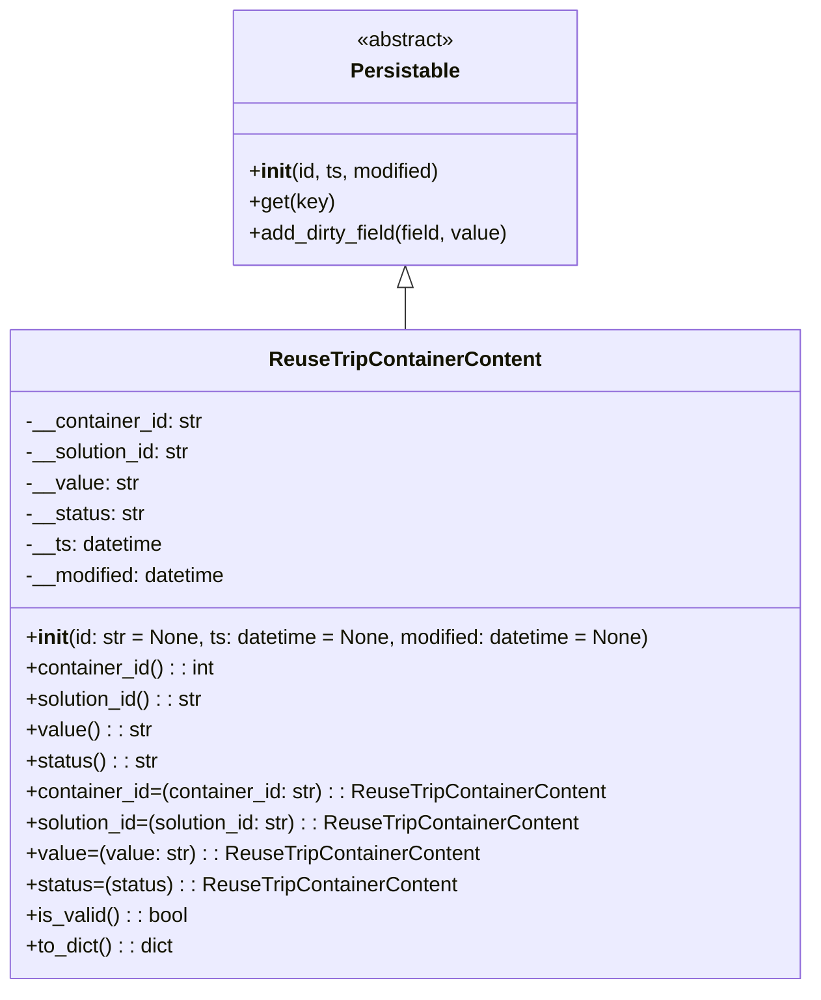

# Diagram: container_tracking_core/container_tracking_service/container_tracking_service/core/datamodel/ReuseTripContainerContent.py


> Auto-generated by Obscura crawlers

## Diagram 1



### SVG

<svg id="container" width="630.1015625" xmlns="http://www.w3.org/2000/svg" class="classDiagram" height="768" viewBox="0 0 630.1015625 768" role="graphics-document document" aria-roledescription="class"><style>#container{font-family:"trebuchet ms",verdana,arial,sans-serif;font-size:16px;fill:#333;}@keyframes edge-animation-frame{from{stroke-dashoffset:0;}}@keyframes dash{to{stroke-dashoffset:0;}}#container .edge-animation-slow{stroke-dasharray:9,5!important;stroke-dashoffset:900;animation:dash 50s linear infinite;stroke-linecap:round;}#container .edge-animation-fast{stroke-dasharray:9,5!important;stroke-dashoffset:900;animation:dash 20s linear infinite;stroke-linecap:round;}#container .error-icon{fill:#552222;}#container .error-text{fill:#552222;stroke:#552222;}#container .edge-thickness-normal{stroke-width:1px;}#container .edge-thickness-thick{stroke-width:3.5px;}#container .edge-pattern-solid{stroke-dasharray:0;}#container .edge-thickness-invisible{stroke-width:0;fill:none;}#container .edge-pattern-dashed{stroke-dasharray:3;}#container .edge-pattern-dotted{stroke-dasharray:2;}#container .marker{fill:#333333;stroke:#333333;}#container .marker.cross{stroke:#333333;}#container svg{font-family:"trebuchet ms",verdana,arial,sans-serif;font-size:16px;}#container p{margin:0;}#container g.classGroup text{fill:#9370DB;stroke:none;font-family:"trebuchet ms",verdana,arial,sans-serif;font-size:10px;}#container g.classGroup text .title{font-weight:bolder;}#container .nodeLabel,#container .edgeLabel{color:#131300;}#container .edgeLabel .label rect{fill:#ECECFF;}#container .label text{fill:#131300;}#container .labelBkg{background:#ECECFF;}#container .edgeLabel .label span{background:#ECECFF;}#container .classTitle{font-weight:bolder;}#container .node rect,#container .node circle,#container .node ellipse,#container .node polygon,#container .node path{fill:#ECECFF;stroke:#9370DB;stroke-width:1px;}#container .divider{stroke:#9370DB;stroke-width:1;}#container g.clickable{cursor:pointer;}#container g.classGroup rect{fill:#ECECFF;stroke:#9370DB;}#container g.classGroup line{stroke:#9370DB;stroke-width:1;}#container .classLabel .box{stroke:none;stroke-width:0;fill:#ECECFF;opacity:0.5;}#container .classLabel .label{fill:#9370DB;font-size:10px;}#container .relation{stroke:#333333;stroke-width:1;fill:none;}#container .dashed-line{stroke-dasharray:3;}#container .dotted-line{stroke-dasharray:1 2;}#container #compositionStart,#container .composition{fill:#333333!important;stroke:#333333!important;stroke-width:1;}#container #compositionEnd,#container .composition{fill:#333333!important;stroke:#333333!important;stroke-width:1;}#container #dependencyStart,#container .dependency{fill:#333333!important;stroke:#333333!important;stroke-width:1;}#container #dependencyStart,#container .dependency{fill:#333333!important;stroke:#333333!important;stroke-width:1;}#container #extensionStart,#container .extension{fill:transparent!important;stroke:#333333!important;stroke-width:1;}#container #extensionEnd,#container .extension{fill:transparent!important;stroke:#333333!important;stroke-width:1;}#container #aggregationStart,#container .aggregation{fill:transparent!important;stroke:#333333!important;stroke-width:1;}#container #aggregationEnd,#container .aggregation{fill:transparent!important;stroke:#333333!important;stroke-width:1;}#container #lollipopStart,#container .lollipop{fill:#ECECFF!important;stroke:#333333!important;stroke-width:1;}#container #lollipopEnd,#container .lollipop{fill:#ECECFF!important;stroke:#333333!important;stroke-width:1;}#container .edgeTerminals{font-size:11px;line-height:initial;}#container .classTitleText{text-anchor:middle;font-size:18px;fill:#333;}#container .label-icon{display:inline-block;height:1em;overflow:visible;vertical-align:-0.125em;}#container .node .label-icon path{fill:currentColor;stroke:revert;stroke-width:revert;}#container :root{--mermaid-font-family:"trebuchet ms",verdana,arial,sans-serif;}</style><g><defs><marker id="container_class-aggregationStart" class="marker aggregation class" refX="18" refY="7" markerWidth="190" markerHeight="240" orient="auto"><path d="M 18,7 L9,13 L1,7 L9,1 Z"></path></marker></defs><defs><marker id="container_class-aggregationEnd" class="marker aggregation class" refX="1" refY="7" markerWidth="20" markerHeight="28" orient="auto"><path d="M 18,7 L9,13 L1,7 L9,1 Z"></path></marker></defs><defs><marker id="container_class-extensionStart" class="marker extension class" refX="18" refY="7" markerWidth="190" markerHeight="240" orient="auto"><path d="M 1,7 L18,13 V 1 Z"></path></marker></defs><defs><marker id="container_class-extensionEnd" class="marker extension class" refX="1" refY="7" markerWidth="20" markerHeight="28" orient="auto"><path d="M 1,1 V 13 L18,7 Z"></path></marker></defs><defs><marker id="container_class-compositionStart" class="marker composition class" refX="18" refY="7" markerWidth="190" markerHeight="240" orient="auto"><path d="M 18,7 L9,13 L1,7 L9,1 Z"></path></marker></defs><defs><marker id="container_class-compositionEnd" class="marker composition class" refX="1" refY="7" markerWidth="20" markerHeight="28" orient="auto"><path d="M 18,7 L9,13 L1,7 L9,1 Z"></path></marker></defs><defs><marker id="container_class-dependencyStart" class="marker dependency class" refX="6" refY="7" markerWidth="190" markerHeight="240" orient="auto"><path d="M 5,7 L9,13 L1,7 L9,1 Z"></path></marker></defs><defs><marker id="container_class-dependencyEnd" class="marker dependency class" refX="13" refY="7" markerWidth="20" markerHeight="28" orient="auto"><path d="M 18,7 L9,13 L14,7 L9,1 Z"></path></marker></defs><defs><marker id="container_class-lollipopStart" class="marker lollipop class" refX="13" refY="7" markerWidth="190" markerHeight="240" orient="auto"><circle stroke="black" fill="transparent" cx="7" cy="7" r="6"></circle></marker></defs><defs><marker id="container_class-lollipopEnd" class="marker lollipop class" refX="1" refY="7" markerWidth="190" markerHeight="240" orient="auto"><circle stroke="black" fill="transparent" cx="7" cy="7" r="6"></circle></marker></defs><g class="root"><g class="clusters"></g><g class="edgePaths"><path d="M315.051,223.25L315.051,224.542C315.051,225.833,315.051,228.417,315.051,233.875C315.051,239.333,315.051,247.667,315.051,251.833L315.051,256" id="id_Persistable_ReuseTripContainerContent_1" class="edge-thickness-normal edge-pattern-solid relation" style=";;;" data-edge="true" data-et="edge" data-id="id_Persistable_ReuseTripContainerContent_1" data-points="W3sieCI6MzE1LjA1MDc4MTI1LCJ5IjoyMDZ9LHsieCI6MzE1LjA1MDc4MTI1LCJ5IjoyMzF9LHsieCI6MzE1LjA1MDc4MTI1LCJ5IjoyNTZ9XQ==" marker-start="url(#container_class-extensionStart)"></path></g><g class="edgeLabels"><g class="edgeLabel"><g class="label" data-id="id_Persistable_ReuseTripContainerContent_1" transform="translate(0, 0)"><foreignObject width="0" height="0"><div xmlns="http://www.w3.org/1999/xhtml" class="labelBkg" style="display: table-cell; white-space: nowrap; line-height: 1.5; max-width: 200px; text-align: center;"><span class="edgeLabel"></span></div></foreignObject></g></g></g><g class="nodes"><g class="node default" id="classId-Persistable-0" transform="translate(315.05078125, 107)"><g class="basic label-container"><path d="M-135.71484375 -99 L135.71484375 -99 L135.71484375 99 L-135.71484375 99" stroke="none" stroke-width="0" fill="#ECECFF" style=""></path><path d="M-135.71484375 -99 C-52.18884369311475 -99, 31.337156363770504 -99, 135.71484375 -99 M-135.71484375 -99 C-56.94902495602847 -99, 21.816793837943067 -99, 135.71484375 -99 M135.71484375 -99 C135.71484375 -59.12236269694168, 135.71484375 -19.244725393883357, 135.71484375 99 M135.71484375 -99 C135.71484375 -36.67023754277607, 135.71484375 25.659524914447857, 135.71484375 99 M135.71484375 99 C55.007275991128296 99, -25.70029176774341 99, -135.71484375 99 M135.71484375 99 C56.945149029864524 99, -21.824545690270952 99, -135.71484375 99 M-135.71484375 99 C-135.71484375 44.028743534322565, -135.71484375 -10.94251293135487, -135.71484375 -99 M-135.71484375 99 C-135.71484375 53.331025730515975, -135.71484375 7.66205146103195, -135.71484375 -99" stroke="#9370DB" stroke-width="1.3" fill="none" stroke-dasharray="0 0" style=""></path></g><g class="annotation-group text" transform="translate(-38.609375, -75)"><g class="label" style="" transform="translate(0,-12)"><foreignObject width="77.21875" height="24"><div xmlns="http://www.w3.org/1999/xhtml" style="display: table-cell; white-space: nowrap; line-height: 1.5; max-width: 127px; text-align: center;"><span class="nodeLabel markdown-node-label" style=""><p>«abstract»</p></span></div></foreignObject></g></g><g class="label-group text" transform="translate(-40.9765625, -51)"><g class="label" style="font-weight: bolder" transform="translate(0,-12)"><foreignObject width="81.953125" height="24"><div xmlns="http://www.w3.org/1999/xhtml" style="display: table-cell; white-space: nowrap; line-height: 1.5; max-width: 130px; text-align: center;"><span class="nodeLabel markdown-node-label" style=""><p>Persistable</p></span></div></foreignObject></g></g><g class="members-group text" transform="translate(-123.71484375, -3)"></g><g class="methods-group text" transform="translate(-123.71484375, 27)"><g class="label" style="" transform="translate(0,-12)"><foreignObject width="150.90625" height="24"><div xmlns="http://www.w3.org/1999/xhtml" style="display: table-cell; white-space: nowrap; line-height: 1.5; max-width: 240px; text-align: center;"><span class="nodeLabel markdown-node-label" style=""><p>+<strong>init</strong>(id, ts, modified)</p></span></div></foreignObject></g><g class="label" style="" transform="translate(0,12)"><foreignObject width="65.5" height="24"><div xmlns="http://www.w3.org/1999/xhtml" style="display: table-cell; white-space: nowrap; line-height: 1.5; max-width: 123px; text-align: center;"><span class="nodeLabel markdown-node-label" style=""><p>+get(key)</p></span></div></foreignObject></g><g class="label" style="" transform="translate(0,36)"><foreignObject width="206.453125" height="24"><div xmlns="http://www.w3.org/1999/xhtml" style="display: table-cell; white-space: nowrap; line-height: 1.5; max-width: 264px; text-align: center;"><span class="nodeLabel markdown-node-label" style=""><p>+add_dirty_field(field, value)</p></span></div></foreignObject></g></g><g class="divider" style=""><path d="M-135.71484375 -27 C-44.94565442416335 -27, 45.8235349016733 -27, 135.71484375 -27 M-135.71484375 -27 C-47.30161858040145 -27, 41.111606589197095 -27, 135.71484375 -27" stroke="#9370DB" stroke-width="1.3" fill="none" stroke-dasharray="0 0" style=""></path></g><g class="divider" style=""><path d="M-135.71484375 -3 C-43.91957148440524 -3, 47.87570078118952 -3, 135.71484375 -3 M-135.71484375 -3 C-40.63670476670261 -3, 54.441434216594786 -3, 135.71484375 -3" stroke="#9370DB" stroke-width="1.3" fill="none" stroke-dasharray="0 0" style=""></path></g></g><g class="node default" id="classId-ReuseTripContainerContent-1" transform="translate(315.05078125, 508)"><g class="basic label-container"><path d="M-307.05078125 -252 L307.05078125 -252 L307.05078125 252 L-307.05078125 252" stroke="none" stroke-width="0" fill="#ECECFF" style=""></path><path d="M-307.05078125 -252 C-179.39221734494964 -252, -51.733653439899314 -252, 307.05078125 -252 M-307.05078125 -252 C-166.75231552757486 -252, -26.45384980514973 -252, 307.05078125 -252 M307.05078125 -252 C307.05078125 -67.43735123095433, 307.05078125 117.12529753809133, 307.05078125 252 M307.05078125 -252 C307.05078125 -135.53532723317107, 307.05078125 -19.070654466342177, 307.05078125 252 M307.05078125 252 C147.03432582692997 252, -12.982129596140055 252, -307.05078125 252 M307.05078125 252 C128.94182388821 252, -49.16713347358001 252, -307.05078125 252 M-307.05078125 252 C-307.05078125 97.52842356976694, -307.05078125 -56.943152860466114, -307.05078125 -252 M-307.05078125 252 C-307.05078125 52.128707285503765, -307.05078125 -147.74258542899247, -307.05078125 -252" stroke="#9370DB" stroke-width="1.3" fill="none" stroke-dasharray="0 0" style=""></path></g><g class="annotation-group text" transform="translate(0, -228)"></g><g class="label-group text" transform="translate(-100.8046875, -228)"><g class="label" style="font-weight: bolder" transform="translate(0,-12)"><foreignObject width="201.609375" height="24"><div xmlns="http://www.w3.org/1999/xhtml" style="display: table-cell; white-space: nowrap; line-height: 1.5; max-width: 249px; text-align: center;"><span class="nodeLabel markdown-node-label" style=""><p>ReuseTripContainerContent</p></span></div></foreignObject></g></g><g class="members-group text" transform="translate(-295.05078125, -180)"><g class="label" style="" transform="translate(0,-12)"><foreignObject width="139.15625" height="24"><div xmlns="http://www.w3.org/1999/xhtml" style="display: table-cell; white-space: nowrap; line-height: 1.5; max-width: 197px; text-align: center;"><span class="nodeLabel markdown-node-label" style=""><p>-__container_id: str</p></span></div></foreignObject></g><g class="label" style="" transform="translate(0,12)"><foreignObject width="131.390625" height="24"><div xmlns="http://www.w3.org/1999/xhtml" style="display: table-cell; white-space: nowrap; line-height: 1.5; max-width: 190px; text-align: center;"><span class="nodeLabel markdown-node-label" style=""><p>-__solution_id: str</p></span></div></foreignObject></g><g class="label" style="" transform="translate(0,36)"><foreignObject width="87.5625" height="24"><div xmlns="http://www.w3.org/1999/xhtml" style="display: table-cell; white-space: nowrap; line-height: 1.5; max-width: 146px; text-align: center;"><span class="nodeLabel markdown-node-label" style=""><p>-__value: str</p></span></div></foreignObject></g><g class="label" style="" transform="translate(0,60)"><foreignObject width="93.5625" height="24"><div xmlns="http://www.w3.org/1999/xhtml" style="display: table-cell; white-space: nowrap; line-height: 1.5; max-width: 152px; text-align: center;"><span class="nodeLabel markdown-node-label" style=""><p>-__status: str</p></span></div></foreignObject></g><g class="label" style="" transform="translate(0,84)"><foreignObject width="107.90625" height="24"><div xmlns="http://www.w3.org/1999/xhtml" style="display: table-cell; white-space: nowrap; line-height: 1.5; max-width: 165px; text-align: center;"><span class="nodeLabel markdown-node-label" style=""><p>-__ts: datetime</p></span></div></foreignObject></g><g class="label" style="" transform="translate(0,108)"><foreignObject width="159.609375" height="24"><div xmlns="http://www.w3.org/1999/xhtml" style="display: table-cell; white-space: nowrap; line-height: 1.5; max-width: 217px; text-align: center;"><span class="nodeLabel markdown-node-label" style=""><p>-__modified: datetime</p></span></div></foreignObject></g></g><g class="methods-group text" transform="translate(-295.05078125, -12)"><g class="label" style="" transform="translate(0,-12)"><foreignObject width="489.296875" height="24"><div xmlns="http://www.w3.org/1999/xhtml" style="display: table-cell; white-space: nowrap; line-height: 1.5; max-width: 578px; text-align: center;"><span class="nodeLabel markdown-node-label" style=""><p>+<strong>init</strong>(id: str = None, ts: datetime = None, modified: datetime = None)</p></span></div></foreignObject></g><g class="label" style="" transform="translate(0,12)"><foreignObject width="148.75" height="24"><div xmlns="http://www.w3.org/1999/xhtml" style="display: table-cell; white-space: nowrap; line-height: 1.5; max-width: 206px; text-align: center;"><span class="nodeLabel markdown-node-label" style=""><p>+container_id() : : int</p></span></div></foreignObject></g><g class="label" style="" transform="translate(0,36)"><foreignObject width="140.40625" height="24"><div xmlns="http://www.w3.org/1999/xhtml" style="display: table-cell; white-space: nowrap; line-height: 1.5; max-width: 199px; text-align: center;"><span class="nodeLabel markdown-node-label" style=""><p>+solution_id() : : str</p></span></div></foreignObject></g><g class="label" style="" transform="translate(0,60)"><foreignObject width="96.90625" height="24"><div xmlns="http://www.w3.org/1999/xhtml" style="display: table-cell; white-space: nowrap; line-height: 1.5; max-width: 155px; text-align: center;"><span class="nodeLabel markdown-node-label" style=""><p>+value() : : str</p></span></div></foreignObject></g><g class="label" style="" transform="translate(0,84)"><foreignObject width="102.578125" height="24"><div xmlns="http://www.w3.org/1999/xhtml" style="display: table-cell; white-space: nowrap; line-height: 1.5; max-width: 161px; text-align: center;"><span class="nodeLabel markdown-node-label" style=""><p>+status() : : str</p></span></div></foreignObject></g><g class="label" style="" transform="translate(0,108)"><foreignObject width="453.828125" height="24"><div xmlns="http://www.w3.org/1999/xhtml" style="display: table-cell; white-space: nowrap; line-height: 1.5; max-width: 511px; text-align: center;"><span class="nodeLabel markdown-node-label" style=""><p>+container_id=(container_id: str) : : ReuseTripContainerContent</p></span></div></foreignObject></g><g class="label" style="" transform="translate(0,132)"><foreignObject width="437.640625" height="24"><div xmlns="http://www.w3.org/1999/xhtml" style="display: table-cell; white-space: nowrap; line-height: 1.5; max-width: 495px; text-align: center;"><span class="nodeLabel markdown-node-label" style=""><p>+solution_id=(solution_id: str) : : ReuseTripContainerContent</p></span></div></foreignObject></g><g class="label" style="" transform="translate(0,156)"><foreignObject width="350.796875" height="24"><div xmlns="http://www.w3.org/1999/xhtml" style="display: table-cell; white-space: nowrap; line-height: 1.5; max-width: 408px; text-align: center;"><span class="nodeLabel markdown-node-label" style=""><p>+value=(value: str) : : ReuseTripContainerContent</p></span></div></foreignObject></g><g class="label" style="" transform="translate(0,180)"><foreignObject width="334.484375" height="24"><div xmlns="http://www.w3.org/1999/xhtml" style="display: table-cell; white-space: nowrap; line-height: 1.5; max-width: 392px; text-align: center;"><span class="nodeLabel markdown-node-label" style=""><p>+status=(status) : : ReuseTripContainerContent</p></span></div></foreignObject></g><g class="label" style="" transform="translate(0,204)"><foreignObject width="126.078125" height="24"><div xmlns="http://www.w3.org/1999/xhtml" style="display: table-cell; white-space: nowrap; line-height: 1.5; max-width: 184px; text-align: center;"><span class="nodeLabel markdown-node-label" style=""><p>+is_valid() : : bool</p></span></div></foreignObject></g><g class="label" style="" transform="translate(0,228)"><foreignObject width="116.25" height="24"><div xmlns="http://www.w3.org/1999/xhtml" style="display: table-cell; white-space: nowrap; line-height: 1.5; max-width: 174px; text-align: center;"><span class="nodeLabel markdown-node-label" style=""><p>+to_dict() : : dict</p></span></div></foreignObject></g></g><g class="divider" style=""><path d="M-307.05078125 -204 C-96.00570303006282 -204, 115.03937518987436 -204, 307.05078125 -204 M-307.05078125 -204 C-86.48500246660902 -204, 134.08077631678196 -204, 307.05078125 -204" stroke="#9370DB" stroke-width="1.3" fill="none" stroke-dasharray="0 0" style=""></path></g><g class="divider" style=""><path d="M-307.05078125 -36 C-134.94740747236548 -36, 37.15596630526903 -36, 307.05078125 -36 M-307.05078125 -36 C-100.93618482572677 -36, 105.17841159854646 -36, 307.05078125 -36" stroke="#9370DB" stroke-width="1.3" fill="none" stroke-dasharray="0 0" style=""></path></g></g></g></g></g></svg>

## Diagram 2

```mermaid
flowchart TD
A[container_id.setter called] --> B{__container_id != container_id?}
B -- No --> C[return self]
B -- Yes --> D{container_id is non-empty string?}
D -- No --> E[AssertionError raised]
D -- Yes --> F[__container_id = container_id]
F --> G[add_dirty_field("container_id", container_id)]
G --> C
```

> SVG rendering failed for this diagram.

## Diagram 3

```mermaid
flowchart TD
H[is_valid called] --> I{isinstance(__container_id, str) AND<br/>isinstance(__solution_id, str) AND<br/>isinstance(__value, str) AND<br/>isinstance(__status, str)?}
I -- Yes --> J[return True]
I -- No --> K[print "NOT VALID"]
K --> L[return False]
```

> SVG rendering failed for this diagram.
