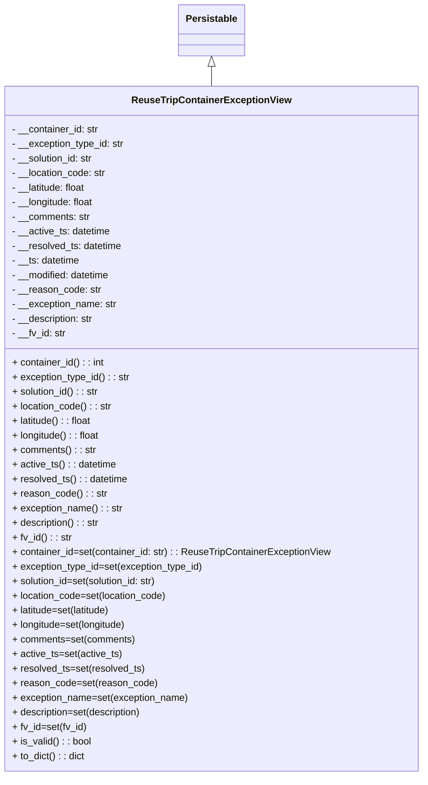

# Diagram: container_tracking_core/container_tracking_service/container_tracking_service/core/datamodel/ReuseTripContainerExceptionView.py

> Auto-generated by Obscura crawlers

## Mermaid

### SVG

<svg id="container" width="692.5390625" xmlns="http://www.w3.org/2000/svg" class="classDiagram" height="1278" viewBox="0 0 692.5390625 1278" role="graphics-document document" aria-roledescription="class"><g><defs><marker id="container_class-aggregationStart" class="marker aggregation class" refX="18" refY="7" markerWidth="190" markerHeight="240" orient="auto"><path d="M 18,7 L9,13 L1,7 L9,1 Z"></path></marker></defs><defs><marker id="container_class-aggregationEnd" class="marker aggregation class" refX="1" refY="7" markerWidth="20" markerHeight="28" orient="auto"><path d="M 18,7 L9,13 L1,7 L9,1 Z"></path></marker></defs><defs><marker id="container_class-extensionStart" class="marker extension class" refX="18" refY="7" markerWidth="190" markerHeight="240" orient="auto"><path d="M 1,7 L18,13 V 1 Z"></path></marker></defs><defs><marker id="container_class-extensionEnd" class="marker extension class" refX="1" refY="7" markerWidth="20" markerHeight="28" orient="auto"><path d="M 1,1 V 13 L18,7 Z"></path></marker></defs><defs><marker id="container_class-compositionStart" class="marker composition class" refX="18" refY="7" markerWidth="190" markerHeight="240" orient="auto"><path d="M 18,7 L9,13 L1,7 L9,1 Z"></path></marker></defs><defs><marker id="container_class-compositionEnd" class="marker composition class" refX="1" refY="7" markerWidth="20" markerHeight="28" orient="auto"><path d="M 18,7 L9,13 L1,7 L9,1 Z"></path></marker></defs><defs><marker id="container_class-dependencyStart" class="marker dependency class" refX="6" refY="7" markerWidth="190" markerHeight="240" orient="auto"><path d="M 5,7 L9,13 L1,7 L9,1 Z"></path></marker></defs><defs><marker id="container_class-dependencyEnd" class="marker dependency class" refX="13" refY="7" markerWidth="20" markerHeight="28" orient="auto"><path d="M 18,7 L9,13 L14,7 L9,1 Z"></path></marker></defs><defs><marker id="container_class-lollipopStart" class="marker lollipop class" refX="13" refY="7" markerWidth="190" markerHeight="240" orient="auto"><circle stroke="black" fill="transparent" cx="7" cy="7" r="6"></circle></marker></defs><defs><marker id="container_class-lollipopEnd" class="marker lollipop class" refX="1" refY="7" markerWidth="190" markerHeight="240" orient="auto"><circle stroke="black" fill="transparent" cx="7" cy="7" r="6"></circle></marker></defs><g class="root"><g class="clusters"></g><g class="edgePaths"><path d="M346.27,109.25L346.27,110.542C346.27,111.833,346.27,114.417,346.27,119.875C346.27,125.333,346.27,133.667,346.27,137.833L346.27,142" id="id_Persistable_ReuseTripContainerExceptionView_1" class="edge-thickness-normal edge-pattern-solid relation" style=";;;" data-edge="true" data-et="edge" data-id="id_Persistable_ReuseTripContainerExceptionView_1" data-points="W3sieCI6MzQ2LjI2OTUzMTI1LCJ5Ijo5Mn0seyJ4IjozNDYuMjY5NTMxMjUsInkiOjExN30seyJ4IjozNDYuMjY5NTMxMjUsInkiOjE0Mn1d" marker-start="url(#container_class-extensionStart)"></path></g><g class="edgeLabels"><g class="edgeLabel"><g class="label" data-id="id_Persistable_ReuseTripContainerExceptionView_1" transform="translate(0, 0)"><foreignObject width="0" height="0">

</foreignObject></g></g></g><g class="nodes"><g class="node default" id="classId-Persistable-0" transform="translate(346.26953125, 50)"><g class="basic label-container"><path d="M-52.9765625 -42 L52.9765625 -42 L52.9765625 42 L-52.9765625 42" stroke="none" stroke-width="0" fill="#ECECFF" style=""></path><path d="M-52.9765625 -42 C-30.0415023902138 -42, -7.106442280427601 -42, 52.9765625 -42 M-52.9765625 -42 C-11.288279722837565 -42, 30.40000305432487 -42, 52.9765625 -42 M52.9765625 -42 C52.9765625 -11.730684713747952, 52.9765625 18.538630572504097, 52.9765625 42 M52.9765625 -42 C52.9765625 -17.788995848610096, 52.9765625 6.422008302779808, 52.9765625 42 M52.9765625 42 C15.335948983180316 42, -22.304664533639368 42, -52.9765625 42 M52.9765625 42 C17.59827625950946 42, -17.780009980981077 42, -52.9765625 42 M-52.9765625 42 C-52.9765625 11.11889523097108, -52.9765625 -19.76220953805784, -52.9765625 -42 M-52.9765625 42 C-52.9765625 20.15397652421537, -52.9765625 -1.6920469515692602, -52.9765625 -42" stroke="#9370DB" stroke-width="1.3" fill="none" stroke-dasharray="0 0" style=""></path></g><g class="annotation-group text" transform="translate(0, -18)"></g><g class="label-group text" transform="translate(-40.9765625, -18)"><g class="label" style="font-weight: bolder" transform="translate(0,-12)"><foreignObject width="81.953125" height="24">

Persistable

</foreignObject></g></g><g class="members-group text" transform="translate(-40.9765625, 30)"></g><g class="methods-group text" transform="translate(-40.9765625, 60)"></g><g class="divider" style=""><path d="M-52.9765625 6 C-25.181754505330296 6, 2.613053489339407 6, 52.9765625 6 M-52.9765625 6 C-16.809389283124865 6, 19.35778393375027 6, 52.9765625 6" stroke="#9370DB" stroke-width="1.3" fill="none" stroke-dasharray="0 0" style=""></path></g><g class="divider" style=""><path d="M-52.9765625 24 C-16.3759941752432 24, 20.2245741495136 24, 52.9765625 24 M-52.9765625 24 C-15.248146831708702 24, 22.480268836582596 24, 52.9765625 24" stroke="#9370DB" stroke-width="1.3" fill="none" stroke-dasharray="0 0" style=""></path></g></g><g class="node default" id="classId-ReuseTripContainerExceptionView-1" transform="translate(346.26953125, 706)"><g class="basic label-container"><path d="M-338.26953125 -564 L338.26953125 -564 L338.26953125 564 L-338.26953125 564" stroke="none" stroke-width="0" fill="#ECECFF" style=""></path><path d="M-338.26953125 -564 C-171.23558367095353 -564, -4.201636091907062 -564, 338.26953125 -564 M-338.26953125 -564 C-93.28599996490414 -564, 151.69753132019173 -564, 338.26953125 -564 M338.26953125 -564 C338.26953125 -195.70700332201756, 338.26953125 172.5859933559649, 338.26953125 564 M338.26953125 -564 C338.26953125 -116.71752149594073, 338.26953125 330.56495700811854, 338.26953125 564 M338.26953125 564 C184.268722598386 564, 30.267913946772012 564, -338.26953125 564 M338.26953125 564 C105.1736677001322 564, -127.9221958497356 564, -338.26953125 564 M-338.26953125 564 C-338.26953125 229.87924641891465, -338.26953125 -104.2415071621707, -338.26953125 -564 M-338.26953125 564 C-338.26953125 156.29269701341065, -338.26953125 -251.4146059731787, -338.26953125 -564" stroke="#9370DB" stroke-width="1.3" fill="none" stroke-dasharray="0 0" style=""></path></g><g class="annotation-group text" transform="translate(0, -540)"></g><g class="label-group text" transform="translate(-124.9296875, -540)"><g class="label" style="font-weight: bolder" transform="translate(0,-12)"><foreignObject width="249.859375" height="24">

ReuseTripContainerExceptionView

</foreignObject></g></g><g class="members-group text" transform="translate(-326.26953125, -492)"><g class="label" style="" transform="translate(0,-12)"><foreignObject width="144.6875" height="24">

- __container_id: str

</foreignObject></g><g class="label" style="" transform="translate(0,12)"><foreignObject width="186.984375" height="24">

- __exception_type_id: str

</foreignObject></g><g class="label" style="" transform="translate(0,36)"><foreignObject width="136.90625" height="24">

- __solution_id: str

</foreignObject></g><g class="label" style="" transform="translate(0,60)"><foreignObject width="156.625" height="24">

- __location_code: str

</foreignObject></g><g class="label" style="" transform="translate(0,84)"><foreignObject width="125.125" height="24">

- __latitude: float

</foreignObject></g><g class="label" style="" transform="translate(0,108)"><foreignObject width="137.6875" height="24">

- __longitude: float

</foreignObject></g><g class="label" style="" transform="translate(0,132)"><foreignObject width="129.796875" height="24">

- __comments: str

</foreignObject></g><g class="label" style="" transform="translate(0,156)"><foreignObject width="164.28125" height="24">

- __active_ts: datetime

</foreignObject></g><g class="label" style="" transform="translate(0,180)"><foreignObject width="183.609375" height="24">

- __resolved_ts: datetime

</foreignObject></g><g class="label" style="" transform="translate(0,204)"><foreignObject width="113.4375" height="24">

- __ts: datetime

</foreignObject></g><g class="label" style="" transform="translate(0,228)"><foreignObject width="165.125" height="24">

- __modified: datetime

</foreignObject></g><g class="label" style="" transform="translate(0,252)"><foreignObject width="146.625" height="24">

- __reason_code: str

</foreignObject></g><g class="label" style="" transform="translate(0,276)"><foreignObject width="173.9375" height="24">

- __exception_name: str

</foreignObject></g><g class="label" style="" transform="translate(0,300)"><foreignObject width="136.96875" height="24">

- __description: str

</foreignObject></g><g class="label" style="" transform="translate(0,324)"><foreignObject width="89.515625" height="24">

- __fv_id: str

</foreignObject></g></g><g class="methods-group text" transform="translate(-326.26953125, -108)"><g class="label" style="" transform="translate(0,-12)"><foreignObject width="152.984375" height="24">

+ container_id() : : int

</foreignObject></g><g class="label" style="" transform="translate(0,12)"><foreignObject width="195.046875" height="24">

+ exception_type_id() : : str

</foreignObject></g><g class="label" style="" transform="translate(0,36)"><foreignObject width="144.640625" height="24">

+ solution_id() : : str

</foreignObject></g><g class="label" style="" transform="translate(0,60)"><foreignObject width="164.53125" height="24">

+ location_code() : : str

</foreignObject></g><g class="label" style="" transform="translate(0,84)"><foreignObject width="133.03125" height="24">

+ latitude() : : float

</foreignObject></g><g class="label" style="" transform="translate(0,108)"><foreignObject width="145.59375" height="24">

+ longitude() : : float

</foreignObject></g><g class="label" style="" transform="translate(0,132)"><foreignObject width="137.859375" height="24">

+ comments() : : str

</foreignObject></g><g class="label" style="" transform="translate(0,156)"><foreignObject width="172.34375" height="24">

+ active_ts() : : datetime

</foreignObject></g><g class="label" style="" transform="translate(0,180)"><foreignObject width="191.359375" height="24">

+ resolved_ts() : : datetime

</foreignObject></g><g class="label" style="" transform="translate(0,204)"><foreignObject width="154.375" height="24">

+ reason_code() : : str

</foreignObject></g><g class="label" style="" transform="translate(0,228)"><foreignObject width="182.015625" height="24">

+ exception_name() : : str

</foreignObject></g><g class="label" style="" transform="translate(0,252)"><foreignObject width="145.03125" height="24">

+ description() : : str

</foreignObject></g><g class="label" style="" transform="translate(0,276)"><foreignObject width="97.578125" height="24">

+ fv_id() : : str

</foreignObject></g><g class="label" style="" transform="translate(0,300)"><foreignObject width="527.609375" height="24">

+ container_id=set(container_id: str) : : ReuseTripContainerExceptionView

</foreignObject></g><g class="label" style="" transform="translate(0,324)"><foreignObject width="317.8125" height="24">

+ exception_type_id=set(exception_type_id)

</foreignObject></g><g class="label" style="" transform="translate(0,348)"><foreignObject width="244.515625" height="24">

+ solution_id=set(solution_id: str)

</foreignObject></g><g class="label" style="" transform="translate(0,372)"><foreignObject width="256.796875" height="24">

+ location_code=set(location_code)

</foreignObject></g><g class="label" style="" transform="translate(0,396)"><foreignObject width="166.515625" height="24">

+ latitude=set(latitude)

</foreignObject></g><g class="label" style="" transform="translate(0,420)"><foreignObject width="191.640625" height="24">

+ longitude=set(longitude)

</foreignObject></g><g class="label" style="" transform="translate(0,444)"><foreignObject width="203.453125" height="24">

+ comments=set(comments)

</foreignObject></g><g class="label" style="" transform="translate(0,468)"><foreignObject width="180.765625" height="24">

+ active_ts=set(active_ts)

</foreignObject></g><g class="label" style="" transform="translate(0,492)"><foreignObject width="218.78125" height="24">

+ resolved_ts=set(resolved_ts)

</foreignObject></g><g class="label" style="" transform="translate(0,516)"><foreignObject width="236.46875" height="24">

+ reason_code=set(reason_code)

</foreignObject></g><g class="label" style="" transform="translate(0,540)"><foreignObject width="291.734375" height="24">

+ exception_name=set(exception_name)

</foreignObject></g><g class="label" style="" transform="translate(0,564)"><foreignObject width="217.78125" height="24">

+ description=set(description)

</foreignObject></g><g class="label" style="" transform="translate(0,588)"><foreignObject width="122.875" height="24">

+ fv_id=set(fv_id)

</foreignObject></g><g class="label" style="" transform="translate(0,612)"><foreignObject width="130.3125" height="24">

+ is_valid() : : bool

</foreignObject></g><g class="label" style="" transform="translate(0,636)"><foreignObject width="120.5625" height="24">

+ to_dict() : : dict

</foreignObject></g></g><g class="divider" style=""><path d="M-338.26953125 -516 C-199.59651381722512 -516, -60.92349638445023 -516, 338.26953125 -516 M-338.26953125 -516 C-74.98028886503107 -516, 188.30895351993786 -516, 338.26953125 -516" stroke="#9370DB" stroke-width="1.3" fill="none" stroke-dasharray="0 0" style=""></path></g><g class="divider" style=""><path d="M-338.26953125 -132 C-134.8880654168888 -132, 68.49340041622241 -132, 338.26953125 -132 M-338.26953125 -132 C-185.91453793577986 -132, -33.55954462155972 -132, 338.26953125 -132" stroke="#9370DB" stroke-width="1.3" fill="none" stroke-dasharray="0 0" style=""></path></g></g></g></g></g></svg>
