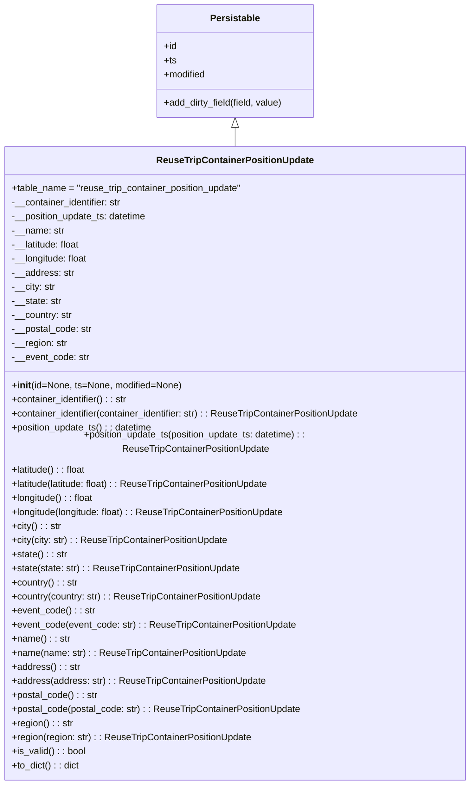

# Diagram: container_tracking_core/container_tracking_service/container_tracking_service/core/datamodel/ReuseTripContainerPositionUpdate.py

> Auto-generated by Obscura crawlers

## Mermaid

### SVG

<svg id="container" width="814.7734375" xmlns="http://www.w3.org/2000/svg" class="classDiagram" height="1314" viewBox="0 0 814.7734375 1314" role="graphics-document document" aria-roledescription="class"><g><defs><marker id="container_class-aggregationStart" class="marker aggregation class" refX="18" refY="7" markerWidth="190" markerHeight="240" orient="auto"><path d="M 18,7 L9,13 L1,7 L9,1 Z"></path></marker></defs><defs><marker id="container_class-aggregationEnd" class="marker aggregation class" refX="1" refY="7" markerWidth="20" markerHeight="28" orient="auto"><path d="M 18,7 L9,13 L1,7 L9,1 Z"></path></marker></defs><defs><marker id="container_class-extensionStart" class="marker extension class" refX="18" refY="7" markerWidth="190" markerHeight="240" orient="auto"><path d="M 1,7 L18,13 V 1 Z"></path></marker></defs><defs><marker id="container_class-extensionEnd" class="marker extension class" refX="1" refY="7" markerWidth="20" markerHeight="28" orient="auto"><path d="M 1,1 V 13 L18,7 Z"></path></marker></defs><defs><marker id="container_class-compositionStart" class="marker composition class" refX="18" refY="7" markerWidth="190" markerHeight="240" orient="auto"><path d="M 18,7 L9,13 L1,7 L9,1 Z"></path></marker></defs><defs><marker id="container_class-compositionEnd" class="marker composition class" refX="1" refY="7" markerWidth="20" markerHeight="28" orient="auto"><path d="M 18,7 L9,13 L1,7 L9,1 Z"></path></marker></defs><defs><marker id="container_class-dependencyStart" class="marker dependency class" refX="6" refY="7" markerWidth="190" markerHeight="240" orient="auto"><path d="M 5,7 L9,13 L1,7 L9,1 Z"></path></marker></defs><defs><marker id="container_class-dependencyEnd" class="marker dependency class" refX="13" refY="7" markerWidth="20" markerHeight="28" orient="auto"><path d="M 18,7 L9,13 L14,7 L9,1 Z"></path></marker></defs><defs><marker id="container_class-lollipopStart" class="marker lollipop class" refX="13" refY="7" markerWidth="190" markerHeight="240" orient="auto"><circle stroke="black" fill="transparent" cx="7" cy="7" r="6"></circle></marker></defs><defs><marker id="container_class-lollipopEnd" class="marker lollipop class" refX="1" refY="7" markerWidth="190" markerHeight="240" orient="auto"><circle stroke="black" fill="transparent" cx="7" cy="7" r="6"></circle></marker></defs><g class="root"><g class="clusters"></g><g class="edgePaths"><path d="M407.387,217.25L407.387,218.542C407.387,219.833,407.387,222.417,407.387,227.875C407.387,233.333,407.387,241.667,407.387,245.833L407.387,250" id="id_Persistable_ReuseTripContainerPositionUpdate_1" class="edge-thickness-normal edge-pattern-solid relation" style=";;;" data-edge="true" data-et="edge" data-id="id_Persistable_ReuseTripContainerPositionUpdate_1" data-points="W3sieCI6NDA3LjM4NjcxODc1LCJ5IjoyMDB9LHsieCI6NDA3LjM4NjcxODc1LCJ5IjoyMjV9LHsieCI6NDA3LjM4NjcxODc1LCJ5IjoyNTB9XQ==" marker-start="url(#container_class-extensionStart)"></path></g><g class="edgeLabels"><g class="edgeLabel"><g class="label" data-id="id_Persistable_ReuseTripContainerPositionUpdate_1" transform="translate(0, 0)"><foreignObject width="0" height="0">

</foreignObject></g></g></g><g class="nodes"><g class="node default" id="classId-Persistable-0" transform="translate(407.38671875, 104)"><g class="basic label-container"><path d="M-135.71484375 -96 L135.71484375 -96 L135.71484375 96 L-135.71484375 96" stroke="none" stroke-width="0" fill="#ECECFF" style=""></path><path d="M-135.71484375 -96 C-34.61441388498015 -96, 66.4860159800397 -96, 135.71484375 -96 M-135.71484375 -96 C-49.97660157910278 -96, 35.761640591794446 -96, 135.71484375 -96 M135.71484375 -96 C135.71484375 -35.320689670746034, 135.71484375 25.35862065850793, 135.71484375 96 M135.71484375 -96 C135.71484375 -57.083024279333095, 135.71484375 -18.16604855866619, 135.71484375 96 M135.71484375 96 C35.33820437321185 96, -65.0384350035763 96, -135.71484375 96 M135.71484375 96 C51.1869151355731 96, -33.341013478853796 96, -135.71484375 96 M-135.71484375 96 C-135.71484375 54.99916588762171, -135.71484375 13.998331775243415, -135.71484375 -96 M-135.71484375 96 C-135.71484375 42.9523961822827, -135.71484375 -10.095207635434605, -135.71484375 -96" stroke="#9370DB" stroke-width="1.3" fill="none" stroke-dasharray="0 0" style=""></path></g><g class="annotation-group text" transform="translate(0, -72)"></g><g class="label-group text" transform="translate(-40.9765625, -72)"><g class="label" style="font-weight: bolder" transform="translate(0,-12)"><foreignObject width="81.953125" height="24">

Persistable

</foreignObject></g></g><g class="members-group text" transform="translate(-123.71484375, -24)"><g class="label" style="" transform="translate(0,-12)"><foreignObject width="22.078125" height="24">

+id

</foreignObject></g><g class="label" style="" transform="translate(0,12)"><foreignObject width="21.15625" height="24">

+ts

</foreignObject></g><g class="label" style="" transform="translate(0,36)"><foreignObject width="72.609375" height="24">

+modified

</foreignObject></g></g><g class="methods-group text" transform="translate(-123.71484375, 72)"><g class="label" style="" transform="translate(0,-12)"><foreignObject width="206.453125" height="24">

+add_dirty_field(field, value)

</foreignObject></g></g><g class="divider" style=""><path d="M-135.71484375 -48 C-71.16689307051361 -48, -6.618942391027218 -48, 135.71484375 -48 M-135.71484375 -48 C-53.71026367669941 -48, 28.294316396601175 -48, 135.71484375 -48" stroke="#9370DB" stroke-width="1.3" fill="none" stroke-dasharray="0 0" style=""></path></g><g class="divider" style=""><path d="M-135.71484375 48 C-54.65893884929747 48, 26.39696605140506 48, 135.71484375 48 M-135.71484375 48 C-46.07737989446987 48, 43.56008396106026 48, 135.71484375 48" stroke="#9370DB" stroke-width="1.3" fill="none" stroke-dasharray="0 0" style=""></path></g></g><g class="node default" id="classId-ReuseTripContainerPositionUpdate-1" transform="translate(407.38671875, 778)"><g class="basic label-container"><path d="M-399.38671875 -528 L399.38671875 -528 L399.38671875 528 L-399.38671875 528" stroke="none" stroke-width="0" fill="#ECECFF" style=""></path><path d="M-399.38671875 -528 C-189.99208133609034 -528, 19.402556077819327 -528, 399.38671875 -528 M-399.38671875 -528 C-102.79550535443343 -528, 193.79570804113314 -528, 399.38671875 -528 M399.38671875 -528 C399.38671875 -268.44124834014815, 399.38671875 -8.882496680296299, 399.38671875 528 M399.38671875 -528 C399.38671875 -275.39643399034856, 399.38671875 -22.792867980697054, 399.38671875 528 M399.38671875 528 C168.59738721950902 528, -62.19194431098197 528, -399.38671875 528 M399.38671875 528 C84.84151181951779 528, -229.70369511096442 528, -399.38671875 528 M-399.38671875 528 C-399.38671875 138.38305740572395, -399.38671875 -251.2338851885521, -399.38671875 -528 M-399.38671875 528 C-399.38671875 131.26821701468805, -399.38671875 -265.4635659706239, -399.38671875 -528" stroke="#9370DB" stroke-width="1.3" fill="none" stroke-dasharray="0 0" style=""></path></g><g class="annotation-group text" transform="translate(0, -504)"></g><g class="label-group text" transform="translate(-128.5234375, -504)"><g class="label" style="font-weight: bolder" transform="translate(0,-12)"><foreignObject width="257.046875" height="24">

ReuseTripContainerPositionUpdate

</foreignObject></g></g><g class="members-group text" transform="translate(-387.38671875, -456)"><g class="label" style="" transform="translate(0,-12)"><foreignObject width="399.390625" height="24">

+table_name = "reuse_trip_container_position_update"

</foreignObject></g><g class="label" style="" transform="translate(0,12)"><foreignObject width="191.796875" height="24">

-__container_identifier: str

</foreignObject></g><g class="label" style="" transform="translate(0,36)"><foreignObject width="235.09375" height="24">

-__position_update_ts: datetime

</foreignObject></g><g class="label" style="" transform="translate(0,60)"><foreignObject width="89.671875" height="24">

-__name: str

</foreignObject></g><g class="label" style="" transform="translate(0,84)"><foreignObject width="119.609375" height="24">

-__latitude: float

</foreignObject></g><g class="label" style="" transform="translate(0,108)"><foreignObject width="132.171875" height="24">

-__longitude: float

</foreignObject></g><g class="label" style="" transform="translate(0,132)"><foreignObject width="105.875" height="24">

-__address: str

</foreignObject></g><g class="label" style="" transform="translate(0,156)"><foreignObject width="74.625" height="24">

-__city: str

</foreignObject></g><g class="label" style="" transform="translate(0,180)"><foreignObject width="85.25" height="24">

-__state: str

</foreignObject></g><g class="label" style="" transform="translate(0,204)"><foreignObject width="104.09375" height="24">

-__country: str

</foreignObject></g><g class="label" style="" transform="translate(0,228)"><foreignObject width="137.34375" height="24">

-__postal_code: str

</foreignObject></g><g class="label" style="" transform="translate(0,252)"><foreignObject width="95.125" height="24">

-__region: str

</foreignObject></g><g class="label" style="" transform="translate(0,276)"><foreignObject width="132.140625" height="24">

-__event_code: str

</foreignObject></g></g><g class="methods-group text" transform="translate(-387.38671875, -120)"><g class="label" style="" transform="translate(0,-12)"><foreignObject width="289.6875" height="24">

+<strong>init</strong>(id=None, ts=None, modified=None)

</foreignObject></g><g class="label" style="" transform="translate(0,12)"><foreignObject width="200.984375" height="24">

+container_identifier() : : str

</foreignObject></g><g class="label" style="" transform="translate(0,36)"><foreignObject width="605.96875" height="24">

+container_identifier(container_identifier: str) : : ReuseTripContainerPositionUpdate

</foreignObject></g><g class="label" style="" transform="translate(0,60)"><foreignObject width="244.125" height="24">

+position_update_ts() : : datetime

</foreignObject></g><g class="label" style="" transform="translate(0,84)"><foreignObject width="646.25" height="24">

+position_update_ts(position_update_ts: datetime) : : ReuseTripContainerPositionUpdate

</foreignObject></g><g class="label" style="" transform="translate(0,108)"><foreignObject width="128.796875" height="24">

+latitude() : : float

</foreignObject></g><g class="label" style="" transform="translate(0,132)"><foreignObject width="447.78125" height="24">

+latitude(latitude: float) : : ReuseTripContainerPositionUpdate

</foreignObject></g><g class="label" style="" transform="translate(0,156)"><foreignObject width="141.359375" height="24">

+longitude() : : float

</foreignObject></g><g class="label" style="" transform="translate(0,180)"><foreignObject width="472.90625" height="24">

+longitude(longitude: float) : : ReuseTripContainerPositionUpdate

</foreignObject></g><g class="label" style="" transform="translate(0,204)"><foreignObject width="83.90625" height="24">

+city() : : str

</foreignObject></g><g class="label" style="" transform="translate(0,228)"><foreignObject width="371.71875" height="24">

+city(city: str) : : ReuseTripContainerPositionUpdate

</foreignObject></g><g class="label" style="" transform="translate(0,252)"><foreignObject width="94.28125" height="24">

+state() : : str

</foreignObject></g><g class="label" style="" transform="translate(0,276)"><foreignObject width="392.390625" height="24">

+state(state: str) : : ReuseTripContainerPositionUpdate

</foreignObject></g><g class="label" style="" transform="translate(0,300)"><foreignObject width="113.375" height="24">

+country() : : str

</foreignObject></g><g class="label" style="" transform="translate(0,324)"><foreignObject width="430.625" height="24">

+country(country: str) : : ReuseTripContainerPositionUpdate

</foreignObject></g><g class="label" style="" transform="translate(0,348)"><foreignObject width="141.484375" height="24">

+event_code() : : str

</foreignObject></g><g class="label" style="" transform="translate(0,372)"><foreignObject width="486.796875" height="24">

+event_code(event_code: str) : : ReuseTripContainerPositionUpdate

</foreignObject></g><g class="label" style="" transform="translate(0,396)"><foreignObject width="98.703125" height="24">

+name() : : str

</foreignObject></g><g class="label" style="" transform="translate(0,420)"><foreignObject width="401.21875" height="24">

+name(name: str) : : ReuseTripContainerPositionUpdate

</foreignObject></g><g class="label" style="" transform="translate(0,444)"><foreignObject width="114.984375" height="24">

+address() : : str

</foreignObject></g><g class="label" style="" transform="translate(0,468)"><foreignObject width="434.046875" height="24">

+address(address: str) : : ReuseTripContainerPositionUpdate

</foreignObject></g><g class="label" style="" transform="translate(0,492)"><foreignObject width="146.359375" height="24">

+postal_code() : : str

</foreignObject></g><g class="label" style="" transform="translate(0,516)"><foreignObject width="496.546875" height="24">

+postal_code(postal_code: str) : : ReuseTripContainerPositionUpdate

</foreignObject></g><g class="label" style="" transform="translate(0,540)"><foreignObject width="104.15625" height="24">

+region() : : str

</foreignObject></g><g class="label" style="" transform="translate(0,564)"><foreignObject width="412.140625" height="24">

+region(region: str) : : ReuseTripContainerPositionUpdate

</foreignObject></g><g class="label" style="" transform="translate(0,588)"><foreignObject width="126.078125" height="24">

+is_valid() : : bool

</foreignObject></g><g class="label" style="" transform="translate(0,612)"><foreignObject width="116.25" height="24">

+to_dict() : : dict

</foreignObject></g></g><g class="divider" style=""><path d="M-399.38671875 -480 C-111.53233338380318 -480, 176.32205198239365 -480, 399.38671875 -480 M-399.38671875 -480 C-136.210190228866 -480, 126.966338292268 -480, 399.38671875 -480" stroke="#9370DB" stroke-width="1.3" fill="none" stroke-dasharray="0 0" style=""></path></g><g class="divider" style=""><path d="M-399.38671875 -144 C-132.7499514616395 -144, 133.88681582672098 -144, 399.38671875 -144 M-399.38671875 -144 C-218.8134363529608 -144, -38.240153955921585 -144, 399.38671875 -144" stroke="#9370DB" stroke-width="1.3" fill="none" stroke-dasharray="0 0" style=""></path></g></g></g></g></g></svg>
