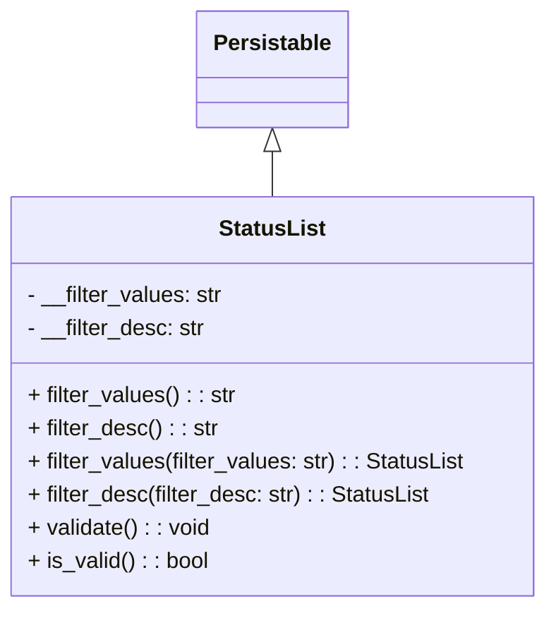

# Diagram: container_tracking_core/container_tracking_service/container_tracking_service/core/datamodel/StatusList.py

> Auto-generated by Obscura crawlers

## Mermaid

### SVG

<svg id="container" width="393.140625" xmlns="http://www.w3.org/2000/svg" class="classDiagram" height="438" viewBox="0 0 393.140625 438" role="graphics-document document" aria-roledescription="class"><g><defs><marker id="container_class-aggregationStart" class="marker aggregation class" refX="18" refY="7" markerWidth="190" markerHeight="240" orient="auto"><path d="M 18,7 L9,13 L1,7 L9,1 Z"></path></marker></defs><defs><marker id="container_class-aggregationEnd" class="marker aggregation class" refX="1" refY="7" markerWidth="20" markerHeight="28" orient="auto"><path d="M 18,7 L9,13 L1,7 L9,1 Z"></path></marker></defs><defs><marker id="container_class-extensionStart" class="marker extension class" refX="18" refY="7" markerWidth="190" markerHeight="240" orient="auto"><path d="M 1,7 L18,13 V 1 Z"></path></marker></defs><defs><marker id="container_class-extensionEnd" class="marker extension class" refX="1" refY="7" markerWidth="20" markerHeight="28" orient="auto"><path d="M 1,1 V 13 L18,7 Z"></path></marker></defs><defs><marker id="container_class-compositionStart" class="marker composition class" refX="18" refY="7" markerWidth="190" markerHeight="240" orient="auto"><path d="M 18,7 L9,13 L1,7 L9,1 Z"></path></marker></defs><defs><marker id="container_class-compositionEnd" class="marker composition class" refX="1" refY="7" markerWidth="20" markerHeight="28" orient="auto"><path d="M 18,7 L9,13 L1,7 L9,1 Z"></path></marker></defs><defs><marker id="container_class-dependencyStart" class="marker dependency class" refX="6" refY="7" markerWidth="190" markerHeight="240" orient="auto"><path d="M 5,7 L9,13 L1,7 L9,1 Z"></path></marker></defs><defs><marker id="container_class-dependencyEnd" class="marker dependency class" refX="13" refY="7" markerWidth="20" markerHeight="28" orient="auto"><path d="M 18,7 L9,13 L14,7 L9,1 Z"></path></marker></defs><defs><marker id="container_class-lollipopStart" class="marker lollipop class" refX="13" refY="7" markerWidth="190" markerHeight="240" orient="auto"><circle stroke="black" fill="transparent" cx="7" cy="7" r="6"></circle></marker></defs><defs><marker id="container_class-lollipopEnd" class="marker lollipop class" refX="1" refY="7" markerWidth="190" markerHeight="240" orient="auto"><circle stroke="black" fill="transparent" cx="7" cy="7" r="6"></circle></marker></defs><g class="root"><g class="clusters"></g><g class="edgePaths"><path d="M196.57,109.25L196.57,110.542C196.57,111.833,196.57,114.417,196.57,119.875C196.57,125.333,196.57,133.667,196.57,137.833L196.57,142" id="id_Persistable_StatusList_1" class="edge-thickness-normal edge-pattern-solid relation" style=";;;" data-edge="true" data-et="edge" data-id="id_Persistable_StatusList_1" data-points="W3sieCI6MTk2LjU3MDMxMjUsInkiOjkyfSx7IngiOjE5Ni41NzAzMTI1LCJ5IjoxMTd9LHsieCI6MTk2LjU3MDMxMjUsInkiOjE0Mn1d" marker-start="url(#container_class-extensionStart)"></path></g><g class="edgeLabels"><g class="edgeLabel"><g class="label" data-id="id_Persistable_StatusList_1" transform="translate(0, 0)"><foreignObject width="0" height="0">

</foreignObject></g></g></g><g class="nodes"><g class="node default" id="classId-Persistable-0" transform="translate(196.5703125, 50)"><g class="basic label-container"><path d="M-52.9765625 -42 L52.9765625 -42 L52.9765625 42 L-52.9765625 42" stroke="none" stroke-width="0" fill="#ECECFF" style=""></path><path d="M-52.9765625 -42 C-17.200609329544108 -42, 18.575343840911785 -42, 52.9765625 -42 M-52.9765625 -42 C-22.83411625176124 -42, 7.308329996477518 -42, 52.9765625 -42 M52.9765625 -42 C52.9765625 -24.145346320407224, 52.9765625 -6.290692640814449, 52.9765625 42 M52.9765625 -42 C52.9765625 -9.677497178131688, 52.9765625 22.645005643736624, 52.9765625 42 M52.9765625 42 C11.659925267924095 42, -29.65671196415181 42, -52.9765625 42 M52.9765625 42 C31.1410875312085 42, 9.305612562416997 42, -52.9765625 42 M-52.9765625 42 C-52.9765625 21.848722589029443, -52.9765625 1.697445178058885, -52.9765625 -42 M-52.9765625 42 C-52.9765625 8.935750521409126, -52.9765625 -24.128498957181748, -52.9765625 -42" stroke="#9370DB" stroke-width="1.3" fill="none" stroke-dasharray="0 0" style=""></path></g><g class="annotation-group text" transform="translate(0, -18)"></g><g class="label-group text" transform="translate(-40.9765625, -18)"><g class="label" style="font-weight: bolder" transform="translate(0,-12)"><foreignObject width="81.953125" height="24">

Persistable

</foreignObject></g></g><g class="members-group text" transform="translate(-40.9765625, 30)"></g><g class="methods-group text" transform="translate(-40.9765625, 60)"></g><g class="divider" style=""><path d="M-52.9765625 6 C-20.954219269369787 6, 11.068123961260426 6, 52.9765625 6 M-52.9765625 6 C-16.21941992152334 6, 20.53772265695332 6, 52.9765625 6" stroke="#9370DB" stroke-width="1.3" fill="none" stroke-dasharray="0 0" style=""></path></g><g class="divider" style=""><path d="M-52.9765625 24 C-20.953359595791063 24, 11.069843308417873 24, 52.9765625 24 M-52.9765625 24 C-23.397166765127544 24, 6.182228969744912 24, 52.9765625 24" stroke="#9370DB" stroke-width="1.3" fill="none" stroke-dasharray="0 0" style=""></path></g></g><g class="node default" id="classId-StatusList-1" transform="translate(196.5703125, 286)"><g class="basic label-container"><path d="M-188.5703125 -144 L188.5703125 -144 L188.5703125 144 L-188.5703125 144" stroke="none" stroke-width="0" fill="#ECECFF" style=""></path><path d="M-188.5703125 -144 C-104.4904144145695 -144, -20.410516329139 -144, 188.5703125 -144 M-188.5703125 -144 C-65.61596343796234 -144, 57.33838562407533 -144, 188.5703125 -144 M188.5703125 -144 C188.5703125 -77.17551313562512, 188.5703125 -10.351026271250248, 188.5703125 144 M188.5703125 -144 C188.5703125 -78.95559751862861, 188.5703125 -13.911195037257215, 188.5703125 144 M188.5703125 144 C38.86230288118736 144, -110.84570673762528 144, -188.5703125 144 M188.5703125 144 C71.86809642438611 144, -44.83411965122778 144, -188.5703125 144 M-188.5703125 144 C-188.5703125 82.35719988120519, -188.5703125 20.71439976241038, -188.5703125 -144 M-188.5703125 144 C-188.5703125 72.51332262776437, -188.5703125 1.0266452555287344, -188.5703125 -144" stroke="#9370DB" stroke-width="1.3" fill="none" stroke-dasharray="0 0" style=""></path></g><g class="annotation-group text" transform="translate(0, -120)"></g><g class="label-group text" transform="translate(-36.796875, -120)"><g class="label" style="font-weight: bolder" transform="translate(0,-12)"><foreignObject width="73.59375" height="24">

StatusList

</foreignObject></g></g><g class="members-group text" transform="translate(-176.5703125, -72)"><g class="label" style="" transform="translate(0,-12)"><foreignObject width="141.59375" height="24">

- __filter_values: str

</foreignObject></g><g class="label" style="" transform="translate(0,12)"><foreignObject width="128.875" height="24">

- __filter_desc: str

</foreignObject></g></g><g class="methods-group text" transform="translate(-176.5703125, 0)"><g class="label" style="" transform="translate(0,-12)"><foreignObject width="149.65625" height="24">

+ filter_values() : : str

</foreignObject></g><g class="label" style="" transform="translate(0,12)"><foreignObject width="136.875" height="24">

+ filter_desc() : : str

</foreignObject></g><g class="label" style="" transform="translate(0,36)"><foreignObject width="316.34375" height="24">

+ filter_values(filter_values: str) : : StatusList

</foreignObject></g><g class="label" style="" transform="translate(0,60)"><foreignObject width="290.84375" height="24">

+ filter_desc(filter_desc: str) : : StatusList

</foreignObject></g><g class="label" style="" transform="translate(0,84)"><foreignObject width="132.125" height="24">

+ validate() : : void

</foreignObject></g><g class="label" style="" transform="translate(0,108)"><foreignObject width="130.3125" height="24">

+ is_valid() : : bool

</foreignObject></g></g><g class="divider" style=""><path d="M-188.5703125 -96 C-42.5644326012158 -96, 103.4414472975684 -96, 188.5703125 -96 M-188.5703125 -96 C-38.62105579756542 -96, 111.32820090486916 -96, 188.5703125 -96" stroke="#9370DB" stroke-width="1.3" fill="none" stroke-dasharray="0 0" style=""></path></g><g class="divider" style=""><path d="M-188.5703125 -24 C-40.30234506953374 -24, 107.96562236093251 -24, 188.5703125 -24 M-188.5703125 -24 C-76.94200930223063 -24, 34.68629389553874 -24, 188.5703125 -24" stroke="#9370DB" stroke-width="1.3" fill="none" stroke-dasharray="0 0" style=""></path></g></g></g></g></g></svg>
