# Diagram: container_tracking_core/container_tracking_service/container_tracking_service/core/datamodel/TripLeg.py

> Auto-generated by Obscura crawlers

## Mermaid

```mermaid
classDiagram
    class Persistable {
        +id: str
        +ts: datetime
        +modified: datetime
        +add_dirty_field(field: str, value: any)
    }
    class TripLeg {
        -__solution_id: str
        -__status: str
        -__owner_organization_fv_id: str
        -__carrier_org_fv_id: str
        -__creator_shipment_id: str
        -__destination_location_code: str
        -__origin_location_code: str
        -__bill_of_lading: str
        -__trailer_equipment_number: str
        -__mode_of_transport: str
        -__scheduled_destination_delivery_window: datetime|list
        -__scheduled_origin_pickup_window: datetime|list
        -__origin_location_details: dict|str
        -__destination_location_details: dict|str
        -__llp_number: str
        -__consolidator_id: str
        -__shipment_number: str
        -__mode: str
        -__type: str
        -__delivery_type: str
        -__sequence_number: int
        -__carrier_scac: str
        -__actor_id: str
        -__load_code: str
        -__route_id: str
        -__parent_creator_shipment_id: str
        +solution_id(): str
        +status(): str
        +actor_id(): str
        +owner_organization_fv_id(): str
        +carrier_organization_fv_id(): str
        +creator_shipment_id(): str
        +destination_location_code(): str
        +origin_location_code(): str
        +bill_of_lading(): str
        +trailer_equipment_number(): str
        +mode_of_transport(): str
        +scheduled_destination_delivery_window(): datetime|list
        +scheduled_origin_pickup_window(): datetime|list
        +origin_location_details(): dict|str
        +destination_location_details(): dict|str
        +llp_number(): str
        +consolidator_id(): str
        +shipment_number(): str
        +mode(): str
        +type(): str
        +delivery_type(): str
        +sequence_number(): int
        +carrier_scac(): str
        +load_code(): str
        +route_id(): str
        +parent_creator_shipment_id(): str
        +solution_id(solution_id: str): TripLeg
        +status(status: str): TripLeg
        +owner_organization_fv_id(owner_organization_fv_id: str): TripLeg
        +carrier_organization_fv_id(carrier_org_fv_id: str): TripLeg
        +creator_shipment_id(creator_shipment_id: str): TripLeg
        +destination_location_code(destination_location_code: str): TripLeg
        +origin_location_code(origin_location_code: str): TripLeg
        +bill_of_lading(bill_of_lading: str): TripLeg
        +trailer_equipment_number(trailer_equipment_number: str): TripLeg
        +mode_of_transport(mode_of_transport: str): TripLeg
        +scheduled_destination_delivery_window(scheduled_destination_delivery_window: datetime|list): TripLeg
        +scheduled_origin_pickup_window(scheduled_origin_pickup_window: datetime|list): TripLeg
        +origin_location_details(origin_location_details: dict|str): TripLeg
        +destination_location_details(destination_location_details: dict|str): TripLeg
        +llp_number(llp_number: str): TripLeg
        +consolidator_id(consolidator_id: str): TripLeg
        +shipment_number(shipment_number: str): TripLeg
        +mode(mode: str): TripLeg
        +type(type: str): TripLeg
        +delivery_type(delivery_type: str): TripLeg
        +sequence_number(sequence_number: int): TripLeg
        +carrier_scac(carrier_scac: str): TripLeg
        +actor_id(actor_id: str): TripLeg
        +load_code(load_code: str): TripLeg
        +route_id(route_id: str): TripLeg
        +parent_creator_shipment_id(parent_creator_shipment_id: str): TripLeg
        +is_valid(): bool
    }
    Persistable <|-- TripLeg
```

### SVG

<svg id="container" width="851.6015625" xmlns="http://www.w3.org/2000/svg" class="classDiagram" height="2250" viewBox="0 0 851.6015625 2250" role="graphics-document document" aria-roledescription="class"><g><defs><marker id="container_class-aggregationStart" class="marker aggregation class" refX="18" refY="7" markerWidth="190" markerHeight="240" orient="auto"><path d="M 18,7 L9,13 L1,7 L9,1 Z"></path></marker></defs><defs><marker id="container_class-aggregationEnd" class="marker aggregation class" refX="1" refY="7" markerWidth="20" markerHeight="28" orient="auto"><path d="M 18,7 L9,13 L1,7 L9,1 Z"></path></marker></defs><defs><marker id="container_class-extensionStart" class="marker extension class" refX="18" refY="7" markerWidth="190" markerHeight="240" orient="auto"><path d="M 1,7 L18,13 V 1 Z"></path></marker></defs><defs><marker id="container_class-extensionEnd" class="marker extension class" refX="1" refY="7" markerWidth="20" markerHeight="28" orient="auto"><path d="M 1,1 V 13 L18,7 Z"></path></marker></defs><defs><marker id="container_class-compositionStart" class="marker composition class" refX="18" refY="7" markerWidth="190" markerHeight="240" orient="auto"><path d="M 18,7 L9,13 L1,7 L9,1 Z"></path></marker></defs><defs><marker id="container_class-compositionEnd" class="marker composition class" refX="1" refY="7" markerWidth="20" markerHeight="28" orient="auto"><path d="M 18,7 L9,13 L1,7 L9,1 Z"></path></marker></defs><defs><marker id="container_class-dependencyStart" class="marker dependency class" refX="6" refY="7" markerWidth="190" markerHeight="240" orient="auto"><path d="M 5,7 L9,13 L1,7 L9,1 Z"></path></marker></defs><defs><marker id="container_class-dependencyEnd" class="marker dependency class" refX="13" refY="7" markerWidth="20" markerHeight="28" orient="auto"><path d="M 18,7 L9,13 L14,7 L9,1 Z"></path></marker></defs><defs><marker id="container_class-lollipopStart" class="marker lollipop class" refX="13" refY="7" markerWidth="190" markerHeight="240" orient="auto"><circle stroke="black" fill="transparent" cx="7" cy="7" r="6"></circle></marker></defs><defs><marker id="container_class-lollipopEnd" class="marker lollipop class" refX="1" refY="7" markerWidth="190" markerHeight="240" orient="auto"><circle stroke="black" fill="transparent" cx="7" cy="7" r="6"></circle></marker></defs><g class="root"><g class="clusters"></g><g class="edgePaths"><path d="M425.801,217.25L425.801,218.542C425.801,219.833,425.801,222.417,425.801,227.875C425.801,233.333,425.801,241.667,425.801,245.833L425.801,250" id="id_Persistable_TripLeg_1" class="edge-thickness-normal edge-pattern-solid relation" style=";;;" data-edge="true" data-et="edge" data-id="id_Persistable_TripLeg_1" data-points="W3sieCI6NDI1LjgwMDc4MTI1LCJ5IjoyMDB9LHsieCI6NDI1LjgwMDc4MTI1LCJ5IjoyMjV9LHsieCI6NDI1LjgwMDc4MTI1LCJ5IjoyNTB9XQ==" marker-start="url(#container_class-extensionStart)"></path></g><g class="edgeLabels"><g class="edgeLabel"><g class="label" data-id="id_Persistable_TripLeg_1" transform="translate(0, 0)"><foreignObject width="0" height="0">

</foreignObject></g></g></g><g class="nodes"><g class="node default" id="classId-Persistable-0" transform="translate(425.80078125, 104)"><g class="basic label-container"><path d="M-165.78515625 -96 L165.78515625 -96 L165.78515625 96 L-165.78515625 96" stroke="none" stroke-width="0" fill="#ECECFF" style=""></path><path d="M-165.78515625 -96 C-87.56206341246643 -96, -9.338970574932858 -96, 165.78515625 -96 M-165.78515625 -96 C-69.02620834715309 -96, 27.732739555693826 -96, 165.78515625 -96 M165.78515625 -96 C165.78515625 -55.97220764482705, 165.78515625 -15.944415289654103, 165.78515625 96 M165.78515625 -96 C165.78515625 -51.3586542567445, 165.78515625 -6.717308513489002, 165.78515625 96 M165.78515625 96 C55.59556224051086 96, -54.59403176897828 96, -165.78515625 96 M165.78515625 96 C60.22777631619003 96, -45.32960361761994 96, -165.78515625 96 M-165.78515625 96 C-165.78515625 19.627347049036985, -165.78515625 -56.74530590192603, -165.78515625 -96 M-165.78515625 96 C-165.78515625 31.20259985983381, -165.78515625 -33.59480028033238, -165.78515625 -96" stroke="#9370DB" stroke-width="1.3" fill="none" stroke-dasharray="0 0" style=""></path></g><g class="annotation-group text" transform="translate(0, -72)"></g><g class="label-group text" transform="translate(-40.9765625, -72)"><g class="label" style="font-weight: bolder" transform="translate(0,-12)"><foreignObject width="81.953125" height="24">

Persistable

</foreignObject></g></g><g class="members-group text" transform="translate(-153.78515625, -24)"><g class="label" style="" transform="translate(0,-12)"><foreignObject width="49.578125" height="24">

+id: str

</foreignObject></g><g class="label" style="" transform="translate(0,12)"><foreignObject width="94.484375" height="24">

+ts: datetime

</foreignObject></g><g class="label" style="" transform="translate(0,36)"><foreignObject width="145.9375" height="24">

+modified: datetime

</foreignObject></g></g><g class="methods-group text" transform="translate(-153.78515625, 72)"><g class="label" style="" transform="translate(0,-12)"><foreignObject width="266.59375" height="24">

+add_dirty_field(field: str, value: any)

</foreignObject></g></g><g class="divider" style=""><path d="M-165.78515625 -48 C-50.49358837687413 -48, 64.79797949625174 -48, 165.78515625 -48 M-165.78515625 -48 C-66.70531167825575 -48, 32.37453289348849 -48, 165.78515625 -48" stroke="#9370DB" stroke-width="1.3" fill="none" stroke-dasharray="0 0" style=""></path></g><g class="divider" style=""><path d="M-165.78515625 48 C-82.44696744836342 48, 0.8912213532731528 48, 165.78515625 48 M-165.78515625 48 C-77.49445149535075 48, 10.79625325929851 48, 165.78515625 48" stroke="#9370DB" stroke-width="1.3" fill="none" stroke-dasharray="0 0" style=""></path></g></g><g class="node default" id="classId-TripLeg-1" transform="translate(425.80078125, 1246)"><g class="basic label-container"><path d="M-417.80078125 -996 L417.80078125 -996 L417.80078125 996 L-417.80078125 996" stroke="none" stroke-width="0" fill="#ECECFF" style=""></path><path d="M-417.80078125 -996 C-107.12828581839398 -996, 203.54420961321205 -996, 417.80078125 -996 M-417.80078125 -996 C-136.67901891263136 -996, 144.44274342473727 -996, 417.80078125 -996 M417.80078125 -996 C417.80078125 -278.47443644113173, 417.80078125 439.05112711773654, 417.80078125 996 M417.80078125 -996 C417.80078125 -470.09267903211617, 417.80078125 55.81464193576767, 417.80078125 996 M417.80078125 996 C183.5311215011799 996, -50.73853824764018 996, -417.80078125 996 M417.80078125 996 C185.48781199968028 996, -46.82515725063945 996, -417.80078125 996 M-417.80078125 996 C-417.80078125 364.1998786631675, -417.80078125 -267.600242673665, -417.80078125 -996 M-417.80078125 996 C-417.80078125 539.2522066473732, -417.80078125 82.50441329474631, -417.80078125 -996" stroke="#9370DB" stroke-width="1.3" fill="none" stroke-dasharray="0 0" style=""></path></g><g class="annotation-group text" transform="translate(0, -972)"></g><g class="label-group text" transform="translate(-27.0546875, -972)"><g class="label" style="font-weight: bolder" transform="translate(0,-12)"><foreignObject width="54.109375" height="24">

TripLeg

</foreignObject></g></g><g class="members-group text" transform="translate(-405.80078125, -924)"><g class="label" style="" transform="translate(0,-12)"><foreignObject width="131.390625" height="24">

-__solution_id: str

</foreignObject></g><g class="label" style="" transform="translate(0,12)"><foreignObject width="93.5625" height="24">

-__status: str

</foreignObject></g><g class="label" style="" transform="translate(0,36)"><foreignObject width="234.15625" height="24">

-__owner_organization_fv_id: str

</foreignObject></g><g class="label" style="" transform="translate(0,60)"><foreignObject width="170.328125" height="24">

-__carrier_org_fv_id: str

</foreignObject></g><g class="label" style="" transform="translate(0,84)"><foreignObject width="198.390625" height="24">

-__creator_shipment_id: str

</foreignObject></g><g class="label" style="" transform="translate(0,108)"><foreignObject width="242.25" height="24">

-__destination_location_code: str

</foreignObject></g><g class="label" style="" transform="translate(0,132)"><foreignObject width="201.359375" height="24">

-__origin_location_code: str

</foreignObject></g><g class="label" style="" transform="translate(0,156)"><foreignObject width="148.03125" height="24">

-__bill_of_lading: str

</foreignObject></g><g class="label" style="" transform="translate(0,180)"><foreignObject width="244.15625" height="24">

-__trailer_equipment_number: str

</foreignObject></g><g class="label" style="" transform="translate(0,204)"><foreignObject width="188.21875" height="24">

-__mode_of_transport: str

</foreignObject></g><g class="label" style="" transform="translate(0,228)"><foreignObject width="419.40625" height="24">

-__scheduled_destination_delivery_window: datetime|list

</foreignObject></g><g class="label" style="" transform="translate(0,252)"><foreignObject width="369.484375" height="24">

-__scheduled_origin_pickup_window: datetime|list

</foreignObject></g><g class="label" style="" transform="translate(0,276)"><foreignObject width="249.671875" height="24">

-__origin_location_details: dict|str

</foreignObject></g><g class="label" style="" transform="translate(0,300)"><foreignObject width="290.5625" height="24">

-__destination_location_details: dict|str

</foreignObject></g><g class="label" style="" transform="translate(0,324)"><foreignObject width="132.84375" height="24">

-__llp_number: str

</foreignObject></g><g class="label" style="" transform="translate(0,348)"><foreignObject width="161.359375" height="24">

-__consolidator_id: str

</foreignObject></g><g class="label" style="" transform="translate(0,372)"><foreignObject width="182.890625" height="24">

-__shipment_number: str

</foreignObject></g><g class="label" style="" transform="translate(0,396)"><foreignObject width="90.5" height="24">

-__mode: str

</foreignObject></g><g class="label" style="" transform="translate(0,420)"><foreignObject width="80.625" height="24">

-__type: str

</foreignObject></g><g class="label" style="" transform="translate(0,444)"><foreignObject width="146.21875" height="24">

-__delivery_type: str

</foreignObject></g><g class="label" style="" transform="translate(0,468)"><foreignObject width="183.578125" height="24">

-__sequence_number: int

</foreignObject></g><g class="label" style="" transform="translate(0,492)"><foreignObject width="135.203125" height="24">

-__carrier_scac: str

</foreignObject></g><g class="label" style="" transform="translate(0,516)"><foreignObject width="107.375" height="24">

-__actor_id: str

</foreignObject></g><g class="label" style="" transform="translate(0,540)"><foreignObject width="124.03125" height="24">

-__load_code: str

</foreignObject></g><g class="label" style="" transform="translate(0,564)"><foreignObject width="109.84375" height="24">

-__route_id: str

</foreignObject></g><g class="label" style="" transform="translate(0,588)"><foreignObject width="254.328125" height="24">

-__parent_creator_shipment_id: str

</foreignObject></g></g><g class="methods-group text" transform="translate(-405.80078125, -276)"><g class="label" style="" transform="translate(0,-12)"><foreignObject width="140.40625" height="24">

+solution_id() : : str

</foreignObject></g><g class="label" style="" transform="translate(0,12)"><foreignObject width="102.578125" height="24">

+status() : : str

</foreignObject></g><g class="label" style="" transform="translate(0,36)"><foreignObject width="116.46875" height="24">

+actor_id() : : str

</foreignObject></g><g class="label" style="" transform="translate(0,60)"><foreignObject width="243.5" height="24">

+owner_organization_fv_id() : : str

</foreignObject></g><g class="label" style="" transform="translate(0,84)"><foreignObject width="246.359375" height="24">

+carrier_organization_fv_id() : : str

</foreignObject></g><g class="label" style="" transform="translate(0,108)"><foreignObject width="207.734375" height="24">

+creator_shipment_id() : : str

</foreignObject></g><g class="label" style="" transform="translate(0,132)"><foreignObject width="251.59375" height="24">

+destination_location_code() : : str

</foreignObject></g><g class="label" style="" transform="translate(0,156)"><foreignObject width="210.703125" height="24">

+origin_location_code() : : str

</foreignObject></g><g class="label" style="" transform="translate(0,180)"><foreignObject width="157.046875" height="24">

+bill_of_lading() : : str

</foreignObject></g><g class="label" style="" transform="translate(0,204)"><foreignObject width="253.25" height="24">

+trailer_equipment_number() : : str

</foreignObject></g><g class="label" style="" transform="translate(0,228)"><foreignObject width="197.171875" height="24">

+mode_of_transport() : : str

</foreignObject></g><g class="label" style="" transform="translate(0,252)"><foreignObject width="428.359375" height="24">

+scheduled_destination_delivery_window() : : datetime|list

</foreignObject></g><g class="label" style="" transform="translate(0,276)"><foreignObject width="378.4375" height="24">

+scheduled_origin_pickup_window() : : datetime|list

</foreignObject></g><g class="label" style="" transform="translate(0,300)"><foreignObject width="259.015625" height="24">

+origin_location_details() : : dict|str

</foreignObject></g><g class="label" style="" transform="translate(0,324)"><foreignObject width="299.90625" height="24">

+destination_location_details() : : dict|str

</foreignObject></g><g class="label" style="" transform="translate(0,348)"><foreignObject width="141.859375" height="24">

+llp_number() : : str

</foreignObject></g><g class="label" style="" transform="translate(0,372)"><foreignObject width="170.703125" height="24">

+consolidator_id() : : str

</foreignObject></g><g class="label" style="" transform="translate(0,396)"><foreignObject width="191.75" height="24">

+shipment_number() : : str

</foreignObject></g><g class="label" style="" transform="translate(0,420)"><foreignObject width="99.53125" height="24">

+mode() : : str

</foreignObject></g><g class="label" style="" transform="translate(0,444)"><foreignObject width="89.890625" height="24">

+type() : : str

</foreignObject></g><g class="label" style="" transform="translate(0,468)"><foreignObject width="155.5625" height="24">

+delivery_type() : : str

</foreignObject></g><g class="label" style="" transform="translate(0,492)"><foreignObject width="192.4375" height="24">

+sequence_number() : : int

</foreignObject></g><g class="label" style="" transform="translate(0,516)"><foreignObject width="144.484375" height="24">

+carrier_scac() : : str

</foreignObject></g><g class="label" style="" transform="translate(0,540)"><foreignObject width="133.203125" height="24">

+load_code() : : str

</foreignObject></g><g class="label" style="" transform="translate(0,564)"><foreignObject width="118.875" height="24">

+route_id() : : str

</foreignObject></g><g class="label" style="" transform="translate(0,588)"><foreignObject width="263.359375" height="24">

+parent_creator_shipment_id() : : str

</foreignObject></g><g class="label" style="" transform="translate(0,612)"><foreignObject width="283.296875" height="24">

+solution_id(solution_id: str) : : TripLeg

</foreignObject></g><g class="label" style="" transform="translate(0,636)"><foreignObject width="207.65625" height="24">

+status(status: str) : : TripLeg

</foreignObject></g><g class="label" style="" transform="translate(0,660)"><foreignObject width="489.484375" height="24">

+owner_organization_fv_id(owner_organization_fv_id: str) : : TripLeg

</foreignObject></g><g class="label" style="" transform="translate(0,684)"><foreignObject width="428.515625" height="24">

+carrier_organization_fv_id(carrier_org_fv_id: str) : : TripLeg

</foreignObject></g><g class="label" style="" transform="translate(0,708)"><foreignObject width="417.953125" height="24">

+creator_shipment_id(creator_shipment_id: str) : : TripLeg

</foreignObject></g><g class="label" style="" transform="translate(0,732)"><foreignObject width="505.671875" height="24">

+destination_location_code(destination_location_code: str) : : TripLeg

</foreignObject></g><g class="label" style="" transform="translate(0,756)"><foreignObject width="423.875" height="24">

+origin_location_code(origin_location_code: str) : : TripLeg

</foreignObject></g><g class="label" style="" transform="translate(0,780)"><foreignObject width="316.578125" height="24">

+bill_of_lading(bill_of_lading: str) : : TripLeg

</foreignObject></g><g class="label" style="" transform="translate(0,804)"><foreignObject width="509.234375" height="24">

+trailer_equipment_number(trailer_equipment_number: str) : : TripLeg

</foreignObject></g><g class="label" style="" transform="translate(0,828)"><foreignObject width="396.90625" height="24">

+mode_of_transport(mode_of_transport: str) : : TripLeg

</foreignObject></g><g class="label" style="" transform="translate(0,852)"><foreignObject width="784.546875" height="24">

+scheduled_destination_delivery_window(scheduled_destination_delivery_window: datetime|list) : : TripLeg

</foreignObject></g><g class="label" style="" transform="translate(0,876)"><foreignObject width="684.71875" height="24">

+scheduled_origin_pickup_window(scheduled_origin_pickup_window: datetime|list) : : TripLeg

</foreignObject></g><g class="label" style="" transform="translate(0,900)"><foreignObject width="486.5625" height="24">

+origin_location_details(origin_location_details: dict|str) : : TripLeg

</foreignObject></g><g class="label" style="" transform="translate(0,924)"><foreignObject width="568.359375" height="24">

+destination_location_details(destination_location_details: dict|str) : : TripLeg

</foreignObject></g><g class="label" style="" transform="translate(0,948)"><foreignObject width="286.375" height="24">

+llp_number(llp_number: str) : : TripLeg

</foreignObject></g><g class="label" style="" transform="translate(0,972)"><foreignObject width="343.875" height="24">

+consolidator_id(consolidator_id: str) : : TripLeg

</foreignObject></g><g class="label" style="" transform="translate(0,996)"><foreignObject width="386.15625" height="24">

+shipment_number(shipment_number: str) : : TripLeg

</foreignObject></g><g class="label" style="" transform="translate(0,1020)"><foreignObject width="201.546875" height="24">

+mode(mode: str) : : TripLeg

</foreignObject></g><g class="label" style="" transform="translate(0,1044)"><foreignObject width="182.359375" height="24">

+type(type: str) : : TripLeg

</foreignObject></g><g class="label" style="" transform="translate(0,1068)"><foreignObject width="313.609375" height="24">

+delivery_type(delivery_type: str) : : TripLeg

</foreignObject></g><g class="label" style="" transform="translate(0,1092)"><foreignObject width="387.28125" height="24">

+sequence_number(sequence_number: int) : : TripLeg

</foreignObject></g><g class="label" style="" transform="translate(0,1116)"><foreignObject width="291.53125" height="24">

+carrier_scac(carrier_scac: str) : : TripLeg

</foreignObject></g><g class="label" style="" transform="translate(0,1140)"><foreignObject width="235.671875" height="24">

+actor_id(actor_id: str) : : TripLeg

</foreignObject></g><g class="label" style="" transform="translate(0,1164)"><foreignObject width="268.90625" height="24">

+load_code(load_code: str) : : TripLeg

</foreignObject></g><g class="label" style="" transform="translate(0,1188)"><foreignObject width="240.234375" height="24">

+route_id(route_id: str) : : TripLeg

</foreignObject></g><g class="label" style="" transform="translate(0,1212)"><foreignObject width="529.1875" height="24">

+parent_creator_shipment_id(parent_creator_shipment_id: str) : : TripLeg

</foreignObject></g><g class="label" style="" transform="translate(0,1236)"><foreignObject width="126.078125" height="24">

+is_valid() : : bool

</foreignObject></g></g><g class="divider" style=""><path d="M-417.80078125 -948 C-193.0115201483104 -948, 31.77774095337918 -948, 417.80078125 -948 M-417.80078125 -948 C-192.7056068341952 -948, 32.38956758160958 -948, 417.80078125 -948" stroke="#9370DB" stroke-width="1.3" fill="none" stroke-dasharray="0 0" style=""></path></g><g class="divider" style=""><path d="M-417.80078125 -300 C-160.3567231226042 -300, 97.08733500479161 -300, 417.80078125 -300 M-417.80078125 -300 C-124.51736703979907 -300, 168.76604717040186 -300, 417.80078125 -300" stroke="#9370DB" stroke-width="1.3" fill="none" stroke-dasharray="0 0" style=""></path></g></g></g></g></g></svg>
