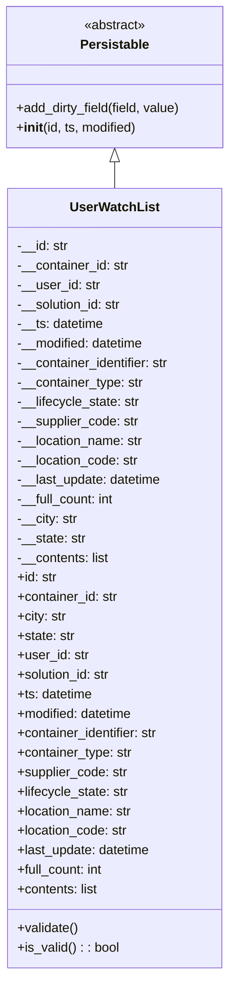

# Diagram: container_tracking_core/container_tracking_service/container_tracking_service/core/datamodel/UserWatchList.py

> Auto-generated by Obscura crawlers

## Mermaid

### SVG

<svg id="container" width="287.4296875" xmlns="http://www.w3.org/2000/svg" class="classDiagram" height="1200" viewBox="0 0 287.4296875 1200" role="graphics-document document" aria-roledescription="class"><g><defs><marker id="container_class-aggregationStart" class="marker aggregation class" refX="18" refY="7" markerWidth="190" markerHeight="240" orient="auto"><path d="M 18,7 L9,13 L1,7 L9,1 Z"></path></marker></defs><defs><marker id="container_class-aggregationEnd" class="marker aggregation class" refX="1" refY="7" markerWidth="20" markerHeight="28" orient="auto"><path d="M 18,7 L9,13 L1,7 L9,1 Z"></path></marker></defs><defs><marker id="container_class-extensionStart" class="marker extension class" refX="18" refY="7" markerWidth="190" markerHeight="240" orient="auto"><path d="M 1,7 L18,13 V 1 Z"></path></marker></defs><defs><marker id="container_class-extensionEnd" class="marker extension class" refX="1" refY="7" markerWidth="20" markerHeight="28" orient="auto"><path d="M 1,1 V 13 L18,7 Z"></path></marker></defs><defs><marker id="container_class-compositionStart" class="marker composition class" refX="18" refY="7" markerWidth="190" markerHeight="240" orient="auto"><path d="M 18,7 L9,13 L1,7 L9,1 Z"></path></marker></defs><defs><marker id="container_class-compositionEnd" class="marker composition class" refX="1" refY="7" markerWidth="20" markerHeight="28" orient="auto"><path d="M 18,7 L9,13 L1,7 L9,1 Z"></path></marker></defs><defs><marker id="container_class-dependencyStart" class="marker dependency class" refX="6" refY="7" markerWidth="190" markerHeight="240" orient="auto"><path d="M 5,7 L9,13 L1,7 L9,1 Z"></path></marker></defs><defs><marker id="container_class-dependencyEnd" class="marker dependency class" refX="13" refY="7" markerWidth="20" markerHeight="28" orient="auto"><path d="M 18,7 L9,13 L14,7 L9,1 Z"></path></marker></defs><defs><marker id="container_class-lollipopStart" class="marker lollipop class" refX="13" refY="7" markerWidth="190" markerHeight="240" orient="auto"><circle stroke="black" fill="transparent" cx="7" cy="7" r="6"></circle></marker></defs><defs><marker id="container_class-lollipopEnd" class="marker lollipop class" refX="1" refY="7" markerWidth="190" markerHeight="240" orient="auto"><circle stroke="black" fill="transparent" cx="7" cy="7" r="6"></circle></marker></defs><g class="root"><g class="clusters"></g><g class="edgePaths"><path d="M143.715,199.25L143.715,200.542C143.715,201.833,143.715,204.417,143.715,209.875C143.715,215.333,143.715,223.667,143.715,227.833L143.715,232" id="id_Persistable_UserWatchList_1" class="edge-thickness-normal edge-pattern-solid relation" style=";;;" data-edge="true" data-et="edge" data-id="id_Persistable_UserWatchList_1" data-points="W3sieCI6MTQzLjcxNDg0Mzc1LCJ5IjoxODJ9LHsieCI6MTQzLjcxNDg0Mzc1LCJ5IjoyMDd9LHsieCI6MTQzLjcxNDg0Mzc1LCJ5IjoyMzJ9XQ==" marker-start="url(#container_class-extensionStart)"></path></g><g class="edgeLabels"><g class="edgeLabel"><g class="label" data-id="id_Persistable_UserWatchList_1" transform="translate(0, 0)"><foreignObject width="0" height="0">

</foreignObject></g></g></g><g class="nodes"><g class="node default" id="classId-Persistable-0" transform="translate(143.71484375, 95)"><g class="basic label-container"><path d="M-135.71484375 -87 L135.71484375 -87 L135.71484375 87 L-135.71484375 87" stroke="none" stroke-width="0" fill="#ECECFF" style=""></path><path d="M-135.71484375 -87 C-54.89915195829502 -87, 25.916539833409956 -87, 135.71484375 -87 M-135.71484375 -87 C-37.85352812993061 -87, 60.00778749013878 -87, 135.71484375 -87 M135.71484375 -87 C135.71484375 -34.148834779278204, 135.71484375 18.702330441443593, 135.71484375 87 M135.71484375 -87 C135.71484375 -35.03219146945125, 135.71484375 16.935617061097503, 135.71484375 87 M135.71484375 87 C37.521360284485326 87, -60.67212318102935 87, -135.71484375 87 M135.71484375 87 C57.41812807972542 87, -20.87858759054916 87, -135.71484375 87 M-135.71484375 87 C-135.71484375 46.58465908497295, -135.71484375 6.169318169945896, -135.71484375 -87 M-135.71484375 87 C-135.71484375 26.732656697290764, -135.71484375 -33.53468660541847, -135.71484375 -87" stroke="#9370DB" stroke-width="1.3" fill="none" stroke-dasharray="0 0" style=""></path></g><g class="annotation-group text" transform="translate(-38.609375, -63)"><g class="label" style="" transform="translate(0,-12)"><foreignObject width="77.21875" height="24">

«abstract»

</foreignObject></g></g><g class="label-group text" transform="translate(-40.9765625, -39)"><g class="label" style="font-weight: bolder" transform="translate(0,-12)"><foreignObject width="81.953125" height="24">

Persistable

</foreignObject></g></g><g class="members-group text" transform="translate(-123.71484375, 9)"></g><g class="methods-group text" transform="translate(-123.71484375, 39)"><g class="label" style="" transform="translate(0,-12)"><foreignObject width="206.453125" height="24">

+add_dirty_field(field, value)

</foreignObject></g><g class="label" style="" transform="translate(0,12)"><foreignObject width="150.90625" height="24">

+<strong>init</strong>(id, ts, modified)

</foreignObject></g></g><g class="divider" style=""><path d="M-135.71484375 -15 C-70.3119128164754 -15, -4.908981882950798 -15, 135.71484375 -15 M-135.71484375 -15 C-27.413975490184967 -15, 80.88689276963007 -15, 135.71484375 -15" stroke="#9370DB" stroke-width="1.3" fill="none" stroke-dasharray="0 0" style=""></path></g><g class="divider" style=""><path d="M-135.71484375 9 C-46.778304962201446 9, 42.15823382559711 9, 135.71484375 9 M-135.71484375 9 C-68.78633563573041 9, -1.8578275214608198 9, 135.71484375 9" stroke="#9370DB" stroke-width="1.3" fill="none" stroke-dasharray="0 0" style=""></path></g></g><g class="node default" id="classId-UserWatchList-1" transform="translate(143.71484375, 712)"><g class="basic label-container"><path d="M-134.0390625 -480 L134.0390625 -480 L134.0390625 480 L-134.0390625 480" stroke="none" stroke-width="0" fill="#ECECFF" style=""></path><path d="M-134.0390625 -480 C-53.70014509680642 -480, 26.638772306387153 -480, 134.0390625 -480 M-134.0390625 -480 C-37.83823549490427 -480, 58.362591510191464 -480, 134.0390625 -480 M134.0390625 -480 C134.0390625 -146.19684943069797, 134.0390625 187.60630113860407, 134.0390625 480 M134.0390625 -480 C134.0390625 -250.24421049551765, 134.0390625 -20.488420991035298, 134.0390625 480 M134.0390625 480 C50.70499102196746 480, -32.62908045606508 480, -134.0390625 480 M134.0390625 480 C57.09128334623604 480, -19.85649580752792 480, -134.0390625 480 M-134.0390625 480 C-134.0390625 284.19479545351436, -134.0390625 88.38959090702872, -134.0390625 -480 M-134.0390625 480 C-134.0390625 284.09524547236475, -134.0390625 88.1904909447295, -134.0390625 -480" stroke="#9370DB" stroke-width="1.3" fill="none" stroke-dasharray="0 0" style=""></path></g><g class="annotation-group text" transform="translate(0, -456)"></g><g class="label-group text" transform="translate(-52.28125, -456)"><g class="label" style="font-weight: bolder" transform="translate(0,-12)"><foreignObject width="104.5625" height="24">

UserWatchList

</foreignObject></g></g><g class="members-group text" transform="translate(-122.0390625, -408)"><g class="label" style="" transform="translate(0,-12)"><foreignObject width="63.234375" height="24">

-__id: str

</foreignObject></g><g class="label" style="" transform="translate(0,12)"><foreignObject width="139.15625" height="24">

-__container_id: str

</foreignObject></g><g class="label" style="" transform="translate(0,36)"><foreignObject width="101.640625" height="24">

-__user_id: str

</foreignObject></g><g class="label" style="" transform="translate(0,60)"><foreignObject width="131.390625" height="24">

-__solution_id: str

</foreignObject></g><g class="label" style="" transform="translate(0,84)"><foreignObject width="107.90625" height="24">

-__ts: datetime

</foreignObject></g><g class="label" style="" transform="translate(0,108)"><foreignObject width="159.609375" height="24">

-__modified: datetime

</foreignObject></g><g class="label" style="" transform="translate(0,132)"><foreignObject width="191.796875" height="24">

-__container_identifier: str

</foreignObject></g><g class="label" style="" transform="translate(0,156)"><foreignObject width="156.546875" height="24">

-__container_type: str

</foreignObject></g><g class="label" style="" transform="translate(0,180)"><foreignObject width="152.640625" height="24">

-__lifecycle_state: str

</foreignObject></g><g class="label" style="" transform="translate(0,204)"><foreignObject width="150.734375" height="24">

-__supplier_code: str

</foreignObject></g><g class="label" style="" transform="translate(0,228)"><foreignObject width="156.984375" height="24">

-__location_name: str

</foreignObject></g><g class="label" style="" transform="translate(0,252)"><foreignObject width="151.109375" height="24">

-__location_code: str

</foreignObject></g><g class="label" style="" transform="translate(0,276)"><foreignObject width="180.5625" height="24">

-__last_update: datetime

</foreignObject></g><g class="label" style="" transform="translate(0,300)"><foreignObject width="122.328125" height="24">

-__full_count: int

</foreignObject></g><g class="label" style="" transform="translate(0,324)"><foreignObject width="74.625" height="24">

-__city: str

</foreignObject></g><g class="label" style="" transform="translate(0,348)"><foreignObject width="85.25" height="24">

-__state: str

</foreignObject></g><g class="label" style="" transform="translate(0,372)"><foreignObject width="114.796875" height="24">

-__contents: list

</foreignObject></g><g class="label" style="" transform="translate(0,396)"><foreignObject width="49.578125" height="24">

+id: str

</foreignObject></g><g class="label" style="" transform="translate(0,420)"><foreignObject width="125.8125" height="24">

+container_id: str

</foreignObject></g><g class="label" style="" transform="translate(0,444)"><foreignObject width="61.28125" height="24">

+city: str

</foreignObject></g><g class="label" style="" transform="translate(0,468)"><foreignObject width="71.59375" height="24">

+state: str

</foreignObject></g><g class="label" style="" transform="translate(0,492)"><foreignObject width="88.296875" height="24">

+user_id: str

</foreignObject></g><g class="label" style="" transform="translate(0,516)"><foreignObject width="117.71875" height="24">

+solution_id: str

</foreignObject></g><g class="label" style="" transform="translate(0,540)"><foreignObject width="94.484375" height="24">

+ts: datetime

</foreignObject></g><g class="label" style="" transform="translate(0,564)"><foreignObject width="145.9375" height="24">

+modified: datetime

</foreignObject></g><g class="label" style="" transform="translate(0,588)"><foreignObject width="178.453125" height="24">

+container_identifier: str

</foreignObject></g><g class="label" style="" transform="translate(0,612)"><foreignObject width="143.203125" height="24">

+container_type: str

</foreignObject></g><g class="label" style="" transform="translate(0,636)"><foreignObject width="137.0625" height="24">

+supplier_code: str

</foreignObject></g><g class="label" style="" transform="translate(0,660)"><foreignObject width="139.140625" height="24">

+lifecycle_state: str

</foreignObject></g><g class="label" style="" transform="translate(0,684)"><foreignObject width="143.484375" height="24">

+location_name: str

</foreignObject></g><g class="label" style="" transform="translate(0,708)"><foreignObject width="137.609375" height="24">

+location_code: str

</foreignObject></g><g class="label" style="" transform="translate(0,732)"><foreignObject width="167.0625" height="24">

+last_update: datetime

</foreignObject></g><g class="label" style="" transform="translate(0,756)"><foreignObject width="108.75" height="24">

+full_count: int

</foreignObject></g><g class="label" style="" transform="translate(0,780)"><foreignObject width="101.453125" height="24">

+contents: list

</foreignObject></g></g><g class="methods-group text" transform="translate(-122.0390625, 432)"><g class="label" style="" transform="translate(0,-12)"><foreignObject width="76.09375" height="24">

+validate()

</foreignObject></g><g class="label" style="" transform="translate(0,12)"><foreignObject width="126.078125" height="24">

+is_valid() : : bool

</foreignObject></g></g><g class="divider" style=""><path d="M-134.0390625 -432 C-60.738011214311186 -432, 12.563040071377628 -432, 134.0390625 -432 M-134.0390625 -432 C-54.410837126866156 -432, 25.21738824626769 -432, 134.0390625 -432" stroke="#9370DB" stroke-width="1.3" fill="none" stroke-dasharray="0 0" style=""></path></g><g class="divider" style=""><path d="M-134.0390625 408 C-54.88079695210601 408, 24.27746859578798 408, 134.0390625 408 M-134.0390625 408 C-28.6353686868988 408, 76.7683251262024 408, 134.0390625 408" stroke="#9370DB" stroke-width="1.3" fill="none" stroke-dasharray="0 0" style=""></path></g></g></g></g></g></svg>
