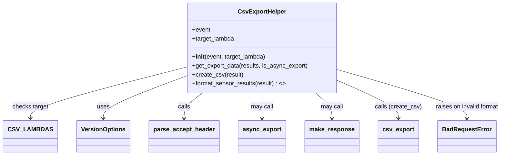
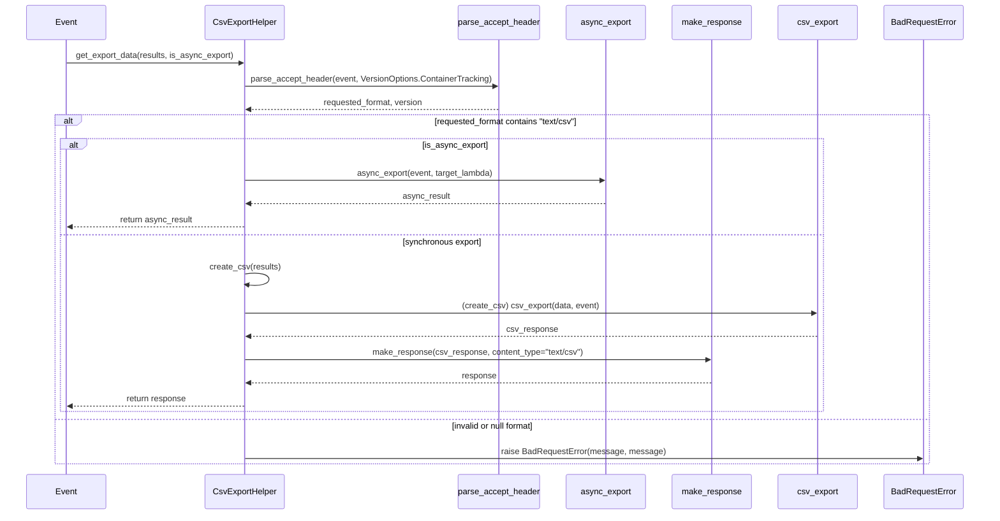

# Diagram: container_tracking_core/container_tracking_service/container_tracking_service/core/helpers/csv_export_helper.py


> Auto-generated by Obscura crawlers

## Diagram 1



> SVG rendering failed for this diagram.

## Diagram 2



> SVG rendering failed for this diagram.

## Diagram 3

```mermaid
flowchart TD
    A[create_csv(result)] --> B{target_lambda == CSV_LAMBDAS.SENSOR_SEARCH?}
    B -- yes --> C[format_sensor_results(result)]
    C --> D[csv_export(data, event)]
    B -- no --> E[keep data = None]
    E --> D
    D --> F[return csv_export(...) ]
```

> SVG rendering failed for this diagram.
