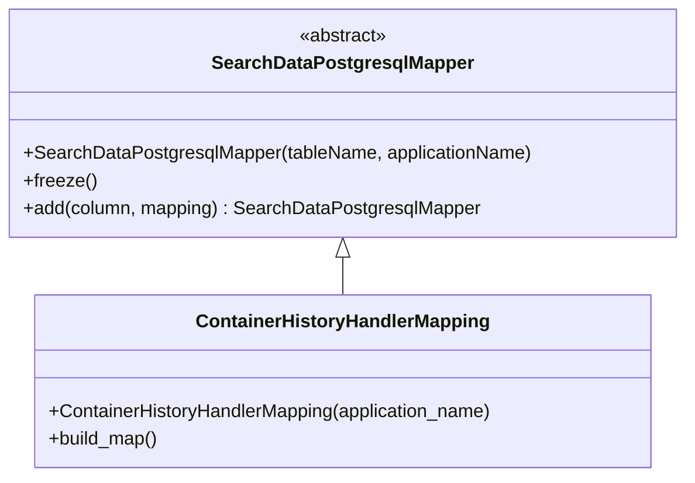

# Diagram: container_tracking_core/container_tracking_service/container_tracking_service/persistence_adapter/postgresql/ContainerHistoryHandlerMapping.py

> Auto-generated by Obscura crawlers

## Mermaid

### SVG

<svg id="container" width="590.0390625" xmlns="http://www.w3.org/2000/svg" class="classDiagram" height="414" viewBox="0 0 590.0390625 414" role="graphics-document document" aria-roledescription="class"><g><defs><marker id="container_class-aggregationStart" class="marker aggregation class" refX="18" refY="7" markerWidth="190" markerHeight="240" orient="auto"><path d="M 18,7 L9,13 L1,7 L9,1 Z"></path></marker></defs><defs><marker id="container_class-aggregationEnd" class="marker aggregation class" refX="1" refY="7" markerWidth="20" markerHeight="28" orient="auto"><path d="M 18,7 L9,13 L1,7 L9,1 Z"></path></marker></defs><defs><marker id="container_class-extensionStart" class="marker extension class" refX="18" refY="7" markerWidth="190" markerHeight="240" orient="auto"><path d="M 1,7 L18,13 V 1 Z"></path></marker></defs><defs><marker id="container_class-extensionEnd" class="marker extension class" refX="1" refY="7" markerWidth="20" markerHeight="28" orient="auto"><path d="M 1,1 V 13 L18,7 Z"></path></marker></defs><defs><marker id="container_class-compositionStart" class="marker composition class" refX="18" refY="7" markerWidth="190" markerHeight="240" orient="auto"><path d="M 18,7 L9,13 L1,7 L9,1 Z"></path></marker></defs><defs><marker id="container_class-compositionEnd" class="marker composition class" refX="1" refY="7" markerWidth="20" markerHeight="28" orient="auto"><path d="M 18,7 L9,13 L1,7 L9,1 Z"></path></marker></defs><defs><marker id="container_class-dependencyStart" class="marker dependency class" refX="6" refY="7" markerWidth="190" markerHeight="240" orient="auto"><path d="M 5,7 L9,13 L1,7 L9,1 Z"></path></marker></defs><defs><marker id="container_class-dependencyEnd" class="marker dependency class" refX="13" refY="7" markerWidth="20" markerHeight="28" orient="auto"><path d="M 18,7 L9,13 L14,7 L9,1 Z"></path></marker></defs><defs><marker id="container_class-lollipopStart" class="marker lollipop class" refX="13" refY="7" markerWidth="190" markerHeight="240" orient="auto"><circle stroke="black" fill="transparent" cx="7" cy="7" r="6"></circle></marker></defs><defs><marker id="container_class-lollipopEnd" class="marker lollipop class" refX="1" refY="7" markerWidth="190" markerHeight="240" orient="auto"><circle stroke="black" fill="transparent" cx="7" cy="7" r="6"></circle></marker></defs><g class="root"><g class="clusters"></g><g class="edgePaths"><path d="M295.02,223.25L295.02,224.542C295.02,225.833,295.02,228.417,295.02,233.875C295.02,239.333,295.02,247.667,295.02,251.833L295.02,256" id="id_SearchDataPostgresqlMapper_ContainerHistoryHandlerMapping_1" class="edge-thickness-normal edge-pattern-solid relation" style=";;;" data-edge="true" data-et="edge" data-id="id_SearchDataPostgresqlMapper_ContainerHistoryHandlerMapping_1" data-points="W3sieCI6Mjk1LjAxOTUzMTI1LCJ5IjoyMDZ9LHsieCI6Mjk1LjAxOTUzMTI1LCJ5IjoyMzF9LHsieCI6Mjk1LjAxOTUzMTI1LCJ5IjoyNTZ9XQ==" marker-start="url(#container_class-extensionStart)"></path></g><g class="edgeLabels"><g class="edgeLabel"><g class="label" data-id="id_SearchDataPostgresqlMapper_ContainerHistoryHandlerMapping_1" transform="translate(0, 0)"><foreignObject width="0" height="0">

</foreignObject></g></g></g><g class="nodes"><g class="node default" id="classId-SearchDataPostgresqlMapper-0" transform="translate(295.01953125, 107)"><g class="basic label-container"><path d="M-287.01953125 -99 L287.01953125 -99 L287.01953125 99 L-287.01953125 99" stroke="none" stroke-width="0" fill="#ECECFF" style=""></path><path d="M-287.01953125 -99 C-58.41149917356174 -99, 170.19653290287653 -99, 287.01953125 -99 M-287.01953125 -99 C-116.7568962435534 -99, 53.5057387628932 -99, 287.01953125 -99 M287.01953125 -99 C287.01953125 -30.22889945798886, 287.01953125 38.54220108402228, 287.01953125 99 M287.01953125 -99 C287.01953125 -55.94473800077044, 287.01953125 -12.889476001540885, 287.01953125 99 M287.01953125 99 C109.283436319672 99, -68.45265861065599 99, -287.01953125 99 M287.01953125 99 C108.06502778128652 99, -70.88947568742697 99, -287.01953125 99 M-287.01953125 99 C-287.01953125 56.62432893798871, -287.01953125 14.248657875977415, -287.01953125 -99 M-287.01953125 99 C-287.01953125 28.57821407277676, -287.01953125 -41.84357185444648, -287.01953125 -99" stroke="#9370DB" stroke-width="1.3" fill="none" stroke-dasharray="0 0" style=""></path></g><g class="annotation-group text" transform="translate(-38.609375, -75)"><g class="label" style="" transform="translate(0,-12)"><foreignObject width="77.21875" height="24">

«abstract»

</foreignObject></g></g><g class="label-group text" transform="translate(-108.3515625, -51)"><g class="label" style="font-weight: bolder" transform="translate(0,-12)"><foreignObject width="216.703125" height="24">

SearchDataPostgresqlMapper

</foreignObject></g></g><g class="members-group text" transform="translate(-275.01953125, -3)"></g><g class="methods-group text" transform="translate(-275.01953125, 27)"><g class="label" style="" transform="translate(0,-12)"><foreignObject width="441.6875" height="24">

+SearchDataPostgresqlMapper(tableName, applicationName)

</foreignObject></g><g class="label" style="" transform="translate(0,12)"><foreignObject width="62.109375" height="24">

+freeze()

</foreignObject></g><g class="label" style="" transform="translate(0,36)"><foreignObject width="396.359375" height="24">

+add(column, mapping) : SearchDataPostgresqlMapper

</foreignObject></g></g><g class="divider" style=""><path d="M-287.01953125 -27 C-94.9689380090071 -27, 97.08165523198579 -27, 287.01953125 -27 M-287.01953125 -27 C-156.7212450054851 -27, -26.422958760970175 -27, 287.01953125 -27" stroke="#9370DB" stroke-width="1.3" fill="none" stroke-dasharray="0 0" style=""></path></g><g class="divider" style=""><path d="M-287.01953125 -3 C-80.68551063992422 -3, 125.64850997015157 -3, 287.01953125 -3 M-287.01953125 -3 C-170.19261442909942 -3, -53.36569760819884 -3, 287.01953125 -3" stroke="#9370DB" stroke-width="1.3" fill="none" stroke-dasharray="0 0" style=""></path></g></g><g class="node default" id="classId-ContainerHistoryHandlerMapping-1" transform="translate(295.01953125, 331)"><g class="basic label-container"><path d="M-269.3125 -75 L269.3125 -75 L269.3125 75 L-269.3125 75" stroke="none" stroke-width="0" fill="#ECECFF" style=""></path><path d="M-269.3125 -75 C-129.2266127480263 -75, 10.859274503947404 -75, 269.3125 -75 M-269.3125 -75 C-139.77663024804662 -75, -10.24076049609323 -75, 269.3125 -75 M269.3125 -75 C269.3125 -30.90453262004035, 269.3125 13.190934759919301, 269.3125 75 M269.3125 -75 C269.3125 -39.64552471976441, 269.3125 -4.29104943952882, 269.3125 75 M269.3125 75 C149.4686036216383 75, 29.62470724327659 75, -269.3125 75 M269.3125 75 C60.56607461129076 75, -148.18035077741848 75, -269.3125 75 M-269.3125 75 C-269.3125 23.295307868957863, -269.3125 -28.409384262084274, -269.3125 -75 M-269.3125 75 C-269.3125 15.046299163202256, -269.3125 -44.90740167359549, -269.3125 -75" stroke="#9370DB" stroke-width="1.3" fill="none" stroke-dasharray="0 0" style=""></path></g><g class="annotation-group text" transform="translate(0, -51)"></g><g class="label-group text" transform="translate(-122.609375, -51)"><g class="label" style="font-weight: bolder" transform="translate(0,-12)"><foreignObject width="245.21875" height="24">

ContainerHistoryHandlerMapping

</foreignObject></g></g><g class="members-group text" transform="translate(-257.3125, -3)"></g><g class="methods-group text" transform="translate(-257.3125, 27)"><g class="label" style="" transform="translate(0,-12)"><foreignObject width="392.015625" height="24">

+ContainerHistoryHandlerMapping(application_name)

</foreignObject></g><g class="label" style="" transform="translate(0,12)"><foreignObject width="96.109375" height="24">

+build_map()

</foreignObject></g></g><g class="divider" style=""><path d="M-269.3125 -27 C-78.82188350727992 -27, 111.66873298544016 -27, 269.3125 -27 M-269.3125 -27 C-94.95377969081247 -27, 79.40494061837506 -27, 269.3125 -27" stroke="#9370DB" stroke-width="1.3" fill="none" stroke-dasharray="0 0" style=""></path></g><g class="divider" style=""><path d="M-269.3125 -3 C-111.63360639124679 -3, 46.04528721750643 -3, 269.3125 -3 M-269.3125 -3 C-74.30894493744123 -3, 120.69461012511755 -3, 269.3125 -3" stroke="#9370DB" stroke-width="1.3" fill="none" stroke-dasharray="0 0" style=""></path></g></g></g></g></g></svg>
