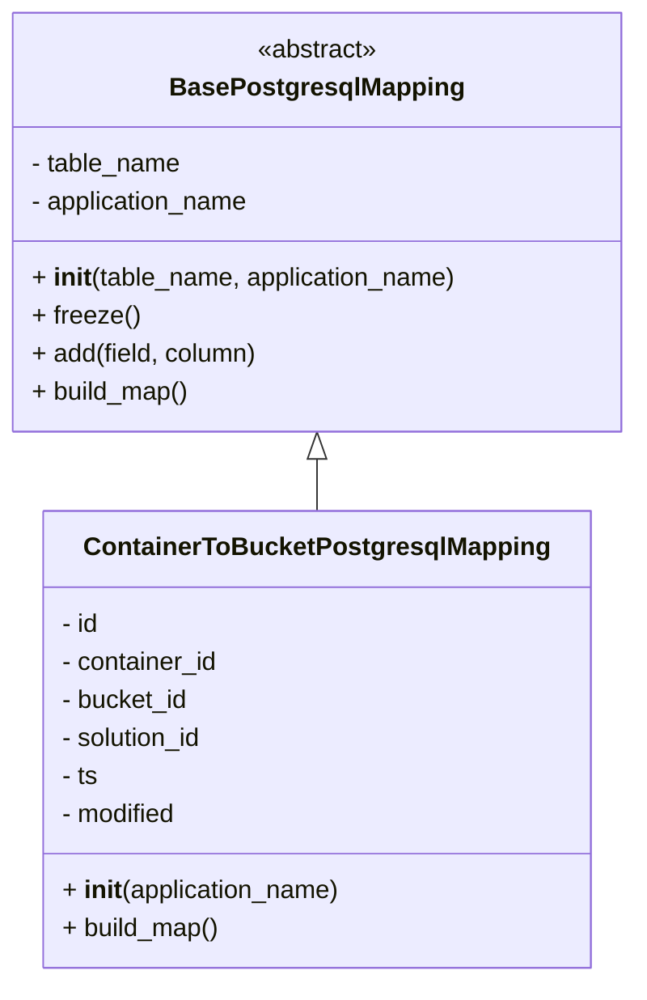
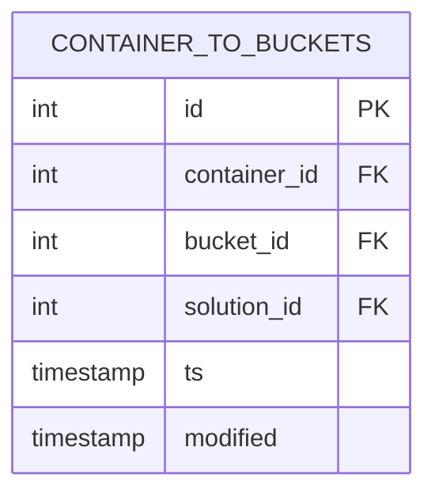

# Diagram: container_tracking_core/container_tracking_service/container_tracking_service/persistence_adapter/postgresql/ContainerToBucketMapping.py

> Auto-generated by Obscura crawlers

## Diagram 1

### SVG

<svg id="container" width="399.546875" xmlns="http://www.w3.org/2000/svg" class="classDiagram" height="618" viewBox="0 0 399.546875 618" role="graphics-document document" aria-roledescription="class"><g><defs><marker id="container_class-aggregationStart" class="marker aggregation class" refX="18" refY="7" markerWidth="190" markerHeight="240" orient="auto"><path d="M 18,7 L9,13 L1,7 L9,1 Z"></path></marker></defs><defs><marker id="container_class-aggregationEnd" class="marker aggregation class" refX="1" refY="7" markerWidth="20" markerHeight="28" orient="auto"><path d="M 18,7 L9,13 L1,7 L9,1 Z"></path></marker></defs><defs><marker id="container_class-extensionStart" class="marker extension class" refX="18" refY="7" markerWidth="190" markerHeight="240" orient="auto"><path d="M 1,7 L18,13 V 1 Z"></path></marker></defs><defs><marker id="container_class-extensionEnd" class="marker extension class" refX="1" refY="7" markerWidth="20" markerHeight="28" orient="auto"><path d="M 1,1 V 13 L18,7 Z"></path></marker></defs><defs><marker id="container_class-compositionStart" class="marker composition class" refX="18" refY="7" markerWidth="190" markerHeight="240" orient="auto"><path d="M 18,7 L9,13 L1,7 L9,1 Z"></path></marker></defs><defs><marker id="container_class-compositionEnd" class="marker composition class" refX="1" refY="7" markerWidth="20" markerHeight="28" orient="auto"><path d="M 18,7 L9,13 L1,7 L9,1 Z"></path></marker></defs><defs><marker id="container_class-dependencyStart" class="marker dependency class" refX="6" refY="7" markerWidth="190" markerHeight="240" orient="auto"><path d="M 5,7 L9,13 L1,7 L9,1 Z"></path></marker></defs><defs><marker id="container_class-dependencyEnd" class="marker dependency class" refX="13" refY="7" markerWidth="20" markerHeight="28" orient="auto"><path d="M 18,7 L9,13 L14,7 L9,1 Z"></path></marker></defs><defs><marker id="container_class-lollipopStart" class="marker lollipop class" refX="13" refY="7" markerWidth="190" markerHeight="240" orient="auto"><circle stroke="black" fill="transparent" cx="7" cy="7" r="6"></circle></marker></defs><defs><marker id="container_class-lollipopEnd" class="marker lollipop class" refX="1" refY="7" markerWidth="190" markerHeight="240" orient="auto"><circle stroke="black" fill="transparent" cx="7" cy="7" r="6"></circle></marker></defs><g class="root"><g class="clusters"></g><g class="edgePaths"><path d="M199.773,289.25L199.773,290.542C199.773,291.833,199.773,294.417,199.773,299.875C199.773,305.333,199.773,313.667,199.773,317.833L199.773,322" id="id_BasePostgresqlMapping_ContainerToBucketPostgresqlMapping_1" class="edge-thickness-normal edge-pattern-solid relation" style=";;;" data-edge="true" data-et="edge" data-id="id_BasePostgresqlMapping_ContainerToBucketPostgresqlMapping_1" data-points="W3sieCI6MTk5Ljc3MzQzNzUsInkiOjI3Mn0seyJ4IjoxOTkuNzczNDM3NSwieSI6Mjk3fSx7IngiOjE5OS43NzM0Mzc1LCJ5IjozMjJ9XQ==" marker-start="url(#container_class-extensionStart)"></path></g><g class="edgeLabels"><g class="edgeLabel"><g class="label" data-id="id_BasePostgresqlMapping_ContainerToBucketPostgresqlMapping_1" transform="translate(0, 0)"><foreignObject width="0" height="0">

</foreignObject></g></g></g><g class="nodes"><g class="node default" id="classId-BasePostgresqlMapping-0" transform="translate(199.7734375, 140)"><g class="basic label-container"><path d="M-191.7734375 -132 L191.7734375 -132 L191.7734375 132 L-191.7734375 132" stroke="none" stroke-width="0" fill="#ECECFF" style=""></path><path d="M-191.7734375 -132 C-39.28946582749046 -132, 113.19450584501908 -132, 191.7734375 -132 M-191.7734375 -132 C-80.41268384465596 -132, 30.948069810688082 -132, 191.7734375 -132 M191.7734375 -132 C191.7734375 -78.23841584954963, 191.7734375 -24.476831699099264, 191.7734375 132 M191.7734375 -132 C191.7734375 -71.46346276506401, 191.7734375 -10.926925530128031, 191.7734375 132 M191.7734375 132 C41.67061673737564 132, -108.43220402524872 132, -191.7734375 132 M191.7734375 132 C79.50420782474554 132, -32.76502185050893 132, -191.7734375 132 M-191.7734375 132 C-191.7734375 35.503922858398425, -191.7734375 -60.99215428320315, -191.7734375 -132 M-191.7734375 132 C-191.7734375 57.087715844329054, -191.7734375 -17.824568311341892, -191.7734375 -132" stroke="#9370DB" stroke-width="1.3" fill="none" stroke-dasharray="0 0" style=""></path></g><g class="annotation-group text" transform="translate(-38.609375, -108)"><g class="label" style="" transform="translate(0,-12)"><foreignObject width="77.21875" height="24">

«abstract»

</foreignObject></g></g><g class="label-group text" transform="translate(-87.921875, -84)"><g class="label" style="font-weight: bolder" transform="translate(0,-12)"><foreignObject width="175.84375" height="24">

BasePostgresqlMapping

</foreignObject></g></g><g class="members-group text" transform="translate(-179.7734375, -36)"><g class="label" style="" transform="translate(0,-12)"><foreignObject width="96.40625" height="24">

- table_name

</foreignObject></g><g class="label" style="" transform="translate(0,12)"><foreignObject width="141.640625" height="24">

- application_name

</foreignObject></g></g><g class="methods-group text" transform="translate(-179.7734375, 36)"><g class="label" style="" transform="translate(0,-12)"><foreignObject width="271.625" height="24">

+ <strong>init</strong>(table_name, application_name)

</foreignObject></g><g class="label" style="" transform="translate(0,12)"><foreignObject width="66.578125" height="24">

+ freeze()

</foreignObject></g><g class="label" style="" transform="translate(0,36)"><foreignObject width="144.375" height="24">

+ add(field, column)

</foreignObject></g><g class="label" style="" transform="translate(0,60)"><foreignObject width="100.34375" height="24">

+ build_map()

</foreignObject></g></g><g class="divider" style=""><path d="M-191.7734375 -60 C-78.92820062036456 -60, 33.91703625927087 -60, 191.7734375 -60 M-191.7734375 -60 C-50.22337495916844 -60, 91.32668758166312 -60, 191.7734375 -60" stroke="#9370DB" stroke-width="1.3" fill="none" stroke-dasharray="0 0" style=""></path></g><g class="divider" style=""><path d="M-191.7734375 12 C-74.15595641144752 12, 43.46152467710496 12, 191.7734375 12 M-191.7734375 12 C-59.17624337047002 12, 73.42095075905996 12, 191.7734375 12" stroke="#9370DB" stroke-width="1.3" fill="none" stroke-dasharray="0 0" style=""></path></g></g><g class="node default" id="classId-ContainerToBucketPostgresqlMapping-1" transform="translate(199.7734375, 466)"><g class="basic label-container"><path d="M-170.8515625 -144 L170.8515625 -144 L170.8515625 144 L-170.8515625 144" stroke="none" stroke-width="0" fill="#ECECFF" style=""></path><path d="M-170.8515625 -144 C-77.16844553900266 -144, 16.514671421994677 -144, 170.8515625 -144 M-170.8515625 -144 C-98.78884424837963 -144, -26.726125996759265 -144, 170.8515625 -144 M170.8515625 -144 C170.8515625 -42.35535386507706, 170.8515625 59.28929226984587, 170.8515625 144 M170.8515625 -144 C170.8515625 -85.43289931134964, 170.8515625 -26.865798622699273, 170.8515625 144 M170.8515625 144 C49.64508885589892 144, -71.56138478820216 144, -170.8515625 144 M170.8515625 144 C80.34569467293524 144, -10.160173154129524 144, -170.8515625 144 M-170.8515625 144 C-170.8515625 29.667919075766335, -170.8515625 -84.66416184846733, -170.8515625 -144 M-170.8515625 144 C-170.8515625 68.3001998022858, -170.8515625 -7.3996003954283935, -170.8515625 -144" stroke="#9370DB" stroke-width="1.3" fill="none" stroke-dasharray="0 0" style=""></path></g><g class="annotation-group text" transform="translate(0, -120)"></g><g class="label-group text" transform="translate(-139.71875, -120)"><g class="label" style="font-weight: bolder" transform="translate(0,-12)"><foreignObject width="279.4375" height="24">

ContainerToBucketPostgresqlMapping

</foreignObject></g></g><g class="members-group text" transform="translate(-158.8515625, -72)"><g class="label" style="" transform="translate(0,-12)"><foreignObject width="24.78125" height="24">

- id

</foreignObject></g><g class="label" style="" transform="translate(0,12)"><foreignObject width="101.015625" height="24">

- container_id

</foreignObject></g><g class="label" style="" transform="translate(0,36)"><foreignObject width="82.109375" height="24">

- bucket_id

</foreignObject></g><g class="label" style="" transform="translate(0,60)"><foreignObject width="92.921875" height="24">

- solution_id

</foreignObject></g><g class="label" style="" transform="translate(0,84)"><foreignObject width="23.9375" height="24">

- ts

</foreignObject></g><g class="label" style="" transform="translate(0,108)"><foreignObject width="75.3125" height="24">

- modified

</foreignObject></g></g><g class="methods-group text" transform="translate(-158.8515625, 96)"><g class="label" style="" transform="translate(0,-12)"><foreignObject width="177.984375" height="24">

+ <strong>init</strong>(application_name)

</foreignObject></g><g class="label" style="" transform="translate(0,12)"><foreignObject width="100.34375" height="24">

+ build_map()

</foreignObject></g></g><g class="divider" style=""><path d="M-170.8515625 -96 C-62.935777554857225 -96, 44.98000739028555 -96, 170.8515625 -96 M-170.8515625 -96 C-59.34419891059822 -96, 52.163164678803554 -96, 170.8515625 -96" stroke="#9370DB" stroke-width="1.3" fill="none" stroke-dasharray="0 0" style=""></path></g><g class="divider" style=""><path d="M-170.8515625 72 C-78.11156867025825 72, 14.628425159483498 72, 170.8515625 72 M-170.8515625 72 C-75.39480218506021 72, 20.06195812987957 72, 170.8515625 72" stroke="#9370DB" stroke-width="1.3" fill="none" stroke-dasharray="0 0" style=""></path></g></g></g></g></g></svg>

## Diagram 2

### SVG

<svg id="container" width="277.84375" xmlns="http://www.w3.org/2000/svg" class="erDiagram" height="315.25" viewBox="0 0 277.84375 315.25" role="graphics-document document" aria-roledescription="er"><g><defs><marker id="container_er-onlyOneStart" class="marker onlyOne er" refX="0" refY="9" markerWidth="18" markerHeight="18" orient="auto"><path d="M9,0 L9,18 M15,0 L15,18"></path></marker></defs><defs><marker id="container_er-onlyOneEnd" class="marker onlyOne er" refX="18" refY="9" markerWidth="18" markerHeight="18" orient="auto"><path d="M3,0 L3,18 M9,0 L9,18"></path></marker></defs><defs><marker id="container_er-zeroOrOneStart" class="marker zeroOrOne er" refX="0" refY="9" markerWidth="30" markerHeight="18" orient="auto"><circle fill="white" cx="21" cy="9" r="6"></circle><path d="M9,0 L9,18"></path></marker></defs><defs><marker id="container_er-zeroOrOneEnd" class="marker zeroOrOne er" refX="30" refY="9" markerWidth="30" markerHeight="18" orient="auto"><circle fill="white" cx="9" cy="9" r="6"></circle><path d="M21,0 L21,18"></path></marker></defs><defs><marker id="container_er-oneOrMoreStart" class="marker oneOrMore er" refX="18" refY="18" markerWidth="45" markerHeight="36" orient="auto"><path d="M0,18 Q 18,0 36,18 Q 18,36 0,18 M42,9 L42,27"></path></marker></defs><defs><marker id="container_er-oneOrMoreEnd" class="marker oneOrMore er" refX="27" refY="18" markerWidth="45" markerHeight="36" orient="auto"><path d="M3,9 L3,27 M9,18 Q27,0 45,18 Q27,36 9,18"></path></marker></defs><defs><marker id="container_er-zeroOrMoreStart" class="marker zeroOrMore er" refX="18" refY="18" markerWidth="57" markerHeight="36" orient="auto"><circle fill="white" cx="48" cy="18" r="6"></circle><path d="M0,18 Q18,0 36,18 Q18,36 0,18"></path></marker></defs><defs><marker id="container_er-zeroOrMoreEnd" class="marker zeroOrMore er" refX="39" refY="18" markerWidth="57" markerHeight="36" orient="auto"><circle fill="white" cx="9" cy="18" r="6"></circle><path d="M21,18 Q39,0 57,18 Q39,36 21,18"></path></marker></defs><g class="root"><g class="clusters"></g><g class="edgePaths"></g><g class="edgeLabels"></g><g class="nodes"><g class="node default" id="entity-CONTAINER_TO_BUCKETS-0" transform="translate(138.921875, 157.625)"><g style=""><path d="M-130.921875 -149.625 L130.921875 -149.625 L130.921875 149.625 L-130.921875 149.625" stroke="none" stroke-width="0" fill="#ECECFF"></path><path d="M-130.921875 -149.625 C-61.34847908563273 -149.625, 8.224916828734536 -149.625, 130.921875 -149.625 M-130.921875 -149.625 C-47.41384560016819 -149.625, 36.094183799663625 -149.625, 130.921875 -149.625 M130.921875 -149.625 C130.921875 -67.21830146141583, 130.921875 15.188397077168332, 130.921875 149.625 M130.921875 -149.625 C130.921875 -83.9467794205662, 130.921875 -18.268558841132403, 130.921875 149.625 M130.921875 149.625 C42.34257575529861 149.625, -46.23672348940278 149.625, -130.921875 149.625 M130.921875 149.625 C75.30712125252637 149.625, 19.69236750505273 149.625, -130.921875 149.625 M-130.921875 149.625 C-130.921875 74.36457100250372, -130.921875 -0.8958579949925536, -130.921875 -149.625 M-130.921875 149.625 C-130.921875 85.98476920158774, -130.921875 22.34453840317549, -130.921875 -149.625" stroke="#9370DB" stroke-width="1.3" fill="none" stroke-dasharray="0 0"></path></g><g style="" class="row-rect-odd"><path d="M-130.921875 -106.875 L130.921875 -106.875 L130.921875 -64.125 L-130.921875 -64.125" stroke="none" stroke-width="0" fill="hsl(240, 100%, 100%)"></path><path d="M-130.921875 -106.875 C-62.35350137736306 -106.875, 6.214872245273881 -106.875, 130.921875 -106.875 M-130.921875 -106.875 C-68.97821161989947 -106.875, -7.034548239798923 -106.875, 130.921875 -106.875 M130.921875 -106.875 C130.921875 -94.31042023293567, 130.921875 -81.74584046587134, 130.921875 -64.125 M130.921875 -106.875 C130.921875 -92.53980674504453, 130.921875 -78.20461349008906, 130.921875 -64.125 M130.921875 -64.125 C28.186254271567037 -64.125, -74.54936645686593 -64.125, -130.921875 -64.125 M130.921875 -64.125 C63.35558592256369 -64.125, -4.210703154872618 -64.125, -130.921875 -64.125 M-130.921875 -64.125 C-130.921875 -73.41339788327767, -130.921875 -82.70179576655534, -130.921875 -106.875 M-130.921875 -64.125 C-130.921875 -76.02537556460805, -130.921875 -87.92575112921611, -130.921875 -106.875" stroke="#9370DB" stroke-width="1.3" fill="none" stroke-dasharray="0 0"></path></g><g style="" class="row-rect-even"><path d="M-130.921875 -64.125 L130.921875 -64.125 L130.921875 -21.375 L-130.921875 -21.375" stroke="none" stroke-width="0" fill="hsl(240, 100%, 97.2745098039%)"></path><path d="M-130.921875 -64.125 C-75.08464176541568 -64.125, -19.24740853083138 -64.125, 130.921875 -64.125 M-130.921875 -64.125 C-60.238750433107214 -64.125, 10.444374133785573 -64.125, 130.921875 -64.125 M130.921875 -64.125 C130.921875 -49.70145260107268, 130.921875 -35.27790520214536, 130.921875 -21.375 M130.921875 -64.125 C130.921875 -48.65924625634168, 130.921875 -33.19349251268336, 130.921875 -21.375 M130.921875 -21.375 C71.40601940395274 -21.375, 11.890163807905495 -21.375, -130.921875 -21.375 M130.921875 -21.375 C28.48627946703712 -21.375, -73.94931606592576 -21.375, -130.921875 -21.375 M-130.921875 -21.375 C-130.921875 -38.0972087102448, -130.921875 -54.81941742048961, -130.921875 -64.125 M-130.921875 -21.375 C-130.921875 -33.76199677825137, -130.921875 -46.14899355650275, -130.921875 -64.125" stroke="#9370DB" stroke-width="1.3" fill="none" stroke-dasharray="0 0"></path></g><g style="" class="row-rect-odd"><path d="M-130.921875 -21.375 L130.921875 -21.375 L130.921875 21.375 L-130.921875 21.375" stroke="none" stroke-width="0" fill="hsl(240, 100%, 100%)"></path><path d="M-130.921875 -21.375 C-48.55276471842065 -21.375, 33.816345563158706 -21.375, 130.921875 -21.375 M-130.921875 -21.375 C-29.667333560638482 -21.375, 71.58720787872304 -21.375, 130.921875 -21.375 M130.921875 -21.375 C130.921875 -6.713936920973575, 130.921875 7.94712615805285, 130.921875 21.375 M130.921875 -21.375 C130.921875 -11.837975055222836, 130.921875 -2.3009501104456724, 130.921875 21.375 M130.921875 21.375 C77.48868126208964 21.375, 24.0554875241793 21.375, -130.921875 21.375 M130.921875 21.375 C27.56982052789546 21.375, -75.78223394420908 21.375, -130.921875 21.375 M-130.921875 21.375 C-130.921875 12.539418842568605, -130.921875 3.7038376851372092, -130.921875 -21.375 M-130.921875 21.375 C-130.921875 4.633288471137487, -130.921875 -12.108423057725027, -130.921875 -21.375" stroke="#9370DB" stroke-width="1.3" fill="none" stroke-dasharray="0 0"></path></g><g style="" class="row-rect-even"><path d="M-130.921875 21.375 L130.921875 21.375 L130.921875 64.125 L-130.921875 64.125" stroke="none" stroke-width="0" fill="hsl(240, 100%, 97.2745098039%)"></path><path d="M-130.921875 21.375 C-30.704757547096918 21.375, 69.51235990580616 21.375, 130.921875 21.375 M-130.921875 21.375 C-47.18880647834786 21.375, 36.544262043304286 21.375, 130.921875 21.375 M130.921875 21.375 C130.921875 33.68174386456532, 130.921875 45.98848772913063, 130.921875 64.125 M130.921875 21.375 C130.921875 34.27836363867896, 130.921875 47.18172727735792, 130.921875 64.125 M130.921875 64.125 C46.35868056368167 64.125, -38.20451387263665 64.125, -130.921875 64.125 M130.921875 64.125 C27.22123653634614 64.125, -76.47940192730772 64.125, -130.921875 64.125 M-130.921875 64.125 C-130.921875 52.033024051537204, -130.921875 39.94104810307441, -130.921875 21.375 M-130.921875 64.125 C-130.921875 54.63389270908775, -130.921875 45.14278541817551, -130.921875 21.375" stroke="#9370DB" stroke-width="1.3" fill="none" stroke-dasharray="0 0"></path></g><g style="" class="row-rect-odd"><path d="M-130.921875 64.125 L130.921875 64.125 L130.921875 106.875 L-130.921875 106.875" stroke="none" stroke-width="0" fill="hsl(240, 100%, 100%)"></path><path d="M-130.921875 64.125 C-47.09553210740687 64.125, 36.730810785186264 64.125, 130.921875 64.125 M-130.921875 64.125 C-34.011029541010856 64.125, 62.89981591797829 64.125, 130.921875 64.125 M130.921875 64.125 C130.921875 78.66306559464215, 130.921875 93.2011311892843, 130.921875 106.875 M130.921875 64.125 C130.921875 75.82861443253026, 130.921875 87.53222886506052, 130.921875 106.875 M130.921875 106.875 C32.287576110176744 106.875, -66.34672277964651 106.875, -130.921875 106.875 M130.921875 106.875 C44.28866636619773 106.875, -42.34454226760454 106.875, -130.921875 106.875 M-130.921875 106.875 C-130.921875 90.61920453857496, -130.921875 74.36340907714992, -130.921875 64.125 M-130.921875 106.875 C-130.921875 90.72362448367653, -130.921875 74.57224896735308, -130.921875 64.125" stroke="#9370DB" stroke-width="1.3" fill="none" stroke-dasharray="0 0"></path></g><g style="" class="row-rect-even"><path d="M-130.921875 106.875 L130.921875 106.875 L130.921875 149.625 L-130.921875 149.625" stroke="none" stroke-width="0" fill="hsl(240, 100%, 97.2745098039%)"></path><path d="M-130.921875 106.875 C-55.86286213107597 106.875, 19.196150737848058 106.875, 130.921875 106.875 M-130.921875 106.875 C-68.89561913792173 106.875, -6.86936327584344 106.875, 130.921875 106.875 M130.921875 106.875 C130.921875 115.97453618333128, 130.921875 125.07407236666256, 130.921875 149.625 M130.921875 106.875 C130.921875 120.06348372157707, 130.921875 133.25196744315414, 130.921875 149.625 M130.921875 149.625 C61.70262613089973 149.625, -7.516622738200539 149.625, -130.921875 149.625 M130.921875 149.625 C34.12394873774329 149.625, -62.67397752451342 149.625, -130.921875 149.625 M-130.921875 149.625 C-130.921875 134.57951238070444, -130.921875 119.53402476140892, -130.921875 106.875 M-130.921875 149.625 C-130.921875 139.6011429645776, -130.921875 129.57728592915524, -130.921875 106.875" stroke="#9370DB" stroke-width="1.3" fill="none" stroke-dasharray="0 0"></path></g><g class="label name" transform="translate(-89.546875, -140.25)" style=""><foreignObject width="179.09375" height="24">

CONTAINER_TO_BUCKETS

</foreignObject></g><g class="label attribute-type" transform="translate(-118.421875, -97.5)" style=""><foreignObject width="19.671875" height="24">

int

</foreignObject></g><g class="label attribute-name" transform="translate(-15.640625, -97.5)" style=""><foreignObject width="14.09375" height="24">

id

</foreignObject></g><g class="label attribute-keys" transform="translate(99.6875, -97.5)" style=""><foreignObject width="18.734375" height="24">

PK

</foreignObject></g><g class="label attribute-comment" transform="translate(143.421875, -97.5)" style=""><foreignObject width="0" height="0">

</foreignObject></g><g class="label attribute-type" transform="translate(-118.421875, -54.75)" style=""><foreignObject width="19.671875" height="24">

int

</foreignObject></g><g class="label attribute-name" transform="translate(-15.640625, -54.75)" style=""><foreignObject width="90.328125" height="24">

container_id

</foreignObject></g><g class="label attribute-keys" transform="translate(99.6875, -54.75)" style=""><foreignObject width="17.28125" height="24">

FK

</foreignObject></g><g class="label attribute-comment" transform="translate(143.421875, -54.75)" style=""><foreignObject width="0" height="0">

</foreignObject></g><g class="label attribute-type" transform="translate(-118.421875, -12)" style=""><foreignObject width="19.671875" height="24">

int

</foreignObject></g><g class="label attribute-name" transform="translate(-15.640625, -12)" style=""><foreignObject width="71.421875" height="24">

bucket_id

</foreignObject></g><g class="label attribute-keys" transform="translate(99.6875, -12)" style=""><foreignObject width="17.28125" height="24">

FK

</foreignObject></g><g class="label attribute-comment" transform="translate(143.421875, -12)" style=""><foreignObject width="0" height="0">

</foreignObject></g><g class="label attribute-type" transform="translate(-118.421875, 30.75)" style=""><foreignObject width="19.671875" height="24">

int

</foreignObject></g><g class="label attribute-name" transform="translate(-15.640625, 30.75)" style=""><foreignObject width="82.234375" height="24">

solution_id

</foreignObject></g><g class="label attribute-keys" transform="translate(99.6875, 30.75)" style=""><foreignObject width="17.28125" height="24">

FK

</foreignObject></g><g class="label attribute-comment" transform="translate(143.421875, 30.75)" style=""><foreignObject width="0" height="0">

</foreignObject></g><g class="label attribute-type" transform="translate(-118.421875, 73.5)" style=""><foreignObject width="77.78125" height="24">

timestamp

</foreignObject></g><g class="label attribute-name" transform="translate(-15.640625, 73.5)" style=""><foreignObject width="13.25" height="24">

ts

</foreignObject></g><g class="label attribute-keys" transform="translate(99.6875, 73.5)" style=""><foreignObject width="0" height="0">

</foreignObject></g><g class="label attribute-comment" transform="translate(143.421875, 73.5)" style=""><foreignObject width="0" height="0">

</foreignObject></g><g class="label attribute-type" transform="translate(-118.421875, 116.25)" style=""><foreignObject width="77.78125" height="24">

timestamp

</foreignObject></g><g class="label attribute-name" transform="translate(-15.640625, 116.25)" style=""><foreignObject width="64.625" height="24">

modified

</foreignObject></g><g class="label attribute-keys" transform="translate(99.6875, 116.25)" style=""><foreignObject width="0" height="0">

</foreignObject></g><g class="label attribute-comment" transform="translate(143.421875, 116.25)" style=""><foreignObject width="0" height="0">

</foreignObject></g><g class="divider"><path d="M-130.921875 -106.875 C-50.93741082094297 -106.875, 29.047053358114056 -106.875, 130.921875 -106.875 M-130.921875 -106.875 C-70.97006132731548 -106.875, -11.01824765463094 -106.875, 130.921875 -106.875" stroke="#9370DB" stroke-width="1.3" fill="none" stroke-dasharray="0 0"></path></g><g class="divider"><path d="M-28.140625 -106.875 C-28.140625 -13.173496003684335, -28.140625 80.52800799263133, -28.140625 149.625 M-28.140625 -106.875 C-28.140625 -8.996201492142234, -28.140625 88.88259701571553, -28.140625 149.625" stroke="#9370DB" stroke-width="1.3" fill="none" stroke-dasharray="0 0"></path></g><g class="divider"><path d="M87.1875 -106.875 C87.1875 -53.57801051961254, 87.1875 -0.2810210392250809, 87.1875 149.625 M87.1875 -106.875 C87.1875 -53.06251510939333, 87.1875 0.7499697812133377, 87.1875 149.625" stroke="#9370DB" stroke-width="1.3" fill="none" stroke-dasharray="0 0"></path></g><g class="divider"><path d="M-130.921875 -106.875 C-43.39499453664057 -106.875, 44.131885926718866 -106.875, 130.921875 -106.875 M-130.921875 -106.875 C-51.905157516315754 -106.875, 27.111559967368493 -106.875, 130.921875 -106.875" stroke="#9370DB" stroke-width="1.3" fill="none" stroke-dasharray="0 0"></path></g></g></g></g></g></svg>
