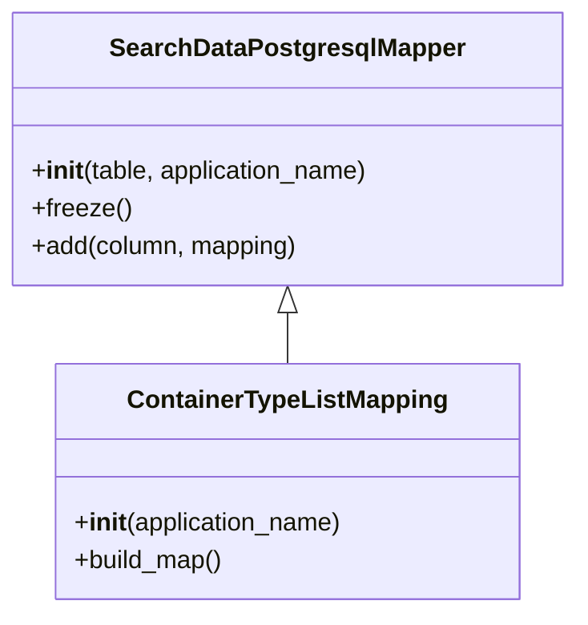
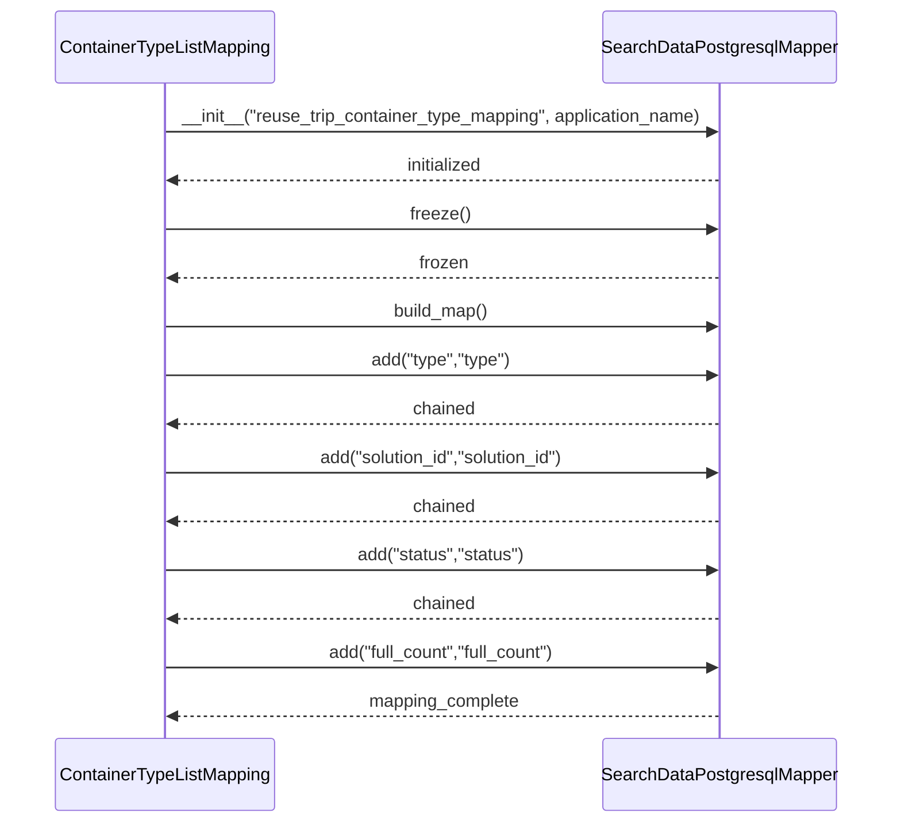

# Diagram: container_tracking_core/container_tracking_service/container_tracking_service/persistence_adapter/postgresql/ContainerTypeListMapping.py

> Auto-generated by Obscura crawlers

## Diagram 1

### SVG

<svg id="container" width="367.2109375" xmlns="http://www.w3.org/2000/svg" class="classDiagram" height="390" viewBox="0 0 367.2109375 390" role="graphics-document document" aria-roledescription="class"><g><defs><marker id="container_class-aggregationStart" class="marker aggregation class" refX="18" refY="7" markerWidth="190" markerHeight="240" orient="auto"><path d="M 18,7 L9,13 L1,7 L9,1 Z"></path></marker></defs><defs><marker id="container_class-aggregationEnd" class="marker aggregation class" refX="1" refY="7" markerWidth="20" markerHeight="28" orient="auto"><path d="M 18,7 L9,13 L1,7 L9,1 Z"></path></marker></defs><defs><marker id="container_class-extensionStart" class="marker extension class" refX="18" refY="7" markerWidth="190" markerHeight="240" orient="auto"><path d="M 1,7 L18,13 V 1 Z"></path></marker></defs><defs><marker id="container_class-extensionEnd" class="marker extension class" refX="1" refY="7" markerWidth="20" markerHeight="28" orient="auto"><path d="M 1,1 V 13 L18,7 Z"></path></marker></defs><defs><marker id="container_class-compositionStart" class="marker composition class" refX="18" refY="7" markerWidth="190" markerHeight="240" orient="auto"><path d="M 18,7 L9,13 L1,7 L9,1 Z"></path></marker></defs><defs><marker id="container_class-compositionEnd" class="marker composition class" refX="1" refY="7" markerWidth="20" markerHeight="28" orient="auto"><path d="M 18,7 L9,13 L1,7 L9,1 Z"></path></marker></defs><defs><marker id="container_class-dependencyStart" class="marker dependency class" refX="6" refY="7" markerWidth="190" markerHeight="240" orient="auto"><path d="M 5,7 L9,13 L1,7 L9,1 Z"></path></marker></defs><defs><marker id="container_class-dependencyEnd" class="marker dependency class" refX="13" refY="7" markerWidth="20" markerHeight="28" orient="auto"><path d="M 18,7 L9,13 L14,7 L9,1 Z"></path></marker></defs><defs><marker id="container_class-lollipopStart" class="marker lollipop class" refX="13" refY="7" markerWidth="190" markerHeight="240" orient="auto"><circle stroke="black" fill="transparent" cx="7" cy="7" r="6"></circle></marker></defs><defs><marker id="container_class-lollipopEnd" class="marker lollipop class" refX="1" refY="7" markerWidth="190" markerHeight="240" orient="auto"><circle stroke="black" fill="transparent" cx="7" cy="7" r="6"></circle></marker></defs><g class="root"><g class="clusters"></g><g class="edgePaths"><path d="M183.605,199.25L183.605,200.542C183.605,201.833,183.605,204.417,183.605,209.875C183.605,215.333,183.605,223.667,183.605,227.833L183.605,232" id="id_SearchDataPostgresqlMapper_ContainerTypeListMapping_1" class="edge-thickness-normal edge-pattern-solid relation" style=";;;" data-edge="true" data-et="edge" data-id="id_SearchDataPostgresqlMapper_ContainerTypeListMapping_1" data-points="W3sieCI6MTgzLjYwNTQ2ODc1LCJ5IjoxODJ9LHsieCI6MTgzLjYwNTQ2ODc1LCJ5IjoyMDd9LHsieCI6MTgzLjYwNTQ2ODc1LCJ5IjoyMzJ9XQ==" marker-start="url(#container_class-extensionStart)"></path></g><g class="edgeLabels"><g class="edgeLabel"><g class="label" data-id="id_SearchDataPostgresqlMapper_ContainerTypeListMapping_1" transform="translate(0, 0)"><foreignObject width="0" height="0">

</foreignObject></g></g></g><g class="nodes"><g class="node default" id="classId-SearchDataPostgresqlMapper-0" transform="translate(183.60546875, 95)"><g class="basic label-container"><path d="M-175.60546875 -87 L175.60546875 -87 L175.60546875 87 L-175.60546875 87" stroke="none" stroke-width="0" fill="#ECECFF" style=""></path><path d="M-175.60546875 -87 C-46.47481349533419 -87, 82.65584175933162 -87, 175.60546875 -87 M-175.60546875 -87 C-37.94623675462714 -87, 99.71299524074573 -87, 175.60546875 -87 M175.60546875 -87 C175.60546875 -39.45574755887945, 175.60546875 8.088504882241097, 175.60546875 87 M175.60546875 -87 C175.60546875 -32.70799093436188, 175.60546875 21.58401813127624, 175.60546875 87 M175.60546875 87 C84.54545543291566 87, -6.514557884168681 87, -175.60546875 87 M175.60546875 87 C36.158158654082 87, -103.289151441836 87, -175.60546875 87 M-175.60546875 87 C-175.60546875 43.8299276657424, -175.60546875 0.6598553314848061, -175.60546875 -87 M-175.60546875 87 C-175.60546875 46.66776828825141, -175.60546875 6.335536576502818, -175.60546875 -87" stroke="#9370DB" stroke-width="1.3" fill="none" stroke-dasharray="0 0" style=""></path></g><g class="annotation-group text" transform="translate(0, -63)"></g><g class="label-group text" transform="translate(-108.3515625, -63)"><g class="label" style="font-weight: bolder" transform="translate(0,-12)"><foreignObject width="216.703125" height="24">

SearchDataPostgresqlMapper

</foreignObject></g></g><g class="members-group text" transform="translate(-163.60546875, -15)"></g><g class="methods-group text" transform="translate(-163.60546875, 15)"><g class="label" style="" transform="translate(0,-12)"><foreignObject width="218.859375" height="24">

+<strong>init</strong>(table, application_name)

</foreignObject></g><g class="label" style="" transform="translate(0,12)"><foreignObject width="62.109375" height="24">

+freeze()

</foreignObject></g><g class="label" style="" transform="translate(0,36)"><foreignObject width="171.4375" height="24">

+add(column, mapping)

</foreignObject></g></g><g class="divider" style=""><path d="M-175.60546875 -39 C-76.88658234112849 -39, 21.832304067743024 -39, 175.60546875 -39 M-175.60546875 -39 C-56.44782377518348 -39, 62.70982119963304 -39, 175.60546875 -39" stroke="#9370DB" stroke-width="1.3" fill="none" stroke-dasharray="0 0" style=""></path></g><g class="divider" style=""><path d="M-175.60546875 -15 C-84.10222673079527 -15, 7.401015288409468 -15, 175.60546875 -15 M-175.60546875 -15 C-70.72780596535894 -15, 34.14985681928212 -15, 175.60546875 -15" stroke="#9370DB" stroke-width="1.3" fill="none" stroke-dasharray="0 0" style=""></path></g></g><g class="node default" id="classId-ContainerTypeListMapping-1" transform="translate(183.60546875, 307)"><g class="basic label-container"><path d="M-147.74609375 -75 L147.74609375 -75 L147.74609375 75 L-147.74609375 75" stroke="none" stroke-width="0" fill="#ECECFF" style=""></path><path d="M-147.74609375 -75 C-59.28301305898701 -75, 29.18006763202598 -75, 147.74609375 -75 M-147.74609375 -75 C-46.620802929197396 -75, 54.50448789160521 -75, 147.74609375 -75 M147.74609375 -75 C147.74609375 -36.866110079235234, 147.74609375 1.2677798415295314, 147.74609375 75 M147.74609375 -75 C147.74609375 -27.789588374704415, 147.74609375 19.42082325059117, 147.74609375 75 M147.74609375 75 C66.58462908402142 75, -14.57683558195717 75, -147.74609375 75 M147.74609375 75 C84.60468652115993 75, 21.463279292319868 75, -147.74609375 75 M-147.74609375 75 C-147.74609375 19.963026215759925, -147.74609375 -35.07394756848015, -147.74609375 -75 M-147.74609375 75 C-147.74609375 36.014726852000486, -147.74609375 -2.9705462959990285, -147.74609375 -75" stroke="#9370DB" stroke-width="1.3" fill="none" stroke-dasharray="0 0" style=""></path></g><g class="annotation-group text" transform="translate(0, -51)"></g><g class="label-group text" transform="translate(-97.7578125, -51)"><g class="label" style="font-weight: bolder" transform="translate(0,-12)"><foreignObject width="195.515625" height="24">

ContainerTypeListMapping

</foreignObject></g></g><g class="members-group text" transform="translate(-135.74609375, -3)"></g><g class="methods-group text" transform="translate(-135.74609375, 27)"><g class="label" style="" transform="translate(0,-12)"><foreignObject width="173.734375" height="24">

+<strong>init</strong>(application_name)

</foreignObject></g><g class="label" style="" transform="translate(0,12)"><foreignObject width="96.109375" height="24">

+build_map()

</foreignObject></g></g><g class="divider" style=""><path d="M-147.74609375 -27 C-78.24348534279714 -27, -8.740876935594287 -27, 147.74609375 -27 M-147.74609375 -27 C-77.03765491752307 -27, -6.329216085046141 -27, 147.74609375 -27" stroke="#9370DB" stroke-width="1.3" fill="none" stroke-dasharray="0 0" style=""></path></g><g class="divider" style=""><path d="M-147.74609375 -3 C-52.93325663522819 -3, 41.87958047954362 -3, 147.74609375 -3 M-147.74609375 -3 C-47.64185623794317 -3, 52.46238127411365 -3, 147.74609375 -3" stroke="#9370DB" stroke-width="1.3" fill="none" stroke-dasharray="0 0" style=""></path></g></g></g></g></g></svg>

## Diagram 2

> SVG rendering failed for this diagram.
