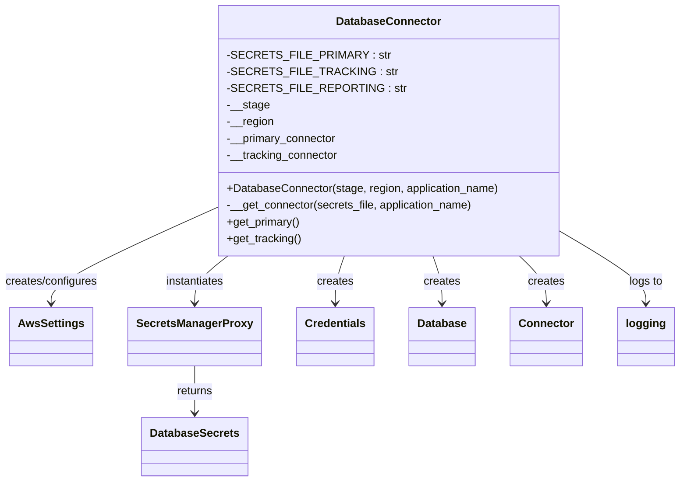
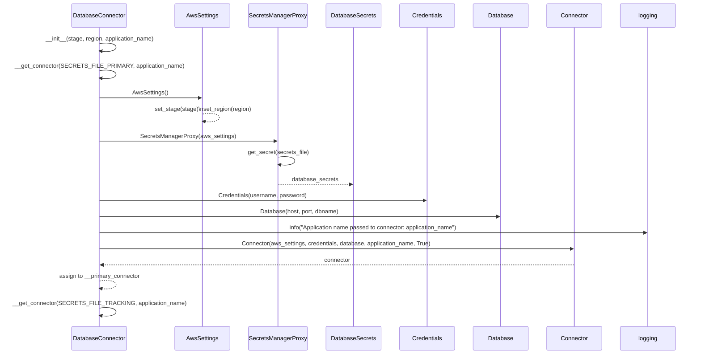

# Diagram: container_tracking_core/container_tracking_service/container_tracking_service/persistence_adapter/postgresql/DatabaseConnector.py

> Auto-generated by Obscura crawlers

## Diagram 1

### SVG

<svg id="container" width="948.7421875" xmlns="http://www.w3.org/2000/svg" class="classDiagram" height="692" viewBox="0 0 948.7421875 692" role="graphics-document document" aria-roledescription="class"><g><defs><marker id="container_class-aggregationStart" class="marker aggregation class" refX="18" refY="7" markerWidth="190" markerHeight="240" orient="auto"><path d="M 18,7 L9,13 L1,7 L9,1 Z"></path></marker></defs><defs><marker id="container_class-aggregationEnd" class="marker aggregation class" refX="1" refY="7" markerWidth="20" markerHeight="28" orient="auto"><path d="M 18,7 L9,13 L1,7 L9,1 Z"></path></marker></defs><defs><marker id="container_class-extensionStart" class="marker extension class" refX="18" refY="7" markerWidth="190" markerHeight="240" orient="auto"><path d="M 1,7 L18,13 V 1 Z"></path></marker></defs><defs><marker id="container_class-extensionEnd" class="marker extension class" refX="1" refY="7" markerWidth="20" markerHeight="28" orient="auto"><path d="M 1,1 V 13 L18,7 Z"></path></marker></defs><defs><marker id="container_class-compositionStart" class="marker composition class" refX="18" refY="7" markerWidth="190" markerHeight="240" orient="auto"><path d="M 18,7 L9,13 L1,7 L9,1 Z"></path></marker></defs><defs><marker id="container_class-compositionEnd" class="marker composition class" refX="1" refY="7" markerWidth="20" markerHeight="28" orient="auto"><path d="M 18,7 L9,13 L1,7 L9,1 Z"></path></marker></defs><defs><marker id="container_class-dependencyStart" class="marker dependency class" refX="6" refY="7" markerWidth="190" markerHeight="240" orient="auto"><path d="M 5,7 L9,13 L1,7 L9,1 Z"></path></marker></defs><defs><marker id="container_class-dependencyEnd" class="marker dependency class" refX="13" refY="7" markerWidth="20" markerHeight="28" orient="auto"><path d="M 18,7 L9,13 L14,7 L9,1 Z"></path></marker></defs><defs><marker id="container_class-lollipopStart" class="marker lollipop class" refX="13" refY="7" markerWidth="190" markerHeight="240" orient="auto"><circle stroke="black" fill="transparent" cx="7" cy="7" r="6"></circle></marker></defs><defs><marker id="container_class-lollipopEnd" class="marker lollipop class" refX="1" refY="7" markerWidth="190" markerHeight="240" orient="auto"><circle stroke="black" fill="transparent" cx="7" cy="7" r="6"></circle></marker></defs><g class="root"><g class="clusters"></g><g class="edgePaths"><path d="M299.23,301.001L261.898,318.335C224.565,335.668,149.9,370.334,112.567,392.834C75.234,415.333,75.234,425.667,75.234,430.833L75.234,436" id="id_DatabaseConnector_AwsSettings_1" class="edge-thickness-normal edge-pattern-solid relation" style=";;;" data-edge="true" data-et="edge" data-id="id_DatabaseConnector_AwsSettings_1" data-points="W3sieCI6Mjk5LjIzMDQ2ODc1LCJ5IjozMDEuMDAxNDEyNDUyOTg3OX0seyJ4Ijo3NS4yMzQzNzUsInkiOjQwNX0seyJ4Ijo3NS4yMzQzNzUsInkiOjQ0Mn1d" marker-end="url(#container_class-dependencyEnd)"></path><path d="M319.043,368L311.383,374.167C303.724,380.333,288.405,392.667,280.745,404C273.086,415.333,273.086,425.667,273.086,430.833L273.086,436" id="id_DatabaseConnector_SecretsManagerProxy_2" class="edge-thickness-normal edge-pattern-solid relation" style=";;;" data-edge="true" data-et="edge" data-id="id_DatabaseConnector_SecretsManagerProxy_2" data-points="W3sieCI6MzE5LjA0Mjg3ODc0NDIzOTYsInkiOjM2OH0seyJ4IjoyNzMuMDg1OTM3NSwieSI6NDA1fSx7IngiOjI3My4wODU5Mzc1LCJ5Ijo0NDJ9XQ==" marker-end="url(#container_class-dependencyEnd)"></path><path d="M273.086,526L273.086,532.167C273.086,538.333,273.086,550.667,273.086,562C273.086,573.333,273.086,583.667,273.086,588.833L273.086,594" id="id_SecretsManagerProxy_DatabaseSecrets_3" class="edge-thickness-normal edge-pattern-solid relation" style=";;;" data-edge="true" data-et="edge" data-id="id_SecretsManagerProxy_DatabaseSecrets_3" data-points="W3sieCI6MjczLjA4NTkzNzUsInkiOjUyNn0seyJ4IjoyNzMuMDg1OTM3NSwieSI6NTYzfSx7IngiOjI3My4wODU5Mzc1LCJ5Ijo2MDB9XQ==" marker-end="url(#container_class-dependencyEnd)"></path><path d="M480.496,368L478.368,374.167C476.239,380.333,471.983,392.667,469.855,404C467.727,415.333,467.727,425.667,467.727,430.833L467.727,436" id="id_DatabaseConnector_Credentials_4" class="edge-thickness-normal edge-pattern-solid relation" style=";;;" data-edge="true" data-et="edge" data-id="id_DatabaseConnector_Credentials_4" data-points="W3sieCI6NDgwLjQ5NTkzMTczOTYzMTMsInkiOjM2OH0seyJ4Ijo0NjcuNzI2NTYyNSwieSI6NDA1fSx7IngiOjQ2Ny43MjY1NjI1LCJ5Ijo0NDJ9XQ==" marker-end="url(#container_class-dependencyEnd)"></path><path d="M604.738,368L606.867,374.167C608.995,380.333,613.251,392.667,615.38,404C617.508,415.333,617.508,425.667,617.508,430.833L617.508,436" id="id_DatabaseConnector_Database_5" class="edge-thickness-normal edge-pattern-solid relation" style=";;;" data-edge="true" data-et="edge" data-id="id_DatabaseConnector_Database_5" data-points="W3sieCI6NjA0LjczODQ0MzI2MDM2ODYsInkiOjM2OH0seyJ4Ijo2MTcuNTA3ODEyNSwieSI6NDA1fSx7IngiOjYxNy41MDc4MTI1LCJ5Ijo0NDJ9XQ==" marker-end="url(#container_class-dependencyEnd)"></path><path d="M725.507,368L731.773,374.167C738.039,380.333,750.57,392.667,756.836,404C763.102,415.333,763.102,425.667,763.102,430.833L763.102,436" id="id_DatabaseConnector_Connector_6" class="edge-thickness-normal edge-pattern-solid relation" style=";;;" data-edge="true" data-et="edge" data-id="id_DatabaseConnector_Connector_6" data-points="W3sieCI6NzI1LjUwNzQ1MjQ3Njk1ODUsInkiOjM2OH0seyJ4Ijo3NjMuMTAxNTYyNSwieSI6NDA1fSx7IngiOjc2My4xMDE1NjI1LCJ5Ijo0NDJ9XQ==" marker-end="url(#container_class-dependencyEnd)"></path><path d="M786.004,335.11L805.275,346.759C824.547,358.407,863.09,381.703,882.361,398.518C901.633,415.333,901.633,425.667,901.633,430.833L901.633,436" id="id_DatabaseConnector_logging_7" class="edge-thickness-normal edge-pattern-solid relation" style=";;;" data-edge="true" data-et="edge" data-id="id_DatabaseConnector_logging_7" data-points="W3sieCI6Nzg2LjAwMzkwNjI1LCJ5IjozMzUuMTEwMzYwMzYwMzYwMzV9LHsieCI6OTAxLjYzMjgxMjUsInkiOjQwNX0seyJ4Ijo5MDEuNjMyODEyNSwieSI6NDQyfV0=" marker-end="url(#container_class-dependencyEnd)"></path></g><g class="edgeLabels"><g class="edgeLabel" transform="translate(75.234375, 405)"><g class="label" data-id="id_DatabaseConnector_AwsSettings_1" transform="translate(-67.234375, -12)"><foreignObject width="134.46875" height="24">

creates/configures

</foreignObject></g></g><g class="edgeLabel" transform="translate(273.0859375, 405)"><g class="label" data-id="id_DatabaseConnector_SecretsManagerProxy_2" transform="translate(-42.9140625, -12)"><foreignObject width="85.828125" height="24">

instantiates

</foreignObject></g></g><g class="edgeLabel" transform="translate(273.0859375, 563)"><g class="label" data-id="id_SecretsManagerProxy_DatabaseSecrets_3" transform="translate(-26.265625, -12)"><foreignObject width="52.53125" height="24">

returns

</foreignObject></g></g><g class="edgeLabel" transform="translate(467.7265625, 405)"><g class="label" data-id="id_DatabaseConnector_Credentials_4" transform="translate(-26.171875, -12)"><foreignObject width="52.34375" height="24">

creates

</foreignObject></g></g><g class="edgeLabel" transform="translate(617.5078125, 405)"><g class="label" data-id="id_DatabaseConnector_Database_5" transform="translate(-26.171875, -12)"><foreignObject width="52.34375" height="24">

creates

</foreignObject></g></g><g class="edgeLabel" transform="translate(763.1015625, 405)"><g class="label" data-id="id_DatabaseConnector_Connector_6" transform="translate(-26.171875, -12)"><foreignObject width="52.34375" height="24">

creates

</foreignObject></g></g><g class="edgeLabel" transform="translate(901.6328125, 405)"><g class="label" data-id="id_DatabaseConnector_logging_7" transform="translate(-24.3828125, -12)"><foreignObject width="48.765625" height="24">

logs to

</foreignObject></g></g></g><g class="nodes"><g class="node default" id="classId-DatabaseConnector-0" transform="translate(542.6171875, 188)"><g class="basic label-container"><path d="M-243.38671875 -180 L243.38671875 -180 L243.38671875 180 L-243.38671875 180" stroke="none" stroke-width="0" fill="#ECECFF" style=""></path><path d="M-243.38671875 -180 C-68.27236364335903 -180, 106.84199146328194 -180, 243.38671875 -180 M-243.38671875 -180 C-103.99489389838774 -180, 35.39693095322451 -180, 243.38671875 -180 M243.38671875 -180 C243.38671875 -97.65269361176182, 243.38671875 -15.305387223523638, 243.38671875 180 M243.38671875 -180 C243.38671875 -70.9564749876196, 243.38671875 38.0870500247608, 243.38671875 180 M243.38671875 180 C126.3996562819721 180, 9.412593813944198 180, -243.38671875 180 M243.38671875 180 C135.2056565515925 180, 27.024594353185023 180, -243.38671875 180 M-243.38671875 180 C-243.38671875 103.47569849324191, -243.38671875 26.951396986483815, -243.38671875 -180 M-243.38671875 180 C-243.38671875 82.92539378231635, -243.38671875 -14.149212435367303, -243.38671875 -180" stroke="#9370DB" stroke-width="1.3" fill="none" stroke-dasharray="0 0" style=""></path></g><g class="annotation-group text" transform="translate(0, -156)"></g><g class="label-group text" transform="translate(-71.5859375, -156)"><g class="label" style="font-weight: bolder" transform="translate(0,-12)"><foreignObject width="143.171875" height="24">

DatabaseConnector

</foreignObject></g></g><g class="members-group text" transform="translate(-231.38671875, -108)"><g class="label" style="" transform="translate(0,-12)"><foreignObject width="207.15625" height="24">

-SECRETS_FILE_PRIMARY : str

</foreignObject></g><g class="label" style="" transform="translate(0,12)"><foreignObject width="214.078125" height="24">

-SECRETS_FILE_TRACKING : str

</foreignObject></g><g class="label" style="" transform="translate(0,36)"><foreignObject width="225.765625" height="24">

-SECRETS_FILE_REPORTING : str

</foreignObject></g><g class="label" style="" transform="translate(0,60)"><foreignObject width="60.125" height="24">

-__stage

</foreignObject></g><g class="label" style="" transform="translate(0,84)"><foreignObject width="67.625" height="24">

-__region

</foreignObject></g><g class="label" style="" transform="translate(0,108)"><foreignObject width="158.6875" height="24">

-__primary_connector

</foreignObject></g><g class="label" style="" transform="translate(0,132)"><foreignObject width="160.390625" height="24">

-__tracking_connector

</foreignObject></g></g><g class="methods-group text" transform="translate(-231.38671875, 84)"><g class="label" style="" transform="translate(0,-12)"><foreignObject width="391.1875" height="24">

+DatabaseConnector(stage, region, application_name)

</foreignObject></g><g class="label" style="" transform="translate(0,12)"><foreignObject width="356.15625" height="24">

-__get_connector(secrets_file, application_name)

</foreignObject></g><g class="label" style="" transform="translate(0,36)"><foreignObject width="105.890625" height="24">

+get_primary()

</foreignObject></g><g class="label" style="" transform="translate(0,60)"><foreignObject width="107.0625" height="24">

+get_tracking()

</foreignObject></g></g><g class="divider" style=""><path d="M-243.38671875 -132 C-65.72870479874285 -132, 111.92930915251429 -132, 243.38671875 -132 M-243.38671875 -132 C-145.13506730607088 -132, -46.88341586214176 -132, 243.38671875 -132" stroke="#9370DB" stroke-width="1.3" fill="none" stroke-dasharray="0 0" style=""></path></g><g class="divider" style=""><path d="M-243.38671875 60 C-69.77984126439029 60, 103.82703622121943 60, 243.38671875 60 M-243.38671875 60 C-122.38626067365591 60, -1.385802597311823 60, 243.38671875 60" stroke="#9370DB" stroke-width="1.3" fill="none" stroke-dasharray="0 0" style=""></path></g></g><g class="node default" id="classId-AwsSettings-1" transform="translate(75.234375, 484)"><g class="basic label-container"><path d="M-56.8203125 -42 L56.8203125 -42 L56.8203125 42 L-56.8203125 42" stroke="none" stroke-width="0" fill="#ECECFF" style=""></path><path d="M-56.8203125 -42 C-26.649367737960123 -42, 3.521577024079754 -42, 56.8203125 -42 M-56.8203125 -42 C-25.542427212702158 -42, 5.735458074595684 -42, 56.8203125 -42 M56.8203125 -42 C56.8203125 -9.610747227963898, 56.8203125 22.778505544072203, 56.8203125 42 M56.8203125 -42 C56.8203125 -8.514249082994503, 56.8203125 24.971501834010994, 56.8203125 42 M56.8203125 42 C25.763416814911157 42, -5.293478870177687 42, -56.8203125 42 M56.8203125 42 C11.557298823665477 42, -33.70571485266905 42, -56.8203125 42 M-56.8203125 42 C-56.8203125 23.101342580381598, -56.8203125 4.202685160763195, -56.8203125 -42 M-56.8203125 42 C-56.8203125 21.15207370619538, -56.8203125 0.30414741239076193, -56.8203125 -42" stroke="#9370DB" stroke-width="1.3" fill="none" stroke-dasharray="0 0" style=""></path></g><g class="annotation-group text" transform="translate(0, -18)"></g><g class="label-group text" transform="translate(-44.8203125, -18)"><g class="label" style="font-weight: bolder" transform="translate(0,-12)"><foreignObject width="89.640625" height="24">

AwsSettings

</foreignObject></g></g><g class="members-group text" transform="translate(-44.8203125, 30)"></g><g class="methods-group text" transform="translate(-44.8203125, 60)"></g><g class="divider" style=""><path d="M-56.8203125 6 C-28.96937219770018 6, -1.118431895400363 6, 56.8203125 6 M-56.8203125 6 C-26.227931169332127 6, 4.364450161335746 6, 56.8203125 6" stroke="#9370DB" stroke-width="1.3" fill="none" stroke-dasharray="0 0" style=""></path></g><g class="divider" style=""><path d="M-56.8203125 24 C-22.71561106045543 24, 11.38909037908914 24, 56.8203125 24 M-56.8203125 24 C-32.60323412249403 24, -8.386155744988052 24, 56.8203125 24" stroke="#9370DB" stroke-width="1.3" fill="none" stroke-dasharray="0 0" style=""></path></g></g><g class="node default" id="classId-SecretsManagerProxy-2" transform="translate(273.0859375, 484)"><g class="basic label-container"><path d="M-91.03125 -42 L91.03125 -42 L91.03125 42 L-91.03125 42" stroke="none" stroke-width="0" fill="#ECECFF" style=""></path><path d="M-91.03125 -42 C-29.792601063778847 -42, 31.446047872442307 -42, 91.03125 -42 M-91.03125 -42 C-26.500774523556203 -42, 38.029700952887595 -42, 91.03125 -42 M91.03125 -42 C91.03125 -18.14324491411162, 91.03125 5.713510171776761, 91.03125 42 M91.03125 -42 C91.03125 -11.249971488497515, 91.03125 19.50005702300497, 91.03125 42 M91.03125 42 C51.891940132106804 42, 12.752630264213607 42, -91.03125 42 M91.03125 42 C31.540822781930032 42, -27.949604436139936 42, -91.03125 42 M-91.03125 42 C-91.03125 18.090120030237262, -91.03125 -5.8197599395254755, -91.03125 -42 M-91.03125 42 C-91.03125 9.134789602631137, -91.03125 -23.730420794737725, -91.03125 -42" stroke="#9370DB" stroke-width="1.3" fill="none" stroke-dasharray="0 0" style=""></path></g><g class="annotation-group text" transform="translate(0, -18)"></g><g class="label-group text" transform="translate(-79.03125, -18)"><g class="label" style="font-weight: bolder" transform="translate(0,-12)"><foreignObject width="158.0625" height="24">

SecretsManagerProxy

</foreignObject></g></g><g class="members-group text" transform="translate(-79.03125, 30)"></g><g class="methods-group text" transform="translate(-79.03125, 60)"></g><g class="divider" style=""><path d="M-91.03125 6 C-43.311662213249484 6, 4.407925573501032 6, 91.03125 6 M-91.03125 6 C-20.62069788095326 6, 49.78985423809348 6, 91.03125 6" stroke="#9370DB" stroke-width="1.3" fill="none" stroke-dasharray="0 0" style=""></path></g><g class="divider" style=""><path d="M-91.03125 24 C-33.50617847923278 24, 24.01889304153444 24, 91.03125 24 M-91.03125 24 C-31.72643641437233 24, 27.57837717125534 24, 91.03125 24" stroke="#9370DB" stroke-width="1.3" fill="none" stroke-dasharray="0 0" style=""></path></g></g><g class="node default" id="classId-Credentials-3" transform="translate(467.7265625, 484)"><g class="basic label-container"><path d="M-53.609375 -42 L53.609375 -42 L53.609375 42 L-53.609375 42" stroke="none" stroke-width="0" fill="#ECECFF" style=""></path><path d="M-53.609375 -42 C-14.952428033343402 -42, 23.704518933313196 -42, 53.609375 -42 M-53.609375 -42 C-24.19817267362623 -42, 5.213029652747537 -42, 53.609375 -42 M53.609375 -42 C53.609375 -23.821026761641107, 53.609375 -5.642053523282215, 53.609375 42 M53.609375 -42 C53.609375 -8.63676822317015, 53.609375 24.7264635536597, 53.609375 42 M53.609375 42 C27.974142265529345 42, 2.3389095310586896 42, -53.609375 42 M53.609375 42 C18.83132380593404 42, -15.946727388131919 42, -53.609375 42 M-53.609375 42 C-53.609375 20.211884735051214, -53.609375 -1.5762305298975718, -53.609375 -42 M-53.609375 42 C-53.609375 16.77435883018819, -53.609375 -8.451282339623617, -53.609375 -42" stroke="#9370DB" stroke-width="1.3" fill="none" stroke-dasharray="0 0" style=""></path></g><g class="annotation-group text" transform="translate(0, -18)"></g><g class="label-group text" transform="translate(-41.609375, -18)"><g class="label" style="font-weight: bolder" transform="translate(0,-12)"><foreignObject width="83.21875" height="24">

Credentials

</foreignObject></g></g><g class="members-group text" transform="translate(-41.609375, 30)"></g><g class="methods-group text" transform="translate(-41.609375, 60)"></g><g class="divider" style=""><path d="M-53.609375 6 C-13.818703820005524 6, 25.971967359988952 6, 53.609375 6 M-53.609375 6 C-15.997012250656411 6, 21.615350498687178 6, 53.609375 6" stroke="#9370DB" stroke-width="1.3" fill="none" stroke-dasharray="0 0" style=""></path></g><g class="divider" style=""><path d="M-53.609375 24 C-15.11309459575859 24, 23.38318580848282 24, 53.609375 24 M-53.609375 24 C-18.968515369569623 24, 15.672344260860754 24, 53.609375 24" stroke="#9370DB" stroke-width="1.3" fill="none" stroke-dasharray="0 0" style=""></path></g></g><g class="node default" id="classId-Database-4" transform="translate(617.5078125, 484)"><g class="basic label-container"><path d="M-46.171875 -42 L46.171875 -42 L46.171875 42 L-46.171875 42" stroke="none" stroke-width="0" fill="#ECECFF" style=""></path><path d="M-46.171875 -42 C-25.626943790572906 -42, -5.082012581145811 -42, 46.171875 -42 M-46.171875 -42 C-22.91294044302492 -42, 0.34599411395016233 -42, 46.171875 -42 M46.171875 -42 C46.171875 -10.751374008157853, 46.171875 20.497251983684293, 46.171875 42 M46.171875 -42 C46.171875 -21.07271257845571, 46.171875 -0.145425156911422, 46.171875 42 M46.171875 42 C14.299463529899679 42, -17.572947940200642 42, -46.171875 42 M46.171875 42 C16.090176915948394 42, -13.991521168103212 42, -46.171875 42 M-46.171875 42 C-46.171875 15.875380582067631, -46.171875 -10.249238835864737, -46.171875 -42 M-46.171875 42 C-46.171875 15.698575246465861, -46.171875 -10.602849507068278, -46.171875 -42" stroke="#9370DB" stroke-width="1.3" fill="none" stroke-dasharray="0 0" style=""></path></g><g class="annotation-group text" transform="translate(0, -18)"></g><g class="label-group text" transform="translate(-34.171875, -18)"><g class="label" style="font-weight: bolder" transform="translate(0,-12)"><foreignObject width="68.34375" height="24">

Database

</foreignObject></g></g><g class="members-group text" transform="translate(-34.171875, 30)"></g><g class="methods-group text" transform="translate(-34.171875, 60)"></g><g class="divider" style=""><path d="M-46.171875 6 C-10.020179810327079 6, 26.131515379345842 6, 46.171875 6 M-46.171875 6 C-23.438353861388435 6, -0.7048327227768709 6, 46.171875 6" stroke="#9370DB" stroke-width="1.3" fill="none" stroke-dasharray="0 0" style=""></path></g><g class="divider" style=""><path d="M-46.171875 24 C-17.712543099401042 24, 10.746788801197916 24, 46.171875 24 M-46.171875 24 C-13.621397354637942 24, 18.929080290724116 24, 46.171875 24" stroke="#9370DB" stroke-width="1.3" fill="none" stroke-dasharray="0 0" style=""></path></g></g><g class="node default" id="classId-Connector-5" transform="translate(763.1015625, 484)"><g class="basic label-container"><path d="M-49.421875 -42 L49.421875 -42 L49.421875 42 L-49.421875 42" stroke="none" stroke-width="0" fill="#ECECFF" style=""></path><path d="M-49.421875 -42 C-12.074734054590714 -42, 25.272406890818573 -42, 49.421875 -42 M-49.421875 -42 C-9.997772240232706 -42, 29.426330519534588 -42, 49.421875 -42 M49.421875 -42 C49.421875 -10.357113113488623, 49.421875 21.285773773022754, 49.421875 42 M49.421875 -42 C49.421875 -9.178356324800582, 49.421875 23.643287350398836, 49.421875 42 M49.421875 42 C12.122799407667493 42, -25.176276184665014 42, -49.421875 42 M49.421875 42 C16.08495829686715 42, -17.2519584062657 42, -49.421875 42 M-49.421875 42 C-49.421875 15.932336256177997, -49.421875 -10.135327487644005, -49.421875 -42 M-49.421875 42 C-49.421875 16.788345579949272, -49.421875 -8.423308840101456, -49.421875 -42" stroke="#9370DB" stroke-width="1.3" fill="none" stroke-dasharray="0 0" style=""></path></g><g class="annotation-group text" transform="translate(0, -18)"></g><g class="label-group text" transform="translate(-37.421875, -18)"><g class="label" style="font-weight: bolder" transform="translate(0,-12)"><foreignObject width="74.84375" height="24">

Connector

</foreignObject></g></g><g class="members-group text" transform="translate(-37.421875, 30)"></g><g class="methods-group text" transform="translate(-37.421875, 60)"></g><g class="divider" style=""><path d="M-49.421875 6 C-26.257233736328306 6, -3.0925924726566123 6, 49.421875 6 M-49.421875 6 C-23.97792519699574 6, 1.4660246060085171 6, 49.421875 6" stroke="#9370DB" stroke-width="1.3" fill="none" stroke-dasharray="0 0" style=""></path></g><g class="divider" style=""><path d="M-49.421875 24 C-22.0556861103019 24, 5.310502779396202 24, 49.421875 24 M-49.421875 24 C-29.212982036460126 24, -9.004089072920252 24, 49.421875 24" stroke="#9370DB" stroke-width="1.3" fill="none" stroke-dasharray="0 0" style=""></path></g></g><g class="node default" id="classId-DatabaseSecrets-6" transform="translate(273.0859375, 642)"><g class="basic label-container"><path d="M-73.328125 -42 L73.328125 -42 L73.328125 42 L-73.328125 42" stroke="none" stroke-width="0" fill="#ECECFF" style=""></path><path d="M-73.328125 -42 C-15.859651263207589 -42, 41.60882247358482 -42, 73.328125 -42 M-73.328125 -42 C-20.931991918861506 -42, 31.464141162276988 -42, 73.328125 -42 M73.328125 -42 C73.328125 -10.6418885995434, 73.328125 20.7162228009132, 73.328125 42 M73.328125 -42 C73.328125 -24.384512356517817, 73.328125 -6.769024713035634, 73.328125 42 M73.328125 42 C30.339689158571694 42, -12.648746682856611 42, -73.328125 42 M73.328125 42 C29.389557138451828 42, -14.549010723096345 42, -73.328125 42 M-73.328125 42 C-73.328125 17.873525829785198, -73.328125 -6.2529483404296045, -73.328125 -42 M-73.328125 42 C-73.328125 19.173744621775327, -73.328125 -3.6525107564493453, -73.328125 -42" stroke="#9370DB" stroke-width="1.3" fill="none" stroke-dasharray="0 0" style=""></path></g><g class="annotation-group text" transform="translate(0, -18)"></g><g class="label-group text" transform="translate(-61.328125, -18)"><g class="label" style="font-weight: bolder" transform="translate(0,-12)"><foreignObject width="122.65625" height="24">

DatabaseSecrets

</foreignObject></g></g><g class="members-group text" transform="translate(-61.328125, 30)"></g><g class="methods-group text" transform="translate(-61.328125, 60)"></g><g class="divider" style=""><path d="M-73.328125 6 C-35.969140019067105 6, 1.3898449618657907 6, 73.328125 6 M-73.328125 6 C-25.669450077287586 6, 21.98922484542483 6, 73.328125 6" stroke="#9370DB" stroke-width="1.3" fill="none" stroke-dasharray="0 0" style=""></path></g><g class="divider" style=""><path d="M-73.328125 24 C-16.855498218536738 24, 39.617128562926524 24, 73.328125 24 M-73.328125 24 C-21.650801593038203 24, 30.026521813923594 24, 73.328125 24" stroke="#9370DB" stroke-width="1.3" fill="none" stroke-dasharray="0 0" style=""></path></g></g><g class="node default" id="classId-logging-7" transform="translate(901.6328125, 484)"><g class="basic label-container"><path d="M-39.109375 -42 L39.109375 -42 L39.109375 42 L-39.109375 42" stroke="none" stroke-width="0" fill="#ECECFF" style=""></path><path d="M-39.109375 -42 C-8.598940085883058 -42, 21.911494828233884 -42, 39.109375 -42 M-39.109375 -42 C-12.442181516315628 -42, 14.225011967368744 -42, 39.109375 -42 M39.109375 -42 C39.109375 -24.336801047167324, 39.109375 -6.6736020943346475, 39.109375 42 M39.109375 -42 C39.109375 -11.260432203569088, 39.109375 19.479135592861823, 39.109375 42 M39.109375 42 C13.81569325953635 42, -11.477988480927301 42, -39.109375 42 M39.109375 42 C21.54145112784888 42, 3.9735272556977606 42, -39.109375 42 M-39.109375 42 C-39.109375 16.308923315673436, -39.109375 -9.382153368653128, -39.109375 -42 M-39.109375 42 C-39.109375 13.14416535997223, -39.109375 -15.711669280055538, -39.109375 -42" stroke="#9370DB" stroke-width="1.3" fill="none" stroke-dasharray="0 0" style=""></path></g><g class="annotation-group text" transform="translate(0, -18)"></g><g class="label-group text" transform="translate(-27.109375, -18)"><g class="label" style="font-weight: bolder" transform="translate(0,-12)"><foreignObject width="54.21875" height="24">

logging

</foreignObject></g></g><g class="members-group text" transform="translate(-27.109375, 30)"></g><g class="methods-group text" transform="translate(-27.109375, 60)"></g><g class="divider" style=""><path d="M-39.109375 6 C-22.504859480398004 6, -5.9003439607960075 6, 39.109375 6 M-39.109375 6 C-10.47828045521221 6, 18.15281408957558 6, 39.109375 6" stroke="#9370DB" stroke-width="1.3" fill="none" stroke-dasharray="0 0" style=""></path></g><g class="divider" style=""><path d="M-39.109375 24 C-9.829223829772218 24, 19.450927340455564 24, 39.109375 24 M-39.109375 24 C-8.030963474625533 24, 23.047448050748933 24, 39.109375 24" stroke="#9370DB" stroke-width="1.3" fill="none" stroke-dasharray="0 0" style=""></path></g></g></g></g></g></svg>

## Diagram 2

> SVG rendering failed for this diagram.
