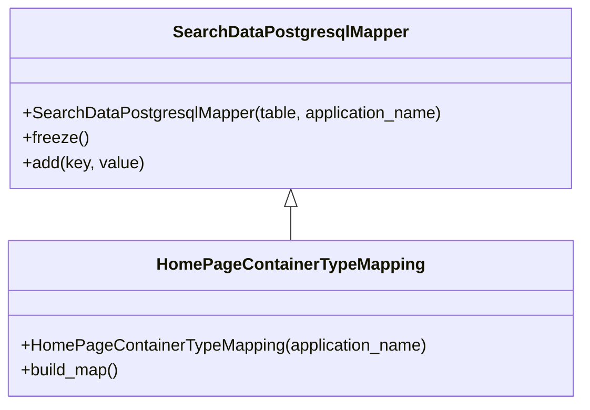

# Diagram: container_tracking_core/container_tracking_service/container_tracking_service/persistence_adapter/postgresql/HomePageContainerTypeMapping.py


> Auto-generated by Obscura crawlers

## Diagram 1



### SVG

<svg id="container" width="555.265625" xmlns="http://www.w3.org/2000/svg" class="classDiagram" height="390" viewBox="0 0 555.265625 390" role="graphics-document document" aria-roledescription="class"><style>#container{font-family:"trebuchet ms",verdana,arial,sans-serif;font-size:16px;fill:#333;}@keyframes edge-animation-frame{from{stroke-dashoffset:0;}}@keyframes dash{to{stroke-dashoffset:0;}}#container .edge-animation-slow{stroke-dasharray:9,5!important;stroke-dashoffset:900;animation:dash 50s linear infinite;stroke-linecap:round;}#container .edge-animation-fast{stroke-dasharray:9,5!important;stroke-dashoffset:900;animation:dash 20s linear infinite;stroke-linecap:round;}#container .error-icon{fill:#552222;}#container .error-text{fill:#552222;stroke:#552222;}#container .edge-thickness-normal{stroke-width:1px;}#container .edge-thickness-thick{stroke-width:3.5px;}#container .edge-pattern-solid{stroke-dasharray:0;}#container .edge-thickness-invisible{stroke-width:0;fill:none;}#container .edge-pattern-dashed{stroke-dasharray:3;}#container .edge-pattern-dotted{stroke-dasharray:2;}#container .marker{fill:#333333;stroke:#333333;}#container .marker.cross{stroke:#333333;}#container svg{font-family:"trebuchet ms",verdana,arial,sans-serif;font-size:16px;}#container p{margin:0;}#container g.classGroup text{fill:#9370DB;stroke:none;font-family:"trebuchet ms",verdana,arial,sans-serif;font-size:10px;}#container g.classGroup text .title{font-weight:bolder;}#container .nodeLabel,#container .edgeLabel{color:#131300;}#container .edgeLabel .label rect{fill:#ECECFF;}#container .label text{fill:#131300;}#container .labelBkg{background:#ECECFF;}#container .edgeLabel .label span{background:#ECECFF;}#container .classTitle{font-weight:bolder;}#container .node rect,#container .node circle,#container .node ellipse,#container .node polygon,#container .node path{fill:#ECECFF;stroke:#9370DB;stroke-width:1px;}#container .divider{stroke:#9370DB;stroke-width:1;}#container g.clickable{cursor:pointer;}#container g.classGroup rect{fill:#ECECFF;stroke:#9370DB;}#container g.classGroup line{stroke:#9370DB;stroke-width:1;}#container .classLabel .box{stroke:none;stroke-width:0;fill:#ECECFF;opacity:0.5;}#container .classLabel .label{fill:#9370DB;font-size:10px;}#container .relation{stroke:#333333;stroke-width:1;fill:none;}#container .dashed-line{stroke-dasharray:3;}#container .dotted-line{stroke-dasharray:1 2;}#container #compositionStart,#container .composition{fill:#333333!important;stroke:#333333!important;stroke-width:1;}#container #compositionEnd,#container .composition{fill:#333333!important;stroke:#333333!important;stroke-width:1;}#container #dependencyStart,#container .dependency{fill:#333333!important;stroke:#333333!important;stroke-width:1;}#container #dependencyStart,#container .dependency{fill:#333333!important;stroke:#333333!important;stroke-width:1;}#container #extensionStart,#container .extension{fill:transparent!important;stroke:#333333!important;stroke-width:1;}#container #extensionEnd,#container .extension{fill:transparent!important;stroke:#333333!important;stroke-width:1;}#container #aggregationStart,#container .aggregation{fill:transparent!important;stroke:#333333!important;stroke-width:1;}#container #aggregationEnd,#container .aggregation{fill:transparent!important;stroke:#333333!important;stroke-width:1;}#container #lollipopStart,#container .lollipop{fill:#ECECFF!important;stroke:#333333!important;stroke-width:1;}#container #lollipopEnd,#container .lollipop{fill:#ECECFF!important;stroke:#333333!important;stroke-width:1;}#container .edgeTerminals{font-size:11px;line-height:initial;}#container .classTitleText{text-anchor:middle;font-size:18px;fill:#333;}#container .label-icon{display:inline-block;height:1em;overflow:visible;vertical-align:-0.125em;}#container .node .label-icon path{fill:currentColor;stroke:revert;stroke-width:revert;}#container :root{--mermaid-font-family:"trebuchet ms",verdana,arial,sans-serif;}</style><g><defs><marker id="container_class-aggregationStart" class="marker aggregation class" refX="18" refY="7" markerWidth="190" markerHeight="240" orient="auto"><path d="M 18,7 L9,13 L1,7 L9,1 Z"></path></marker></defs><defs><marker id="container_class-aggregationEnd" class="marker aggregation class" refX="1" refY="7" markerWidth="20" markerHeight="28" orient="auto"><path d="M 18,7 L9,13 L1,7 L9,1 Z"></path></marker></defs><defs><marker id="container_class-extensionStart" class="marker extension class" refX="18" refY="7" markerWidth="190" markerHeight="240" orient="auto"><path d="M 1,7 L18,13 V 1 Z"></path></marker></defs><defs><marker id="container_class-extensionEnd" class="marker extension class" refX="1" refY="7" markerWidth="20" markerHeight="28" orient="auto"><path d="M 1,1 V 13 L18,7 Z"></path></marker></defs><defs><marker id="container_class-compositionStart" class="marker composition class" refX="18" refY="7" markerWidth="190" markerHeight="240" orient="auto"><path d="M 18,7 L9,13 L1,7 L9,1 Z"></path></marker></defs><defs><marker id="container_class-compositionEnd" class="marker composition class" refX="1" refY="7" markerWidth="20" markerHeight="28" orient="auto"><path d="M 18,7 L9,13 L1,7 L9,1 Z"></path></marker></defs><defs><marker id="container_class-dependencyStart" class="marker dependency class" refX="6" refY="7" markerWidth="190" markerHeight="240" orient="auto"><path d="M 5,7 L9,13 L1,7 L9,1 Z"></path></marker></defs><defs><marker id="container_class-dependencyEnd" class="marker dependency class" refX="13" refY="7" markerWidth="20" markerHeight="28" orient="auto"><path d="M 18,7 L9,13 L14,7 L9,1 Z"></path></marker></defs><defs><marker id="container_class-lollipopStart" class="marker lollipop class" refX="13" refY="7" markerWidth="190" markerHeight="240" orient="auto"><circle stroke="black" fill="transparent" cx="7" cy="7" r="6"></circle></marker></defs><defs><marker id="container_class-lollipopEnd" class="marker lollipop class" refX="1" refY="7" markerWidth="190" markerHeight="240" orient="auto"><circle stroke="black" fill="transparent" cx="7" cy="7" r="6"></circle></marker></defs><g class="root"><g class="clusters"></g><g class="edgePaths"><path d="M277.633,199.25L277.633,200.542C277.633,201.833,277.633,204.417,277.633,209.875C277.633,215.333,277.633,223.667,277.633,227.833L277.633,232" id="id_SearchDataPostgresqlMapper_HomePageContainerTypeMapping_1" class="edge-thickness-normal edge-pattern-solid relation" style=";;;" data-edge="true" data-et="edge" data-id="id_SearchDataPostgresqlMapper_HomePageContainerTypeMapping_1" data-points="W3sieCI6Mjc3LjYzMjgxMjUsInkiOjE4Mn0seyJ4IjoyNzcuNjMyODEyNSwieSI6MjA3fSx7IngiOjI3Ny42MzI4MTI1LCJ5IjoyMzJ9XQ==" marker-start="url(#container_class-extensionStart)"></path></g><g class="edgeLabels"><g class="edgeLabel"><g class="label" data-id="id_SearchDataPostgresqlMapper_HomePageContainerTypeMapping_1" transform="translate(0, 0)"><foreignObject width="0" height="0"><div xmlns="http://www.w3.org/1999/xhtml" class="labelBkg" style="display: table-cell; white-space: nowrap; line-height: 1.5; max-width: 200px; text-align: center;"><span class="edgeLabel"></span></div></foreignObject></g></g></g><g class="nodes"><g class="node default" id="classId-SearchDataPostgresqlMapper-0" transform="translate(277.6328125, 95)"><g class="basic label-container"><path d="M-269.37109375 -87 L269.37109375 -87 L269.37109375 87 L-269.37109375 87" stroke="none" stroke-width="0" fill="#ECECFF" style=""></path><path d="M-269.37109375 -87 C-87.94552404503969 -87, 93.48004565992062 -87, 269.37109375 -87 M-269.37109375 -87 C-112.13181552263126 -87, 45.107462704737486 -87, 269.37109375 -87 M269.37109375 -87 C269.37109375 -33.81152984748537, 269.37109375 19.376940305029265, 269.37109375 87 M269.37109375 -87 C269.37109375 -51.04495396143663, 269.37109375 -15.089907922873266, 269.37109375 87 M269.37109375 87 C161.28462227463967 87, 53.19815079927932 87, -269.37109375 87 M269.37109375 87 C83.15698390553439 87, -103.05712593893122 87, -269.37109375 87 M-269.37109375 87 C-269.37109375 27.24365423588094, -269.37109375 -32.51269152823812, -269.37109375 -87 M-269.37109375 87 C-269.37109375 22.241199633564435, -269.37109375 -42.51760073287113, -269.37109375 -87" stroke="#9370DB" stroke-width="1.3" fill="none" stroke-dasharray="0 0" style=""></path></g><g class="annotation-group text" transform="translate(0, -63)"></g><g class="label-group text" transform="translate(-108.3515625, -63)"><g class="label" style="font-weight: bolder" transform="translate(0,-12)"><foreignObject width="216.703125" height="24"><div xmlns="http://www.w3.org/1999/xhtml" style="display: table-cell; white-space: nowrap; line-height: 1.5; max-width: 263px; text-align: center;"><span class="nodeLabel markdown-node-label" style=""><p>SearchDataPostgresqlMapper</p></span></div></foreignObject></g></g><g class="members-group text" transform="translate(-257.37109375, -15)"></g><g class="methods-group text" transform="translate(-257.37109375, 15)"><g class="label" style="" transform="translate(0,-12)"><foreignObject width="406.390625" height="24"><div xmlns="http://www.w3.org/1999/xhtml" style="display: table-cell; white-space: nowrap; line-height: 1.5; max-width: 464px; text-align: center;"><span class="nodeLabel markdown-node-label" style=""><p>+SearchDataPostgresqlMapper(table, application_name)</p></span></div></foreignObject></g><g class="label" style="" transform="translate(0,12)"><foreignObject width="62.109375" height="24"><div xmlns="http://www.w3.org/1999/xhtml" style="display: table-cell; white-space: nowrap; line-height: 1.5; max-width: 119px; text-align: center;"><span class="nodeLabel markdown-node-label" style=""><p>+freeze()</p></span></div></foreignObject></g><g class="label" style="" transform="translate(0,36)"><foreignObject width="116.859375" height="24"><div xmlns="http://www.w3.org/1999/xhtml" style="display: table-cell; white-space: nowrap; line-height: 1.5; max-width: 174px; text-align: center;"><span class="nodeLabel markdown-node-label" style=""><p>+add(key, value)</p></span></div></foreignObject></g></g><g class="divider" style=""><path d="M-269.37109375 -39 C-103.85187666730033 -39, 61.66734041539934 -39, 269.37109375 -39 M-269.37109375 -39 C-137.54049775695947 -39, -5.709901763918936 -39, 269.37109375 -39" stroke="#9370DB" stroke-width="1.3" fill="none" stroke-dasharray="0 0" style=""></path></g><g class="divider" style=""><path d="M-269.37109375 -15 C-94.74907351493295 -15, 79.87294672013411 -15, 269.37109375 -15 M-269.37109375 -15 C-119.29150139010954 -15, 30.78809096978091 -15, 269.37109375 -15" stroke="#9370DB" stroke-width="1.3" fill="none" stroke-dasharray="0 0" style=""></path></g></g><g class="node default" id="classId-HomePageContainerTypeMapping-1" transform="translate(277.6328125, 307)"><g class="basic label-container"><path d="M-269.6328125 -75 L269.6328125 -75 L269.6328125 75 L-269.6328125 75" stroke="none" stroke-width="0" fill="#ECECFF" style=""></path><path d="M-269.6328125 -75 C-141.3444809763128 -75, -13.056149452625618 -75, 269.6328125 -75 M-269.6328125 -75 C-134.32162827718594 -75, 0.9895559456281262 -75, 269.6328125 -75 M269.6328125 -75 C269.6328125 -26.810538025840316, 269.6328125 21.37892394831937, 269.6328125 75 M269.6328125 -75 C269.6328125 -44.7627459021608, 269.6328125 -14.525491804321597, 269.6328125 75 M269.6328125 75 C104.6668076063709 75, -60.29919728725821 75, -269.6328125 75 M269.6328125 75 C87.16618297402312 75, -95.30044655195377 75, -269.6328125 75 M-269.6328125 75 C-269.6328125 22.17414603258422, -269.6328125 -30.651707934831563, -269.6328125 -75 M-269.6328125 75 C-269.6328125 41.1040723416298, -269.6328125 7.208144683259604, -269.6328125 -75" stroke="#9370DB" stroke-width="1.3" fill="none" stroke-dasharray="0 0" style=""></path></g><g class="annotation-group text" transform="translate(0, -51)"></g><g class="label-group text" transform="translate(-122.953125, -51)"><g class="label" style="font-weight: bolder" transform="translate(0,-12)"><foreignObject width="245.90625" height="24"><div xmlns="http://www.w3.org/1999/xhtml" style="display: table-cell; white-space: nowrap; line-height: 1.5; max-width: 294px; text-align: center;"><span class="nodeLabel markdown-node-label" style=""><p>HomePageContainerTypeMapping</p></span></div></foreignObject></g></g><g class="members-group text" transform="translate(-257.6328125, -3)"></g><g class="methods-group text" transform="translate(-257.6328125, 27)"><g class="label" style="" transform="translate(0,-12)"><foreignObject width="392.3125" height="24"><div xmlns="http://www.w3.org/1999/xhtml" style="display: table-cell; white-space: nowrap; line-height: 1.5; max-width: 450px; text-align: center;"><span class="nodeLabel markdown-node-label" style=""><p>+HomePageContainerTypeMapping(application_name)</p></span></div></foreignObject></g><g class="label" style="" transform="translate(0,12)"><foreignObject width="96.109375" height="24"><div xmlns="http://www.w3.org/1999/xhtml" style="display: table-cell; white-space: nowrap; line-height: 1.5; max-width: 153px; text-align: center;"><span class="nodeLabel markdown-node-label" style=""><p>+build_map()</p></span></div></foreignObject></g></g><g class="divider" style=""><path d="M-269.6328125 -27 C-159.7589711110472 -27, -49.885129722094405 -27, 269.6328125 -27 M-269.6328125 -27 C-74.48085809678432 -27, 120.67109630643137 -27, 269.6328125 -27" stroke="#9370DB" stroke-width="1.3" fill="none" stroke-dasharray="0 0" style=""></path></g><g class="divider" style=""><path d="M-269.6328125 -3 C-101.00824698859952 -3, 67.61631852280095 -3, 269.6328125 -3 M-269.6328125 -3 C-152.38248126659528 -3, -35.132150033190555 -3, 269.6328125 -3" stroke="#9370DB" stroke-width="1.3" fill="none" stroke-dasharray="0 0" style=""></path></g></g></g></g></g></svg>

## Diagram 2

```mermaid
flowchart LR
    Start((Start)) --> Init[super().__init__('public.vw_reuse_trip_container_last_event_005', application_name)]
    Init --> Freeze[super().freeze()]
    Freeze --> Build[build_map()]
    Build --> A[add(container_type → container_type)]
    A --> B[add(total → total)]
    B --> C[add(onsiteAtAssembly → onsiteAtAssembly)]
    C --> D[add(onsiteAtODC → onsiteAtODC)]
    D --> E[add(onsiteAtSupplier → onsiteAtSupplier)]
    E --> F[add(onsiteAtUndefined → onsiteAtUndefined)]
    F --> G[add(inTransit → inTransit)]
    G --> H[add(unaccounted → unaccounted)]
    H --> I[add(excessiveDwell → excessiveDwell)]
    I --> J[add(noUpdateThirtyDays → noUpdateThirtyDays)]
    J --> K[add(offRoute → offRoute)]
    K --> L[add(batteryLevel → batteryLevel)]
    L --> M[add(full_count → full_count)]
    M --> End((End))
```

> SVG rendering failed for this diagram.
