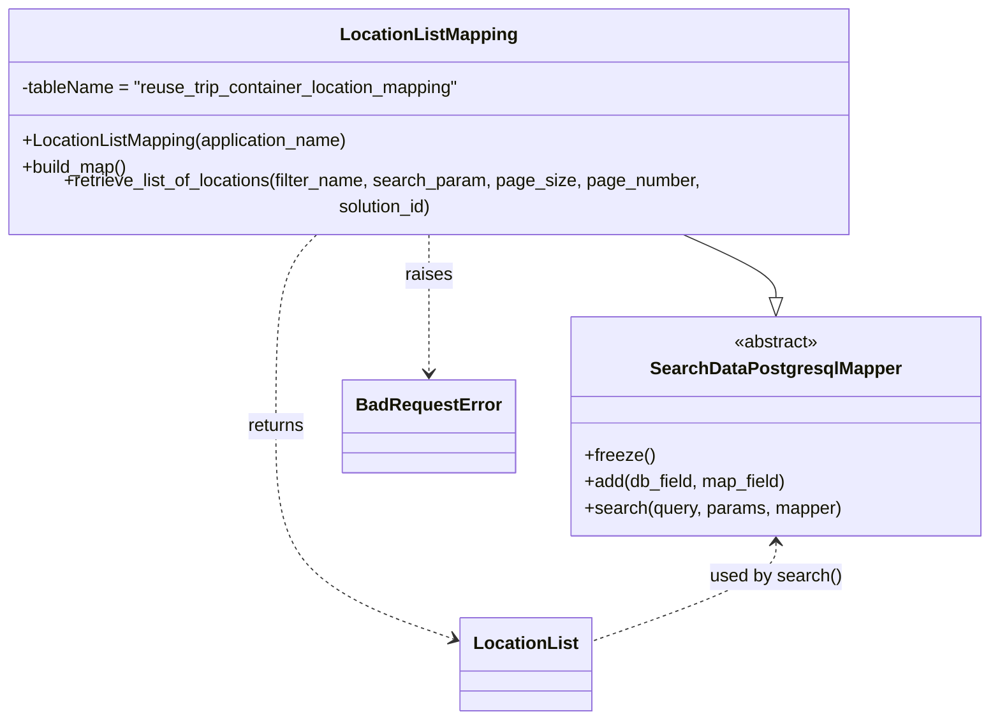

# Diagram: container_tracking_core/container_tracking_service/container_tracking_service/persistence_adapter/postgresql/LocationListMapping.py


> Auto-generated by Obscura crawlers

## Diagram 1



> SVG rendering failed for this diagram.

## Diagram 2

```mermaid
flowchart TB
Start([Start]) --> CheckFilter{filter_name == ?}
CheckFilter -->|location_code| LocationCode["Build query for location_code\nuses vw_reuse_trip_container_last_event_005\nsearch_condition on alternate_location_code or location_name"]
CheckFilter -->|locations_on_route| LocationsOnRoute["Build query for locations_on_route\njoins locations_to_buckets, buckets, container_to_buckets\nsearch_condition on location_code or location_name"]
CheckFilter -->|sensor_locations| SensorLocations["Build query for sensor_locations\njoins sensor_update and sensor\nsearch_condition on location_code or location_name"]
CheckFilter -->|other| BadReq([Raise BadRequestError: \"Invalid filter name has been passed\"])
LocationCode --> HasQuery{query set?}
LocationsOnRoute --> HasQuery
SensorLocations --> HasQuery
HasQuery -->|yes| ExecuteSearch[self.search(query, {}, LocationList())]
HasQuery -->|no| BadReq
ExecuteSearch --> Return([return results])
BadReq --> Error([Error thrown])
```

> SVG rendering failed for this diagram.
