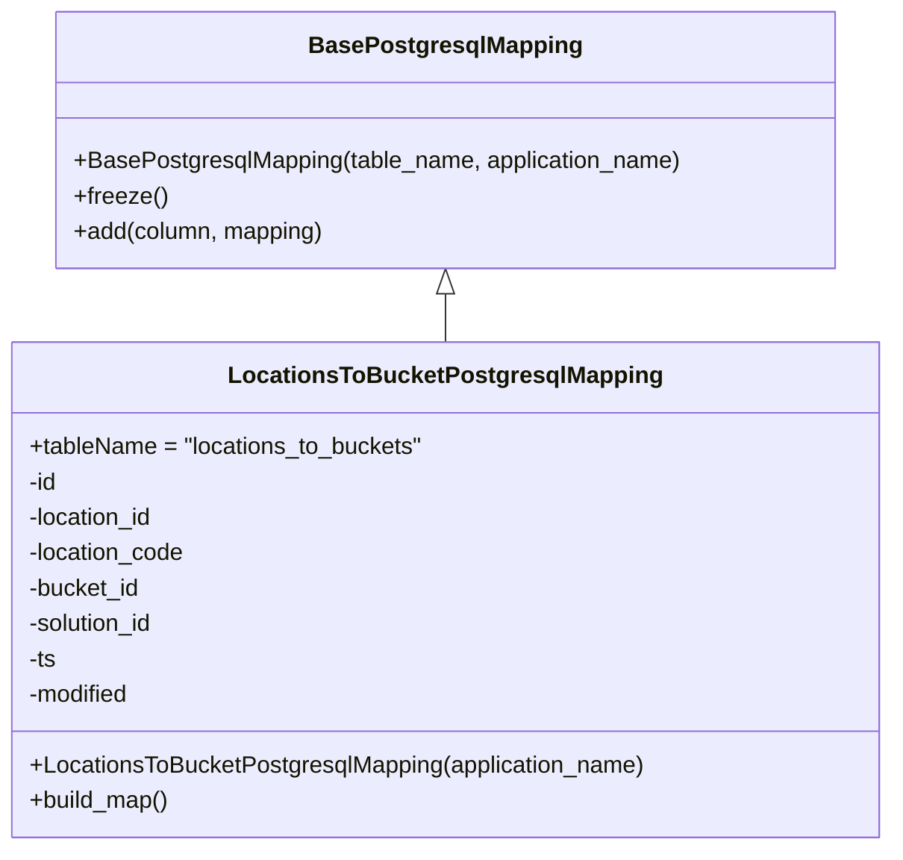

# Diagram: container_tracking_core/container_tracking_service/container_tracking_service/persistence_adapter/postgresql/LocationsToBucketMapping.py

> Auto-generated by Obscura crawlers

## Mermaid

### SVG

<svg id="container" width="602.1796875" xmlns="http://www.w3.org/2000/svg" class="classDiagram" height="576" viewBox="0 0 602.1796875 576" role="graphics-document document" aria-roledescription="class"><g><defs><marker id="container_class-aggregationStart" class="marker aggregation class" refX="18" refY="7" markerWidth="190" markerHeight="240" orient="auto"><path d="M 18,7 L9,13 L1,7 L9,1 Z"></path></marker></defs><defs><marker id="container_class-aggregationEnd" class="marker aggregation class" refX="1" refY="7" markerWidth="20" markerHeight="28" orient="auto"><path d="M 18,7 L9,13 L1,7 L9,1 Z"></path></marker></defs><defs><marker id="container_class-extensionStart" class="marker extension class" refX="18" refY="7" markerWidth="190" markerHeight="240" orient="auto"><path d="M 1,7 L18,13 V 1 Z"></path></marker></defs><defs><marker id="container_class-extensionEnd" class="marker extension class" refX="1" refY="7" markerWidth="20" markerHeight="28" orient="auto"><path d="M 1,1 V 13 L18,7 Z"></path></marker></defs><defs><marker id="container_class-compositionStart" class="marker composition class" refX="18" refY="7" markerWidth="190" markerHeight="240" orient="auto"><path d="M 18,7 L9,13 L1,7 L9,1 Z"></path></marker></defs><defs><marker id="container_class-compositionEnd" class="marker composition class" refX="1" refY="7" markerWidth="20" markerHeight="28" orient="auto"><path d="M 18,7 L9,13 L1,7 L9,1 Z"></path></marker></defs><defs><marker id="container_class-dependencyStart" class="marker dependency class" refX="6" refY="7" markerWidth="190" markerHeight="240" orient="auto"><path d="M 5,7 L9,13 L1,7 L9,1 Z"></path></marker></defs><defs><marker id="container_class-dependencyEnd" class="marker dependency class" refX="13" refY="7" markerWidth="20" markerHeight="28" orient="auto"><path d="M 18,7 L9,13 L14,7 L9,1 Z"></path></marker></defs><defs><marker id="container_class-lollipopStart" class="marker lollipop class" refX="13" refY="7" markerWidth="190" markerHeight="240" orient="auto"><circle stroke="black" fill="transparent" cx="7" cy="7" r="6"></circle></marker></defs><defs><marker id="container_class-lollipopEnd" class="marker lollipop class" refX="1" refY="7" markerWidth="190" markerHeight="240" orient="auto"><circle stroke="black" fill="transparent" cx="7" cy="7" r="6"></circle></marker></defs><g class="root"><g class="clusters"></g><g class="edgePaths"><path d="M301.09,199.25L301.09,200.542C301.09,201.833,301.09,204.417,301.09,209.875C301.09,215.333,301.09,223.667,301.09,227.833L301.09,232" id="id_BasePostgresqlMapping_LocationsToBucketPostgresqlMapping_1" class="edge-thickness-normal edge-pattern-solid relation" style=";;;" data-edge="true" data-et="edge" data-id="id_BasePostgresqlMapping_LocationsToBucketPostgresqlMapping_1" data-points="W3sieCI6MzAxLjA4OTg0Mzc1LCJ5IjoxODJ9LHsieCI6MzAxLjA4OTg0Mzc1LCJ5IjoyMDd9LHsieCI6MzAxLjA4OTg0Mzc1LCJ5IjoyMzJ9XQ==" marker-start="url(#container_class-extensionStart)"></path></g><g class="edgeLabels"><g class="edgeLabel"><g class="label" data-id="id_BasePostgresqlMapping_LocationsToBucketPostgresqlMapping_1" transform="translate(0, 0)"><foreignObject width="0" height="0">

</foreignObject></g></g></g><g class="nodes"><g class="node default" id="classId-BasePostgresqlMapping-0" transform="translate(301.08984375, 95)"><g class="basic label-container"><path d="M-263.6640625 -87 L263.6640625 -87 L263.6640625 87 L-263.6640625 87" stroke="none" stroke-width="0" fill="#ECECFF" style=""></path><path d="M-263.6640625 -87 C-68.31914461895013 -87, 127.02577326209973 -87, 263.6640625 -87 M-263.6640625 -87 C-71.4566623755075 -87, 120.75073774898499 -87, 263.6640625 -87 M263.6640625 -87 C263.6640625 -33.88595790083271, 263.6640625 19.228084198334585, 263.6640625 87 M263.6640625 -87 C263.6640625 -38.28886244355532, 263.6640625 10.422275112889366, 263.6640625 87 M263.6640625 87 C54.44856709973419 87, -154.76692830053162 87, -263.6640625 87 M263.6640625 87 C117.70975548547301 87, -28.24455152905398 87, -263.6640625 87 M-263.6640625 87 C-263.6640625 17.813515713647462, -263.6640625 -51.372968572705076, -263.6640625 -87 M-263.6640625 87 C-263.6640625 33.94014505584013, -263.6640625 -19.119709888319747, -263.6640625 -87" stroke="#9370DB" stroke-width="1.3" fill="none" stroke-dasharray="0 0" style=""></path></g><g class="annotation-group text" transform="translate(0, -63)"></g><g class="label-group text" transform="translate(-87.921875, -63)"><g class="label" style="font-weight: bolder" transform="translate(0,-12)"><foreignObject width="175.84375" height="24">

BasePostgresqlMapping

</foreignObject></g></g><g class="members-group text" transform="translate(-251.6640625, -15)"></g><g class="methods-group text" transform="translate(-251.6640625, 15)"><g class="label" style="" transform="translate(0,-12)"><foreignObject width="415.40625" height="24">

+BasePostgresqlMapping(table_name, application_name)

</foreignObject></g><g class="label" style="" transform="translate(0,12)"><foreignObject width="62.109375" height="24">

+freeze()

</foreignObject></g><g class="label" style="" transform="translate(0,36)"><foreignObject width="171.4375" height="24">

+add(column, mapping)

</foreignObject></g></g><g class="divider" style=""><path d="M-263.6640625 -39 C-151.74015532719372 -39, -39.81624815438744 -39, 263.6640625 -39 M-263.6640625 -39 C-96.0390398532814 -39, 71.58598279343721 -39, 263.6640625 -39" stroke="#9370DB" stroke-width="1.3" fill="none" stroke-dasharray="0 0" style=""></path></g><g class="divider" style=""><path d="M-263.6640625 -15 C-55.32694320281473 -15, 153.01017609437054 -15, 263.6640625 -15 M-263.6640625 -15 C-154.62230354800215 -15, -45.5805445960043 -15, 263.6640625 -15" stroke="#9370DB" stroke-width="1.3" fill="none" stroke-dasharray="0 0" style=""></path></g></g><g class="node default" id="classId-LocationsToBucketPostgresqlMapping-1" transform="translate(301.08984375, 400)"><g class="basic label-container"><path d="M-293.08984375 -168 L293.08984375 -168 L293.08984375 168 L-293.08984375 168" stroke="none" stroke-width="0" fill="#ECECFF" style=""></path><path d="M-293.08984375 -168 C-65.74759931219162 -168, 161.59464512561675 -168, 293.08984375 -168 M-293.08984375 -168 C-65.75085571093084 -168, 161.58813232813833 -168, 293.08984375 -168 M293.08984375 -168 C293.08984375 -72.60321865749903, 293.08984375 22.793562685001945, 293.08984375 168 M293.08984375 -168 C293.08984375 -67.07633676798574, 293.08984375 33.84732646402853, 293.08984375 168 M293.08984375 168 C121.25649087792212 168, -50.57686199415576 168, -293.08984375 168 M293.08984375 168 C85.41388454935415 168, -122.2620746512917 168, -293.08984375 168 M-293.08984375 168 C-293.08984375 37.35418519925145, -293.08984375 -93.2916296014971, -293.08984375 -168 M-293.08984375 168 C-293.08984375 75.92200034478574, -293.08984375 -16.155999310428513, -293.08984375 -168" stroke="#9370DB" stroke-width="1.3" fill="none" stroke-dasharray="0 0" style=""></path></g><g class="annotation-group text" transform="translate(0, -144)"></g><g class="label-group text" transform="translate(-139.3203125, -144)"><g class="label" style="font-weight: bolder" transform="translate(0,-12)"><foreignObject width="278.640625" height="24">

LocationsToBucketPostgresqlMapping

</foreignObject></g></g><g class="members-group text" transform="translate(-281.08984375, -96)"><g class="label" style="" transform="translate(0,-12)"><foreignObject width="269.84375" height="24">

+tableName = "locations_to_buckets"

</foreignObject></g><g class="label" style="" transform="translate(0,12)"><foreignObject width="20.53125" height="24">

-id

</foreignObject></g><g class="label" style="" transform="translate(0,36)"><foreignObject width="88.015625" height="24">

-location_id

</foreignObject></g><g class="label" style="" transform="translate(0,60)"><foreignObject width="108.5625" height="24">

-location_code

</foreignObject></g><g class="label" style="" transform="translate(0,84)"><foreignObject width="77.859375" height="24">

-bucket_id

</foreignObject></g><g class="label" style="" transform="translate(0,108)"><foreignObject width="88.6875" height="24">

-solution_id

</foreignObject></g><g class="label" style="" transform="translate(0,132)"><foreignObject width="19.625" height="24">

-ts

</foreignObject></g><g class="label" style="" transform="translate(0,156)"><foreignObject width="71.078125" height="24">

-modified

</foreignObject></g></g><g class="methods-group text" transform="translate(-281.08984375, 120)"><g class="label" style="" transform="translate(0,-12)"><foreignObject width="422.859375" height="24">

+LocationsToBucketPostgresqlMapping(application_name)

</foreignObject></g><g class="label" style="" transform="translate(0,12)"><foreignObject width="96.109375" height="24">

+build_map()

</foreignObject></g></g><g class="divider" style=""><path d="M-293.08984375 -120 C-96.58301952570326 -120, 99.92380469859347 -120, 293.08984375 -120 M-293.08984375 -120 C-128.58635070078122 -120, 35.91714234843755 -120, 293.08984375 -120" stroke="#9370DB" stroke-width="1.3" fill="none" stroke-dasharray="0 0" style=""></path></g><g class="divider" style=""><path d="M-293.08984375 96 C-81.46094433660383 96, 130.16795507679234 96, 293.08984375 96 M-293.08984375 96 C-91.7606604755075 96, 109.56852279898499 96, 293.08984375 96" stroke="#9370DB" stroke-width="1.3" fill="none" stroke-dasharray="0 0" style=""></path></g></g></g></g></g></svg>
