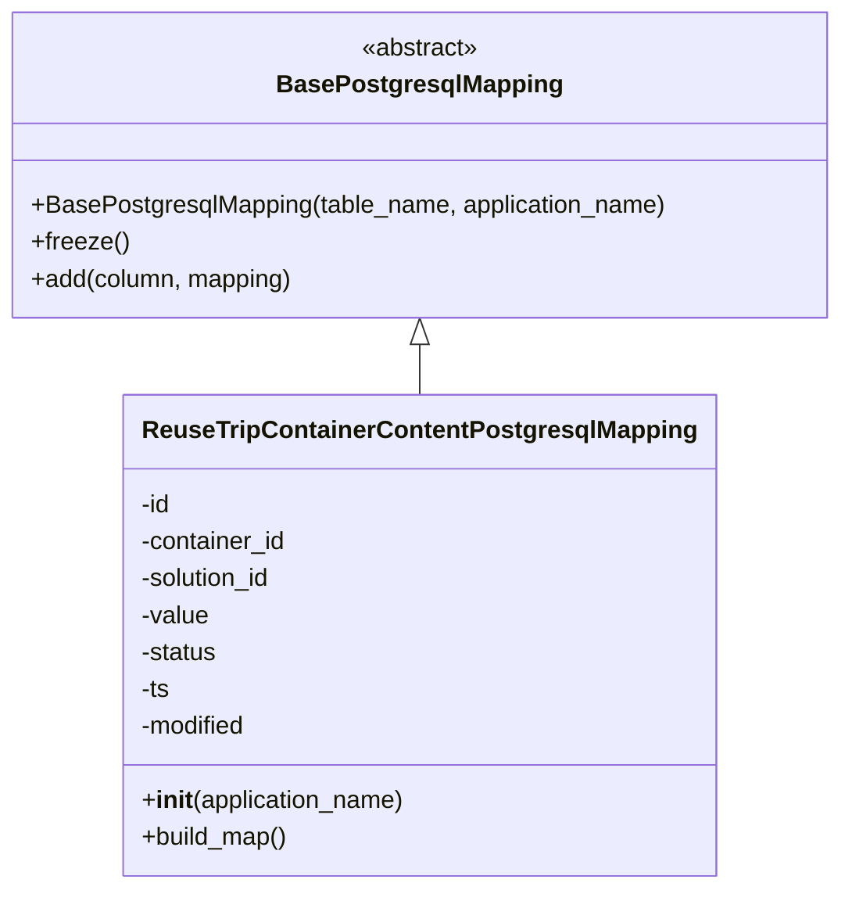

# Diagram: container_tracking_core/container_tracking_service/container_tracking_service/persistence_adapter/postgresql/ReuseTripContainerContentPostgresqlMapping.py

> Auto-generated by Obscura crawlers

## Mermaid

### SVG

<svg id="container" width="543.328125" xmlns="http://www.w3.org/2000/svg" class="classDiagram" height="576" viewBox="0 0 543.328125 576" role="graphics-document document" aria-roledescription="class"><g><defs><marker id="container_class-aggregationStart" class="marker aggregation class" refX="18" refY="7" markerWidth="190" markerHeight="240" orient="auto"><path d="M 18,7 L9,13 L1,7 L9,1 Z"></path></marker></defs><defs><marker id="container_class-aggregationEnd" class="marker aggregation class" refX="1" refY="7" markerWidth="20" markerHeight="28" orient="auto"><path d="M 18,7 L9,13 L1,7 L9,1 Z"></path></marker></defs><defs><marker id="container_class-extensionStart" class="marker extension class" refX="18" refY="7" markerWidth="190" markerHeight="240" orient="auto"><path d="M 1,7 L18,13 V 1 Z"></path></marker></defs><defs><marker id="container_class-extensionEnd" class="marker extension class" refX="1" refY="7" markerWidth="20" markerHeight="28" orient="auto"><path d="M 1,1 V 13 L18,7 Z"></path></marker></defs><defs><marker id="container_class-compositionStart" class="marker composition class" refX="18" refY="7" markerWidth="190" markerHeight="240" orient="auto"><path d="M 18,7 L9,13 L1,7 L9,1 Z"></path></marker></defs><defs><marker id="container_class-compositionEnd" class="marker composition class" refX="1" refY="7" markerWidth="20" markerHeight="28" orient="auto"><path d="M 18,7 L9,13 L1,7 L9,1 Z"></path></marker></defs><defs><marker id="container_class-dependencyStart" class="marker dependency class" refX="6" refY="7" markerWidth="190" markerHeight="240" orient="auto"><path d="M 5,7 L9,13 L1,7 L9,1 Z"></path></marker></defs><defs><marker id="container_class-dependencyEnd" class="marker dependency class" refX="13" refY="7" markerWidth="20" markerHeight="28" orient="auto"><path d="M 18,7 L9,13 L14,7 L9,1 Z"></path></marker></defs><defs><marker id="container_class-lollipopStart" class="marker lollipop class" refX="13" refY="7" markerWidth="190" markerHeight="240" orient="auto"><circle stroke="black" fill="transparent" cx="7" cy="7" r="6"></circle></marker></defs><defs><marker id="container_class-lollipopEnd" class="marker lollipop class" refX="1" refY="7" markerWidth="190" markerHeight="240" orient="auto"><circle stroke="black" fill="transparent" cx="7" cy="7" r="6"></circle></marker></defs><g class="root"><g class="clusters"></g><g class="edgePaths"><path d="M271.664,223.25L271.664,224.542C271.664,225.833,271.664,228.417,271.664,233.875C271.664,239.333,271.664,247.667,271.664,251.833L271.664,256" id="id_BasePostgresqlMapping_ReuseTripContainerContentPostgresqlMapping_1" class="edge-thickness-normal edge-pattern-solid relation" style=";;;" data-edge="true" data-et="edge" data-id="id_BasePostgresqlMapping_ReuseTripContainerContentPostgresqlMapping_1" data-points="W3sieCI6MjcxLjY2NDA2MjUsInkiOjIwNn0seyJ4IjoyNzEuNjY0MDYyNSwieSI6MjMxfSx7IngiOjI3MS42NjQwNjI1LCJ5IjoyNTZ9XQ==" marker-start="url(#container_class-extensionStart)"></path></g><g class="edgeLabels"><g class="edgeLabel"><g class="label" data-id="id_BasePostgresqlMapping_ReuseTripContainerContentPostgresqlMapping_1" transform="translate(0, 0)"><foreignObject width="0" height="0">

</foreignObject></g></g></g><g class="nodes"><g class="node default" id="classId-BasePostgresqlMapping-0" transform="translate(271.6640625, 107)"><g class="basic label-container"><path d="M-263.6640625 -99 L263.6640625 -99 L263.6640625 99 L-263.6640625 99" stroke="none" stroke-width="0" fill="#ECECFF" style=""></path><path d="M-263.6640625 -99 C-75.081567779544 -99, 113.500926940912 -99, 263.6640625 -99 M-263.6640625 -99 C-103.74286733454841 -99, 56.178327830903186 -99, 263.6640625 -99 M263.6640625 -99 C263.6640625 -24.52552268615969, 263.6640625 49.94895462768062, 263.6640625 99 M263.6640625 -99 C263.6640625 -35.44963016809227, 263.6640625 28.10073966381546, 263.6640625 99 M263.6640625 99 C142.25442705144638 99, 20.84479160289274 99, -263.6640625 99 M263.6640625 99 C133.9353805395951 99, 4.206698579190174 99, -263.6640625 99 M-263.6640625 99 C-263.6640625 38.85600274819808, -263.6640625 -21.28799450360384, -263.6640625 -99 M-263.6640625 99 C-263.6640625 48.85953586172669, -263.6640625 -1.280928276546618, -263.6640625 -99" stroke="#9370DB" stroke-width="1.3" fill="none" stroke-dasharray="0 0" style=""></path></g><g class="annotation-group text" transform="translate(-38.609375, -75)"><g class="label" style="" transform="translate(0,-12)"><foreignObject width="77.21875" height="24">

«abstract»

</foreignObject></g></g><g class="label-group text" transform="translate(-87.921875, -51)"><g class="label" style="font-weight: bolder" transform="translate(0,-12)"><foreignObject width="175.84375" height="24">

BasePostgresqlMapping

</foreignObject></g></g><g class="members-group text" transform="translate(-251.6640625, -3)"></g><g class="methods-group text" transform="translate(-251.6640625, 27)"><g class="label" style="" transform="translate(0,-12)"><foreignObject width="415.40625" height="24">

+BasePostgresqlMapping(table_name, application_name)

</foreignObject></g><g class="label" style="" transform="translate(0,12)"><foreignObject width="62.109375" height="24">

+freeze()

</foreignObject></g><g class="label" style="" transform="translate(0,36)"><foreignObject width="171.4375" height="24">

+add(column, mapping)

</foreignObject></g></g><g class="divider" style=""><path d="M-263.6640625 -27 C-156.42577737009555 -27, -49.18749224019109 -27, 263.6640625 -27 M-263.6640625 -27 C-144.01308764291548 -27, -24.362112785830988 -27, 263.6640625 -27" stroke="#9370DB" stroke-width="1.3" fill="none" stroke-dasharray="0 0" style=""></path></g><g class="divider" style=""><path d="M-263.6640625 -3 C-134.94495817403782 -3, -6.225853848075644 -3, 263.6640625 -3 M-263.6640625 -3 C-87.38083301057566 -3, 88.90239647884869 -3, 263.6640625 -3" stroke="#9370DB" stroke-width="1.3" fill="none" stroke-dasharray="0 0" style=""></path></g></g><g class="node default" id="classId-ReuseTripContainerContentPostgresqlMapping-1" transform="translate(271.6640625, 412)"><g class="basic label-container"><path d="M-184.46875 -156 L184.46875 -156 L184.46875 156 L-184.46875 156" stroke="none" stroke-width="0" fill="#ECECFF" style=""></path><path d="M-184.46875 -156 C-90.98885675564007 -156, 2.491036488719857 -156, 184.46875 -156 M-184.46875 -156 C-38.550558632831866 -156, 107.36763273433627 -156, 184.46875 -156 M184.46875 -156 C184.46875 -50.764352032907695, 184.46875 54.47129593418461, 184.46875 156 M184.46875 -156 C184.46875 -50.31060181716643, 184.46875 55.37879636566714, 184.46875 156 M184.46875 156 C76.8183197948477 156, -30.832110410304608 156, -184.46875 156 M184.46875 156 C96.32067437397745 156, 8.172598747954908 156, -184.46875 156 M-184.46875 156 C-184.46875 87.31180285246859, -184.46875 18.623605704937177, -184.46875 -156 M-184.46875 156 C-184.46875 55.65026189213974, -184.46875 -44.69947621572052, -184.46875 -156" stroke="#9370DB" stroke-width="1.3" fill="none" stroke-dasharray="0 0" style=""></path></g><g class="annotation-group text" transform="translate(0, -132)"></g><g class="label-group text" transform="translate(-171.203125, -132)"><g class="label" style="font-weight: bolder" transform="translate(0,-12)"><foreignObject width="342.40625" height="24">

ReuseTripContainerContentPostgresqlMapping

</foreignObject></g></g><g class="members-group text" transform="translate(-172.46875, -84)"><g class="label" style="" transform="translate(0,-12)"><foreignObject width="20.53125" height="24">

-id

</foreignObject></g><g class="label" style="" transform="translate(0,12)"><foreignObject width="96.78125" height="24">

-container_id

</foreignObject></g><g class="label" style="" transform="translate(0,36)"><foreignObject width="88.6875" height="24">

-solution_id

</foreignObject></g><g class="label" style="" transform="translate(0,60)"><foreignObject width="45.171875" height="24">

-value

</foreignObject></g><g class="label" style="" transform="translate(0,84)"><foreignObject width="50.859375" height="24">

-status

</foreignObject></g><g class="label" style="" transform="translate(0,108)"><foreignObject width="19.625" height="24">

-ts

</foreignObject></g><g class="label" style="" transform="translate(0,132)"><foreignObject width="71.078125" height="24">

-modified

</foreignObject></g></g><g class="methods-group text" transform="translate(-172.46875, 108)"><g class="label" style="" transform="translate(0,-12)"><foreignObject width="173.734375" height="24">

+<strong>init</strong>(application_name)

</foreignObject></g><g class="label" style="" transform="translate(0,12)"><foreignObject width="96.109375" height="24">

+build_map()

</foreignObject></g></g><g class="divider" style=""><path d="M-184.46875 -108 C-59.67683322620262 -108, 65.11508354759476 -108, 184.46875 -108 M-184.46875 -108 C-58.403725921743 -108, 67.661298156514 -108, 184.46875 -108" stroke="#9370DB" stroke-width="1.3" fill="none" stroke-dasharray="0 0" style=""></path></g><g class="divider" style=""><path d="M-184.46875 84 C-41.600943951693154 84, 101.26686209661369 84, 184.46875 84 M-184.46875 84 C-51.63440159348889 84, 81.19994681302222 84, 184.46875 84" stroke="#9370DB" stroke-width="1.3" fill="none" stroke-dasharray="0 0" style=""></path></g></g></g></g></g></svg>
