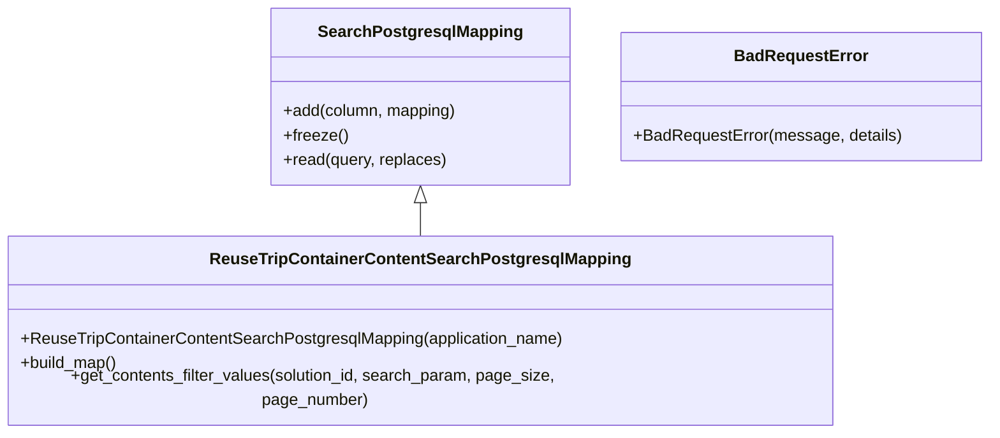

# Diagram: container_tracking_core/container_tracking_service/container_tracking_service/persistence_adapter/postgresql/ReuseTripContainerContentSearchPostgresqlMapping.py


> Auto-generated by Obscura crawlers

## Diagram 1



### SVG

<svg id="container" width="960.640625" xmlns="http://www.w3.org/2000/svg" class="classDiagram" height="414" viewBox="0 0 960.640625 414" role="graphics-document document" aria-roledescription="class"><style>#container{font-family:"trebuchet ms",verdana,arial,sans-serif;font-size:16px;fill:#333;}@keyframes edge-animation-frame{from{stroke-dashoffset:0;}}@keyframes dash{to{stroke-dashoffset:0;}}#container .edge-animation-slow{stroke-dasharray:9,5!important;stroke-dashoffset:900;animation:dash 50s linear infinite;stroke-linecap:round;}#container .edge-animation-fast{stroke-dasharray:9,5!important;stroke-dashoffset:900;animation:dash 20s linear infinite;stroke-linecap:round;}#container .error-icon{fill:#552222;}#container .error-text{fill:#552222;stroke:#552222;}#container .edge-thickness-normal{stroke-width:1px;}#container .edge-thickness-thick{stroke-width:3.5px;}#container .edge-pattern-solid{stroke-dasharray:0;}#container .edge-thickness-invisible{stroke-width:0;fill:none;}#container .edge-pattern-dashed{stroke-dasharray:3;}#container .edge-pattern-dotted{stroke-dasharray:2;}#container .marker{fill:#333333;stroke:#333333;}#container .marker.cross{stroke:#333333;}#container svg{font-family:"trebuchet ms",verdana,arial,sans-serif;font-size:16px;}#container p{margin:0;}#container g.classGroup text{fill:#9370DB;stroke:none;font-family:"trebuchet ms",verdana,arial,sans-serif;font-size:10px;}#container g.classGroup text .title{font-weight:bolder;}#container .nodeLabel,#container .edgeLabel{color:#131300;}#container .edgeLabel .label rect{fill:#ECECFF;}#container .label text{fill:#131300;}#container .labelBkg{background:#ECECFF;}#container .edgeLabel .label span{background:#ECECFF;}#container .classTitle{font-weight:bolder;}#container .node rect,#container .node circle,#container .node ellipse,#container .node polygon,#container .node path{fill:#ECECFF;stroke:#9370DB;stroke-width:1px;}#container .divider{stroke:#9370DB;stroke-width:1;}#container g.clickable{cursor:pointer;}#container g.classGroup rect{fill:#ECECFF;stroke:#9370DB;}#container g.classGroup line{stroke:#9370DB;stroke-width:1;}#container .classLabel .box{stroke:none;stroke-width:0;fill:#ECECFF;opacity:0.5;}#container .classLabel .label{fill:#9370DB;font-size:10px;}#container .relation{stroke:#333333;stroke-width:1;fill:none;}#container .dashed-line{stroke-dasharray:3;}#container .dotted-line{stroke-dasharray:1 2;}#container #compositionStart,#container .composition{fill:#333333!important;stroke:#333333!important;stroke-width:1;}#container #compositionEnd,#container .composition{fill:#333333!important;stroke:#333333!important;stroke-width:1;}#container #dependencyStart,#container .dependency{fill:#333333!important;stroke:#333333!important;stroke-width:1;}#container #dependencyStart,#container .dependency{fill:#333333!important;stroke:#333333!important;stroke-width:1;}#container #extensionStart,#container .extension{fill:transparent!important;stroke:#333333!important;stroke-width:1;}#container #extensionEnd,#container .extension{fill:transparent!important;stroke:#333333!important;stroke-width:1;}#container #aggregationStart,#container .aggregation{fill:transparent!important;stroke:#333333!important;stroke-width:1;}#container #aggregationEnd,#container .aggregation{fill:transparent!important;stroke:#333333!important;stroke-width:1;}#container #lollipopStart,#container .lollipop{fill:#ECECFF!important;stroke:#333333!important;stroke-width:1;}#container #lollipopEnd,#container .lollipop{fill:#ECECFF!important;stroke:#333333!important;stroke-width:1;}#container .edgeTerminals{font-size:11px;line-height:initial;}#container .classTitleText{text-anchor:middle;font-size:18px;fill:#333;}#container .label-icon{display:inline-block;height:1em;overflow:visible;vertical-align:-0.125em;}#container .node .label-icon path{fill:currentColor;stroke:revert;stroke-width:revert;}#container :root{--mermaid-font-family:"trebuchet ms",verdana,arial,sans-serif;}</style><g><defs><marker id="container_class-aggregationStart" class="marker aggregation class" refX="18" refY="7" markerWidth="190" markerHeight="240" orient="auto"><path d="M 18,7 L9,13 L1,7 L9,1 Z"></path></marker></defs><defs><marker id="container_class-aggregationEnd" class="marker aggregation class" refX="1" refY="7" markerWidth="20" markerHeight="28" orient="auto"><path d="M 18,7 L9,13 L1,7 L9,1 Z"></path></marker></defs><defs><marker id="container_class-extensionStart" class="marker extension class" refX="18" refY="7" markerWidth="190" markerHeight="240" orient="auto"><path d="M 1,7 L18,13 V 1 Z"></path></marker></defs><defs><marker id="container_class-extensionEnd" class="marker extension class" refX="1" refY="7" markerWidth="20" markerHeight="28" orient="auto"><path d="M 1,1 V 13 L18,7 Z"></path></marker></defs><defs><marker id="container_class-compositionStart" class="marker composition class" refX="18" refY="7" markerWidth="190" markerHeight="240" orient="auto"><path d="M 18,7 L9,13 L1,7 L9,1 Z"></path></marker></defs><defs><marker id="container_class-compositionEnd" class="marker composition class" refX="1" refY="7" markerWidth="20" markerHeight="28" orient="auto"><path d="M 18,7 L9,13 L1,7 L9,1 Z"></path></marker></defs><defs><marker id="container_class-dependencyStart" class="marker dependency class" refX="6" refY="7" markerWidth="190" markerHeight="240" orient="auto"><path d="M 5,7 L9,13 L1,7 L9,1 Z"></path></marker></defs><defs><marker id="container_class-dependencyEnd" class="marker dependency class" refX="13" refY="7" markerWidth="20" markerHeight="28" orient="auto"><path d="M 18,7 L9,13 L14,7 L9,1 Z"></path></marker></defs><defs><marker id="container_class-lollipopStart" class="marker lollipop class" refX="13" refY="7" markerWidth="190" markerHeight="240" orient="auto"><circle stroke="black" fill="transparent" cx="7" cy="7" r="6"></circle></marker></defs><defs><marker id="container_class-lollipopEnd" class="marker lollipop class" refX="1" refY="7" markerWidth="190" markerHeight="240" orient="auto"><circle stroke="black" fill="transparent" cx="7" cy="7" r="6"></circle></marker></defs><g class="root"><g class="clusters"></g><g class="edgePaths"><path d="M410.285,199.25L410.285,200.542C410.285,201.833,410.285,204.417,410.285,209.875C410.285,215.333,410.285,223.667,410.285,227.833L410.285,232" id="id_SearchPostgresqlMapping_ReuseTripContainerContentSearchPostgresqlMapping_1" class="edge-thickness-normal edge-pattern-solid relation" style=";;;" data-edge="true" data-et="edge" data-id="id_SearchPostgresqlMapping_ReuseTripContainerContentSearchPostgresqlMapping_1" data-points="W3sieCI6NDEwLjI4NTE1NjI1LCJ5IjoxODJ9LHsieCI6NDEwLjI4NTE1NjI1LCJ5IjoyMDd9LHsieCI6NDEwLjI4NTE1NjI1LCJ5IjoyMzJ9XQ==" marker-start="url(#container_class-extensionStart)"></path></g><g class="edgeLabels"><g class="edgeLabel"><g class="label" data-id="id_SearchPostgresqlMapping_ReuseTripContainerContentSearchPostgresqlMapping_1" transform="translate(0, 0)"><foreignObject width="0" height="0"><div xmlns="http://www.w3.org/1999/xhtml" class="labelBkg" style="display: table-cell; white-space: nowrap; line-height: 1.5; max-width: 200px; text-align: center;"><span class="edgeLabel"></span></div></foreignObject></g></g></g><g class="nodes"><g class="node default" id="classId-SearchPostgresqlMapping-0" transform="translate(410.28515625, 95)"><g class="basic label-container"><path d="M-145.27734375 -87 L145.27734375 -87 L145.27734375 87 L-145.27734375 87" stroke="none" stroke-width="0" fill="#ECECFF" style=""></path><path d="M-145.27734375 -87 C-48.53119941791621 -87, 48.214944914167575 -87, 145.27734375 -87 M-145.27734375 -87 C-57.730530272975784 -87, 29.816283204048432 -87, 145.27734375 -87 M145.27734375 -87 C145.27734375 -36.78603261127111, 145.27734375 13.427934777457779, 145.27734375 87 M145.27734375 -87 C145.27734375 -49.52797793709016, 145.27734375 -12.055955874180313, 145.27734375 87 M145.27734375 87 C75.97052977754414 87, 6.663715805088287 87, -145.27734375 87 M145.27734375 87 C44.93412651645225 87, -55.409090717095495 87, -145.27734375 87 M-145.27734375 87 C-145.27734375 36.016274528739096, -145.27734375 -14.967450942521808, -145.27734375 -87 M-145.27734375 87 C-145.27734375 46.26323721508447, -145.27734375 5.526474430168946, -145.27734375 -87" stroke="#9370DB" stroke-width="1.3" fill="none" stroke-dasharray="0 0" style=""></path></g><g class="annotation-group text" transform="translate(0, -63)"></g><g class="label-group text" transform="translate(-95.1171875, -63)"><g class="label" style="font-weight: bolder" transform="translate(0,-12)"><foreignObject width="190.234375" height="24"><div xmlns="http://www.w3.org/1999/xhtml" style="display: table-cell; white-space: nowrap; line-height: 1.5; max-width: 237px; text-align: center;"><span class="nodeLabel markdown-node-label" style=""><p>SearchPostgresqlMapping</p></span></div></foreignObject></g></g><g class="members-group text" transform="translate(-133.27734375, -15)"></g><g class="methods-group text" transform="translate(-133.27734375, 15)"><g class="label" style="" transform="translate(0,-12)"><foreignObject width="171.4375" height="24"><div xmlns="http://www.w3.org/1999/xhtml" style="display: table-cell; white-space: nowrap; line-height: 1.5; max-width: 229px; text-align: center;"><span class="nodeLabel markdown-node-label" style=""><p>+add(column, mapping)</p></span></div></foreignObject></g><g class="label" style="" transform="translate(0,12)"><foreignObject width="62.109375" height="24"><div xmlns="http://www.w3.org/1999/xhtml" style="display: table-cell; white-space: nowrap; line-height: 1.5; max-width: 119px; text-align: center;"><span class="nodeLabel markdown-node-label" style=""><p>+freeze()</p></span></div></foreignObject></g><g class="label" style="" transform="translate(0,36)"><foreignObject width="160.734375" height="24"><div xmlns="http://www.w3.org/1999/xhtml" style="display: table-cell; white-space: nowrap; line-height: 1.5; max-width: 218px; text-align: center;"><span class="nodeLabel markdown-node-label" style=""><p>+read(query, replaces)</p></span></div></foreignObject></g></g><g class="divider" style=""><path d="M-145.27734375 -39 C-55.75925976486752 -39, 33.758824220264955 -39, 145.27734375 -39 M-145.27734375 -39 C-50.880752945638775 -39, 43.51583785872245 -39, 145.27734375 -39" stroke="#9370DB" stroke-width="1.3" fill="none" stroke-dasharray="0 0" style=""></path></g><g class="divider" style=""><path d="M-145.27734375 -15 C-39.62898626033605 -15, 66.0193712293279 -15, 145.27734375 -15 M-145.27734375 -15 C-65.61868499883731 -15, 14.03997375232538 -15, 145.27734375 -15" stroke="#9370DB" stroke-width="1.3" fill="none" stroke-dasharray="0 0" style=""></path></g></g><g class="node default" id="classId-ReuseTripContainerContentSearchPostgresqlMapping-1" transform="translate(410.28515625, 319)"><g class="basic label-container"><path d="M-402.28515625 -87 L402.28515625 -87 L402.28515625 87 L-402.28515625 87" stroke="none" stroke-width="0" fill="#ECECFF" style=""></path><path d="M-402.28515625 -87 C-140.77366535740578 -87, 120.73782553518845 -87, 402.28515625 -87 M-402.28515625 -87 C-140.80329862542868 -87, 120.67855899914264 -87, 402.28515625 -87 M402.28515625 -87 C402.28515625 -48.67767618371676, 402.28515625 -10.355352367433525, 402.28515625 87 M402.28515625 -87 C402.28515625 -31.454249377673335, 402.28515625 24.09150124465333, 402.28515625 87 M402.28515625 87 C155.8531609984582 87, -90.57883425308358 87, -402.28515625 87 M402.28515625 87 C104.79853349916061 87, -192.68808925167878 87, -402.28515625 87 M-402.28515625 87 C-402.28515625 52.08565197376498, -402.28515625 17.171303947529964, -402.28515625 -87 M-402.28515625 87 C-402.28515625 44.80169355825145, -402.28515625 2.603387116502901, -402.28515625 -87" stroke="#9370DB" stroke-width="1.3" fill="none" stroke-dasharray="0 0" style=""></path></g><g class="annotation-group text" transform="translate(0, -63)"></g><g class="label-group text" transform="translate(-195.9140625, -63)"><g class="label" style="font-weight: bolder" transform="translate(0,-12)"><foreignObject width="391.828125" height="24"><div xmlns="http://www.w3.org/1999/xhtml" style="display: table-cell; white-space: nowrap; line-height: 1.5; max-width: 436px; text-align: center;"><span class="nodeLabel markdown-node-label" style=""><p>ReuseTripContainerContentSearchPostgresqlMapping</p></span></div></foreignObject></g></g><g class="members-group text" transform="translate(-390.28515625, -15)"></g><g class="methods-group text" transform="translate(-390.28515625, 15)"><g class="label" style="" transform="translate(0,-12)"><foreignObject width="534.9375" height="24"><div xmlns="http://www.w3.org/1999/xhtml" style="display: table-cell; white-space: nowrap; line-height: 1.5; max-width: 592px; text-align: center;"><span class="nodeLabel markdown-node-label" style=""><p>+ReuseTripContainerContentSearchPostgresqlMapping(application_name)</p></span></div></foreignObject></g><g class="label" style="" transform="translate(0,12)"><foreignObject width="96.109375" height="24"><div xmlns="http://www.w3.org/1999/xhtml" style="display: table-cell; white-space: nowrap; line-height: 1.5; max-width: 153px; text-align: center;"><span class="nodeLabel markdown-node-label" style=""><p>+build_map()</p></span></div></foreignObject></g><g class="label" style="" transform="translate(0,36)"><foreignObject width="584.65625" height="24"><div xmlns="http://www.w3.org/1999/xhtml" style="display: table-cell; white-space: nowrap; line-height: 1.5; max-width: 642px; text-align: center;"><span class="nodeLabel markdown-node-label" style=""><p>+get_contents_filter_values(solution_id, search_param, page_size, page_number)</p></span></div></foreignObject></g></g><g class="divider" style=""><path d="M-402.28515625 -39 C-209.97545535799642 -39, -17.665754465992848 -39, 402.28515625 -39 M-402.28515625 -39 C-144.040812517353 -39, 114.20353121529399 -39, 402.28515625 -39" stroke="#9370DB" stroke-width="1.3" fill="none" stroke-dasharray="0 0" style=""></path></g><g class="divider" style=""><path d="M-402.28515625 -15 C-156.92114469111047 -15, 88.44286686777906 -15, 402.28515625 -15 M-402.28515625 -15 C-140.00158769319575 -15, 122.28198086360851 -15, 402.28515625 -15" stroke="#9370DB" stroke-width="1.3" fill="none" stroke-dasharray="0 0" style=""></path></g></g><g class="node default" id="classId-BadRequestError-2" transform="translate(779.1015625, 95)"><g class="basic label-container"><path d="M-173.5390625 -63 L173.5390625 -63 L173.5390625 63 L-173.5390625 63" stroke="none" stroke-width="0" fill="#ECECFF" style=""></path><path d="M-173.5390625 -63 C-49.00391606049301 -63, 75.53123037901398 -63, 173.5390625 -63 M-173.5390625 -63 C-61.48715975528678 -63, 50.564742989426435 -63, 173.5390625 -63 M173.5390625 -63 C173.5390625 -20.55428347701718, 173.5390625 21.89143304596564, 173.5390625 63 M173.5390625 -63 C173.5390625 -16.50095065435925, 173.5390625 29.9980986912815, 173.5390625 63 M173.5390625 63 C84.81580759928715 63, -3.907447301425691 63, -173.5390625 63 M173.5390625 63 C63.62197139070359 63, -46.295119718592815 63, -173.5390625 63 M-173.5390625 63 C-173.5390625 14.195459113959004, -173.5390625 -34.60908177208199, -173.5390625 -63 M-173.5390625 63 C-173.5390625 16.259304595661632, -173.5390625 -30.481390808676736, -173.5390625 -63" stroke="#9370DB" stroke-width="1.3" fill="none" stroke-dasharray="0 0" style=""></path></g><g class="annotation-group text" transform="translate(0, -39)"></g><g class="label-group text" transform="translate(-62.28125, -39)"><g class="label" style="font-weight: bolder" transform="translate(0,-12)"><foreignObject width="124.5625" height="24"><div xmlns="http://www.w3.org/1999/xhtml" style="display: table-cell; white-space: nowrap; line-height: 1.5; max-width: 174px; text-align: center;"><span class="nodeLabel markdown-node-label" style=""><p>BadRequestError</p></span></div></foreignObject></g></g><g class="members-group text" transform="translate(-161.5390625, 9)"></g><g class="methods-group text" transform="translate(-161.5390625, 39)"><g class="label" style="" transform="translate(0,-12)"><foreignObject width="260.796875" height="24"><div xmlns="http://www.w3.org/1999/xhtml" style="display: table-cell; white-space: nowrap; line-height: 1.5; max-width: 318px; text-align: center;"><span class="nodeLabel markdown-node-label" style=""><p>+BadRequestError(message, details)</p></span></div></foreignObject></g></g><g class="divider" style=""><path d="M-173.5390625 -15 C-73.61028543281849 -15, 26.318491634363028 -15, 173.5390625 -15 M-173.5390625 -15 C-87.63952643062956 -15, -1.7399903612591174 -15, 173.5390625 -15" stroke="#9370DB" stroke-width="1.3" fill="none" stroke-dasharray="0 0" style=""></path></g><g class="divider" style=""><path d="M-173.5390625 9 C-45.80642841139331 9, 81.92620567721337 9, 173.5390625 9 M-173.5390625 9 C-72.66967982678783 9, 28.199702846424344 9, 173.5390625 9" stroke="#9370DB" stroke-width="1.3" fill="none" stroke-dasharray="0 0" style=""></path></g></g></g></g></g></svg>

## Diagram 2

```mermaid
sequenceDiagram
participant Client
participant Mapping as ReuseTripContainerContentSearchPostgresqlMapping
participant DB as Database
participant Error as BadRequestError
Client->>Mapping: get_contents_filter_values(solution_id, search_param, page_size, page_number)
alt solution_id is empty
    Mapping->>Error: instantiate with message "Unable to get contents filter values, invalid solution id"
    Error-->>Client: raise BadRequestError
else valid solution_id
    Mapping->>Mapping: build search_condition (if search_param)
    Mapping->>Mapping: compute page_offset = page_size * page_number
    Mapping->>Mapping: assemble SQL query and replaces dict
    Mapping->>DB: read(query, replaces)
    DB-->>Mapping: result rows
    Mapping-->>Client: return result
```

> SVG rendering failed for this diagram.
