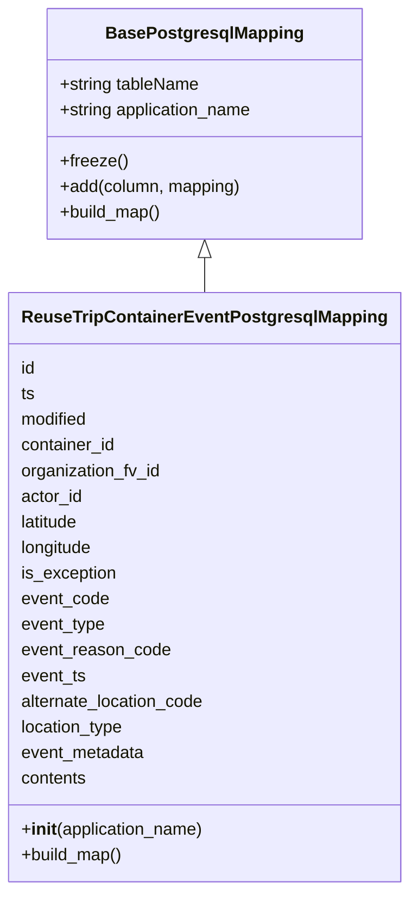
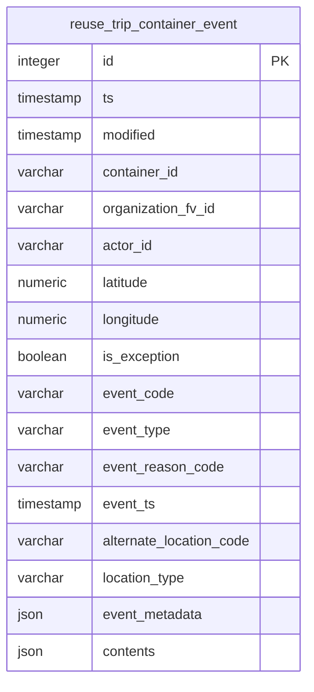

# Diagram: container_tracking_core/container_tracking_service/container_tracking_service/persistence_adapter/postgresql/ReuseTripContainerEventPostgresqlMapping.py

> Auto-generated by Obscura crawlers

## Diagram 1

### SVG

<svg id="container" width="378.5703125" xmlns="http://www.w3.org/2000/svg" class="classDiagram" height="834" viewBox="0 0 378.5703125 834" role="graphics-document document" aria-roledescription="class"><g><defs><marker id="container_class-aggregationStart" class="marker aggregation class" refX="18" refY="7" markerWidth="190" markerHeight="240" orient="auto"><path d="M 18,7 L9,13 L1,7 L9,1 Z"></path></marker></defs><defs><marker id="container_class-aggregationEnd" class="marker aggregation class" refX="1" refY="7" markerWidth="20" markerHeight="28" orient="auto"><path d="M 18,7 L9,13 L1,7 L9,1 Z"></path></marker></defs><defs><marker id="container_class-extensionStart" class="marker extension class" refX="18" refY="7" markerWidth="190" markerHeight="240" orient="auto"><path d="M 1,7 L18,13 V 1 Z"></path></marker></defs><defs><marker id="container_class-extensionEnd" class="marker extension class" refX="1" refY="7" markerWidth="20" markerHeight="28" orient="auto"><path d="M 1,1 V 13 L18,7 Z"></path></marker></defs><defs><marker id="container_class-compositionStart" class="marker composition class" refX="18" refY="7" markerWidth="190" markerHeight="240" orient="auto"><path d="M 18,7 L9,13 L1,7 L9,1 Z"></path></marker></defs><defs><marker id="container_class-compositionEnd" class="marker composition class" refX="1" refY="7" markerWidth="20" markerHeight="28" orient="auto"><path d="M 18,7 L9,13 L1,7 L9,1 Z"></path></marker></defs><defs><marker id="container_class-dependencyStart" class="marker dependency class" refX="6" refY="7" markerWidth="190" markerHeight="240" orient="auto"><path d="M 5,7 L9,13 L1,7 L9,1 Z"></path></marker></defs><defs><marker id="container_class-dependencyEnd" class="marker dependency class" refX="13" refY="7" markerWidth="20" markerHeight="28" orient="auto"><path d="M 18,7 L9,13 L14,7 L9,1 Z"></path></marker></defs><defs><marker id="container_class-lollipopStart" class="marker lollipop class" refX="13" refY="7" markerWidth="190" markerHeight="240" orient="auto"><circle stroke="black" fill="transparent" cx="7" cy="7" r="6"></circle></marker></defs><defs><marker id="container_class-lollipopEnd" class="marker lollipop class" refX="1" refY="7" markerWidth="190" markerHeight="240" orient="auto"><circle stroke="black" fill="transparent" cx="7" cy="7" r="6"></circle></marker></defs><g class="root"><g class="clusters"></g><g class="edgePaths"><path d="M189.285,241.25L189.285,242.542C189.285,243.833,189.285,246.417,189.285,251.875C189.285,257.333,189.285,265.667,189.285,269.833L189.285,274" id="id_BasePostgresqlMapping_ReuseTripContainerEventPostgresqlMapping_1" class="edge-thickness-normal edge-pattern-solid relation" style=";;;" data-edge="true" data-et="edge" data-id="id_BasePostgresqlMapping_ReuseTripContainerEventPostgresqlMapping_1" data-points="W3sieCI6MTg5LjI4NTE1NjI1LCJ5IjoyMjR9LHsieCI6MTg5LjI4NTE1NjI1LCJ5IjoyNDl9LHsieCI6MTg5LjI4NTE1NjI1LCJ5IjoyNzR9XQ==" marker-start="url(#container_class-extensionStart)"></path></g><g class="edgeLabels"><g class="edgeLabel"><g class="label" data-id="id_BasePostgresqlMapping_ReuseTripContainerEventPostgresqlMapping_1" transform="translate(0, 0)"><foreignObject width="0" height="0">

</foreignObject></g></g></g><g class="nodes"><g class="node default" id="classId-BasePostgresqlMapping-0" transform="translate(189.28515625, 116)"><g class="basic label-container"><path d="M-148.3671875 -108 L148.3671875 -108 L148.3671875 108 L-148.3671875 108" stroke="none" stroke-width="0" fill="#ECECFF" style=""></path><path d="M-148.3671875 -108 C-51.6007957836613 -108, 45.165595932677405 -108, 148.3671875 -108 M-148.3671875 -108 C-38.63441700949926 -108, 71.09835348100148 -108, 148.3671875 -108 M148.3671875 -108 C148.3671875 -24.830532984926663, 148.3671875 58.338934030146675, 148.3671875 108 M148.3671875 -108 C148.3671875 -47.430371340392455, 148.3671875 13.13925731921509, 148.3671875 108 M148.3671875 108 C45.38335246572596 108, -57.600482568548074 108, -148.3671875 108 M148.3671875 108 C70.92163425149703 108, -6.52391899700595 108, -148.3671875 108 M-148.3671875 108 C-148.3671875 51.96275591505549, -148.3671875 -4.0744881698890225, -148.3671875 -108 M-148.3671875 108 C-148.3671875 58.82298755546309, -148.3671875 9.645975110926173, -148.3671875 -108" stroke="#9370DB" stroke-width="1.3" fill="none" stroke-dasharray="0 0" style=""></path></g><g class="annotation-group text" transform="translate(0, -84)"></g><g class="label-group text" transform="translate(-87.921875, -84)"><g class="label" style="font-weight: bolder" transform="translate(0,-12)"><foreignObject width="175.84375" height="24">

BasePostgresqlMapping

</foreignObject></g></g><g class="members-group text" transform="translate(-136.3671875, -36)"><g class="label" style="" transform="translate(0,-12)"><foreignObject width="133.125" height="24">

+string tableName

</foreignObject></g><g class="label" style="" transform="translate(0,12)"><foreignObject width="184.8125" height="24">

+string application_name

</foreignObject></g></g><g class="methods-group text" transform="translate(-136.3671875, 36)"><g class="label" style="" transform="translate(0,-12)"><foreignObject width="62.109375" height="24">

+freeze()

</foreignObject></g><g class="label" style="" transform="translate(0,12)"><foreignObject width="171.4375" height="24">

+add(column, mapping)

</foreignObject></g><g class="label" style="" transform="translate(0,36)"><foreignObject width="96.109375" height="24">

+build_map()

</foreignObject></g></g><g class="divider" style=""><path d="M-148.3671875 -60 C-79.44091261386001 -60, -10.514637727720014 -60, 148.3671875 -60 M-148.3671875 -60 C-44.24887735097441 -60, 59.86943279805118 -60, 148.3671875 -60" stroke="#9370DB" stroke-width="1.3" fill="none" stroke-dasharray="0 0" style=""></path></g><g class="divider" style=""><path d="M-148.3671875 12 C-48.88781305810798 12, 50.59156138378404 12, 148.3671875 12 M-148.3671875 12 C-78.20074687413349 12, -8.034306248266972 12, 148.3671875 12" stroke="#9370DB" stroke-width="1.3" fill="none" stroke-dasharray="0 0" style=""></path></g></g><g class="node default" id="classId-ReuseTripContainerEventPostgresqlMapping-1" transform="translate(189.28515625, 550)"><g class="basic label-container"><path d="M-181.28515625 -276 L181.28515625 -276 L181.28515625 276 L-181.28515625 276" stroke="none" stroke-width="0" fill="#ECECFF" style=""></path><path d="M-181.28515625 -276 C-63.185607258808304 -276, 54.91394173238339 -276, 181.28515625 -276 M-181.28515625 -276 C-76.63113281536815 -276, 28.022890619263706 -276, 181.28515625 -276 M181.28515625 -276 C181.28515625 -123.39066330008674, 181.28515625 29.218673399826514, 181.28515625 276 M181.28515625 -276 C181.28515625 -128.9615736339541, 181.28515625 18.076852732091822, 181.28515625 276 M181.28515625 276 C39.77691464383352 276, -101.73132696233296 276, -181.28515625 276 M181.28515625 276 C36.31185748391269 276, -108.66144128217462 276, -181.28515625 276 M-181.28515625 276 C-181.28515625 145.5608884464155, -181.28515625 15.121776892831008, -181.28515625 -276 M-181.28515625 276 C-181.28515625 112.71229705564573, -181.28515625 -50.57540588870853, -181.28515625 -276" stroke="#9370DB" stroke-width="1.3" fill="none" stroke-dasharray="0 0" style=""></path></g><g class="annotation-group text" transform="translate(0, -252)"></g><g class="label-group text" transform="translate(-162.6171875, -252)"><g class="label" style="font-weight: bolder" transform="translate(0,-12)"><foreignObject width="325.234375" height="24">

ReuseTripContainerEventPostgresqlMapping

</foreignObject></g></g><g class="members-group text" transform="translate(-169.28515625, -204)"><g class="label" style="" transform="translate(0,-12)"><foreignObject width="14.09375" height="24">

id

</foreignObject></g><g class="label" style="" transform="translate(0,12)"><foreignObject width="13.25" height="24">

ts

</foreignObject></g><g class="label" style="" transform="translate(0,36)"><foreignObject width="64.625" height="24">

modified

</foreignObject></g><g class="label" style="" transform="translate(0,60)"><foreignObject width="90.328125" height="24">

container_id

</foreignObject></g><g class="label" style="" transform="translate(0,84)"><foreignObject width="133.515625" height="24">

organization_fv_id

</foreignObject></g><g class="label" style="" transform="translate(0,108)"><foreignObject width="58.53125" height="24">

actor_id

</foreignObject></g><g class="label" style="" transform="translate(0,132)"><foreignObject width="56.984375" height="24">

latitude

</foreignObject></g><g class="label" style="" transform="translate(0,156)"><foreignObject width="69.546875" height="24">

longitude

</foreignObject></g><g class="label" style="" transform="translate(0,180)"><foreignObject width="90.421875" height="24">

is_exception

</foreignObject></g><g class="label" style="" transform="translate(0,204)"><foreignObject width="83.296875" height="24">

event_code

</foreignObject></g><g class="label" style="" transform="translate(0,228)"><foreignObject width="80.140625" height="24">

event_type

</foreignObject></g><g class="label" style="" transform="translate(0,252)"><foreignObject width="140.609375" height="24">

event_reason_code

</foreignObject></g><g class="label" style="" transform="translate(0,276)"><foreignObject width="61.59375" height="24">

event_ts

</foreignObject></g><g class="label" style="" transform="translate(0,300)"><foreignObject width="175.953125" height="24">

alternate_location_code

</foreignObject></g><g class="label" style="" transform="translate(0,324)"><foreignObject width="98.953125" height="24">

location_type

</foreignObject></g><g class="label" style="" transform="translate(0,348)"><foreignObject width="118.109375" height="24">

event_metadata

</foreignObject></g><g class="label" style="" transform="translate(0,372)"><foreignObject width="62.9375" height="24">

contents

</foreignObject></g></g><g class="methods-group text" transform="translate(-169.28515625, 228)"><g class="label" style="" transform="translate(0,-12)"><foreignObject width="173.734375" height="24">

+<strong>init</strong>(application_name)

</foreignObject></g><g class="label" style="" transform="translate(0,12)"><foreignObject width="96.109375" height="24">

+build_map()

</foreignObject></g></g><g class="divider" style=""><path d="M-181.28515625 -228 C-56.38724233861255 -228, 68.5106715727749 -228, 181.28515625 -228 M-181.28515625 -228 C-83.83403803839239 -228, 13.617080173215214 -228, 181.28515625 -228" stroke="#9370DB" stroke-width="1.3" fill="none" stroke-dasharray="0 0" style=""></path></g><g class="divider" style=""><path d="M-181.28515625 204 C-50.260437267421224 204, 80.76428171515755 204, 181.28515625 204 M-181.28515625 204 C-83.08047996353007 204, 15.124196322939866 204, 181.28515625 204" stroke="#9370DB" stroke-width="1.3" fill="none" stroke-dasharray="0 0" style=""></path></g></g></g></g></g></svg>

## Diagram 2

### SVG

<svg id="container" width="363.46875" xmlns="http://www.w3.org/2000/svg" class="erDiagram" height="785.5" viewBox="0 0 363.46875 785.5" role="graphics-document document" aria-roledescription="er"><g><defs><marker id="container_er-onlyOneStart" class="marker onlyOne er" refX="0" refY="9" markerWidth="18" markerHeight="18" orient="auto"><path d="M9,0 L9,18 M15,0 L15,18"></path></marker></defs><defs><marker id="container_er-onlyOneEnd" class="marker onlyOne er" refX="18" refY="9" markerWidth="18" markerHeight="18" orient="auto"><path d="M3,0 L3,18 M9,0 L9,18"></path></marker></defs><defs><marker id="container_er-zeroOrOneStart" class="marker zeroOrOne er" refX="0" refY="9" markerWidth="30" markerHeight="18" orient="auto"><circle fill="white" cx="21" cy="9" r="6"></circle><path d="M9,0 L9,18"></path></marker></defs><defs><marker id="container_er-zeroOrOneEnd" class="marker zeroOrOne er" refX="30" refY="9" markerWidth="30" markerHeight="18" orient="auto"><circle fill="white" cx="9" cy="9" r="6"></circle><path d="M21,0 L21,18"></path></marker></defs><defs><marker id="container_er-oneOrMoreStart" class="marker oneOrMore er" refX="18" refY="18" markerWidth="45" markerHeight="36" orient="auto"><path d="M0,18 Q 18,0 36,18 Q 18,36 0,18 M42,9 L42,27"></path></marker></defs><defs><marker id="container_er-oneOrMoreEnd" class="marker oneOrMore er" refX="27" refY="18" markerWidth="45" markerHeight="36" orient="auto"><path d="M3,9 L3,27 M9,18 Q27,0 45,18 Q27,36 9,18"></path></marker></defs><defs><marker id="container_er-zeroOrMoreStart" class="marker zeroOrMore er" refX="18" refY="18" markerWidth="57" markerHeight="36" orient="auto"><circle fill="white" cx="48" cy="18" r="6"></circle><path d="M0,18 Q18,0 36,18 Q18,36 0,18"></path></marker></defs><defs><marker id="container_er-zeroOrMoreEnd" class="marker zeroOrMore er" refX="39" refY="18" markerWidth="57" markerHeight="36" orient="auto"><circle fill="white" cx="9" cy="18" r="6"></circle><path d="M21,18 Q39,0 57,18 Q39,36 21,18"></path></marker></defs><g class="root"><g class="clusters"></g><g class="edgePaths"></g><g class="edgeLabels"></g><g class="nodes"><g class="node default" id="entity-reuse_trip_container_event-0" transform="translate(181.734375, 392.75)"><g style=""><path d="M-173.734375 -384.75 L173.734375 -384.75 L173.734375 384.75 L-173.734375 384.75" stroke="none" stroke-width="0" fill="#ECECFF"></path><path d="M-173.734375 -384.75 C-83.87463722378719 -384.75, 5.985100552425621 -384.75, 173.734375 -384.75 M-173.734375 -384.75 C-67.7661650894419 -384.75, 38.2020448211162 -384.75, 173.734375 -384.75 M173.734375 -384.75 C173.734375 -222.16469213814565, 173.734375 -59.57938427629131, 173.734375 384.75 M173.734375 -384.75 C173.734375 -207.07801320077306, 173.734375 -29.406026401546114, 173.734375 384.75 M173.734375 384.75 C82.55589309412328 384.75, -8.622588811753445 384.75, -173.734375 384.75 M173.734375 384.75 C59.069544924649904 384.75, -55.59528515070019 384.75, -173.734375 384.75 M-173.734375 384.75 C-173.734375 165.2474007432936, -173.734375 -54.25519851341278, -173.734375 -384.75 M-173.734375 384.75 C-173.734375 186.95333282316128, -173.734375 -10.843334353677449, -173.734375 -384.75" stroke="#9370DB" stroke-width="1.3" fill="none" stroke-dasharray="0 0"></path></g><g style="" class="row-rect-odd"><path d="M-173.734375 -342 L173.734375 -342 L173.734375 -299.25 L-173.734375 -299.25" stroke="none" stroke-width="0" fill="hsl(240, 100%, 100%)"></path><path d="M-173.734375 -342 C-50.368935636554 -342, 72.996503726892 -342, 173.734375 -342 M-173.734375 -342 C-87.56084913402071 -342, -1.3873232680414276 -342, 173.734375 -342 M173.734375 -342 C173.734375 -329.16358113782724, 173.734375 -316.3271622756544, 173.734375 -299.25 M173.734375 -342 C173.734375 -328.5652970406923, 173.734375 -315.13059408138463, 173.734375 -299.25 M173.734375 -299.25 C103.85315169536003 -299.25, 33.97192839072005 -299.25, -173.734375 -299.25 M173.734375 -299.25 C100.3479841476199 -299.25, 26.961593295239794 -299.25, -173.734375 -299.25 M-173.734375 -299.25 C-173.734375 -313.3943246968924, -173.734375 -327.5386493937848, -173.734375 -342 M-173.734375 -299.25 C-173.734375 -313.97839813442783, -173.734375 -328.70679626885567, -173.734375 -342" stroke="#9370DB" stroke-width="1.3" fill="none" stroke-dasharray="0 0"></path></g><g style="" class="row-rect-even"><path d="M-173.734375 -299.25 L173.734375 -299.25 L173.734375 -256.5 L-173.734375 -256.5" stroke="none" stroke-width="0" fill="hsl(240, 100%, 97.2745098039%)"></path><path d="M-173.734375 -299.25 C-80.50555785132492 -299.25, 12.723259297350154 -299.25, 173.734375 -299.25 M-173.734375 -299.25 C-64.5477742936638 -299.25, 44.63882641267239 -299.25, 173.734375 -299.25 M173.734375 -299.25 C173.734375 -283.9968436787607, 173.734375 -268.7436873575214, 173.734375 -256.5 M173.734375 -299.25 C173.734375 -286.58799242334715, 173.734375 -273.92598484669423, 173.734375 -256.5 M173.734375 -256.5 C61.41273964800709 -256.5, -50.90889570398582 -256.5, -173.734375 -256.5 M173.734375 -256.5 C93.39429734315843 -256.5, 13.054219686316856 -256.5, -173.734375 -256.5 M-173.734375 -256.5 C-173.734375 -265.99988195187206, -173.734375 -275.4997639037441, -173.734375 -299.25 M-173.734375 -256.5 C-173.734375 -271.4923012991322, -173.734375 -286.4846025982644, -173.734375 -299.25" stroke="#9370DB" stroke-width="1.3" fill="none" stroke-dasharray="0 0"></path></g><g style="" class="row-rect-odd"><path d="M-173.734375 -256.5 L173.734375 -256.5 L173.734375 -213.75 L-173.734375 -213.75" stroke="none" stroke-width="0" fill="hsl(240, 100%, 100%)"></path><path d="M-173.734375 -256.5 C-77.12137839467997 -256.5, 19.49161821064007 -256.5, 173.734375 -256.5 M-173.734375 -256.5 C-40.66885507729805 -256.5, 92.3966648454039 -256.5, 173.734375 -256.5 M173.734375 -256.5 C173.734375 -243.46022611990577, 173.734375 -230.42045223981154, 173.734375 -213.75 M173.734375 -256.5 C173.734375 -242.14376944268332, 173.734375 -227.78753888536662, 173.734375 -213.75 M173.734375 -213.75 C96.737059143238 -213.75, 19.739743286476 -213.75, -173.734375 -213.75 M173.734375 -213.75 C69.57987678562547 -213.75, -34.574621428749055 -213.75, -173.734375 -213.75 M-173.734375 -213.75 C-173.734375 -230.2656209543272, -173.734375 -246.7812419086544, -173.734375 -256.5 M-173.734375 -213.75 C-173.734375 -224.0392705065877, -173.734375 -234.32854101317542, -173.734375 -256.5" stroke="#9370DB" stroke-width="1.3" fill="none" stroke-dasharray="0 0"></path></g><g style="" class="row-rect-even"><path d="M-173.734375 -213.75 L173.734375 -213.75 L173.734375 -171 L-173.734375 -171" stroke="none" stroke-width="0" fill="hsl(240, 100%, 97.2745098039%)"></path><path d="M-173.734375 -213.75 C-82.24274849170332 -213.75, 9.248878016593352 -213.75, 173.734375 -213.75 M-173.734375 -213.75 C-47.234173353062076 -213.75, 79.26602829387585 -213.75, 173.734375 -213.75 M173.734375 -213.75 C173.734375 -202.0264797952534, 173.734375 -190.30295959050682, 173.734375 -171 M173.734375 -213.75 C173.734375 -200.67356817752426, 173.734375 -187.59713635504852, 173.734375 -171 M173.734375 -171 C51.94364700867756 -171, -69.84708098264488 -171, -173.734375 -171 M173.734375 -171 C86.55116606514903 -171, -0.6320428697019338 -171, -173.734375 -171 M-173.734375 -171 C-173.734375 -182.28214397750793, -173.734375 -193.56428795501586, -173.734375 -213.75 M-173.734375 -171 C-173.734375 -182.02102156409632, -173.734375 -193.04204312819266, -173.734375 -213.75" stroke="#9370DB" stroke-width="1.3" fill="none" stroke-dasharray="0 0"></path></g><g style="" class="row-rect-odd"><path d="M-173.734375 -171 L173.734375 -171 L173.734375 -128.25 L-173.734375 -128.25" stroke="none" stroke-width="0" fill="hsl(240, 100%, 100%)"></path><path d="M-173.734375 -171 C-52.44327136646032 -171, 68.84783226707935 -171, 173.734375 -171 M-173.734375 -171 C-63.19928390897216 -171, 47.335807182055675 -171, 173.734375 -171 M173.734375 -171 C173.734375 -155.8589809577113, 173.734375 -140.7179619154226, 173.734375 -128.25 M173.734375 -171 C173.734375 -160.61285527641587, 173.734375 -150.2257105528317, 173.734375 -128.25 M173.734375 -128.25 C71.78320585450041 -128.25, -30.167963290999182 -128.25, -173.734375 -128.25 M173.734375 -128.25 C58.09246469787277 -128.25, -57.54944560425446 -128.25, -173.734375 -128.25 M-173.734375 -128.25 C-173.734375 -137.69247345384687, -173.734375 -147.13494690769375, -173.734375 -171 M-173.734375 -128.25 C-173.734375 -141.19084702071498, -173.734375 -154.13169404142994, -173.734375 -171" stroke="#9370DB" stroke-width="1.3" fill="none" stroke-dasharray="0 0"></path></g><g style="" class="row-rect-even"><path d="M-173.734375 -128.25 L173.734375 -128.25 L173.734375 -85.5 L-173.734375 -85.5" stroke="none" stroke-width="0" fill="hsl(240, 100%, 97.2745098039%)"></path><path d="M-173.734375 -128.25 C-41.09638363246586 -128.25, 91.54160773506828 -128.25, 173.734375 -128.25 M-173.734375 -128.25 C-103.75087595690991 -128.25, -33.76737691381982 -128.25, 173.734375 -128.25 M173.734375 -128.25 C173.734375 -119.37483416381318, 173.734375 -110.49966832762637, 173.734375 -85.5 M173.734375 -128.25 C173.734375 -116.08770087758217, 173.734375 -103.92540175516432, 173.734375 -85.5 M173.734375 -85.5 C96.38506608557682 -85.5, 19.035757171153648 -85.5, -173.734375 -85.5 M173.734375 -85.5 C98.34332455213003 -85.5, 22.952274104260056 -85.5, -173.734375 -85.5 M-173.734375 -85.5 C-173.734375 -101.58858732400586, -173.734375 -117.67717464801171, -173.734375 -128.25 M-173.734375 -85.5 C-173.734375 -101.94285159282006, -173.734375 -118.38570318564012, -173.734375 -128.25" stroke="#9370DB" stroke-width="1.3" fill="none" stroke-dasharray="0 0"></path></g><g style="" class="row-rect-odd"><path d="M-173.734375 -85.5 L173.734375 -85.5 L173.734375 -42.75 L-173.734375 -42.75" stroke="none" stroke-width="0" fill="hsl(240, 100%, 100%)"></path><path d="M-173.734375 -85.5 C-54.7836441822957 -85.5, 64.1670866354086 -85.5, 173.734375 -85.5 M-173.734375 -85.5 C-63.478770383151414 -85.5, 46.77683423369717 -85.5, 173.734375 -85.5 M173.734375 -85.5 C173.734375 -70.96348638852, 173.734375 -56.42697277704001, 173.734375 -42.75 M173.734375 -85.5 C173.734375 -71.09732898038445, 173.734375 -56.69465796076888, 173.734375 -42.75 M173.734375 -42.75 C69.07378509981355 -42.75, -35.5868048003729 -42.75, -173.734375 -42.75 M173.734375 -42.75 C45.12783074999561 -42.75, -83.47871350000878 -42.75, -173.734375 -42.75 M-173.734375 -42.75 C-173.734375 -54.84345821009094, -173.734375 -66.93691642018187, -173.734375 -85.5 M-173.734375 -42.75 C-173.734375 -55.45480598316054, -173.734375 -68.15961196632108, -173.734375 -85.5" stroke="#9370DB" stroke-width="1.3" fill="none" stroke-dasharray="0 0"></path></g><g style="" class="row-rect-even"><path d="M-173.734375 -42.75 L173.734375 -42.75 L173.734375 0 L-173.734375 0" stroke="none" stroke-width="0" fill="hsl(240, 100%, 97.2745098039%)"></path><path d="M-173.734375 -42.75 C-57.13592137177844 -42.75, 59.462532256443126 -42.75, 173.734375 -42.75 M-173.734375 -42.75 C-43.441938911826924 -42.75, 86.85049717634615 -42.75, 173.734375 -42.75 M173.734375 -42.75 C173.734375 -31.013192980737287, 173.734375 -19.27638596147457, 173.734375 0 M173.734375 -42.75 C173.734375 -30.292351161238237, 173.734375 -17.83470232247647, 173.734375 0 M173.734375 0 C40.62537131338709 0, -92.48363237322582 0, -173.734375 0 M173.734375 0 C41.7148616975949 0, -90.3046516048102 0, -173.734375 0 M-173.734375 0 C-173.734375 -16.60699381266235, -173.734375 -33.2139876253247, -173.734375 -42.75 M-173.734375 0 C-173.734375 -8.623672555382779, -173.734375 -17.247345110765558, -173.734375 -42.75" stroke="#9370DB" stroke-width="1.3" fill="none" stroke-dasharray="0 0"></path></g><g style="" class="row-rect-odd"><path d="M-173.734375 0 L173.734375 0 L173.734375 42.75 L-173.734375 42.75" stroke="none" stroke-width="0" fill="hsl(240, 100%, 100%)"></path><path d="M-173.734375 0 C-95.70321971135425 0, -17.6720644227085 0, 173.734375 0 M-173.734375 0 C-64.0063139676589 0, 45.721747064682205 0, 173.734375 0 M173.734375 0 C173.734375 9.596592942288238, 173.734375 19.193185884576476, 173.734375 42.75 M173.734375 0 C173.734375 15.612022829191327, 173.734375 31.224045658382654, 173.734375 42.75 M173.734375 42.75 C68.48652055014625 42.75, -36.761333899707495 42.75, -173.734375 42.75 M173.734375 42.75 C61.147102620798194 42.75, -51.44016975840361 42.75, -173.734375 42.75 M-173.734375 42.75 C-173.734375 27.287711853677017, -173.734375 11.825423707354037, -173.734375 0 M-173.734375 42.75 C-173.734375 30.775344532503134, -173.734375 18.800689065006267, -173.734375 0" stroke="#9370DB" stroke-width="1.3" fill="none" stroke-dasharray="0 0"></path></g><g style="" class="row-rect-even"><path d="M-173.734375 42.75 L173.734375 42.75 L173.734375 85.5 L-173.734375 85.5" stroke="none" stroke-width="0" fill="hsl(240, 100%, 97.2745098039%)"></path><path d="M-173.734375 42.75 C-45.97079036853509 42.75, 81.79279426292982 42.75, 173.734375 42.75 M-173.734375 42.75 C-48.34096178027316 42.75, 77.05245143945368 42.75, 173.734375 42.75 M173.734375 42.75 C173.734375 59.61953257813255, 173.734375 76.4890651562651, 173.734375 85.5 M173.734375 42.75 C173.734375 55.42116528380248, 173.734375 68.09233056760496, 173.734375 85.5 M173.734375 85.5 C82.7342177892919 85.5, -8.265939421416192 85.5, -173.734375 85.5 M173.734375 85.5 C73.22766685381549 85.5, -27.279041292369016 85.5, -173.734375 85.5 M-173.734375 85.5 C-173.734375 71.47458919677511, -173.734375 57.44917839355024, -173.734375 42.75 M-173.734375 85.5 C-173.734375 74.22198111012347, -173.734375 62.943962220246924, -173.734375 42.75" stroke="#9370DB" stroke-width="1.3" fill="none" stroke-dasharray="0 0"></path></g><g style="" class="row-rect-odd"><path d="M-173.734375 85.5 L173.734375 85.5 L173.734375 128.25 L-173.734375 128.25" stroke="none" stroke-width="0" fill="hsl(240, 100%, 100%)"></path><path d="M-173.734375 85.5 C-41.02750751590966 85.5, 91.67935996818068 85.5, 173.734375 85.5 M-173.734375 85.5 C-68.9195015838647 85.5, 35.8953718322706 85.5, 173.734375 85.5 M173.734375 85.5 C173.734375 100.6257687633493, 173.734375 115.7515375266986, 173.734375 128.25 M173.734375 85.5 C173.734375 98.08591164837448, 173.734375 110.67182329674895, 173.734375 128.25 M173.734375 128.25 C64.2749173478531 128.25, -45.18454030429379 128.25, -173.734375 128.25 M173.734375 128.25 C51.24243192271953 128.25, -71.24951115456093 128.25, -173.734375 128.25 M-173.734375 128.25 C-173.734375 114.48708315054526, -173.734375 100.72416630109052, -173.734375 85.5 M-173.734375 128.25 C-173.734375 119.68360224183805, -173.734375 111.11720448367609, -173.734375 85.5" stroke="#9370DB" stroke-width="1.3" fill="none" stroke-dasharray="0 0"></path></g><g style="" class="row-rect-even"><path d="M-173.734375 128.25 L173.734375 128.25 L173.734375 171 L-173.734375 171" stroke="none" stroke-width="0" fill="hsl(240, 100%, 97.2745098039%)"></path><path d="M-173.734375 128.25 C-54.27462404432684 128.25, 65.18512691134632 128.25, 173.734375 128.25 M-173.734375 128.25 C-75.37373947226803 128.25, 22.986896055463944 128.25, 173.734375 128.25 M173.734375 128.25 C173.734375 144.23149881290828, 173.734375 160.21299762581657, 173.734375 171 M173.734375 128.25 C173.734375 141.58727724789006, 173.734375 154.92455449578014, 173.734375 171 M173.734375 171 C79.06966644461775 171, -15.595042110764496 171, -173.734375 171 M173.734375 171 C59.12471077993044 171, -55.48495344013912 171, -173.734375 171 M-173.734375 171 C-173.734375 158.9178299334792, -173.734375 146.83565986695842, -173.734375 128.25 M-173.734375 171 C-173.734375 158.43381065817923, -173.734375 145.86762131635845, -173.734375 128.25" stroke="#9370DB" stroke-width="1.3" fill="none" stroke-dasharray="0 0"></path></g><g style="" class="row-rect-odd"><path d="M-173.734375 171 L173.734375 171 L173.734375 213.75 L-173.734375 213.75" stroke="none" stroke-width="0" fill="hsl(240, 100%, 100%)"></path><path d="M-173.734375 171 C-73.42775868847424 171, 26.878857623051516 171, 173.734375 171 M-173.734375 171 C-98.887753545673 171, -24.041132091345986 171, 173.734375 171 M173.734375 171 C173.734375 181.68825311099883, 173.734375 192.37650622199763, 173.734375 213.75 M173.734375 171 C173.734375 184.40422970566553, 173.734375 197.80845941133103, 173.734375 213.75 M173.734375 213.75 C101.07703917547548 213.75, 28.419703350950954 213.75, -173.734375 213.75 M173.734375 213.75 C70.770528825231 213.75, -32.193317349538006 213.75, -173.734375 213.75 M-173.734375 213.75 C-173.734375 200.6660387482488, -173.734375 187.58207749649762, -173.734375 171 M-173.734375 213.75 C-173.734375 203.0476892658659, -173.734375 192.34537853173177, -173.734375 171" stroke="#9370DB" stroke-width="1.3" fill="none" stroke-dasharray="0 0"></path></g><g style="" class="row-rect-even"><path d="M-173.734375 213.75 L173.734375 213.75 L173.734375 256.5 L-173.734375 256.5" stroke="none" stroke-width="0" fill="hsl(240, 100%, 97.2745098039%)"></path><path d="M-173.734375 213.75 C-88.25985088777729 213.75, -2.78532677555458 213.75, 173.734375 213.75 M-173.734375 213.75 C-61.32781073850521 213.75, 51.07875352298959 213.75, 173.734375 213.75 M173.734375 213.75 C173.734375 225.14378365412398, 173.734375 236.53756730824796, 173.734375 256.5 M173.734375 213.75 C173.734375 227.32375000333795, 173.734375 240.89750000667587, 173.734375 256.5 M173.734375 256.5 C42.30010485500034 256.5, -89.13416528999932 256.5, -173.734375 256.5 M173.734375 256.5 C41.40709001144697 256.5, -90.92019497710606 256.5, -173.734375 256.5 M-173.734375 256.5 C-173.734375 241.73128544012525, -173.734375 226.9625708802505, -173.734375 213.75 M-173.734375 256.5 C-173.734375 246.9549768579648, -173.734375 237.4099537159296, -173.734375 213.75" stroke="#9370DB" stroke-width="1.3" fill="none" stroke-dasharray="0 0"></path></g><g style="" class="row-rect-odd"><path d="M-173.734375 256.5 L173.734375 256.5 L173.734375 299.25 L-173.734375 299.25" stroke="none" stroke-width="0" fill="hsl(240, 100%, 100%)"></path><path d="M-173.734375 256.5 C-77.80884521498947 256.5, 18.11668457002105 256.5, 173.734375 256.5 M-173.734375 256.5 C-93.66231354994699 256.5, -13.590252099893974 256.5, 173.734375 256.5 M173.734375 256.5 C173.734375 273.2100517933513, 173.734375 289.92010358670257, 173.734375 299.25 M173.734375 256.5 C173.734375 271.17361731826736, 173.734375 285.8472346365348, 173.734375 299.25 M173.734375 299.25 C79.8105387050221 299.25, -14.113297589955806 299.25, -173.734375 299.25 M173.734375 299.25 C44.17465387577158 299.25, -85.38506724845683 299.25, -173.734375 299.25 M-173.734375 299.25 C-173.734375 286.8355861165387, -173.734375 274.42117223307747, -173.734375 256.5 M-173.734375 299.25 C-173.734375 284.8164038388164, -173.734375 270.38280767763285, -173.734375 256.5" stroke="#9370DB" stroke-width="1.3" fill="none" stroke-dasharray="0 0"></path></g><g style="" class="row-rect-even"><path d="M-173.734375 299.25 L173.734375 299.25 L173.734375 342 L-173.734375 342" stroke="none" stroke-width="0" fill="hsl(240, 100%, 97.2745098039%)"></path><path d="M-173.734375 299.25 C-37.19044311587541 299.25, 99.35348876824918 299.25, 173.734375 299.25 M-173.734375 299.25 C-49.772628308051 299.25, 74.189118383898 299.25, 173.734375 299.25 M173.734375 299.25 C173.734375 316.26561267130984, 173.734375 333.2812253426197, 173.734375 342 M173.734375 299.25 C173.734375 310.7978201500874, 173.734375 322.3456403001748, 173.734375 342 M173.734375 342 C67.76922616980634 342, -38.19592266038731 342, -173.734375 342 M173.734375 342 C67.0011675388205 342, -39.73203992235901 342, -173.734375 342 M-173.734375 342 C-173.734375 328.22820904773084, -173.734375 314.4564180954617, -173.734375 299.25 M-173.734375 342 C-173.734375 330.846606501113, -173.734375 319.69321300222606, -173.734375 299.25" stroke="#9370DB" stroke-width="1.3" fill="none" stroke-dasharray="0 0"></path></g><g style="" class="row-rect-odd"><path d="M-173.734375 342 L173.734375 342 L173.734375 384.75 L-173.734375 384.75" stroke="none" stroke-width="0" fill="hsl(240, 100%, 100%)"></path><path d="M-173.734375 342 C-72.13406186377517 342, 29.466251272449654 342, 173.734375 342 M-173.734375 342 C-82.40076832192729 342, 8.932838356145425 342, 173.734375 342 M173.734375 342 C173.734375 356.8804704503399, 173.734375 371.7609409006797, 173.734375 384.75 M173.734375 342 C173.734375 353.88221029275525, 173.734375 365.7644205855105, 173.734375 384.75 M173.734375 384.75 C95.27209469501207 384.75, 16.809814390024144 384.75, -173.734375 384.75 M173.734375 384.75 C81.95381323892302 384.75, -9.826748522153963 384.75, -173.734375 384.75 M-173.734375 384.75 C-173.734375 367.731599987198, -173.734375 350.71319997439605, -173.734375 342 M-173.734375 384.75 C-173.734375 370.40806731664037, -173.734375 356.0661346332808, -173.734375 342" stroke="#9370DB" stroke-width="1.3" fill="none" stroke-dasharray="0 0"></path></g><g class="label name" transform="translate(-98.7578125, -375.375)" style=""><foreignObject width="197.515625" height="24">

reuse_trip_container_event

</foreignObject></g><g class="label attribute-type" transform="translate(-161.234375, -332.625)" style=""><foreignObject width="51.109375" height="24">

integer

</foreignObject></g><g class="label attribute-name" transform="translate(-58.453125, -332.625)" style=""><foreignObject width="14.09375" height="24">

id

</foreignObject></g><g class="label attribute-keys" transform="translate(142.5, -332.625)" style=""><foreignObject width="18.734375" height="24">

PK

</foreignObject></g><g class="label attribute-comment" transform="translate(186.234375, -332.625)" style=""><foreignObject width="0" height="0">

</foreignObject></g><g class="label attribute-type" transform="translate(-161.234375, -289.875)" style=""><foreignObject width="77.78125" height="24">

timestamp

</foreignObject></g><g class="label attribute-name" transform="translate(-58.453125, -289.875)" style=""><foreignObject width="13.25" height="24">

ts

</foreignObject></g><g class="label attribute-keys" transform="translate(142.5, -289.875)" style=""><foreignObject width="0" height="0">

</foreignObject></g><g class="label attribute-comment" transform="translate(186.234375, -289.875)" style=""><foreignObject width="0" height="0">

</foreignObject></g><g class="label attribute-type" transform="translate(-161.234375, -247.125)" style=""><foreignObject width="77.78125" height="24">

timestamp

</foreignObject></g><g class="label attribute-name" transform="translate(-58.453125, -247.125)" style=""><foreignObject width="64.625" height="24">

modified

</foreignObject></g><g class="label attribute-keys" transform="translate(142.5, -247.125)" style=""><foreignObject width="0" height="0">

</foreignObject></g><g class="label attribute-comment" transform="translate(186.234375, -247.125)" style=""><foreignObject width="0" height="0">

</foreignObject></g><g class="label attribute-type" transform="translate(-161.234375, -204.375)" style=""><foreignObject width="53.921875" height="24">

varchar

</foreignObject></g><g class="label attribute-name" transform="translate(-58.453125, -204.375)" style=""><foreignObject width="90.328125" height="24">

container_id

</foreignObject></g><g class="label attribute-keys" transform="translate(142.5, -204.375)" style=""><foreignObject width="0" height="0">

</foreignObject></g><g class="label attribute-comment" transform="translate(186.234375, -204.375)" style=""><foreignObject width="0" height="0">

</foreignObject></g><g class="label attribute-type" transform="translate(-161.234375, -161.625)" style=""><foreignObject width="53.921875" height="24">

varchar

</foreignObject></g><g class="label attribute-name" transform="translate(-58.453125, -161.625)" style=""><foreignObject width="133.515625" height="24">

organization_fv_id

</foreignObject></g><g class="label attribute-keys" transform="translate(142.5, -161.625)" style=""><foreignObject width="0" height="0">

</foreignObject></g><g class="label attribute-comment" transform="translate(186.234375, -161.625)" style=""><foreignObject width="0" height="0">

</foreignObject></g><g class="label attribute-type" transform="translate(-161.234375, -118.875)" style=""><foreignObject width="53.921875" height="24">

varchar

</foreignObject></g><g class="label attribute-name" transform="translate(-58.453125, -118.875)" style=""><foreignObject width="58.53125" height="24">

actor_id

</foreignObject></g><g class="label attribute-keys" transform="translate(142.5, -118.875)" style=""><foreignObject width="0" height="0">

</foreignObject></g><g class="label attribute-comment" transform="translate(186.234375, -118.875)" style=""><foreignObject width="0" height="0">

</foreignObject></g><g class="label attribute-type" transform="translate(-161.234375, -76.125)" style=""><foreignObject width="59.46875" height="24">

numeric

</foreignObject></g><g class="label attribute-name" transform="translate(-58.453125, -76.125)" style=""><foreignObject width="56.984375" height="24">

latitude

</foreignObject></g><g class="label attribute-keys" transform="translate(142.5, -76.125)" style=""><foreignObject width="0" height="0">

</foreignObject></g><g class="label attribute-comment" transform="translate(186.234375, -76.125)" style=""><foreignObject width="0" height="0">

</foreignObject></g><g class="label attribute-type" transform="translate(-161.234375, -33.375)" style=""><foreignObject width="59.46875" height="24">

numeric

</foreignObject></g><g class="label attribute-name" transform="translate(-58.453125, -33.375)" style=""><foreignObject width="69.546875" height="24">

longitude

</foreignObject></g><g class="label attribute-keys" transform="translate(142.5, -33.375)" style=""><foreignObject width="0" height="0">

</foreignObject></g><g class="label attribute-comment" transform="translate(186.234375, -33.375)" style=""><foreignObject width="0" height="0">

</foreignObject></g><g class="label attribute-type" transform="translate(-161.234375, 9.375)" style=""><foreignObject width="59.453125" height="24">

boolean

</foreignObject></g><g class="label attribute-name" transform="translate(-58.453125, 9.375)" style=""><foreignObject width="90.421875" height="24">

is_exception

</foreignObject></g><g class="label attribute-keys" transform="translate(142.5, 9.375)" style=""><foreignObject width="0" height="0">

</foreignObject></g><g class="label attribute-comment" transform="translate(186.234375, 9.375)" style=""><foreignObject width="0" height="0">

</foreignObject></g><g class="label attribute-type" transform="translate(-161.234375, 52.125)" style=""><foreignObject width="53.921875" height="24">

varchar

</foreignObject></g><g class="label attribute-name" transform="translate(-58.453125, 52.125)" style=""><foreignObject width="83.296875" height="24">

event_code

</foreignObject></g><g class="label attribute-keys" transform="translate(142.5, 52.125)" style=""><foreignObject width="0" height="0">

</foreignObject></g><g class="label attribute-comment" transform="translate(186.234375, 52.125)" style=""><foreignObject width="0" height="0">

</foreignObject></g><g class="label attribute-type" transform="translate(-161.234375, 94.875)" style=""><foreignObject width="53.921875" height="24">

varchar

</foreignObject></g><g class="label attribute-name" transform="translate(-58.453125, 94.875)" style=""><foreignObject width="80.140625" height="24">

event_type

</foreignObject></g><g class="label attribute-keys" transform="translate(142.5, 94.875)" style=""><foreignObject width="0" height="0">

</foreignObject></g><g class="label attribute-comment" transform="translate(186.234375, 94.875)" style=""><foreignObject width="0" height="0">

</foreignObject></g><g class="label attribute-type" transform="translate(-161.234375, 137.625)" style=""><foreignObject width="53.921875" height="24">

varchar

</foreignObject></g><g class="label attribute-name" transform="translate(-58.453125, 137.625)" style=""><foreignObject width="140.609375" height="24">

event_reason_code

</foreignObject></g><g class="label attribute-keys" transform="translate(142.5, 137.625)" style=""><foreignObject width="0" height="0">

</foreignObject></g><g class="label attribute-comment" transform="translate(186.234375, 137.625)" style=""><foreignObject width="0" height="0">

</foreignObject></g><g class="label attribute-type" transform="translate(-161.234375, 180.375)" style=""><foreignObject width="77.78125" height="24">

timestamp

</foreignObject></g><g class="label attribute-name" transform="translate(-58.453125, 180.375)" style=""><foreignObject width="61.59375" height="24">

event_ts

</foreignObject></g><g class="label attribute-keys" transform="translate(142.5, 180.375)" style=""><foreignObject width="0" height="0">

</foreignObject></g><g class="label attribute-comment" transform="translate(186.234375, 180.375)" style=""><foreignObject width="0" height="0">

</foreignObject></g><g class="label attribute-type" transform="translate(-161.234375, 223.125)" style=""><foreignObject width="53.921875" height="24">

varchar

</foreignObject></g><g class="label attribute-name" transform="translate(-58.453125, 223.125)" style=""><foreignObject width="175.953125" height="24">

alternate_location_code

</foreignObject></g><g class="label attribute-keys" transform="translate(142.5, 223.125)" style=""><foreignObject width="0" height="0">

</foreignObject></g><g class="label attribute-comment" transform="translate(186.234375, 223.125)" style=""><foreignObject width="0" height="0">

</foreignObject></g><g class="label attribute-type" transform="translate(-161.234375, 265.875)" style=""><foreignObject width="53.921875" height="24">

varchar

</foreignObject></g><g class="label attribute-name" transform="translate(-58.453125, 265.875)" style=""><foreignObject width="98.953125" height="24">

location_type

</foreignObject></g><g class="label attribute-keys" transform="translate(142.5, 265.875)" style=""><foreignObject width="0" height="0">

</foreignObject></g><g class="label attribute-comment" transform="translate(186.234375, 265.875)" style=""><foreignObject width="0" height="0">

</foreignObject></g><g class="label attribute-type" transform="translate(-161.234375, 308.625)" style=""><foreignObject width="30.6875" height="24">

json

</foreignObject></g><g class="label attribute-name" transform="translate(-58.453125, 308.625)" style=""><foreignObject width="118.109375" height="24">

event_metadata

</foreignObject></g><g class="label attribute-keys" transform="translate(142.5, 308.625)" style=""><foreignObject width="0" height="0">

</foreignObject></g><g class="label attribute-comment" transform="translate(186.234375, 308.625)" style=""><foreignObject width="0" height="0">

</foreignObject></g><g class="label attribute-type" transform="translate(-161.234375, 351.375)" style=""><foreignObject width="30.6875" height="24">

json

</foreignObject></g><g class="label attribute-name" transform="translate(-58.453125, 351.375)" style=""><foreignObject width="62.9375" height="24">

contents

</foreignObject></g><g class="label attribute-keys" transform="translate(142.5, 351.375)" style=""><foreignObject width="0" height="0">

</foreignObject></g><g class="label attribute-comment" transform="translate(186.234375, 351.375)" style=""><foreignObject width="0" height="0">

</foreignObject></g><g class="divider"><path d="M-173.734375 -342 C-80.2668209119438 -342, 13.200733176112408 -342, 173.734375 -342 M-173.734375 -342 C-98.74373819262077 -342, -23.753101385241536 -342, 173.734375 -342" stroke="#9370DB" stroke-width="1.3" fill="none" stroke-dasharray="0 0"></path></g><g class="divider"><path d="M-70.953125 -342 C-70.953125 -65.73405843055554, -70.953125 210.53188313888893, -70.953125 384.75 M-70.953125 -342 C-70.953125 -76.94049398522498, -70.953125 188.11901202955005, -70.953125 384.75" stroke="#9370DB" stroke-width="1.3" fill="none" stroke-dasharray="0 0"></path></g><g class="divider"><path d="M130 -342 C130 -102.0303180072267, 130 137.9393639855466, 130 384.75 M130 -342 C130 -126.65337652128144, 130 88.69324695743711, 130 384.75" stroke="#9370DB" stroke-width="1.3" fill="none" stroke-dasharray="0 0"></path></g><g class="divider"><path d="M-173.734375 -342 C-81.90167653392989 -342, 9.931021932140226 -342, 173.734375 -342 M-173.734375 -342 C-74.11813841827714 -342, 25.498098163445718 -342, 173.734375 -342" stroke="#9370DB" stroke-width="1.3" fill="none" stroke-dasharray="0 0"></path></g></g></g></g></g></svg>
