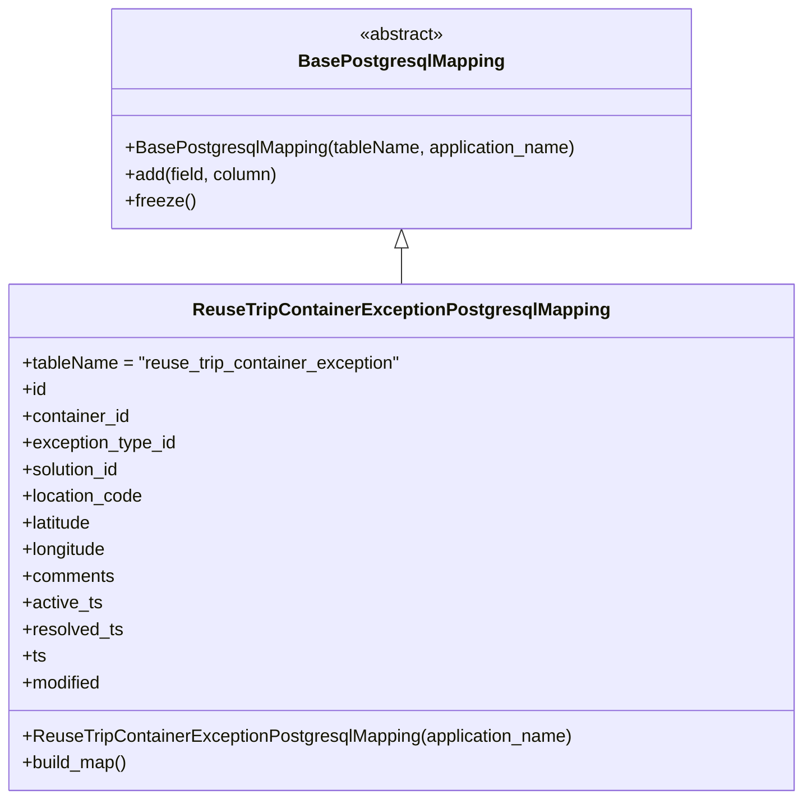

# Diagram: container_tracking_core/container_tracking_service/container_tracking_service/persistence_adapter/postgresql/ReuseTripContainerExceptionPostgresqlMapping.py

> Auto-generated by Obscura crawlers

## Mermaid

### SVG

<svg id="container" width="718.3125" xmlns="http://www.w3.org/2000/svg" class="classDiagram" height="720" viewBox="0 0 718.3125 720" role="graphics-document document" aria-roledescription="class"><g><defs><marker id="container_class-aggregationStart" class="marker aggregation class" refX="18" refY="7" markerWidth="190" markerHeight="240" orient="auto"><path d="M 18,7 L9,13 L1,7 L9,1 Z"></path></marker></defs><defs><marker id="container_class-aggregationEnd" class="marker aggregation class" refX="1" refY="7" markerWidth="20" markerHeight="28" orient="auto"><path d="M 18,7 L9,13 L1,7 L9,1 Z"></path></marker></defs><defs><marker id="container_class-extensionStart" class="marker extension class" refX="18" refY="7" markerWidth="190" markerHeight="240" orient="auto"><path d="M 1,7 L18,13 V 1 Z"></path></marker></defs><defs><marker id="container_class-extensionEnd" class="marker extension class" refX="1" refY="7" markerWidth="20" markerHeight="28" orient="auto"><path d="M 1,1 V 13 L18,7 Z"></path></marker></defs><defs><marker id="container_class-compositionStart" class="marker composition class" refX="18" refY="7" markerWidth="190" markerHeight="240" orient="auto"><path d="M 18,7 L9,13 L1,7 L9,1 Z"></path></marker></defs><defs><marker id="container_class-compositionEnd" class="marker composition class" refX="1" refY="7" markerWidth="20" markerHeight="28" orient="auto"><path d="M 18,7 L9,13 L1,7 L9,1 Z"></path></marker></defs><defs><marker id="container_class-dependencyStart" class="marker dependency class" refX="6" refY="7" markerWidth="190" markerHeight="240" orient="auto"><path d="M 5,7 L9,13 L1,7 L9,1 Z"></path></marker></defs><defs><marker id="container_class-dependencyEnd" class="marker dependency class" refX="13" refY="7" markerWidth="20" markerHeight="28" orient="auto"><path d="M 18,7 L9,13 L14,7 L9,1 Z"></path></marker></defs><defs><marker id="container_class-lollipopStart" class="marker lollipop class" refX="13" refY="7" markerWidth="190" markerHeight="240" orient="auto"><circle stroke="black" fill="transparent" cx="7" cy="7" r="6"></circle></marker></defs><defs><marker id="container_class-lollipopEnd" class="marker lollipop class" refX="1" refY="7" markerWidth="190" markerHeight="240" orient="auto"><circle stroke="black" fill="transparent" cx="7" cy="7" r="6"></circle></marker></defs><g class="root"><g class="clusters"></g><g class="edgePaths"><path d="M359.156,223.25L359.156,224.542C359.156,225.833,359.156,228.417,359.156,233.875C359.156,239.333,359.156,247.667,359.156,251.833L359.156,256" id="id_BasePostgresqlMapping_ReuseTripContainerExceptionPostgresqlMapping_1" class="edge-thickness-normal edge-pattern-solid relation" style=";;;" data-edge="true" data-et="edge" data-id="id_BasePostgresqlMapping_ReuseTripContainerExceptionPostgresqlMapping_1" data-points="W3sieCI6MzU5LjE1NjI1LCJ5IjoyMDZ9LHsieCI6MzU5LjE1NjI1LCJ5IjoyMzF9LHsieCI6MzU5LjE1NjI1LCJ5IjoyNTZ9XQ==" marker-start="url(#container_class-extensionStart)"></path></g><g class="edgeLabels"><g class="edgeLabel"><g class="label" data-id="id_BasePostgresqlMapping_ReuseTripContainerExceptionPostgresqlMapping_1" transform="translate(0, 0)"><foreignObject width="0" height="0">

</foreignObject></g></g></g><g class="nodes"><g class="node default" id="classId-BasePostgresqlMapping-0" transform="translate(359.15625, 107)"><g class="basic label-container"><path d="M-260.4375 -99 L260.4375 -99 L260.4375 99 L-260.4375 99" stroke="none" stroke-width="0" fill="#ECECFF" style=""></path><path d="M-260.4375 -99 C-76.38840383354963 -99, 107.66069233290074 -99, 260.4375 -99 M-260.4375 -99 C-132.88650215597488 -99, -5.335504311949791 -99, 260.4375 -99 M260.4375 -99 C260.4375 -27.420084044322067, 260.4375 44.159831911355866, 260.4375 99 M260.4375 -99 C260.4375 -58.89116346497991, 260.4375 -18.782326929959822, 260.4375 99 M260.4375 99 C152.10230872393458 99, 43.76711744786914 99, -260.4375 99 M260.4375 99 C90.59989384591 99, -79.23771230818 99, -260.4375 99 M-260.4375 99 C-260.4375 47.895770024717294, -260.4375 -3.2084599505654126, -260.4375 -99 M-260.4375 99 C-260.4375 38.277092487332894, -260.4375 -22.445815025334213, -260.4375 -99" stroke="#9370DB" stroke-width="1.3" fill="none" stroke-dasharray="0 0" style=""></path></g><g class="annotation-group text" transform="translate(-38.609375, -75)"><g class="label" style="" transform="translate(0,-12)"><foreignObject width="77.21875" height="24">

«abstract»

</foreignObject></g></g><g class="label-group text" transform="translate(-87.921875, -51)"><g class="label" style="font-weight: bolder" transform="translate(0,-12)"><foreignObject width="175.84375" height="24">

BasePostgresqlMapping

</foreignObject></g></g><g class="members-group text" transform="translate(-248.4375, -3)"></g><g class="methods-group text" transform="translate(-248.4375, 27)"><g class="label" style="" transform="translate(0,-12)"><foreignObject width="408.953125" height="24">

+BasePostgresqlMapping(tableName, application_name)

</foreignObject></g><g class="label" style="" transform="translate(0,12)"><foreignObject width="139.890625" height="24">

+add(field, column)

</foreignObject></g><g class="label" style="" transform="translate(0,36)"><foreignObject width="62.109375" height="24">

+freeze()

</foreignObject></g></g><g class="divider" style=""><path d="M-260.4375 -27 C-85.59932189298675 -27, 89.2388562140265 -27, 260.4375 -27 M-260.4375 -27 C-141.9368948381866 -27, -23.43628967637318 -27, 260.4375 -27" stroke="#9370DB" stroke-width="1.3" fill="none" stroke-dasharray="0 0" style=""></path></g><g class="divider" style=""><path d="M-260.4375 -3 C-140.63074638041252 -3, -20.823992760825064 -3, 260.4375 -3 M-260.4375 -3 C-52.09774943801767 -3, 156.24200112396466 -3, 260.4375 -3" stroke="#9370DB" stroke-width="1.3" fill="none" stroke-dasharray="0 0" style=""></path></g></g><g class="node default" id="classId-ReuseTripContainerExceptionPostgresqlMapping-1" transform="translate(359.15625, 484)"><g class="basic label-container"><path d="M-351.15625 -228 L351.15625 -228 L351.15625 228 L-351.15625 228" stroke="none" stroke-width="0" fill="#ECECFF" style=""></path><path d="M-351.15625 -228 C-175.61474135018395 -228, -0.07323270036789609 -228, 351.15625 -228 M-351.15625 -228 C-79.18610877602879 -228, 192.78403244794242 -228, 351.15625 -228 M351.15625 -228 C351.15625 -125.18787061907314, 351.15625 -22.375741238146276, 351.15625 228 M351.15625 -228 C351.15625 -65.61526869199974, 351.15625 96.76946261600051, 351.15625 228 M351.15625 228 C111.543117555256 228, -128.070014889488 228, -351.15625 228 M351.15625 228 C193.81038406096528 228, 36.46451812193055 228, -351.15625 228 M-351.15625 228 C-351.15625 56.81821501876328, -351.15625 -114.36356996247343, -351.15625 -228 M-351.15625 228 C-351.15625 45.930152514521325, -351.15625 -136.13969497095735, -351.15625 -228" stroke="#9370DB" stroke-width="1.3" fill="none" stroke-dasharray="0 0" style=""></path></g><g class="annotation-group text" transform="translate(0, -204)"></g><g class="label-group text" transform="translate(-178.109375, -204)"><g class="label" style="font-weight: bolder" transform="translate(0,-12)"><foreignObject width="356.21875" height="24">

ReuseTripContainerExceptionPostgresqlMapping

</foreignObject></g></g><g class="members-group text" transform="translate(-339.15625, -156)"><g class="label" style="" transform="translate(0,-12)"><foreignObject width="344.1875" height="24">

+tableName = "reuse_trip_container_exception"

</foreignObject></g><g class="label" style="" transform="translate(0,12)"><foreignObject width="22.078125" height="24">

+id

</foreignObject></g><g class="label" style="" transform="translate(0,36)"><foreignObject width="98.3125" height="24">

+container_id

</foreignObject></g><g class="label" style="" transform="translate(0,60)"><foreignObject width="140.609375" height="24">

+exception_type_id

</foreignObject></g><g class="label" style="" transform="translate(0,84)"><foreignObject width="90.21875" height="24">

+solution_id

</foreignObject></g><g class="label" style="" transform="translate(0,108)"><foreignObject width="110.109375" height="24">

+location_code

</foreignObject></g><g class="label" style="" transform="translate(0,132)"><foreignObject width="64.96875" height="24">

+latitude

</foreignObject></g><g class="label" style="" transform="translate(0,156)"><foreignObject width="77.53125" height="24">

+longitude

</foreignObject></g><g class="label" style="" transform="translate(0,180)"><foreignObject width="83.4375" height="24">

+comments

</foreignObject></g><g class="label" style="" transform="translate(0,204)"><foreignObject width="71.84375" height="24">

+active_ts

</foreignObject></g><g class="label" style="" transform="translate(0,228)"><foreignObject width="91.09375" height="24">

+resolved_ts

</foreignObject></g><g class="label" style="" transform="translate(0,252)"><foreignObject width="21.15625" height="24">

+ts

</foreignObject></g><g class="label" style="" transform="translate(0,276)"><foreignObject width="72.609375" height="24">

+modified

</foreignObject></g></g><g class="methods-group text" transform="translate(-339.15625, 180)"><g class="label" style="" transform="translate(0,-12)"><foreignObject width="500.203125" height="24">

+ReuseTripContainerExceptionPostgresqlMapping(application_name)

</foreignObject></g><g class="label" style="" transform="translate(0,12)"><foreignObject width="96.109375" height="24">

+build_map()

</foreignObject></g></g><g class="divider" style=""><path d="M-351.15625 -180 C-127.8253685601137 -180, 95.5055128797726 -180, 351.15625 -180 M-351.15625 -180 C-91.88420410355053 -180, 167.38784179289894 -180, 351.15625 -180" stroke="#9370DB" stroke-width="1.3" fill="none" stroke-dasharray="0 0" style=""></path></g><g class="divider" style=""><path d="M-351.15625 156 C-163.76784738873062 156, 23.62055522253877 156, 351.15625 156 M-351.15625 156 C-148.60911498604887 156, 53.93802002790227 156, 351.15625 156" stroke="#9370DB" stroke-width="1.3" fill="none" stroke-dasharray="0 0" style=""></path></g></g></g></g></g></svg>
