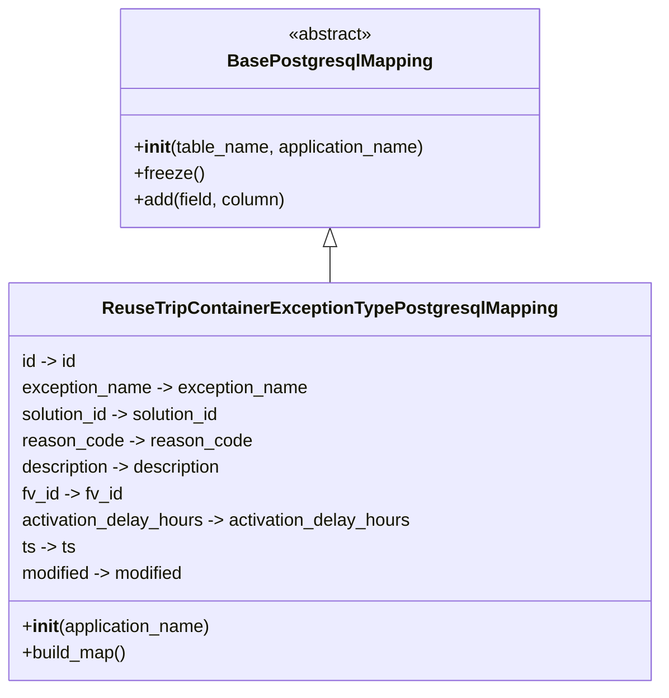

# Diagram: container_tracking_core/container_tracking_service/container_tracking_service/persistence_adapter/postgresql/ReuseTripContainerExceptionTypePostgresqlMapping.py

> Auto-generated by Obscura crawlers

## Mermaid

### SVG

<svg id="container" width="595.3359375" xmlns="http://www.w3.org/2000/svg" class="classDiagram" height="624" viewBox="0 0 595.3359375 624" role="graphics-document document" aria-roledescription="class"><g><defs><marker id="container_class-aggregationStart" class="marker aggregation class" refX="18" refY="7" markerWidth="190" markerHeight="240" orient="auto"><path d="M 18,7 L9,13 L1,7 L9,1 Z"></path></marker></defs><defs><marker id="container_class-aggregationEnd" class="marker aggregation class" refX="1" refY="7" markerWidth="20" markerHeight="28" orient="auto"><path d="M 18,7 L9,13 L1,7 L9,1 Z"></path></marker></defs><defs><marker id="container_class-extensionStart" class="marker extension class" refX="18" refY="7" markerWidth="190" markerHeight="240" orient="auto"><path d="M 1,7 L18,13 V 1 Z"></path></marker></defs><defs><marker id="container_class-extensionEnd" class="marker extension class" refX="1" refY="7" markerWidth="20" markerHeight="28" orient="auto"><path d="M 1,1 V 13 L18,7 Z"></path></marker></defs><defs><marker id="container_class-compositionStart" class="marker composition class" refX="18" refY="7" markerWidth="190" markerHeight="240" orient="auto"><path d="M 18,7 L9,13 L1,7 L9,1 Z"></path></marker></defs><defs><marker id="container_class-compositionEnd" class="marker composition class" refX="1" refY="7" markerWidth="20" markerHeight="28" orient="auto"><path d="M 18,7 L9,13 L1,7 L9,1 Z"></path></marker></defs><defs><marker id="container_class-dependencyStart" class="marker dependency class" refX="6" refY="7" markerWidth="190" markerHeight="240" orient="auto"><path d="M 5,7 L9,13 L1,7 L9,1 Z"></path></marker></defs><defs><marker id="container_class-dependencyEnd" class="marker dependency class" refX="13" refY="7" markerWidth="20" markerHeight="28" orient="auto"><path d="M 18,7 L9,13 L14,7 L9,1 Z"></path></marker></defs><defs><marker id="container_class-lollipopStart" class="marker lollipop class" refX="13" refY="7" markerWidth="190" markerHeight="240" orient="auto"><circle stroke="black" fill="transparent" cx="7" cy="7" r="6"></circle></marker></defs><defs><marker id="container_class-lollipopEnd" class="marker lollipop class" refX="1" refY="7" markerWidth="190" markerHeight="240" orient="auto"><circle stroke="black" fill="transparent" cx="7" cy="7" r="6"></circle></marker></defs><g class="root"><g class="clusters"></g><g class="edgePaths"><path d="M297.668,223.25L297.668,224.542C297.668,225.833,297.668,228.417,297.668,233.875C297.668,239.333,297.668,247.667,297.668,251.833L297.668,256" id="id_BasePostgresqlMapping_ReuseTripContainerExceptionTypePostgresqlMapping_1" class="edge-thickness-normal edge-pattern-solid relation" style=";;;" data-edge="true" data-et="edge" data-id="id_BasePostgresqlMapping_ReuseTripContainerExceptionTypePostgresqlMapping_1" data-points="W3sieCI6Mjk3LjY2Nzk2ODc1LCJ5IjoyMDZ9LHsieCI6Mjk3LjY2Nzk2ODc1LCJ5IjoyMzF9LHsieCI6Mjk3LjY2Nzk2ODc1LCJ5IjoyNTZ9XQ==" marker-start="url(#container_class-extensionStart)"></path></g><g class="edgeLabels"><g class="edgeLabel"><g class="label" data-id="id_BasePostgresqlMapping_ReuseTripContainerExceptionTypePostgresqlMapping_1" transform="translate(0, 0)"><foreignObject width="0" height="0">

</foreignObject></g></g></g><g class="nodes"><g class="node default" id="classId-BasePostgresqlMapping-0" transform="translate(297.66796875, 107)"><g class="basic label-container"><path d="M-189.6484375 -99 L189.6484375 -99 L189.6484375 99 L-189.6484375 99" stroke="none" stroke-width="0" fill="#ECECFF" style=""></path><path d="M-189.6484375 -99 C-102.60424092823683 -99, -15.560044356473668 -99, 189.6484375 -99 M-189.6484375 -99 C-64.28848311314226 -99, 61.071471273715474 -99, 189.6484375 -99 M189.6484375 -99 C189.6484375 -19.88926581766232, 189.6484375 59.22146836467536, 189.6484375 99 M189.6484375 -99 C189.6484375 -52.92064961226441, 189.6484375 -6.841299224528825, 189.6484375 99 M189.6484375 99 C61.25123252555687 99, -67.14597244888625 99, -189.6484375 99 M189.6484375 99 C73.65653701013603 99, -42.33536347972793 99, -189.6484375 99 M-189.6484375 99 C-189.6484375 24.307594278809418, -189.6484375 -50.384811442381164, -189.6484375 -99 M-189.6484375 99 C-189.6484375 46.191053575445196, -189.6484375 -6.617892849109609, -189.6484375 -99" stroke="#9370DB" stroke-width="1.3" fill="none" stroke-dasharray="0 0" style=""></path></g><g class="annotation-group text" transform="translate(-38.609375, -75)"><g class="label" style="" transform="translate(0,-12)"><foreignObject width="77.21875" height="24">

«abstract»

</foreignObject></g></g><g class="label-group text" transform="translate(-87.921875, -51)"><g class="label" style="font-weight: bolder" transform="translate(0,-12)"><foreignObject width="175.84375" height="24">

BasePostgresqlMapping

</foreignObject></g></g><g class="members-group text" transform="translate(-177.6484375, -3)"></g><g class="methods-group text" transform="translate(-177.6484375, 27)"><g class="label" style="" transform="translate(0,-12)"><foreignObject width="267.375" height="24">

+<strong>init</strong>(table_name, application_name)

</foreignObject></g><g class="label" style="" transform="translate(0,12)"><foreignObject width="62.109375" height="24">

+freeze()

</foreignObject></g><g class="label" style="" transform="translate(0,36)"><foreignObject width="139.890625" height="24">

+add(field, column)

</foreignObject></g></g><g class="divider" style=""><path d="M-189.6484375 -27 C-102.39096706207023 -27, -15.133496624140463 -27, 189.6484375 -27 M-189.6484375 -27 C-91.61171333644398 -27, 6.4250108271120325 -27, 189.6484375 -27" stroke="#9370DB" stroke-width="1.3" fill="none" stroke-dasharray="0 0" style=""></path></g><g class="divider" style=""><path d="M-189.6484375 -3 C-88.42298264354706 -3, 12.802472212905883 -3, 189.6484375 -3 M-189.6484375 -3 C-62.00058529981281 -3, 65.64726690037438 -3, 189.6484375 -3" stroke="#9370DB" stroke-width="1.3" fill="none" stroke-dasharray="0 0" style=""></path></g></g><g class="node default" id="classId-ReuseTripContainerExceptionTypePostgresqlMapping-1" transform="translate(297.66796875, 436)"><g class="basic label-container"><path d="M-289.66796875 -180 L289.66796875 -180 L289.66796875 180 L-289.66796875 180" stroke="none" stroke-width="0" fill="#ECECFF" style=""></path><path d="M-289.66796875 -180 C-71.04222089899841 -180, 147.58352695200318 -180, 289.66796875 -180 M-289.66796875 -180 C-71.25419886279008 -180, 147.15957102441985 -180, 289.66796875 -180 M289.66796875 -180 C289.66796875 -80.54082921941497, 289.66796875 18.918341561170053, 289.66796875 180 M289.66796875 -180 C289.66796875 -48.82877531147372, 289.66796875 82.34244937705256, 289.66796875 180 M289.66796875 180 C61.996292739020475 180, -165.67538327195905 180, -289.66796875 180 M289.66796875 180 C89.90880682466238 180, -109.85035510067524 180, -289.66796875 180 M-289.66796875 180 C-289.66796875 55.04895044286849, -289.66796875 -69.90209911426302, -289.66796875 -180 M-289.66796875 180 C-289.66796875 67.66163148372496, -289.66796875 -44.67673703255008, -289.66796875 -180" stroke="#9370DB" stroke-width="1.3" fill="none" stroke-dasharray="0 0" style=""></path></g><g class="annotation-group text" transform="translate(0, -156)"></g><g class="label-group text" transform="translate(-195.4453125, -156)"><g class="label" style="font-weight: bolder" transform="translate(0,-12)"><foreignObject width="390.890625" height="24">

ReuseTripContainerExceptionTypePostgresqlMapping

</foreignObject></g></g><g class="members-group text" transform="translate(-277.66796875, -108)"><g class="label" style="" transform="translate(0,-12)"><foreignObject width="51.09375" height="24">

id -&gt; id

</foreignObject></g><g class="label" style="" transform="translate(0,12)"><foreignObject width="262.109375" height="24">

exception_name -&gt; exception_name

</foreignObject></g><g class="label" style="" transform="translate(0,36)"><foreignObject width="187.390625" height="24">

solution_id -&gt; solution_id

</foreignObject></g><g class="label" style="" transform="translate(0,60)"><foreignObject width="206.84375" height="24">

reason_code -&gt; reason_code

</foreignObject></g><g class="label" style="" transform="translate(0,84)"><foreignObject width="188.15625" height="24">

description -&gt; description

</foreignObject></g><g class="label" style="" transform="translate(0,108)"><foreignObject width="93.234375" height="24">

fv_id -&gt; fv_id

</foreignObject></g><g class="label" style="" transform="translate(0,132)"><foreignObject width="359.890625" height="24">

activation_delay_hours -&gt; activation_delay_hours

</foreignObject></g><g class="label" style="" transform="translate(0,156)"><foreignObject width="49.4375" height="24">

ts -&gt; ts

</foreignObject></g><g class="label" style="" transform="translate(0,180)"><foreignObject width="152.1875" height="24">

modified -&gt; modified

</foreignObject></g></g><g class="methods-group text" transform="translate(-277.66796875, 132)"><g class="label" style="" transform="translate(0,-12)"><foreignObject width="173.734375" height="24">

+<strong>init</strong>(application_name)

</foreignObject></g><g class="label" style="" transform="translate(0,12)"><foreignObject width="96.109375" height="24">

+build_map()

</foreignObject></g></g><g class="divider" style=""><path d="M-289.66796875 -132 C-165.71801531823073 -132, -41.76806188646145 -132, 289.66796875 -132 M-289.66796875 -132 C-169.42974623371845 -132, -49.19152371743692 -132, 289.66796875 -132" stroke="#9370DB" stroke-width="1.3" fill="none" stroke-dasharray="0 0" style=""></path></g><g class="divider" style=""><path d="M-289.66796875 108 C-145.16272286020433 108, -0.657476970408652 108, 289.66796875 108 M-289.66796875 108 C-77.5393137908936 108, 134.5893411682128 108, 289.66796875 108" stroke="#9370DB" stroke-width="1.3" fill="none" stroke-dasharray="0 0" style=""></path></g></g></g></g></g></svg>
