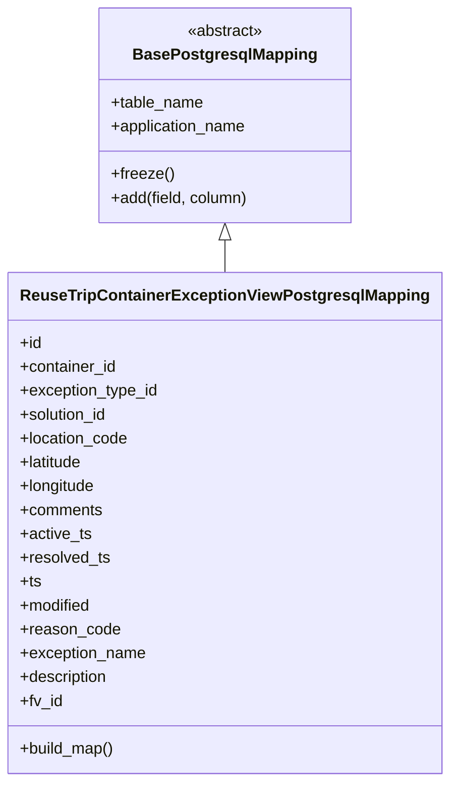
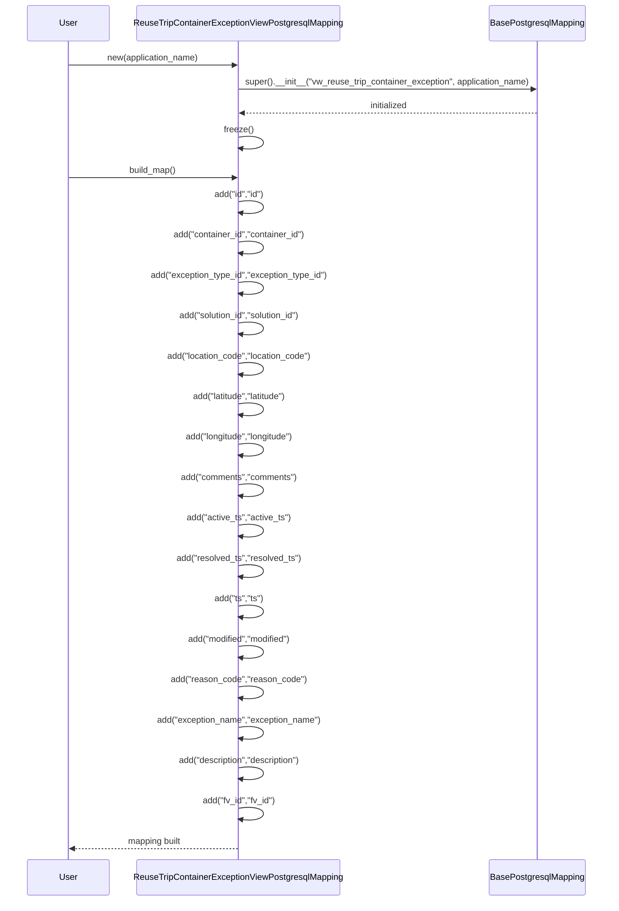

# Diagram: container_tracking_core/container_tracking_service/container_tracking_service/persistence_adapter/postgresql/ReuseTripContainerExceptionViewPostgresqlMapping.py

> Auto-generated by Obscura crawlers

## Diagram 1

### SVG

<svg id="container" width="430.671875" xmlns="http://www.w3.org/2000/svg" class="classDiagram" height="786" viewBox="0 0 430.671875 786" role="graphics-document document" aria-roledescription="class"><g><defs><marker id="container_class-aggregationStart" class="marker aggregation class" refX="18" refY="7" markerWidth="190" markerHeight="240" orient="auto"><path d="M 18,7 L9,13 L1,7 L9,1 Z"></path></marker></defs><defs><marker id="container_class-aggregationEnd" class="marker aggregation class" refX="1" refY="7" markerWidth="20" markerHeight="28" orient="auto"><path d="M 18,7 L9,13 L1,7 L9,1 Z"></path></marker></defs><defs><marker id="container_class-extensionStart" class="marker extension class" refX="18" refY="7" markerWidth="190" markerHeight="240" orient="auto"><path d="M 1,7 L18,13 V 1 Z"></path></marker></defs><defs><marker id="container_class-extensionEnd" class="marker extension class" refX="1" refY="7" markerWidth="20" markerHeight="28" orient="auto"><path d="M 1,1 V 13 L18,7 Z"></path></marker></defs><defs><marker id="container_class-compositionStart" class="marker composition class" refX="18" refY="7" markerWidth="190" markerHeight="240" orient="auto"><path d="M 18,7 L9,13 L1,7 L9,1 Z"></path></marker></defs><defs><marker id="container_class-compositionEnd" class="marker composition class" refX="1" refY="7" markerWidth="20" markerHeight="28" orient="auto"><path d="M 18,7 L9,13 L1,7 L9,1 Z"></path></marker></defs><defs><marker id="container_class-dependencyStart" class="marker dependency class" refX="6" refY="7" markerWidth="190" markerHeight="240" orient="auto"><path d="M 5,7 L9,13 L1,7 L9,1 Z"></path></marker></defs><defs><marker id="container_class-dependencyEnd" class="marker dependency class" refX="13" refY="7" markerWidth="20" markerHeight="28" orient="auto"><path d="M 18,7 L9,13 L14,7 L9,1 Z"></path></marker></defs><defs><marker id="container_class-lollipopStart" class="marker lollipop class" refX="13" refY="7" markerWidth="190" markerHeight="240" orient="auto"><circle stroke="black" fill="transparent" cx="7" cy="7" r="6"></circle></marker></defs><defs><marker id="container_class-lollipopEnd" class="marker lollipop class" refX="1" refY="7" markerWidth="190" markerHeight="240" orient="auto"><circle stroke="black" fill="transparent" cx="7" cy="7" r="6"></circle></marker></defs><g class="root"><g class="clusters"></g><g class="edgePaths"><path d="M215.336,241.25L215.336,242.542C215.336,243.833,215.336,246.417,215.336,251.875C215.336,257.333,215.336,265.667,215.336,269.833L215.336,274" id="id_BasePostgresqlMapping_ReuseTripContainerExceptionViewPostgresqlMapping_1" class="edge-thickness-normal edge-pattern-solid relation" style=";;;" data-edge="true" data-et="edge" data-id="id_BasePostgresqlMapping_ReuseTripContainerExceptionViewPostgresqlMapping_1" data-points="W3sieCI6MjE1LjMzNTkzNzUsInkiOjIyNH0seyJ4IjoyMTUuMzM1OTM3NSwieSI6MjQ5fSx7IngiOjIxNS4zMzU5Mzc1LCJ5IjoyNzR9XQ==" marker-start="url(#container_class-extensionStart)"></path></g><g class="edgeLabels"><g class="edgeLabel"><g class="label" data-id="id_BasePostgresqlMapping_ReuseTripContainerExceptionViewPostgresqlMapping_1" transform="translate(0, 0)"><foreignObject width="0" height="0">

</foreignObject></g></g></g><g class="nodes"><g class="node default" id="classId-BasePostgresqlMapping-0" transform="translate(215.3359375, 116)"><g class="basic label-container"><path d="M-125.90625 -108 L125.90625 -108 L125.90625 108 L-125.90625 108" stroke="none" stroke-width="0" fill="#ECECFF" style=""></path><path d="M-125.90625 -108 C-67.44374931848182 -108, -8.981248636963628 -108, 125.90625 -108 M-125.90625 -108 C-53.08243707697997 -108, 19.741375846040057 -108, 125.90625 -108 M125.90625 -108 C125.90625 -63.71285762375775, 125.90625 -19.425715247515498, 125.90625 108 M125.90625 -108 C125.90625 -24.65128552024251, 125.90625 58.69742895951498, 125.90625 108 M125.90625 108 C73.49563780100263 108, 21.08502560200526 108, -125.90625 108 M125.90625 108 C63.183219208871094 108, 0.460188417742188 108, -125.90625 108 M-125.90625 108 C-125.90625 27.229910793870047, -125.90625 -53.540178412259905, -125.90625 -108 M-125.90625 108 C-125.90625 56.55014300085193, -125.90625 5.100286001703864, -125.90625 -108" stroke="#9370DB" stroke-width="1.3" fill="none" stroke-dasharray="0 0" style=""></path></g><g class="annotation-group text" transform="translate(-38.609375, -84)"><g class="label" style="" transform="translate(0,-12)"><foreignObject width="77.21875" height="24">

«abstract»

</foreignObject></g></g><g class="label-group text" transform="translate(-87.921875, -60)"><g class="label" style="font-weight: bolder" transform="translate(0,-12)"><foreignObject width="175.84375" height="24">

BasePostgresqlMapping

</foreignObject></g></g><g class="members-group text" transform="translate(-113.90625, -12)"><g class="label" style="" transform="translate(0,-12)"><foreignObject width="93.625" height="24">

+table_name

</foreignObject></g><g class="label" style="" transform="translate(0,12)"><foreignObject width="138.703125" height="24">

+application_name

</foreignObject></g></g><g class="methods-group text" transform="translate(-113.90625, 60)"><g class="label" style="" transform="translate(0,-12)"><foreignObject width="62.109375" height="24">

+freeze()

</foreignObject></g><g class="label" style="" transform="translate(0,12)"><foreignObject width="139.890625" height="24">

+add(field, column)

</foreignObject></g></g><g class="divider" style=""><path d="M-125.90625 -36 C-31.14900174313405 -36, 63.6082465137319 -36, 125.90625 -36 M-125.90625 -36 C-40.377652357140406 -36, 45.15094528571919 -36, 125.90625 -36" stroke="#9370DB" stroke-width="1.3" fill="none" stroke-dasharray="0 0" style=""></path></g><g class="divider" style=""><path d="M-125.90625 36 C-58.444239104276974 36, 9.017771791446052 36, 125.90625 36 M-125.90625 36 C-73.47000459473105 36, -21.033759189462103 36, 125.90625 36" stroke="#9370DB" stroke-width="1.3" fill="none" stroke-dasharray="0 0" style=""></path></g></g><g class="node default" id="classId-ReuseTripContainerExceptionViewPostgresqlMapping-1" transform="translate(215.3359375, 526)"><g class="basic label-container"><path d="M-207.3359375 -252 L207.3359375 -252 L207.3359375 252 L-207.3359375 252" stroke="none" stroke-width="0" fill="#ECECFF" style=""></path><path d="M-207.3359375 -252 C-111.83114842402343 -252, -16.32635934804685 -252, 207.3359375 -252 M-207.3359375 -252 C-79.93519280907682 -252, 47.46555188184635 -252, 207.3359375 -252 M207.3359375 -252 C207.3359375 -64.4331539086019, 207.3359375 123.13369218279621, 207.3359375 252 M207.3359375 -252 C207.3359375 -144.82157237208986, 207.3359375 -37.64314474417975, 207.3359375 252 M207.3359375 252 C94.24882115718763 252, -18.83829518562473 252, -207.3359375 252 M207.3359375 252 C77.06964536524339 252, -53.19664676951322 252, -207.3359375 252 M-207.3359375 252 C-207.3359375 119.48552176981121, -207.3359375 -13.028956460377572, -207.3359375 -252 M-207.3359375 252 C-207.3359375 113.45817315004098, -207.3359375 -25.083653699918045, -207.3359375 -252" stroke="#9370DB" stroke-width="1.3" fill="none" stroke-dasharray="0 0" style=""></path></g><g class="annotation-group text" transform="translate(0, -228)"></g><g class="label-group text" transform="translate(-195.3359375, -228)"><g class="label" style="font-weight: bolder" transform="translate(0,-12)"><foreignObject width="390.671875" height="24">

ReuseTripContainerExceptionViewPostgresqlMapping

</foreignObject></g></g><g class="members-group text" transform="translate(-195.3359375, -180)"><g class="label" style="" transform="translate(0,-12)"><foreignObject width="22.078125" height="24">

+id

</foreignObject></g><g class="label" style="" transform="translate(0,12)"><foreignObject width="98.3125" height="24">

+container_id

</foreignObject></g><g class="label" style="" transform="translate(0,36)"><foreignObject width="140.609375" height="24">

+exception_type_id

</foreignObject></g><g class="label" style="" transform="translate(0,60)"><foreignObject width="90.21875" height="24">

+solution_id

</foreignObject></g><g class="label" style="" transform="translate(0,84)"><foreignObject width="110.109375" height="24">

+location_code

</foreignObject></g><g class="label" style="" transform="translate(0,108)"><foreignObject width="64.96875" height="24">

+latitude

</foreignObject></g><g class="label" style="" transform="translate(0,132)"><foreignObject width="77.53125" height="24">

+longitude

</foreignObject></g><g class="label" style="" transform="translate(0,156)"><foreignObject width="83.4375" height="24">

+comments

</foreignObject></g><g class="label" style="" transform="translate(0,180)"><foreignObject width="71.84375" height="24">

+active_ts

</foreignObject></g><g class="label" style="" transform="translate(0,204)"><foreignObject width="91.09375" height="24">

+resolved_ts

</foreignObject></g><g class="label" style="" transform="translate(0,228)"><foreignObject width="21.15625" height="24">

+ts

</foreignObject></g><g class="label" style="" transform="translate(0,252)"><foreignObject width="72.609375" height="24">

+modified

</foreignObject></g><g class="label" style="" transform="translate(0,276)"><foreignObject width="99.9375" height="24">

+reason_code

</foreignObject></g><g class="label" style="" transform="translate(0,300)"><foreignObject width="127.578125" height="24">

+exception_name

</foreignObject></g><g class="label" style="" transform="translate(0,324)"><foreignObject width="90.59375" height="24">

+description

</foreignObject></g><g class="label" style="" transform="translate(0,348)"><foreignObject width="42.90625" height="24">

+fv_id

</foreignObject></g></g><g class="methods-group text" transform="translate(-195.3359375, 228)"><g class="label" style="" transform="translate(0,-12)"><foreignObject width="96.109375" height="24">

+build_map()

</foreignObject></g></g><g class="divider" style=""><path d="M-207.3359375 -204 C-73.56353564365014 -204, 60.20886621269972 -204, 207.3359375 -204 M-207.3359375 -204 C-120.73647450467895 -204, -34.137011509357905 -204, 207.3359375 -204" stroke="#9370DB" stroke-width="1.3" fill="none" stroke-dasharray="0 0" style=""></path></g><g class="divider" style=""><path d="M-207.3359375 204 C-54.226973852867985 204, 98.88198979426403 204, 207.3359375 204 M-207.3359375 204 C-89.39765394549647 204, 28.540629609007055 204, 207.3359375 204" stroke="#9370DB" stroke-width="1.3" fill="none" stroke-dasharray="0 0" style=""></path></g></g></g></g></g></svg>

## Diagram 2

> SVG rendering failed for this diagram.
