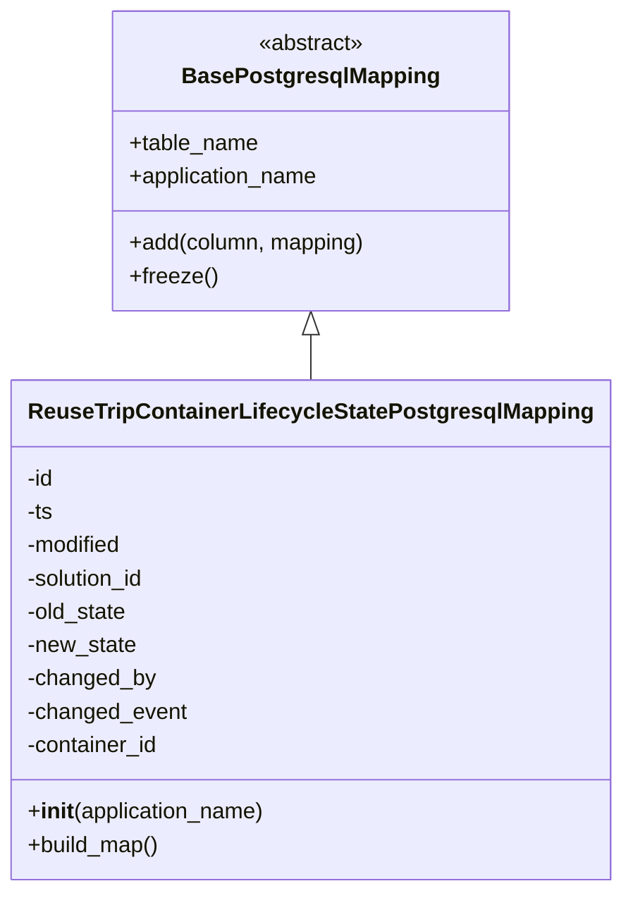

# Diagram: container_tracking_core/container_tracking_service/container_tracking_service/persistence_adapter/postgresql/ReuseTripContainerLifecycleStatePostgresqlMapping.py

> Auto-generated by Obscura crawlers

## Mermaid

### SVG

<svg id="container" width="427.53125" xmlns="http://www.w3.org/2000/svg" class="classDiagram" height="642" viewBox="0 0 427.53125 642" role="graphics-document document" aria-roledescription="class"><g><defs><marker id="container_class-aggregationStart" class="marker aggregation class" refX="18" refY="7" markerWidth="190" markerHeight="240" orient="auto"><path d="M 18,7 L9,13 L1,7 L9,1 Z"></path></marker></defs><defs><marker id="container_class-aggregationEnd" class="marker aggregation class" refX="1" refY="7" markerWidth="20" markerHeight="28" orient="auto"><path d="M 18,7 L9,13 L1,7 L9,1 Z"></path></marker></defs><defs><marker id="container_class-extensionStart" class="marker extension class" refX="18" refY="7" markerWidth="190" markerHeight="240" orient="auto"><path d="M 1,7 L18,13 V 1 Z"></path></marker></defs><defs><marker id="container_class-extensionEnd" class="marker extension class" refX="1" refY="7" markerWidth="20" markerHeight="28" orient="auto"><path d="M 1,1 V 13 L18,7 Z"></path></marker></defs><defs><marker id="container_class-compositionStart" class="marker composition class" refX="18" refY="7" markerWidth="190" markerHeight="240" orient="auto"><path d="M 18,7 L9,13 L1,7 L9,1 Z"></path></marker></defs><defs><marker id="container_class-compositionEnd" class="marker composition class" refX="1" refY="7" markerWidth="20" markerHeight="28" orient="auto"><path d="M 18,7 L9,13 L1,7 L9,1 Z"></path></marker></defs><defs><marker id="container_class-dependencyStart" class="marker dependency class" refX="6" refY="7" markerWidth="190" markerHeight="240" orient="auto"><path d="M 5,7 L9,13 L1,7 L9,1 Z"></path></marker></defs><defs><marker id="container_class-dependencyEnd" class="marker dependency class" refX="13" refY="7" markerWidth="20" markerHeight="28" orient="auto"><path d="M 18,7 L9,13 L14,7 L9,1 Z"></path></marker></defs><defs><marker id="container_class-lollipopStart" class="marker lollipop class" refX="13" refY="7" markerWidth="190" markerHeight="240" orient="auto"><circle stroke="black" fill="transparent" cx="7" cy="7" r="6"></circle></marker></defs><defs><marker id="container_class-lollipopEnd" class="marker lollipop class" refX="1" refY="7" markerWidth="190" markerHeight="240" orient="auto"><circle stroke="black" fill="transparent" cx="7" cy="7" r="6"></circle></marker></defs><g class="root"><g class="clusters"></g><g class="edgePaths"><path d="M213.766,241.25L213.766,242.542C213.766,243.833,213.766,246.417,213.766,251.875C213.766,257.333,213.766,265.667,213.766,269.833L213.766,274" id="id_BasePostgresqlMapping_ReuseTripContainerLifecycleStatePostgresqlMapping_1" class="edge-thickness-normal edge-pattern-solid relation" style=";;;" data-edge="true" data-et="edge" data-id="id_BasePostgresqlMapping_ReuseTripContainerLifecycleStatePostgresqlMapping_1" data-points="W3sieCI6MjEzLjc2NTYyNSwieSI6MjI0fSx7IngiOjIxMy43NjU2MjUsInkiOjI0OX0seyJ4IjoyMTMuNzY1NjI1LCJ5IjoyNzR9XQ==" marker-start="url(#container_class-extensionStart)"></path></g><g class="edgeLabels"><g class="edgeLabel"><g class="label" data-id="id_BasePostgresqlMapping_ReuseTripContainerLifecycleStatePostgresqlMapping_1" transform="translate(0, 0)"><foreignObject width="0" height="0">

</foreignObject></g></g></g><g class="nodes"><g class="node default" id="classId-BasePostgresqlMapping-0" transform="translate(213.765625, 116)"><g class="basic label-container"><path d="M-141.6796875 -108 L141.6796875 -108 L141.6796875 108 L-141.6796875 108" stroke="none" stroke-width="0" fill="#ECECFF" style=""></path><path d="M-141.6796875 -108 C-74.3997529090229 -108, -7.1198183180457875 -108, 141.6796875 -108 M-141.6796875 -108 C-65.86517462250674 -108, 9.949338254986515 -108, 141.6796875 -108 M141.6796875 -108 C141.6796875 -57.32689317564301, 141.6796875 -6.653786351286016, 141.6796875 108 M141.6796875 -108 C141.6796875 -56.54751591831851, 141.6796875 -5.09503183663702, 141.6796875 108 M141.6796875 108 C60.54334802516158 108, -20.592991449676845 108, -141.6796875 108 M141.6796875 108 C36.68560530149311 108, -68.30847689701378 108, -141.6796875 108 M-141.6796875 108 C-141.6796875 30.17790436334903, -141.6796875 -47.64419127330194, -141.6796875 -108 M-141.6796875 108 C-141.6796875 35.64105243419999, -141.6796875 -36.71789513160002, -141.6796875 -108" stroke="#9370DB" stroke-width="1.3" fill="none" stroke-dasharray="0 0" style=""></path></g><g class="annotation-group text" transform="translate(-38.609375, -84)"><g class="label" style="" transform="translate(0,-12)"><foreignObject width="77.21875" height="24">

«abstract»

</foreignObject></g></g><g class="label-group text" transform="translate(-87.921875, -60)"><g class="label" style="font-weight: bolder" transform="translate(0,-12)"><foreignObject width="175.84375" height="24">

BasePostgresqlMapping

</foreignObject></g></g><g class="members-group text" transform="translate(-129.6796875, -12)"><g class="label" style="" transform="translate(0,-12)"><foreignObject width="93.625" height="24">

+table_name

</foreignObject></g><g class="label" style="" transform="translate(0,12)"><foreignObject width="138.703125" height="24">

+application_name

</foreignObject></g></g><g class="methods-group text" transform="translate(-129.6796875, 60)"><g class="label" style="" transform="translate(0,-12)"><foreignObject width="171.4375" height="24">

+add(column, mapping)

</foreignObject></g><g class="label" style="" transform="translate(0,12)"><foreignObject width="62.109375" height="24">

+freeze()

</foreignObject></g></g><g class="divider" style=""><path d="M-141.6796875 -36 C-29.244705019982746 -36, 83.19027746003451 -36, 141.6796875 -36 M-141.6796875 -36 C-32.12480256374138 -36, 77.43008237251723 -36, 141.6796875 -36" stroke="#9370DB" stroke-width="1.3" fill="none" stroke-dasharray="0 0" style=""></path></g><g class="divider" style=""><path d="M-141.6796875 36 C-36.62284883879968 36, 68.43398982240063 36, 141.6796875 36 M-141.6796875 36 C-53.75674108211527 36, 34.16620533576946 36, 141.6796875 36" stroke="#9370DB" stroke-width="1.3" fill="none" stroke-dasharray="0 0" style=""></path></g></g><g class="node default" id="classId-ReuseTripContainerLifecycleStatePostgresqlMapping-1" transform="translate(213.765625, 454)"><g class="basic label-container"><path d="M-205.765625 -180 L205.765625 -180 L205.765625 180 L-205.765625 180" stroke="none" stroke-width="0" fill="#ECECFF" style=""></path><path d="M-205.765625 -180 C-105.22414338916366 -180, -4.682661778327315 -180, 205.765625 -180 M-205.765625 -180 C-90.298467379645 -180, 25.168690240709992 -180, 205.765625 -180 M205.765625 -180 C205.765625 -52.60858570357125, 205.765625 74.7828285928575, 205.765625 180 M205.765625 -180 C205.765625 -81.69100366505016, 205.765625 16.617992669899678, 205.765625 180 M205.765625 180 C48.89830113078159 180, -107.96902273843682 180, -205.765625 180 M205.765625 180 C77.52757677761193 180, -50.71047144477615 180, -205.765625 180 M-205.765625 180 C-205.765625 89.76927111311252, -205.765625 -0.4614577737749528, -205.765625 -180 M-205.765625 180 C-205.765625 72.91985065280407, -205.765625 -34.160298694391855, -205.765625 -180" stroke="#9370DB" stroke-width="1.3" fill="none" stroke-dasharray="0 0" style=""></path></g><g class="annotation-group text" transform="translate(0, -156)"></g><g class="label-group text" transform="translate(-193.765625, -156)"><g class="label" style="font-weight: bolder" transform="translate(0,-12)"><foreignObject width="387.53125" height="24">

ReuseTripContainerLifecycleStatePostgresqlMapping

</foreignObject></g></g><g class="members-group text" transform="translate(-193.765625, -108)"><g class="label" style="" transform="translate(0,-12)"><foreignObject width="20.53125" height="24">

-id

</foreignObject></g><g class="label" style="" transform="translate(0,12)"><foreignObject width="19.625" height="24">

-ts

</foreignObject></g><g class="label" style="" transform="translate(0,36)"><foreignObject width="71.078125" height="24">

-modified

</foreignObject></g><g class="label" style="" transform="translate(0,60)"><foreignObject width="88.6875" height="24">

-solution_id

</foreignObject></g><g class="label" style="" transform="translate(0,84)"><foreignObject width="74.390625" height="24">

-old_state

</foreignObject></g><g class="label" style="" transform="translate(0,108)"><foreignObject width="80.125" height="24">

-new_state

</foreignObject></g><g class="label" style="" transform="translate(0,132)"><foreignObject width="93.546875" height="24">

-changed_by

</foreignObject></g><g class="label" style="" transform="translate(0,156)"><foreignObject width="116.25" height="24">

-changed_event

</foreignObject></g><g class="label" style="" transform="translate(0,180)"><foreignObject width="96.78125" height="24">

-container_id

</foreignObject></g></g><g class="methods-group text" transform="translate(-193.765625, 132)"><g class="label" style="" transform="translate(0,-12)"><foreignObject width="173.734375" height="24">

+<strong>init</strong>(application_name)

</foreignObject></g><g class="label" style="" transform="translate(0,12)"><foreignObject width="96.109375" height="24">

+build_map()

</foreignObject></g></g><g class="divider" style=""><path d="M-205.765625 -132 C-87.35047555732432 -132, 31.064673885351368 -132, 205.765625 -132 M-205.765625 -132 C-79.60062180118041 -132, 46.56438139763918 -132, 205.765625 -132" stroke="#9370DB" stroke-width="1.3" fill="none" stroke-dasharray="0 0" style=""></path></g><g class="divider" style=""><path d="M-205.765625 108 C-76.77030088217884 108, 52.22502323564231 108, 205.765625 108 M-205.765625 108 C-85.89347845868524 108, 33.978668082629525 108, 205.765625 108" stroke="#9370DB" stroke-width="1.3" fill="none" stroke-dasharray="0 0" style=""></path></g></g></g></g></g></svg>
